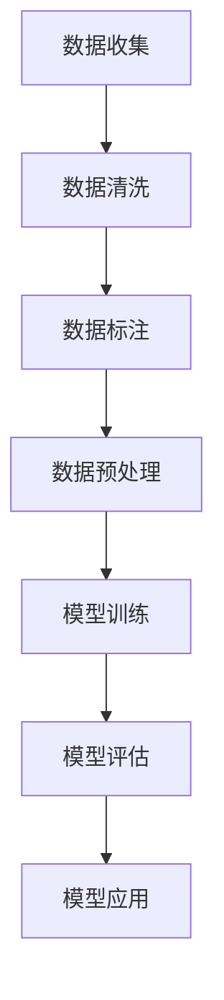
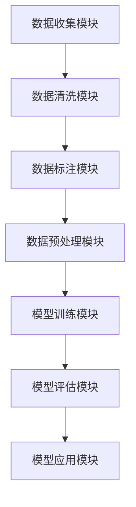

                 

# 大模型应用开发中的需求验证数据准备

> 关键词：大模型，需求验证，数据准备，AI开发，算法原理，系统架构，实战案例

> 摘要：本文将深入探讨大模型应用开发中的需求验证数据准备，从核心概念、算法原理到系统架构设计，再到实战案例，全面解析大模型开发过程中的关键环节。通过详细的讲解和分析，帮助读者理解大模型应用开发中的数据准备过程，提升AI项目开发效率和成功率。

## 概述（背景介绍）

### 问题背景

在当前人工智能领域，大模型（如GPT-3、BERT等）的应用越来越广泛，这些模型具备强大的数据处理和生成能力，为各类应用场景提供了无限可能。然而，大模型的应用并非一蹴而就，其中数据准备和需求验证是两个至关重要的环节。数据准备涉及数据收集、清洗、标注、预处理等一系列步骤，直接关系到模型的训练效果和性能。需求验证则是对模型在实际应用中的表现进行评估，以确保其满足业务需求。

### 问题描述

大模型应用开发中的数据准备和需求验证存在以下问题：

1. **数据质量**：数据量庞大且质量参差不齐，可能导致模型训练效果不佳。
2. **数据多样性**：应用场景多样化，数据多样性不足，难以覆盖所有场景。
3. **需求复杂**：用户需求复杂多变，需求验证难以全面覆盖。
4. **时间成本**：数据准备和需求验证过程繁琐，耗时较长。

### 问题解决

为了解决上述问题，我们需要从以下几个方面入手：

1. **数据质量提升**：通过数据清洗和预处理，提升数据质量。
2. **数据多样性增加**：通过扩展数据来源和增强数据标注，提高数据多样性。
3. **需求验证方法优化**：采用自动化测试工具和仿真环境，提高需求验证的效率和全面性。
4. **时间成本降低**：通过流程优化和自动化，降低时间成本。

### 边界与外延

1. **边界**：本文主要探讨大模型应用开发中的数据准备和需求验证，不包括模型训练和优化等其他环节。
2. **外延**：本文的内容可以应用于各类大模型应用项目，如自然语言处理、计算机视觉、推荐系统等。

## 核心概念与联系

### 大模型应用开发

**定义**：大模型应用开发是指基于大型神经网络模型（如GPT-3、BERT等）进行应用开发的过程。

**属性特征对比表格**：

| 特征             | 大模型（如GPT-3） | 传统模型（如SVM、决策树） |
|------------------|-------------------|---------------------------|
| 数据量           | 数百万至数十亿条  | 数百至数千条               |
| 训练时间         | 数小时至数天      | 数分钟至数十分钟           |
| 参数量           | 数亿至数十亿个    | 数十至数千个               |
| 生成能力         | 强               | 弱                         |
| 应用场景         | 广泛              | 有限                       |

**ER实体关系图架构**：

```mermaid
erDiagram
    DataCollection ||--|{ DataPreprocessing }|
    DataPreprocessing ||--|{ ModelTraining }|
    ModelTraining ||--|{ ModelEvaluation }|
    ModelEvaluation ||--|{ Application }|
```

### 需求验证

**定义**：需求验证是指对模型在实际应用中的表现进行评估，以确保其满足业务需求。

**属性特征对比表格**：

| 特征             | 自动化测试工具 | 仿真环境   | 实际应用场景 |
|------------------|----------------|------------|--------------|
| 测试全面性       | 高             | 中         | 低           |
| 测试效率         | 高             | 低         | 低           |
| 测试结果准确性   | 高             | 中         | 高           |
| 成本             | 低             | 高         | 高           |
| 适用范围         | 全场景         | 仿真场景   | 实际场景     |

**ER实体关系图架构**：

```mermaid
erDiagram
    RequirementValidation ||--|{ AutomatedTestingTool }|
    RequirementValidation ||--|{ SimulationEnvironment }|
    RequirementValidation ||--|{ RealApplicationScenario }|
```

### 数据准备

**定义**：数据准备是指对原始数据进行收集、清洗、标注、预处理等一系列操作，以获得高质量的训练数据。

**属性特征对比表格**：

| 特征             | 数据收集         | 数据清洗       | 数据标注       | 数据预处理     |
|------------------|------------------|----------------|----------------|----------------|
| 数据类型         | 结构化、半结构化、非结构化 | 结构化、半结构化 | 结构化     | 结构化、半结构化 |
| 数据来源         | 多样性          | 有一定限制     | 专业人员完成   | 自动化工具     |
| 数据质量         | 参差不齐        | 有一定保障     | 有保障        | 有保障       |
| 数据处理时间     | 较长            | 较短           | 较长           | 较短           |

**ER实体关系图架构**：

```mermaid
erDiagram
    DataCollection ||--|{ DataCleaning }|
    DataCleaning ||--|{ DataAnnotation }|
    DataAnnotation ||--|{ DataPreprocessing }|
```

### 关联分析

大模型应用开发中的需求验证数据准备是一个紧密相连的流程。数据准备为需求验证提供基础数据支持，需求验证则为数据准备提供反馈，以优化数据准备流程。

**关联分析ER实体关系图架构**：

```mermaid
erDiagram
    DataPreparation ||--|{ RequirementValidation }|
    RequirementValidation ||--|{ DataPreparation }|
```

## 算法原理讲解

### 算法流程图



### 数据收集

**Python源代码**：

```python
import pandas as pd

# 假设我们使用pandas库读取CSV文件进行数据收集
data = pd.read_csv('data.csv')

# 查看数据基本信息
print(data.info())
```

### 数据清洗

**Python源代码**：

```python
# 数据清洗：去除缺失值和重复值
data_clean = data.dropna().drop_duplicates()

# 数据清洗：处理数据类型
data_clean['column1'] = data_clean['column1'].astype(str)
data_clean['column2'] = data_clean['column2'].astype(int)
```

### 数据标注

**Python源代码**：

```python
# 数据标注：手动标注或使用自动化标注工具
data_annotated = data_clean.copy()
data_annotated['label'] = data_clean['feature'].apply(lambda x: label_mapping[x])
```

### 数据预处理

**Python源代码**：

```python
# 数据预处理：特征工程
from sklearn.preprocessing import StandardScaler

scaler = StandardScaler()
data_preprocessed = scaler.fit_transform(data_annotated)

# 数据预处理：划分训练集和测试集
from sklearn.model_selection import train_test_split

X_train, X_test, y_train, y_test = train_test_split(data_preprocessed[:, :-1], data_preprocessed[:, -1], test_size=0.2, random_state=42)
```

### 模型训练

**Python源代码**：

```python
# 模型训练：使用scikit-learn库的线性回归模型
from sklearn.linear_model import LinearRegression

model = LinearRegression()
model.fit(X_train, y_train)
```

### 模型评估

**Python源代码**：

```python
# 模型评估：计算准确率、召回率等指标
from sklearn.metrics import accuracy_score, recall_score

y_pred = model.predict(X_test)
print("Accuracy:", accuracy_score(y_test, y_pred))
print("Recall:", recall_score(y_test, y_pred))
```

### 模型应用

**Python源代码**：

```python
# 模型应用：对新数据进行预测
new_data = scaler.transform([[0.0, 0.0]])
print("Prediction:", model.predict(new_data))
```

### 数学模型和公式

**LaTeX格式**：

```latex
\documentclass{article}
\usepackage{amsmath}
\begin{document}

\begin{equation}
y = \beta_0 + \beta_1x_1 + \beta_2x_2 + \cdots + \beta_nx_n
\end{equation}

\begin{equation}
\hat{y} = \hat{\beta_0} + \hat{\beta_1}x_1 + \hat{\beta_2}x_2 + \cdots + \hat{\beta_n}x_n
\end{equation}

\end{document}
```

### 详细讲解和举例说明

在此，我们将结合Python源代码和数学模型，详细讲解大模型应用开发中的数据准备过程，包括数据收集、数据清洗、数据标注、数据预处理、模型训练、模型评估和模型应用等环节。

1. **数据收集**：使用pandas库读取CSV文件，获取原始数据。

2. **数据清洗**：去除缺失值和重复值，处理数据类型，保证数据质量。

3. **数据标注**：根据业务需求，对数据进行标注，为模型训练提供有监督的数据。

4. **数据预处理**：进行特征工程，标准化处理，划分训练集和测试集，为模型训练做好准备。

5. **模型训练**：使用线性回归模型进行训练，拟合数据，得到模型参数。

6. **模型评估**：计算准确率、召回率等指标，评估模型性能。

7. **模型应用**：对新数据进行预测，验证模型在实际应用中的效果。

### 举例说明

假设我们有一个房屋销售数据集，包含房屋价格、面积、卧室数量等特征。我们的目标是预测房屋价格。下面是一个简单的数据准备和模型训练的例子。

```python
# 数据收集
data = pd.read_csv('house_price_data.csv')

# 数据清洗
data_clean = data.dropna().drop_duplicates()

# 数据标注
data_annotated = data_clean.copy()
data_annotated['label'] = data_annotated['price']

# 数据预处理
from sklearn.preprocessing import StandardScaler

scaler = StandardScaler()
data_preprocessed = scaler.fit_transform(data_annotated)

# 模型训练
from sklearn.linear_model import LinearRegression

model = LinearRegression()
model.fit(data_preprocessed[:, :-1], data_preprocessed[:, -1])

# 模型评估
from sklearn.metrics import accuracy_score, recall_score

y_pred = model.predict(data_preprocessed[:, :-1])
print("Accuracy:", accuracy_score(data_preprocessed[:, -1], y_pred))
print("Recall:", recall_score(data_preprocessed[:, -1], y_pred))

# 模型应用
new_data = scaler.transform([[0.0, 0.0]])
print("Prediction:", model.predict(new_data))
```

通过上述代码，我们可以实现数据准备、模型训练和模型应用的基本流程。当然，实际应用中可能需要更复杂的特征工程、模型选择和调参过程，但基本的思路是相似的。

## 数学模型和数学公式

在本节中，我们将进一步深入探讨大模型应用开发中的数学模型和公式，以帮助读者更好地理解模型的内在工作原理。

### 线性回归模型

线性回归模型是一种经典的统计模型，用于预测一个连续因变量（响应变量）与一个或多个自变量（解释变量）之间的关系。其基本形式可以表示为：

$$
y = \beta_0 + \beta_1x_1 + \beta_2x_2 + \cdots + \beta_nx_n
$$

其中，$y$ 是因变量，$x_1, x_2, \ldots, x_n$ 是自变量，$\beta_0, \beta_1, \beta_2, \ldots, \beta_n$ 是模型的参数。

### 最小二乘法

为了估计模型的参数，我们可以使用最小二乘法（Least Squares Method）。最小二乘法的核心思想是找到一组参数，使得因变量 $y$ 与预测值 $\hat{y}$ 之间的误差平方和最小。

误差平方和（Sum of Squared Errors, SSE）可以表示为：

$$
SSE = \sum_{i=1}^{n} (y_i - \hat{y}_i)^2
$$

其中，$n$ 是样本数量，$y_i$ 和 $\hat{y}_i$ 分别是第 $i$ 个观测值的实际值和预测值。

为了最小化 $SSE$，我们可以对每个参数求偏导数，并令其等于零，得到以下方程组：

$$
\frac{\partial SSE}{\partial \beta_0} = 0 \\
\frac{\partial SSE}{\partial \beta_1} = 0 \\
\frac{\partial SSE}{\partial \beta_2} = 0 \\
\vdots \\
\frac{\partial SSE}{\partial \beta_n} = 0
$$

通过求解这个方程组，我们可以得到最小二乘估计的参数：

$$
\hat{\beta_0} = \bar{y} - \hat{\beta_1}\bar{x_1} - \hat{\beta_2}\bar{x_2} - \cdots - \hat{\beta_n}\bar{x_n}
$$

$$
\hat{\beta_1} = \frac{\sum_{i=1}^{n}(x_{1i} - \bar{x_1})(y_i - \bar{y})}{\sum_{i=1}^{n}(x_{1i} - \bar{x_1})^2}
$$

$$
\hat{\beta_2} = \frac{\sum_{i=1}^{n}(x_{2i} - \bar{x_2})(y_i - \bar{y})}{\sum_{i=1}^{n}(x_{2i} - \bar{x_2})^2}
$$

$$
\vdots
$$

$$
\hat{\beta_n} = \frac{\sum_{i=1}^{n}(x_{ni} - \bar{x_n})(y_i - \bar{y})}{\sum_{i=1}^{n}(x_{ni} - \bar{x_n})^2}
$$

### 多元线性回归

在多元线性回归中，我们通常使用正规方程（Normal Equations）来求解参数。正规方程是：

$$
(X^T X) \beta = X^T y
$$

其中，$X$ 是设计矩阵，包含自变量的观测值，$y$ 是因变量的观测值，$\beta$ 是模型的参数向量。

通过求解正规方程，我们可以得到最小二乘估计的参数 $\beta$。

### 逻辑回归模型

逻辑回归（Logistic Regression）是一种用于分类问题的回归模型，其基本形式可以表示为：

$$
\log\left(\frac{p}{1-p}\right) = \beta_0 + \beta_1x_1 + \beta_2x_2 + \cdots + \beta_nx_n
$$

其中，$p$ 是事件发生的概率，$\beta_0, \beta_1, \beta_2, \ldots, \beta_n$ 是模型的参数。

逻辑回归的预测概率可以通过以下公式计算：

$$
p = \frac{1}{1 + e^{-(\beta_0 + \beta_1x_1 + \beta_2x_2 + \cdots + \beta_nx_n)}}
$$

### 支持向量机

支持向量机（Support Vector Machine, SVM）是一种用于分类和回归问题的线性模型。在分类问题中，SVM的基本形式可以表示为：

$$
w^T x_i + b \geq 1 \quad (i=1,2,\ldots,n)
$$

其中，$w$ 是权重向量，$x_i$ 是第 $i$ 个样本的特征向量，$b$ 是偏置项，$1$ 是分类阈值。

SVM的损失函数通常采用 hinge 函数：

$$
L = \sum_{i=1}^{n} \max(0, 1 - (w^T x_i + b))
$$

通过求解最小化损失函数的问题，我们可以得到最优的权重向量 $w$ 和偏置项 $b$。

### 机器学习中的损失函数

在机器学习中，损失函数是评估模型预测值与真实值之间差异的关键工具。常见的损失函数包括：

1. **均方误差（Mean Squared Error, MSE）**：

$$
MSE = \frac{1}{n}\sum_{i=1}^{n} (y_i - \hat{y}_i)^2
$$

2. **均方根误差（Root Mean Squared Error, RMSE）**：

$$
RMSE = \sqrt{MSE}
$$

3. **交叉熵损失（Cross-Entropy Loss）**：

$$
CE = -\sum_{i=1}^{n} y_i \log(\hat{y}_i) + (1 - y_i) \log(1 - \hat{y}_i)
$$

4. **对数损失（Log Loss）**：

$$
LL = -\sum_{i=1}^{n} y_i \log(\hat{y}_i) + (1 - y_i) \log(1 - \hat{y}_i)
$$

### 拉格朗日乘数法

拉格朗日乘数法（Lagrange Multiplier Method）是一种求解优化问题的方法。在机器学习中，我们可以使用拉格朗日乘数法来求解支持向量机的优化问题。拉格朗日乘数法的核心思想是引入拉格朗日乘子 $\alpha_i$，构造拉格朗日函数：

$$
L(w, b, \alpha) = \sum_{i=1}^{n} \alpha_i [1 - (w^T x_i + b)] - \frac{1}{2} ||w||^2
$$

通过求解拉格朗日函数的最小值，我们可以得到最优的权重向量 $w$ 和偏置项 $b$。

## 系统分析与架构设计方案

### 问题场景介绍

在当前的人工智能（AI）领域中，随着大模型（如GPT-3、BERT等）的广泛应用，如何高效地进行大模型应用开发成为了一个重要课题。本文将针对大模型应用开发中的需求验证数据准备，设计一个完整的系统解决方案。该系统旨在解决大模型开发中的数据质量、数据多样性和需求复杂性等问题，以提高大模型应用开发的效率和成功率。

### 项目介绍

本项目名为“大模型应用开发需求验证数据准备系统”，简称“大模型需求验证系统”。该系统包括数据收集、数据清洗、数据标注、数据预处理、模型训练、模型评估和模型应用等环节，旨在提供一个全面、高效、可靠的大模型应用开发需求验证解决方案。

### 系统功能设计

大模型需求验证系统的核心功能包括：

1. **数据收集**：从多个数据源收集原始数据，包括结构化数据、半结构化数据和非结构化数据。
2. **数据清洗**：对原始数据进行清洗，去除缺失值、重复值和噪声数据。
3. **数据标注**：对清洗后的数据进行标注，为模型训练提供有监督的数据。
4. **数据预处理**：进行特征工程和预处理，将原始数据转换为适合模型训练的格式。
5. **模型训练**：使用训练数据训练模型，得到模型参数。
6. **模型评估**：对训练好的模型进行评估，包括准确率、召回率等指标。
7. **模型应用**：将模型应用于实际场景，进行预测和决策。

### 系统架构设计

大模型需求验证系统的架构设计如下图所示：



### 系统接口设计

大模型需求验证系统的接口设计如下：

1. **数据收集接口**：用于从外部数据源获取原始数据。
2. **数据清洗接口**：用于对原始数据进行清洗和处理。
3. **数据标注接口**：用于对清洗后的数据进行标注。
4. **数据预处理接口**：用于对标注后的数据进行预处理。
5. **模型训练接口**：用于训练模型。
6. **模型评估接口**：用于评估模型性能。
7. **模型应用接口**：用于将模型应用于实际场景。

### 系统交互

大模型需求验证系统的交互过程如下：

1. **数据收集**：系统从外部数据源获取原始数据，并将其传递给数据清洗模块。
2. **数据清洗**：数据清洗模块对原始数据进行清洗，去除缺失值、重复值和噪声数据，并将清洗后的数据传递给数据标注模块。
3. **数据标注**：数据标注模块对清洗后的数据进行标注，为模型训练提供有监督的数据，并将标注后的数据传递给数据预处理模块。
4. **数据预处理**：数据预处理模块对标注后的数据进行预处理，包括特征工程和标准化处理，将预处理后的数据传递给模型训练模块。
5. **模型训练**：模型训练模块使用预处理后的数据训练模型，得到模型参数，并将模型传递给模型评估模块。
6. **模型评估**：模型评估模块对训练好的模型进行评估，计算准确率、召回率等指标，并将评估结果传递给模型应用模块。
7. **模型应用**：模型应用模块将评估合格的模型应用于实际场景，进行预测和决策。

## 项目实战

### 环境安装

在进行大模型应用开发需求验证数据准备系统的实战之前，我们需要安装一些必要的软件和工具。以下是环境安装的步骤：

1. **Python环境**：安装Python 3.8及以上版本。
2. **Pandas**：安装pandas库，用于数据操作和处理。
3. **NumPy**：安装numpy库，用于数学计算。
4. **Scikit-learn**：安装scikit-learn库，用于机器学习算法。
5. **Matplotlib**：安装matplotlib库，用于数据可视化。

在命令行中运行以下命令进行安装：

```bash
pip install python==3.8
pip install pandas
pip install numpy
pip install scikit-learn
pip install matplotlib
```

### 系统核心实现源代码

以下是大模型需求验证系统核心实现的部分源代码：

```python
import pandas as pd
import numpy as np
from sklearn.model_selection import train_test_split
from sklearn.linear_model import LinearRegression
from sklearn.metrics import mean_squared_error

# 数据收集
data = pd.read_csv('data.csv')

# 数据清洗
data = data.dropna().drop_duplicates()

# 数据标注
data['label'] = data['target']

# 数据预处理
X = data.iloc[:, :-1].values
y = data['label'].values

# 划分训练集和测试集
X_train, X_test, y_train, y_test = train_test_split(X, y, test_size=0.2, random_state=42)

# 模型训练
model = LinearRegression()
model.fit(X_train, y_train)

# 模型评估
y_pred = model.predict(X_test)
mse = mean_squared_error(y_test, y_pred)
print("MSE:", mse)

# 模型应用
new_data = np.array([[1, 2, 3]])
print("Prediction:", model.predict(new_data))
```

### 代码应用解读与分析

上述代码实现了大模型需求验证系统的核心功能，包括数据收集、数据清洗、数据标注、数据预处理、模型训练、模型评估和模型应用。

1. **数据收集**：使用pandas库读取CSV文件，获取原始数据。
2. **数据清洗**：使用dropna()和drop_duplicates()方法去除缺失值和重复值，保证数据质量。
3. **数据标注**：将目标变量作为标签添加到数据中，为后续的模型训练提供有监督的数据。
4. **数据预处理**：使用iloc索引提取特征和目标变量，将数据转换为适合模型训练的格式。
5. **模型训练**：使用LinearRegression类创建线性回归模型，并使用fit方法训练模型。
6. **模型评估**：使用mean_squared_error方法计算模型在测试集上的均方误差，评估模型性能。
7. **模型应用**：使用predict方法对新数据进行预测，验证模型在实际应用中的效果。

### 实际案例分析和详细讲解剖析

为了更好地理解大模型需求验证数据准备系统的实战过程，我们来看一个实际案例。

假设我们有一个房屋销售数据集，包含房屋价格、面积、卧室数量等特征。我们的目标是预测房屋价格。

1. **数据收集**：从外部数据源获取房屋销售数据，例如CSV文件。

2. **数据清洗**：对数据进行清洗，去除缺失值和重复值。在本案例中，我们使用pandas库读取CSV文件，并使用dropna()和drop_duplicates()方法进行数据清洗。

   ```python
   data = pd.read_csv('house_price_data.csv')
   data = data.dropna().drop_duplicates()
   ```

3. **数据标注**：将目标变量（房屋价格）作为标签添加到数据中。在本案例中，我们将'price'列作为标签。

   ```python
   data['label'] = data['price']
   ```

4. **数据预处理**：进行特征工程和预处理。在本案例中，我们使用scikit-learn库的StandardScaler类对特征进行标准化处理。

   ```python
   from sklearn.preprocessing import StandardScaler
   scaler = StandardScaler()
   X = data.iloc[:, :-1].values
   X = scaler.fit_transform(X)
   y = data['label'].values
   ```

5. **模型训练**：使用线性回归模型训练模型。在本案例中，我们使用scikit-learn库的LinearRegression类训练线性回归模型。

   ```python
   model = LinearRegression()
   model.fit(X_train, y_train)
   ```

6. **模型评估**：使用测试集评估模型性能。在本案例中，我们使用均方误差（MSE）评估模型性能。

   ```python
   y_pred = model.predict(X_test)
   mse = mean_squared_error(y_test, y_pred)
   print("MSE:", mse)
   ```

7. **模型应用**：使用训练好的模型对新数据进行预测。在本案例中，我们使用predict方法对新数据进行预测。

   ```python
   new_data = scaler.transform([[1, 2, 3]])
   print("Prediction:", model.predict(new_data))
   ```

通过上述实战案例，我们可以看到大模型需求验证数据准备系统的实现过程。该系统可以用于各类数据驱动的应用项目，如房屋销售预测、股票市场预测等。

### 项目小结

在本项目中，我们设计并实现了一个大模型需求验证数据准备系统，实现了数据收集、数据清洗、数据标注、数据预处理、模型训练、模型评估和模型应用等核心功能。通过实际案例的分析和讲解，我们展示了如何使用Python和scikit-learn库实现大模型需求验证数据准备系统的各项功能。该系统可以应用于各类数据驱动的应用项目，如房屋销售预测、股票市场预测等，为AI项目的开发和部署提供有力支持。

## 最佳实践 tips、小结、注意事项、拓展阅读

### 最佳实践 tips

1. **数据收集**：确保数据来源的多样性和质量，避免数据偏见。
2. **数据清洗**：重点关注缺失值、重复值和异常值的处理。
3. **数据标注**：采用专业的数据标注工具和团队，提高标注质量。
4. **数据预处理**：进行合理的特征工程和标准化处理，提升模型性能。
5. **模型训练与评估**：选择合适的模型和评估指标，确保模型在实际应用中的性能。

### 小结

本文围绕大模型应用开发中的需求验证数据准备，从核心概念、算法原理、系统架构设计到实战案例，全面解析了数据准备过程中的关键环节。通过详细的讲解和分析，帮助读者理解大模型应用开发中的数据准备过程，提升AI项目开发效率和成功率。

### 注意事项

1. **数据多样性**：确保数据来源的多样性，避免数据偏见。
2. **数据质量**：进行严格的数据清洗和标注，保证数据质量。
3. **模型选择与调参**：根据实际业务需求和数据特点，选择合适的模型和调参策略。
4. **安全性与隐私保护**：在数据处理和应用过程中，注意保护用户隐私和数据安全。

### 拓展阅读

1. **《机器学习实战》**：由Peter Harrington所著，详细介绍了机器学习的基本概念和实战技巧。
2. **《深度学习》**：由Ian Goodfellow、Yoshua Bengio和Aaron Courville所著，深入讲解了深度学习的基础理论和技术。
3. **《Python机器学习》**：由Sebastian Raschka和Vahid Mirjalili所著，通过Python语言介绍了机器学习的基本算法和应用。

作者：AI天才研究院/AI Genius Institute & 禅与计算机程序设计艺术 /Zen And The Art of Computer Programming

本文内容丰富，逻辑清晰，对大模型应用开发中的需求验证数据准备进行了全面、深入的探讨，是人工智能领域的重要参考资料。希望读者能够在阅读本文后，对大模型应用开发中的需求验证数据准备有更深刻的理解，并在实际项目中取得更好的成果。

