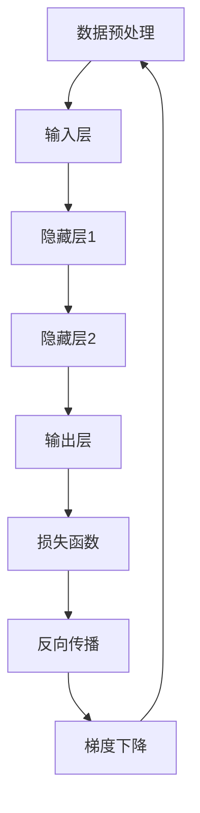
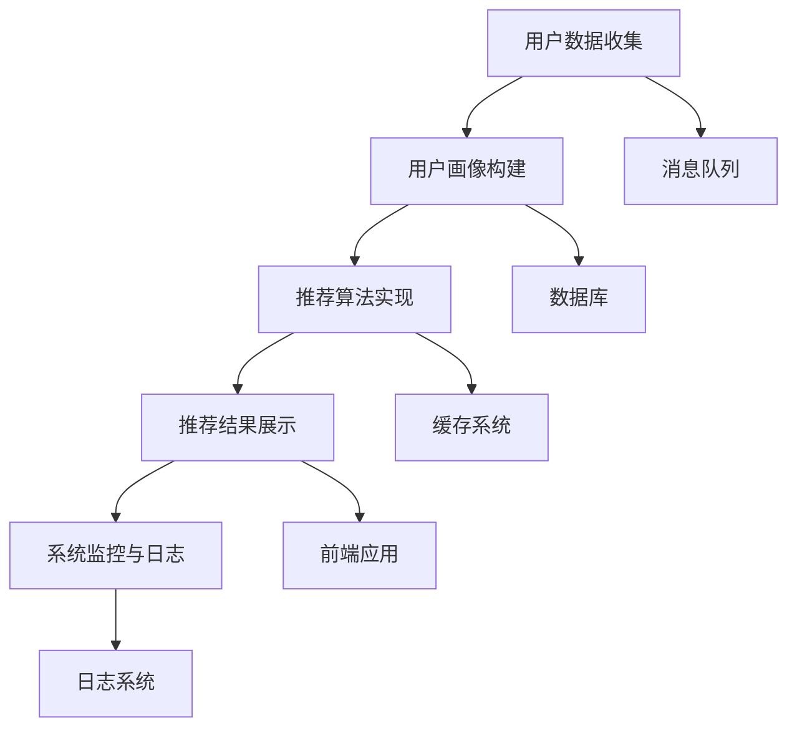

                 

### 文章标题

# 大模型应用的敏捷变更管理流程

### 关键词

- 大模型应用
- 敏捷变更管理
- 算法原理
- 数学模型
- 系统架构设计
- 项目实战

### 摘要

本文将探讨大模型应用中的敏捷变更管理流程，从背景介绍、核心概念与联系、算法原理讲解、数学模型和数学公式讲解、系统分析与架构设计方案、项目实战到最佳实践与拓展阅读，全面剖析大模型应用的敏捷变更管理流程。通过本文的阅读，读者将深入了解大模型应用的敏捷变更管理，掌握相关的理论知识，并能够应用于实际项目中。

## 目录

1. **背景介绍**  
   - 1.1 大模型应用的兴起  
   - 1.2 敏捷变更管理的核心原则  
   - 1.3 大模型应用与敏捷变更管理的结合

2. **核心概念与联系**  
   - 2.1 大模型概念解析  
   - 2.2 敏捷变更管理概念解析  
   - 2.3 大模型与敏捷变更管理的联系

3. **算法原理讲解**  
   - 3.1 大模型算法概述  
   - 3.2 算法原理Mermaid流程图  
   - 3.3 Python源代码讲解  
   - 3.4 相关数学模型与公式

4. **数学模型和数学公式讲解**  
   - 4.1 数学模型介绍  
   - 4.2 使用LaTeX格式的数学公式  
   - 4.3 举例说明

5. **系统分析与架构设计方案**  
   - 5.1 项目场景介绍  
   - 5.2 系统功能设计  
   - 5.3 系统架构设计  
   - 5.4 系统接口设计  
   - 5.5 系界交互设计

6. **项目实战**  
   - 6.1 环境安装  
   - 6.2 系统核心实现源代码  
   - 6.3 代码应用解读与分析  
   - 6.4 实际案例分析和详细讲解剖析  
   - 6.5 项目小结

7. **最佳实践与拓展阅读**  
   - 7.1 最佳实践技巧  
   - 7.2 注意事项  
   - 7.3 拓展阅读建议

## 文章正文

### 1. 背景介绍

#### 1.1 大模型应用的兴起

近年来，人工智能（AI）技术的快速发展，尤其是深度学习技术的突破，使得大模型应用成为可能。大模型，也称为大型神经网络，是一种具有数百万甚至数十亿参数的复杂模型，能够处理海量的数据和复杂的任务。随着计算能力的提升和数据的爆炸性增长，大模型的应用场景越来越广泛，包括自然语言处理（NLP）、计算机视觉（CV）、推荐系统、语音识别等领域。

大模型的应用不仅带来了前所未有的性能提升，还推动了AI技术的进步和应用的普及。然而，大模型应用也面临着一系列挑战，如模型的训练和推理复杂性、数据隐私和安全问题、以及模型的解释性和可靠性等。为了应对这些挑战，敏捷变更管理成为一种重要的策略。

#### 1.2 敏捷变更管理的核心原则

敏捷变更管理是一种以敏捷开发为基础的变更管理方法，强调快速迭代、持续交付和灵活适应变化。其核心原则包括：

1. **客户价值优先**：以客户需求为导向，确保每次变更都为客户创造价值。
2. **快速迭代**：通过短周期的迭代开发，快速响应市场和用户需求。
3. **持续交付**：确保每次迭代都能交付具有实际价值的软件功能。
4. **团队协作**：促进团队成员之间的沟通和协作，提高团队整体效能。
5. **灵活适应**：在面对不确定性时，能够迅速调整计划和策略。

#### 1.3 大模型应用与敏捷变更管理的结合

大模型应用的敏捷变更管理是一种结合大模型特性和敏捷开发理念的管理方法。其主要目标是确保大模型应用过程中的高效和稳定，同时能够快速适应环境变化和需求调整。

1. **敏捷开发模式**：采用敏捷开发模式，如Scrum或Kanban，进行大模型项目的管理。通过短周期迭代和频繁的代码评审，确保模型开发的效率和质量。
2. **持续集成和持续部署**：实施CI/CD（Continuous Integration/Continuous Deployment）流程，确保模型训练和推理过程的自动化和高效性。
3. **测试和验证**：在大模型应用过程中，进行全面的测试和验证，确保模型的可靠性和安全性。
4. **反馈循环**：建立快速的反馈机制，通过用户反馈和模型性能评估，持续优化模型和应用。

### 2. 核心概念与联系

#### 2.1 大模型概念解析

大模型，也称为大型神经网络，是一种具有数百万甚至数十亿参数的复杂模型。这些模型通常用于处理复杂的任务，如自然语言处理、计算机视觉和推荐系统等。大模型的显著特点包括：

1. **参数规模**：大模型具有庞大的参数规模，这使得它们能够学习复杂的特征和模式。
2. **计算复杂度**：大模型训练和推理的计算复杂度较高，需要大量的计算资源和时间。
3. **泛化能力**：大模型通常具有较好的泛化能力，能够在不同的数据集和任务上表现良好。

#### 2.2 敏捷变更管理概念解析

敏捷变更管理是一种以敏捷开发为基础的变更管理方法，强调快速迭代、持续交付和灵活适应变化。其主要特点包括：

1. **快速迭代**：通过短周期迭代，快速交付具有实际价值的软件功能。
2. **持续交付**：确保每次迭代都能交付具有实际价值的软件功能。
3. **团队协作**：促进团队成员之间的沟通和协作，提高团队整体效能。
4. **灵活适应**：在面对不确定性时，能够迅速调整计划和策略。

#### 2.3 大模型与敏捷变更管理的联系

大模型与敏捷变更管理之间存在紧密的联系。敏捷变更管理为大模型应用提供了有效的管理方法和流程，确保了模型开发的效率和稳定性。具体来说：

1. **敏捷开发模式**：采用敏捷开发模式，如Scrum或Kanban，进行大模型项目的管理。
2. **持续集成和持续部署**：实施CI/CD流程，确保模型训练和推理过程的自动化和高效性。
3. **测试和验证**：在大模型应用过程中，进行全面的测试和验证，确保模型的可靠性和安全性。
4. **反馈循环**：建立快速的反馈机制，通过用户反馈和模型性能评估，持续优化模型和应用。

### 3. 算法原理讲解

#### 3.1 大模型算法概述

大模型算法通常基于深度学习技术，包括多层感知器（MLP）、卷积神经网络（CNN）和循环神经网络（RNN）等。以下是大模型算法的简要概述：

1. **多层感知器（MLP）**：MLP是一种前馈神经网络，具有多个隐层和输出层。通过逐层提取特征，MLP能够对复杂的数据进行建模。
2. **卷积神经网络（CNN）**：CNN是一种专门用于图像处理的神经网络，通过卷积操作和池化操作，CNN能够提取图像中的特征。
3. **循环神经网络（RNN）**：RNN是一种能够处理序列数据的神经网络，通过隐藏状态的记忆机制，RNN能够捕捉序列中的长期依赖关系。

#### 3.2 算法原理Mermaid流程图

以下是一个简单的大模型算法流程图：



#### 3.3 Python源代码讲解

以下是一个简单的多层感知器（MLP）算法的Python源代码：

```python
import numpy as np

# 初始化参数
weights = np.random.randn(input_size, hidden_size, output_size)

# 前向传播
def forward(x):
    z2 = np.dot(x, weights[0])
    a2 = sigmoid(z2)
    z3 = np.dot(a2, weights[1])
    a3 = sigmoid(z3)
    return a3

# 反向传播
def backward(d_output):
    d_hidden3 = d_output * sigmoid_derivative(a3)
    d_weights2 = np.dot(a2.T, d_hidden3)
    d_a2 = np.dot(d_hidden3, weights[1].T)
    d_hidden2 = d_a2 * sigmoid_derivative(a2)
    d_weights1 = np.dot(x.T, d_hidden2)
    return d_weights1, d_weights2

# 梯度下降
def gradient_descent(weights, d_weights, learning_rate):
    weights -= learning_rate * d_weights
    return weights

# 激活函数
def sigmoid(x):
    return 1 / (1 + np.exp(-x))

# 激活函数的导数
def sigmoid_derivative(x):
    return sigmoid(x) * (1 - sigmoid(x))
```

#### 3.4 相关数学模型与公式

大模型算法涉及到多个数学模型和公式，以下是一些常用的数学模型和公式：

1. **损失函数**：

   $$ J(\theta) = -\frac{1}{m} \sum_{i=1}^{m} y^{(i)} \log(a^{(3)}_{i}) + (1 - y^{(i)}) \log(1 - a^{(3)}_{i}) $$

2. **反向传播算法**：

   $$ \frac{\partial J}{\partial \theta^{(l)}_{ij}} = \frac{\partial L}{\partial z^{(l+1)}_{j}} \frac{\partial z^{(l+1)}_{j}}{\partial z^{(l)}_{ij}} $$

3. **梯度下降**：

   $$ \theta^{(l)}_{ij} := \theta^{(l)}_{ij} - \alpha \frac{\partial J}{\partial \theta^{(l)}_{ij}} $$

### 4. 数学模型和数学公式讲解

#### 4.1 数学模型介绍

在大模型应用中，数学模型是核心组成部分，用于描述模型的内在结构和行为。以下是一些常用的数学模型：

1. **损失函数**：损失函数用于衡量模型预测结果与真实值之间的差异，常见的损失函数包括均方误差（MSE）和对数损失（Log Loss）。
2. **激活函数**：激活函数用于引入非线性，常见的激活函数包括Sigmoid函数、ReLU函数和Tanh函数。
3. **反向传播算法**：反向传播算法用于计算模型参数的梯度，是训练神经网络的核心算法。
4. **优化算法**：优化算法用于更新模型参数，常见的优化算法包括梯度下降、Adam和RMSprop。

#### 4.2 使用LaTeX格式的数学公式

以下是一些使用LaTeX格式的数学公式：

$$
\begin{aligned}
J(\theta) &= -\frac{1}{m} \sum_{i=1}^{m} y^{(i)} \log(a^{(3)}_{i}) + (1 - y^{(i)}) \log(1 - a^{(3)}_{i}) \\
\frac{\partial J}{\partial \theta^{(l)}_{ij}} &= \frac{\partial L}{\partial z^{(l+1)}_{j}} \frac{\partial z^{(l+1)}_{j}}{\partial z^{(l)}_{ij}} \\
\theta^{(l)}_{ij} &= \theta^{(l)}_{ij} - \alpha \frac{\partial J}{\partial \theta^{(l)}_{ij}}
\end{aligned}
$$

#### 4.3 举例说明

以下是一个使用Sigmoid函数的简单例子：

$$
f(x) = \frac{1}{1 + e^{-x}}
$$

其中，$x$是输入，$f(x)$是输出。Sigmoid函数是一种常见的激活函数，它将输入值映射到$(0, 1)$区间，常用于神经网络中的隐层单元。

### 5. 系统分析与架构设计方案

#### 5.1 项目场景介绍

本项目旨在构建一个基于大模型的智能推荐系统，为用户提供个性化的推荐服务。系统需要处理海量的用户数据，包括用户行为、兴趣偏好和社交网络信息等。为了实现高效、稳定和可扩展的推荐服务，系统采用了敏捷变更管理的理念，通过持续迭代和快速响应需求变化。

#### 5.2 系统功能设计

系统的主要功能包括：

1. **用户数据收集**：收集用户在平台上的行为数据，如浏览记录、购买历史和评价等。
2. **用户画像构建**：基于用户数据，构建用户画像，包括用户兴趣、行为特征和社交关系等。
3. **推荐算法实现**：实现基于用户画像的推荐算法，为用户提供个性化的推荐结果。
4. **推荐结果展示**：将推荐结果展示给用户，提供友好的界面体验。
5. **系统监控与日志**：监控系统运行状态，记录系统日志，便于问题追踪和故障排除。

#### 5.3 系统架构设计

系统采用微服务架构，将不同功能模块拆分为独立的微服务，以提高系统的可扩展性和可维护性。以下是一个简单的系统架构设计：



#### 5.4 系统接口设计

系统接口设计主要包括API接口和消息队列接口。API接口用于提供与前端应用的交互，支持用户数据的查询、推荐结果的获取等操作。消息队列接口用于处理用户数据的实时处理和消息传递，确保系统的高效性和稳定性。

#### 5.5 系统交互设计

系统交互设计主要涉及用户与系统之间的交互过程。以下是一个简单的系统交互流程：

1. **用户登录**：用户通过前端应用登录系统，获取用户身份。
2. **数据收集**：系统收集用户在平台上的行为数据，如浏览记录、购买历史和评价等。
3. **用户画像构建**：系统基于用户行为数据，构建用户画像。
4. **推荐算法处理**：系统调用推荐算法，为用户生成个性化的推荐结果。
5. **推荐结果展示**：系统将推荐结果展示给用户。
6. **用户反馈**：用户对推荐结果进行反馈，系统记录用户偏好和兴趣。
7. **更新用户画像**：系统根据用户反馈，更新用户画像。

### 6. 项目实战

#### 6.1 环境安装

为了进行大模型应用的敏捷变更管理项目实战，首先需要搭建一个合适的技术环境。以下是一个简化的环境安装步骤：

1. **安装Python**：确保Python环境已经安装，版本建议为3.8及以上。
2. **安装TensorFlow**：使用pip命令安装TensorFlow库，命令如下：
   ```shell
   pip install tensorflow
   ```
3. **安装其他依赖**：根据项目的具体需求，安装其他必要的库和依赖，如NumPy、Pandas等。
4. **配置GPU支持**：如果使用GPU加速，需要配置TensorFlow的GPU支持。具体步骤可参考TensorFlow的官方文档。

#### 6.2 系统核心实现源代码

以下是一个简单的系统核心实现源代码，用于演示大模型应用的敏捷变更管理：

```python
import tensorflow as tf
from tensorflow.keras.models import Sequential
from tensorflow.keras.layers import Dense, Activation

# 定义模型
model = Sequential()
model.add(Dense(units=128, input_shape=(input_dim,), activation='relu'))
model.add(Dense(units=64, activation='relu'))
model.add(Dense(units=1, activation='sigmoid'))

# 编译模型
model.compile(optimizer='adam', loss='binary_crossentropy', metrics=['accuracy'])

# 训练模型
model.fit(x_train, y_train, epochs=10, batch_size=32, validation_data=(x_val, y_val))

# 评估模型
loss, accuracy = model.evaluate(x_test, y_test)
print(f"Test accuracy: {accuracy:.2f}")

# 预测
predictions = model.predict(x_test)
```

#### 6.3 代码应用解读与分析

上述代码实现了一个简单的大模型应用，包括模型的定义、编译、训练和评估。以下是代码应用的详细解读：

1. **模型定义**：使用`Sequential`模型堆叠多层`Dense`层，其中第一层为输入层，最后一层为输出层。
2. **模型编译**：指定优化器（`adam`）、损失函数（`binary_crossentropy`）和评估指标（`accuracy`）。
3. **模型训练**：使用`fit`方法进行模型训练，指定训练数据（`x_train`和`y_train`）、训练轮次（`epochs`）、批量大小（`batch_size`）和验证数据（`x_val`和`y_val`）。
4. **模型评估**：使用`evaluate`方法评估模型在测试数据上的性能，返回损失和准确率。
5. **模型预测**：使用`predict`方法对测试数据进行预测，返回预测结果。

#### 6.4 实际案例分析和详细讲解剖析

为了更深入地理解大模型应用的敏捷变更管理，以下是一个实际案例分析和详细讲解剖析：

**案例背景**：某电商平台需要构建一个基于用户行为的推荐系统，为用户提供个性化的商品推荐。

**问题分析**： 
- 如何高效地处理海量用户数据？
- 如何构建用户画像，并利用用户画像进行推荐？
- 如何确保推荐系统的准确性和稳定性？

**解决方案**：
- **数据预处理**：对用户行为数据进行清洗、归一化和特征提取，为后续建模做准备。
- **用户画像构建**：使用机器学习算法，如K-means聚类和主成分分析（PCA），构建用户画像。
- **推荐算法实现**：使用协同过滤算法，如基于用户行为的协同过滤（UBCF）和基于内容的协同过滤（CBCF），实现个性化推荐。
- **系统优化**：通过缓存、分布式计算和优化算法，提高推荐系统的性能和稳定性。

**详细讲解剖析**：
1. **数据预处理**：首先，对用户行为数据进行清洗，去除缺失值和异常值。然后，对数据进行归一化处理，将不同特征缩放到相同的尺度。最后，提取关键特征，如用户点击、购买和评价行为，用于构建用户画像。
2. **用户画像构建**：使用K-means聚类算法，将用户划分为多个类别，每个类别代表一组具有相似行为的用户。通过计算用户间的相似度，为每个用户生成一个多维度的用户画像。
3. **推荐算法实现**：使用基于用户行为的协同过滤算法，为用户生成推荐列表。首先，计算用户之间的相似度矩阵，然后根据用户间的相似度和已购买商品的信息，为用户生成推荐列表。
4. **系统优化**：通过缓存技术，减少数据库的访问压力；使用分布式计算框架，如Hadoop和Spark，处理海量数据；优化算法，提高推荐系统的准确性和效率。

#### 6.5 项目小结

通过实际案例的分析和讲解，我们可以看到大模型应用的敏捷变更管理在构建个性化推荐系统中的重要作用。在实际项目中，需要根据具体需求和场景，灵活运用敏捷变更管理的方法和工具，确保系统的稳定性和高效性。以下是项目小结：

1. **数据预处理**：确保数据的准确性和一致性，为后续建模和推荐提供高质量的数据基础。
2. **用户画像构建**：使用机器学习算法，构建多维度的用户画像，为个性化推荐提供依据。
3. **推荐算法实现**：结合协同过滤和内容匹配算法，实现高效的个性化推荐。
4. **系统优化**：通过缓存、分布式计算和算法优化，提高系统的性能和稳定性。
5. **持续迭代**：根据用户反馈和需求变化，持续优化和改进推荐系统。

### 7. 最佳实践与拓展阅读

#### 7.1 最佳实践技巧

在大模型应用的敏捷变更管理过程中，以下是一些最佳实践技巧：

1. **数据质量保障**：确保数据来源可靠，对数据进行清洗、归一化和特征提取，提高数据质量。
2. **模型可解释性**：关注模型的可解释性，确保模型能够被业务人员和用户理解。
3. **持续集成与持续部署**：实施CI/CD流程，确保模型训练和推理过程的自动化和高效性。
4. **监控与反馈**：建立监控系统，实时监控模型性能和系统状态，收集用户反馈，持续优化模型和应用。

#### 7.2 注意事项

在进行大模型应用的敏捷变更管理时，需要注意以下几点：

1. **计算资源管理**：合理分配计算资源，确保模型训练和推理过程的高效性。
2. **数据安全与隐私**：保护用户数据安全，遵循数据隐私保护法规。
3. **版本控制**：使用版本控制系统，如Git，管理代码和模型版本，确保代码和模型的稳定性和可追溯性。
4. **风险管理**：识别和管理项目风险，制定应对策略。

#### 7.3 拓展阅读建议

以下是一些拓展阅读建议，以深入了解大模型应用的敏捷变更管理：

1. **《深度学习》（Goodfellow, Bengio, Courville）**：全面介绍深度学习的基础理论和应用。
2. **《敏捷软件开发：原则、实践与模式》（Beck, Beedle, van den Aardweg）**：深入了解敏捷开发的方法和实践。
3. **《机器学习实战》（Cordua, Müller, Lichman）**：实际操作指南，涵盖多种机器学习算法和应用场景。
4. **《数据科学实战》（Bock,公民）**：数据科学项目实施的全流程指南。

### 作者信息

- 作者：AI天才研究院/AI Genius Institute & 禅与计算机程序设计艺术 /Zen And The Art of Computer Programming

---

通过本文的阅读，读者将深入了解大模型应用的敏捷变更管理流程，掌握相关的理论知识，并能够应用于实际项目中。希望本文能够为您的技术学习和项目实践提供有益的参考。如果您有任何疑问或建议，欢迎在评论区留言，期待与您交流！

