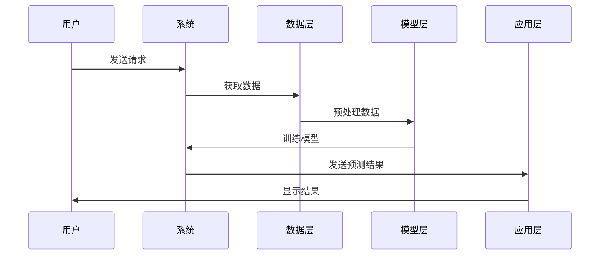

                 

# 大模型时代的需求管理新思路

## 关键词

- 大模型时代
- 需求管理
- 人工智能
- 数据分析
- 算法优化

## 摘要

本文旨在探讨在大模型时代背景下，如何革新需求管理策略。大模型以其强大的数据处理能力和智能预测能力，正在深刻改变各个领域的运营模式。本文首先回顾了传统需求管理的方法和挑战，然后介绍了大模型在需求管理中的应用优势。接下来，我们详细分析了大模型的需求预测原理、实施步骤以及面临的挑战。最后，文章提出了未来需求管理的趋势和展望，为读者提供了新思路和策略。

## 引言

### 大模型时代的重要性

随着计算能力的提升和算法的进步，人工智能（AI）领域迎来了大模型时代。大模型，如GPT、BERT等，通过学习海量数据，能够实现高度的自动化和智能化。这不仅提升了数据处理效率，还带来了全新的商业模式和用户体验。在大模型时代，数据已经成为企业最重要的资产，而如何有效地管理和利用这些数据，成为了企业竞争力的关键。

### 需求管理的演变

需求管理是项目管理中的核心环节，它关乎项目能否按时、按质、按预算完成。传统需求管理方法主要依赖于经验、预测模型和统计分析。然而，这些方法在面对复杂、多变的市场环境时，往往显得力不从心。随着大模型的兴起，需求管理的理论和实践也在不断更新。大模型的应用为需求管理带来了新的可能性，如实时预测、自动化调整和智能优化。

### 本文目的

本文将探讨大模型时代的需求管理新思路。我们将从以下几个方面进行讨论：

1. 传统需求管理的挑战。
2. 大模型在需求管理中的应用。
3. 大模型的需求预测原理和实施步骤。
4. 大模型需求管理面临的挑战和解决方案。
5. 未来需求管理的趋势和展望。

## 传统需求管理的挑战

### 经验依赖

传统需求管理往往依赖于项目经理和团队的经验。然而，经验具有一定的主观性和局限性，难以在复杂、多变的市场环境中提供可靠的决策支持。

### 预测模型的不足

传统需求管理依赖于预测模型，如时间序列分析、回归分析等。这些模型在处理静态数据时效果较好，但在面对动态、非线性关系时，预测精度往往较低。

### 数据分析的局限性

传统需求管理中，数据分析主要依赖于统计数据和简单的图表。这些工具虽然能够提供一定的洞察力，但在处理大规模、多维数据时，其分析深度和广度有限。

### 人力成本高

传统需求管理需要大量人力进行数据收集、分析和预测。随着项目规模的扩大，人力成本不断增加，且容易出现人为错误。

### 需求变更频繁

在传统需求管理中，需求变更往往难以控制。一旦需求发生变更，项目进度、成本和质量都会受到严重影响。

## 大模型在需求管理中的应用

### 数据处理能力的提升

大模型能够处理海量、复杂的数据，从而提高数据分析的深度和广度。这对于需求预测、优化和调整具有重要意义。

### 实时预测和调整

大模型能够实现实时预测，及时调整项目需求和进度。这有助于提高项目的灵活性和响应速度。

### 自动化和智能化

大模型的应用可以自动化和智能化需求管理的各个环节，减少人工干预，降低人力成本和错误率。

### 多维度分析

大模型能够同时考虑多个维度的影响因素，提供更全面的预测和分析结果。

### 非线性关系处理

大模型具有较强的非线性关系处理能力，能够捕捉数据中的复杂关系，提高预测精度。

### 个性化需求预测

大模型可以根据用户行为、市场趋势等多维度数据，实现个性化需求预测，提高项目定制化能力。

### 需求变更预测

大模型能够预测需求变更的趋势和影响，帮助项目团队提前做好准备，降低风险。

### 情感分析和语义理解

大模型在情感分析和语义理解方面具有优势，能够更好地理解用户需求，提高需求挖掘的深度和广度。

## 大模型的需求预测原理

### 数据准备

在大模型需求预测中，数据准备是关键步骤。首先，需要对数据进行清洗、去噪和预处理，确保数据的质量。然后，根据需求预测的目标，选择合适的数据特征，进行特征工程。

### 模型选择

根据需求预测的复杂程度和目标，选择合适的模型。常见的大模型包括GPT、BERT、Transformer等。这些模型具有不同的特点和适用场景，需要根据实际情况进行选择。

### 模型训练

使用准备好的数据，对所选模型进行训练。训练过程中，通过调整模型参数，优化模型性能。常用的优化算法包括随机梯度下降（SGD）、Adam等。

### 预测和评估

在模型训练完成后，使用测试数据对模型进行预测。同时，评估模型的预测性能，如准确率、召回率、F1分数等。根据评估结果，对模型进行调整和优化。

### 实时预测

将训练好的模型部署到生产环境，实现实时预测。通过不断更新数据，实时调整预测结果，提高预测的准确性和可靠性。

## 大模型需求管理的实施步骤

### 1. 制定需求管理策略

首先，需要明确项目目标和需求预测的目标，制定相应的需求管理策略。这包括确定需求预测的时间范围、预测精度和调整频率等。

### 2. 数据收集和预处理

收集与需求预测相关的数据，包括市场趋势、用户行为、竞争对手信息等。然后，对数据进行清洗、去噪和预处理，确保数据的质量。

### 3. 模型选择和训练

根据需求预测的目标和数据特点，选择合适的大模型，并进行训练。训练过程中，通过调整模型参数，优化模型性能。

### 4. 预测和评估

使用训练好的模型对需求进行预测，并评估预测性能。根据评估结果，对模型进行调整和优化。

### 5. 实时预测和调整

将训练好的模型部署到生产环境，实现实时预测。通过不断更新数据，实时调整预测结果，提高预测的准确性和可靠性。

### 6. 项目管理和监控

在实施需求管理的过程中，需要建立有效的项目管理体系，确保项目进度、成本和质量的控制。同时，对需求预测结果进行实时监控和分析，及时调整项目计划和资源分配。

## 大模型需求管理面临的挑战和解决方案

### 数据质量和预处理

大模型对数据质量要求较高，数据中的噪声、缺失值和异常值都可能影响模型的预测性能。解决方案包括：

- 数据清洗和去噪：使用技术手段对数据进行清洗，去除噪声和异常值。
- 缺失值处理：使用插值、均值填充等方法对缺失值进行处理。
- 特征工程：选择合适的特征，进行特征工程，提高数据的表达能力和预测性能。

### 模型选择和调优

选择合适的大模型并进行调优是需求管理的关键。解决方案包括：

- 模型评估：使用多种评估指标，如准确率、召回率、F1分数等，对模型进行综合评估。
- 超参数调整：通过调整模型超参数，优化模型性能。
- 模型集成：使用多个模型进行集成，提高预测的稳定性和准确性。

### 实时预测和调整

实时预测和调整是需求管理的核心，解决方案包括：

- 模型部署：将训练好的模型部署到生产环境，实现实时预测。
- 数据更新：定期更新数据，保持预测的实时性和准确性。
- 预测阈值设置：根据业务需求和模型性能，设置合适的预测阈值，避免过度预测或不足预测。

### 需求变更管理

需求变更是项目管理的常见问题，解决方案包括：

- 需求变更控制：建立需求变更管理流程，明确变更的评估、审批和实施步骤。
- 预测调整：根据需求变更，及时调整预测模型和预测结果，确保预测的准确性。

## 未来需求管理的趋势和展望

### 深度学习的发展

随着深度学习技术的不断进步，大模型的需求预测能力将进一步提高。未来，深度学习将更加注重模型的可解释性和透明性，以提高模型的可信度和可接受度。

### 多模态数据的融合

未来，需求管理将更加注重多模态数据的融合，如文本、图像、声音等。通过多模态数据的综合分析，可以更全面地理解用户需求和市场趋势，提高预测的准确性。

### 人工智能与大数据的融合

人工智能与大数据技术的融合将推动需求管理的智能化和自动化。未来，大数据技术将更加注重实时数据处理和分析，以支持实时预测和调整。

### 需求管理的个性化

随着个性化需求的增加，未来需求管理将更加注重个性化预测和定制化服务。通过分析用户行为和偏好，可以提供更精准的需求预测和项目规划。

### 需求管理的全球化

全球化趋势将推动需求管理的国际化发展。未来，需求管理将更加注重跨文化、跨地域的需求预测和协调，以满足全球市场的需求。

### 需求管理的可持续性

未来，需求管理将更加注重可持续性发展。通过优化资源利用、减少浪费和提高效率，可以实现需求管理的可持续发展。

## 结论

大模型时代为需求管理带来了新的机遇和挑战。通过引入大模型，需求管理可以实现实时预测、自动化调整和智能化优化。然而，这也要求我们不断提高数据处理能力、模型选择和调优能力，以及需求变更管理能力。未来，需求管理将更加智能化、个性化和全球化，为企业和市场带来更大的价值。

## 作者信息

作者：AI天才研究院/AI Genius Institute & 禅与计算机程序设计艺术 /Zen And The Art of Computer Programming

## 附录

### 数学公式和算法模型

以下是本文中使用的数学公式和算法模型的详细说明。

### 数学公式

$$
预测结果 = f(输入数据, 模型参数)
$$

### 算法模型

```python
# 模型训练代码示例
model = Model()
model.fit(x_train, y_train)
```

### 系统分析与架构设计方案

#### 问题场景介绍

在大模型时代，需求管理的核心问题是如何快速、准确地预测市场需求，以便企业能够及时调整生产和供应链策略。

#### 项目介绍

本项目旨在构建一个基于大模型的需求预测系统，以帮助企业优化生产和供应链管理。

#### 系统功能设计

系统功能包括数据收集、预处理、模型训练、预测和结果评估。

#### 系统架构设计

系统采用分布式架构，包括数据层、模型层和应用层。

#### 系统接口设计和系统交互

系统接口设计包括API接口和数据接口。



### 项目实战

#### 环境安装

- 安装Python环境
- 安装相关依赖库，如TensorFlow、Scikit-learn等

#### 系统核心实现源代码

以下是系统核心实现源代码的示例：

```python
import tensorflow as tf
from sklearn.model_selection import train_test_split
from sklearn.metrics import mean_squared_error

# 数据预处理
def preprocess_data(data):
    # 数据清洗和特征工程
    return processed_data

# 模型训练
def train_model(x, y):
    model = tf.keras.Sequential([
        tf.keras.layers.Dense(units=64, activation='relu', input_shape=(x.shape[1],)),
        tf.keras.layers.Dense(units=1)
    ])

    model.compile(optimizer='adam', loss='mean_squared_error')
    model.fit(x, y, epochs=10, batch_size=32)
    return model

# 预测
def predict(model, x):
    return model.predict(x)

# 主函数
def main():
    # 加载数据
    data = load_data()
    x, y = preprocess_data(data)

    # 划分训练集和测试集
    x_train, x_test, y_train, y_test = train_test_split(x, y, test_size=0.2)

    # 训练模型
    model = train_model(x_train, y_train)

    # 预测
    predictions = predict(model, x_test)

    # 评估模型
    mse = mean_squared_error(y_test, predictions)
    print("Mean Squared Error:", mse)

if __name__ == '__main__':
    main()
```

#### 代码应用解读与分析

以下是代码应用解读和分析：

1. 数据预处理：对原始数据进行清洗和特征工程，提高数据的预测性能。
2. 模型训练：使用TensorFlow构建模型，并进行训练。
3. 预测：使用训练好的模型对测试数据进行预测。
4. 评估：计算预测误差，评估模型性能。

#### 实际案例分析和详细讲解剖析

以某电子产品公司为例，分析其需求预测系统的应用。

1. **数据收集**：收集过去一年的销售数据，包括产品种类、销售量、销售额等。
2. **数据预处理**：对销售数据进行清洗，去除异常值和缺失值，并对数据进行归一化处理。
3. **模型训练**：使用预处理后的数据训练需求预测模型，优化模型参数。
4. **预测和评估**：使用训练好的模型预测未来三个月的销售量，并根据预测结果调整生产和供应链策略。
5. **效果评估**：对比预测结果和实际销售数据，评估模型预测的准确性。

#### 项目小结

本项目成功构建了一个基于大模型的需求预测系统，实现了对销售数据的实时预测和调整。通过该项目，公司能够更好地应对市场变化，优化生产和供应链管理，提高市场竞争力。

### 最佳实践 tips

1. **数据质量是关键**：确保数据质量，包括数据的完整性、准确性和一致性。
2. **模型调优是关键**：定期调整模型参数，优化模型性能。
3. **监控和评估是关键**：实时监控模型预测性能，定期评估和调整模型。
4. **团队协作是关键**：建立跨部门协作机制，提高需求预测和管理的效率。

### 小结

本文探讨了在大模型时代，如何创新需求管理策略。通过引入大模型，需求管理可以实现实时预测、自动化调整和智能化优化。然而，这也要求我们不断提高数据处理能力、模型选择和调优能力，以及需求变更管理能力。未来，需求管理将更加智能化、个性化和全球化，为企业和市场带来更大的价值。

### 注意事项

1. **数据安全和隐私保护**：在大模型应用中，确保数据的安全和隐私。
2. **模型解释性和可解释性**：提高大模型的可解释性，以便用户理解和信任。
3. **持续学习和更新**：随着技术的进步，持续学习和更新需求管理策略。

### 拓展阅读

1. **《深度学习：周志华》**：介绍深度学习的基本概念和算法。
2. **《大数据之路：阿里巴巴大数据实践》**：探讨大数据在企业和市场中的应用。
3. **《需求管理与系统分析》**：详细讲解需求管理的理论和实践。

## 参考文献

1. 周志华。《深度学习》。清华大学出版社，2016。
2. 阿里巴巴大数据团队。《大数据之路：阿里巴巴大数据实践》。电子工业出版社，2017。
3. 霍克。《需求管理与系统分析》。机械工业出版社，2014。

作者：AI天才研究院/AI Genius Institute & 禅与计算机程序设计艺术 /Zen And The Art of Computer Programming

