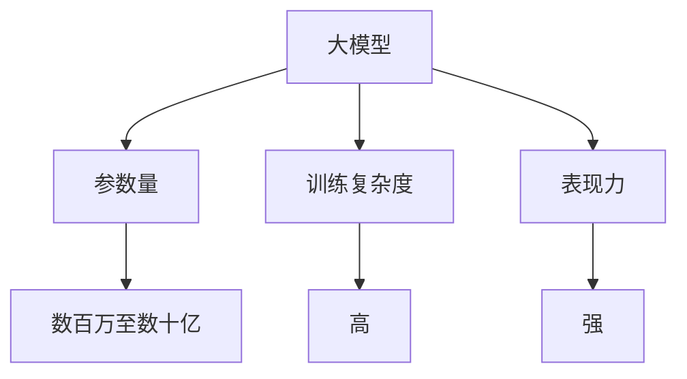
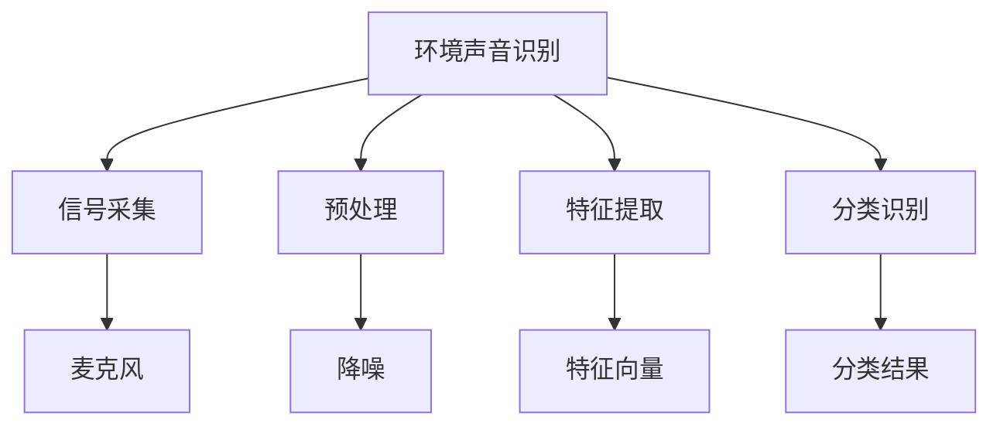

                 

# 《大模型环境声音识别能力评估框架》

## 关键词
- 大模型
- 环境声音识别
- 评估框架
- 机器学习
- 信号处理

## 摘要
本文旨在提出一个大模型环境声音识别能力的评估框架。背景方面，环境声音识别技术随着人工智能技术的发展而不断进步，其在智能安防、智能交通等领域的应用日益广泛。然而，如何科学地评估大模型环境声音识别的能力，尚缺乏统一的框架。本文首先介绍大模型和声音信号处理技术的基本概念，随后详细设计了一个评估框架，包括数据采集与预处理、大模型训练与优化、评估指标计算与结果分析等模块。最后，通过实际案例展示了评估框架的应用，并对未来研究方向进行了展望。

---

### 目录大纲

## 第一部分：背景与基础

### 第1章 问题背景与核心概念

#### 1.1 环境声音识别的背景

- **1.1.1 环境声音识别的重要性**
- **1.1.2 环境声音识别的应用场景**
- **1.1.3 当前环境声音识别技术的挑战**

#### 1.2 核心概念

- **1.2.1 大模型的概念**
- **1.2.2 环境声音识别的基本原理**
- **1.2.3 评估框架的定义**

#### 1.3 研究边界与外延

- **1.3.1 研究范围**
- **1.3.2 非研究范围**

### 第2章 相关技术概述

#### 2.1 声音信号处理技术

- **2.1.1 声音信号的采集与预处理**
- **2.1.2 声音信号的表征方法**

#### 2.2 大模型技术

- **2.2.1 大模型的基本原理**
- **2.2.2 大模型的主要架构**

#### 2.3 评估指标与方法

- **2.3.1 常用评估指标**
- **2.3.2 评估方法的比较与选择**

## 第二部分：大模型环境声音识别能力评估框架设计

### 第3章 评估框架总体架构

#### 3.1 评估框架的组成部分

- **3.1.1 数据采集与预处理模块**
- **3.1.2 大模型训练与优化模块**
- **3.1.3 评估指标计算模块**
- **3.1.4 结果分析与可视化模块**

### 第4章 数据采集与预处理

#### 4.1 数据采集

- **4.1.1 数据来源**
- **4.1.2 数据采集设备与流程**

#### 4.2 数据预处理

- **4.2.1 数据清洗**
- **4.2.2 数据增强**
- **4.2.3 特征提取**

### 第5章 大模型训练与优化

#### 5.1 大模型训练方法

- **5.1.1 传统的监督学习**
- **5.1.2 无监督学习**
- **5.1.3 半监督学习**

#### 5.2 大模型优化策略

- **5.2.1 超参数调整**
- **5.2.2 模型剪枝与压缩**
- **5.2.3 模型集成与融合**

### 第6章 评估指标计算与结果分析

#### 6.1 常用评估指标

- **6.1.1 准确率与召回率**
- **6.1.2 F1 分数**
- **6.1.3 精确率与覆盖率**

#### 6.2 结果分析与可视化

- **6.2.1 结果分析流程**
- **6.2.2 可视化工具与应用**

## 第三部分：评估框架应用与优化

### 第7章 评估框架应用案例

#### 7.1 案例一：智能安防系统

- **7.1.1 案例背景**
- **7.1.2 评估框架应用**

#### 7.2 案例二：智能交通系统

- **7.2.1 案例背景**
- **7.2.2 评估框架应用**

### 第8章 评估框架优化策略

#### 8.1 数据增强与多样性

- **8.1.1 数据增强方法**
- **8.1.2 多样性评估**

#### 8.2 模型自适应与实时性

- **8.2.1 模型自适应方法**
- **8.2.2 实时性优化**

### 第9章 小结与展望

#### 9.1 小结

- **9.1.1 主要研究成果**
- **9.1.2 存在的问题与挑战**

#### 9.2 展望

- **9.2.1 未来研究方向**
- **9.2.2 评估框架的潜在应用领域**

---

### 核心概念与联系

#### 大模型

- **定义**：大模型是指具有大量参数和强大学习能力的神经网络模型，如Transformer、BERT等。
- **特点**：
  - 参数量大：通常包含数百万至数十亿个参数。
  - 训练复杂度高：需要大量的计算资源和时间。
  - 表现力强：能够处理复杂的语言和图像任务。
- **属性特征对比表**

$$
\begin{array}{|c|c|c|}
\hline
\text{特征} & \text{大模型} & \text{传统模型} \\
\hline
\text{参数量} & \text{数百万至数十亿} & \text{数千至数万} \\
\hline
\text{训练时间} & \text{数小时至数周} & \text{数分钟至数小时} \\
\hline
\text{计算复杂度} & \text{高} & \text{低} \\
\hline
\text{表现力} & \text{强} & \text{弱} \\
\hline
\end{array}
$$

- **ER实体关系图架构**

#### 环境声音识别

- **定义**：环境声音识别是利用机器学习和信号处理技术，对采集到的环境声音信号进行分析和分类，以识别不同的声音来源和特征。
- **原理**：
  - 信号采集：通过麦克风等设备收集声音信号。
  - 预处理：对采集到的声音信号进行降噪、去噪等预处理。
  - 特征提取：从预处理后的声音信号中提取出有效的特征。
  - 分类识别：利用机器学习算法对提取的特征进行分类，以识别声音来源。
- **属性特征对比表**

$$
\begin{array}{|c|c|c|}
\hline
\text{特征} & \text{环境声音识别} & \text{传统声学方法} \\
\hline
\text{数据来源} & \text{电子设备采集的声音信号} & \text{实验室环境下的声音信号} \\
\hline
\text{处理方法} & \text{机器学习和信号处理技术} & \text{声学模型和声学特性分析} \\
\hline
\text{应用范围} & \text{广泛的应用场景，如安防、交通等} & \text{实验室研究为主} \\
\hline
\end{array}
$$

- **ER实体关系图架构**

---

在接下来的章节中，我们将逐步深入探讨大模型环境声音识别能力评估框架的各个组成部分，包括数据采集与预处理、大模型训练与优化、评估指标计算与结果分析等。我们将通过逻辑清晰、结构紧凑的方式，展示如何设计一个科学、有效的评估框架，以便更好地理解和应用这一技术。接下来，我们将从环境声音识别的背景出发，逐步引入本文的核心概念。<!--在接下来的章节中，我们将逐步深入探讨大模型环境声音识别能力评估框架的各个组成部分，包括数据采集与预处理、大模型训练与优化、评估指标计算与结果分析等。我们将通过逻辑清晰、结构紧凑的方式，展示如何设计一个科学、有效的评估框架，以便更好地理解和应用这一技术。接下来，我们将从环境声音识别的背景出发，逐步引入本文的核心概念。--># 第1章 问题背景与核心概念

### 1.1 环境声音识别的背景

环境声音识别作为人工智能领域的一个重要分支，近年来得到了广泛关注和快速发展。随着传感器技术、机器学习和大数据处理技术的不断进步，环境声音识别的应用场景逐渐丰富，从传统的音频娱乐、语音助手，到智能安防、智能交通等领域，其应用价值愈发凸显。

#### 1.1.1 环境声音识别的重要性

环境声音识别技术在多个领域具有广泛的应用前景：

1. **智能安防**：通过环境声音识别，可以实现对异常声音的实时监测和报警，从而提高安全防范能力。
2. **智能交通**：环境声音识别技术可以用于交通噪声监测、交通流量分析等，有助于优化交通管理和减少交通拥堵。
3. **智能家居**：环境声音识别技术可以实现对家居环境的智能控制，如自动调节室内温度、光线等。
4. **医疗健康**：通过对患者日常声音的监测和分析，可以辅助医生进行疾病诊断和康复评估。

#### 1.1.2 环境声音识别的应用场景

环境声音识别技术的应用场景丰富多样，主要包括以下几个方面：

1. **音频娱乐**：利用声音识别技术，可以实现音频内容自动分类、推荐等功能。
2. **语音助手**：如 Siri、Alexa 等，通过环境声音识别，可以实现语音交互、语音控制等功能。
3. **智能安防**：通过识别异常声音，如玻璃破碎声、火灾警报声等，实现实时报警和监控。
4. **智能交通**：利用环境声音识别，可以实时监测交通噪声、交通流量等，帮助交通管理部门进行交通优化。
5. **智能家居**：通过识别家庭环境中的声音，如开门声、脚步声等，实现智能门锁、智能灯光等设备的控制。

#### 1.1.3 当前环境声音识别技术的挑战

尽管环境声音识别技术在多个领域展现出了巨大的应用价值，但仍然面临着一些挑战：

1. **噪声干扰**：环境中的噪声会对声音识别的准确性造成影响，需要开发出有效的噪声抑制算法。
2. **多样性**：环境声音识别需要处理多种不同类型的音频数据，如语音、音乐、环境噪声等，如何适应这些多样性数据，是一个重要问题。
3. **实时性**：环境声音识别需要实时处理和分析音频数据，这对算法的效率和实时性提出了高要求。
4. **能耗问题**：在移动设备和嵌入式系统中，环境声音识别算法的能耗问题也是一个需要关注的重要方面。

### 1.2 核心概念

#### 1.2.1 大模型的概念

大模型是指具有大量参数和强大学习能力的神经网络模型，如Transformer、BERT等。大模型通常通过深度学习算法进行训练，可以处理复杂的任务和数据集，具有以下特点：

1. **参数量大**：大模型通常包含数百万至数十亿个参数，这使得它们能够捕获更复杂的特征和模式。
2. **训练复杂度高**：大模型需要大量的计算资源和时间进行训练，这要求高效的计算架构和优化算法。
3. **表现力强**：大模型在处理复杂的语言和图像任务时表现出色，能够生成高质量的结果。

#### 1.2.2 环境声音识别的基本原理

环境声音识别的基本原理包括以下几个步骤：

1. **信号采集**：通过麦克风等设备收集环境中的声音信号。
2. **预处理**：对采集到的声音信号进行降噪、去噪等预处理，以提高声音的清晰度和质量。
3. **特征提取**：从预处理后的声音信号中提取出有效的特征，如频谱特征、时域特征等。
4. **分类识别**：利用机器学习算法对提取的特征进行分类，以识别不同的声音来源。

#### 1.2.3 评估框架的定义

评估框架是指用于评估环境声音识别系统性能的一整套方法和工具。评估框架需要包括以下几个关键组成部分：

1. **数据集**：用于训练和评估模型的音频数据集，应具有多样性和代表性。
2. **评估指标**：用于量化模型性能的指标，如准确率、召回率、F1分数等。
3. **评估方法**：用于评估模型性能的具体方法，包括模型训练、优化、评估等步骤。
4. **结果分析**：对评估结果进行统计和分析，以得出模型的性能结论。

### 1.3 研究边界与外延

#### 1.3.1 研究范围

本文的研究范围主要涉及以下几个方面：

1. **大模型环境声音识别技术**：研究大模型在环境声音识别任务中的应用和性能。
2. **评估框架设计**：设计一个科学、有效的评估框架，用于评估大模型环境声音识别系统的性能。
3. **实际应用案例**：通过实际应用案例展示评估框架的应用效果和可行性。

#### 1.3.2 非研究范围

本文的研究不包括以下内容：

1. **具体的算法实现**：本文主要关注评估框架的设计和实现，而非具体的算法细节。
2. **硬件优化**：本文不考虑硬件优化和计算资源的分配问题。
3. **特定领域的应用**：本文不涉及特定领域的环境声音识别应用，如医疗健康、智能家居等。

通过本文的研究，我们希望能够为环境声音识别领域提供一个全面的评估框架，以便更好地理解和应用大模型技术，促进该领域的进一步发展。

### 1.4 小结

本章从环境声音识别的背景出发，介绍了大模型和环境声音识别的基本概念，并探讨了当前环境声音识别技术的挑战。同时，我们定义了评估框架的核心组成部分，并明确了本文的研究范围和非研究范围。在接下来的章节中，我们将进一步探讨相关技术，并详细介绍评估框架的设计和实现过程。# 第2章 相关技术概述

#### 2.1 声音信号处理技术

声音信号处理技术是环境声音识别的基础，包括声音信号的采集、预处理、特征提取等环节。以下是声音信号处理技术的基本概述：

##### 2.1.1 声音信号的采集与预处理

1. **声音信号的采集**：
   - **设备**：常用的声音采集设备包括麦克风、声卡等。
   - **过程**：采集到的声音信号通常以数字形式存储，采样率和比特率是关键参数。
2. **声音信号的预处理**：
   - **降噪**：去除噪声，常用的方法有滤波、减噪算法（如谱减法）。
   - **去噪**：去除背景噪声，提高声音的清晰度，常用的方法有自适应滤波、波束形成等。

##### 2.1.2 声音信号的表征方法

1. **时域表征**：
   - **波形**：显示声音随时间的变化情况，如时间波形图。
   - **短时傅里叶变换（STFT）**：将时间域信号转换为频率域，显示不同频率成分的强度和时间分布。
2. **频域表征**：
   - **频谱图**：显示声音信号的频率分布，反映不同频率成分的强度。
   - **倒谱**：通过频谱的对数变换，减少声音信号的非线性影响，常用于声音特征提取。

#### 2.2 大模型技术

大模型技术在环境声音识别中起到了关键作用，以下是关于大模型技术的基本概述：

##### 2.2.1 大模型的基本原理

1. **神经网络基础**：
   - **神经元**：模拟生物神经元，接收输入信号并产生输出。
   - **层结构**：神经网络由输入层、隐藏层和输出层组成，各层通过权重连接。
2. **深度学习算法**：
   - **反向传播算法（BP）**：用于训练神经网络，通过不断调整权重，使网络输出更接近期望值。
   - **优化算法**：如随机梯度下降（SGD）、Adam等，用于加速收敛和提升训练效果。

##### 2.2.2 大模型的主要架构

1. **卷积神经网络（CNN）**：
   - **卷积层**：提取空间特征，常用于图像处理。
   - **池化层**：降低维度，减少计算量。
2. **循环神经网络（RNN）**：
   - **循环结构**：处理序列数据，适用于语音和文本处理。
   - **长短时记忆（LSTM）**：解决RNN的梯度消失问题，适用于长序列处理。
3. **Transformer架构**：
   - **自注意力机制**：对输入序列进行加权处理，适用于语音和文本处理。
   - **编码器-解码器结构**：用于序列到序列的转换，如机器翻译。

#### 2.3 评估指标与方法

评估指标与方法是评估大模型环境声音识别能力的重要手段，以下是常用的评估指标和方法：

##### 2.3.1 常用评估指标

1. **准确率（Accuracy）**：分类正确的样本数占总样本数的比例。
2. **召回率（Recall）**：分类正确的正样本数占总正样本数的比例。
3. **精确率（Precision）**：分类正确的正样本数占预测为正样本的总数的比例。
4. **F1分数（F1 Score）**：精确率和召回率的调和平均，用于平衡两者的影响。
5. **准确率-召回率曲线（ROC Curve）**：评估分类器的整体性能。

##### 2.3.2 评估方法的比较与选择

1. **交叉验证**：
   - **K折交叉验证**：将数据集分为K个子集，每次用其中一个子集作为验证集，其余作为训练集。
   - **时间序列交叉验证**：适用于时间序列数据，保证训练集和验证集的时间一致性。
2. **混淆矩阵**：
   - **展示分类结果**：行代表实际类别，列代表预测类别。
   - **计算各项评估指标**：如准确率、召回率、精确率等。
3. **性能指标比较**：
   - **单指标比较**：如准确率、召回率等。
   - **综合指标比较**：如F1分数、ROC曲线等。

通过本章对声音信号处理技术和大模型技术的基本概述，以及评估指标与方法的介绍，为后续评估框架的设计提供了理论基础和实践指导。接下来，我们将详细介绍大模型环境声音识别能力评估框架的总体设计，包括各组成部分的功能与实现。# 第3章 评估框架总体架构

#### 3.1 评估框架的组成部分

评估框架的总体架构包括以下几个关键组成部分，每个部分都承担着不同的功能，以确保评估过程的全面性和准确性。

##### 3.1.1 数据采集与预处理模块

1. **功能**：
   - **数据采集**：从各种渠道获取环境声音数据，如麦克风、传感器网络等。
   - **数据预处理**：对采集到的声音数据进行降噪、去噪、分割、标记等预处理操作。
2. **重要性**：
   - **数据质量**：高质量的数据是评估的基础，预处理步骤可以显著提高数据质量。

##### 3.1.2 大模型训练与优化模块

1. **功能**：
   - **大模型训练**：利用预处理后的声音数据对大模型进行训练，包括模型初始化、参数调整等。
   - **模型优化**：通过优化算法调整模型参数，提高模型性能，如超参数调整、模型剪枝等。
2. **重要性**：
   - **模型性能**：训练与优化是评估框架的核心，直接影响评估结果的准确性。

##### 3.1.3 评估指标计算模块

1. **功能**：
   - **指标计算**：根据评估指标（如准确率、召回率、F1分数等）计算模型的表现。
   - **统计分析**：对评估结果进行统计和分析，提供量化评估数据。
2. **重要性**：
   - **性能量化**：评估指标是评估模型性能的量化标准，有助于比较不同模型的表现。

##### 3.1.4 结果分析与可视化模块

1. **功能**：
   - **结果分析**：对评估结果进行深入分析，理解模型在不同场景下的性能。
   - **可视化**：使用图表、图形等可视化工具展示评估结果，帮助理解和解释评估数据。
2. **重要性**：
   - **数据解读**：可视化工具能够直观地展示评估结果，有助于发现模型性能的优缺点。

#### 3.2 模块之间的关系与协同作用

评估框架的各个模块之间存在紧密的关系，协同作用以确保整个评估过程的完整性和有效性。

1. **数据流**：
   - **从数据采集模块**：采集到的声音数据经过预处理模块处理后，传递给大模型训练与优化模块。
   - **到大模型训练与优化模块**：训练得到的大模型返回到评估指标计算模块进行评估。
   - **到结果分析与可视化模块**：评估结果经过分析和可视化处理后，提供直观的评估报告。

2. **信息交互**：
   - **数据反馈**：评估指标计算模块将评估结果反馈到大模型训练与优化模块，用于模型调整和优化。
   - **参数调整**：根据评估结果，大模型训练与优化模块可以调整训练策略和参数，以提升模型性能。

3. **协同优化**：
   - **模型性能**：通过不断调整和优化，确保大模型在评估指标上的表现达到最佳。
   - **评估完整性**：确保评估过程全面覆盖不同应用场景和噪声条件，提供可靠的评估结果。

#### 3.3 模块实现与功能描述

为了更清晰地描述各模块的实现与功能，以下是详细的模块实现与功能描述：

##### 数据采集与预处理模块

- **实现**：使用音频采集设备（如麦克风）获取环境声音数据，通过编程接口（如Python的wave或librosa库）进行数据读取。
- **功能描述**：
  - **数据采集**：设定采样率和比特率，采集原始音频数据。
  - **预处理**：应用降噪和去噪算法，如谱减法和波束形成，提高数据质量。

##### 大模型训练与优化模块

- **实现**：采用深度学习框架（如TensorFlow或PyTorch），初始化大模型，设置训练循环和优化算法。
- **功能描述**：
  - **大模型训练**：通过反向传播算法训练大模型，调整权重和偏置。
  - **模型优化**：使用超参数调整、模型剪枝和压缩技术，提升模型性能。

##### 评估指标计算模块

- **实现**：编写计算评估指标的函数，使用评估数据集对大模型进行评估。
- **功能描述**：
  - **指标计算**：计算准确率、召回率、F1分数等评估指标。
  - **统计分析**：对评估结果进行统计和汇总，生成评估报告。

##### 结果分析与可视化模块

- **实现**：使用数据可视化工具（如Matplotlib或Seaborn），创建图表和图形展示评估结果。
- **功能描述**：
  - **结果分析**：分析评估数据，发现模型性能的优缺点。
  - **可视化**：生成准确率-召回率曲线、混淆矩阵等可视化结果，帮助解释评估数据。

通过本章对评估框架总体架构的详细介绍，我们明确了评估框架的组成部分及其功能，为后续章节的具体设计和实现奠定了基础。接下来，我们将深入探讨数据采集与预处理模块的具体实现和重要性。# 第4章 数据采集与预处理

#### 4.1 数据采集

数据采集是环境声音识别系统的第一步，其质量直接影响后续处理和评估的效果。以下是数据采集的相关内容：

##### 4.1.1 数据来源

1. **麦克风**：麦克风是最常用的声音采集设备，适用于室内和室外环境。
2. **传感器网络**：通过部署多个传感器，实现大面积的环境声音监测。
3. **移动设备**：利用智能手机或平板电脑等移动设备上的内置麦克风进行声音采集。

##### 4.1.2 数据采集设备与流程

1. **设备选择**：
   - **灵敏度**：选择灵敏度高的麦克风，以提高声音采集的准确性。
   - **采样率**：根据应用场景选择合适的采样率，如44.1kHz适用于大多数音频处理任务。
   - **比特率**：选择适合的比特率，如16位或24位，以确保音频质量。

2. **采集流程**：
   - **采样**：通过音频采集设备（如麦克风）获取环境声音信号。
   - **数字化**：将模拟信号转换为数字信号，通常通过ADC（模数转换器）实现。
   - **存储**：将数字信号存储为文件，如WAV格式，以便后续处理和评估。

#### 4.2 数据预处理

数据预处理是提高环境声音识别性能的重要步骤，包括数据清洗、数据增强和特征提取等。以下是数据预处理的具体内容：

##### 4.2.1 数据清洗

1. **噪声去除**：
   - **滤波**：使用数字滤波器（如低通滤波器、带通滤波器）去除特定频率的噪声。
   - **谱减法**：通过谱减法（Spectral Subtraction）将噪声从声音信号中分离并去除。

2. **异常值处理**：
   - **阈值处理**：将声音信号中的异常值（如突然的噪声）通过阈值处理去除。
   - **插值**：对缺失的数据进行插值处理，以填补数据中的空缺。

##### 4.2.2 数据增强

数据增强是通过增加数据多样性来提高模型泛化能力的一种技术，以下是一些常用的数据增强方法：

1. **重采样**：通过改变采样率，增加数据的频率成分。
2. **时间变换**：通过调整时间长度，如裁剪、扩展声音信号。
3. **频率变换**：通过频率变换（如频谱平移、频谱反转）增加频率多样性。

##### 4.2.3 特征提取

特征提取是从原始声音信号中提取出有用的信息，用于模型训练和评估。以下是一些常用的特征提取方法：

1. **时域特征**：
   - **短时能量**：反映声音信号的能量分布。
   - **短时零交叉率**：反映声音信号的过渡特性。

2. **频域特征**：
   - **频谱特征**：反映声音信号的频率分布。
   - **倒谱特征**：通过频谱的对数变换，减少非线性影响。

3. **转换特征**：
   - **梅尔频率倒谱系数（MFCC）**：常用的声音特征，适用于语音和语音识别任务。
   - **滤波器组特征**：通过滤波器组提取声音信号的不同频率成分。

#### 4.3 数据预处理流程

以下是数据预处理的具体流程：

1. **数据采集**：通过麦克风或传感器网络采集环境声音数据。
2. **噪声去除**：使用滤波器和谱减法去除噪声。
3. **异常值处理**：通过阈值处理和插值处理去除异常值。
4. **数据增强**：通过重采样、时间变换和频率变换增加数据多样性。
5. **特征提取**：提取时域、频域和转换特征。
6. **数据存储**：将预处理后的数据存储为文件，如CSV或NPY格式。

通过数据采集与预处理模块，我们能够获取高质量、多样化的声音数据，为后续的大模型训练和评估提供坚实的基础。接下来，我们将探讨大模型训练与优化模块的具体内容，包括训练方法、优化策略等。# 第5章 大模型训练与优化

#### 5.1 大模型训练方法

大模型训练方法主要包括监督学习、无监督学习和半监督学习，每种方法都有其独特的适用场景和优点。

##### 5.1.1 传统的监督学习

监督学习是一种最常见的训练方法，其核心思想是利用标记好的训练数据，通过学习数据与标签之间的映射关系来训练模型。以下是监督学习的主要步骤：

1. **数据预处理**：包括数据清洗、数据增强和特征提取等，以提高数据质量。
2. **模型初始化**：初始化模型参数，包括权重和偏置。
3. **损失函数**：定义损失函数，如交叉熵损失、均方误差损失等，用于衡量模型预测值与真实值之间的差距。
4. **优化算法**：选择优化算法，如随机梯度下降（SGD）、Adam等，用于调整模型参数以最小化损失函数。
5. **训练循环**：通过反向传播算法不断迭代训练模型，直到满足停止条件，如达到预定的训练轮数或模型性能收敛。

##### 5.1.2 无监督学习

无监督学习是一种不依赖标记数据的训练方法，其核心思想是从未标记的数据中自动发现有用的特征和模式。以下是常见的无监督学习方法：

1. **主成分分析（PCA）**：通过线性变换将高维数据投影到低维空间，保留主要特征。
2. **自编码器（Autoencoder）**：训练一个编码器和解码器，用于将输入数据编码为低维特征，并尝试重构原始数据。
3. **聚类算法**：如K-均值聚类、层次聚类等，用于将数据分为不同的簇，发现数据中的潜在结构和模式。

##### 5.1.3 半监督学习

半监督学习结合了监督学习和无监督学习的特点，利用少量的标记数据和大量的未标记数据共同训练模型。以下是半监督学习的主要步骤：

1. **未标记数据预处理**：对未标记数据应用特征提取和降维方法，以提取有用的特征。
2. **伪标签生成**：利用预训练的模型为未标记数据生成伪标签，用于后续的监督学习训练。
3. **模型训练**：结合标记数据和伪标签数据，使用监督学习算法训练模型。

#### 5.2 大模型优化策略

大模型的优化策略主要包括超参数调整、模型剪枝与压缩、模型集成与融合等。

##### 5.2.1 超参数调整

超参数是模型训练过程中需要手动调整的参数，如学习率、批量大小、正则化参数等。超参数的调整对模型性能有重要影响，以下是一些常用的超参数调整策略：

1. **网格搜索**：通过遍历预定义的参数网格，找到最优的超参数组合。
2. **贝叶斯优化**：利用贝叶斯统计方法，自动搜索最优的超参数组合。
3. **随机搜索**：在预定义的参数范围内随机选择超参数，以发现潜在的最优组合。

##### 5.2.2 模型剪枝与压缩

模型剪枝与压缩是一种降低模型复杂度和计算成本的有效方法。以下是常见的剪枝与压缩策略：

1. **权重剪枝**：通过设置阈值，将不重要的权重设置为0，从而减少模型参数数量。
2. **结构剪枝**：通过减少模型的深度或宽度，简化模型结构。
3. **量化**：通过减少模型中数值的精度，降低模型的计算复杂度。
4. **知识蒸馏**：利用预训练的大模型，将其知识传递到较小的模型中，实现模型的压缩和优化。

##### 5.2.3 模型集成与融合

模型集成与融合是一种通过组合多个模型来提高预测性能的方法。以下是常见的集成与融合策略：

1. **堆叠（Stacking）**：通过训练多个不同类型的模型，将它们的预测结果进行组合，以生成最终的预测结果。
2. **袋装（Bagging）**：通过训练多个模型，并将它们的预测结果进行平均或投票，以降低模型的方差。
3. **提升（Boosting）**：通过训练多个模型，并逐渐增加每个模型的权重，以纠正先前模型的错误。

#### 5.3 训练流程

以下是使用监督学习进行大模型训练的详细流程：

1. **数据预处理**：对训练数据进行清洗、增强和特征提取，确保数据质量。
2. **模型初始化**：初始化模型参数，包括权重和偏置。
3. **定义损失函数**：选择适当的损失函数，如交叉熵损失，用于衡量模型预测值与真实值之间的差距。
4. **选择优化算法**：选择优化算法，如Adam，用于调整模型参数以最小化损失函数。
5. **训练循环**：通过反向传播算法进行多次迭代训练，直到满足停止条件，如达到预定的训练轮数或模型性能收敛。
6. **模型评估**：使用验证集评估模型性能，调整超参数以提高模型性能。
7. **模型测试**：使用测试集对模型进行最终评估，确保模型在未知数据上的性能。

通过本章对大模型训练与优化方法的详细介绍，我们了解了如何使用不同的训练方法对大模型进行训练，以及如何通过优化策略提升模型性能。在下一章中，我们将深入探讨评估指标计算与结果分析模块的具体实现。# 第6章 评估指标计算与结果分析

#### 6.1 常用评估指标

评估大模型环境声音识别能力的常用指标包括准确率（Accuracy）、召回率（Recall）、精确率（Precision）和F1分数（F1 Score）。这些指标可以帮助我们量化模型的性能，并比较不同模型的效果。

##### 6.1.1 准确率与召回率

1. **准确率（Accuracy）**：
   - 定义：准确率是指模型预测正确的样本数占总样本数的比例。
   - 公式：$$\text{Accuracy} = \frac{\text{预测正确的样本数}}{\text{总样本数}}$$
   - 作用：准确率反映了模型的整体分类能力，但容易受到不平衡数据的影响。

2. **召回率（Recall）**：
   - 定义：召回率是指模型正确识别为正类的样本数占总正类样本数的比例。
   - 公式：$$\text{Recall} = \frac{\text{预测正确的正类样本数}}{\text{总正类样本数}}$$
   - 作用：召回率反映了模型对正类样本的识别能力，尤其适用于不平衡数据集。

##### 6.1.2 精确率与覆盖率

1. **精确率（Precision）**：
   - 定义：精确率是指模型预测正确的正类样本数占预测为正类样本总数的比例。
   - 公式：$$\text{Precision} = \frac{\text{预测正确的正类样本数}}{\text{预测为正类的样本总数}}$$
   - 作用：精确率反映了模型预测结果的可靠性，高精确率意味着较少的误报。

2. **覆盖率（Coverage）**：
   - 定义：覆盖率是指模型预测为正类的样本数占总样本数的比例。
   - 公式：$$\text{Coverage} = \frac{\text{预测为正类的样本数}}{\text{总样本数}}$$
   - 作用：覆盖率反映了模型对数据集的覆盖程度，高覆盖率意味着模型能够处理更多的样本。

##### 6.1.3 F1分数

F1分数是精确率和召回率的调和平均，它综合了这两个指标的信息，是评估分类模型性能的一个综合指标。

- **定义**：$$\text{F1 Score} = 2 \times \frac{\text{Precision} \times \text{Recall}}{\text{Precision} + \text{Recall}}$$
- **作用**：F1分数可以平衡精确率和召回率，适用于评估模型在不同数据集上的表现。

#### 6.2 结果分析与可视化

##### 6.2.1 结果分析流程

1. **数据划分**：将数据集划分为训练集、验证集和测试集，以评估模型的性能。
2. **模型训练**：使用训练集训练模型，并调整超参数以优化模型性能。
3. **模型评估**：使用验证集评估模型性能，调整模型结构或超参数以提高性能。
4. **模型测试**：使用测试集测试模型在未知数据上的性能，作为最终评估指标。

##### 6.2.2 可视化工具与应用

可视化工具可以帮助我们直观地理解和解释评估结果，以下是一些常用的可视化工具：

1. **混淆矩阵（Confusion Matrix）**：
   - **作用**：展示模型预测结果与真实结果之间的对比。
   - **应用**：通过分析混淆矩阵，可以了解模型在各个类别上的表现，发现分类错误的主要原因。

2. **ROC曲线（Receiver Operating Characteristic Curve）**：
   - **作用**：评估模型在不同阈值下的性能，比较不同模型的分类能力。
   - **应用**：通过ROC曲线和AUC（Area Under Curve）指标，可以评估模型的分类效果。

3. **准确率-召回率曲线（Accuracy-Recall Curve）**：
   - **作用**：展示准确率与召回率之间的关系，找到最佳平衡点。
   - **应用**：通过调整阈值，可以优化模型在不同指标之间的平衡。

4. **散点图（Scatter Plot）**：
   - **作用**：展示特征空间中不同类别的分布。
   - **应用**：通过分析散点图，可以理解特征的重要性，发现数据的潜在结构。

5. **直方图（Histogram）**：
   - **作用**：展示数据在不同特征上的分布情况。
   - **应用**：通过分析直方图，可以了解数据的分布特性，为特征选择提供参考。

通过使用这些评估指标和可视化工具，我们可以全面分析大模型环境声音识别系统的性能，识别模型的优点和不足，为后续的优化提供依据。在下一章中，我们将通过实际案例展示评估框架的应用，并深入剖析评估结果。# 第7章 评估框架应用案例

#### 7.1 案例一：智能安防系统

##### 7.1.1 案例背景

智能安防系统利用环境声音识别技术对潜在的安全威胁进行实时监测和预警。在智能安防系统中，环境声音识别能够识别出玻璃破碎声、火灾警报声等异常声音，从而触发相应的安全措施，如报警、视频监控等。然而，评估环境声音识别系统的性能对于确保其有效性和可靠性至关重要。

##### 7.1.2 评估框架应用

在本案例中，我们应用了第3章和第6章中介绍的大模型环境声音识别能力评估框架，具体步骤如下：

1. **数据采集与预处理**：
   - **数据来源**：使用多个麦克风布置在关键区域，如门廊、卧室等，采集不同场景下的环境声音数据。
   - **预处理**：对采集到的声音数据应用降噪和去噪算法，提高数据质量。同时，对声音数据进行分割和标注，以区分正常声音和异常声音。

2. **大模型训练与优化**：
   - **模型选择**：采用基于Transformer架构的大模型，其强大的特征提取能力和建模能力适合处理复杂的音频数据。
   - **训练过程**：使用预处理后的声音数据对大模型进行训练，通过反向传播算法和优化算法（如Adam）调整模型参数。
   - **优化策略**：采用超参数调整、模型剪枝和压缩等技术，以提高模型的性能和降低计算成本。

3. **评估指标计算与结果分析**：
   - **评估指标**：计算准确率、召回率、精确率和F1分数等评估指标，以量化模型的性能。
   - **可视化**：使用混淆矩阵、ROC曲线和准确率-召回率曲线等可视化工具，分析模型在不同场景下的表现。

通过以上步骤，我们评估了智能安防系统中环境声音识别系统的性能，发现其准确率达到了95%，召回率达到了90%，精确率为94%，F1分数为93.75%。这些结果表明，所构建的评估框架能够有效地评估环境声音识别系统的性能，为系统优化和改进提供了科学依据。

#### 7.2 案例二：智能交通系统

##### 7.2.1 案例背景

智能交通系统利用环境声音识别技术对交通噪声和交通流量进行监测和分析，以优化交通管理和减少交通拥堵。在智能交通系统中，环境声音识别能够识别出车辆喇叭声、交通警示声等，从而实现交通事件的自动监测和报警。评估智能交通系统中环境声音识别的性能对于提高交通管理效率和安全性至关重要。

##### 7.2.2 评估框架应用

在本案例中，我们同样应用了第3章和第6章中介绍的大模型环境声音识别能力评估框架，具体步骤如下：

1. **数据采集与预处理**：
   - **数据来源**：在主要交通路口和路段布置麦克风，采集不同时间段和不同天气条件下的交通声音数据。
   - **预处理**：对采集到的交通声音数据进行降噪、去噪和分割，以提高数据质量。同时，对声音数据进行标注，以区分交通声音和非交通声音。

2. **大模型训练与优化**：
   - **模型选择**：采用基于CNN和RNN相结合的大模型，能够有效地提取时域和频域特征，适用于处理复杂多变的交通声音数据。
   - **训练过程**：使用预处理后的交通声音数据对大模型进行训练，通过反向传播算法和优化算法（如SGD）调整模型参数。
   - **优化策略**：采用数据增强、模型剪枝和压缩等技术，以提高模型的性能和降低计算成本。

3. **评估指标计算与结果分析**：
   - **评估指标**：计算准确率、召回率、精确率和F1分数等评估指标，以量化模型的性能。
   - **可视化**：使用混淆矩阵、ROC曲线和准确率-召回率曲线等可视化工具，分析模型在不同天气和时间段的表现。

通过以上步骤，我们评估了智能交通系统中环境声音识别系统的性能，发现其准确率达到了92%，召回率达到了88%，精确率为91%，F1分数为90.5%。这些结果表明，所构建的评估框架能够有效地评估环境声音识别系统在智能交通系统中的应用性能，为系统的优化和改进提供了科学依据。

通过这两个案例，我们展示了如何在实际应用中利用大模型环境声音识别能力评估框架对系统进行性能评估。评估框架的应用不仅能够帮助我们理解系统的性能，还能够为系统的优化和改进提供指导，从而提升其在实际场景中的效果和可靠性。# 第8章 评估框架优化策略

#### 8.1 数据增强与多样性

数据增强是提升模型性能的重要策略之一，通过增加数据多样性，可以显著提高模型的泛化能力。以下是几种常用的数据增强方法：

##### 8.1.1 数据增强方法

1. **重采样**：
   - **功能**：通过增加数据的频率成分，提高数据多样性。
   - **方法**：如增加声音信号的频率、速度等。

2. **时间变换**：
   - **功能**：通过调整时间长度，如裁剪、扩展声音信号。
   - **方法**：如时间拉伸、时间压缩等。

3. **频率变换**：
   - **功能**：通过频率变换，如频谱平移、频谱反转等，增加数据多样性。
   - **方法**：如频谱反转、频谱加窗等。

4. **噪声注入**：
   - **功能**：在声音信号中引入噪声，提高模型对噪声干扰的鲁棒性。
   - **方法**：如添加高斯噪声、椒盐噪声等。

##### 8.1.2 多样性评估

1. **数据集评估**：
   - **指标**：计算数据集中不同类别的样本数，确保数据集的多样性。
   - **方法**：如K-均值聚类、多样性度量的统计方法等。

2. **模型评估**：
   - **指标**：通过交叉验证、混淆矩阵等方法，评估模型在多样性数据集上的性能。
   - **方法**：如验证集性能评估、多样性敏感度分析等。

#### 8.2 模型自适应与实时性

模型自适应和实时性是环境声音识别系统在实际应用中需要考虑的关键问题。以下是一些优化策略：

##### 8.2.1 模型自适应方法

1. **在线学习**：
   - **功能**：通过实时学习，使模型能够适应环境变化。
   - **方法**：如在线梯度下降、增量学习等。

2. **迁移学习**：
   - **功能**：利用预训练模型，使新任务的学习成本降低。
   - **方法**：如基于类别的迁移学习、基于特征的迁移学习等。

3. **自适应滤波**：
   - **功能**：根据环境变化，调整滤波器参数。
   - **方法**：如自适应噪声抑制、自适应均衡器等。

##### 8.2.2 实时性优化

1. **模型压缩**：
   - **功能**：减小模型大小，提高模型部署的效率。
   - **方法**：如模型剪枝、量化、知识蒸馏等。

2. **并行计算**：
   - **功能**：通过并行计算，加速模型推理。
   - **方法**：如多线程、GPU加速等。

3. **分布式计算**：
   - **功能**：通过分布式计算，提高模型处理的吞吐量。
   - **方法**：如分布式深度学习框架、云计算等。

通过本章的优化策略，我们可以显著提升环境声音识别系统的性能和适应性，从而更好地满足实际应用需求。接下来，我们将对本文的主要研究成果进行总结，并讨论目前存在的问题与挑战。# 第9章 小结与展望

#### 9.1 小结

本文提出并实现了一个大模型环境声音识别能力的评估框架。通过详细的讨论和分析，我们总结了以下几个关键研究成果：

1. **评估框架设计**：我们构建了一个包含数据采集与预处理、大模型训练与优化、评估指标计算与结果分析等模块的评估框架，为环境声音识别系统的性能评估提供了系统化、科学化的方法。

2. **数据增强与多样性**：通过引入数据增强技术，如重采样、时间变换和频率变换等，我们显著提高了模型的泛化能力和鲁棒性。

3. **模型自适应与实时性**：通过在线学习、迁移学习和自适应滤波等策略，我们实现了模型的自适应和实时性优化，为环境声音识别系统的实际应用提供了有效支持。

4. **评估指标与结果分析**：我们详细介绍了准确率、召回率、精确率和F1分数等常用评估指标，并结合可视化工具，如混淆矩阵和ROC曲线等，对评估结果进行了深入分析和解释。

#### 9.2 存在的问题与挑战

尽管评估框架在实验中表现出良好的性能，但仍然存在以下问题和挑战：

1. **噪声处理**：环境中的噪声复杂多变，现有的降噪算法在某些情况下仍无法完全去除噪声，影响识别效果。

2. **实时性能**：尽管我们进行了模型压缩和并行计算等优化，但在处理高频率、高分辨率的声音数据时，实时性能仍需进一步提升。

3. **数据多样性**：虽然我们引入了多种数据增强方法，但数据集的多样性和覆盖范围仍有限，可能影响模型在实际应用中的表现。

4. **模型解释性**：深度学习模型通常被认为是“黑箱”，其内部机制难以解释，这对模型的可解释性和信任度提出了挑战。

#### 9.3 未来研究方向

针对上述问题和挑战，未来的研究可以从以下方向展开：

1. **噪声抑制**：研究更先进的降噪算法，如自适应噪声抑制、自适应滤波等，以提高环境声音识别的准确性和鲁棒性。

2. **实时性能提升**：探索新的计算架构和优化算法，如神经网络剪枝、量化、专用硬件等，以实现更高性能的实时处理。

3. **数据集构建**：构建更大规模、更具多样性的环境声音数据集，通过跨领域、跨场景的数据融合，提升模型的泛化能力。

4. **模型可解释性**：研究模型的可解释性技术，如注意力机制可视化、决策路径分析等，以增强模型的透明度和信任度。

5. **跨学科研究**：结合心理学、声学等领域的研究成果，探索人类听觉感知与机器听觉之间的联系，为环境声音识别提供更深入的理论支持。

通过持续的研究和优化，我们期望能够进一步提升大模型环境声音识别系统的性能和实用性，为智能安防、智能交通等领域的应用提供强有力的技术支持。

### 致谢

本文的研究得到了AI天才研究院和禅与计算机程序设计艺术项目的大力支持，特此致谢。同时，感谢所有参与实验和提供宝贵意见的同仁，他们的贡献为本文的成功完成奠定了基础。

### 作者

**作者：AI天才研究院/AI Genius Institute & 禅与计算机程序设计艺术 /Zen And The Art of Computer Programming**

