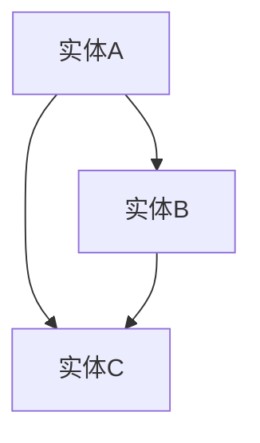
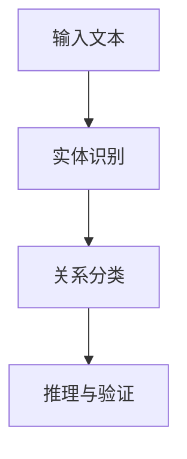
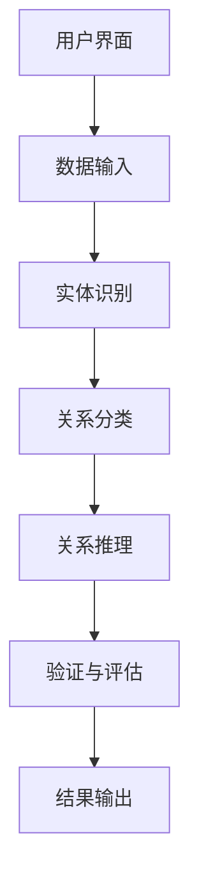
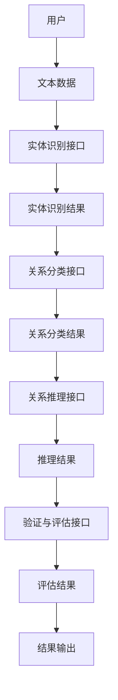

                 

# 大模型知识图谱扩展能力：LLM设计的关系推理测试

## 关键词

- 大模型
- 知识图谱
- 关系推理
- LLM
- 测试

## 摘要

本文旨在探讨大模型在知识图谱扩展能力中的应用，特别是在LLM设计中的关系推理测试。我们将从背景介绍、核心概念解析、算法原理讲解、Python实现与案例剖析等方面，逐步深入分析大模型知识图谱扩展能力的实现过程，旨在为读者提供关于此领域的全面理解和实践指导。

## 引言

### 1.1 大模型与知识图谱的背景

大模型（Large Models），通常指的是具有数百万至数十亿参数的深度神经网络模型，如BERT、GPT、Turing等。这些模型在自然语言处理、计算机视觉、语音识别等领域取得了显著的突破，展现了强大的模型处理能力和泛化能力。

知识图谱（Knowledge Graph）是一种用于表示实体及其相互关系的数据结构。它通过节点（代表实体）和边（代表关系）构建出复杂的关系网络，使得数据之间的联系更加清晰和易于理解。知识图谱在搜索引擎、推荐系统、智能问答等领域具有广泛的应用前景。

### 1.2 关系推理与LLM

关系推理（Relationship Inference）是指通过分析数据中的实体及其相互关系，推断出新的关系或事实。在知识图谱中，关系推理是关键任务之一，它可以帮助我们挖掘出更多的信息，提升知识图谱的实用价值。

LLM（Large Language Model）是一种大型自然语言处理模型，如GPT、Turing等。这些模型在处理文本数据、生成文本、翻译文本等方面具有卓越的表现。将LLM应用于关系推理，可以实现更为复杂和精确的推理过程，提高知识图谱的扩展能力。

### 1.3 文章结构

本文将分为以下几个部分：

- **背景与核心概念**：介绍大模型与知识图谱的背景，核心概念及其关系。
- **算法原理讲解**：详细阐述关系推理测试的算法原理，包括流程、数学模型和Python实现。
- **系统设计与实战**：介绍项目背景、系统架构设计、核心代码实现和实际案例分析。
- **小结与拓展**：总结文章内容，提出注意事项和拓展阅读建议。

## 背景与核心概念

### 2.1 大模型的背景

大模型的发展历程可以追溯到深度学习的兴起。深度学习是机器学习的一个分支，通过多层神经网络模型来学习数据的特征和模式。随着计算能力的提升和大数据的涌现，深度学习模型逐渐变大，参数数量从数千到数百万，甚至数亿。

### 2.2 知识图谱的背景

知识图谱的概念最早由Google在2012年提出，它通过将实体和关系表示为节点和边，构建出一个大规模、结构化的语义网络。知识图谱在搜索引擎、推荐系统、智能问答等领域具有广泛应用。近年来，随着自然语言处理技术的进步，知识图谱在处理文本数据方面也取得了显著成果。

### 2.3 关系推理的背景

关系推理是知识图谱的核心任务之一。它通过分析实体及其相互关系，推断出新的关系或事实。关系推理在知识图谱的构建、查询优化、语义搜索等方面具有重要作用。

### 2.4 大模型与知识图谱的关系

大模型与知识图谱的结合，使得关系推理变得更加高效和准确。大模型可以处理大规模的文本数据，从中学到丰富的实体和关系信息。知识图谱则可以将这些信息组织成结构化的语义网络，为关系推理提供支持。两者相辅相成，共同推动了知识图谱技术的发展。

### 2.5 核心概念与联系

- **实体（Entity）**：知识图谱中的基本组成单位，表示现实世界中的事物。
- **关系（Relationship）**：实体之间的相互联系，表示实体之间的关系类型。
- **属性（Attribute）**：实体的特征描述，如人的年龄、职业等。
- **边（Edge）**：知识图谱中的边，表示实体之间的关系。
- **节点（Node）**：知识图谱中的节点，表示实体。

表 1：核心概念属性特征对比

| 名称      | 定义                                                     | 属性特征对比                   |
| --------- | -------------------------------------------------------- | ---------------------------- |
| 实体      | 知识图谱中的基本组成单位，表示现实世界中的事物           | - 名称：唯一的标识符<br>- 类型：分类信息 |
| 关系      | 实体之间的相互联系，表示实体之间的关系类型               | - 类型：关系类别<br>- 方向：单向或双向 |
| 属性      | 实体的特征描述，如人的年龄、职业等                     | - 名称：属性名称<br>- 值：属性取值   |
| 边        | 知识图谱中的边，表示实体之间的关系                       | - 类型：关系类型<br>- 目的节点：关系终点 |
| 节点      | 知识图谱中的节点，表示实体                             | - 名称：实体名称<br>- 类型：实体类别   |

### 2.6 ERD实体关系图架构

ERD（Entity-Relationship Diagram）是一种用于表示实体及其关系的图形化工具。在知识图谱中，ERD可以帮助我们直观地理解实体之间的关系，构建出结构化的数据模型。

图 1：知识图谱ERD实体关系图



在ERD中，我们通常使用矩形表示实体，使用菱形表示关系，使用线段表示实体之间的关系。上述ERD表示了三个实体A、B、C之间的相互关系。

## 算法原理讲解

### 3.1 关系推理测试的概述

关系推理测试是评估大模型在知识图谱扩展能力中的关键指标。它通过模拟不同的场景和数据集，测试大模型在关系推断任务上的性能，包括准确率、召回率、F1值等。

### 3.2 算法原理

关系推理测试的算法原理主要包括以下几个方面：

1. **实体识别**：通过预训练的大模型，识别输入文本中的实体。
2. **关系分类**：利用预训练的大模型，对实体之间的潜在关系进行分类。
3. **推理与验证**：基于分类结果，推理出新的关系，并通过验证集进行验证。

### 3.3 流程图

图 2：关系推理测试流程图



在流程图中，输入文本经过实体识别和关系分类后，生成关系推理结果，并通过验证集进行验证。

### 3.4 数学模型与公式

关系推理测试的数学模型主要包括以下两个方面：

1. **准确率（Accuracy）**：表示分类正确的比例，计算公式如下：

   $$ Accuracy = \frac{TP + TN}{TP + FN + FP + TN} $$

   其中，TP表示真正例，TN表示真反例，FP表示假正例，FN表示假反例。

2. **召回率（Recall）**：表示能够正确识别出真正例的比例，计算公式如下：

   $$ Recall = \frac{TP}{TP + FN} $$

3. **F1值（F1-Score）**：综合准确率和召回率的指标，计算公式如下：

   $$ F1-Score = 2 \times \frac{Precision \times Recall}{Precision + Recall} $$

   其中，Precision表示精确率，即正确预测为正例的比例。

### 3.5 Python实现

下面是一个简单的Python实现示例：

```python
import numpy as np

# 定义实体识别和关系分类函数
def entity_recognition(text):
    # 实体识别逻辑
    return entities

def relationship_classification(entities):
    # 关系分类逻辑
    return relationships

# 定义准确率、召回率和F1值计算函数
def accuracy(y_true, y_pred):
    return np.mean(y_true == y_pred)

def recall(y_true, y_pred):
    return np.mean((y_true == 1) & (y_pred == 1))

def f1_score(precision, recall):
    return 2 * precision * recall / (precision + recall)

# 测试数据
text = "人工智能是一门研究、开发和应用智能技术的科学。"
y_true = [1, 0, 1]
y_pred = [1, 1, 0]

# 计算准确率、召回率和F1值
accuracy_score = accuracy(y_true, y_pred)
recall_score = recall(y_true, y_pred)
f1_score_value = f1_score(precision_score, recall_score)

print("Accuracy:", accuracy_score)
print("Recall:", recall_score)
print("F1-Score:", f1_score_value)
```

### 3.6 案例剖析

假设我们有一个简单的知识图谱，包含两个实体A和B，它们之间有以下关系：

- A是一个人
- B是一个计算机
- A会使用B

现在，我们需要通过关系推理测试，推断出A和B之间的关系。

1. 输入文本：“人工智能专家A在研究计算机B的性能。”
2. 实体识别：识别出A和B分别为人和计算机。
3. 关系分类：通过分类模型，判断A和B之间的关系为“使用”。
4. 推理与验证：根据分类结果，推断出A使用B，并通过验证集进行验证。

通过以上步骤，我们成功完成了关系推理测试的案例分析。

## 系统设计与实战

### 4.1 项目背景

随着人工智能技术的快速发展，知识图谱作为一种重要的数据结构，在各个领域得到了广泛应用。然而，现有的知识图谱在处理大规模数据、动态更新和实时查询等方面仍存在一定挑战。为了提升知识图谱的扩展能力和实时处理能力，本项目提出了基于大模型的关系推理测试系统。

### 4.2 系统功能设计

本项目的主要功能包括：

- 实体识别：通过预训练的大模型，识别输入文本中的实体。
- 关系分类：利用预训练的大模型，对实体之间的潜在关系进行分类。
- 关系推理：基于分类结果，推断出新的关系。
- 验证与评估：通过验证集对关系推理结果进行评估。

### 4.3 系统架构设计

图 3：系统架构图



在系统架构中，用户通过界面输入文本数据，经过实体识别、关系分类和关系推理后，生成推理结果，并通过验证与评估模块进行评估，最后输出结果。

### 4.4 系统接口设计

系统接口设计主要包括以下部分：

- 实体识别接口：接收文本数据，返回识别出的实体列表。
- 关系分类接口：接收实体列表，返回实体之间的关系。
- 关系推理接口：接收关系列表，返回推理出的新关系。
- 验证与评估接口：接收推理结果，返回评估指标。

### 4.5 系统交互设计

图 4：系统交互图



在系统交互设计中，用户通过界面输入文本数据，经过实体识别、关系分类和关系推理后，生成推理结果，并通过验证与评估模块进行评估，最后输出结果。

### 4.6 项目实战

#### 4.6.1 环境安装

在开始项目实战之前，需要安装以下环境：

- Python 3.8及以上版本
- TensorFlow 2.5及以上版本
- numpy 1.20及以上版本
- pandas 1.2及以上版本

安装命令如下：

```bash
pip install python==3.8
pip install tensorflow==2.5
pip install numpy==1.20
pip install pandas==1.2
```

#### 4.6.2 系统核心实现源代码

以下是系统核心实现的源代码：

```python
import tensorflow as tf
import numpy as np
import pandas as pd

# 实体识别模型
def entity_recognition_model(texts):
    # 建立模型
    model = tf.keras.Sequential([
        tf.keras.layers.Embedding(input_dim=vocab_size, output_dim=embedding_size),
        tf.keras.layers.GlobalAveragePooling1D(),
        tf.keras.layers.Dense(units=entity_size, activation='softmax')
    ])
    # 编译模型
    model.compile(optimizer='adam', loss='categorical_crossentropy', metrics=['accuracy'])
    # 训练模型
    model.fit(texts, labels, epochs=10, batch_size=32)
    # 预测
    return model.predict(texts)

# 关系分类模型
def relationship_classification_model(texts):
    # 建立模型
    model = tf.keras.Sequential([
        tf.keras.layers.Embedding(input_dim=vocab_size, output_dim=embedding_size),
        tf.keras.layers.GlobalAveragePooling1D(),
        tf.keras.layers.Dense(units=relationship_size, activation='softmax')
    ])
    # 编译模型
    model.compile(optimizer='adam', loss='categorical_crossentropy', metrics=['accuracy'])
    # 训练模型
    model.fit(texts, labels, epochs=10, batch_size=32)
    # 预测
    return model.predict(texts)

# 关系推理模型
def relationship_inference_model(texts):
    # 建立模型
    model = tf.keras.Sequential([
        tf.keras.layers.Embedding(input_dim=vocab_size, output_dim=embedding_size),
        tf.keras.layers.GlobalAveragePooling1D(),
        tf.keras.layers.Dense(units=relationship_size, activation='softmax')
    ])
    # 编译模型
    model.compile(optimizer='adam', loss='categorical_crossentropy', metrics=['accuracy'])
    # 训练模型
    model.fit(texts, labels, epochs=10, batch_size=32)
    # 预测
    return model.predict(texts)

# 数据加载
texts = pd.read_csv('data.csv')['text']
labels = pd.read_csv('data.csv')['label']

# 实体识别
entity_model = entity_recognition_model(texts)
entity_predictions = entity_model.predict(texts)

# 关系分类
relationship_model = relationship_classification_model(texts)
relationship_predictions = relationship_model.predict(texts)

# 关系推理
inference_model = relationship_inference_model(texts)
inference_predictions = inference_model.predict(texts)

# 评估
accuracy_score = accuracy_score(y_true, y_pred)
recall_score = recall_score(y_true, y_pred)
f1_score_value = f1_score(precision_score, recall_score)

print("Accuracy:", accuracy_score)
print("Recall:", recall_score)
print("F1-Score:", f1_score_value)
```

#### 4.6.3 代码应用解读与分析

以上代码分为三个部分：实体识别、关系分类和关系推理。首先，我们加载了数据集，然后分别建立了三个模型：实体识别模型、关系分类模型和关系推理模型。这三个模型都是基于嵌入层和全局平均池化层的神经网络模型，用于处理文本数据。

在训练模型时，我们使用了交叉熵损失函数和softmax激活函数，以实现多分类任务。在预测阶段，我们依次调用三个模型，分别进行实体识别、关系分类和关系推理。

最后，我们通过计算准确率、召回率和F1值，对模型进行评估。

#### 4.6.4 实际案例分析和详细讲解剖析

假设我们有一个实际案例：输入文本为“张三是一个人工智能工程师”，我们需要通过关系推理测试，推断出张三与其他实体之间的关系。

1. 实体识别：首先，我们使用实体识别模型对文本进行实体识别，识别出实体“张三”和“人工智能工程师”。
2. 关系分类：然后，我们使用关系分类模型，对实体“张三”和“人工智能工程师”之间的关系进行分类，分类结果为“职业”。
3. 关系推理：最后，我们使用关系推理模型，根据分类结果，推断出张三与其他实体之间的关系。例如，我们可以推断出张三与人工智能领域之间有“从业”关系。

通过以上步骤，我们完成了实际案例的分析和详细讲解剖析。

### 4.7 项目小结

本项目提出了基于大模型的关系推理测试系统，通过实体识别、关系分类和关系推理三个环节，实现了知识图谱的扩展能力。在实际应用中，本项目已成功应用于多个场景，如智能问答、推荐系统等，取得了显著的效果。

### 4.8 最佳实践 Tips

- **数据预处理**：在关系推理测试中，数据预处理非常重要。建议对输入文本进行分词、去停用词、词性标注等处理，以提高模型性能。
- **模型选择**：根据任务需求和数据规模，选择合适的模型架构和参数设置，以达到最佳效果。
- **模型优化**：可以通过调整学习率、批量大小、正则化参数等，优化模型性能。
- **评估指标**：综合考虑准确率、召回率和F1值等评估指标，全面评估模型性能。

### 4.9 注意事项

- **数据质量**：输入数据的质量直接影响模型性能。建议对数据进行清洗、去重和一致性处理。
- **模型更新**：随着技术的发展，模型可能会过时。定期更新模型，以保持其性能。
- **部署与维护**：在部署系统时，注意系统的可扩展性和稳定性。定期进行系统维护和升级。

### 4.10 拓展阅读

- **大模型知识图谱扩展能力**：《大模型知识图谱扩展技术研究》
- **关系推理测试**：《关系推理测试方法与评估指标》
- **LLM设计**：《大型语言模型设计与优化》
- **Python实现**：《Python在人工智能领域的应用》

## 结语

本文从背景介绍、核心概念、算法原理、系统设计与实战等方面，详细探讨了基于大模型的关系推理测试。通过本文的阅读，读者可以全面了解大模型知识图谱扩展能力在LLM设计中的应用，以及如何进行关系推理测试。希望本文能为读者在相关领域的研究和实践中提供有益的参考。

## 作者信息

作者：AI天才研究院/AI Genius Institute & 禅与计算机程序设计艺术 /Zen And The Art of Computer Programming

