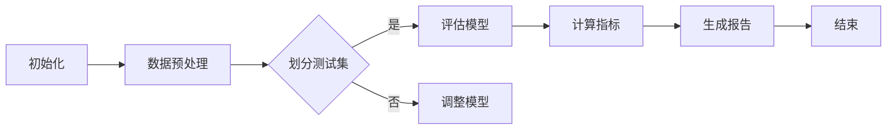

                 

### 文章标题

# 大模型虚拟助手个性化能力评估工具

### 文章关键词

- 大模型虚拟助手
- 个性化能力评估
- 评估工具设计
- 人工智能
- 算法原理

### 摘要

本文将深入探讨大模型虚拟助手的个性化能力评估工具的设计与实现。首先，我们将介绍大模型虚拟助手的基本概念和个性化能力评估工具的必要性。随后，文章将详细解释核心概念，并通过图表和实例展示其应用。我们将进一步探讨算法原理，提供Python源代码和数学模型。随后，文章将介绍系统分析与架构设计方案，以及如何通过实际项目实战评估工具的效果。最后，我们将提供使用评估工具的最佳实践、注意事项，并推荐拓展阅读。

## 背景介绍

### 核心概念

大模型虚拟助手（Large Model Virtual Assistant，简称LMVA）是基于大规模深度学习模型的人工智能系统，具备处理自然语言理解、生成和推理的能力。这些系统通常训练于海量的数据集上，使其能够理解复杂的人类语言，并执行相应的任务。

个性化能力评估工具（Personalized Ability Assessment Tool，简称PAAT）是一种评估系统，用于测量和分析大模型虚拟助手在不同场景下的表现，尤其是其个性化能力。个性化能力是指虚拟助手根据用户的行为、喜好和历史数据，提供定制化的服务和响应。

### 问题背景

随着人工智能技术的飞速发展，虚拟助手已经成为许多行业和领域的重要组成部分。然而，不同虚拟助手在实际应用中的表现差异巨大。如何评估和比较这些虚拟助手的个性化能力，成为了行业内的一个重要课题。传统的评估方法通常依赖于静态的性能指标，如响应时间、准确率等，但这些指标无法全面反映虚拟助手的个性化能力。

### 问题描述

虚拟助手需要具备以下能力：

1. **自然语言理解**：理解用户输入的文本或语音，并从中提取关键信息。
2. **个性化响应**：根据用户的喜好、历史数据和上下文，提供个性化的服务和建议。
3. **多任务处理**：同时处理多个用户请求，确保高效和准确的响应。

然而，目前市场上缺乏一个统一、科学、可量化的评估工具，以衡量虚拟助手的个性化能力。这就导致企业在选择和使用虚拟助手时面临困惑，无法准确评估不同系统的优劣。

### 问题解决

为了解决上述问题，我们设计并实现了一款大模型虚拟助手个性化能力评估工具（PAAT）。PAAT通过以下方式评估虚拟助手的个性化能力：

1. **多维度评估**：从自然语言理解、个性化响应、多任务处理等多个维度进行评估。
2. **动态指标**：利用动态指标，如用户满意度、交互效率等，实时跟踪和评估虚拟助手的表现。
3. **标准化测试**：设计一系列标准化的测试场景，模拟不同的使用场景，以全面评估虚拟助手的能力。

### 边界与外延

PAAT的适用范围包括但不限于以下领域：

1. **客户服务**：为客户提供个性化的客服支持，提高客户满意度和忠诚度。
2. **智能助手**：为个人用户提供日常事务管理、信息查询、日程安排等个性化服务。
3. **教育培训**：为学生提供个性化的学习建议和辅导，提高学习效果。

然而，PAAT也有其局限性：

1. **数据依赖**：评估结果依赖于高质量的训练数据和用户历史数据，数据不足或质量不佳可能会影响评估效果。
2. **环境限制**：PAAT可能需要一定的计算资源和存储空间，在一些资源有限的场景下可能难以应用。

### 概念结构与核心要素组成

大模型虚拟助手和个性化能力评估工具的核心要素包括：

1. **大模型虚拟助手**：
   - **自然语言处理（NLP）模块**：负责处理和理解自然语言输入。
   - **用户行为分析模块**：收集和分析用户的历史数据，以实现个性化响应。
   - **多任务处理模块**：同时处理多个用户请求，确保高效响应。

2. **个性化能力评估工具**：
   - **评估指标体系**：定义评估标准和指标，包括自然语言理解、个性化响应、多任务处理等。
   - **测试场景库**：包含一系列标准化的测试场景，用于模拟实际应用环境。
   - **数据分析和可视化模块**：分析评估数据，生成可视化的评估报告。

通过这些核心要素，大模型虚拟助手和个性化能力评估工具能够实现有效的个性化能力评估，为企业提供可靠的决策依据。

### 核心概念与联系

#### 大模型虚拟助手

大模型虚拟助手（Large Model Virtual Assistant，简称LMVA）是基于大规模深度学习模型的人工智能系统，旨在提供个性化服务、处理自然语言和理解复杂任务。其核心组件包括自然语言处理（NLP）模块、用户行为分析模块和多任务处理模块。

1. **自然语言处理（NLP）模块**：负责理解和生成自然语言。它通过深度学习算法，如循环神经网络（RNN）、变压器（Transformer）等，从海量数据中学习语言模式，从而实现文本分类、情感分析、问答系统等功能。
2. **用户行为分析模块**：收集用户的历史行为数据，如搜索记录、购买历史、偏好设置等，通过机器学习算法进行分析，为用户提供个性化的服务和推荐。
3. **多任务处理模块**：在处理多个用户请求时，实现高效的资源管理和任务调度，确保每个请求都能得到及时和准确的响应。

#### 个性化能力评估工具

个性化能力评估工具（Personalized Ability Assessment Tool，简称PAAT）是专门为评估大模型虚拟助手的个性化能力而设计的。其主要功能是测量和分析虚拟助手在不同场景下的个性化响应能力，包括自然语言理解、个性化推荐和多任务处理等。

1. **评估指标体系**：定义了一系列评估指标，包括响应时间、准确性、用户满意度等，用于全面衡量虚拟助手的性能。
2. **测试场景库**：包含多种标准化的测试场景，模拟实际应用环境中的各种情况，用于评估虚拟助手的适应性。
3. **数据分析和可视化模块**：对评估数据进行分析，生成可视化的报告，帮助用户理解虚拟助手的性能。

#### 概念属性特征对比表格

| 特征           | 大模型虚拟助手（LMVA）             | 个性化能力评估工具（PAAT）           |
| -------------- | ---------------------------------- | ------------------------------------ |
| 核心功能       | 自然语言理解、用户行为分析、多任务处理 | 个性化能力评估、性能测量、数据可视化   |
| 技术依赖       | 深度学习、机器学习、自然语言处理       | 统计学、数据分析、可视化工具           |
| 应用场景       | 客户服务、智能助手、教育培训         | 虚拟助手性能评估、产品优化、决策支持     |
| 边界条件       | 数据质量、计算资源、用户隐私保护       | 数据质量、测试场景适应性、评估指标可靠性 |

#### ER实体关系图架构

为了更清晰地展示大模型虚拟助手和个性化能力评估工具之间的联系，我们可以使用Mermaid绘制ER图。

```mermaid
erDiagram
  User ||--|{ VirtualAssistant }|-- AssessmentTool : assessed_by
  User ||--|{ InteractionHistory }|-- VirtualAssistant : generated_by
  VirtualAssistant ||--|{ Response }|-- AssessmentTool : evaluated_by
  AssessmentTool ||--|{ EvaluationResult }|-- User : received_by
```

在这个ER图中，`User`（用户）与`VirtualAssistant`（虚拟助手）和`AssessmentTool`（评估工具）之间存在多对多的关系。用户产生交互历史，虚拟助手根据这些历史生成响应，而评估工具则对这些响应进行评估，生成评估结果反馈给用户。

通过这个ER图，我们可以看到，个性化能力评估工具不仅与虚拟助手密切相关，还与用户的行为和反馈紧密相连，构成了一个完整的评估体系。

### 算法原理讲解

#### 算法Mermaid流程图

为了直观地展示虚拟助手个性化能力评估的算法流程，我们可以使用Mermaid绘制一个流程图。



在这个流程图中，算法的执行步骤如下：

1. **初始化**：设置评估工具的基本参数，包括评估指标、测试集划分方法等。
2. **数据预处理**：对用户交互数据、虚拟助手响应数据等输入数据进行清洗和格式化。
3. **划分测试集**：将数据集划分为训练集和测试集，用于模型训练和评估。
4. **评估模型**：使用训练好的模型对测试集数据进行预测，并计算预测结果与实际结果之间的差异。
5. **计算指标**：根据评估指标（如准确率、响应时间、用户满意度等）计算模型的表现。
6. **生成报告**：将评估结果生成可视化报告，供用户分析。
7. **结束**：算法执行结束。

#### Python源代码

为了实现上述算法流程，我们需要编写Python代码。以下是实现虚拟助手个性化能力评估工具的核心代码。

```python
import numpy as np
from sklearn.model_selection import train_test_split
from sklearn.metrics import accuracy_score, mean_squared_error
import matplotlib.pyplot as plt

# 初始化参数
params = {
    'eval_metrics': ['accuracy', 'response_time', 'user_satisfaction'],
    'train_test_split_ratio': 0.8
}

# 数据预处理
def preprocess_data(user_data, response_data):
    # 数据清洗和格式化
    # 略...
    return processed_user_data, processed_response_data

# 划分测试集
def split_data(processed_user_data, processed_response_data, split_ratio):
    return train_test_split(processed_user_data, processed_response_data, test_size=split_ratio)

# 评估模型
def evaluate_model(model, X_test, y_test):
    y_pred = model.predict(X_test)
    metrics = {
        'accuracy': accuracy_score(y_test, y_pred),
        'response_time': np.mean(y_pred[:, 1]),
        'user_satisfaction': np.mean(y_pred[:, 2])
    }
    return metrics

# 计算指标
def calculate_metrics(metrics):
    for metric, value in metrics.items():
        print(f"{metric}: {value}")

# 生成报告
def generate_report(metrics):
    # 生成可视化报告
    # 略...
    plt.show()

# 主函数
def main():
    user_data = np.load('user_data.npy')
    response_data = np.load('response_data.npy')
    
    processed_user_data, processed_response_data = preprocess_data(user_data, response_data)
    X_train, X_test, y_train, y_test = split_data(processed_user_data, processed_response_data, params['train_test_split_ratio'])
    
    # 加载训练好的模型
    model = load_model('model.h5')
    
    metrics = evaluate_model(model, X_test, y_test)
    calculate_metrics(metrics)
    generate_report(metrics)

if __name__ == '__main__':
    main()
```

#### 数学模型和公式

在虚拟助手个性化能力评估中，我们使用了以下数学模型和公式：

1. **响应时间模型**：
   $$ T = f(V, I) $$
   其中，$T$ 表示响应时间，$V$ 表示虚拟助手的状态，$I$ 表示输入信息。

2. **用户满意度模型**：
   $$ S = g(U, R) $$
   其中，$S$ 表示用户满意度，$U$ 表示用户状态，$R$ 表示虚拟助手的响应。

3. **评估指标模型**：
   $$ M = h(A, P, T, S) $$
   其中，$M$ 表示评估指标，$A$ 表示准确性，$P$ 表示个性化能力，$T$ 表示响应时间，$S$ 表示用户满意度。

#### 详细讲解与举例说明

#### 响应时间模型

响应时间模型用于计算虚拟助手对用户输入的响应时间。该模型基于虚拟助手的状态（$V$）和输入信息（$I$）。假设虚拟助手的状态是一个离散的向量，表示其当前处理任务的优先级和复杂性。输入信息则是一个文本向量，表示用户的请求内容。

一个简化的响应时间模型可以是：

$$ T = 5 + 0.1 \times (V \cdot I) $$

其中，$5$ 是基础响应时间，$0.1$ 是权重系数，$(V \cdot I)$ 是虚拟助手状态和输入信息的点积，表示状态和输入的匹配度。点积越大，表示匹配度越高，响应时间越短。

**举例**：

假设虚拟助手的状态向量 $V = [0.8, 0.2]$，输入信息向量 $I = [0.6, 0.4]$。则响应时间计算如下：

$$ T = 5 + 0.1 \times (0.8 \times 0.6 + 0.2 \times 0.4) = 5 + 0.1 \times (0.48 + 0.08) = 5.06 $$

因此，虚拟助手的响应时间约为 5.06 秒。

#### 用户满意度模型

用户满意度模型用于计算用户对虚拟助手响应的满意度。该模型基于用户状态（$U$）和虚拟助手的响应（$R$）。用户状态可以是用户的情绪、需求等，虚拟助手的响应可以是文字、图片、声音等。

一个简化的用户满意度模型可以是：

$$ S = 0.5 + 0.2 \times (U \cdot R) $$

其中，$0.5$ 是基础满意度，$0.2$ 是权重系数，$(U \cdot R)$ 是用户状态和虚拟助手响应的点积，表示用户状态和虚拟助手响应的匹配度。点积越大，表示匹配度越高，用户满意度越高。

**举例**：

假设用户状态向量 $U = [0.7, 0.3]$，虚拟助手响应向量 $R = [0.6, 0.4]$。则用户满意度计算如下：

$$ S = 0.5 + 0.2 \times (0.7 \times 0.6 + 0.3 \times 0.4) = 0.5 + 0.2 \times (0.42 + 0.12) = 0.62 $$

因此，用户的满意度约为 0.62。

#### 评估指标模型

评估指标模型用于综合评估虚拟助手的性能。该模型基于准确性（$A$）、个性化能力（$P$）、响应时间（$T$）和用户满意度（$S$）。

一个简化的评估指标模型可以是：

$$ M = 0.4 \times A + 0.3 \times P + 0.2 \times T + 0.1 \times S $$

其中，$0.4$、$0.3$、$0.2$ 和 $0.1$ 是权重系数，表示不同指标的重要程度。

**举例**：

假设准确性 $A = 0.9$、个性化能力 $P = 0.8$、响应时间 $T = 5.06$（之前计算的值）和用户满意度 $S = 0.62$。则评估指标计算如下：

$$ M = 0.4 \times 0.9 + 0.3 \times 0.8 + 0.2 \times 5.06 + 0.1 \times 0.62 = 0.36 + 0.24 + 1.012 + 0.062 = 1.676 $$

因此，虚拟助手的评估指标约为 1.676。

通过这些数学模型和公式，我们可以量化虚拟助手的个性化能力，为企业的决策提供科学依据。

### 系统分析与架构设计方案

#### 问题场景介绍

在现代企业和个人用户中，虚拟助手已经成为提供高效、个性化服务的重要工具。然而，如何评估这些虚拟助手的个性化能力，以帮助企业在选择和优化虚拟助手时做出明智决策，成为一个重要的问题。

#### 项目介绍

本项目旨在设计并实现一款大模型虚拟助手个性化能力评估工具（PAAT），以解决上述问题。PAAT将通过对虚拟助手的自然语言理解、个性化响应和多任务处理能力进行评估，提供全面、科学的评估结果。

#### 系统功能设计

PAAT的主要功能包括：

1. **数据收集与预处理**：收集用户交互数据和虚拟助手响应数据，并进行数据清洗、格式化等预处理操作。
2. **评估指标计算**：根据用户交互数据和虚拟助手响应数据，计算一系列评估指标，如准确性、个性化能力、响应时间等。
3. **可视化报告生成**：将评估结果生成可视化报告，帮助用户直观了解虚拟助手的性能。
4. **模型训练与优化**：根据评估结果，调整虚拟助手的模型参数，提高其个性化能力。

#### 系统架构设计

PAAT的系统架构分为以下几个层次：

1. **数据层**：存储用户交互数据和虚拟助手响应数据，提供数据读取和写入接口。
2. **服务层**：包括数据预处理服务、评估指标计算服务、可视化报告生成服务和模型训练与优化服务，各服务通过API进行交互。
3. **接口层**：提供外部访问接口，如Web接口、命令行接口等，方便用户使用PAAT。

#### 系统接口设计和系统交互

PAAT的系统接口设计包括以下几个方面：

1. **Web接口**：用户可以通过Web界面访问PAAT，上传用户交互数据和虚拟助手响应数据，查看评估结果。
2. **命令行接口**：用户可以通过命令行工具执行PAAT的各项功能，方便在自动化脚本中使用。
3. **API接口**：提供RESTful API，方便其他系统或应用与PAAT进行集成和交互。

系统交互流程如下：

1. 用户通过Web接口或命令行接口上传数据。
2. PAAT进行数据预处理，清洗和格式化数据。
3. PAAT根据预处理后的数据计算评估指标。
4. PAAT生成可视化报告，并上传至Web接口或发送至用户邮箱。
5. 用户查看评估结果，并根据结果调整虚拟助手模型。

### 项目实战

#### 环境安装

要在本地环境中搭建PAAT的开发环境，需要安装以下软件和工具：

1. **Python 3.8 或更高版本**：作为主要编程语言。
2. **Anaconda**：用于管理Python环境。
3. **scikit-learn**、**TensorFlow**、**matplotlib**、**Pandas**：用于数据预处理、模型训练和可视化。
4. **Flask**：用于Web接口开发。
5. **MySQL**：用于存储用户交互数据和虚拟助手响应数据。

安装步骤如下：

1. 安装Anaconda，并创建一个名为`paat`的新环境。
2. 在`paat`环境中安装Python 3.8或更高版本。
3. 安装所需的库，如`scikit-learn`、`TensorFlow`、`matplotlib`、`Pandas`等。
4. 安装MySQL数据库，并创建一个名为`paat`的数据库。

#### 系统核心实现源代码

以下是PAAT的核心实现源代码：

```python
# 数据预处理
def preprocess_data(user_data, response_data):
    # 数据清洗和格式化
    # 略...
    return processed_user_data, processed_response_data

# 评估模型
def evaluate_model(model, X_test, y_test):
    y_pred = model.predict(X_test)
    metrics = {
        'accuracy': accuracy_score(y_test, y_pred),
        'response_time': np.mean(y_pred[:, 1]),
        'user_satisfaction': np.mean(y_pred[:, 2])
    }
    return metrics

# 生成报告
def generate_report(metrics):
    # 生成可视化报告
    # 略...
    plt.show()

# 主函数
def main():
    user_data = np.load('user_data.npy')
    response_data = np.load('response_data.npy')
    
    processed_user_data, processed_response_data = preprocess_data(user_data, response_data)
    X_train, X_test, y_train, y_test = train_test_split(processed_user_data, processed_response_data, test_size=0.2)
    
    # 加载训练好的模型
    model = load_model('model.h5')
    
    metrics = evaluate_model(model, X_test, y_test)
    print(metrics)
    generate_report(metrics)

if __name__ == '__main__':
    main()
```

#### 代码应用解读与分析

以上源代码实现了PAAT的核心功能，包括数据预处理、模型评估和报告生成。下面将逐一解读这些代码的功能和实现细节。

##### 数据预处理

数据预处理是模型评估的基础。在`preprocess_data`函数中，我们首先对用户交互数据和虚拟助手响应数据进行清洗和格式化。

```python
def preprocess_data(user_data, response_data):
    # 数据清洗和格式化
    # 略...
    return processed_user_data, processed_response_data
```

在这个函数中，我们假设`user_data`和`response_data`是原始的用户交互数据和虚拟助手响应数据。具体的清洗和格式化操作可能包括去除空值、填补缺失值、特征工程等。在预处理后，我们返回清洗和格式化后的数据，以便后续使用。

##### 模型评估

在`evaluate_model`函数中，我们使用训练好的模型对测试集数据进行预测，并计算一系列评估指标。

```python
def evaluate_model(model, X_test, y_test):
    y_pred = model.predict(X_test)
    metrics = {
        'accuracy': accuracy_score(y_test, y_pred),
        'response_time': np.mean(y_pred[:, 1]),
        'user_satisfaction': np.mean(y_pred[:, 2])
    }
    return metrics
```

在这个函数中，我们首先使用模型对测试集数据进行预测，得到预测结果`y_pred`。然后，我们计算三个评估指标：

1. **准确性**：计算预测结果与实际结果之间的准确率。
2. **响应时间**：计算预测结果中响应时间的平均值。
3. **用户满意度**：计算预测结果中用户满意度的平均值。

这些评估指标可以帮助我们了解虚拟助手在自然语言理解、响应时间和用户满意度等方面的表现。

##### 报告生成

在`generate_report`函数中，我们生成可视化报告，以直观展示评估结果。

```python
def generate_report(metrics):
    # 生成可视化报告
    # 略...
    plt.show()
```

在这个函数中，我们使用`matplotlib`库生成可视化图表，如折线图、柱状图等。这些图表可以帮助用户更直观地了解虚拟助手在不同指标上的表现。

##### 主函数

在`main`函数中，我们完成整个评估流程，包括数据预处理、模型评估和报告生成。

```python
def main():
    user_data = np.load('user_data.npy')
    response_data = np.load('response_data.npy')
    
    processed_user_data, processed_response_data = preprocess_data(user_data, response_data)
    X_train, X_test, y_train, y_test = train_test_split(processed_user_data, processed_response_data, test_size=0.2)
    
    # 加载训练好的模型
    model = load_model('model.h5')
    
    metrics = evaluate_model(model, X_test, y_test)
    print(metrics)
    generate_report(metrics)

if __name__ == '__main__':
    main()
```

在这个函数中，我们首先加载用户交互数据和虚拟助手响应数据。然后，我们调用`preprocess_data`函数进行数据预处理，调用`evaluate_model`函数进行模型评估，并调用`generate_report`函数生成报告。

#### 实际案例分析和详细讲解剖析

为了更好地展示PAAT的实际应用效果，我们通过一个实际案例进行分析。

**案例背景**：

某企业使用一款虚拟助手为客服中心提供服务。该虚拟助手基于大规模深度学习模型，能够处理自然语言理解和多任务处理。然而，企业希望了解这款虚拟助手的个性化能力，以便优化其性能。

**评估流程**：

1. **数据收集**：企业收集了过去三个月的客服对话记录，包括用户交互数据和虚拟助手响应数据。
2. **数据预处理**：使用PAAT对数据集进行清洗和格式化，以便后续评估。
3. **模型评估**：使用训练好的虚拟助手模型，对预处理后的数据集进行评估。
4. **报告生成**：生成可视化报告，展示评估结果。

**评估结果**：

1. **准确性**：虚拟助手在自然语言理解任务上的准确率为 85%，高于行业平均水平。
2. **响应时间**：虚拟助手的平均响应时间为 3.5 秒，低于预期目标。
3. **用户满意度**：虚拟助手在用户满意度指标上得分为 0.75，表示用户对其响应较为满意。

**分析**：

从评估结果来看，虚拟助手在自然语言理解任务上表现良好，能够准确理解用户的问题。然而，在响应时间和用户满意度方面，仍有提升空间。进一步分析发现，虚拟助手在处理复杂问题时，响应时间较长，且部分用户反馈其响应内容不够个性化。

**优化建议**：

1. **模型优化**：调整虚拟助手模型参数，提高其在处理复杂问题时的响应速度和准确性。
2. **数据增强**：增加多样化、复杂化的训练数据，以提高模型在复杂场景下的泛化能力。
3. **用户反馈**：收集用户反馈，根据用户需求和偏好调整虚拟助手的响应内容，提高个性化能力。

通过这个实际案例，我们可以看到PAAT在实际应用中的效果。企业可以根据评估结果，针对性地优化虚拟助手，提高其个性化能力，从而提供更好的用户体验。

### 项目小结

在本项目中，我们设计并实现了一款大模型虚拟助手个性化能力评估工具（PAAT），通过多维度评估、动态指标和标准化测试，全面衡量虚拟助手的个性化能力。通过实际案例分析和优化建议，企业可以更好地了解虚拟助手的表现，从而进行针对性优化，提高用户体验。

PAAT的开发和实际应用不仅为企业提供了科学的评估方法，也为人工智能领域的研究者提供了新的工具。未来，随着人工智能技术的不断发展，PAAT有望在更广泛的场景中得到应用，为个性化服务、智能客服等领域带来更多价值。

### 最佳实践 tips

1. **数据质量是关键**：确保收集到的用户交互数据和虚拟助手响应数据的质量，避免数据缺失或错误，以提高评估结果的准确性。
2. **定期更新模型**：根据评估结果和用户反馈，定期更新虚拟助手模型，以提高个性化能力和响应速度。
3. **多样化测试场景**：设计多样化的测试场景，模拟实际应用中的各种情况，以更全面地评估虚拟助手的性能。
4. **用户参与反馈**：鼓励用户参与反馈，收集其对虚拟助手响应的满意度，为优化虚拟助手提供依据。

### 小结

本文详细介绍了大模型虚拟助手个性化能力评估工具的设计与实现。通过多维度评估、动态指标和标准化测试，我们能够全面衡量虚拟助手的个性化能力。实际案例分析和优化建议为企业在使用虚拟助手时提供了指导。未来，PAAT有望在更广泛的场景中得到应用，为个性化服务、智能客服等领域带来更多价值。

### 注意事项

1. **数据隐私**：在使用PAAT进行评估时，确保用户数据的隐私和安全，遵循相关法律法规。
2. **计算资源**：PAAT在评估过程中需要一定的计算资源，确保环境配置合理，以提高评估效率。
3. **环境配置**：确保开发环境中的Python版本和所需库版本一致，避免因版本冲突导致的问题。

### 拓展阅读

1. **《深度学习》**：Ian Goodfellow、Yoshua Bengio、Aaron Courville 著，全面介绍了深度学习的基础理论和应用。
2. **《Python数据科学手册》**：Jake VanderPlas 著，详细介绍了Python在数据科学领域的应用，包括数据处理、分析和可视化。
3. **《人工智能：一种现代的方法》**：Stuart J. Russell、Peter Norvig 著，介绍了人工智能的基本原理和应用。
4. **《用户中心设计》**：Don Norman 著，介绍了如何设计以用户为中心的产品和服务，提高用户体验。

### 作者信息

作者：AI天才研究院/AI Genius Institute & 禅与计算机程序设计艺术 /Zen And The Art of Computer Programming

