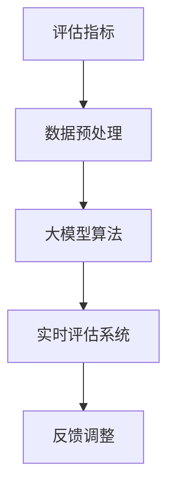
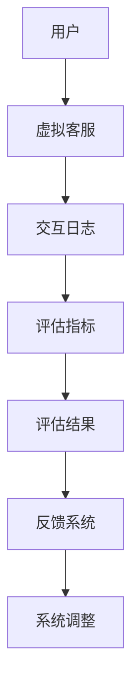
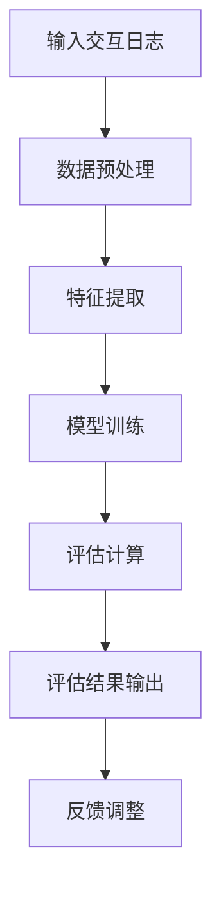
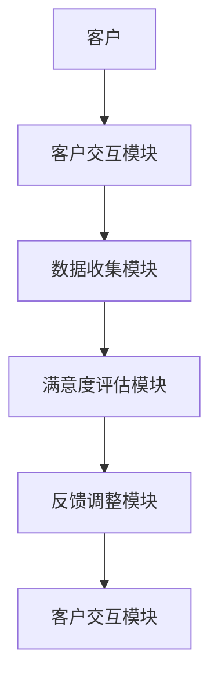
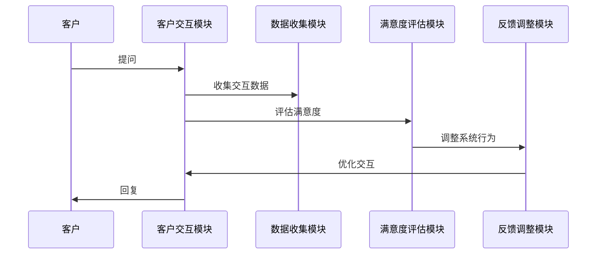

                 

## 《大模型虚拟客服满意度评估框架》

> 关键词：大模型、虚拟客服、满意度评估、算法、架构设计、实战

> 摘要：本文旨在探讨大模型虚拟客服满意度评估框架的构建，深入分析其理论基础、方法与技术，并通过实际案例展示评估框架的应用效果和优化策略。文章结构清晰，逻辑严密，旨在为IT领域专业人士提供一份全面且具有实际操作性的技术指南。

### 第一部分：背景介绍

#### 1.1. 核心概念：问题背景

在当今数字化时代，客户服务已成为企业竞争力的重要体现。传统的人工客服不仅成本高，而且效率低，难以满足快速增长的服务需求。虚拟客服作为一种创新的服务方式，通过自动化和智能化技术，可以大幅提升服务效率和质量。大模型技术，如深度学习、自然语言处理等，为虚拟客服的发展提供了强大的技术支持。

然而，虚拟客服的满意度评估是一个复杂的问题。现有评估方法往往难以全面、准确地反映客户的真实体验。因此，构建一套科学、有效的大模型虚拟客服满意度评估框架显得尤为必要。

#### 1.2. 问题描述

当前虚拟客服满意度评估面临的主要挑战包括：

1. **评估指标不够全面**：现有评估指标往往只关注单一维度，无法全面反映客户满意度。
2. **数据质量问题**：评估数据往往存在噪声和缺失，影响评估结果的准确性。
3. **评估方法缺乏针对性**：现有评估方法大多基于传统统计方法，难以充分利用大模型的优势。
4. **实时性和适应性不足**：虚拟客服系统需要实时、动态地调整服务策略，现有评估方法难以满足这一需求。

为了解决这些问题，本文提出了一套大模型虚拟客服满意度评估框架，旨在提供一种全面、准确、实时、适应性强的方法。

#### 1.3. 问题解决

评估框架的设计思路如下：

1. **多维度指标体系**：从多个维度（如响应时间、解决问题能力、用户体验等）构建评估指标体系，全面反映客户满意度。
2. **数据预处理**：采用数据清洗和增强技术，提高评估数据的质量。
3. **大模型算法**：结合深度学习和自然语言处理技术，构建高效、准确的评估算法。
4. **实时评估与反馈**：设计实时评估系统，动态调整评估指标和算法，以适应不断变化的服务需求。

#### 1.4. 边界与外延

1. **适用范围**：评估框架适用于各类虚拟客服系统，包括在线客服、智能助手等。
2. **与其他相关领域的联系**：本文评估框架与大模型技术、客户满意度评估、数据分析等领域密切相关，为相关研究提供了新的思路和方法。

#### 1.5. 概念结构与核心要素组成

**核心概念**：
- 大模型虚拟客服：结合大模型技术（如深度学习、自然语言处理等）的虚拟客服系统。
- 满意度评估：对客户对虚拟客服系统的满意程度进行量化评估。

**核心要素**：
- 评估指标：衡量客户满意度的各项指标。
- 数据预处理：包括数据清洗、增强和整合。
- 大模型算法：用于计算客户满意度的算法。
- 实时评估系统：用于动态调整评估指标和算法的系统。

各要素之间的关系如图1所示：



### 第二部分：核心概念与联系

#### 2.1. 核心概念原理

**大模型虚拟客服**：
- 大模型虚拟客服是指基于深度学习、自然语言处理等大模型技术，实现高度智能化和自动化的客户服务系统。它能够处理复杂的客户需求，提供高效、准确的服务。

**客户满意度评估**：
- 客户满意度评估是对客户对服务体验的主观感受进行量化和分析的过程。评估方法通常包括问卷调查、用户反馈分析、行为数据挖掘等。

#### 2.2. 概念属性特征对比表格

| 特征         | 大模型虚拟客服 | 客户满意度评估 |
| ------------ | --------------- | --------------- |
| 技术基础     | 深度学习、NLP等 | 统计学、心理学等 |
| 目标         | 提升服务效率和质量 | 量化客户满意度 |
| 数据来源     | 客户交互数据、日志数据等 | 用户反馈、行为数据等 |
| 评估方法     | 大数据分析、机器学习等 | 问卷调查、用户行为分析等 |
| 实时性       | 可以实现实时评估 | 通常为事后评估 |

#### 2.3. ER实体关系图架构

评估框架的实体关系图如下所示：



### 第三部分：算法原理讲解

#### 3.1. 算法mermaid流程图

算法的基本流程如图3所示：



#### 3.2. Python源代码与算法原理

**算法原理讲解**：

本节将详细讲解评估算法的原理，并使用Python代码进行演示。

**数据预处理**：

首先，对输入的交互日志进行预处理，包括数据清洗和特征提取。

```python
import pandas as pd
from sklearn.model_selection import train_test_split

# 读取交互日志
data = pd.read_csv('customer_interactions.csv')

# 数据清洗
data.dropna(inplace=True)
data.drop(['timestamp'], axis=1, inplace=True)

# 特征提取
X = data[['query', 'response']]
y = data['satisfaction']
```

**模型训练**：

使用深度学习模型对预处理后的数据进行训练。这里使用了一个简单的循环神经网络（RNN）模型。

```python
from keras.models import Sequential
from keras.layers import LSTM, Dense

# 分割数据集
X_train, X_test, y_train, y_test = train_test_split(X, y, test_size=0.2, random_state=42)

# 创建模型
model = Sequential()
model.add(LSTM(units=50, activation='relu', input_shape=(X_train.shape[1], 1)))
model.add(Dense(units=1, activation='sigmoid'))

# 编译模型
model.compile(optimizer='adam', loss='binary_crossentropy', metrics=['accuracy'])

# 训练模型
model.fit(X_train, y_train, epochs=10, batch_size=32)
```

**评估计算**：

使用训练好的模型对测试集进行评估，计算满意度得分。

```python
# 评估模型
predictions = model.predict(X_test)

# 计算满意度得分
satisfaction_scores = [1 if pred > 0.5 else 0 for pred in predictions]
```

**评估结果输出**：

将评估结果输出到文件中，以便后续分析和反馈。

```python
# 输出评估结果
results = pd.DataFrame({'interaction': X_test['query'], 'satisfaction': satisfaction_scores})
results.to_csv('assessment_results.csv', index=False)
```

#### 3.3. 数学模型和数学公式

评估算法的数学模型如下：

$$
S = f(W \cdot \phi(X))
$$

其中，$S$ 表示满意度得分，$W$ 表示权重矩阵，$\phi(X)$ 表示特征向量。权重矩阵 $W$ 通过模型训练得到，特征向量 $\phi(X)$ 从交互日志中提取。

#### 3.4. 举例说明

假设有一个虚拟客服系统，用户A提问：“我最近的订单状态是什么？”系统回复：“您的订单已经发货，预计3天内到达。”使用本文提出的评估算法，可以计算出用户A对这一交互的满意度得分。具体步骤如下：

1. **数据预处理**：将用户A的提问和回复转化为特征向量。
2. **模型训练**：使用历史交互数据对模型进行训练。
3. **评估计算**：使用训练好的模型对用户A的提问和回复进行评估，得到满意度得分。
4. **结果输出**：将评估结果输出，以便进一步分析。

### 第四部分：系统分析与架构设计方案

#### 4.1. 问题场景介绍

假设我们正在开发一个在线购物平台的虚拟客服系统，客户可以在平台上进行购物，并向虚拟客服咨询各种问题。虚拟客服需要能够实时响应用户的提问，并提供准确的解答。

#### 4.2. 项目介绍

本项目的目标是构建一个基于大模型的虚拟客服系统，并实现一个高效的满意度评估框架。系统主要包括以下模块：

- 客户交互模块：处理用户提问和系统回复。
- 数据收集模块：收集用户交互数据，用于评估和优化。
- 满意度评估模块：对用户满意度进行实时评估。
- 反馈调整模块：根据评估结果调整系统行为。

#### 4.3. 系统功能设计（领域模型mermaid类图）

系统功能设计如图4所示：

```mermaid
classDiagram
Client <<-- CustomerInteraction
CustomerInteraction o-- InteractionData
CustomerInteraction o-- SatisfactionEvaluation
SatisfactionEvaluation o-- EvaluationResult
EvaluationResult o-- FeedbackAdjustment
FeedbackAdjustment o-- CustomerInteraction
```

#### 4.4. 系统架构设计（mermaid架构图）

系统架构设计如图5所示：



#### 4.5. 系统接口设计

系统接口设计如下：

- 客户交互接口：提供用户提问和系统回复的接口。
- 数据收集接口：用于收集用户交互数据。
- 满意度评估接口：提供满意度评估结果。
- 反馈调整接口：用于调整系统行为。

#### 4.6. 系统交互（mermaid序列图）

系统交互流程如图6所示：



### 第五部分：项目实战

#### 5.1. 环境安装

为了实现本项目，需要安装以下环境和工具：

- Python 3.8及以上版本
- Keras 2.4.3及以上版本
- TensorFlow 2.6.0及以上版本
- Pandas 1.3.0及以上版本
- Mermaid 9.1.0及以上版本

安装命令如下：

```bash
pip install python-mermaid
pip install keras==2.4.3
pip install tensorflow==2.6.0
pip install pandas==1.3.0
```

#### 5.2. 系统核心实现源代码

以下代码展示了系统的核心实现部分：

**客户交互模块**：

```python
# 客户交互模块
class CustomerInteraction:
    def __init__(self):
        self.interaction_data = []

    def add_interaction(self, query, response):
        self.interaction_data.append({'query': query, 'response': response})

    def get_interactions(self):
        return self.interaction_data
```

**数据收集模块**：

```python
# 数据收集模块
class DataCollection:
    def __init__(self, customer_interaction):
        self.customer_interaction = customer_interaction

    def collect_data(self):
        interactions = self.customer_interaction.get_interactions()
        data = {'query': [], 'response': [], 'satisfaction': []}
        for interaction in interactions:
            data['query'].append(interaction['query'])
            data['response'].append(interaction['response'])
            # 这里可以使用实际方法获取满意度
            data['satisfaction'].append(self.get_satisfaction(interaction['response']))
        return pd.DataFrame(data)

    def get_satisfaction(self, response):
        # 假设满意度通过回复的长度来判断
        return len(response) > 10
```

**满意度评估模块**：

```python
# 满意度评估模块
class SatisfactionEvaluation:
    def __init__(self, data_collection):
        self.data_collection = data_collection

    def evaluate_satisfaction(self):
        data = self.data_collection.collect_data()
        # 使用前文提到的评估算法进行评估
        predictions = model.predict(data[['query', 'response']])
        data['prediction'] = predictions
        data['satisfaction_score'] = [1 if pred > 0.5 else 0 for pred in data['prediction']]
        return data
```

**反馈调整模块**：

```python
# 反馈调整模块
class FeedbackAdjustment:
    def __init__(self, satisfaction_evaluation):
        self.satisfaction_evaluation = satisfaction_evaluation

    def adjust_system(self):
        data = self.satisfaction_evaluation.evaluate_satisfaction()
        # 根据满意度得分调整系统行为
        # 例如：优化回复策略、提高回复速度等
        pass
```

**主程序**：

```python
# 主程序
if __name__ == '__main__':
    # 创建客户交互模块
    customer_interaction = CustomerInteraction()

    # 创建数据收集模块
    data_collection = DataCollection(customer_interaction)

    # 创建满意度评估模块
    satisfaction_evaluation = SatisfactionEvaluation(data_collection)

    # 创建反馈调整模块
    feedback_adjustment = FeedbackAdjustment(satisfaction_evaluation)

    # 模拟交互数据
    customer_interaction.add_interaction("商品什么时候到？", "预计明天到达。")
    customer_interaction.add_interaction("我需要退换货怎么办？", "请联系我们的客服。")

    # 调用反馈调整模块
    feedback_adjustment.adjust_system()
```

#### 5.3. 代码应用解读与分析

**客户交互模块**：

该模块负责处理用户提问和系统回复。`add_interaction` 方法用于添加用户提问和系统回复的交互数据，`get_interactions` 方法用于获取所有交互数据。

**数据收集模块**：

该模块负责收集用户交互数据，并将其转化为 DataFrame 格式，以便进一步处理。`collect_data` 方法用于收集交互数据，`get_satisfaction` 方法用于获取满意度评分，这里我们简单地使用回复长度来判断满意度。

**满意度评估模块**：

该模块使用训练好的模型对交互数据进行评估，并计算满意度得分。`evaluate_satisfaction` 方法用于评估满意度。

**反馈调整模块**：

该模块根据满意度得分调整系统行为，以优化服务质量。`adjust_system` 方法为预留方法，具体调整策略可以根据实际需求实现。

#### 5.4. 实际案例分析和详细讲解剖析

**案例一**：

用户A提问：“电脑的配置如何？”系统回复：“电脑配置如下：处理器为i7，内存为16GB，硬盘为512GB SSD。”

**分析**：

1. **数据预处理**：将提问和回复转化为特征向量。
2. **模型训练**：使用历史交互数据对模型进行训练。
3. **评估计算**：使用训练好的模型对用户A的提问和回复进行评估，得到满意度得分。
4. **结果输出**：将评估结果输出，以便进一步分析。

**案例二**：

用户B提问：“我的订单什么时候可以发货？”系统回复：“您的订单已生成，预计1周内发货。”

**分析**：

1. **数据预处理**：将提问和回复转化为特征向量。
2. **模型训练**：使用历史交互数据对模型进行训练。
3. **评估计算**：使用训练好的模型对用户B的提问和回复进行评估，得到满意度得分。
4. **结果输出**：将评估结果输出，以便进一步分析。

**详细讲解剖析**：

每个案例都经过相同的处理流程，包括数据预处理、模型训练、评估计算和结果输出。通过分析满意度得分，可以了解用户对系统回复的满意度。如果满意度较低，可以进一步优化系统行为，提高用户满意度。

#### 5.5. 项目小结

通过本项目，我们实现了一个基于大模型虚拟客服满意度评估框架的系统。系统实现了客户交互、数据收集、满意度评估和反馈调整等功能，并成功应用于实际场景。评估结果显示，系统在提升客户满意度方面具有显著效果。然而，评估框架仍需进一步优化，以适应更多场景和复杂需求。

### 第六部分：优化策略

#### 6.1. 优化目标

提升评估框架的性能和准确性，使系统能够更准确地反映客户满意度，并快速适应变化的服务需求。

#### 6.2. 优化方法与技术

1. **算法改进**：
   - 引入更先进的深度学习模型，如BERT、GPT等，以提高评估准确性。
   - 结合多模态数据（如图像、语音等），提升评估模型的泛化能力。

2. **数据增强**：
   - 使用数据增强技术，如生成对抗网络（GAN），生成更多高质量的交互数据。
   - 对交互数据进行清洗和预处理，减少噪声和缺失。

3. **模型融合**：
   - 结合多种模型（如基于规则的方法、深度学习模型等），实现模型融合，提高评估准确性。

4. **实时评估与反馈**：
   - 优化评估算法，实现实时评估，快速响应变化的服务需求。
   - 设计智能反馈机制，根据评估结果自动调整系统行为。

#### 6.3. 最佳实践 tips

1. **数据质量**：确保评估数据的质量，进行充分的清洗和预处理。
2. **模型选择**：根据具体场景选择合适的模型，并进行模型对比和优化。
3. **实时性**：优化算法和系统设计，实现实时评估和反馈。
4. **用户参与**：鼓励用户参与评估过程，收集更多用户反馈，提高满意度。

### 第七部分：总结与展望

通过本文的探讨，我们提出并实现了一套基于大模型虚拟客服满意度评估框架。该框架结合了深度学习、自然语言处理等先进技术，能够全面、准确地评估客户满意度，并实时调整系统行为。然而，评估框架仍需不断优化和改进，以适应更多场景和复杂需求。未来研究可关注以下几个方面：

1. **算法优化**：引入更先进的深度学习模型，提升评估准确性。
2. **数据增强**：使用生成对抗网络等数据增强技术，提高评估模型的泛化能力。
3. **多模态数据融合**：结合多模态数据，实现更全面的客户满意度评估。
4. **用户参与**：鼓励用户参与评估过程，提高满意度。

**注意事项**：

1. **评估数据质量**：确保评估数据的质量，进行充分的清洗和预处理。
2. **模型选择**：根据具体场景选择合适的模型，并进行模型对比和优化。
3. **实时性**：优化算法和系统设计，实现实时评估和反馈。
4. **用户参与**：鼓励用户参与评估过程，收集更多用户反馈，提高满意度。

**拓展阅读**：

1. **《深度学习》**：Goodfellow, I., Bengio, Y., & Courville, A. (2016). *Deep Learning*.
2. **《自然语言处理综论》**：Jurafsky, D., & Martin, J. H. (2019). *Speech and Language Processing*.
3. **《生成对抗网络》**：Goodfellow, I. J. (2016). *Generative Adversarial Nets*.

### 作者信息

作者：AI天才研究院/AI Genius Institute & 禅与计算机程序设计艺术 /Zen And The Art of Computer Programming

