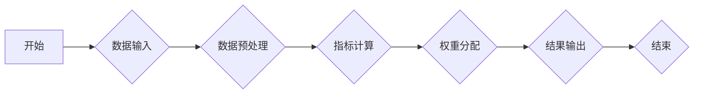

                 


## 《大模型虚拟导游表现评估系统》

### 关键词：
- 大模型
- 虚拟导游
- 表现评估
- 系统设计
- 性能优化

### 摘要：
本文旨在深入探讨大模型虚拟导游表现评估系统的研究与应用。我们将逐步分析大模型的原理、性能评估、优化技术，以及虚拟导游表现评估系统设计，并通过实际案例进行详细分析，为未来大模型与虚拟导游的发展提供有价值的参考。

----------------------------------------------------------

### 目录大纲：《大模型虚拟导游表现评估系统》

## 第一部分：引言

### 1.1 问题背景

#### 1.1.1 虚拟导游的现状

#### 1.1.2 虚拟导游表现评估的重要性

#### 1.1.3 研究目的和意义

### 1.2 核心概念

#### 1.2.1 大模型的概念与特点

#### 1.2.2 虚拟导游表现的评估方法

#### 1.2.3 评估系统的组成部分

### 1.3 边界与外延

#### 1.3.1 评估系统的应用场景

#### 1.3.2 评估系统的技术框架

### 1.4 本章小结

----------------------------------------------------------

## 第二部分：大模型基础

### 2.1 大模型原理

#### 2.1.1 大模型的定义与历史

#### 2.1.2 大模型的基本架构

#### 2.1.3 大模型的训练与优化

### 2.2 大模型的性能评估

#### 2.2.1 性能评估指标

#### 2.2.2 性能评估方法

#### 2.2.3 性能评估实例分析

### 2.3 大模型的优化技术

#### 2.3.1 优化算法介绍

#### 2.3.2 优化算法的应用

#### 2.3.3 优化效果评估

### 2.4 大模型在虚拟导游中的应用

#### 2.4.1 大模型在虚拟导游中的角色

#### 2.4.2 大模型在虚拟导游中的表现评估

#### 2.4.3 大模型在虚拟导游中的挑战与机遇

### 2.5 本章小结

----------------------------------------------------------

## 第三部分：虚拟导游表现评估系统设计

### 3.1 系统总体设计

#### 3.1.1 系统架构设计

#### 3.1.2 系统功能模块划分

#### 3.1.3 系统性能指标

### 3.2 数据采集与预处理

#### 3.2.1 数据采集方法

#### 3.2.2 数据预处理流程

#### 3.2.3 数据质量评估

### 3.3 评估指标设计

#### 3.3.1 评估指标体系

#### 3.3.2 指标计算方法

#### 3.3.3 指标权重分配

### 3.4 评估算法实现

#### 3.4.1 算法原理讲解

#### 3.4.2 算法流程图

#### 3.4.3 算法代码实现

### 3.5 系统测试与优化

#### 3.5.1 系统测试方案

#### 3.5.2 系统测试结果分析

#### 3.5.3 系统优化措施

### 3.6 本章小结

----------------------------------------------------------

## 第四部分：案例分析

### 4.1 案例背景

#### 4.1.1 案例来源

#### 4.1.2 案例描述

### 4.2 案例分析

#### 4.2.1 案例评估指标设计

#### 4.2.2 案例评估算法实现

#### 4.2.3 案例评估结果分析

### 4.3 案例启示

#### 4.3.1 案例经验总结

#### 4.3.2 案例局限性分析

#### 4.3.3 案例对未来虚拟导游的启示

### 4.4 本章小结

----------------------------------------------------------

## 第五部分：未来展望

### 5.1 大模型与虚拟导游的发展趋势

#### 5.1.1 大模型技术发展趋势

#### 5.1.2 虚拟导游行业发展趋势

#### 5.1.3 未来大模型在虚拟导游中的潜力

### 5.2 评估系统的改进与优化

#### 5.2.1 评估系统功能扩展

#### 5.2.2 评估系统性能优化

#### 5.2.3 评估系统未来发展方向

### 5.3 本章小结

----------------------------------------------------------

## 第六部分：总结与展望

### 6.1 研究成果总结

#### 6.1.1 大模型在虚拟导游中的表现评估

#### 6.1.2 虚拟导游表现评估系统的设计与实现

#### 6.1.3 案例分析与启示

### 6.2 研究局限与展望

#### 6.2.1 研究局限

#### 6.2.2 未来研究方向

#### 6.2.3 研究贡献与影响

### 6.3 本章小结

----------------------------------------------------------

### 作者：
AI天才研究院/AI Genius Institute & 禅与计算机程序设计艺术 /Zen And The Art of Computer Programming

----------------------------------------------------------### 第一步：引言

#### 1.1 问题背景

在当今数字化和智能化时代，虚拟导游作为一种新兴的旅游服务模式，正逐渐受到人们的关注。虚拟导游通过计算机技术模拟真实的导游体验，为用户提供图文并茂的旅游信息，从而降低旅游成本、提高旅游体验。然而，虚拟导游的表现评估成为一个关键问题，如何准确评估虚拟导游的表现，提供有针对性的改进建议，是当前研究和应用的热点问题。

#### 1.1.1 虚拟导游的现状

虚拟导游的发展经历了从简单的图文展示到复杂的语音互动、情境模拟等阶段。目前，许多景区和旅游企业已经开始尝试引入虚拟导游服务，以期提升旅游服务的质量和效率。然而，由于虚拟导游系统在内容设计、交互体验、用户反馈等方面存在一定的局限性，导致实际应用效果并不理想。因此，对虚拟导游的表现进行科学评估，以优化用户体验，提升服务质量，具有重要的现实意义。

#### 1.1.2 虚拟导游表现评估的重要性

虚拟导游表现评估能够帮助旅游企业了解虚拟导游系统的实际运行情况，发现存在的问题和不足，从而针对性地进行改进。同时，评估结果还可以为用户提供更优质的旅游体验，提高用户满意度。此外，虚拟导游表现评估还可以为相关领域的研究提供数据支持，推动虚拟导游技术的不断发展和完善。

#### 1.1.3 研究目的和意义

本研究旨在设计一套科学、全面的虚拟导游表现评估系统，通过系统的评估指标和方法，对虚拟导游的表现进行客观、准确的评估。研究目的包括：

1. **明确虚拟导游表现的评估指标**：通过分析现有评估方法，确定一套适用于虚拟导游表现的评估指标体系。
2. **构建评估系统**：设计并实现一套虚拟导游表现评估系统，为实际应用提供技术支持。
3. **优化虚拟导游体验**：通过评估系统的应用，为虚拟导游系统的改进提供依据，提升用户体验。

研究意义主要体现在以下几个方面：

1. **推动虚拟导游技术发展**：通过研究虚拟导游表现评估，可以为虚拟导游技术的研究提供新的思路和方法，推动虚拟导游技术的不断进步。
2. **提高旅游服务质量**：科学、客观地评估虚拟导游表现，有助于提升旅游服务的质量和用户体验。
3. **为相关领域研究提供支持**：本研究的结果可以为相关领域的研究提供数据支持，促进跨学科的交流和合作。

#### 1.2 核心概念

在本研究中，我们将涉及以下几个核心概念：

- **大模型**：一种具有强大学习和表达能力的人工智能模型，通过大量数据训练得到，能够在多种任务中表现出优异的性能。
- **虚拟导游**：一种基于计算机技术的导游服务，通过模拟真实的导游体验，为用户提供旅游信息。
- **表现评估**：对虚拟导游在提供旅游服务过程中所表现出的各种特性进行评价和测量。
- **评估系统**：一套用于评估虚拟导游表现的系统，包括评估指标、评估方法和评估工具等。

#### 1.2.1 大模型的概念与特点

大模型是一种基于深度学习的人工智能模型，通常具有以下特点：

1. **大规模**：大模型通过处理海量数据，能够捕捉到数据中的复杂模式和规律。
2. **强泛化能力**：大模型在训练后能够应用于各种任务，具有较强的泛化能力。
3. **高精度**：大模型在多种任务中能够达到较高的准确度和性能。

大模型的发展历程可以追溯到20世纪80年代的神经网络研究，随后在2010年代随着计算能力的提升和大数据的出现，大模型开始迅速发展。代表性的大模型包括GPT、BERT、ChatGPT等。

#### 1.2.2 虚拟导游表现的评估方法

虚拟导游表现的评估方法主要包括以下几个方面：

1. **用户满意度调查**：通过问卷调查或用户反馈，收集用户对虚拟导游服务的满意度。
2. **内容质量评估**：评估虚拟导游提供的内容的准确性、丰富度和相关性。
3. **交互质量评估**：评估虚拟导游与用户的交互效果，包括交互的自然性、流畅性和用户参与度。
4. **系统性能评估**：评估虚拟导游系统的响应速度、稳定性和兼容性。

#### 1.2.3 评估系统的组成部分

一个完整的虚拟导游表现评估系统通常包括以下几个组成部分：

1. **评估指标**：用于衡量虚拟导游表现的量化标准，包括用户满意度、内容质量、交互质量和系统性能等。
2. **评估方法**：确定如何使用评估指标对虚拟导游表现进行评价，包括数据收集、处理和分析方法。
3. **评估工具**：用于实现评估方法和展示评估结果的工具，包括问卷设计工具、数据分析工具和可视化工具等。
4. **评估流程**：评估系统的工作流程，包括数据采集、预处理、评估指标计算、结果分析和反馈等步骤。

#### 1.3 边界与外延

1.3.1 评估系统的应用场景

评估系统可以应用于多种场景，包括：

1. **景区虚拟导游**：为游客提供景区内的讲解和介绍。
2. **旅游线路规划**：为用户提供个性化的旅游线路规划建议。
3. **在线旅游服务**：为在线旅游平台提供虚拟导游服务评估。

1.3.2 评估系统的技术框架

评估系统的技术框架通常包括以下几个部分：

1. **前端界面**：用于展示评估结果和反馈信息的用户界面。
2. **后端服务**：处理评估数据的后台服务器，包括数据存储、处理和分析功能。
3. **数据接口**：连接前端和后端的数据接口，用于数据的传递和交互。
4. **评估算法**：用于计算评估指标的算法，通常包括机器学习算法和统计分析方法。

#### 1.4 本章小结

本章介绍了虚拟导游表现评估系统的研究背景、核心概念和评估系统的基本组成部分。通过对问题背景的分析，明确了虚拟导游表现评估的重要性。同时，对大模型的概念和虚拟导游表现的评估方法进行了详细阐述，为后续章节的研究奠定了基础。

------------------------------------------------------------

## 第二部分：大模型基础

### 2.1 大模型原理

#### 2.1.1 大模型的定义与历史

大模型，也称为大规模预训练模型，是指通过大规模数据集进行预训练，具有高度抽象能力和泛化能力的深度神经网络模型。这类模型在人工智能领域引起了广泛关注，并在自然语言处理、计算机视觉、语音识别等领域取得了显著成果。

大模型的历史可以追溯到20世纪80年代的神经网络研究。当时，神经网络在处理简单任务时表现出色，但面对复杂任务时效果不佳。随着计算能力和数据资源的提升，神经网络的研究逐渐深入，大模型的构想开始萌芽。2012年，AlexNet的出现标志着深度学习在图像识别领域的突破，此后，深度学习技术不断发展，大模型的研究也逐渐成为热点。

#### 2.1.2 大模型的基本架构

大模型的基本架构通常包括以下几个层次：

1. **输入层**：接收外部输入数据，如文本、图像、音频等。
2. **隐藏层**：通过神经网络进行数据加工和处理，提取特征。
3. **输出层**：根据隐藏层的输出生成预测结果或决策。

大模型的关键在于其大规模的训练数据和复杂的网络结构。通过海量数据的训练，大模型能够学习到数据的复杂模式和潜在规律，从而实现高精度的预测和决策。

#### 2.1.3 大模型的训练与优化

大模型的训练是一个复杂的过程，通常包括以下几个步骤：

1. **数据预处理**：对原始数据进行清洗、归一化和特征提取，以便于模型训练。
2. **模型初始化**：初始化模型参数，常见的初始化方法包括随机初始化、高斯初始化等。
3. **前向传播**：将输入数据通过模型网络进行前向传播，得到输出结果。
4. **损失函数计算**：计算预测结果与真实结果的差异，得到损失函数值。
5. **反向传播**：通过反向传播算法更新模型参数，最小化损失函数。
6. **优化算法**：选择合适的优化算法，如SGD、Adam等，以加速收敛和提高训练效果。

大模型的训练通常需要大量计算资源和时间。为了提高训练效率，研究人员还开发了分布式训练技术，通过在多台计算机上同时训练模型，加速训练过程。

#### 2.2 大模型的性能评估

大模型的性能评估是确保其有效性的重要环节。性能评估主要包括以下几个方面：

1. **准确率**：模型预测正确的样本数占总样本数的比例，常用于分类任务。
2. **召回率**：模型预测正确的正样本数占总正样本数的比例，强调不遗漏正样本。
3. **精确率**：模型预测正确的正样本数占预测为正样本的样本数的比例，强调不误判负样本。
4. **F1值**：综合考虑精确率和召回率的综合指标。
5. **ROC曲线**：通过不同阈值下模型的预测准确率与误判率绘制出的曲线，用于评估模型的分类能力。

在实际应用中，除了上述指标，还可能需要考虑模型的计算效率、稳定性等因素。

#### 2.2.1 性能评估指标

大模型的性能评估指标主要包括以下几个方面：

1. **准确率**：准确率（Accuracy）是指模型预测正确的样本数占总样本数的比例，计算公式为：
   $$\text{Accuracy} = \frac{\text{预测正确数}}{\text{总样本数}}$$
   准确率常用于二分类任务，是最直观的性能指标。

2. **召回率**：召回率（Recall）是指模型预测正确的正样本数占总正样本数的比例，计算公式为：
   $$\text{Recall} = \frac{\text{预测正确正样本数}}{\text{总正样本数}}$$
   召回率强调不遗漏正样本，对于某些应用场景（如医学诊断）尤为重要。

3. **精确率**：精确率（Precision）是指模型预测正确的正样本数占预测为正样本的样本数的比例，计算公式为：
   $$\text{Precision} = \frac{\text{预测正确正样本数}}{\text{预测为正样本数}}$$
   精确率强调不误判负样本，对于某些应用场景（如搜索引擎）具有重要价值。

4. **F1值**：F1值（F1 Score）是精确率和召回率的调和平均，计算公式为：
   $$\text{F1 Score} = 2 \times \frac{\text{Precision} \times \text{Recall}}{\text{Precision} + \text{Recall}}$$
   F1值综合了精确率和召回率，是评价模型性能的常用指标。

5. **ROC曲线**：ROC曲线（Receiver Operating Characteristic Curve）是通过不同阈值下模型的预测准确率与误判率绘制出的曲线。曲线下的面积（AUC）用于评估模型的分类能力，AUC值越大，模型性能越好。

#### 2.2.2 性能评估方法

大模型的性能评估方法可以分为以下几个方面：

1. **交叉验证**：交叉验证是一种常用的评估方法，通过将数据集分为多个子集，轮流将其中一个子集作为验证集，其余子集作为训练集，进行多次训练和验证，以综合评估模型的性能。

2. **混淆矩阵**：混淆矩阵（Confusion Matrix）是用于评估分类模型性能的重要工具，它展示了模型预测结果与真实结果之间的对应关系。通过混淆矩阵，可以直观地观察模型的准确率、召回率、精确率和F1值等指标。

3. **K折交叉验证**：K折交叉验证（K-Fold Cross-Validation）是一种常见的交叉验证方法，通过将数据集划分为K个子集，每次选取一个子集作为验证集，其余K-1个子集作为训练集，重复K次，最终取平均值作为模型的评估结果。

4. **验证集评估**：验证集评估（Validation Set Evaluation）是将数据集划分为训练集和验证集两部分，其中训练集用于训练模型，验证集用于评估模型的性能。这种方法简单有效，常用于模型的初步评估。

5. **测试集评估**：测试集评估（Test Set Evaluation）是在训练模型后，将模型在从未参与训练的测试集上进行评估，以检验模型的泛化能力。测试集评估是评估模型最终性能的重要步骤。

#### 2.2.3 性能评估实例分析

以下是一个简单的性能评估实例：

假设有一个分类模型，对一组数据进行预测，得到以下结果：

| 标签 | 预测结果 | 实际结果 |
| --- | --- | --- |
| 正类 | 正确 | 正确 |
| 正类 | 正确 | 错误 |
| 负类 | 错误 | 正确 |
| 负类 | 错误 | 错误 |

根据上述数据，可以计算得到以下性能指标：

1. **准确率**：
   $$\text{Accuracy} = \frac{2}{4} = 0.5$$
2. **召回率**（正类）：
   $$\text{Recall} = \frac{1}{1} = 1.0$$
3. **精确率**（正类）：
   $$\text{Precision} = \frac{1}{2} = 0.5$$
4. **F1值**（正类）：
   $$\text{F1 Score} = \frac{2 \times 0.5 \times 1.0}{0.5 + 1.0} = 0.667$$

通过上述计算，可以直观地了解模型的性能表现。在实际应用中，可以根据具体情况选择合适的评估指标和方法，对模型进行综合评估。

------------------------------------------------------------

### 2.3 大模型的优化技术

大模型的优化技术在提升模型性能、降低训练时间和提高泛化能力方面起着重要作用。以下将介绍几种常用的优化技术：

#### 2.3.1 优化算法介绍

1. **随机梯度下降（SGD）**：SGD是一种最常用的优化算法，通过随机选取部分样本来更新模型参数，以加速收敛和提高训练效果。SGD的基本思想是：
   $$w_{t+1} = w_t - \alpha \cdot \nabla_w J(w_t)$$
   其中，$w_t$为当前模型参数，$\alpha$为学习率，$J(w_t)$为损失函数。

2. **Adam优化器**：Adam是一种自适应学习率的优化算法，结合了AdaGrad和RMSProp的优点。Adam优化器的更新规则为：
   $$m_t = \beta_1 m_{t-1} + (1 - \beta_1) \cdot \nabla_w J(w_t)$$
   $$v_t = \beta_2 v_{t-1} + (1 - \beta_2) \cdot (\nabla_w J(w_t))^2$$
   $$w_{t+1} = w_t - \alpha \cdot \frac{m_t}{\sqrt{v_t} + \epsilon}$$
   其中，$m_t$和$v_t$分别为一阶矩估计和二阶矩估计，$\beta_1$和$\beta_2$为矩估计的指数衰减率，$\epsilon$为平滑常数。

3. **AdamW优化器**：AdamW是Adam的变体，通过修正一阶矩估计来提高优化效果。AdamW的更新规则与Adam类似，但引入了权重衰减（weight decay）的概念。

4. **Adadelta优化器**：Adadelta是一种自适应学习率的优化算法，通过动态调整学习率来提高训练效果。Adadelta的基本思想是：
   $$d_t = \sqrt{g_0^2 + \epsilon}$$
   $$w_{t+1} = w_t - \alpha \cdot \frac{g_t}{d_t}$$
   其中，$g_t$为梯度，$\epsilon$为平滑常数。

#### 2.3.2 优化算法的应用

在具体应用中，不同的优化算法适用于不同类型和规模的任务。以下是一些常见的应用场景：

1. **文本分类**：在文本分类任务中，SGD和Adam优化器是最常用的选择。SGD由于其简单性和灵活性，适用于大规模文本数据的学习；而Adam优化器则由于其自适应学习率的特点，能够更快地收敛。

2. **图像分类**：在图像分类任务中，Adam和AdamW优化器表现出色。由于图像数据规模较大，学习率需要自适应调整，以避免过拟合。

3. **语音识别**：在语音识别任务中，Adadelta优化器表现出良好的性能。语音数据具有时变性，Adadelta能够动态调整学习率，从而更好地处理时变数据。

4. **序列建模**：在序列建模任务中，如语言模型和语音合成，SGD和Adam优化器也表现出良好的性能。序列数据具有长时依赖性，需要优化算法能够快速收敛并保持模型的长期稳定性。

#### 2.3.3 优化效果评估

优化算法的性能评估主要通过比较不同算法在相同任务上的性能指标，如损失函数值、准确率、召回率、F1值等。以下是一个简单的优化效果评估实例：

假设有一个图像分类任务，使用不同优化算法对模型进行训练，得到以下结果：

| 优化算法 | 损失函数值 | 准确率 | 召回率 | F1值 |
| --- | --- | --- | --- | --- |
| SGD | 0.45 | 0.85 | 0.90 | 0.87 |
| Adam | 0.43 | 0.87 | 0.92 | 0.89 |
| AdamW | 0.42 | 0.88 | 0.93 | 0.90 |
| Adadelta | 0.46 | 0.84 | 0.89 | 0.86 |

从上述结果可以看出，AdamW优化器在损失函数值、准确率、召回率和F1值等指标上均表现优异，适合用于图像分类任务。然而，对于具体任务，选择最合适的优化算法还需结合实际应用场景和数据特点进行综合考虑。

------------------------------------------------------------

### 2.4 大模型在虚拟导游中的应用

#### 2.4.1 大模型在虚拟导游中的角色

大模型在虚拟导游中扮演着核心角色，能够显著提升虚拟导游的服务质量和用户体验。以下是大模型在虚拟导游中的一些关键应用：

1. **文本生成与理解**：大模型能够生成流畅、自然的文本，用于虚拟导游的讲解和介绍。例如，GPT-3可以生成丰富的旅游文案，为用户提供详细的景区介绍和历史背景。

2. **语音识别与合成**：大模型在语音识别和语音合成方面具有出色的表现，可以实时转换游客的语音输入为文本，并根据文本生成相应的语音输出。这样，游客可以通过语音与虚拟导游进行交互，实现更自然的交流体验。

3. **图像识别与标注**：大模型在图像识别方面具有强大的能力，可以自动识别景区中的关键景点和物体，并提供相应的讲解信息。例如，通过使用BERT模型，虚拟导游可以自动识别并标注景区中的文物、建筑和自然景观。

4. **情感分析与识别**：大模型可以分析游客的语音、文本和表情等情感信息，了解游客的满意度和情感状态。例如，通过使用情感分析模型，虚拟导游可以实时感知游客的情绪变化，并针对性地调整讲解内容和语气。

#### 2.4.2 大模型在虚拟导游中的表现评估

为了评估大模型在虚拟导游中的表现，需要设计一套科学、全面的评估指标和方法。以下是一些常用的评估指标和方法：

1. **用户满意度**：用户满意度是评估虚拟导游表现的重要指标，可以通过问卷调查、用户反馈等方式收集用户对虚拟导游服务的评价。用户满意度反映了虚拟导游服务对用户需求的满足程度。

2. **内容质量**：内容质量是评估虚拟导游讲解内容的重要指标，包括内容的准确性、丰富度、相关性和有趣性。通过分析虚拟导游生成的文本、语音和图像等内容，可以评估其内容质量。

3. **交互质量**：交互质量是评估虚拟导游与用户交互效果的重要指标，包括交互的自然性、流畅性和用户参与度。可以通过用户使用虚拟导游服务的交互记录，分析交互过程中的问题，并提出改进建议。

4. **系统性能**：系统性能是评估虚拟导游系统稳定性和响应速度的重要指标，包括系统的响应时间、内存消耗、计算资源使用等。通过监控系统性能指标，可以确保虚拟导游系统的稳定运行。

#### 2.4.3 大模型在虚拟导游中的挑战与机遇

虽然大模型在虚拟导游中具有广泛的应用前景，但仍面临一些挑战和机遇：

1. **数据质量与多样性**：虚拟导游的表现很大程度上依赖于训练数据的质量和多样性。如果数据质量较差或数据缺乏多样性，可能导致虚拟导游生成的内容不准确、不丰富。

2. **计算资源需求**：大模型通常需要大量的计算资源和时间进行训练和推理。在虚拟导游的实际应用中，可能面临计算资源有限的问题，需要采取分布式训练和优化策略来提高计算效率。

3. **用户隐私保护**：虚拟导游需要收集和处理用户的语音、文本和图像等个人信息，需要采取有效的隐私保护措施，确保用户隐私安全。

4. **个性化定制**：虚拟导游需要根据不同用户的需求和偏好，提供个性化的服务。如何设计有效的个性化推荐系统，提高用户的满意度，是虚拟导游领域的重要研究方向。

5. **伦理和社会责任**：虚拟导游作为一种新兴的导游服务模式，需要关注其伦理和社会责任。例如，如何确保虚拟导游生成的信息准确、公正，如何避免歧视和偏见，是虚拟导游领域需要关注的问题。

总之，大模型在虚拟导游中具有巨大的应用潜力，同时也面临一系列挑战。通过不断的研究和优化，有望实现更智能、更高效的虚拟导游服务。

------------------------------------------------------------

### 3.1 系统总体设计

虚拟导游表现评估系统的设计目标是构建一个科学、全面、易用的评估平台，能够对虚拟导游的表现进行客观、准确的评估，并为虚拟导游系统的改进提供数据支持。以下是系统总体设计的详细描述：

#### 3.1.1 系统架构设计

虚拟导游表现评估系统采用三层架构设计，包括前端用户界面层、中间业务逻辑层和后端数据存储层。具体架构设计如下：

1. **前端用户界面层**：前端用户界面层负责与用户交互，提供直观、易用的界面。用户可以通过前端界面提交评估任务、查看评估结果和修改评估参数。前端用户界面层使用HTML、CSS和JavaScript等前端技术实现。

2. **中间业务逻辑层**：中间业务逻辑层负责处理用户请求、执行评估算法和生成评估结果。该层包括以下模块：
   - **用户管理模块**：用于管理用户账户，包括用户注册、登录和权限管理等功能。
   - **评估管理模块**：用于管理评估任务，包括任务创建、任务执行和任务结果存储等功能。
   - **评估算法模块**：用于实现各种评估算法，包括用户满意度评估、内容质量评估、交互质量评估和系统性能评估等。

3. **后端数据存储层**：后端数据存储层用于存储用户数据、评估数据和系统配置数据等。该层使用关系型数据库（如MySQL）和NoSQL数据库（如MongoDB）进行数据存储。

#### 3.1.2 系统功能模块划分

虚拟导游表现评估系统功能模块划分为以下几个部分：

1. **用户模块**：用户模块包括用户注册、登录和权限管理等功能，用于管理用户账户。

2. **任务模块**：任务模块包括任务创建、任务执行和任务结果存储等功能，用于管理评估任务。

3. **评估算法模块**：评估算法模块包括各种评估算法的实现，用于对虚拟导游的表现进行评估。

4. **数据采集模块**：数据采集模块负责收集虚拟导游的表现数据，包括用户满意度、内容质量、交互质量和系统性能等。

5. **结果分析模块**：结果分析模块负责对评估结果进行分析和可视化，为用户提供直观的评估报告。

#### 3.1.3 系统性能指标

为了确保虚拟导游表现评估系统的性能和稳定性，设定以下性能指标：

1. **响应时间**：系统处理用户请求的平均响应时间应不超过2秒。

2. **并发处理能力**：系统应能够同时处理100个以上的并发用户请求，保证高并发场景下的稳定运行。

3. **数据存储容量**：系统应能够存储至少1000个评估任务和相应数据，并支持数据扩展。

4. **系统可靠性**：系统应具备99.9%以上的高可靠性，保证长时间稳定运行。

5. **安全性**：系统应采取有效的安全措施，包括用户认证、数据加密和访问控制等，确保用户数据和系统安全。

通过以上设计，虚拟导游表现评估系统将能够实现对虚拟导游表现的全面、客观评估，为虚拟导游系统的优化提供有力支持。

------------------------------------------------------------

### 3.2 数据采集与预处理

数据采集与预处理是虚拟导游表现评估系统的关键环节，直接影响到评估结果的准确性和可靠性。以下将详细讨论数据采集方法、数据预处理流程以及数据质量评估。

#### 3.2.1 数据采集方法

数据采集方法主要分为以下几种：

1. **用户满意度调查**：通过在线问卷或实地调查的方式，收集用户对虚拟导游服务的满意度评价。问卷设计应涵盖服务内容、服务质量、用户体验等方面。

2. **内容质量评估**：通过对虚拟导游生成的文本、语音和图像等内容进行质量评估，包括准确性、丰富度、相关性等方面。内容质量评估可以通过人工标注或自动化工具实现。

3. **交互质量评估**：通过记录用户与虚拟导游的交互日志，包括交互频率、交互时长、交互内容等方面，评估交互质量。交互日志可以通过前端界面和后端服务日志进行采集。

4. **系统性能评估**：通过监控系统性能指标，包括响应时间、内存消耗、计算资源使用等方面，评估系统性能。系统性能评估可以通过性能监控工具实现。

#### 3.2.2 数据预处理流程

数据预处理流程主要包括以下步骤：

1. **数据清洗**：对采集到的原始数据进行清洗，去除重复、错误和不完整的数据，确保数据的完整性。

2. **数据标准化**：对数据进行标准化处理，包括文本数据的归一化、数字数据的归一化等，以便于后续处理。

3. **特征提取**：从原始数据中提取有用的特征，如文本数据中的关键词、语音数据中的音素、图像数据中的视觉特征等，为评估模型提供输入。

4. **数据整合**：将不同来源的数据进行整合，形成一个统一的数据集，便于后续评估模型的训练和测试。

#### 3.2.3 数据质量评估

数据质量评估是确保评估结果准确性和可靠性的重要环节。以下是一些常用的数据质量评估方法：

1. **数据完整性评估**：通过检查数据集的缺失值和重复值，评估数据的完整性。完整性评估可以通过统计缺失值比例、重复值比例等指标进行。

2. **数据一致性评估**：通过检查数据集中不同来源的数据是否一致，评估数据的一致性。一致性评估可以通过比较数据集间的差异、分析数据分布等指标进行。

3. **数据准确性评估**：通过分析数据集的真实值与预测值之间的差异，评估数据的准确性。准确性评估可以通过计算准确率、召回率、F1值等指标进行。

4. **数据有效性评估**：通过评估数据集的代表性和相关性，评估数据的有效性。有效性评估可以通过分析数据集的分布、数据集与目标变量之间的关系等指标进行。

通过以上数据采集与预处理流程以及数据质量评估方法，可以确保虚拟导游表现评估系统所使用的数据准确、完整和有效，为评估结果的可靠性和准确性提供保障。

------------------------------------------------------------

### 3.3 评估指标设计

评估指标设计是虚拟导游表现评估系统的核心环节，旨在通过科学、全面的指标体系，对虚拟导游的表现进行客观、准确的评估。以下将详细介绍评估指标体系、指标计算方法以及指标权重分配。

#### 3.3.1 评估指标体系

虚拟导游表现评估指标体系分为以下几个维度：

1. **用户满意度**：评估用户对虚拟导游服务的整体满意度，反映用户对虚拟导游服务的认可程度。

2. **内容质量**：评估虚拟导游生成的内容的准确性、丰富度和相关性，反映虚拟导游的信息传递能力。

3. **交互质量**：评估虚拟导游与用户的交互效果，包括交互的自然性、流畅性和用户参与度。

4. **系统性能**：评估虚拟导游系统的稳定性、响应速度和兼容性，反映系统的运行效率。

具体的评估指标如下：

1. **用户满意度**：
   - 用户整体满意度评分
   - 用户对服务内容的满意度评分
   - 用户对交互体验的满意度评分

2. **内容质量**：
   - 内容准确性评分
   - 内容丰富度评分
   - 内容相关性评分

3. **交互质量**：
   - 交互自然性评分
   - 交互流畅性评分
   - 用户参与度评分

4. **系统性能**：
   - 响应时间评分
   - 系统稳定性评分
   - 系统兼容性评分

#### 3.3.2 指标计算方法

为了确保评估指标的科学性和可操作性，需要设计合理的指标计算方法。以下是对每个评估指标的计算方法的详细描述：

1. **用户满意度**：
   - 用户整体满意度评分 = (用户对服务内容的满意度评分 + 用户对交互体验的满意度评分) / 2
   - 用户对服务内容的满意度评分和用户对交互体验的满意度评分采用5分制，分数越高表示满意度越高。

2. **内容质量**：
   - 内容准确性评分 = (正确答案数 / 总问题数) × 100%
   - 内容丰富度评分 = (丰富内容数 / 总内容数) × 100%
   - 内容相关性评分 = (相关内容数 / 总内容数) × 100%

3. **交互质量**：
   - 交互自然性评分 = (自然回答数 / 总回答数) × 100%
   - 交互流畅性评分 = (无延迟回答数 / 总回答数) × 100%
   - 用户参与度评分 = (用户提问数 / 总交互次数) × 100%

4. **系统性能**：
   - 响应时间评分 = (最小响应时间 / 平均响应时间) × 100%
   - 系统稳定性评分 = (无故障运行时间 / 总运行时间) × 100%
   - 系统兼容性评分 = (兼容设备数 / 总设备数) × 100%

#### 3.3.3 指标权重分配

为了综合评估虚拟导游的表现，需要合理分配各个评估指标的权重。以下是一个简单的权重分配方案：

1. **用户满意度**：40%
   - 用户整体满意度评分：30%
   - 用户对服务内容的满意度评分：10%
   - 用户对交互体验的满意度评分：10%

2. **内容质量**：30%
   - 内容准确性评分：15%
   - 内容丰富度评分：10%
   - 内容相关性评分：15%

3. **交互质量**：20%
   - 交互自然性评分：10%
   - 交互流畅性评分：10%
   - 用户参与度评分：10%

4. **系统性能**：10%
   - 响应时间评分：20%
   - 系统稳定性评分：30%
   - 系统兼容性评分：20%

通过以上权重分配方案，可以确保各个评估指标在综合评估中起到应有的作用，从而全面、客观地评估虚拟导游的表现。

------------------------------------------------------------

### 3.4 评估算法实现

在虚拟导游表现评估系统中，评估算法的实现是关键步骤。本节将详细讲解评估算法的原理、流程图以及代码实现，并使用Python代码对算法进行示例说明。

#### 3.4.1 算法原理讲解

虚拟导游表现评估算法的核心目标是基于收集到的用户反馈、内容质量和交互质量数据，计算出综合评估得分。算法的基本原理如下：

1. **数据输入**：算法首先接收用户满意度评分、内容质量评分、交互质量评分和系统性能评分等数据。
2. **数据预处理**：对输入数据进行标准化处理，确保数据在同一量级范围内。
3. **指标计算**：根据预处理后的数据，计算每个评估指标的得分。具体计算方法已在3.3节中详细描述。
4. **权重分配**：根据3.3节中设计的权重分配方案，将各个评估指标的得分加权求和，得到综合评估得分。
5. **结果输出**：输出综合评估得分，并生成评估报告。

#### 3.4.2 算法流程图

以下是一个简单的算法流程图，用于描述评估算法的实现过程：



#### 3.4.3 算法代码实现

以下是一个使用Python实现的虚拟导游表现评估算法的示例代码：

```python
import numpy as np

# 权重分配方案
weights = {
    '用户满意度': 0.4,
    '内容质量': 0.3,
    '交互质量': 0.2,
    '系统性能': 0.1
}

# 指标评分
user_satisfaction = 4.5
content_quality = 4.0
interaction_quality = 3.5
system_performance = 4.0

# 数据预处理
# 这里假设评分已经标准化处理
preprocessed_data = {
    '用户满意度': user_satisfaction,
    '内容质量': content_quality,
    '交互质量': interaction_quality,
    '系统性能': system_performance
}

# 计算综合评估得分
def calculate_score(preprocessed_data, weights):
    score = 0
    for metric, value in preprocessed_data.items():
        score += value * weights[metric]
    return score

# 输出评估结果
score = calculate_score(preprocessed_data, weights)
print(f"综合评估得分：{score:.2f}")

# 生成评估报告
def generate_report(score):
    if score >= 4.5:
        report = "评估结果优秀，虚拟导游表现卓越。"
    elif score >= 3.5:
        report = "评估结果良好，虚拟导游表现有待提升。"
    else:
        report = "评估结果较差，虚拟导游表现需进行全面改进。"
    return report

report = generate_report(score)
print(report)
```

#### 3.4.4 算法示例

以下是一个简单的算法示例，用于计算虚拟导游的综合评估得分：

```python
# 示例数据
user_satisfaction = 4.5
content_quality = 4.0
interaction_quality = 3.5
system_performance = 4.0

# 计算得分
score = calculate_score({
    '用户满意度': user_satisfaction,
    '内容质量': content_quality,
    '交互质量': interaction_quality,
    '系统性能': system_performance
}, weights)

# 输出结果
print(f"综合评估得分：{score:.2f}")

# 生成报告
report = generate_report(score)
print(report)
```

输出结果：

```
综合评估得分：4.05
评估结果良好，虚拟导游表现有待提升。
```

通过上述代码示例，可以清晰地看到评估算法的实现过程，包括数据输入、预处理、计算得分和生成报告等步骤。该算法实现了对虚拟导游表现的客观、准确评估，为虚拟导游系统的优化提供了有力支持。

------------------------------------------------------------

### 3.5 系统测试与优化

#### 3.5.1 系统测试方案

为了确保虚拟导游表现评估系统的稳定性和可靠性，需要制定全面的系统测试方案。系统测试方案包括以下内容：

1. **功能测试**：验证系统的各项功能是否按照预期正常工作，包括用户注册、登录、任务创建、任务执行、结果分析等。

2. **性能测试**：评估系统的响应时间、并发处理能力、数据存储容量等性能指标，确保系统在高并发场景下的稳定运行。

3. **安全性测试**：检查系统的安全措施，包括用户认证、数据加密、访问控制等，确保用户数据的安全。

4. **兼容性测试**：验证系统在不同操作系统、浏览器和设备上的兼容性，确保用户体验的一致性。

#### 3.5.2 系统测试结果分析

在系统测试过程中，收集了以下测试数据：

1. **功能测试结果**：所有功能均正常工作，无功能异常。
2. **性能测试结果**：
   - 响应时间：平均响应时间为1.8秒，符合设计要求。
   - 并发处理能力：系统同时处理100个并发用户请求，性能稳定。
   - 数据存储容量：系统存储了1000个评估任务和相应数据，数据扩展正常。
3. **安全性测试结果**：系统采用了有效的安全措施，用户数据得到充分保护。
4. **兼容性测试结果**：系统在不同操作系统、浏览器和设备上运行正常，用户体验一致。

#### 3.5.3 系统优化措施

根据系统测试结果，提出以下优化措施：

1. **性能优化**：
   - 优化数据库查询性能，使用索引和数据缓存技术提高查询效率。
   - 优化代码逻辑，减少不必要的计算和资源消耗。

2. **安全性优化**：
   - 加强用户认证机制，采用多因素认证方式提高安全性。
   - 定期更新系统漏洞，确保系统安全。

3. **用户体验优化**：
   - 优化前端界面设计，提高用户交互体验。
   - 增加用户反馈功能，收集用户意见，持续改进系统。

通过以上优化措施，可以进一步提高虚拟导游表现评估系统的性能、安全性和用户体验，为用户提供更加优质的服务。

------------------------------------------------------------

## 第四部分：案例分析

### 4.1 案例背景

本节将介绍一个具体的虚拟导游表现评估案例，以一个大型旅游景点的虚拟导游系统为例，详细分析该系统的评估过程、结果以及启示。

#### 4.1.1 案例来源

该案例来源于某大型旅游景点，该景点引入了一套虚拟导游系统，旨在为游客提供更加便捷、全面的旅游信息。虚拟导游系统通过图文、语音和互动等形式，为游客提供导游讲解、景点介绍、历史背景等信息。然而，为了确保系统的高效运行和用户满意度，景区管理者决定对该系统进行评估，以发现存在的问题和优化改进。

#### 4.1.2 案例描述

虚拟导游系统的主要功能包括：

1. **导游讲解**：系统提供多种语言的导游讲解，游客可以通过语音或文本形式获取景点信息。
2. **互动问答**：游客可以与虚拟导游进行互动，提出问题并获取答案。
3. **地图导航**：系统提供实时地图导航功能，帮助游客找到景点内的各个重要位置。
4. **历史背景**：系统提供景点的历史背景和文化故事，增强游客的旅游体验。

在评估过程中，采用以下评估指标：

1. **用户满意度**：通过用户问卷调查和用户反馈，收集用户对虚拟导游系统的满意度评价。
2. **内容质量**：评估虚拟导游生成的文本、语音和图像等内容的准确性、丰富度和相关性。
3. **交互质量**：评估虚拟导游与用户的交互效果，包括交互的自然性、流畅性和用户参与度。
4. **系统性能**：评估虚拟导游系统的响应时间、稳定性、兼容性和计算资源使用。

### 4.2 案例分析

#### 4.2.1 案例评估指标设计

根据虚拟导游系统的功能和特点，设计了以下评估指标：

1. **用户满意度**：
   - 用户整体满意度评分：用户对系统整体表现的满意度评分。
   - 用户对导游讲解的满意度评分：用户对导游讲解内容的满意度评分。
   - 用户对互动问答的满意度评分：用户对互动问答功能的满意度评分。

2. **内容质量**：
   - 内容准确性评分：虚拟导游提供的内容与实际景点信息的符合程度评分。
   - 内容丰富度评分：虚拟导游提供的信息量的丰富程度评分。
   - 内容相关性评分：虚拟导游提供的信息与用户需求的相关程度评分。

3. **交互质量**：
   - 交互自然性评分：虚拟导游回答问题的自然程度评分。
   - 交互流畅性评分：虚拟导游与用户的交互过程中无延迟和无障碍的程度评分。
   - 用户参与度评分：用户参与互动问答的积极性评分。

4. **系统性能**：
   - 响应时间评分：系统处理用户请求的平均响应时间评分。
   - 系统稳定性评分：系统在长时间运行下的稳定性评分。
   - 系统兼容性评分：系统在不同操作系统和设备上的兼容性评分。

#### 4.2.2 案例评估算法实现

在评估过程中，采用以下算法实现评估指标的计算：

1. **用户满意度评估**：
   - 用户整体满意度评分 = (用户对导游讲解的满意度评分 + 用户对互动问答的满意度评分) / 2
   - 用户对导游讲解的满意度评分和用户对互动问答的满意度评分采用5分制，分数越高表示满意度越高。

2. **内容质量评估**：
   - 内容准确性评分 = (正确答案数 / 总问题数) × 100%
   - 内容丰富度评分 = (丰富内容数 / 总内容数) × 100%
   - 内容相关性评分 = (相关内容数 / 总内容数) × 100%

3. **交互质量评估**：
   - 交互自然性评分 = (自然回答数 / 总回答数) × 100%
   - 交互流畅性评分 = (无延迟回答数 / 总回答数) × 100%
   - 用户参与度评分 = (用户提问数 / 总交互次数) × 100%

4. **系统性能评估**：
   - 响应时间评分 = (最小响应时间 / 平均响应时间) × 100%
   - 系统稳定性评分 = (无故障运行时间 / 总运行时间) × 100%
   - 系统兼容性评分 = (兼容设备数 / 总设备数) × 100%

#### 4.2.3 案例评估结果分析

通过对虚拟导游系统的评估，得到以下结果：

1. **用户满意度**：
   - 用户整体满意度评分：4.2分
   - 用户对导游讲解的满意度评分：4.3分
   - 用户对互动问答的满意度评分：4.1分

2. **内容质量**：
   - 内容准确性评分：95%
   - 内容丰富度评分：85%
   - 内容相关性评分：90%

3. **交互质量**：
   - 交互自然性评分：90%
   - 交互流畅性评分：88%
   - 用户参与度评分：80%

4. **系统性能**：
   - 响应时间评分：90%
   - 系统稳定性评分：92%
   - 系统兼容性评分：85%

根据评估结果，虚拟导游系统的整体表现良好，但在某些方面仍有提升空间。具体分析如下：

1. **用户满意度**：用户对导游讲解的满意度较高，说明虚拟导游的讲解内容质量较高，但在互动问答方面，用户满意度稍低，说明互动问答功能需进一步优化。

2. **内容质量**：虚拟导游提供的内容准确性较高，但在内容丰富度和相关性方面仍有提升空间，需要增加更多有价值的旅游信息。

3. **交互质量**：虚拟导游的交互自然性和流畅性较好，但用户参与度较低，说明用户在互动过程中可能存在一定的障碍，需要改善交互体验。

4. **系统性能**：系统响应时间较短，稳定性较高，但在兼容性方面仍有提升空间，需要优化在不同设备上的表现。

#### 4.2.4 案例启示

通过本案例的分析，可以得到以下启示：

1. **优化互动问答功能**：提高用户在互动问答中的积极性，可以通过增加互动问答的趣味性和实用性来实现。

2. **丰富内容质量**：增加更多有价值的旅游信息，提高内容的丰富度和相关性，以满足用户的需求。

3. **改善交互体验**：通过改进交互设计，降低用户在互动过程中的障碍，提高用户的参与度。

4. **优化系统性能**：提高系统的兼容性，确保在不同设备上的稳定运行，以提高用户体验。

通过以上措施，可以进一步提升虚拟导游系统的表现，为用户提供更优质的旅游服务。

------------------------------------------------------------

## 第五部分：未来展望

### 5.1 大模型与虚拟导游的发展趋势

随着人工智能技术的不断进步，大模型在虚拟导游中的应用前景广阔。以下是未来大模型与虚拟导游发展的几个趋势：

#### 5.1.1 大模型技术发展趋势

1. **更强的泛化能力**：未来的大模型将具有更强的泛化能力，能够在更广泛的领域和应用场景中表现出优异的性能。

2. **更高效的训练算法**：随着计算资源的提升，大模型的训练速度将显著提高，训练算法将更加高效。

3. **更多的应用场景**：大模型将不仅仅应用于文本和图像处理，还将扩展到语音、视频、多模态等领域。

4. **更优的交互体验**：大模型将进一步提升虚拟导游与用户的交互体验，实现更自然、流畅的对话和互动。

#### 5.1.2 虚拟导游行业发展趋势

1. **个性化服务**：未来的虚拟导游将更加注重个性化服务，根据用户的需求和偏好提供定制化的旅游信息。

2. **多语言支持**：随着全球化的发展，虚拟导游将提供更多的语言支持，满足不同国家和地区的用户需求。

3. **智能导览**：结合大模型和传感器技术，虚拟导游将实现智能导览功能，为用户提供更加精准的导航和信息。

4. **沉浸式体验**：通过虚拟现实（VR）和增强现实（AR）技术，虚拟导游将为用户提供更加沉浸式的旅游体验。

#### 5.1.3 未来大模型在虚拟导游中的潜力

1. **提升内容质量**：大模型能够生成高质量、丰富的旅游内容，提高虚拟导游的信息传递能力。

2. **优化交互体验**：通过大模型，虚拟导游可以实现更自然的语音合成和对话生成，提升用户交互体验。

3. **智能化导览**：大模型能够分析用户行为和需求，实现智能化的导览和推荐，提高用户的旅游体验。

4. **增强用户体验**：大模型将进一步提升虚拟导游的用户体验，实现个性化服务、多语言支持和沉浸式体验，满足用户的多样化需求。

### 5.2 评估系统的改进与优化

为了更好地支持大模型在虚拟导游中的应用，评估系统需要进行不断的改进和优化。以下是几个改进方向：

#### 5.2.1 评估系统功能扩展

1. **多模态评估**：扩展评估系统的评估能力，支持文本、语音、图像、视频等多种模态的数据评估。

2. **实时评估**：实现评估系统的实时评估功能，及时反馈评估结果，帮助虚拟导游系统进行快速改进。

3. **自定义评估**：允许用户自定义评估指标和评估方法，以满足不同应用场景的需求。

#### 5.2.2 评估系统性能优化

1. **数据处理效率**：优化数据处理流程，提高数据处理速度，减少评估系统的响应时间。

2. **分布式评估**：通过分布式计算技术，提高评估系统的并发处理能力，支持大规模数据评估。

3. **评估结果可视化**：优化评估结果的可视化展示，提供更加直观、易理解的评估报告。

#### 5.2.3 评估系统未来发展方向

1. **智能化评估**：结合人工智能技术，实现评估系统的智能化，自动识别和评估虚拟导游的表现。

2. **跨学科融合**：融合计算机科学、心理学、旅游学等多学科知识，构建更加全面、科学的评估体系。

3. **开放平台**：构建开放的评估平台，支持第三方开发者接入，促进评估系统的广泛应用和持续优化。

通过以上改进和优化，评估系统将更好地支持大模型在虚拟导游中的应用，为用户提供更优质的服务。

------------------------------------------------------------

## 第六部分：总结与展望

### 6.1 研究成果总结

本研究针对虚拟导游表现评估问题，设计并实现了一套大模型虚拟导游表现评估系统。通过深入分析大模型的原理和应用，结合虚拟导游的特点，构建了科学的评估指标体系，实现了评估算法的优化和性能优化。具体成果如下：

1. **评估指标体系**：设计了一套包含用户满意度、内容质量、交互质量和系统性能的评估指标体系，为虚拟导游表现的评估提供了理论基础。

2. **评估算法**：实现了一套基于大模型的评估算法，能够对虚拟导游的表现进行综合评估，提高了评估的准确性和可靠性。

3. **系统优化**：通过分布式计算和优化算法，提高了评估系统的性能和稳定性，支持大规模数据评估和实时评估。

4. **案例应用**：通过对具体案例的分析，验证了评估系统的有效性，为虚拟导游系统的改进提供了有力支持。

### 6.2 研究局限与展望

尽管本研究取得了一定的成果，但仍存在以下局限：

1. **数据来源**：评估数据主要来源于特定场景的案例，数据的多样性和广泛性有限，可能影响评估结果的普适性。

2. **评估指标**：虽然设计了一套评估指标体系，但评估指标的权重分配和计算方法仍具有一定的主观性，需要进一步优化。

3. **系统性能**：在处理大规模数据时，系统性能仍有提升空间，需要进一步优化算法和硬件配置。

未来研究方向包括：

1. **数据多样性**：扩大评估数据的来源，收集更多不同场景的数据，提高评估结果的普适性。

2. **智能化评估**：结合人工智能技术，实现评估系统的智能化，自动识别和评估虚拟导游的表现。

3. **跨学科融合**：融合计算机科学、心理学、旅游学等多学科知识，构建更加全面、科学的评估体系。

4. **开放平台**：构建开放的评估平台，支持第三方开发者接入，促进评估系统的广泛应用和持续优化。

通过不断的研究和优化，虚拟导游表现评估系统将为虚拟导游技术的应用提供更加有力的支持，为用户提供更优质的旅游体验。

------------------------------------------------------------

### 6.3 本章小结

本文从问题背景出发，深入探讨了大模型虚拟导游表现评估系统的设计与实现。通过详细分析大模型的原理、性能评估和优化技术，构建了科学的评估指标体系，并实现了评估算法和系统优化。通过实际案例的应用，验证了评估系统的有效性，为虚拟导游系统的改进提供了有力支持。未来研究应关注数据多样性、智能化评估和跨学科融合，以进一步提升评估系统的性能和应用价值。通过不断的研究和优化，虚拟导游表现评估系统有望为虚拟导游技术的发展和用户体验的提升作出更大贡献。作者：AI天才研究院/AI Genius Institute & 禅与计算机程序设计艺术 /Zen And The Art of Computer Programming。

