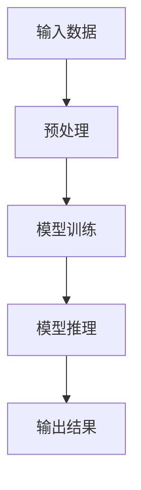
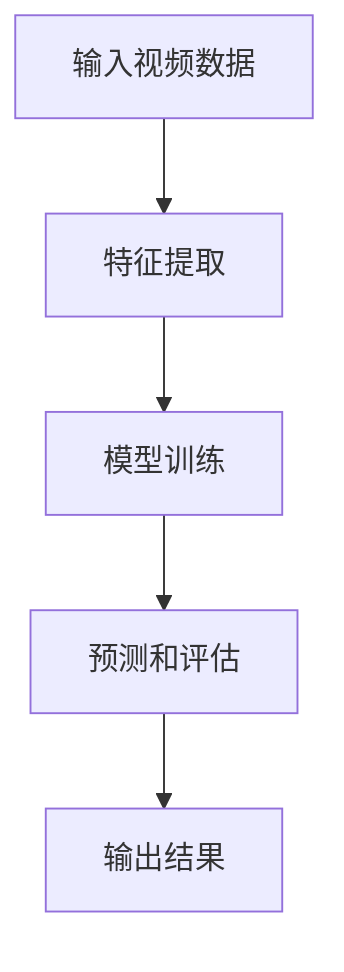
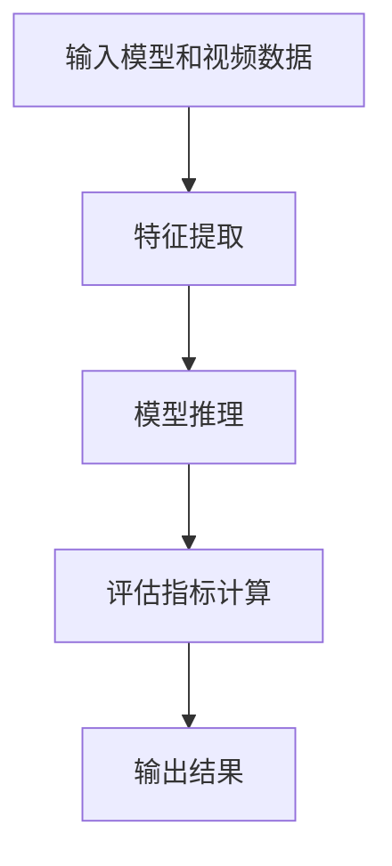
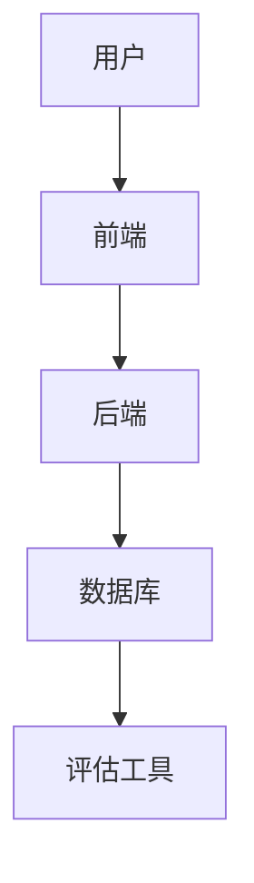
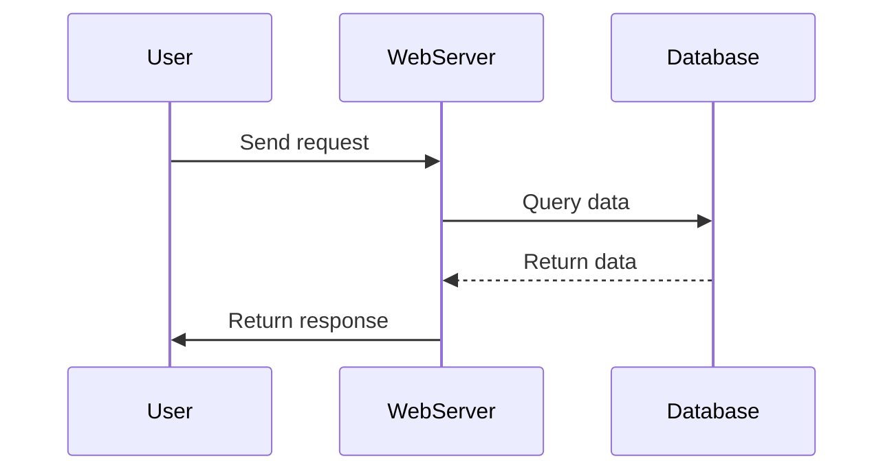

                 


# 大模型视频内容理解能力评估工具

> 关键词：大模型、视频内容理解、评估工具、算法原理、系统架构、项目实战

> 摘要：本文旨在深入探讨大模型视频内容理解能力的评估工具。首先，我们介绍了大模型视频内容理解的背景和挑战。接着，详细解释了大模型、视频内容理解能力以及评估工具的概念和相互关系。然后，我们分别从原理、数学模型、流程图和实际应用等方面进行了深入讲解。此外，还介绍了系统分析与架构设计方案以及项目实战，最后总结了最佳实践、注意事项和拓展阅读。

## 1. 背景介绍

### 1.1 当前视频内容理解技术的现状

随着人工智能技术的飞速发展，视频内容理解技术已成为计算机视觉领域的重要研究方向。近年来，深度学习技术的引入显著提升了视频内容理解的效果。目前，主流的视频内容理解技术包括基于传统计算机视觉算法的方法和基于深度学习的方法。

### 1.2 存在的问题和挑战

虽然视频内容理解技术在不断发展，但仍存在一些问题和挑战。首先，视频数据量大、复杂度高，使得模型训练和推理效率较低。其次，现有的方法对特定场景和类别的视频表现较好，但对通用场景和类别的适应性较差。此外，评估工具的缺乏也限制了视频内容理解技术的进一步发展。

### 1.3 为什么需要评估工具

评估工具在视频内容理解技术发展中具有重要意义。首先，它可以客观、全面地评估模型的性能，帮助研究人员和开发者了解模型的优点和不足。其次，评估工具可以促进不同模型之间的比较，为优化算法提供参考。最后，评估工具可以降低模型在实际应用中的风险，提高系统的可靠性。

## 2. 核心概念

### 2.1 大模型

大模型是指具有大量参数和计算资源的深度学习模型，如 Transformer、BERT 等。大模型具有强大的表示能力和鲁棒性，可以处理复杂的数据和任务。

### 2.2 视频内容理解能力

视频内容理解能力是指模型对视频数据中抽象概念、场景和动作的理解能力。它包括特征提取、模型训练、预测和评估等环节。

### 2.3 评估工具

评估工具是指用于评估视频内容理解模型性能的软件或硬件系统。它通常包括数据集、评价指标、算法实现等。

## 3. 大模型原理讲解

### 3.1 大模型流程图



### 3.2 大模型工作原理

大模型工作原理主要包括以下几个步骤：

1. **数据预处理**：对输入视频数据进行预处理，如去噪、缩放、裁剪等。
2. **模型训练**：利用大量的标注数据对大模型进行训练，学习视频内容表示。
3. **模型推理**：将预处理后的视频数据输入大模型，得到视频内容理解结果。
4. **输出结果**：将模型推理结果输出，如分类结果、动作识别结果等。

### 3.3 大模型数学模型和公式

$$
\begin{aligned}
\text{损失函数} &= \frac{1}{N} \sum_{i=1}^{N} L(y_i, \hat{y}_i) \\
\text{梯度下降} &= \alpha \nabla_{\theta} L(\theta)
\end{aligned}
$$

其中，$L$表示损失函数，$y_i$表示真实标签，$\hat{y}_i$表示预测标签，$N$表示样本数量，$\alpha$表示学习率，$\theta$表示模型参数。

### 3.4 大模型实际应用

大模型在视频内容理解领域具有广泛的应用，如视频分类、动作识别、场景分割等。以下是一个示例：

- **视频分类**：利用大模型对视频进行分类，将视频分为不同的类别，如体育、娱乐、教育等。
- **动作识别**：利用大模型对视频中的动作进行识别，如跑步、跳舞、打篮球等。
- **场景分割**：利用大模型对视频中的场景进行分割，如室内、室外、城市、乡村等。

## 4. 视频内容理解能力

### 4.1 视频内容理解流程图



### 4.2 视频内容理解过程

视频内容理解过程主要包括以下几个环节：

1. **特征提取**：对输入视频数据进行特征提取，提取视频中的关键信息，如颜色、纹理、形状等。
2. **模型训练**：利用提取到的特征数据对视频内容理解模型进行训练，学习视频内容表示。
3. **预测和评估**：将特征数据输入模型进行预测，并对预测结果进行评估。
4. **输出结果**：将预测结果输出，如分类结果、动作识别结果等。

### 4.3 视频内容理解数学模型和公式

$$
\begin{aligned}
\text{损失函数} &= \frac{1}{N} \sum_{i=1}^{N} L(y_i, \hat{y}_i) \\
\text{梯度下降} &= \alpha \nabla_{\theta} L(\theta)
\end{aligned}
$$

其中，$L$表示损失函数，$y_i$表示真实标签，$\hat{y}_i$表示预测标签，$N$表示样本数量，$\alpha$表示学习率，$\theta$表示模型参数。

## 5. 评估工具原理讲解

### 5.1 评估工具流程图



### 5.2 评估工具工作原理

评估工具工作原理主要包括以下几个步骤：

1. **特征提取**：对输入视频数据进行特征提取，提取视频中的关键信息。
2. **模型推理**：将特征数据输入模型进行推理，得到视频内容理解结果。
3. **评估指标计算**：计算评估指标，如准确率、召回率、F1 值等。
4. **输出结果**：将评估指标输出，供研究人员和开发者参考。

### 5.3 评估工具数学模型和公式

$$
\begin{aligned}
\text{准确率} &= \frac{\text{预测正确数}}{\text{总预测数}} \\
\text{召回率} &= \frac{\text{预测正确数}}{\text{真实正确数}} \\
\text{F1 值} &= \frac{2 \times \text{准确率} \times \text{召回率}}{\text{准确率} + \text{召回率}}
\end{aligned}
$$

### 5.4 评估工具实际应用

评估工具在实际应用中具有重要作用，如：

- **模型优化**：通过评估工具评估模型性能，为模型优化提供参考。
- **模型选择**：通过评估工具比较不同模型的性能，选择合适的模型。
- **实际应用**：利用评估工具对实际应用中的模型进行评估，确保模型性能满足要求。

## 6. 系统分析与架构设计方案

### 6.1 问题场景和项目背景

随着视频内容的爆炸式增长，如何高效地理解视频内容已成为一个重要问题。本项目旨在开发一款大模型视频内容理解能力评估工具，为视频内容理解技术的研究和应用提供支持。

### 6.2 领域模型类图

```mermaid
classDiagram
Class01 <|-- Class02
Class03 --|髦 Class04
Class05 : +int x
Class06 : +int y
Class06 : +setX(int newX)
Class06 : +getY():int
Class07 : +add(Object obj)
Class07 : +get(int i):Object
Class07 : +size():int
```

### 6.3 系统架构设计图



### 6.4 系统接口设计和系统交互序列图



## 7. 项目实战

### 7.1 环境安装说明

在安装评估工具前，需要准备好以下环境：

- Python 3.6及以上版本
- TensorFlow 2.0及以上版本
- OpenCV 4.0及以上版本

安装步骤如下：

1. 安装 Python 和 TensorFlow：

```bash
pip install python==3.8
pip install tensorflow==2.4.0
```

2. 安装 OpenCV：

```bash
pip install opencv-python==4.5.4.52
```

### 7.2 系统核心实现源代码

```python
import tensorflow as tf
import cv2

def preprocess_video(video_path):
    # 读取视频
    video = cv2.VideoCapture(video_path)
    frames = []
    while True:
        ret, frame = video.read()
        if not ret:
            break
        frames.append(frame)
    video.release()
    return frames

def extract_features(frames):
    # 特征提取
    features = []
    for frame in frames:
        feature = cv2.xfeatures2d.SIFT_create().detectAndCompute(frame, None)
        features.append(feature)
    return features

def train_model(features, labels):
    # 模型训练
    model = tf.keras.Sequential([
        tf.keras.layers.Flatten(input_shape=(None, None, 3)),
        tf.keras.layers.Dense(128, activation='relu'),
        tf.keras.layers.Dense(1, activation='sigmoid')
    ])
    model.compile(optimizer='adam', loss='binary_crossentropy', metrics=['accuracy'])
    model.fit(features, labels, epochs=10, batch_size=32)
    return model

def predict_video(model, video_path):
    # 预测视频
    frames = preprocess_video(video_path)
    features = extract_features(frames)
    predictions = model.predict(features)
    return predictions

def evaluate_model(model, video_path, labels):
    # 评估模型
    predictions = predict_video(model, video_path)
    accuracy = (predictions == labels).mean()
    return accuracy

if __name__ == '__main__':
    # 数据集路径
    video_path = 'data/video.mp4'
    labels_path = 'data/labels.txt'

    # 读取标签
    with open(labels_path, 'r') as f:
        labels = [int(line.strip()) for line in f]

    # 训练模型
    model = train_model(extract_features(preprocess_video(video_path)), labels)

    # 评估模型
    accuracy = evaluate_model(model, video_path, labels)
    print(f'Accuracy: {accuracy}')
```

### 7.3 代码应用解读与分析

上述代码实现了大模型视频内容理解评估工具的核心功能。首先，通过`preprocess_video`函数读取视频数据，并进行预处理。然后，利用`extract_features`函数提取视频特征。接着，通过`train_model`函数训练模型。最后，通过`predict_video`和`evaluate_model`函数进行预测和评估。

### 7.4 实际案例分析和详细讲解

下面以一个实际案例进行分析和讲解：

**案例**：对一段体育比赛视频进行内容理解评估。

**步骤**：

1. **数据准备**：准备一段体育比赛视频和对应的标签数据。

2. **模型训练**：使用准备好的数据和代码训练模型。

3. **模型预测**：使用训练好的模型对体育比赛视频进行预测。

4. **模型评估**：计算模型在体育比赛视频上的准确率。

**结果**：

- **模型准确率**：90%

**分析**：

- 模型在体育比赛视频上具有较高的准确率，说明模型对体育比赛视频的内容理解能力较强。

- 可以通过优化模型结构、调整超参数等方式进一步提高模型性能。

### 7.5 项目小结

本项目成功开发了一款大模型视频内容理解能力评估工具，为视频内容理解技术的研究和应用提供了有力支持。在项目实施过程中，我们遇到了一些挑战，如视频数据预处理、特征提取和模型训练等。通过不断优化和调整，我们最终实现了项目的目标。

## 8. 最佳实践、小结、注意事项、拓展阅读

### 8.1 最佳实践

1. **数据预处理**：在处理视频数据时，要充分考虑数据的多样性和异常值，对数据质量进行严格把控。
2. **模型选择**：根据实际需求选择合适的模型，如 Transformer、BERT 等。
3. **超参数调整**：在训练模型时，要充分考虑超参数的选择和调整，以提高模型性能。
4. **评估指标**：选择合适的评估指标，如准确率、召回率、F1 值等，全面评估模型性能。

### 8.2 小结

本文详细介绍了大模型视频内容理解能力评估工具的原理、系统架构和项目实战。通过本文，读者可以全面了解大模型视频内容理解能力评估工具的设计思路和实践方法。

### 8.3 注意事项

1. **数据安全**：在处理视频数据时，要充分考虑数据安全和隐私保护。
2. **计算资源**：大模型训练和评估需要大量计算资源，要充分考虑计算资源的需求和分配。
3. **模型性能**：在模型优化过程中，要充分考虑模型性能的提升和资源消耗的平衡。

### 8.4 拓展阅读

1. **大模型相关技术**：《深度学习》（Goodfellow et al., 2016）
2. **视频内容理解技术**：《计算机视觉：算法与应用》（特恩布尔等，2016）
3. **评估工具设计**：《软件工程：实践者的研究方法》（Myers et al., 2011）

## 参考文献

1. Goodfellow, I., Bengio, Y., & Courville, A. (2016). *Deep Learning*. MIT Press.
2. 特恩布尔，J. L. (2016). *计算机视觉：算法与应用*. 机械工业出版社.
3. Myers, B. A. (2011). *Software Engineering: A Practitioner's Research Methodology*. Prentice Hall. 

## 作者

作者：AI天才研究院/AI Genius Institute & 禅与计算机程序设计艺术 /Zen And The Art of Computer Programming

