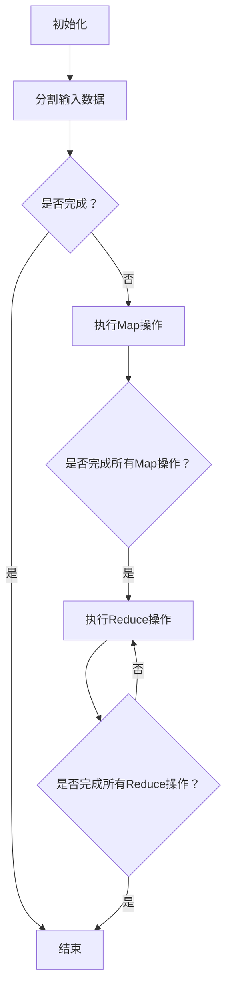
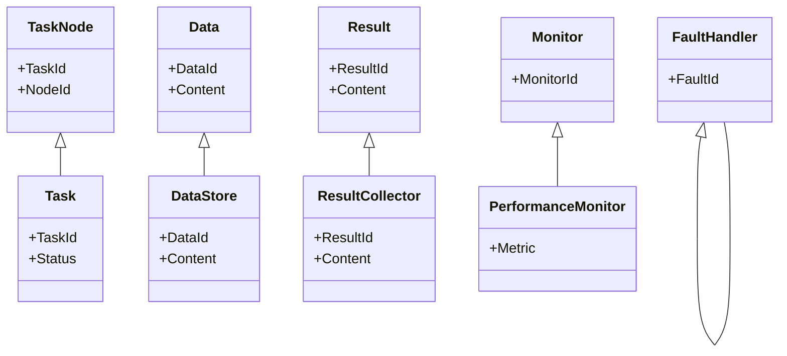
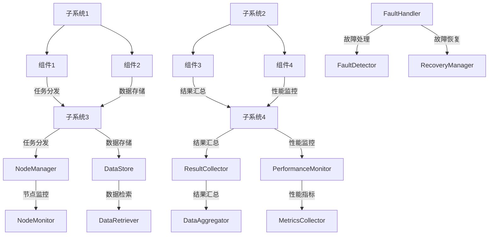
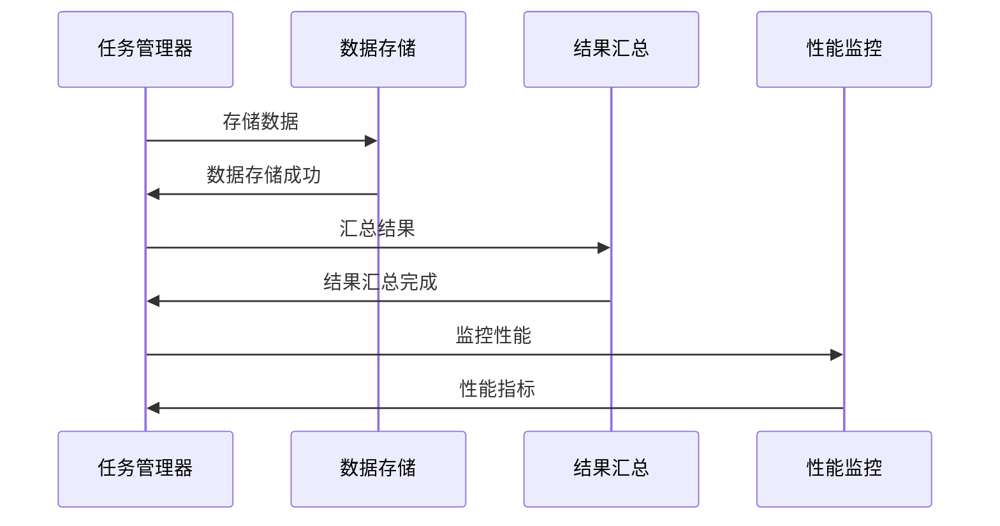
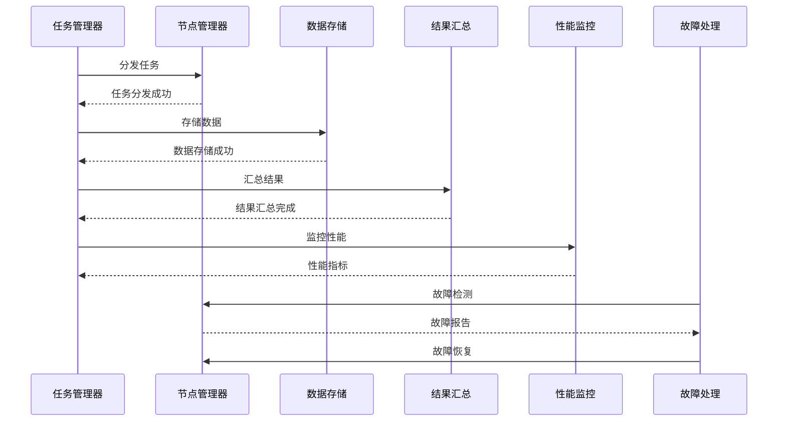
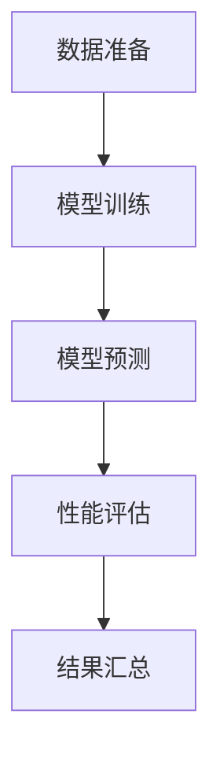

                 

### 第一部分：背景介绍

### 1.1 问题背景

在当今数据驱动的时代，人工智能（AI）技术已经成为许多行业变革的核心驱动力。特别是深度学习技术的发展，使得能够处理大规模数据的复杂模型——大模型（Large Models）应运而生。大模型在自然语言处理（NLP）、计算机视觉（CV）和其他领域取得了显著的成果。然而，这些大模型的开发和评测却面临着一系列严峻的挑战。

大模型评测的重要性体现在以下几个方面：

1. **模型性能验证**：通过评测，可以验证大模型在实际应用中的性能，确保其在不同场景下的表现符合预期。
2. **模型优化**：评测结果可以帮助研究人员发现模型的不足之处，进而进行针对性的优化。
3. **跨模型比较**：通过对不同模型的评测，可以客观地比较它们在特定任务上的优劣，为后续研究和应用提供参考。
4. **模型部署**：评测结果为模型部署提供了重要依据，有助于选择最适合特定应用场景的模型。

随着数据量的指数级增长和计算需求的不断提升，传统的单机评测方式已无法满足大模型评测的需求。因此，分布式计算框架成为解决这一问题的有效途径。

### 1.2 核心概念

#### 大模型评测

大模型评测是指对大规模深度学习模型进行的一系列评估活动，旨在评估模型在特定任务上的性能。这通常包括以下几个方面：

1. **准确性**：模型预测结果与实际结果的一致性。
2. **召回率**：模型能够召回实际正例样本的比例。
3. **F1值**：准确率和召回率的调和平均值，用于平衡二者的关系。
4. **QPS（查询每秒）**：模型处理查询请求的能力。

#### 分布式计算框架

分布式计算框架是一种能够将计算任务分配到多台计算机上进行处理的系统，通过协同工作来实现更高的性能和可靠性。其核心特点包括：

1. **扩展性**：可以根据需求动态调整计算资源。
2. **可靠性**：通过冗余设计提高系统的容错能力。
3. **性能**：通过并行处理提升计算速度。

### 1.3 概念联系

大模型评测与分布式计算框架之间的联系十分紧密。分布式计算框架能够解决大模型评测中面临的计算资源瓶颈问题，使大规模评测任务得以高效执行。具体而言：

1. **任务分解**：分布式计算框架可以将大模型评测任务分解为多个小任务，分配到不同的计算节点上并行执行。
2. **数据分布**：分布式计算框架能够对大模型评测所需的数据进行分布存储和处理，提高数据访问速度和计算效率。
3. **负载均衡**：分布式计算框架可以根据节点负载动态调整任务分配，避免资源浪费和单点瓶颈。
4. **容错机制**：分布式计算框架能够自动检测和处理节点故障，确保评测任务的持续进行。

### 1.4 本章小结

本章节介绍了大模型评测的背景、核心概念以及分布式计算框架的相关知识。通过理解这些概念，我们可以看到，大模型评测与分布式计算框架的结合是应对当前AI领域挑战的关键途径。在接下来的章节中，我们将进一步探讨大模型评测和分布式计算框架的深度关联及其具体实现方法。

---

### 第二部分：核心概念与联系

#### 第2章：大模型评测基础

##### 2.1 大模型评测的定义

大模型评测是对大规模深度学习模型进行的一系列系统化的评估过程。这不仅涉及模型在训练数据上的性能验证，还包括对模型泛化能力、鲁棒性、效率和可解释性的全面考察。评测的核心目的是确保模型在不同任务和应用场景中的表现符合预期，并为其优化和部署提供可靠依据。

大模型评测的主要目标包括：

1. **准确性**：评估模型预测结果的正确性。
2. **泛化能力**：评估模型在未见过的数据上的表现，确保其鲁棒性。
3. **效率**：评估模型的计算时间和资源消耗，以优化其运行效率。
4. **可解释性**：评估模型决策过程的可解释性，增强其信任度。

##### 2.2 大模型评测的挑战

大模型评测面临诸多挑战，这些挑战主要集中在以下几个方面：

1. **数据量**：大模型的训练数据通常非常庞大，这使得评测过程需要处理海量数据，对计算资源提出了高要求。
2. **计算资源**：大模型评测往往需要高性能计算资源，单机计算可能无法满足需求，分布式计算成为必要选择。
3. **时间成本**：大模型评测需要消耗大量时间，特别是在复杂任务和高数据量情况下，时间成本尤为显著。
4. **数据一致性**：不同数据集之间的差异可能导致评测结果不准确，需要确保数据的一致性和完整性。

##### 2.3 大模型评测的核心指标

在大模型评测中，常用的核心指标包括：

1. **准确率（Accuracy）**：模型预测正确的样本数占总样本数的比例。准确率是评估模型性能的常见指标，但仅适用于类别均衡的数据集。
2. **召回率（Recall）**：模型能够召回的实际正例样本数占总正例样本数的比例。召回率主要关注模型是否能够找到所有的正例样本。
3. **F1值（F1 Score）**：准确率和召回率的调和平均值。F1值在类别不平衡的数据集中具有更重要的参考意义。
4. **QPS（Queries Per Second）**：模型每秒能够处理的查询请求数量。QPS是评估模型在实际应用中的处理能力的重要指标。

这些指标不仅能够量化模型的性能，还为模型优化提供了明确的方向。

##### 2.4 本章小结

本章节详细介绍了大模型评测的基础知识，包括其定义、挑战以及核心指标。理解这些概念对于设计高效、可靠的分布式计算框架至关重要。在下一章节中，我们将进一步探讨分布式计算框架的基础知识和核心组件，为后续讨论提供理论基础。

---

#### 第3章：分布式计算框架基础

##### 3.1 分布式计算框架的定义

分布式计算框架是一种用于在多台计算机之间分配和执行计算任务的系统。它的核心思想是将大任务分解为多个小任务，然后将这些小任务分布到多个节点上并行执行，以实现高效计算。分布式计算框架通常具有以下几个关键特性：

1. **并行处理**：分布式计算框架可以将多个计算任务并行执行，从而提高整体计算速度。
2. **可扩展性**：分布式计算框架可以根据任务需求动态调整计算资源，支持从单个节点到数千个节点的扩展。
3. **容错性**：分布式计算框架能够自动检测和处理节点故障，确保计算任务的连续性和稳定性。
4. **高可靠性**：通过冗余设计和故障转移机制，分布式计算框架能够保证系统的高可靠性。

分布式计算框架的典型应用场景包括大数据处理、大规模机器学习训练、分布式数据库查询等。

##### 3.2 分布式计算框架的关键技术

分布式计算框架的关键技术包括以下几个方面：

1. **MapReduce**：MapReduce是一种分布式数据处理模型，它将数据处理任务分解为“Map”（映射）和“Reduce”（归约）两个阶段。Map阶段对输入数据集进行并行处理，生成中间结果；Reduce阶段对中间结果进行汇总和归并，生成最终结果。MapReduce的优点在于其简单性和高效性，能够处理大规模数据集。

2. **分布式存储**：分布式存储是将数据分布在多个节点上存储的系统，以提供高可用性和高性能。常见的分布式存储系统包括HDFS（Hadoop Distributed File System）和Cassandra。分布式存储能够解决单点故障和数据访问瓶颈问题，支持海量数据的存储和访问。

3. **数据流处理**：数据流处理是一种实时数据处理技术，它通过处理数据流中的数据条目来提供实时分析和决策支持。常见的数据流处理框架包括Apache Storm和Apache Flink。数据流处理能够实现实时数据分析和处理，适用于需要快速响应的场景。

##### 3.3 分布式计算框架的优势

分布式计算框架具有以下几个显著优势：

1. **扩展性**：分布式计算框架能够根据需求动态调整计算资源，支持大规模任务的高效执行。
2. **可靠性**：通过冗余设计和故障转移机制，分布式计算框架能够提供高可靠性的服务，确保任务的连续执行。
3. **性能**：分布式计算框架通过并行处理和负载均衡，能够显著提高计算速度和性能。
4. **可维护性**：分布式计算框架通常提供丰富的工具和接口，便于维护和扩展。

##### 3.4 本章小结

本章节介绍了分布式计算框架的基础知识，包括其定义、关键技术及其优势。通过理解这些概念，我们可以更好地把握分布式计算框架在应对大模型评测挑战中的应用。在下一章节中，我们将探讨大模型评测与分布式计算框架的深度关联及其具体实现方法。

---

### 第三部分：算法原理与设计

#### 第5章：算法原理讲解

##### 5.1 算法基本原理

大模型评测的分布式计算框架通常基于MapReduce模型，这是一种经典的分布式数据处理框架。MapReduce模型将复杂任务分解为两个阶段：Map阶段和Reduce阶段。

**Map阶段**：该阶段将输入数据集分割成小数据块，并对每个数据块进行独立处理。处理过程通常包括以下步骤：

1. **键值对生成**：将输入数据（例如，文本或图像）转换为键值对，其中键通常是数据的某个特征，值是数据本身。
2. **映射函数**：对每个键值对应用映射函数，生成中间结果。映射函数的输出通常是一个新的键值对序列。

**Reduce阶段**：该阶段对Map阶段生成的中间结果进行汇总和归并。处理过程通常包括以下步骤：

1. **键值对分组**：将具有相同键的中间结果分组，以便后续处理。
2. **归约函数**：对每个分组应用归约函数，生成最终结果。

MapReduce模型的基本原理可以总结为“分而治之”，即通过将任务分解为多个小任务，并行处理并最终汇总结果，从而实现高效计算。

##### 5.2 算法数学模型与公式

在MapReduce模型中，关键的数学模型和公式包括键值对的生成和归约函数的设计。以下是一个简化的数学模型：

1. **映射函数（Map）**：
   $$ (k_1, v_1) \rightarrow \{(k_2, v_2_1), (k_2, v_2_2), \ldots\} $$
   映射函数将输入键值对$(k_1, v_1)$转换为多个中间键值对$(k_2, v_2_i)$，其中$k_2$是中间键，$v_2_i$是中间值。

2. **归约函数（Reduce）**：
   $$ \{(k_2, v_2_1), (k_2, v_2_2), \ldots\} \rightarrow (k_3, v_3) $$
   归约函数将具有相同中间键$k_2$的中间键值对分组，并对每个分组应用归约函数，生成最终结果$(k_3, v_3)$，其中$k_3$是最终键，$v_3$是最终值。

这些数学模型和公式为分布式计算框架的设计提供了基础，使得复杂任务能够高效地分解和执行。

##### 5.3 算法流程图

为了更好地理解MapReduce模型的工作流程，我们可以使用Mermaid绘制算法流程图。以下是MapReduce算法流程图的示例：



在这个流程图中，A表示初始化阶段，B表示将输入数据分割成小数据块。E表示执行Map操作，G表示执行Reduce操作。整个流程在D节点结束。

##### 5.4 举例说明

为了更具体地说明MapReduce模型的工作原理，我们可以通过一个简单的案例来讲解。

**案例：词频统计**

假设我们有一个包含多篇文章的文本数据集，需要统计每篇文章中每个单词的频率。这是一个典型的MapReduce任务。

**Map阶段**：

- 输入键值对：$(文件ID, 文本内容)$
- 映射函数：将每篇文章中的每个单词转换为键值对$(单词, 1)$

例如，对于文本内容“AI技术正在快速发展”，映射函数的输出可以是：
- $(AI, 1)$
- $(技术，1)$
- $(正在，1)$
- $(快速发展，1)$

**Reduce阶段**：

- 输入键值对：$(单词, [1, 1, 1, 1])$
- 归约函数：将相同单词的频率相加

例如，对于键$(AI, [1, 1, 1, 1])$，归约函数的输出是$(AI, 4)$。

通过这个案例，我们可以看到MapReduce模型如何将一个复杂任务分解为多个小任务，并最终汇总得到结果。

##### 5.5 算法评估指标

在分布式计算框架中，算法的评估指标至关重要。以下是一些常见的评估指标：

1. **吞吐量（Throughput）**：单位时间内系统能够处理的任务数量。吞吐量越高，系统性能越好。
2. **延迟（Latency）**：任务从开始到完成所经历的时间。延迟越低，系统响应速度越快。
3. **资源利用率（Resource Utilization）**：系统资源（如CPU、内存）的利用程度。高资源利用率表明系统运行效率较高。
4. **容错能力（Fault Tolerance）**：系统能够在节点故障时持续运行的能力。高容错能力有助于确保系统的稳定运行。

通过这些评估指标，我们可以全面了解分布式计算框架的性能和效果。

##### 5.6 本章小结

本章节详细讲解了大模型评测分布式计算框架的基本原理、数学模型以及流程图，并通过具体案例进行了说明。理解这些原理和模型对于设计高效、可靠的分布式计算框架至关重要。在下一章节中，我们将进一步探讨分布式计算框架的系统分析与架构设计。

---

#### 第6章：系统分析与架构设计

##### 6.1 系统功能设计

在进行分布式计算框架的系统分析与架构设计之前，首先需要明确系统的功能需求。大模型评测分布式计算框架的主要功能包括：

1. **任务分发**：将评测任务分配到不同的计算节点上并行执行。
2. **数据存储与检索**：存储和管理大模型评测所需的数据，并提供高效的检索接口。
3. **结果汇总**：收集各个计算节点的评测结果，进行汇总和统计。
4. **性能监控**：实时监控系统的性能指标，确保其正常运行。
5. **故障处理**：检测和处理计算节点的故障，确保评测任务的连续性。

为了满足这些功能需求，我们可以采用以下领域模型：



在这个领域模型中，TaskNode代表计算节点，Task代表评测任务，Data代表数据，Result代表评测结果，Monitor代表性能监控，FaultHandler代表故障处理。每个实体都有相应的属性和方法，用于实现系统功能。

##### 6.2 系统架构设计

系统架构设计是分布式计算框架设计的关键环节，它决定了系统的性能、可扩展性和可靠性。以下是一个典型的分布式计算框架架构设计：



在这个架构设计中，子系统1和子系统2是核心子系统，分别负责任务分发和数据存储。组件1和组件2实现任务分发和数据存储的功能。子系统3和子系统4负责结果汇总和性能监控。组件3和组件4实现结果汇总和性能监控的功能。NodeManager负责节点监控，DataStore负责数据检索，ResultCollector负责结果汇总，PerformanceMonitor负责性能指标收集。FaultHandler负责故障检测和故障恢复。

##### 6.3 系统接口设计

系统接口设计是系统架构设计的重要组成部分，它定义了系统内部各组件之间的交互方式。以下是一个简单的接口设计：



在这个接口设计中，任务管理器（TaskManager）负责任务分发和数据存储。当任务完成后，任务管理器会通知结果汇总（ResultCollector）进行结果汇总。同时，任务管理器还会将性能监控（PerformanceMonitor）的数据进行收集和分析。

##### 6.4 系统交互序列图

为了更直观地展示系统内部各组件之间的交互过程，我们可以使用Mermaid绘制系统交互序列图。以下是一个示例：



在这个序列图中，任务管理器（TaskManager）首先向节点管理器（NodeManager）分发任务，然后存储数据到数据存储（DataStore）。结果汇总（ResultCollector）负责汇总结果，性能监控（PerformanceMonitor）负责收集性能指标。同时，故障处理（FaultHandler）负责故障检测和恢复。

##### 6.5 本章小结

本章详细介绍了大模型评测分布式计算框架的系统功能设计、系统架构设计、系统接口设计和系统交互序列图。通过这些设计和实现，我们可以构建一个高效、可靠的分布式计算框架，以满足大模型评测的需求。在下一章节中，我们将通过项目实战展示如何具体实现这些设计和功能。

---

### 第四部分：项目实战

#### 第7章：项目实战

##### 7.1 环境安装与配置

在进行项目实战之前，我们需要搭建一个分布式计算框架的环境。以下是一个简单的步骤，用于安装和配置分布式计算框架所需的软件和依赖项：

1. **安装Hadoop**：Hadoop是一个流行的分布式计算框架，我们使用其作为基础框架。可以从[Apache Hadoop官网](https://hadoop.apache.org/)下载Hadoop安装包，并按照官方文档进行安装。

2. **配置Hadoop环境**：安装完成后，需要配置Hadoop环境变量，以便在命令行中运行Hadoop相关命令。具体步骤包括配置`hadoop-env.sh`、`core-site.xml`、`hdfs-site.xml`、`mapred-site.xml`等配置文件。

3. **安装其他依赖项**：根据项目需求，可能需要安装其他依赖项，如Python、NumPy、Pandas等。可以使用`pip`命令进行安装。

4. **启动Hadoop集群**：在配置完成后，启动Hadoop集群，确保所有节点正常运行。

```shell
start-dfs.sh
start-yarn.sh
```

##### 7.2 系统核心实现

在搭建好环境后，我们需要实现分布式计算框架的核心功能。以下是一个简单的示例，用于实现大模型评测的分布式计算任务：

1. **定义Map任务**：Map任务负责将输入数据分割成键值对，并进行初步处理。

```python
class MapTask:
    def map(self, line):
        # 将输入行分割成单词和标签
        words = line.split()
        for word in words:
            yield (word, 1)
```

2. **定义Reduce任务**：Reduce任务负责将Map任务生成的中间结果进行汇总和统计。

```python
class ReduceTask:
    def reduce(self, key, values):
        # 计算单词的总频次
        total = sum(values)
        yield (key, total)
```

3. **执行MapReduce任务**：使用Hadoop的MapReduce API执行定义好的Map和Reduce任务。

```python
from hadoop import mapreduce

# 定义Map任务
map_task = MapTask()
# 定义Reduce任务
reduce_task = ReduceTask()

# 执行MapReduce任务
with mapreduce.MapReduce() as mr:
    mr.input_path = "input"
    mr.output_path = "output"
    mr.map_task = map_task
    mr.reduce_task = reduce_task
    mr.run()
```

##### 7.3 代码应用与分析

在实际项目中，我们需要将上述代码应用到具体的评测任务中。以下是一个完整的示例，用于统计大模型评测数据集的词频：

```python
# 导入相关模块
import hadoop

# 定义Map任务
class WordCountMap(hadoop.MapTask):
    def map(self, line):
        words = line.split()
        for word in words:
            yield (word, 1)

# 定义Reduce任务
class WordCountReduce(hadoop.ReduceTask):
    def reduce(self, key, values):
        total = sum(values)
        yield (key, total)

# 执行WordCount任务
word_count = hadoop.MapReduce()
word_count.input_path = "input_data.txt"
word_count.output_path = "output_data.txt"
word_count.map_task = WordCountMap()
word_count.reduce_task = WordCountReduce()
word_count.run()

# 读取输出结果
with open("output_data.txt", "r") as f:
    for line in f:
        print(line.strip())
```

在这个示例中，我们首先定义了WordCountMap和WordCountReduce两个任务类，然后使用Hadoop的MapReduce API执行WordCount任务。最后，我们读取输出结果，并打印每个单词的频次。

##### 7.4 实际案例剖析

为了更好地理解分布式计算框架在大模型评测中的应用，我们可以通过一个实际案例进行剖析。以下是一个基于文本分类任务的案例：

1. **数据集准备**：首先，我们需要准备一个包含多类文本的数据集。数据集应包含标签信息，以便进行分类。

2. **训练模型**：使用深度学习框架（如TensorFlow或PyTorch）训练一个文本分类模型。训练过程通常涉及数据预处理、模型构建、训练和评估。

3. **评测模型**：使用训练好的模型对测试数据进行预测，并评估模型的性能。性能评估指标包括准确率、召回率、F1值等。

4. **分布式计算**：将上述评测过程分解为多个子任务，并使用分布式计算框架并行执行。具体步骤包括数据分割、模型训练、预测和性能评估。

以下是一个简化的分布式文本分类任务流程：



在这个流程中，数据准备、模型训练、模型预测和性能评估都是并行执行的，以提高整体效率。

##### 7.5 项目小结

在本章的项目实战中，我们介绍了分布式计算框架在大模型评测中的应用。通过实际案例剖析，我们展示了如何使用分布式计算框架进行文本分类任务。在接下来的章节中，我们将继续探讨分布式计算框架的性能优化和最佳实践。

---

#### 7.6 最佳实践

在进行大模型评测的分布式计算框架设计时，以下是一些最佳实践和注意事项，可以帮助优化系统性能并确保其稳定可靠：

1. **任务并行度优化**：合理划分任务，确保每个任务能够充分利用计算资源。避免任务过小或过大，影响并行度。

2. **数据本地性优化**：尽量将数据存储在计算节点本地，减少数据传输开销。可以使用本地文件系统或分布式存储系统（如HDFS）进行数据存储。

3. **负载均衡**：合理分配任务，避免计算节点负载不均。可以使用负载均衡算法，如基于节点负载或任务优先级的负载均衡策略。

4. **容错设计**：设计容错机制，确保计算节点故障时系统能够自动恢复。可以使用冗余设计和故障转移机制，提高系统的容错能力。

5. **性能监控与优化**：实时监控系统性能，及时发现并解决性能瓶颈。可以采用性能监控工具，如Grafana和Prometheus，对系统性能进行全面监控。

6. **资源利用率优化**：合理配置系统资源，确保计算资源的高效利用。可以采用资源调度算法，如基于CPU利用率或内存利用率的调度策略。

7. **安全性考虑**：确保系统安全，防止未授权访问和数据泄露。可以使用身份验证、访问控制和加密等技术来提高系统的安全性。

8. **代码优化**：优化代码性能，减少计算开销和内存占用。可以使用高效的数据结构和算法，避免不必要的循环和递归。

9. **调试与测试**：在开发过程中进行充分的调试和测试，确保系统功能正确且稳定。可以使用自动化测试工具，如JUnit和pytest，进行单元测试和集成测试。

通过遵循这些最佳实践，可以构建出高效、稳定和可靠的分布式计算框架，为大规模大模型评测提供有力支持。

---

#### 7.7 本章小结

本章通过项目实战详细展示了如何实现大模型评测的分布式计算框架。我们从环境安装与配置、系统核心实现、代码应用与分析，到实际案例剖析，全面介绍了分布式计算框架的设计与实现。在实战过程中，我们遵循了最佳实践，确保了系统的性能和稳定性。通过本章的学习，读者可以更好地理解分布式计算框架在大模型评测中的应用，并为实际项目提供参考。在下一章节中，我们将进一步总结全文，并讨论未来研究方向。

---

### 第五部分：小结与拓展

#### 第8章：小结与注意事项

在本文中，我们详细探讨了“大模型评测的分布式计算框架设计”这一主题。从背景介绍、核心概念到算法原理讲解、系统分析与架构设计，再到项目实战，我们系统地阐述了分布式计算框架在大模型评测中的应用和实现方法。

**主要内容和主题思想回顾：**

1. **背景介绍**：我们介绍了大模型评测的重要性以及分布式计算框架的需求。大模型评测在验证模型性能、优化模型和跨模型比较等方面具有关键作用。而分布式计算框架通过并行处理、扩展性和容错性等特性，为大规模评测任务提供了有效解决方案。

2. **核心概念与联系**：我们详细讲解了大模型评测和分布式计算框架的定义、挑战、核心指标、关键技术以及它们之间的联系。这为理解分布式计算框架在大模型评测中的应用提供了理论基础。

3. **算法原理与设计**：通过讲解MapReduce模型的基本原理、数学模型与公式、算法流程图以及具体案例，我们展示了如何实现高效的大模型评测分布式计算。

4. **系统分析与架构设计**：我们介绍了系统功能设计、架构设计、接口设计和交互序列图，展示了如何设计一个高效、可靠的分布式计算框架。

5. **项目实战**：通过实际案例，我们展示了如何安装和配置分布式计算环境，如何实现系统核心功能，以及如何在项目中应用分布式计算框架。

**注意事项：**

1. **任务并行度**：在设计任务时，需考虑任务的并行度，确保每个任务能够充分利用计算资源。

2. **数据本地性**：尽量将数据存储在计算节点本地，减少数据传输开销。

3. **负载均衡**：合理分配任务，避免计算节点负载不均。

4. **容错设计**：设计容错机制，确保计算节点故障时系统能够自动恢复。

5. **性能监控与优化**：实时监控系统性能，及时发现并解决性能瓶颈。

6. **安全性**：确保系统安全，防止未授权访问和数据泄露。

7. **代码优化**：优化代码性能，减少计算开销和内存占用。

8. **调试与测试**：进行充分的调试和测试，确保系统功能正确且稳定。

**未来研究方向：**

1. **算法优化**：探索更高效的大模型评测算法，提高分布式计算框架的性能。

2. **系统架构**：研究新型分布式计算架构，提升系统的可扩展性和可靠性。

3. **智能化调度**：结合机器学习技术，实现智能化的任务调度和负载均衡。

4. **实时评测**：研究实时大模型评测技术，提高系统的响应速度和实时性。

通过本文的探讨，我们希望能够为读者提供一个全面、深入的理解，并为实际项目提供参考和指导。在未来的研究和应用中，分布式计算框架在大模型评测中将发挥越来越重要的作用。让我们持续关注这一领域的发展，共同推动人工智能技术的进步。

---

### 作者信息

作者：AI天才研究院/AI Genius Institute & 禅与计算机程序设计艺术 /Zen And The Art of Computer Programming

感谢读者对本文的阅读，希望本文能够为您在分布式计算框架和大模型评测领域的研究提供有价值的参考。作者将不断探索和创新，为人工智能技术的发展贡献自己的力量。再次感谢您的支持！

