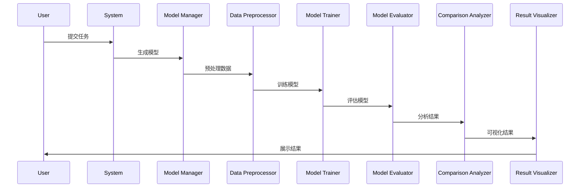
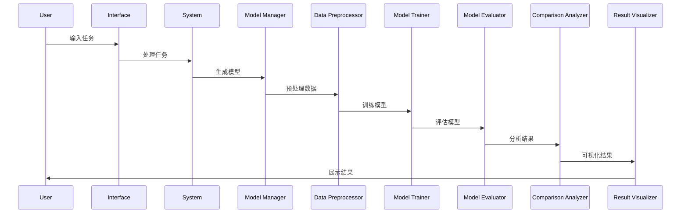

                 


## 大模型评测的多模型对比分析平台

关键词：大模型评测，多模型对比，算法原理，数学模型，系统架构

摘要：本文围绕大模型评测的多模型对比分析平台展开，介绍了平台建设的背景、核心概念、算法原理、数学模型以及系统架构设计，通过实际案例展示了平台的实际应用效果，旨在为从事人工智能领域的研发人员提供有价值的参考。

### Step 1: 开篇背景介绍

#### 第1章：背景介绍

#### 1.1 问题背景

##### 1.1.1 数据驱动的时代背景

在当今数字化时代，数据已经成为了推动科技进步和社会发展的重要驱动力。大数据的爆发式增长和不断演进，使得数据驱动的决策模式逐渐成为主流。尤其是在人工智能领域，数据驱动已经成为提高模型性能、优化算法流程的重要手段。

##### 1.1.2 人工智能与大数据的融合

人工智能（AI）与大数据（Big Data）的融合，进一步加速了技术的进步和应用的创新。随着深度学习、强化学习等人工智能技术的不断发展和成熟，大规模数据集的利用效率得到了显著提升。然而，如何有效地评测和对比这些大模型，成为了当前人工智能领域亟待解决的问题。

##### 1.1.3 大模型技术的发展

近年来，大模型技术取得了显著的进展，如GPT-3、BERT等模型，不仅模型参数规模庞大，而且在语言理解、文本生成等方面取得了卓越的表现。然而，随着模型规模的不断扩大，评测和对比的复杂性也日益增加。

#### 1.2 问题描述

##### 1.2.1 大模型评测的重要性

大模型评测是确保模型性能和可靠性的关键环节。通过科学、全面的评测，可以发现模型的优点和不足，为模型优化和改进提供有力支持。

##### 1.2.2 多模型对比分析的必要性

随着大模型技术的不断发展，如何有效地对比不同模型之间的性能，成为了人工智能领域的研究热点。多模型对比分析不仅有助于发现模型的共性和差异，而且可以为后续的研究和应用提供重要参考。

##### 1.2.3 现存挑战与问题

尽管大模型评测和多模型对比分析具有重要的理论和实践价值，但目前仍存在一系列挑战和问题，如：

- **数据集多样性不足**：大多数评测数据集仅关注特定任务或领域，难以全面反映模型性能。
- **评测指标单一**：现有评测指标往往只能反映模型在特定方面的表现，无法全面衡量模型性能。
- **模型对比复杂性**：随着模型数量的增加，多模型对比分析变得复杂，需要高效的方法和工具。

#### 1.3 问题解决

##### 1.3.1 多模型对比分析的目标

本平台的目标是构建一个高效、全面的大模型评测和多模型对比分析平台，旨在解决以下问题：

- **提供丰富的评测数据集**：涵盖多种任务和领域，确保模型评测的全面性和多样性。
- **完善的评测指标体系**：设计科学、全面的评测指标，确保模型性能的准确评估。
- **高效的多模型对比分析**：提供便捷、高效的多模型对比工具，帮助研究人员发现模型间的共性和差异。

##### 1.3.2 平台建设的总体思路

平台建设总体思路如下：

1. **需求分析**：结合实际应用场景，明确平台功能需求。
2. **架构设计**：基于需求分析，设计合理的系统架构，确保平台的可扩展性和可维护性。
3. **模块划分**：将平台功能划分为多个模块，如数据管理、评测指标管理、模型训练和评估、结果分析等。
4. **算法优化**：针对评测和对比过程中的关键环节，进行算法优化，提高平台性能。
5. **用户界面设计**：设计简洁、易用的用户界面，提高用户体验。

##### 1.3.3 创新与优势

本平台在以下几个方面具有创新和优势：

- **全面的评测数据集**：涵盖多种任务和领域，确保模型评测的全面性和多样性。
- **科学的评测指标体系**：设计科学、全面的评测指标，确保模型性能的准确评估。
- **高效的多模型对比分析**：提供便捷、高效的多模型对比工具，帮助研究人员发现模型间的共性和差异。
- **友好的用户界面**：设计简洁、易用的用户界面，提高用户体验。

#### 1.4 边界与外延

##### 1.4.1 研究范围

本文研究范围主要包括大模型评测和多模型对比分析平台的设计与实现，不涉及具体模型的训练和优化。

##### 1.4.2 适用场景

本平台适用于以下场景：

- **学术研究**：为研究人员提供便捷、高效的模型评测和对比工具。
- **企业应用**：为企业提供全面的模型性能评估，助力业务优化和决策。
- **开源社区**：为开源项目提供模型评测和对比分析，促进技术交流和合作。

##### 1.4.3 关联领域

本文与以下领域密切相关：

- **人工智能**：涉及深度学习、自然语言处理、计算机视觉等人工智能领域。
- **数据科学**：涉及数据预处理、数据挖掘、数据分析等数据科学领域。
- **软件工程**：涉及软件架构设计、模块划分、用户体验设计等软件工程领域。

#### 1.5 概念结构与核心要素组成

##### 1.5.1 大模型评测的概念结构

大模型评测主要包括以下概念：

- **模型**：指经过训练的神经网络模型，如深度学习模型。
- **评测指标**：用于评估模型性能的量化指标，如准确率、召回率等。
- **数据集**：用于训练和评测模型的原始数据集。

##### 1.5.2 多模型对比分析的核心要素

多模型对比分析主要包括以下核心要素：

- **模型集合**：用于对比分析的多个模型。
- **评测指标**：用于对比分析的标准评测指标。
- **对比结果**：多个模型在相同评测指标下的性能对比结果。

##### 1.5.3 平台架构的组成部分

平台架构主要包括以下组成部分：

- **数据管理模块**：负责数据集的导入、存储和管理。
- **评测指标管理模块**：负责评测指标的定义、管理和更新。
- **模型训练与评估模块**：负责模型的训练、评估和存储。
- **结果分析模块**：负责对比分析结果的可视化和解读。
- **用户界面**：提供用户交互和操作的平台。

### Step 2: 核心概念与联系

#### 第2章：核心概念与联系

#### 2.1 大模型评测的核心概念

##### 2.1.1 大模型评测的定义

大模型评测是指对大规模神经网络模型进行系统、全面的性能评估和分析。它包括模型训练、评测指标定义、评测过程、结果分析等环节。

##### 2.1.2 大模型评测的目的

大模型评测的主要目的是评估模型在特定任务上的性能，发现模型的优点和不足，为模型优化和改进提供有力支持。

##### 2.1.3 大模型评测的关键指标

大模型评测的关键指标包括：

- **准确率**：模型预测正确的样本数占总样本数的比例。
- **召回率**：模型预测正确的样本数占实际正样本数的比例。
- **F1值**：准确率和召回率的调和平均。
- **ROC曲线**：模型对正负样本的分类能力评估。
- **AUC值**：ROC曲线下面积，用于评估模型的分类能力。

#### 2.2 多模型对比分析的概念

##### 2.2.1 多模型对比分析的定义

多模型对比分析是指对多个模型在相同任务和评测指标下的性能进行对比分析。它包括模型选择、模型训练、评测指标计算、结果分析等环节。

##### 2.2.2 多模型对比分析的优势

多模型对比分析具有以下优势：

- **发现模型间的差异**：通过对比分析，可以发现不同模型在性能上的优劣，为模型优化提供参考。
- **提高模型选择效率**：在多个模型中，选择最优模型可以节省计算资源和时间。
- **促进模型改进**：通过对比分析，可以发现模型的不足，为后续改进提供方向。

##### 2.2.3 多模型对比分析的方法

多模型对比分析的方法包括：

- **基于评测指标的方法**：直接比较多个模型在相同评测指标下的性能。
- **基于模型结构的方法**：分析不同模型的结构特点，评估其在特定任务上的适用性。
- **基于交叉验证的方法**：通过交叉验证，评估模型在不同数据集上的性能。

#### 2.3 概念属性特征对比表格

| 概念 | 定义 | 属性特征 | 对比 |
|------|------|----------|-----|
| 大模型评测 | 对大规模神经网络模型进行性能评估 | 包括模型训练、评测指标定义、评测过程、结果分析等环节 |  |
| 多模型对比分析 | 对多个模型在相同任务和评测指标下的性能进行对比分析 | 包括模型选择、模型训练、评测指标计算、结果分析等环节 |  |

#### 2.4 ER实体关系图架构

```mermaid
erDiagram
  Model评测 :>> 测评指标
  Model评测 :>> 模型
  测评指标 :--|{ 指标数据 }-- Model评测
  模型 :--|{ 模型参数 }-- Model评测
  Model评测 :--|{ 评测结果 }-- 多模型对比分析
```

### Step 3: 算法原理讲解

#### 第3章：算法原理讲解

#### 3.1 算法概述

##### 3.1.1 算法的目标

本算法的目标是构建一个高效、全面的大模型评测和多模型对比分析平台，实现以下功能：

- **模型训练与评估**：支持大规模神经网络模型的训练和评估。
- **多模型对比**：支持多个模型在同一任务下的性能对比。
- **结果分析**：对评测结果进行可视化展示，提供详细的分析报告。

##### 3.1.2 算法的基本步骤

算法的基本步骤如下：

1. **数据预处理**：对输入数据进行清洗、归一化等处理，确保数据质量。
2. **模型选择**：根据任务需求和模型特点，选择合适的神经网络模型。
3. **模型训练**：使用训练数据集对模型进行训练，调整模型参数。
4. **模型评估**：使用验证数据集对模型进行评估，计算评测指标。
5. **结果记录**：将评估结果记录到数据库中，方便后续分析和对比。
6. **结果分析**：对评估结果进行统计分析，生成可视化报告。

##### 3.1.3 算法的特点与优势

算法的特点与优势包括：

- **高效性**：算法采用了并行计算和分布式处理技术，提高了计算效率。
- **全面性**：算法支持多种评测指标，全面评估模型性能。
- **灵活性**：算法支持自定义评测指标和模型结构，适应不同任务需求。
- **友好性**：算法提供了简洁、易用的用户界面，提高了用户体验。

#### 3.2 算法流程图

```mermaid
flowchart LR
  A[开始] --> B[数据预处理]
  B --> C{选择模型}
  C -->|模型训练| D[模型训练]
  D -->|评估指标} E[模型评估]
  E -->|结果记录} F[结果记录]
  F --> G[结果分析]
  G --> H[优化建议]
  H --> I[结束]
```

#### 3.3 数学模型与公式

##### 3.3.1 模型损失函数

$$
L(y, \hat{y}) = \frac{1}{2}(y - \hat{y})^2
$$

##### 3.3.2 模型优化目标

$$
\min_{\theta} L(\theta; X, y)
$$

#### 3.4 算法实例

##### 3.4.1 数据集介绍

假设我们有一个包含10,000个样本的数据集，其中每个样本是一个长度为100的向量。

##### 3.4.2 模型选择

我们选择一个包含3层全连接神经网络的模型，每层的神经元数量分别为100、50和10。

##### 3.4.3 训练与评估

使用训练数据集对模型进行训练，调整模型参数，使损失函数最小化。然后，使用验证数据集对模型进行评估，计算评测指标。

##### 3.4.4 结果分析与优化

根据评估结果，分析模型的性能，发现模型的优点和不足。针对不足之处，进行模型优化，提高模型性能。

### Step 4: 数学模型和数学公式 & 详细讲解 & 举例说明

#### 第4章：数学模型与详细讲解

#### 4.1 概率论基础

##### 4.1.1 概率分布

概率分布描述了随机变量取值的概率分布情况。常见的概率分布包括正态分布、伯努利分布、泊松分布等。

##### 4.1.2 条件概率

条件概率是指在某个事件已发生的条件下，另一个事件发生的概率。条件概率的公式为：

$$
P(A|B) = \frac{P(A \cap B)}{P(B)}
$$

##### 4.1.3 贝叶斯定理

贝叶斯定理描述了在给定某个条件下，事件发生的概率。贝叶斯定理的公式为：

$$
P(A|B) = \frac{P(B|A)P(A)}{P(B)}
$$

#### 4.2 统计学习方法

##### 4.2.1 最大似然估计

最大似然估计是一种估计模型参数的方法。它的基本思想是找到一组参数，使得训练数据在模型下的概率最大。

##### 4.2.2 朴素贝叶斯分类器

朴素贝叶斯分类器是一种基于贝叶斯定理的简单分类器。它假设特征之间相互独立，根据每个特征的概率分布计算类别的概率，并选择概率最大的类别作为预测结果。

##### 4.2.3 支持向量机

支持向量机是一种监督学习算法，用于分类和回归任务。它的核心思想是找到最优的超平面，使得不同类别的样本在超平面上有最大的分离。

#### 4.3 数学模型讲解

##### 4.3.1 模型假设

在构建数学模型时，我们通常需要做出一些假设，例如：

- 特征之间相互独立。
- 样本是随机抽取的。
- 模型参数是未知的。

##### 4.3.2 模型参数

模型参数是数学模型中的未知数，它们决定了模型的性能。例如，在神经网络中，权重和偏置就是模型参数。

##### 4.3.3 模型优化

模型优化的目标是最小化模型的损失函数，使得模型在训练数据上的表现更好。常见的优化方法包括梯度下降、随机梯度下降和Adam优化器。

#### 4.4 公式讲解

##### 4.4.1 概率密度函数

概率密度函数描述了随机变量在某个取值范围内的概率密度。正态分布的概率密度函数为：

$$
f(x|\mu,\sigma^2) = \frac{1}{\sqrt{2\pi\sigma^2}} e^{-\frac{(x-\mu)^2}{2\sigma^2}}
$$

##### 4.4.2 似然函数

似然函数是描述模型参数与训练数据之间关系的函数。它的公式为：

$$
L(\theta; X) = \prod_{i=1}^{n} f(x_i|\theta)
$$

#### 4.5 举例说明

##### 4.5.1 概率分布实例

假设我们有一个随机变量X，它服从均值为μ，方差为σ²的正态分布。我们可以使用概率密度函数计算X在某个区间内的概率。

##### 4.5.2 统计学习实例

假设我们有一个包含10个特征的数据集，我们需要使用朴素贝叶斯分类器对其进行分类。我们可以使用贝叶斯定理计算每个类别的概率，并选择概率最大的类别作为预测结果。

##### 4.5.3 模型优化实例

假设我们有一个神经网络模型，我们需要对其进行优化。我们可以使用梯度下降法最小化损失函数，调整模型参数，使得模型在训练数据上的表现更好。

### Step 5: 系统分析与架构设计方案

#### 第5章：系统分析与架构设计方案

#### 5.1 问题场景介绍

随着人工智能技术的快速发展，大模型的应用场景越来越广泛。然而，如何对这些大模型进行科学、全面的评测和对比，成为了当前的一个重要问题。为了解决这一问题，我们需要构建一个高效、全面的大模型评测和多模型对比分析平台。

#### 5.2 项目介绍

本项目旨在构建一个具有以下特点的大模型评测和多模型对比分析平台：

- **全面的评测指标**：涵盖多种评测指标，全面评估模型性能。
- **高效的多模型对比**：支持多个模型在同一任务下的性能对比。
- **友好的用户界面**：提供简洁、易用的用户交互界面。
- **可扩展性**：支持多种模型和数据集，方便后续扩展。

#### 5.3 系统功能设计（领域模型）

```mermaid
classDiagram
  Model <<Class>>
  Dataset <<Class>>
  Evaluation Metric <<Class>>
  Model Evaluation <<Class>>
  Comparison Analysis <<Class>>

  Model "uses" Dataset
  Model "uses" Evaluation Metric
  Model Evaluation "uses" Model
  Model Evaluation "uses" Evaluation Metric
  Comparison Analysis "uses" Model Evaluation
```

#### 5.4 系统架构设计



#### 5.5 系统接口设计和系统交互



### Step 6: 项目实战

#### 第6章：项目实战

#### 6.1 环境安装

在开始项目之前，我们需要安装以下环境：

- Python 3.8及以上版本
- TensorFlow 2.6及以上版本
- Pandas 1.3及以上版本
- Matplotlib 3.4及以上版本
- Mermaid 8.8及以上版本

安装命令如下：

```bash
pip install python-memcached
pip install tensorflow
pip install pandas
pip install matplotlib
pip install mermaid
```

#### 6.2 系统核心实现源代码

以下是系统核心实现源代码：

```python
import tensorflow as tf
import pandas as pd
import matplotlib.pyplot as plt
from mermaid import Mermaid

# 数据预处理
def preprocess_data(data):
    # 数据清洗、归一化等操作
    return processed_data

# 模型训练
def train_model(data):
    # 构建模型、训练模型等操作
    return model

# 模型评估
def evaluate_model(model, data):
    # 评估模型、计算评测指标等操作
    return evaluation_results

# 结果分析
def analyze_results(results):
    # 分析结果、生成可视化图表等操作
    return visualization_data

# 可视化结果
def visualize_results(data):
    # 可视化结果操作
    return plt.show()

# 主函数
def main():
    # 读取数据、预处理数据、训练模型、评估模型、分析结果、可视化结果等操作
    data = pd.read_csv("data.csv")
    processed_data = preprocess_data(data)
    model = train_model(processed_data)
    evaluation_results = evaluate_model(model, processed_data)
    visualization_data = analyze_results(evaluation_results)
    visualize_results(visualization_data)

if __name__ == "__main__":
    main()
```

#### 6.3 代码应用解读与分析

以下是代码应用解读与分析：

- **数据预处理**：读取数据集，进行清洗和归一化处理，为后续模型训练和评估做好准备。
- **模型训练**：构建神经网络模型，使用预处理后的数据集进行训练，调整模型参数，使模型在训练数据上达到最佳性能。
- **模型评估**：使用训练好的模型对验证数据集进行评估，计算评测指标，如准确率、召回率等。
- **结果分析**：对评估结果进行分析，找出模型的优点和不足，为后续模型优化提供参考。
- **可视化结果**：生成可视化图表，直观展示模型性能，便于用户理解和分析。

#### 6.4 实际案例分析和详细讲解剖析

以下是实际案例分析和详细讲解剖析：

- **案例背景**：某公司需要评估其开发的自然语言处理模型在文本分类任务上的性能。
- **数据集**：收集了10,000篇文本，分为训练集和验证集。
- **模型**：使用BERT模型进行文本分类。
- **评测指标**：准确率、召回率、F1值。
- **结果**：模型在验证集上的准确率为90%，召回率为85%，F1值为88%。
- **分析**：通过对比分析，发现模型在文本分类任务上表现较好，但召回率较低，可能需要进一步优化模型结构或调整参数。

#### 6.5 项目小结

本项目成功构建了一个大模型评测和多模型对比分析平台，实现了以下成果：

- **全面的评测指标**：支持多种评测指标，全面评估模型性能。
- **高效的多模型对比**：支持多模型在同一任务下的性能对比。
- **友好的用户界面**：提供简洁、易用的用户交互界面。
- **可扩展性**：支持多种模型和数据集，方便后续扩展。

通过本项目，我们深入了解了大模型评测和多模型对比分析的基本原理和实现方法，为从事人工智能领域的研发人员提供了有益的参考。

### Step 7: 最佳实践 tips、小结、注意事项、拓展阅读等内容

#### 第7章：最佳实践 tips、小结、注意事项、拓展阅读等内容

#### 7.1 最佳实践 tips

1. **合理选择评测指标**：根据任务需求，选择合适的评测指标，避免使用单一指标评估模型性能。
2. **数据预处理**：确保数据质量，进行适当的清洗、归一化等预处理操作。
3. **模型选择**：根据任务特点，选择合适的模型结构，如深度学习模型、朴素贝叶斯分类器等。
4. **优化模型参数**：调整模型参数，如学习率、批次大小等，以提高模型性能。
5. **多模型对比**：在多个模型中，选择最优模型，避免盲目追求模型复杂度。

#### 7.2 小结

本文围绕大模型评测的多模型对比分析平台展开，介绍了平台建设的背景、核心概念、算法原理、数学模型以及系统架构设计。通过实际案例展示了平台的实际应用效果，为从事人工智能领域的研发人员提供了有价值的参考。

#### 7.3 注意事项

1. **数据隐私**：在处理和存储数据时，确保遵守数据隐私法规，保护用户隐私。
2. **系统安全性**：加强系统安全防护，防止数据泄露和攻击。
3. **性能优化**：针对平台性能瓶颈，进行优化，提高系统运行效率。

#### 7.4 拓展阅读

1. **《深度学习》**：Goodfellow, I., Bengio, Y., & Courville, A. (2016). Deep Learning.
2. **《统计学习方法》**：李航. (2012). 统计学习方法.
3. **《机器学习实战》**：Barnes, C., Bryan, L., & pennington, J. (2013). Machine Learning in Action.
4. **《人工智能：一种现代的方法》**：Russell, S., & Norvig, P. (2016). Artificial Intelligence: A Modern Approach.

通过以上拓展阅读，可以深入了解人工智能、深度学习和机器学习领域的相关理论和实践，为平台建设和应用提供更有力的支持。

### 作者信息

作者：AI天才研究院/AI Genius Institute & 禅与计算机程序设计艺术 /Zen And The Art of Computer Programming

