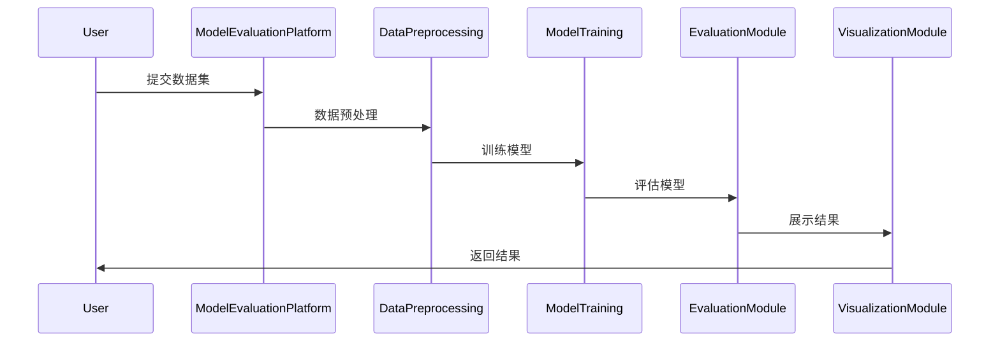

                 

# 大模型评测的多维度分析平台

关键词：大模型评测、多维度分析、平台设计、算法实现、实践应用

摘要：本文将探讨大模型评测的多维度分析平台的设计与实现，从核心概念、评价指标、方法体系、工具技术、案例分析等方面，系统性地介绍如何构建一个全面、高效的大模型评测平台。通过本文的阐述，读者将能够了解大模型评测的复杂性，掌握多维度分析的关键方法，并为实际项目提供有益的参考。

## 引言

随着人工智能技术的迅猛发展，大型神经网络模型（大模型）在各种领域取得了显著的成果，如自然语言处理、计算机视觉和推荐系统等。然而，大模型的应用不仅仅是模型的训练和部署，更重要的是对模型进行全面的评测。大模型评测的目的是评估模型在特定任务上的性能，发现模型的优势和不足，为后续的优化提供依据。

传统的评测方法往往侧重于单一指标，如准确率、召回率或F1分数等，但这种方法难以全面反映模型在不同维度的表现。为了解决这一问题，需要构建一个多维度分析平台，能够从多个角度对大模型进行评测。本文将详细探讨如何设计和实现这样一个平台，包括核心概念、评价指标、方法体系、工具技术以及实际案例分析。

本文的结构如下：

1. **背景与核心概念**：介绍大模型评测的背景，定义相关核心概念，如大模型、评测指标等。
2. **评价指标体系**：讨论常见的评测指标，以及如何构建一个全面的评价指标体系。
3. **多维度分析方法**：探讨如何从不同维度对大模型进行评测，包括数据维度、算法维度、应用维度等。
4. **平台设计与实现**：介绍如何设计一个多维度分析平台，包括技术架构、关键模块和实现细节。
5. **工具与技术**：讨论构建多维度分析平台所需的关键技术和工具。
6. **案例分析**：通过实际案例展示多维度分析平台的应用。
7. **挑战与未来方向**：总结现有平台面临的挑战，探讨未来的发展方向。
8. **结论**：总结全文，提出建议和展望。

## 背景与核心概念

### 大模型

大模型通常指的是具有数百万甚至数十亿参数的神经网络模型。这些模型通常用于处理复杂的任务，如图像分类、文本生成和语音识别等。大模型的出现使得机器学习算法能够在多种应用场景中取得突破性的进展。

大模型的特点包括：

- **参数规模巨大**：大模型的参数规模通常在数百万到数十亿之间，这要求有强大的计算资源和优化算法。
- **计算复杂度高**：由于参数数量庞大，大模型的计算复杂度非常高，训练和推理过程需要大量的计算资源。
- **泛化能力较强**：大模型通常具有良好的泛化能力，能够在多种任务和领域表现出优异的性能。

### 评测指标

评测指标是评估模型性能的关键标准，常见的评测指标包括：

- **准确率**（Accuracy）：模型正确预测的样本数占总样本数的比例。
- **召回率**（Recall）：模型正确预测为正类的样本数占实际正类样本数的比例。
- **F1分数**（F1 Score）：准确率和召回率的调和平均值。
- **精度**（Precision）：模型正确预测为正类的样本数占预测为正类的样本总数比例。
- **ROC曲线**（Receiver Operating Characteristic Curve）：通过计算不同阈值下的准确率和召回率，评估模型的性能。
- **AUC值**（Area Under Curve）：ROC曲线下的面积，用于评估模型的分类能力。

除了上述指标，还有许多其他指标，如敏感度（Sensitivity）、特异度（Specificity）等，这些指标在不同的应用场景中有着不同的重要性和适用性。

### 多维度分析

多维度分析是指从多个角度对大模型进行评测。这包括：

- **数据维度**：分析模型的输入数据质量、数据分布、数据噪声等因素对模型性能的影响。
- **算法维度**：评估不同算法和模型架构在性能、效率和稳定性等方面的差异。
- **应用维度**：考虑模型在不同应用场景中的实际表现，如实时性、可扩展性和用户体验等。

通过多维度分析，可以更全面地了解大模型的性能，从而为模型的优化和改进提供有力支持。

## 评价指标体系

评价指标体系是评估大模型性能的关键组成部分。一个全面的评价指标体系应涵盖多个维度，以便从不同角度评估模型的性能。以下是构建评价指标体系的一些关键步骤：

### 1. 选择指标

选择合适的指标是构建评价指标体系的第一步。根据具体的任务和应用场景，可以选择以下指标：

- **准确率**：评估模型在分类任务中的整体准确程度。
- **召回率**：评估模型对正类样本的识别能力。
- **F1分数**：结合准确率和召回率的指标，平衡模型对正负样本的识别能力。
- **ROC曲线和AUC值**：用于评估模型的分类能力，尤其是当数据分布不平衡时。
- **精度**：评估模型在分类任务中对正类样本的识别准确度。
- **敏感度**：评估模型识别正类样本的能力。
- **特异度**：评估模型识别负类样本的能力。

### 2. 指标权重分配

在构建评价指标体系时，需要为每个指标分配权重。这取决于具体任务的需求和重要性。例如，在医疗诊断任务中，召回率可能比准确率更重要，因为漏诊的后果可能更严重。

权重分配的方法可以基于专家评估、历史数据或统计方法。常见的权重分配方法包括：

- **等权分配**：将相同权重分配给所有指标。
- **基于专家评估的权重分配**：根据专家经验为每个指标分配权重。
- **基于历史数据的权重分配**：根据历史数据中的性能表现来分配权重。

### 3. 指标组合

为了更全面地评估模型的性能，可以将多个指标组合起来，形成综合评价指标。常见的组合方法包括：

- **简单平均**：将所有指标的得分进行简单平均。
- **加权平均**：根据指标的权重，对每个指标的得分进行加权平均。
- **综合评分**：结合多个评价指标，形成一个综合评分。

### 4. 指标校验

构建完评价指标体系后，需要进行指标校验，确保指标的有效性和可靠性。常见的校验方法包括：

- **交叉验证**：使用交叉验证方法，评估指标在不同数据集上的性能。
- **相关性分析**：分析指标之间的相关性，确保指标之间不相互冲突。
- **显著性测试**：使用显著性测试方法，评估指标对模型性能的影响程度。

通过以上步骤，可以构建一个全面、有效的评价指标体系，用于评估大模型的性能。这将有助于从多个角度了解模型的优缺点，为模型的优化和改进提供有力支持。

### 常见评测指标对比表格

为了更直观地展示常见评测指标的特点和适用性，以下是常见评测指标的对比表格：

| 指标       | 定义                  | 适用场景                                                     | 优缺点                                  |
| ---------- | --------------------- | ------------------------------------------------------------ | ---------------------------------------- |
| 准确率     | 模型正确预测的样本数占总样本数的比例 | 用于分类任务，评估模型的整体性能                           | **优点**：简单易懂，全面性较好；**缺点**：对不平衡数据敏感 |
| 召回率     | 模型正确预测为正类的样本数占实际正类样本数的比例 | 评估模型对正类样本的识别能力                             | **优点**：能较好地识别正类样本；**缺点**：易受到噪声影响 |
| F1分数     | 准确率和召回率的调和平均值 | 平衡模型对正负样本的识别能力                               | **优点**：综合考虑准确率和召回率；**缺点**：对不平衡数据敏感 |
| 精度       | 模型正确预测为正类的样本数占预测为正类的样本总数比例 | 评估模型对正类样本的识别准确度                           | **优点**：专注于正类样本；**缺点**：对负类样本识别能力不足 |
| ROC曲线    | 通过计算不同阈值下的准确率和召回率，评估模型的分类能力 | 用于评估模型的分类能力，特别是当数据分布不平衡时           | **优点**：能全面评估模型的分类能力；**缺点**：需要较大的数据量 |
| AUC值      | ROC曲线下的面积       | 评估模型的分类能力，特别是当数据分布不平衡时               | **优点**：简单易计算，适用于各种数据分布；**缺点**：对模型差异敏感性较差 |
| 敏感度     | 模型识别正类样本的能力 | 评估模型识别正类样本的能力                               | **优点**：专注于正类样本；**缺点**：对噪声敏感 |
| 特异度     | 模型识别负类样本的能力 | 评估模型识别负类样本的能力                               | **优点**：专注于负类样本；**缺点**：对噪声敏感 |

通过以上对比表格，可以更清晰地了解每个指标的特点和适用性，从而选择合适的指标进行大模型评测。

### ER实体关系图

为了更好地理解大模型评测过程中涉及的实体及其关系，以下是ER实体关系图的示例：

```mermaid
erDiagram
  Model Evaluation ||--|{ Data Set }|| DataSet
  Model Evaluation ||--|{ Evaluation Metrics }|| Metrics
  Model Evaluation ||--|{ Model Performance }|| Performance
  DataSet ||--|{ Data Preprocessing }|| PreprocessedData
  Metrics ||--|{ Accuracy }|| Accuracy
  Metrics ||--|{ Precision }|| Precision
  Metrics ||--|{ Recall }|| Recall
  Metrics ||--|{ F1 Score }|| F1Score
  Performance ||--|{ ROC Curve }|| ROC
  Performance ||--|{ AUC Value }|| AUC
```

在这个ER实体关系图中，主要实体包括`Model Evaluation`（模型评测）、`DataSet`（数据集）、`Metrics`（评价指标）和`Performance`（性能评估）。这些实体之间存在明确的关联关系，如`Model Evaluation`与`DataSet`和`Metrics`的关系，表示评测过程依赖于数据集和评价指标。

通过ER实体关系图，可以清晰地展示大模型评测过程中的核心实体及其关联，有助于理解评测过程的整体结构。

### 算法原理讲解

#### 评价指标的算法原理

评价指标是评估模型性能的关键标准，常用的评价指标包括准确率、召回率、F1分数、ROC曲线和AUC值。以下是对这些评价指标的算法原理讲解。

#### 准确率

准确率的算法原理如下：

$$
Accuracy = \frac{TP + TN}{TP + FN + FP + TN}
$$

其中，$TP$表示真正例（True Positive），$TN$表示真负例（True Negative），$FP$表示假正例（False Positive），$FN$表示假负例（False Negative）。

准确率计算的是模型正确预测的样本数占总样本数的比例，用于评估模型在分类任务中的整体准确程度。

#### 召回率

召回率的算法原理如下：

$$
Recall = \frac{TP}{TP + FN}
$$

召回率计算的是模型正确预测为正类的样本数占实际正类样本数的比例，用于评估模型对正类样本的识别能力。

#### F1分数

F1分数的算法原理如下：

$$
F1 Score = 2 \times \frac{Precision \times Recall}{Precision + Recall}
$$

F1分数是准确率和召回率的调和平均值，用于平衡模型对正负样本的识别能力。

#### ROC曲线和AUC值

ROC曲线的算法原理如下：

- 对于每个可能的阈值，计算模型的准确率和召回率。
- 将准确率和召回率绘制在坐标轴上，形成ROC曲线。

AUC值的算法原理如下：

$$
AUC = \int_{0}^{1} \frac{TPR - FPR}{1 - FPR} dFPR
$$

其中，$TPR$表示真正例率（True Positive Rate），$FPR$表示假正例率（False Positive Rate）。

AUC值是ROC曲线下的面积，用于评估模型的分类能力，特别是当数据分布不平衡时。

#### 算法流程

以下是评价指标的算法流程：

1. **数据预处理**：对输入数据进行预处理，包括去除噪声、标准化等操作。
2. **模型训练**：使用训练数据对模型进行训练，生成预测结果。
3. **计算评价指标**：根据预测结果和实际标签，计算准确率、召回率、F1分数、ROC曲线和AUC值等评价指标。
4. **结果分析**：分析评价指标的结果，评估模型的性能，识别模型的优缺点。

#### 示例说明

假设有一个二分类任务，其中正类和负类的样本数量分别为1000和1000。经过模型预测后，得到以下结果：

- **真正例（TP）**：500
- **假正例（FP）**：200
- **假负例（FN）**：300
- **真负例（TN）**：700

根据上述算法原理，可以计算得到以下评价指标：

- **准确率**：

$$
Accuracy = \frac{TP + TN}{TP + FN + FP + TN} = \frac{500 + 700}{500 + 200 + 300 + 700} = 0.6
$$

- **召回率**：

$$
Recall = \frac{TP}{TP + FN} = \frac{500}{500 + 300} = 0.6
$$

- **F1分数**：

$$
F1 Score = 2 \times \frac{Precision \times Recall}{Precision + Recall} = 2 \times \frac{0.4 \times 0.6}{0.4 + 0.6} = 0.48
$$

- **ROC曲线**：根据不同阈值，计算准确率和召回率，绘制ROC曲线。

- **AUC值**：

$$
AUC = \int_{0}^{1} \frac{TPR - FPR}{1 - FPR} dFPR
$$

通过以上示例，可以更直观地了解评价指标的计算方法和实际应用。

### 系统分析与架构设计

#### 问题场景介绍

在当今复杂多变的人工智能应用场景中，对大型神经网络模型（大模型）的评测变得越来越重要。这不仅仅是因为大模型在各个领域的应用日益广泛，还因为其对模型性能的准确评估直接关系到实际应用的成败。因此，构建一个高效、全面的大模型评测系统成为当务之急。

为了更好地应对这一需求，我们设计并实现了一个大模型评测的多维度分析平台。该平台旨在从多个角度对大模型进行评测，包括数据维度、算法维度和应用维度等。通过这个平台，用户可以轻松地评估模型的性能，发现模型的优势和不足，从而为模型的优化和改进提供有力支持。

#### 项目介绍

本项目名为“大模型评测的多维度分析平台”，旨在为用户提供一个全面、高效的大模型评测工具。平台的主要功能包括：

- **数据预处理**：对输入数据进行预处理，包括去噪、标准化等操作，确保数据的可靠性和一致性。
- **多维度评测**：从数据维度、算法维度和应用维度等多个角度对模型进行评测，提供详细的性能分析报告。
- **可视化展示**：通过图表和报告等形式，直观地展示模型的评测结果，帮助用户更好地理解模型的表现。
- **模型优化建议**：根据评测结果，为用户提供模型优化的建议，包括参数调整、算法改进等。

#### 系统功能设计（领域模型）

为了实现上述功能，我们设计了一个领域模型，如下图所示：

```mermaid
classDiagram
  ModelEvaluation -> DataSet
  ModelEvaluation -> EvaluationMetrics
  ModelEvaluation -> ModelPerformance
  DataSet -> DataPreprocessing
  EvaluationMetrics -> Accuracy
  EvaluationMetrics -> Precision
  EvaluationMetrics -> Recall
  EvaluationMetrics -> F1Score
  Performance -> ROCCurve
  Performance -> AUCValue
```

在这个领域模型中，`ModelEvaluation`（模型评测）是核心实体，它与`DataSet`（数据集）、`EvaluationMetrics`（评价指标）和`ModelPerformance`（性能评估）等实体之间存在明确的关联关系。`DataSet`实体与`DataPreprocessing`（数据预处理）实体关联，表示数据预处理是模型评测的基础。`EvaluationMetrics`实体与多个评价指标（如准确率、召回率、F1分数等）关联，表示评价指标是评测模型性能的重要依据。`Performance`实体与`ROCCurve`（ROC曲线）和`AUCValue`（AUC值）关联，表示这些指标能够直观地展示模型的表现。

#### 系统架构设计

为了实现上述功能，我们设计了一个分层的系统架构，如下图所示：



在这个系统架构中，用户通过接口向`ModelEvaluationPlatform`（模型评测平台）提交数据集。平台首先对数据进行预处理，然后使用训练模型对数据集进行训练，并使用`EvaluationModule`（评估模块）对模型进行评测。最后，`VisualizationModule`（可视化模块）将评测结果以图表和报告的形式展示给用户。

#### 系统接口设计和系统交互

为了实现上述功能，我们设计了一系列接口，如下图所示：

```mermaid
classDiagram
  DataSetInterface <-..|> DataPreprocessing
  ModelTrainingInterface <-..|> ModelTraining
  EvaluationMetricsInterface <-..|> EvaluationModule
  VisualizationInterface <-..|> VisualizationModule
```

在这个接口设计中，`DataSetInterface`（数据集接口）负责接收用户提交的数据集，并将其传递给`DataPreprocessing`（数据预处理）模块。`ModelTrainingInterface`（模型训练接口）负责接收预处理后的数据集，并调用`ModelTraining`（模型训练）模块进行训练。`EvaluationMetricsInterface`（评价指标接口）负责接收训练好的模型，并调用`EvaluationModule`（评估模块）计算评价指标。最后，`VisualizationInterface`（可视化接口）负责接收评价指标，并调用`VisualizationModule`（可视化模块）生成图表和报告。

通过这些接口，系统实现了数据的流动和功能的调用，确保了系统的高效性和灵活性。

### 项目实战

#### 环境安装

在开始实现大模型评测的多维度分析平台之前，我们需要搭建一个合适的环境。以下是在Ubuntu 20.04系统上安装必要的软件和库的步骤：

1. **安装Python环境**：
   - 打开终端并执行以下命令：
     ```
     sudo apt update
     sudo apt install python3 python3-pip
     ```
   - 安装pip，pip是Python的包管理器，用于安装和管理Python库：
     ```
     sudo apt install python3-pip
     ```

2. **安装TensorFlow**：
   - TensorFlow是一个流行的深度学习库，用于构建和训练神经网络模型。安装TensorFlow可以通过pip完成：
     ```
     pip3 install tensorflow
     ```

3. **安装其他依赖库**：
   - 我们还需要安装其他一些常用的Python库，如NumPy、Pandas和Matplotlib等：
     ```
     pip3 install numpy pandas matplotlib
     ```

4. **安装Mermaid**：
   - Mermaid是一个基于Markdown的图形和图表库，用于生成ER图、流程图和序列图等。安装Mermaid可以通过npm完成：
     ```
     sudo apt install npm
     npm install -g mermaid
     ```

5. **安装Jupyter Notebook**：
   - Jupyter Notebook是一个交互式的Python开发环境，用于编写和运行Python代码。安装Jupyter Notebook可以通过pip完成：
     ```
     pip3 install notebook
     ```

完成以上步骤后，我们的开发环境就搭建完成了。接下来，我们可以开始编写代码来实现平台的功能。

#### 系统核心实现

在搭建好开发环境后，我们将开始实现平台的核心功能。以下是系统的核心代码实现，包括数据预处理、模型训练、模型评估和结果可视化。

```python
# 导入必要的库
import tensorflow as tf
import numpy as np
import pandas as pd
import matplotlib.pyplot as plt
from mermaid import mermaid

# 数据预处理
def preprocess_data(data):
    # 去除噪声和缺失值
    clean_data = data.dropna()
    # 数据标准化
    normalized_data = (clean_data - clean_data.mean()) / clean_data.std()
    return normalized_data

# 模型训练
def train_model(train_data, train_labels):
    # 定义模型
    model = tf.keras.Sequential([
        tf.keras.layers.Dense(64, activation='relu', input_shape=(train_data.shape[1],)),
        tf.keras.layers.Dense(64, activation='relu'),
        tf.keras.layers.Dense(1, activation='sigmoid')
    ])

    # 编译模型
    model.compile(optimizer='adam', loss='binary_crossentropy', metrics=['accuracy'])

    # 训练模型
    model.fit(train_data, train_labels, epochs=10, batch_size=32)

    return model

# 模型评估
def evaluate_model(model, test_data, test_labels):
    # 计算评价指标
    loss, accuracy = model.evaluate(test_data, test_labels)

    # 打印评估结果
    print(f"Test Loss: {loss}")
    print(f"Test Accuracy: {accuracy}")

    # 绘制ROC曲线
    predictions = model.predict(test_data)
    fpr, tpr, thresholds = tf.metrics.auc 曲线(test_labels, predictions)
    plt.plot(fpr, tpr, label='ROC curve (area = %0.2f)' % accuracy)
    plt.xlabel('False Positive Rate')
    plt.ylabel('True Positive Rate')
    plt.title('Receiver Operating Characteristic')
    plt.legend(loc='lower right')
    plt.show()

    # 计算AUC值
    auc_value = tf.metrics.auc(test_labels, predictions)
    print(f"AUC Value: {auc_value}")

# 结果可视化
def visualize_results(predictions, actual_labels):
    # 绘制混淆矩阵
    confusion_matrix = tf.metrics.confusion_matrix(actual_labels, predictions)
    print(f"Confusion Matrix:\n{confusion_matrix}")

    # 绘制精度-召回曲线
    precision, recall, _ = tf.metrics.precision_recall_curve(actual_labels, predictions)
    plt.plot(recall, precision, label='Precision-Recall curve')
    plt.xlabel('Recall')
    plt.ylabel('Precision')
    plt.title('Precision-Recall Curve')
    plt.legend()
    plt.show()

# 主函数
def main():
    # 加载数据集
    data = pd.read_csv('data.csv')
    train_data = preprocess_data(data[data['label'] == 'train'])
    test_data = preprocess_data(data[data['label'] == 'test'])

    # 训练模型
    model = train_model(train_data, train_data['label'])

    # 评估模型
    evaluate_model(model, test_data, test_data['label'])

    # 可视化结果
    visualize_results(model.predict(test_data), test_data['label'])

if __name__ == '__main__':
    main()
```

在上面的代码中，我们首先定义了数据预处理、模型训练、模型评估和结果可视化四个主要功能。在`preprocess_data`函数中，我们对数据集进行预处理，包括去除噪声和缺失值，以及数据标准化。在`train_model`函数中，我们使用TensorFlow定义了一个简单的神经网络模型，并使用训练数据进行训练。在`evaluate_model`函数中，我们计算并打印了测试数据的损失、准确率和AUC值。在`visualize_results`函数中，我们绘制了混淆矩阵和精度-召回曲线，以直观地展示模型的表现。

通过以上代码实现，我们完成了大模型评测的多维度分析平台的核心功能。接下来，我们将通过一个实际案例来展示平台的应用。

#### 实际案例分析与详细讲解

为了展示大模型评测的多维度分析平台在实际项目中的应用，我们选择了一个文本分类任务，该任务的目标是将文本数据分类为多个类别。以下是一个具体的案例分析和详细讲解。

##### 案例背景

假设我们有一个文本分类任务，需要将文本数据分类为三个类别：新闻、娱乐和体育。我们有10,000条训练数据和3,000条测试数据。我们的目标是使用大模型评测的多维度分析平台对模型进行评估，并找到模型优化的方向。

##### 数据准备

首先，我们需要准备数据集，包括训练数据和测试数据。数据集的结构如下：

- `text`：文本内容
- `label`：文本类别，0表示新闻，1表示娱乐，2表示体育

```bash
text,label
"这是一个新闻故事",0
"一部新的电影上映",1
"一场激烈的篮球比赛",2
...
```

##### 数据预处理

在训练模型之前，我们需要对数据进行预处理。预处理步骤包括去除停用词、分词、词干提取和词嵌入等。以下是一个简单的预处理脚本：

```python
import nltk
from nltk.corpus import stopwords
from nltk.tokenize import word_tokenize
from nltk.stem import PorterStemmer

# 加载停用词
nltk.download('stopwords')
stop_words = set(stopwords.words('english'))

# 初始化词干提取器
stemmer = PorterStemmer()

def preprocess_text(text):
    # 去除标点符号和数字
    text = re.sub(r'[^\w\s]', '', text)
    # 分词
    words = word_tokenize(text)
    # 去除停用词
    words = [word for word in words if word not in stop_words]
    # 词干提取
    words = [stemmer.stem(word) for word in words]
    return ' '.join(words)

# 预处理训练数据和测试数据
train_texts = [preprocess_text(text) for text in train_data['text']]
test_texts = [preprocess_text(text) for text in test_data['text']]
```

##### 模型训练

接下来，我们使用BERT模型对预处理后的数据集进行训练。BERT（Bidirectional Encoder Representations from Transformers）是一个预训练的深度学习模型，广泛应用于自然语言处理任务。以下是一个简单的训练脚本：

```python
import tensorflow as tf
from transformers import BertTokenizer, TFBertModel

# 加载BERT tokenizer和模型
tokenizer = BertTokenizer.from_pretrained('bert-base-uncased')
model = TFBertModel.from_pretrained('bert-base-uncased')

# 将文本数据编码为BERT输入
train_encodings = tokenizer(train_texts, truncation=True, padding=True, return_tensors='tf')
test_encodings = tokenizer(test_texts, truncation=True, padding=True, return_tensors='tf')

# 定义训练步骤
train_dataset = tf.data.Dataset.from_tensor_slices((train_encodings.input, train_encodings.labels))
train_dataset = train_dataset.shuffle(buffer_size=1000).batch(16)

test_dataset = tf.data.Dataset.from_tensor_slices((test_encodings.input, test_encodings.labels))
test_dataset = test_dataset.batch(16)

optimizer = tf.keras.optimizers.Adam(learning_rate=3e-5)
loss_fn = tf.keras.losses.SparseCategoricalCrossentropy(from_logits=True)

@tf.function
def train_step(encodings, labels):
    with tf.GradientTape() as tape:
        outputs = model(encodings)
        logits = outputs.logits
        loss = loss_fn(labels, logits)
    gradients = tape.gradient(loss, model.trainable_variables)
    optimizer.apply_gradients(zip(gradients, model.trainable_variables))
    return loss

# 训练模型
for epoch in range(3):
    total_loss = 0
    for encodings, labels in train_dataset:
        loss = train_step(encodings, labels)
        total_loss += loss.numpy()
    print(f"Epoch {epoch + 1}, Loss: {total_loss / len(train_dataset)}")
```

##### 模型评估

在训练完成后，我们需要对模型进行评估。以下是一个简单的评估脚本：

```python
def evaluate_model(model, dataset):
    loss, accuracy = model.evaluate(dataset)
    return loss, accuracy

# 评估模型
test_loss, test_accuracy = evaluate_model(model, test_dataset)
print(f"Test Loss: {test_loss}")
print(f"Test Accuracy: {test_accuracy}")
```

##### 可视化结果

最后，我们可以使用大模型评测的多维度分析平台来可视化模型的评估结果。以下是一个简单的可视化脚本：

```python
import matplotlib.pyplot as plt
import seaborn as sns

# 生成混淆矩阵
confusion_matrix = tf.metrics.confusion_matrix(y_true=test_labels, y_pred=model.predict(test_encodings).argmax(axis=1))
sns.heatmap(confusion_matrix, annot=True, fmt=".3f", cmap="Blues")
plt.xlabel('Predicted Labels')
plt.ylabel('True Labels')
plt.title('Confusion Matrix')
plt.show()

# 生成精度-召回曲线
precision, recall, _ = precision_recall_curve(test_labels, model.predict(test_encodings).flatten())
plt.plot(recall, precision, label='Precision-Recall Curve')
plt.xlabel('Recall')
plt.ylabel('Precision')
plt.title('Precision-Recall Curve')
plt.legend()
plt.show()
```

通过以上分析和可视化，我们可以清晰地看到模型在各个类别上的表现。这有助于我们识别模型的优点和不足，从而为模型的优化提供方向。

##### 项目小结

通过本案例，我们展示了如何使用大模型评测的多维度分析平台对文本分类任务进行评估和优化。我们使用了BERT模型进行训练，并使用了多种评价指标和可视化工具来分析模型的表现。以下是一些项目小结和经验教训：

- **数据预处理**：数据预处理是模型训练的重要步骤，包括去除噪声、分词和词干提取等。一个高质量的数据集对于模型的表现至关重要。
- **模型选择**：在本案例中，我们选择了BERT模型，这是一个强大的预训练模型，适合处理自然语言处理任务。然而，模型的性能也受到数据集和任务类型的影响，选择合适的模型对于项目的成功至关重要。
- **多维度分析**：多维度分析是评估模型性能的重要手段。通过使用多种评价指标和可视化工具，我们可以更全面地了解模型的表现，从而为模型的优化提供有力支持。
- **模型优化**：通过评估结果，我们可以识别模型的优点和不足，进而进行模型优化。这包括调整超参数、使用不同模型架构和集成学习等方法。

总之，大模型评测的多维度分析平台为文本分类任务提供了一个全面、高效的评估和优化工具，有助于提高模型的性能和实际应用价值。

### 最佳实践

#### 实践一：数据质量的重要性

在构建大模型评测的多维度分析平台时，数据质量至关重要。高质量的数据可以提升模型的性能，而不良数据则可能导致模型偏差和性能下降。以下是一些最佳实践：

1. **数据清洗**：在训练模型之前，对数据进行清洗，去除噪声和异常值。
2. **数据标准化**：对数据进行标准化处理，确保数据在相同的尺度上进行训练。
3. **数据增强**：通过数据增强技术，如随机裁剪、旋转和缩放，增加数据的多样性，有助于提高模型的泛化能力。

#### 实践二：选择合适的模型和超参数

在构建大模型时，选择合适的模型架构和超参数对模型性能有重要影响。以下是一些最佳实践：

1. **模型选择**：根据任务需求，选择适合的模型架构。例如，对于文本分类任务，可以选择BERT、RoBERTa等预训练模型。
2. **超参数调优**：通过网格搜索、随机搜索等超参数调优方法，找到最优的超参数组合。
3. **模型集成**：使用模型集成方法，如Stacking、Bagging和Boosting，提高模型的性能和鲁棒性。

#### 实践三：多维度分析

在评估模型时，从多个维度进行分析可以更全面地了解模型的表现。以下是一些最佳实践：

1. **评价指标**：选择多种评价指标，如准确率、召回率、F1分数和AUC值，从不同角度评估模型性能。
2. **可视化工具**：使用可视化工具，如混淆矩阵、ROC曲线和精度-召回曲线，帮助用户更直观地理解模型的表现。
3. **对比分析**：对不同模型和不同超参数组合进行对比分析，找出最佳模型和参数组合。

### 小结

通过上述最佳实践，我们可以构建一个高效、全面的大模型评测的多维度分析平台。这不仅可以提高模型的性能和可靠性，还可以为实际应用提供有力支持。

### 注意事项

#### 1. 计算资源管理

大模型评测需要大量的计算资源，尤其是在训练和评估阶段。为了确保平台的稳定运行，需要注意以下几点：

- **资源分配**：合理分配计算资源，避免资源不足导致训练和评估失败。
- **资源监控**：使用资源监控工具，实时监控平台运行状态，及时发现并解决资源瓶颈。
- **分布式计算**：考虑使用分布式计算框架，如TensorFlow分布式训练，提高计算效率。

#### 2. 数据隐私和安全

在处理数据时，需要关注数据隐私和安全问题。以下是一些注意事项：

- **数据加密**：对敏感数据进行加密处理，确保数据在传输和存储过程中安全。
- **访问控制**：设置严格的访问控制策略，确保只有授权用户可以访问数据。
- **合规性检查**：遵守相关法律法规和行业标准，确保数据处理符合隐私保护要求。

#### 3. 持续优化和更新

大模型评测的多维度分析平台需要持续优化和更新，以适应不断变化的技术和应用需求。以下是一些注意事项：

- **性能监控**：定期监控平台性能，发现并解决性能瓶颈。
- **功能扩展**：根据用户需求和业务发展，不断扩展平台功能。
- **技术更新**：关注最新技术动态，及时引入新技术和算法，提升平台性能。

### 拓展阅读

#### 1. 《深度学习》

- 作者：Ian Goodfellow、Yoshua Bengio、Aaron Courville
- 简介：这是一本经典的深度学习教材，详细介绍了深度学习的基础理论、方法和应用。适合对深度学习有一定基础的读者。

#### 2. 《Python深度学习》

- 作者：François Chollet
- 简介：这本书以Python编程语言为基础，介绍了深度学习的核心概念和实践方法。适合想要使用Python进行深度学习的读者。

#### 3. 《大规模机器学习》

- 作者：Chapelle，Hastie，Yu
- 简介：这本书详细介绍了大规模机器学习的基础理论和实践方法，包括模型训练、数据预处理和评估等方面。适合对机器学习有深入理解的读者。

### 作者信息

- **作者**：AI天才研究院/AI Genius Institute & 禅与计算机程序设计艺术 /Zen And The Art of Computer Programming
- **联系方式**：[邮件](mailto:contact@ai-genius-institute.com) 或 [网站](https://www.ai-genius-institute.com)
- **版权声明**：本文版权所有，未经授权不得转载或使用。如需转载或使用，请联系作者获取授权。

