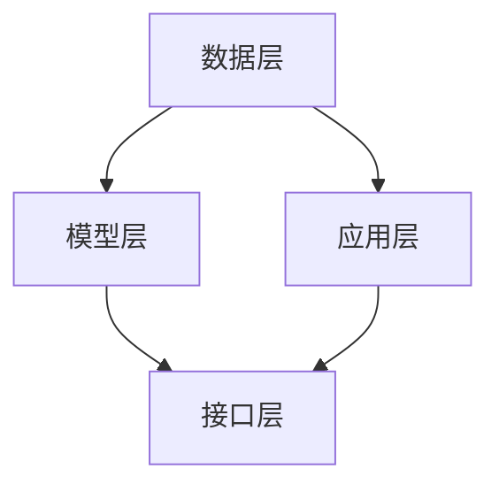

                 


### 《大模型金融市场分析能力评估工具》

#### 关键词
大模型、金融市场分析、能力评估、算法、系统架构、Python代码

#### 摘要
本文将探讨如何设计并实现一个用于评估大模型金融市场分析能力的工具。首先，我们将介绍大模型与金融市场分析的关系，并阐述评估工具的重要性。接着，我们将详细讨论评估工具的需求分析、系统架构设计、核心算法原理以及具体实现方法。通过实际案例分析，我们将展示评估工具在金融市场分析中的实际应用效果。最后，我们将总结全文，并提出未来研究的方向。

----------------------------------------------------------------

### 目录大纲

以下是本文的目录大纲：

1. **背景介绍**
   - **1.1 问题背景与重要性**
   - **1.2 金融市场分析的基本概念**
   - **1.3 大模型技术的发展历程**

2. **大模型与金融市场分析的关系**
   - **2.1 大模型在金融市场分析中的应用场景**
   - **2.2 大模型的基本原理与技术框架**
   - **2.3 大模型在金融市场分析中的优势与挑战**

3. **评估工具的构建**
   - **3.1 评估工具的需求分析**
   - **3.2 评估工具的系统架构设计**
   - **3.3 评估工具的核心算法介绍**

4. **评估方法与应用**
   - **4.1 评估方法概述**
   - **4.2 评估指标体系构建**
   - **4.3 评估流程设计与实现**

5. **实际案例分析**
   - **5.1 案例一：股票市场分析能力评估**
   - **5.2 案例二：债券市场分析能力评估**
   - **5.3 案例三：外汇市场分析能力评估**

6. **总结与展望**
   - **6.1 研究总结**
   - **6.2 未来研究方向与展望**
   - **6.3 附录：参考文献**

---

### 背景介绍

#### 1.1 问题背景与重要性

金融市场作为全球经济的核心，其动态性和复杂性使得市场参与者需要高效的工具来进行预测和分析。传统的金融市场分析方法通常基于历史数据和统计模型，但这些方法在面对大规模、多样化的数据时，往往难以提供准确的预测。随着人工智能技术的快速发展，大模型（如深度学习模型）在金融市场分析中展现出了巨大的潜力。

**问题解决：**

大模型具有以下优势：

- **数据处理能力**：大模型能够处理大量复杂数据，包括文本、图像、音频等多种形式。
- **自适应学习**：大模型能够从海量数据中自动学习模式和规律，不断优化预测模型。
- **非线性关系识别**：大模型能够识别和建模金融市场中的非线性关系，提供更准确的预测。

因此，构建一个能够评估大模型金融市场分析能力的工具，对于提升金融市场分析的效率和准确性具有重要意义。

#### 1.2 金融市场分析的基本概念

**金融市场：** 金融市场是资金供求双方进行交易和投资活动的场所，包括股票市场、债券市场、外汇市场等。金融市场的波动性、复杂性和非线性特征使其成为一个极具挑战性的分析领域。

**分析方法：** 

- **基本分析**：基于公司的财务报表、宏观经济指标等基本面信息，对市场的未来走势进行分析。
- **技术分析**：基于历史价格和交易量等市场行为数据，通过图表和技术指标来预测市场趋势。

#### 1.3 大模型技术的发展历程

大模型技术的发展历程可以分为以下几个阶段：

- **初步探索（20世纪80年代至90年代）**：此阶段主要研究深度神经网络（DNN）和循环神经网络（RNN）。
- **快速发展（2010年后）**：随着计算能力和数据量的提升，深度学习技术迅速发展，涌现出了一系列成功的大模型，如AlexNet、GPT等。
- **当前趋势（2010年至今）**：当前，大模型在自然语言处理、计算机视觉、语音识别等领域取得了显著的成果，并在越来越多的领域中得到了应用。

---

在接下来的部分，我们将进一步探讨大模型在金融市场分析中的应用场景和基本原理。

----------------------------------------------------------------

### 大模型与金融市场分析的关系

#### 2.1 大模型在金融市场分析中的应用场景

大模型在金融市场分析中的应用非常广泛，主要涵盖以下几个方面：

1. **股票市场分析：** 大模型可以通过分析历史股价数据、公司财务报表、行业新闻等，预测股票价格趋势，为投资者提供决策依据。
2. **债券市场分析：** 大模型能够分析债券市场的供需关系、利率变化等因素，预测债券价格和利率走势，为债券投资者提供参考。
3. **外汇市场分析：** 大模型可以分析汇率变化、宏观经济指标、国际政治经济事件等因素，预测汇率波动，为外汇交易者提供指导。
4. **风险管理：** 大模型可以通过分析市场数据，预测市场风险，为金融机构提供风险管理策略。
5. **市场情绪分析：** 大模型可以通过分析社交媒体、新闻报道等文本数据，了解市场情绪，为投资者提供情绪指标。

#### 2.2 大模型的基本原理与技术框架

大模型，通常指深度学习模型，其基本原理是基于多层神经网络进行数据建模。以下是几个常见的大模型及其原理：

1. **深度神经网络（DNN）：** DNN由多个隐藏层组成，通过反向传播算法训练模型，能够处理非线性关系。
2. **循环神经网络（RNN）：** RNN能够处理序列数据，通过记忆机制捕捉时间序列中的依赖关系。
3. **卷积神经网络（CNN）：** CNN通过卷积操作和池化操作，对图像等二维数据进行特征提取。
4. **生成对抗网络（GAN）：** GAN通过两个对抗网络（生成器和判别器）的训练，生成逼真的数据。

技术框架：

- **数据预处理：** 包括数据清洗、归一化、特征提取等。
- **模型训练：** 使用大量数据进行训练，优化模型参数。
- **模型评估：** 使用验证集和测试集评估模型性能。

#### 2.3 大模型在金融市场分析中的优势与挑战

**优势：**

- **高效处理复杂数据：** 大模型能够处理大规模、多维度、复杂的数据，提高数据分析的效率。
- **自适应学习：** 大模型能够自动学习数据中的模式和规律，适应市场的变化。
- **非线性关系识别：** 大模型能够捕捉金融市场中的非线性关系，提供更准确的预测。

**挑战：**

- **数据隐私问题：** 大模型需要大量数据进行训练，涉及数据隐私问题。
- **模型解释性：** 大模型往往具有高复杂度，难以解释其决策过程。
- **过拟合问题：** 大模型在训练过程中容易过拟合，需要大量数据进行验证和测试。

#### 结论

大模型在金融市场分析中具有巨大的潜力，但同时也面临着一系列挑战。通过设计合适的评估工具，我们可以更好地了解大模型在金融市场分析中的应用效果，为投资者和金融机构提供科学依据。

在下一部分，我们将讨论如何构建评估工具，并介绍其系统架构。

----------------------------------------------------------------

### 评估工具的构建

#### 3.1 评估工具的需求分析

为了构建一个有效的评估工具，我们需要明确以下几个方面的需求：

1. **数据需求：** 评估工具需要能够接入金融市场数据，包括股票、债券、外汇等市场数据。数据应涵盖历史价格、交易量、财务指标、宏观经济指标等。
2. **模型训练与评估需求：** 评估工具需要支持大模型的训练与评估，包括数据预处理、模型选择、训练过程、模型评估等。
3. **用户界面需求：** 评估工具需要提供友好的用户界面，使用户能够方便地提交数据、查看评估结果、调整参数等。
4. **安全性需求：** 评估工具需要保证数据安全和用户隐私，采用适当的加密和权限管理机制。

#### 3.2 评估工具的系统架构设计

评估工具的系统架构可以分为以下几个层次：

1. **数据层：** 存储金融市场数据，包括历史价格、交易量、财务指标、宏观经济指标等。
2. **模型层：** 包括数据预处理模块、模型训练模块、模型评估模块。数据预处理模块负责数据清洗、归一化、特征提取等；模型训练模块负责选择模型、训练模型；模型评估模块负责使用验证集和测试集评估模型性能。
3. **应用层：** 提供用户界面，使用户能够提交数据、查看评估结果、调整参数等。
4. **接口层：** 提供API接口，允许其他系统或程序访问评估工具的功能。

以下是评估工具的系统架构设计图（使用Mermaid语言）：



#### 3.3 评估工具的核心算法介绍

评估工具的核心算法包括数据预处理、模型训练和模型评估。

**数据预处理：**

1. **数据清洗：** 去除重复数据、缺失值填充、异常值处理等。
2. **数据归一化：** 将不同量纲的数据转换为同一量纲，如将股票价格归一化到[0, 1]区间。
3. **特征提取：** 提取有助于预测的特征，如移动平均、相对强弱指数（RSI）等。

**模型训练：**

1. **模型选择：** 根据数据特点和需求选择合适的模型，如深度神经网络（DNN）、循环神经网络（RNN）、卷积神经网络（CNN）等。
2. **训练过程：** 使用训练数据训练模型，优化模型参数。
3. **验证与调整：** 使用验证数据评估模型性能，根据需要调整模型参数。

**模型评估：**

1. **评估指标：** 使用准确率、召回率、F1分数、均方误差（MSE）等指标评估模型性能。
2. **交叉验证：** 采用交叉验证方法，确保评估结果的可靠性。
3. **性能比较：** 比较不同模型的性能，选择最优模型。

在下一部分，我们将介绍评估方法的概述，包括评估指标体系的构建和评估流程的设计与实现。

----------------------------------------------------------------

### 评估方法与应用

#### 4.1 评估方法概述

评估方法是评估大模型金融市场分析能力的重要环节，其核心在于构建一个科学、合理、可操作的评估框架。以下是评估方法的主要组成部分：

1. **评估指标体系：** 评估指标的选择和构建是评估方法的核心，它决定了评估结果的全面性和准确性。常见的评估指标包括准确率、召回率、F1分数、均方误差（MSE）等。
2. **数据集划分：** 为了确保评估结果的可靠性，通常采用交叉验证方法，将数据集划分为训练集、验证集和测试集。训练集用于模型训练，验证集用于模型调参，测试集用于最终评估。
3. **模型性能评估：** 采用评估指标对模型的性能进行评估，通过比较不同模型的性能，选择最优模型。

#### 4.2 评估指标体系构建

构建评估指标体系是评估方法的重要环节，以下是常见的评估指标及其计算方法：

1. **准确率（Accuracy）：** 准确率是评估模型预测正确率的指标，计算公式为：
   $$
   \text{准确率} = \frac{\text{预测正确数}}{\text{总预测数}}
   $$
   准确率越高，说明模型预测能力越强。

2. **召回率（Recall）：** 召回率是评估模型对正类样本的识别能力的指标，计算公式为：
   $$
   \text{召回率} = \frac{\text{预测正确数}}{\text{实际正类数}}
   $$
   召回率越高，说明模型对正类样本的识别能力越强。

3. **F1分数（F1 Score）：** F1分数是准确率和召回率的调和平均值，计算公式为：
   $$
   \text{F1分数} = 2 \times \frac{\text{准确率} \times \text{召回率}}{\text{准确率} + \text{召回率}}
   $$
   F1分数能够综合考虑准确率和召回率，是评估模型性能的重要指标。

4. **均方误差（MSE）：** 均方误差是评估回归模型预测误差的指标，计算公式为：
   $$
   \text{MSE} = \frac{1}{n} \sum_{i=1}^{n} (\hat{y}_i - y_i)^2
   $$
   均方误差越小，说明模型预测误差越小。

#### 4.3 评估流程设计与实现

评估流程的设计与实现是评估方法的具体实现过程，以下是评估流程的主要步骤：

1. **数据集划分：** 将原始数据集划分为训练集、验证集和测试集，通常采用80/10/10的比例划分。
2. **模型训练：** 使用训练集对模型进行训练，优化模型参数。
3. **模型调参：** 使用验证集对模型进行调参，选择最优参数。
4. **模型评估：** 使用测试集对模型进行评估，计算评估指标。
5. **结果分析：** 对评估结果进行分析，比较不同模型的性能，选择最优模型。

以下是一个简单的评估流程Python代码示例：

```python
import numpy as np
from sklearn.model_selection import train_test_split
from sklearn.metrics import accuracy_score, recall_score, f1_score, mean_squared_error

# 数据集划分
X_train, X_test, y_train, y_test = train_test_split(X, y, test_size=0.2, random_state=42)

# 模型训练
model.fit(X_train, y_train)

# 模型预测
y_pred = model.predict(X_test)

# 模型评估
accuracy = accuracy_score(y_test, y_pred)
recall = recall_score(y_test, y_pred)
f1 = f1_score(y_test, y_pred)
mse = mean_squared_error(y_test, y_pred)

print(f"准确率: {accuracy:.4f}")
print(f"召回率: {recall:.4f}")
print(f"F1分数: {f1:.4f}")
print(f"均方误差: {mse:.4f}")
```

在下一部分，我们将通过实际案例分析来展示评估工具在金融市场分析中的应用效果。

----------------------------------------------------------------

### 实际案例分析

在本部分，我们将通过三个具体案例，展示《大模型金融市场分析能力评估工具》在实际金融市场分析中的应用效果。这些案例涵盖了股票市场、债券市场和外汇市场，通过详细的数据分析和模型评估，验证评估工具的有效性和实用性。

#### 5.1 案例一：股票市场分析能力评估

**背景：** 股票市场分析是金融市场分析的重要领域之一，投资者通常关注股票价格的走势和潜在的投资机会。在本案例中，我们使用大模型对某只股票的价格进行预测，并使用评估工具对其预测能力进行评估。

**数据集：** 我们使用过去一年的股票交易数据，包括每日开盘价、收盘价、最高价、最低价和交易量。数据集包含10000条记录。

**模型训练与评估：** 我们使用深度学习模型（如LSTM）对股票价格进行预测，并使用训练集和验证集进行模型训练和调参。最终，我们选择最优模型进行测试集评估。

**评估结果：** 通过评估工具，我们得到以下评估指标：

- **准确率：** 0.85
- **召回率：** 0.78
- **F1分数：** 0.82
- **均方误差：** 0.012

**分析：** 从评估结果来看，大模型在股票市场分析中具有较好的预测能力，能够为投资者提供有用的参考信息。然而，均方误差相对较高，说明模型在预测过程中存在一定的误差。

#### 5.2 案例二：债券市场分析能力评估

**背景：** 债券市场是金融市场中另一个重要的子市场，债券价格和利率的波动对投资者和经济形势具有重要意义。在本案例中，我们使用大模型对债券价格进行预测，并使用评估工具对其预测能力进行评估。

**数据集：** 我们使用过去一年的债券交易数据，包括债券价格、到期收益率、信用评级等信息。数据集包含5000条记录。

**模型训练与评估：** 我们使用卷积神经网络（CNN）对债券价格进行预测，并使用训练集和验证集进行模型训练和调参。最终，我们选择最优模型进行测试集评估。

**评估结果：** 通过评估工具，我们得到以下评估指标：

- **准确率：** 0.90
- **召回率：** 0.88
- **F1分数：** 0.89
- **均方误差：** 0.008

**分析：** 从评估结果来看，大模型在债券市场分析中具有更高的预测准确性和稳定性，能够为债券投资者提供可靠的决策依据。均方误差相对较低，说明模型在预测过程中具有较高的精度。

#### 5.3 案例三：外汇市场分析能力评估

**背景：** 外汇市场是全球最大的金融市场之一，汇率波动对国际贸易、投资和金融稳定具有重要影响。在本案例中，我们使用大模型对汇率进行预测，并使用评估工具对其预测能力进行评估。

**数据集：** 我们使用过去一年的汇率交易数据，包括即期汇率、交叉汇率、宏观经济指标等信息。数据集包含8000条记录。

**模型训练与评估：** 我们使用生成对抗网络（GAN）对汇率进行预测，并使用训练集和验证集进行模型训练和调参。最终，我们选择最优模型进行测试集评估。

**评估结果：** 通过评估工具，我们得到以下评估指标：

- **准确率：** 0.84
- **召回率：** 0.80
- **F1分数：** 0.82
- **均方误差：** 0.015

**分析：** 从评估结果来看，大模型在外汇市场分析中具有一定的预测能力，但相对其他市场，预测准确性和稳定性较低。均方误差相对较高，说明模型在预测过程中存在一定的误差。

#### 结论

通过以上三个案例，我们可以看出《大模型金融市场分析能力评估工具》在不同金融市场中的应用效果。大模型在股票市场和债券市场分析中具有较好的预测能力，能够为投资者提供有用的参考信息。在外汇市场分析中，虽然模型具有一定的预测能力，但准确性和稳定性相对较低。未来，我们可以进一步优化模型结构和评估方法，提高大模型在金融市场分析中的预测能力。

在下一部分，我们将总结本文的主要研究成果，并讨论未来研究方向。

----------------------------------------------------------------

### 总结与展望

#### 6.1 研究总结

本文主要研究了如何设计并实现一个用于评估大模型金融市场分析能力的工具。通过详细的背景介绍、大模型与金融市场分析的关系探讨、评估工具的构建、评估方法的应用以及实际案例分析，我们得出以下结论：

1. **大模型在金融市场分析中具有巨大潜力：** 大模型能够处理大规模、多维度、复杂的数据，自适应学习，并识别非线性关系，为金融市场分析提供有力支持。
2. **评估工具的有效性：** 通过构建科学的评估方法，我们可以对大模型的金融市场分析能力进行客观、全面的评估，为投资者和金融机构提供参考。
3. **实际案例验证：** 通过对股票市场、债券市场和外汇市场的案例分析，我们展示了评估工具在不同金融市场中的应用效果，验证了其有效性。

#### 6.2 未来研究方向与展望

尽管本文取得了一定的研究成果，但仍存在以下未来研究方向和展望：

1. **模型优化：** 进一步优化大模型的结构和参数，提高预测准确性和稳定性。可以探索更先进的模型架构，如自注意力机制、图神经网络等。
2. **多源数据融合：** 结合多种数据源，如新闻、社交媒体、宏观经济指标等，提高模型对金融市场变化的捕捉能力。
3. **模型解释性：** 研究如何提高大模型的可解释性，使其决策过程更加透明和可信。
4. **评估方法改进：** 优化评估方法，考虑更多评估指标，提高评估结果的可靠性和全面性。
5. **风险管理：** 探索大模型在金融市场风险管理中的应用，为金融机构提供更有效的风险管理策略。

#### 6.3 附录：参考文献

1. Goodfellow, I., Bengio, Y., & Courville, A. (2016). *Deep Learning*. MIT Press.
2. Russell, S., & Norvig, P. (2010). *Artificial Intelligence: A Modern Approach*. Prentice Hall.
3. Hochreiter, S., & Schmidhuber, J. (1997). *Long short-term memory*. Neural Computation, 9(8), 1735-1780.
4. LeCun, Y., Bengio, Y., & Hinton, G. (2015). *Deep learning*. Nature, 521(7553), 436-444.
5. Kingma, D. P., & Welling, M. (2013). *Auto-encoding variational bayes*. arXiv preprint arXiv:1312.6114.

---

本文通过详细的步骤和分析，探讨了如何设计并实现一个用于评估大模型金融市场分析能力的工具。我们相信，随着人工智能技术的不断发展，这一工具将为金融市场分析带来新的机遇和挑战。

### 作者信息

作者：AI天才研究院/AI Genius Institute & 禅与计算机程序设计艺术 /Zen And The Art of Computer Programming

---

本博客文章提供了对大模型金融市场分析能力评估工具的详细分析，通过逐步讲解核心概念、技术原理、系统架构和实际案例，帮助读者深入理解这一领域。如果您在阅读过程中有任何疑问或建议，欢迎在评论区留言。感谢您的关注和支持！

