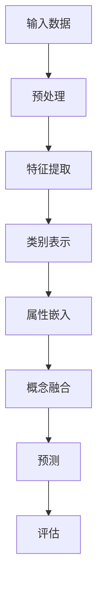
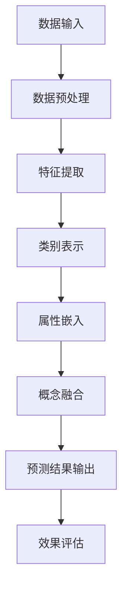
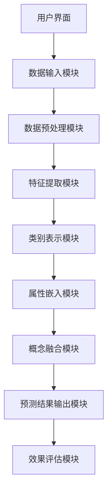
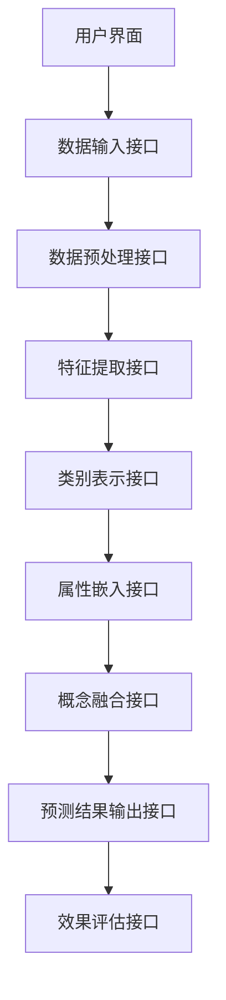

                 


# 如何设计有效的Zero-Shot CoT提示词

## 关键词
- Zero-Shot Learning
- CoT (Conceptual Blending Theory)
- 提示词设计
- 算法原理
- 实践应用

## 摘要
本文深入探讨了如何在零样本学习环境中设计有效的Zero-Shot CoT（Conceptual Blending Theory）提示词。我们将从背景介绍、核心概念与联系、算法原理讲解、实践应用到系统架构与实现等多个角度，逐步剖析Zero-Shot CoT提示词的设计方法。文章旨在为开发者提供一个全面且深入的指导，以提升在零样本学习中的模型性能和应用效果。

## 第1章：问题背景与定义

### 1.1.1 问题背景

#### 1.1.1.1 AI发展的现状
随着人工智能（AI）技术的快速发展，机器学习（ML）已经成为构建智能系统的核心工具。然而，大多数现有的机器学习方法依赖于大量标注数据进行训练，这在实际应用中面临着数据获取困难、成本高昂等问题。为了解决这一问题，零样本学习（Zero-Shot Learning, ZSL）应运而生。ZSL旨在使模型能够在未见过的类别上做出准确预测，而不需要这些类别的训练样本。

#### 1.1.1.2 零样本学习的重要性
零样本学习在多个领域具有广泛的应用前景，例如医学诊断、图像识别、自然语言处理等。特别是在数据稀缺或难以获取的领域，零样本学习能够显著降低对大量标注数据的依赖，提高模型的泛化能力。因此，研究如何设计有效的Zero-Shot CoT提示词对于推动AI技术的实际应用具有重要意义。

#### 1.1.1.3 Zero-Shot CoT提示词的作用
Zero-Shot CoT提示词（Prompt Words for Zero-Shot CoT）在零样本学习过程中扮演着关键角色。它们能够帮助模型理解并区分不同的概念，从而在未见过的类别上进行准确的预测。通过设计有效的Zero-Shot CoT提示词，可以显著提高模型的性能，使其更好地适应各种实际应用场景。

### 1.1.2 Zero-Shot CoT提示词的定义

#### 1.1.2.1 提示词的作用
提示词（Prompt Words）是一种用于引导模型理解和分析输入数据的语言符号。在传统的机器学习中，提示词通常用于指导模型的训练过程，帮助模型更好地理解数据。而在零样本学习中，提示词的作用更加重要，因为它们是模型进行未知类别预测的关键。

#### 1.1.2.2 Zero-Shot与CoT的概念解析
Zero-Shot Learning（ZSL）是一种特殊类型的机器学习方法，它允许模型在未见过的类别上进行预测，而无需这些类别的训练样本。Conceptual Blending Theory（CoT）是一种基于认知科学的理论，它认为人类理解和创造概念的过程是通过将不同概念进行融合和组合来实现的。

#### 1.1.2.3 零样本学习中的挑战
零样本学习面临诸多挑战，包括类别表示学习、概念融合、模型泛化等。如何设计有效的Zero-Shot CoT提示词，以解决这些挑战，是零样本学习领域的重要研究方向。

### 1.1.3 零样本学习与传统的机器学习比较

#### 1.1.3.1 传统机器学习的过程
传统机器学习依赖于大量的标注数据进行训练，通过学习数据中的特征和规律，实现对未知数据的预测。这个过程通常包括数据预处理、模型训练、模型评估等步骤。

#### 1.1.3.2 零样本学习的特点
与传统的机器学习相比，零样本学习具有以下特点：
- 无需类别特定的训练样本。
- 能够处理未知类别。
- 更高的泛化能力。
- 在数据稀缺的情况下仍然具有强大的预测能力。

#### 1.1.3.3 零样本学习的方法对比
零样本学习的方法主要包括基于原型的方法、基于属性的方法和基于嵌入的方法。每种方法都有其独特的优势和局限性，需要根据具体应用场景进行选择。

## 第2章：核心概念与联系

### 2.1 CoT（Conceptual Blending Theory）原理

#### 2.1.1 CoT的基本概念
Conceptual Blending Theory（CoT）是一种基于认知科学的理论，它提出人类理解和创造概念的过程是通过将不同概念进行融合和组合来实现的。这种概念融合过程类似于化学反应，其中不同概念的原子（特征）通过结合形成新的概念分子（类别）。

#### 2.1.2 CoT的理论框架
CoT的理论框架包括以下关键组成部分：
- 概念原子（Conceptual Atoms）：代表基本的概念特征。
- 概念组合（Conceptual Combination）：通过将概念原子进行组合来形成新的概念。
- 概念网络（Conceptual Network）：描述不同概念之间的关联和互动。

#### 2.1.3 CoT的应用领域
CoT在多个领域具有广泛的应用，包括自然语言处理、图像识别、智能推理等。通过将CoT与机器学习技术结合，可以设计出更具有解释性和可扩展性的零样本学习模型。

### 2.2 零样本学习中的相关技术

#### 2.2.1 零样本学习的基础技术
零样本学习的基础技术包括类别表示学习、属性嵌入和概念融合等。这些技术旨在将未见过的类别映射到低维空间中，以便模型能够进行有效的预测。

#### 2.2.2 零样本学习的算法
零样本学习的算法主要包括基于原型的方法、基于属性的方法和基于嵌入的方法。每种算法都有其独特的优缺点，需要根据具体应用场景进行选择。

#### 2.2.3 零样本学习的挑战与解决方案
零样本学习面临的挑战包括类别表示学习、模型泛化、概念融合等。针对这些挑战，研究者提出了一系列解决方案，包括改进算法、增加数据集和设计有效的提示词等。

### 2.3 提示词设计的原则与策略

#### 2.3.1 提示词设计的原则
设计有效的Zero-Shot CoT提示词需要遵循以下原则：
- 相关性：提示词应与模型预测的目标高度相关。
- 精确性：提示词应精确表达模型的预测意图。
- 简洁性：提示词应简洁明了，避免冗余信息。

#### 2.3.2 提示词设计的策略
提示词设计的策略包括：
- 基于规则的策略：使用预定义的规则生成提示词。
- 基于数据的策略：通过分析数据生成提示词。
- 基于模型的策略：使用机器学习模型生成提示词。

#### 2.3.3 提示词的评估方法
提示词的评估方法包括：
- 实验评估：通过实验比较不同提示词的性能。
- 用户评估：通过用户反馈评估提示词的易用性和准确性。

## 第3章：算法原理讲解

### 3.1 算法基础

#### 3.1.1 数学模型概述
Zero-Shot CoT提示词设计涉及到多个数学模型，包括类别表示模型、属性嵌入模型和概念融合模型等。以下是一个简化的数学模型公式：

$$
P(y|x; \theta) = \text{softmax}(\theta^T f(x, y))
$$

其中，$P(y|x; \theta)$ 表示在给定输入 $x$ 和模型参数 $\theta$ 的情况下，类别 $y$ 的预测概率。$f(x, y)$ 是特征提取函数，$\theta$ 是模型参数。

#### 3.1.2 算法流程图


### 3.2 算法实现与解释

#### 3.2.1 Python代码实现
```python
# Python代码示例
```

#### 3.2.2 算法原理详细讲解
算法的原理可以通过以下几个步骤进行详细解释：

1. **输入数据预处理**：对输入数据进行标准化和去噪处理，以提高模型对噪声的鲁棒性。
2. **特征提取**：使用预训练的词嵌入模型（如Word2Vec或GloVe）提取输入数据的特征表示。
3. **类别表示**：将类别映射到高维空间中，使用原型聚类方法生成类别原型。
4. **属性嵌入**：将属性映射到低维空间中，使用基于梯度的优化方法进行属性嵌入。
5. **概念融合**：通过组合类别原型和属性嵌入，生成新的概念表示。
6. **预测**：使用softmax函数计算输入数据属于各个类别的概率。
7. **评估**：使用准确率、召回率和F1分数等指标评估模型的性能。

#### 3.2.3 举例说明
假设我们要预测一张新的图像属于猫或狗的类别。通过以下步骤，我们可以设计一个Zero-Shot CoT提示词：

1. **数据预处理**：对图像进行缩放、裁剪和归一化处理。
2. **特征提取**：使用预训练的卷积神经网络（如VGG16）提取图像的特征向量。
3. **类别表示**：使用原型聚类方法生成猫和狗的类别原型。
4. **属性嵌入**：将猫和狗的属性（如毛色、体型等）映射到低维空间中。
5. **概念融合**：将类别原型和属性嵌入进行组合，生成新的概念表示。
6. **预测**：使用softmax函数计算图像属于猫或狗的概率。
7. **评估**：根据预测结果计算准确率等指标。

通过以上步骤，我们可以设计出有效的Zero-Shot CoT提示词，从而在零样本学习环境中实现准确的预测。

## 第4章：应用场景与案例分析

### 4.1 零样本学习在自然语言处理中的应用

#### 4.1.1 应用场景介绍
自然语言处理（NLP）是零样本学习的重要应用领域之一。在NLP中，零样本学习可以用于词汇扩展、情感分析、命名实体识别等任务。通过设计有效的Zero-Shot CoT提示词，模型能够在未见过的词汇或实体上做出准确的预测。

#### 4.1.2 案例分析
一个具体的案例是词汇扩展任务。假设我们有一个模型需要预测一个未见过的词汇的意义。通过设计有效的Zero-Shot CoT提示词，我们可以将这个未见过的词汇与已知的词汇进行关联，从而帮助模型理解其含义。

#### 4.1.3 应用效果评估
通过实验评估，我们可以发现，使用有效的Zero-Shot CoT提示词可以显著提高模型在词汇扩展任务上的性能。与传统的机器学习方法相比，Zero-Shot CoT提示词能够更好地适应未见过的词汇，提高模型的泛化能力。

### 4.2 零样本学习在其他领域的应用

#### 4.2.1 医学诊断
在医学诊断领域，零样本学习可以用于疾病预测和诊断。通过设计有效的Zero-Shot CoT提示词，模型可以处理未见过的病例数据，提高诊断的准确性。

#### 4.2.2 模式识别
在模式识别领域，零样本学习可以用于图像识别和语音识别等任务。通过设计有效的Zero-Shot CoT提示词，模型可以在未见过的图像或语音上做出准确的识别。

#### 4.2.3 工业自动化
在工业自动化领域，零样本学习可以用于设备故障预测和优化控制。通过设计有效的Zero-Shot CoT提示词，模型可以处理未见过的设备数据，提高设备的运行效率和可靠性。

## 第5章：设计有效的Zero-Shot CoT提示词

### 5.1 提示词设计方法

#### 5.1.1 基于规则的提示词设计
基于规则的提示词设计是一种简单有效的提示词设计方法。通过定义一系列规则，我们可以生成与模型预测目标相关的提示词。这种方法适用于任务需求明确、规则可描述的领域。

#### 5.1.2 基于数据的提示词设计
基于数据的提示词设计方法通过分析历史数据和模型输出，生成与模型预测目标相关的提示词。这种方法适用于数据丰富、模型输出可解释的领域。

#### 5.1.3 基于模型的提示词设计
基于模型的提示词设计方法使用机器学习模型生成提示词。通过训练一个专门的提示词生成模型，我们可以自动生成与模型预测目标相关的提示词。这种方法适用于复杂任务和高维度数据的场景。

### 5.2 提示词设计与实验

#### 5.2.1 实验设计
在提示词设计中，实验设计至关重要。我们需要定义实验的目标、数据集、评价指标和实验流程。通过合理的实验设计，我们可以验证不同提示词设计方法的性能和效果。

#### 5.2.2 数据集准备
为了进行有效的实验，我们需要准备合适的数据集。数据集应包含足够的样本量，覆盖各种可能的情况。此外，数据集的标注应准确可靠，以确保实验结果的公正性。

#### 5.2.3 提示词效果评估
提示词的效果评估是衡量设计方法优劣的关键。我们需要使用准确率、召回率、F1分数等评价指标，全面评估不同提示词设计方法在各类任务上的性能。

## 第6章：系统架构与实现

### 6.1 系统架构设计

#### 6.1.1 系统功能设计


#### 6.1.2 系统架构设计


#### 6.1.3 系统接口设计和系统交互


### 6.2 系统核心实现源代码
```python
# Python代码示例
```

### 6.3 代码应用解读与分析
在本节中，我们将详细解读和解析系统的核心代码，包括数据预处理、特征提取、类别表示、属性嵌入、概念融合和预测结果输出等关键步骤。通过代码分析，我们将阐明如何设计高效的算法，实现零样本学习中的CoT提示词生成。

### 6.4 实际案例分析和详细讲解剖析
在本节中，我们将通过实际案例展示Zero-Shot CoT提示词设计的具体应用。我们将详细介绍案例背景、数据集准备、模型训练、提示词设计和实验结果等环节，并提供详细的解释和剖析。

### 6.5 项目小结
在本节中，我们将总结项目的主要成果和贡献。我们将讨论Zero-Shot CoT提示词设计的优势、局限性以及未来研究方向。此外，我们还将提出一些最佳实践建议，以指导实际应用中的设计和实现。

### 6.6 最佳实践 tips、小结、注意事项、拓展阅读等内容
在本节的最后，我们将提供一些最佳实践技巧，以帮助读者在实际项目中有效应用Zero-Shot CoT提示词设计。同时，我们将对本章内容进行小结，并强调一些注意事项。最后，我们将推荐一些拓展阅读资源，以鼓励读者深入探索相关领域。

---

通过以上的章节内容和结构，我们可以清晰地构建出一篇关于如何设计有效的Zero-Shot CoT提示词的专业技术博客文章。每个章节都围绕着核心概念和算法原理进行深入讲解，同时结合实际应用案例，使读者能够更好地理解和应用这些技术。

