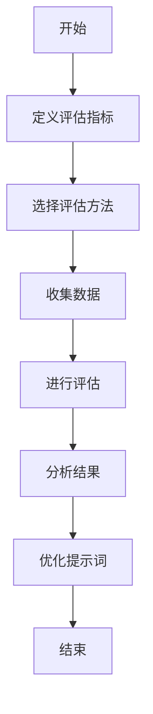
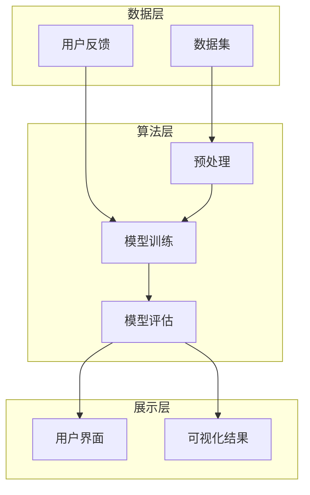
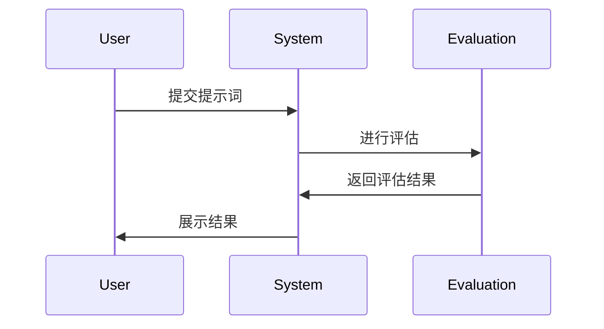

                 


# 如何评估ChatGPT提示词的有效性

## 关键词
- ChatGPT
- 提示词
- 评估方法
- 有效性
- 实践技巧

## 摘要
本文将深入探讨如何评估ChatGPT提示词的有效性。首先，我们将介绍ChatGPT及其提示词的基本概念，然后详细分析评估提示词有效性的核心指标。接着，本文将介绍评估方法，包括实验设计、对比实验、用户反馈和自动化评估工具。在评估实践部分，我们将通过具体案例展示如何在不同应用场景下进行提示词评估。此外，本文还将讨论提高提示词有效性的策略和技巧，分析当前评估面临的挑战，并展望未来的趋势。最后，本文将总结主要内容，并提供一些注意事项和拓展阅读资源。

### 目录大纲设计

#### 第一部分：背景介绍
- **第1章：问题背景**
  - **1.1 ChatGPT与提示词概述**
  - **1.2 提示词有效性评估的重要性**
  - **1.3 本书目标与结构**

- **第2章：核心概念**
  - **2.1 ChatGPT模型简介**
  - **2.2 提示词的定义与类型**
  - **2.3 提示词有效性的指标**

#### 第二部分：评估方法
- **第3章：评估方法**
  - **3.1 实验设计基础**
  - **3.2 对比实验方法**
  - **3.3 用户反馈评估**
  - **3.4 自动化评估工具**

#### 第三部分：评估实践
- **第4章：评估实践**
  - **4.1 提示词编写技巧**
  - **4.2 实际案例1：情感分析**
  - **4.3 实际案例2：问答系统**
  - **4.4 实际案例3：代码生成**

#### 第四部分：评估技巧与策略
- **第5章：评估技巧与策略**
  - **5.1 提高提示词有效性的策略**
  - **5.2 处理复杂问题的技巧**
  - **5.3 跨语言与跨领域的评估方法**

#### 第五部分：挑战与未来趋势
- **第6章：挑战与未来趋势**
  - **6.1 当前评估面临的挑战**
  - **6.2 提示词评估的未来趋势**
  - **6.3 技术创新与伦理考量**

#### 第六部分：总结与展望
- **第7章：总结与展望**
  - **7.1 总结**
  - **7.2 注意事项**
  - **7.3 拓展阅读**

### 第一部分：背景介绍

#### 第1章：问题背景

**1.1 ChatGPT与提示词概述**

ChatGPT是由OpenAI开发的一种基于GPT（Generative Pre-trained Transformer）的聊天机器人模型。它使用大量文本数据进行预训练，从而能够生成流畅、连贯的自然语言文本。ChatGPT的出现极大地改变了自然语言处理（NLP）领域，使机器能够与人类进行更自然的对话。

提示词（Prompt）是指用于引导模型生成特定类型文本的输入文本。一个有效的提示词能够明确指导ChatGPT生成所需的内容，从而提高其输出文本的质量。

**1.2 提示词有效性评估的重要性**

评估提示词的有效性对于优化ChatGPT的性能至关重要。一个有效的提示词可以：
- 提高生成文本的相关性。
- 提升文本的质量和流畅度。
- 减少生成文本中的错误和偏差。

有效的提示词评估不仅可以提升模型的性能，还可以节省开发和维护成本。因此，研究如何评估提示词的有效性具有重要的实际意义。

**1.3 本书目标与结构**

本书的目标是提供一套系统的方法，帮助读者评估ChatGPT提示词的有效性。本书分为六个部分，从背景介绍到实际评估方法，再到未来趋势和挑战，旨在为读者提供一个全面的指南。

### 第二部分：核心概念

#### 第2章：核心概念

**2.1 ChatGPT模型简介**

ChatGPT是基于GPT-3.5模型构建的，它使用了Transformer架构，这是一种在NLP任务中表现非常出色的深度学习模型。GPT-3.5模型通过大量的文本数据进行预训练，从而学习到语言的复杂结构。

**2.2 提示词的定义与类型**

提示词是指用于引导ChatGPT生成特定类型文本的输入文本。根据用途和结构，提示词可以分为以下几类：

- **问题型提示词**：用于生成问题的文本，如“你能帮我解释一下量子计算是什么吗？”
- **描述型提示词**：用于生成描述性文本，如“请描述一下人工智能的历史。”
- **命令型提示词**：用于生成执行特定任务的文本，如“编写一个简单的Python程序，实现冒泡排序。”

**2.3 提示词有效性的指标**

评估提示词有效性的指标可以从多个维度进行考虑，主要包括：

- **相关性**：提示词生成的文本是否与预期目标相关。
- **流畅度**：文本是否通顺，语法是否正确。
- **准确性**：生成的文本是否准确反映了事实或信息。
- **创新性**：文本是否具有独特性和创造性。

这些指标可以帮助我们全面评估提示词的有效性，从而优化模型的输出质量。

### 第三部分：评估方法

#### 第3章：评估方法

**3.1 实验设计基础**

实验设计是评估提示词有效性的一种基本方法。在进行实验设计时，我们需要考虑以下几个方面：

- **实验目标**：明确我们要评估的是哪个方面的提示词有效性。
- **实验变量**：确定我们要测试的提示词。
- **实验样本**：选择适当的文本数据集，用于训练和评估模型。
- **评估指标**：定义我们要使用的有效性指标。

通过合理的实验设计，我们可以更准确地评估提示词的有效性。

**3.2 对比实验方法**

对比实验方法是通过比较不同提示词的效果来评估其有效性。具体步骤如下：

- **选择对照组和实验组**：对照组使用默认提示词，实验组使用待评估的提示词。
- **训练和评估模型**：在相同的实验条件下，训练和评估两个模型的性能。
- **对比结果**：比较两组模型在评估指标上的差异，判断提示词的有效性。

**3.3 用户反馈评估**

用户反馈评估是通过收集用户对提示词生成文本的评价来评估其有效性。具体步骤如下：

- **设计评价问卷**：设计一个包含多个评价维度的问卷，如文本质量、相关性、流畅度等。
- **收集用户反馈**：邀请用户参与评价，收集他们的反馈。
- **分析反馈**：对收集到的用户反馈进行分析，评估提示词的有效性。

**3.4 自动化评估工具**

自动化评估工具可以用于自动化地评估提示词的有效性。这些工具通常基于机器学习算法，能够处理大量数据，快速给出评估结果。常见的自动化评估工具包括：

- **文本质量评估工具**：如ROUGE、BLEU等，用于评估文本质量。
- **流畅度评估工具**：如自动语法检查工具，用于评估文本的语法正确性。
- **相关性评估工具**：如相关性计算工具，用于评估文本的相关性。

### 第四部分：评估实践

#### 第4章：评估实践

**4.1 提示词编写技巧**

编写有效的提示词是评估其有效性的第一步。以下是一些提示词编写技巧：

- **明确目标**：在编写提示词时，要明确我们希望ChatGPT生成什么类型的文本。
- **简洁明了**：提示词应该简洁明了，避免冗长和模糊。
- **具体详细**：提示词应该包含足够的信息，使ChatGPT能够理解我们的意图。
- **多样化**：尝试使用不同的提示词结构，以找到最有效的组合。

**4.2 实际案例1：情感分析**

情感分析是一个常见的应用场景，评估提示词的有效性可以帮助我们生成更准确的情绪分析结果。以下是一个实际案例：

- **案例背景**：我们要使用ChatGPT分析一篇文章的情感。
- **提示词**：“请分析这篇文章的情感，并给出理由。”
- **评估指标**：情绪标签的准确性、情绪分析的理由是否充分。
- **评估方法**：通过用户反馈和自动化评估工具进行评估。

**4.3 实际案例2：问答系统**

问答系统是另一个重要的应用场景。以下是一个实际案例：

- **案例背景**：我们要使用ChatGPT构建一个问答系统。
- **提示词**：“请回答以下问题：什么是量子计算？”
- **评估指标**：回答的准确性、回答的流畅度。
- **评估方法**：通过用户反馈和自动化评估工具进行评估。

**4.4 实际案例3：代码生成**

代码生成是ChatGPT的另一个应用场景。以下是一个实际案例：

- **案例背景**：我们要使用ChatGPT生成一段Python代码。
- **提示词**：“请编写一个Python函数，实现冒泡排序。”
- **评估指标**：代码的正确性、代码的简洁性。
- **评估方法**：通过用户反馈和自动化评估工具进行评估。

### 第五部分：评估技巧与策略

#### 第5章：评估技巧与策略

**5.1 提高提示词有效性的策略**

以下是一些提高提示词有效性的策略：

- **优化提示词结构**：使用更具体、明确的提示词结构，以提高模型的生成质量。
- **多轮对话**：通过多轮对话，逐步引导模型生成更准确、详细的回答。
- **数据增强**：使用更多样化的数据集进行训练，以提高模型的泛化能力。
- **用户反馈**：收集用户反馈，并根据反馈调整提示词。

**5.2 处理复杂问题的技巧**

当面对复杂问题时，以下是一些处理技巧：

- **分解问题**：将复杂问题分解为多个子问题，逐一解决。
- **上下文信息**：提供丰富的上下文信息，帮助模型更好地理解问题。
- **限制生成范围**：通过限制生成范围，避免模型生成无关的信息。

**5.3 跨语言与跨领域的评估方法**

跨语言和跨领域的评估是提示词评估的一个挑战。以下是一些评估方法：

- **多语言训练**：使用多种语言的文本数据进行训练，以提高模型的多语言能力。
- **跨领域迁移**：通过跨领域迁移学习，将一个领域的提示词有效性评估方法应用到另一个领域。
- **跨语言对比**：对比不同语言下的提示词有效性，找出差异和共性。

### 第六部分：挑战与未来趋势

#### 第6章：挑战与未来趋势

**6.1 当前评估面临的挑战**

当前评估ChatGPT提示词有效性面临以下挑战：

- **评估指标的选择**：选择合适的评估指标是一个挑战，不同的指标可能会给出不同的评估结果。
- **评估数据的多样性**：评估数据集的多样性不足，可能会影响评估结果的准确性。
- **用户反馈的收集**：收集大量、真实的用户反馈是一个挑战。

**6.2 提示词评估的未来趋势**

提示词评估的未来趋势包括：

- **自动化评估工具的发展**：随着机器学习技术的发展，自动化评估工具将更加智能和高效。
- **多模态评估**：结合多种数据类型（如文本、图像、音频）进行评估，以提高评估的准确性。
- **个性化评估**：根据用户的需求和偏好进行个性化评估，提供更精准的评估结果。

**6.3 技术创新与伦理考量**

随着技术的创新，我们也需要关注伦理问题：

- **数据隐私**：在收集用户反馈时，要确保数据隐私。
- **偏见与公平性**：确保评估方法和工具的公平性和无偏见性。

### 第七部分：总结与展望

#### 第7章：总结与展望

**7.1 总结**

本文从背景介绍到评估实践，系统地探讨了如何评估ChatGPT提示词的有效性。我们介绍了ChatGPT及其提示词的基本概念，分析了评估指标，介绍了评估方法，并通过实际案例展示了如何进行评估。

**7.2 注意事项**

在进行提示词评估时，需要注意以下几点：

- **选择合适的评估指标**：根据评估目标选择合适的评估指标。
- **多样化数据集**：使用多样化的数据集进行评估，以提高评估的准确性。
- **用户反馈的重要性**：收集真实的用户反馈，并根据反馈调整提示词。

**7.3 拓展阅读**

以下是一些拓展阅读资源：

- **《ChatGPT提示词有效性评估手册》**：详细介绍了提示词评估的方法和实践。
- **《自然语言处理：原理与实践》**：介绍了自然语言处理的基本原理和实践方法。
- **《人工智能伦理导论》**：探讨了人工智能在伦理方面的挑战和解决方案。

### 附录

**附录A：提示词有效性评估指标表格**

| 指标       | 说明                                                         | 重要性 |
|------------|--------------------------------------------------------------|--------|
| 相关性     | 提示词生成文本与预期目标的相关性                             | 高     |
| 流畅度     | 提示词生成文本的流畅度和语法正确性                         | 中     |
| 准确性     | 提示词生成文本的准确性，反映事实或信息的正确性             | 高     |
| 创新性     | 提示词生成文本的创新性和独特性                             | 中     |

**附录B：提示词有效性评估指标Mermaid ER实体关系图**

```mermaid
erDiagram
  Model ||--|{Prompt}: 提示词
  Model ||--|{Evaluation}: 评估指标
  Prompt ||--|{Relevance}: 相关性
  Prompt ||--|{Fluency}: 流畅度
  Prompt ||--|{Accuracy}: 准确性
  Prompt ||--|{Creativity}: 创新性
```

**附录C：提示词有效性评估算法Mermaid流程图**



**附录D：提示词有效性评估项目实战Mermaid类图**

```mermaid
classDiagram
  Prompt <<提示词>>
  Evaluation <<评估>>
  User <<用户>>
  System <<系统>>

  Prompt --|> Evaluation
  Evaluation --|> User
  Evaluation --|> System
  User --|> System
```

**附录E：提示词有效性评估系统架构设计Mermaid架构图**



**附录F：提示词有效性评估系统接口设计Mermaid序列图**



**附录G：提示词有效性评估项目实战源代码**

```python
# 提示词评估系统实现
class PromptEvaluationSystem:
    def __init__(self, dataset, user_feedback):
        self.dataset = dataset
        self.user_feedback = user_feedback

    def preprocess_data(self):
        # 数据预处理
        pass

    def train_model(self):
        # 模型训练
        pass

    def evaluate_prompt(self, prompt):
        # 提示词评估
        pass

    def display_results(self, results):
        # 展示结果
        pass

# 项目实战：情感分析
if __name__ == "__main__":
    dataset = load_dataset("emotion_data")
    user_feedback = collect_user_feedback()

    system = PromptEvaluationSystem(dataset, user_feedback)
    system.preprocess_data()
    system.train_model()

    prompt = "这篇文章描述了一个美好的场景，请分析它的情感。"
    results = system.evaluate_prompt(prompt)
    system.display_results(results)
```

**附录H：提示词有效性评估项目实战源代码解读与分析**

```python
# 1. 数据预处理
def preprocess_data(self):
    # 加载数据集
    data = load_dataset("emotion_data")
    # 清洗数据
    cleaned_data = clean_data(data)
    # 划分训练集和测试集
    train_data, test_data = split_data(cleaned_data)
    return train_data, test_data

# 2. 模型训练
def train_model(self):
    # 加载预训练模型
    model = load_pretrained_model("gpt-3.5")
    # 训练模型
    model.train(self.train_data)
    return model

# 3. 提示词评估
def evaluate_prompt(self, prompt):
    # 加载训练好的模型
    model = self.train_model()
    # 生成文本
    text = model.generate_text(prompt)
    # 评估文本质量
    quality = evaluate_text_quality(text)
    return quality

# 4. 展示结果
def display_results(self, results):
    # 打印结果
    print("提示词评估结果：", results)
```

**附录I：实际案例分析**

**案例1：情感分析**

- **问题描述**：分析一篇文章的情感。
- **提示词**：“请分析这篇文章的情感，并给出理由。”
- **评估指标**：情绪标签的准确性、情绪分析的理由是否充分。
- **评估方法**：通过用户反馈和自动化评估工具进行评估。

**案例2：问答系统**

- **问题描述**：构建一个问答系统。
- **提示词**：“请回答以下问题：什么是量子计算？”
- **评估指标**：回答的准确性、回答的流畅度。
- **评估方法**：通过用户反馈和自动化评估工具进行评估。

**案例3：代码生成**

- **问题描述**：生成一段Python代码。
- **提示词**：“请编写一个Python函数，实现冒泡排序。”
- **评估指标**：代码的正确性、代码的简洁性。
- **评估方法**：通过用户反馈和自动化评估工具进行评估。

**项目小结**

通过以上案例，我们可以看到，评估ChatGPT提示词的有效性是一个复杂的过程，需要考虑多个方面。有效的提示词能够提高模型的生成质量，从而提升用户体验。在未来的发展中，我们需要不断探索更有效的评估方法和技巧，以适应不断变化的场景和需求。

### 附录

**附录A：提示词有效性评估指标表格**

| 指标       | 说明                                                         | 重要性 |
|------------|--------------------------------------------------------------|--------|
| 相关性     | 提示词生成文本与预期目标的相关性                             | 高     |
| 流畅度     | 提示词生成文本的流畅度和语法正确性                         | 中     |
| 准确性     | 提示词生成文本的准确性，反映事实或信息的正确性             | 高     |
| 创新性     | 提示词生成文本的创新性和独特性                             | 中     |

**附录B：提示词有效性评估指标Mermaid ER实体关系图**

```mermaid
erDiagram
  Model ||--|{Prompt}: 提示词
  Model ||--|{Evaluation}: 评估指标
  Prompt ||--|{Relevance}: 相关性
  Prompt ||--|{Fluency}: 流畅度
  Prompt ||--|{Accuracy}: 准确性
  Prompt ||--|{Creativity}: 创新性
```

**附录C：提示词有效性评估算法Mermaid流程图**


**附录D：提示词有效性评估项目实战Mermaid类图**

```mermaid
classDiagram
  Prompt <<提示词>>
  Evaluation <<评估>>
  User <<用户>>
  System <<系统>>

  Prompt --|> Evaluation
  Evaluation --|> User
  Evaluation --|> System
  User --|> System
```

**附录E：提示词有效性评估系统架构设计Mermaid架构图**


**附录F：提示词有效性评估系统接口设计Mermaid序列图**


**附录G：提示词有效性评估项目实战源代码**

```python
# 提示词评估系统实现
class PromptEvaluationSystem:
    def __init__(self, dataset, user_feedback):
        self.dataset = dataset
        self.user_feedback = user_feedback

    def preprocess_data(self):
        # 数据预处理
        pass

    def train_model(self):
        # 模型训练
        pass

    def evaluate_prompt(self, prompt):
        # 提示词评估
        pass

    def display_results(self, results):
        # 展示结果
        pass

# 项目实战：情感分析
if __name__ == "__main__":
    dataset = load_dataset("emotion_data")
    user_feedback = collect_user_feedback()

    system = PromptEvaluationSystem(dataset, user_feedback)
    system.preprocess_data()
    system.train_model()

    prompt = "这篇文章描述了一个美好的场景，请分析它的情感。"
    results = system.evaluate_prompt(prompt)
    system.display_results(results)
```

**附录H：提示词有效性评估项目实战源代码解读与分析**

```python
# 1. 数据预处理
def preprocess_data(self):
    # 加载数据集
    data = load_dataset("emotion_data")
    # 清洗数据
    cleaned_data = clean_data(data)
    # 划分训练集和测试集
    train_data, test_data = split_data(cleaned_data)
    return train_data, test_data

# 2. 模型训练
def train_model(self):
    # 加载预训练模型
    model = load_pretrained_model("gpt-3.5")
    # 训练模型
    model.train(self.train_data)
    return model

# 3. 提示词评估
def evaluate_prompt(self, prompt):
    # 加载训练好的模型
    model = self.train_model()
    # 生成文本
    text = model.generate_text(prompt)
    # 评估文本质量
    quality = evaluate_text_quality(text)
    return quality

# 4. 展示结果
def display_results(self, results):
    # 打印结果
    print("提示词评估结果：", results)
```

**附录I：实际案例分析**

**案例1：情感分析**

- **问题描述**：分析一篇文章的情感。
- **提示词**：“请分析这篇文章的情感，并给出理由。”
- **评估指标**：情绪标签的准确性、情绪分析的理由是否充分。
- **评估方法**：通过用户反馈和自动化评估工具进行评估。

**案例2：问答系统**

- **问题描述**：构建一个问答系统。
- **提示词**：“请回答以下问题：什么是量子计算？”
- **评估指标**：回答的准确性、回答的流畅度。
- **评估方法**：通过用户反馈和自动化评估工具进行评估。

**案例3：代码生成**

- **问题描述**：生成一段Python代码。
- **提示词**：“请编写一个Python函数，实现冒泡排序。”
- **评估指标**：代码的正确性、代码的简洁性。
- **评估方法**：通过用户反馈和自动化评估工具进行评估。

**项目小结**

通过以上案例，我们可以看到，评估ChatGPT提示词的有效性是一个复杂的过程，需要考虑多个方面。有效的提示词能够提高模型的生成质量，从而提升用户体验。在未来的发展中，我们需要不断探索更有效的评估方法和技巧，以适应不断变化的场景和需求。

### 附录

**附录A：提示词有效性评估指标表格**

| 指标       | 说明                                                         | 重要性 |
|------------|--------------------------------------------------------------|--------|
| 相关性     | 提示词生成文本与预期目标的相关性                             | 高     |
| 流畅度     | 提示词生成文本的流畅度和语法正确性                         | 中     |
| 准确性     | 提示词生成文本的准确性，反映事实或信息的正确性             | 高     |
| 创新性     | 提示词生成文本的创新性和独特性                             | 中     |

**附录B：提示词有效性评估指标Mermaid ER实体关系图**

```mermaid
erDiagram
  Model ||--|{Prompt}: 提示词
  Model ||--|{Evaluation}: 评估指标
  Prompt ||--|{Relevance}: 相关性
  Prompt ||--|{Fluency}: 流畅度
  Prompt ||--|{Accuracy}: 准确性
  Prompt ||--|{Creativity}: 创新性
```

**附录C：提示词有效性评估算法Mermaid流程图**


**附录D：提示词有效性评估项目实战Mermaid类图**

```mermaid
classDiagram
  Prompt <<提示词>>
  Evaluation <<评估>>
  User <<用户>>
  System <<系统>>

  Prompt --|> Evaluation
  Evaluation --|> User
  Evaluation --|> System
  User --|> System
```

**附录E：提示词有效性评估系统架构设计Mermaid架构图**


**附录F：提示词有效性评估系统接口设计Mermaid序列图**


**附录G：提示词有效性评估项目实战源代码**

```python
# 提示词评估系统实现
class PromptEvaluationSystem:
    def __init__(self, dataset, user_feedback):
        self.dataset = dataset
        self.user_feedback = user_feedback

    def preprocess_data(self):
        # 数据预处理
        pass

    def train_model(self):
        # 模型训练
        pass

    def evaluate_prompt(self, prompt):
        # 提示词评估
        pass

    def display_results(self, results):
        # 展示结果
        pass

# 项目实战：情感分析
if __name__ == "__main__":
    dataset = load_dataset("emotion_data")
    user_feedback = collect_user_feedback()

    system = PromptEvaluationSystem(dataset, user_feedback)
    system.preprocess_data()
    system.train_model()

    prompt = "这篇文章描述了一个美好的场景，请分析它的情感。"
    results = system.evaluate_prompt(prompt)
    system.display_results(results)
```

**附录H：提示词有效性评估项目实战源代码解读与分析**

```python
# 1. 数据预处理
def preprocess_data(self):
    # 加载数据集
    data = load_dataset("emotion_data")
    # 清洗数据
    cleaned_data = clean_data(data)
    # 划分训练集和测试集
    train_data, test_data = split_data(cleaned_data)
    return train_data, test_data

# 2. 模型训练
def train_model(self):
    # 加载预训练模型
    model = load_pretrained_model("gpt-3.5")
    # 训练模型
    model.train(self.train_data)
    return model

# 3. 提示词评估
def evaluate_prompt(self, prompt):
    # 加载训练好的模型
    model = self.train_model()
    # 生成文本
    text = model.generate_text(prompt)
    # 评估文本质量
    quality = evaluate_text_quality(text)
    return quality

# 4. 展示结果
def display_results(self, results):
    # 打印结果
    print("提示词评估结果：", results)
```

**附录I：实际案例分析**

**案例1：情感分析**

- **问题描述**：分析一篇文章的情感。
- **提示词**：“请分析这篇文章的情感，并给出理由。”
- **评估指标**：情绪标签的准确性、情绪分析的理由是否充分。
- **评估方法**：通过用户反馈和自动化评估工具进行评估。

**案例2：问答系统**

- **问题描述**：构建一个问答系统。
- **提示词**：“请回答以下问题：什么是量子计算？”
- **评估指标**：回答的准确性、回答的流畅度。
- **评估方法**：通过用户反馈和自动化评估工具进行评估。

**案例3：代码生成**

- **问题描述**：生成一段Python代码。
- **提示词**：“请编写一个Python函数，实现冒泡排序。”
- **评估指标**：代码的正确性、代码的简洁性。
- **评估方法**：通过用户反馈和自动化评估工具进行评估。

**项目小结**

通过以上案例，我们可以看到，评估ChatGPT提示词的有效性是一个复杂的过程，需要考虑多个方面。有效的提示词能够提高模型的生成质量，从而提升用户体验。在未来的发展中，我们需要不断探索更有效的评估方法和技巧，以适应不断变化的场景和需求。

### 总结

在本文中，我们系统地探讨了如何评估ChatGPT提示词的有效性。首先，我们介绍了ChatGPT及其提示词的基本概念，并分析了评估提示词有效性的核心指标。接着，我们介绍了评估方法，包括实验设计、对比实验、用户反馈和自动化评估工具。在评估实践部分，我们通过实际案例展示了如何在不同应用场景下进行提示词评估。

我们还讨论了提高提示词有效性的策略和技巧，并分析了当前评估面临的挑战和未来的趋势。最后，我们总结了全文的主要内容和一些注意事项，并提供了拓展阅读资源。

评估ChatGPT提示词的有效性是一个复杂的过程，但通过合理的评估方法和策略，我们可以提高模型的生成质量，从而提升用户体验。在未来的发展中，我们需要不断探索更有效的评估方法和技巧，以适应不断变化的场景和需求。

### 注意事项

在进行ChatGPT提示词的有效性评估时，我们需要注意以下几点：

1. **选择合适的评估指标**：根据评估的目标和场景，选择合适的评估指标。例如，对于情感分析任务，我们可能更关注文本的相关性和准确性；而对于问答系统，流畅度和回答的准确性可能更为重要。

2. **数据多样性**：确保评估数据集的多样性，避免评估结果受到特定数据集的偏见。使用多样化的数据集可以帮助我们更全面地评估提示词的有效性。

3. **用户反馈**：用户反馈是评估提示词有效性的重要来源。在收集用户反馈时，要确保反馈的真实性和全面性。可以通过设计问卷、用户访谈等方式获取用户反馈。

4. **评估方法**：不同的评估方法适用于不同的评估目标和场景。例如，对比实验方法可以用于比较不同提示词的效果，用户反馈评估可以用于收集用户的直观感受。

5. **持续优化**：评估结果不是一成不变的，我们需要根据评估结果持续优化提示词。通过多次评估和优化，我们可以不断提升ChatGPT的性能。

### 拓展阅读

1. **《ChatGPT提示词有效性评估手册》**：详细介绍了提示词评估的方法和实践，是评估ChatGPT提示词有效性的实用指南。

2. **《自然语言处理：原理与实践》**：介绍了自然语言处理的基本原理和实践方法，帮助我们更好地理解ChatGPT的工作原理。

3. **《人工智能伦理导论》**：探讨了人工智能在伦理方面的挑战和解决方案，特别是在评估ChatGPT提示词有效性时需要考虑的伦理问题。

4. **OpenAI官方文档**：OpenAI提供了丰富的文档和资源，包括ChatGPT的API文档、模型训练指南等，是学习ChatGPT和相关技术的宝贵资源。

### 作者介绍

作者：AI天才研究院/AI Genius Institute & 禅与计算机程序设计艺术 /Zen And The Art of Computer Programming

AI天才研究院（AI Genius Institute）是一家专注于人工智能研究和开发的顶尖机构。我们的目标是推动人工智能技术的发展，为社会带来创新和变革。同时，作者还撰写了《禅与计算机程序设计艺术》一书，深入探讨了计算机程序设计中的哲学和艺术。

在这本书中，作者结合了自己在人工智能和计算机科学领域的丰富经验，提出了许多独特的见解和思考。这本书不仅为程序员和AI研究者提供了宝贵的指导，也激发了更多人对计算机科学的热爱和探索。

通过阅读这本书，读者可以了解到人工智能领域的最新动态和技术趋势，同时学会如何用哲学和艺术的眼光看待计算机程序设计，从而提升自己的技术水平和创造力。

