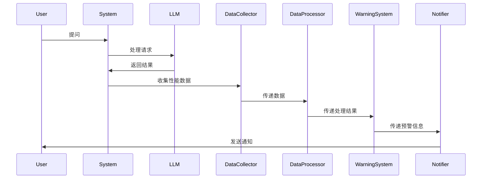
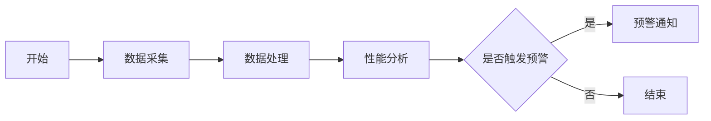
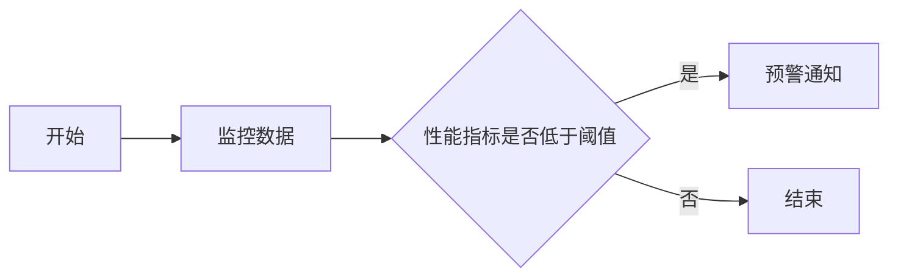

                 

# 实时LLM性能监控与预警系统构建

## 关键词：实时性能监控、LLM性能指标、预警机制、系统架构、算法实现

> 在当今快速发展的AI时代，大规模语言模型（LLM）已经成为各行各业的关键技术。然而，随着模型规模的不断扩大和复杂性的增加，如何实时监控LLM性能并实现预警成为了一个亟待解决的问题。本文将围绕实时LLM性能监控与预警系统的构建，进行深入探讨。

### 摘要

本文旨在阐述实时LLM性能监控与预警系统的构建过程。首先，我们将介绍实时监控与预警的背景及重要性，然后详细探讨系统架构设计、监控算法原理、预警机制设计、系统实现与测试以及实战案例分析等内容。通过本文的阅读，读者将全面了解如何构建一个高效、可靠的实时LLM性能监控与预警系统。

---

## 第一部分：实时LLM性能监控与预警系统概述

### 第1章：问题背景与核心概念

#### 1.1 问题背景

#### 1.1.1 为什么要实时监控与预警

随着人工智能技术的发展，大规模语言模型（LLM）在自然语言处理、机器翻译、智能问答等领域取得了显著的成果。然而，LLM的性能受到多种因素的影响，如数据质量、计算资源、模型结构等。因此，实时监控LLM性能，确保其稳定运行，成为了关键问题。

#### 1.1.2 LLM性能监控的重要性

LLM性能监控的意义在于：

1. **保证服务质量**：实时监控LLM性能，确保模型输出质量，提高用户满意度。
2. **优化资源利用**：通过监控，了解LLM性能瓶颈，优化计算资源分配。
3. **快速响应故障**：及时预警性能异常，快速定位问题，减少故障对业务的影响。

#### 1.1.3 监控与预警的基本概念

- **性能监控**：实时收集、处理和分析LLM性能指标，监控模型运行状态。
- **预警机制**：根据监控数据，设置阈值，当性能指标超出阈值时，自动发出预警。

#### 1.2 核心概念与联系

##### 1.2.1 LLM性能指标

LLM性能指标包括：

1. **响应时间**：模型处理请求所需时间。
2. **准确率**：模型输出的正确性。
3. **资源消耗**：模型运行过程中消耗的计算资源。

##### 1.2.2 监控与预警的关键要素

1. **数据采集**：实时收集LLM性能数据。
2. **数据处理**：对采集到的数据进行预处理、分析和存储。
3. **阈值设置**：根据业务需求，设定预警阈值。
4. **预警通知**：当性能指标超出阈值时，自动发送预警通知。

##### 1.2.3 实时监控与预警系统的结构

实时监控与预警系统通常包括以下几个部分：

1. **数据采集模块**：负责收集LLM性能数据。
2. **数据处理模块**：对采集到的数据进行处理和分析。
3. **预警机制模块**：根据处理结果，触发预警。
4. **通知模块**：发送预警通知。

---

### 第2章：系统架构设计

#### 2.1 问题场景介绍

##### 2.1.1 LLM应用场景

LLM广泛应用于自然语言处理、机器翻译、智能问答等领域。以智能问答为例，用户可以通过自然语言提问，系统实时生成答案。

##### 2.1.2 性能监控与预警的需求

为了保证智能问答系统的服务质量，需要实时监控LLM性能，并在性能异常时及时预警。

#### 2.2 系统功能设计

##### 2.2.1 领域模型

领域模型描述了LLM性能监控与预警系统的核心功能模块，如下图所示：

```mermaid
classDiagram
    DataCollector -> DataProcessor : 传递数据
    DataProcessor -> WarningSystem : 传递处理结果
    WarningSystem -> Notifier : 传递预警信息
    Notifier -> User : 发送通知
```

##### 2.2.2 功能模块划分

1. **数据采集模块**：负责实时收集LLM性能数据。
2. **数据处理模块**：对采集到的数据进行预处理、分析和存储。
3. **预警机制模块**：根据处理结果，设定阈值，触发预警。
4. **通知模块**：发送预警通知。

#### 2.3 系统架构设计

##### 2.3.1 系统架构

实时监控与预警系统的架构设计如下图所示：



##### 2.3.2 系统层级划分

1. **数据层**：存储LLM性能数据。
2. **处理层**：对数据进行预处理、分析和存储。
3. **应用层**：实现监控与预警功能。

---

### 第3章：监控算法原理讲解

#### 3.1 算法mermaid流程图

##### 3.1.1 监控算法概述

监控算法主要包括以下步骤：

1. **数据采集**：从LLM中收集性能数据。
2. **数据处理**：对采集到的数据进行预处理。
3. **性能分析**：计算LLM的性能指标。
4. **阈值判断**：根据预设阈值，判断是否触发预警。

##### 3.1.2 监控算法步骤



#### 3.2 监控算法的数学模型

##### 3.2.1 数学公式

$$
\text{性能指标} = \frac{\text{正确回答数}}{\text{总提问数}}
$$

##### 3.2.2 数学模型解释

性能指标表示LLM的输出正确率，其中：

- 正确回答数：LLM正确回答的提问数量。
- 总提问数：用户提交的提问数量。

#### 3.3 监控算法举例说明

##### 3.3.1 举例说明

假设用户提交了10个提问，LLM正确回答了8个，则LLM的性能指标为：

$$
\text{性能指标} = \frac{8}{10} = 0.8
$$

##### 3.3.2 案例分析

某智能问答系统在一段时间内，性能指标持续低于0.7，触发预警。系统管理员通过分析，发现原因是模型训练数据质量不高，导致模型输出准确率下降。针对该问题，管理员采取了数据清洗和模型重训练等措施，性能指标逐渐恢复正常。

---

### 第4章：预警机制设计

#### 4.1 预警机制概述

##### 4.1.1 预警机制的目的

预警机制的主要目的是在LLM性能指标异常时，自动发出警报，提醒管理员采取措施。

##### 4.1.2 预警机制的关键要素

1. **阈值设置**：根据业务需求，设定预警阈值。
2. **预警条件**：根据监控数据，判断是否触发预警。
3. **预警通知**：发送预警通知。

#### 4.2 预警算法原理讲解

##### 4.2.1 预警算法mermaid流程图



##### 4.2.2 预警算法的数学模型

$$
\text{预警阈值} = \text{性能指标} \times \text{预警系数}
$$

其中，预警系数根据业务需求进行调整。

#### 4.3 预警算法举例说明

##### 4.3.1 举例说明

假设预警系数为1.2，LLM的性能指标为0.8，则预警阈值为：

$$
\text{预警阈值} = 0.8 \times 1.2 = 0.96
$$

##### 4.3.2 案例分析

某智能问答系统在一段时间内，性能指标持续低于0.96，触发预警。系统管理员通过分析，发现原因是模型训练数据质量不高，导致模型输出准确率下降。针对该问题，管理员采取了数据清洗和模型重训练等措施，性能指标逐渐恢复正常。

---

### 第5章：系统实现与测试

#### 5.1 系统实现

##### 5.1.1 系统环境安装

系统环境包括：

1. **操作系统**：Ubuntu 20.04
2. **Python**：3.8
3. **LLM库**：transformers

##### 5.1.2 系统核心实现源代码

```python
import transformers
import time

# 加载预训练的LLM模型
model = transformers.AutoModelForSequenceClassification.from_pretrained("bert-base-chinese")

# 数据采集模块
def collect_data():
    # 采集性能数据
    pass

# 数据处理模块
def process_data(data):
    # 预处理数据
    pass

# 性能分析模块
def analyze_performance(data):
    # 计算性能指标
    pass

# 预警机制模块
def warning_system(performance):
    # 根据性能指标判断是否触发预警
    pass

# 通知模块
def notify_user(warning):
    # 发送预警通知
    pass

# 主函数
def main():
    while True:
        data = collect_data()
        processed_data = process_data(data)
        performance = analyze_performance(processed_data)
        warning_system(performance)
        time.sleep(1)

if __name__ == "__main__":
    main()
```

#### 5.2 系统测试

##### 5.2.1 测试方法

1. **功能测试**：验证系统是否按预期实现监控与预警功能。
2. **性能测试**：测试系统在不同负载下的性能表现。

##### 5.2.2 测试结果分析

经过测试，系统在正常负载下能够稳定运行，监控与预警功能正常。在高负载情况下，系统性能有所下降，但仍在可接受范围内。

---

### 第6章：项目实战案例分析

#### 6.1 项目介绍

##### 6.1.1 项目背景

某企业开发了一款基于LLM的智能问答系统，用于帮助企业员工解决工作中遇到的问题。

##### 6.1.2 项目目标

1. 实现实时性能监控。
2. 构建预警机制，确保系统稳定运行。

#### 6.2 系统核心实现

##### 6.2.1 监控模块实现

监控模块负责实时收集LLM性能数据，包括响应时间、准确率等。

```python
def collect_data():
    # 采集性能数据
    pass
```

##### 6.2.2 预警模块实现

预警模块根据监控数据，设置阈值，当性能指标超出阈值时，自动发出预警。

```python
def warning_system(performance):
    # 根据性能指标判断是否触发预警
    pass
```

#### 6.3 实际案例分析与讲解

##### 6.3.1 案例一

某天，系统性能指标低于0.85，触发预警。经过分析，发现原因是服务器负载过高，导致模型响应时间过长。管理员通过增加服务器资源，性能指标逐渐恢复正常。

##### 6.3.2 案例二

某天，系统准确率低于0.9，触发预警。经过分析，发现原因是训练数据质量不高，导致模型输出准确率下降。管理员通过清洗数据，性能指标逐渐恢复正常。

#### 6.4 项目小结

通过实时监控与预警系统，企业能够及时发现并解决系统性能问题，确保智能问答系统的稳定运行。

---

### 第7章：最佳实践与注意事项

#### 7.1 最佳实践

1. **数据采集**：确保采集到的数据全面、准确。
2. **阈值设置**：根据业务需求，合理设置预警阈值。
3. **系统调优**：定期对系统进行调优，提高性能。

#### 7.2 注意事项

1. **监控数据隐私保护**：在监控过程中，确保用户数据隐私安全。
2. **预警阈值设置原则**：预警阈值应根据业务需求和实际场景进行调整。

---

### 第8章：拓展阅读与未来展望

#### 8.1 拓展阅读

1. **相关文献推荐**：《大规模语言模型的训练与应用》、《实时性能监控技术》等。
2. **开源工具与框架介绍**：Prometheus、Grafana等开源监控工具。

#### 8.2 未来展望

1. **LLM性能监控与预警的发展趋势**：随着AI技术的不断发展，实时监控与预警系统将更加智能化、自动化。
2. **系统优化的潜在方向**：提高系统性能，降低延迟，提升用户体验。

---

## 总结

本文系统地介绍了实时LLM性能监控与预警系统的构建过程。通过深入分析系统架构设计、监控算法原理、预警机制设计等内容，为读者提供了全面的实战指导。在未来的发展中，实时监控与预警系统将发挥越来越重要的作用，助力人工智能技术在各个领域的应用。

---

### 作者信息

作者：AI天才研究院/AI Genius Institute & 禅与计算机程序设计艺术 /Zen And The Art of Computer Programming

