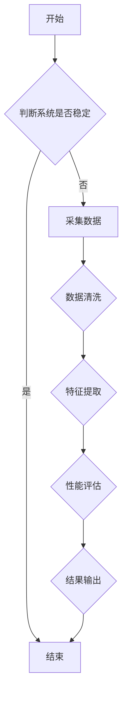
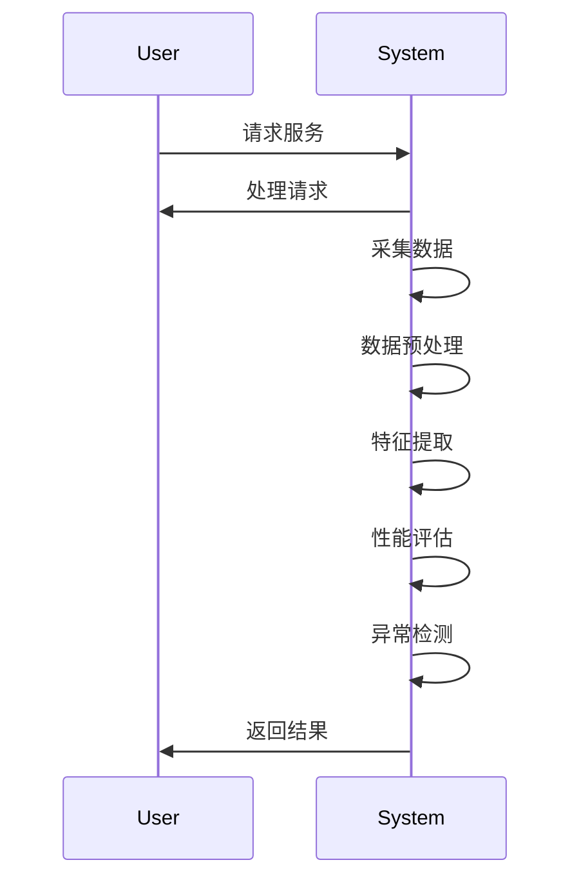
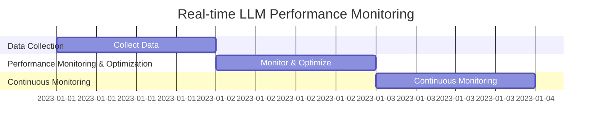

                 

# 实时LLM性能监控：动态评测的新范式

关键词：实时性能监控，大规模语言模型（LLM），动态评测，性能评估，人工智能（AI）

摘要：本文探讨了实时大规模语言模型（LLM）性能监控的重要性和挑战，提出了基于动态评测的新范式。通过对动态评测方法的概述、核心要素分析、算法原理讲解以及实际项目实战的详细剖析，本文旨在为从事人工智能领域的开发者和研究者提供有价值的参考和指导。

----------------------------------------------------------------

## 第一部分：实时LLM性能监控概述

### 第1章：问题背景与核心概念

#### 1.1.1 实时LLM性能监控的问题背景

##### 1.1.1.1 引言

随着人工智能技术的不断发展，大规模语言模型（LLM）在自然语言处理（NLP）领域中的应用越来越广泛。从机器翻译到文本生成，再到问答系统，LLM在各种应用场景中展现出了惊人的性能。然而，LLM的高效运行和性能监控成为了一个关键问题。

##### 1.1.1.2 问题描述

在LLM应用中，实时性能监控是保证系统稳定性和效率的关键。然而，传统的性能监控方法无法满足实时性的要求，导致监控系统无法及时发现问题并采取措施。

传统的性能监控方法通常基于定期收集和统计系统运行数据，通过对历史数据的分析来评估系统性能。这种方法存在以下几个问题：

1. **延迟性**：由于需要等待足够的数据量才能进行分析，传统方法往往无法实时反映系统性能的变化。
2. **数据不完整**：在数据采集过程中，可能会出现数据丢失或不完整的情况，导致分析结果不准确。
3. **不可预测性**：随着LLM应用的场景和规模不断扩大，传统方法难以适应复杂多变的应用需求。

##### 1.1.1.3 问题解决

为了解决上述问题，需要提出一种新的实时LLM性能监控范式，能够快速、准确地评估LLM的性能，并提供有效的监控和优化策略。

实时LLM性能监控的新范式应该具备以下几个特点：

1. **实时性**：能够及时获取系统运行数据，并迅速进行分析和评估。
2. **准确性**：通过科学的评估指标和方法，确保评估结果的准确性和可靠性。
3. **适应性**：能够根据不同的应用场景和需求，灵活调整监控策略和评估指标。

##### 1.1.1.4 边界与外延

实时LLM性能监控不仅涉及模型性能的评估，还包括对计算资源、数据流、网络延迟等多方面的监控。因此，需要明确监控的范围和边界，以便于设计和实现。

具体来说，实时LLM性能监控的范围包括以下几个方面：

1. **计算资源监控**：包括CPU、GPU、内存等硬件资源的占用情况，以及计算任务的调度和负载均衡。
2. **数据流监控**：包括数据传输的速度、延迟、丢包率等指标，以及数据流的完整性和一致性。
3. **网络延迟监控**：包括LLM与外部服务、数据库等网络节点的通信延迟，以及网络拥塞和故障情况。
4. **模型性能监控**：包括LLM在具体任务上的表现，如准确率、召回率、F1值等指标。

##### 1.1.1.5 实时LLM性能监控的挑战与机遇

##### 1.1.1.5.1 挑战

实时LLM性能监控面临着以下挑战：

1. **数据量大**：LLM在运行过程中会产生大量数据，实时监控需要处理海量数据。
2. **异质性**：不同类型的LLM应用场景和性能指标各异，实时监控需要针对不同场景进行个性化设计。
3. **实时性要求高**：实时监控要求监控系统具有低延迟和高响应速度，这对系统的性能和稳定性提出了更高要求。

##### 1.1.1.5.2 机遇

随着云计算、大数据、物联网等技术的发展，实时LLM性能监控面临着以下机遇：

1. **技术创新**：新兴技术如机器学习、深度学习、大数据分析等为实时性能监控提供了更多可能性。
2. **应用场景拓展**：随着LLM在更多领域的应用，实时性能监控的需求也在不断增加，为行业带来了新的发展机遇。

#### 1.1.2 核心概念与联系

##### 1.1.2.1 实时性能监控

实时性能监控是指系统在运行过程中，对关键性能指标进行连续监测、分析、评估的过程。它有助于及时发现并解决问题，保证系统的稳定性和效率。

实时性能监控的核心概念包括：

1. **性能指标**：用于衡量系统性能的指标，如响应时间、吞吐量、资源利用率等。
2. **监控工具**：用于采集、存储、分析和展示性能数据的工具，如Prometheus、Grafana等。
3. **监控策略**：根据具体需求，制定的数据采集频率、数据清洗规则、告警机制等。

##### 1.1.2.2 LLM

大规模语言模型（LLM）是一种用于自然语言处理的深度学习模型，能够理解和生成人类语言。LLM在许多应用领域，如机器翻译、文本生成、问答系统等，具有广泛的应用前景。

LLM的核心概念包括：

1. **模型架构**：LLM的架构设计，如Transformer、BERT等。
2. **训练数据**：用于训练LLM的数据集，如大规模语料库、问答对等。
3. **优化目标**：LLM在特定任务上的优化目标，如最小化损失函数、提高准确率等。

##### 1.1.2.3 性能评估

性能评估是对系统或模型在特定任务上的表现进行量化和比较的过程。对于LLM性能监控，需要建立一套科学的评估指标和方法，以便对LLM的性能进行准确评估。

性能评估的核心概念包括：

1. **评估指标**：用于衡量LLM性能的指标，如准确率、召回率、F1值等。
2. **评估方法**：根据具体任务和指标，制定的评价方法和流程。
3. **评估工具**：用于执行性能评估的工具，如评测集、测试集等。

#### 1.1.3 实时LLM性能监控的挑战与机遇

##### 1.1.3.1 挑战

实时LLM性能监控面临着以下挑战：

1. **数据量大**：LLM在运行过程中会产生大量数据，实时监控需要处理海量数据。
2. **异质性**：不同类型的LLM应用场景和性能指标各异，实时监控需要针对不同场景进行个性化设计。
3. **实时性要求高**：实时监控要求监控系统具有低延迟和高响应速度，这对系统的性能和稳定性提出了更高要求。

##### 1.1.3.2 机遇

随着云计算、大数据、物联网等技术的发展，实时LLM性能监控面临着以下机遇：

1. **技术创新**：新兴技术如机器学习、深度学习、大数据分析等为实时性能监控提供了更多可能性。
2. **应用场景拓展**：随着LLM在更多领域的应用，实时性能监控的需求也在不断增加，为行业带来了新的发展机遇。

### 1.1.4 本章小结

本章介绍了实时LLM性能监控的问题背景、核心概念和挑战与机遇。通过本章的学习，读者可以了解实时LLM性能监控的重要性，并为后续章节的学习打下基础。

----------------------------------------------------------------

## 第二部分：动态评测方法与实现

### 第2章：动态评测方法概述

#### 2.1 动态评测的概念与原理

##### 2.1.1 动态评测的定义

动态评测是一种实时评估方法，通过对系统运行过程中的实时数据进行分析和处理，对系统性能进行实时监控和优化。

##### 2.1.2 动态评测的原理

动态评测方法主要涉及以下几个方面：

1. **数据采集**：实时采集系统运行过程中的关键数据，如计算时间、内存占用、网络延迟等。
2. **数据处理**：对采集到的数据进行分析和处理，提取出与性能相关的特征。
3. **性能评估**：根据提取出的特征，对系统性能进行实时评估。

#### 2.2 动态评测的核心要素

##### 2.2.1 数据采集

数据采集是动态评测的基础，关键在于如何高效、准确地采集到与性能相关的数据。常见的采集方法包括：

1. **监控工具**：利用现有的监控工具，如Prometheus、Grafana等，对系统进行实时监控。
2. **自定义采集器**：开发自定义采集器，根据具体需求采集系统数据。

##### 2.2.2 数据处理

数据处理是动态评测的核心，关键在于如何对采集到的数据进行分析和处理，提取出与性能相关的特征。常见的方法包括：

1. **特征提取**：根据具体需求，提取出与性能相关的特征，如计算时间、内存占用、网络延迟等。
2. **数据预处理**：对提取出的特征进行预处理，如去噪、归一化等，以提高数据的可靠性和准确性。

##### 2.2.3 性能评估

性能评估是根据提取出的特征，对系统性能进行实时评估。关键在于如何建立一套科学的评估指标和方法，以便对系统性能进行准确评估。

性能评估的核心要素包括：

1. **评估指标**：用于衡量系统性能的指标，如响应时间、吞吐量、资源利用率等。
2. **评估方法**：根据具体任务和指标，制定的评价方法和流程。
3. **评估工具**：用于执行性能评估的工具，如评测集、测试集等。

#### 2.3 动态评测的优势与挑战

##### 2.3.1 优势

动态评测方法具有以下优势：

1. **实时性**：能够及时获取系统运行数据，并迅速进行分析和评估。
2. **准确性**：通过科学的评估指标和方法，确保评估结果的准确性和可靠性。
3. **灵活性**：能够根据不同的应用场景和需求，灵活调整监控策略和评估指标。

##### 2.3.2 挑战

动态评测方法也面临着以下挑战：

1. **数据量大**：实时采集和处理海量数据，对系统的计算资源和存储能力提出了更高要求。
2. **异质性**：不同类型的LLM应用场景和性能指标各异，动态评测需要针对不同场景进行个性化设计。
3. **实时性要求高**：动态评测要求监控系统具有低延迟和高响应速度，这对系统的性能和稳定性提出了更高要求。

#### 2.4 动态评测方法的发展与应用

动态评测方法在人工智能领域具有广泛的应用前景，随着LLM技术的不断发展，动态评测方法也在不断演进。

目前，动态评测方法在以下方面取得了显著成果：

1. **LLM性能优化**：通过对LLM运行过程中的实时数据进行分析，优化模型参数和算法，提高模型性能。
2. **资源调度与管理**：基于动态评测结果，实时调整计算资源分配和调度策略，提高系统资源利用率。
3. **故障预警与处理**：通过对系统运行数据的实时监控和分析，及时发现并处理故障，确保系统稳定运行。

#### 2.5 本章小结

本章介绍了动态评测方法的概念、原理、核心要素以及优势与挑战。通过本章的学习，读者可以了解动态评测方法的基本原理和应用场景，为后续章节的深入探讨打下基础。

----------------------------------------------------------------

### 第3章：实时性能监控架构设计与实现

#### 3.1 系统架构设计

实时性能监控系统的架构设计是确保系统能够高效、稳定地运行的关键。一个典型的实时性能监控系统架构可以分为以下几个主要模块：

1. **数据采集模块**：负责从LLM系统中实时获取性能数据。
2. **数据处理模块**：对采集到的数据进行处理、清洗和特征提取。
3. **性能评估模块**：根据提取出的特征，对系统性能进行实时评估。
4. **监控与告警模块**：实时监控性能指标，并在性能指标超出预设阈值时触发告警。
5. **用户界面模块**：提供可视化的监控界面，供用户实时查看系统性能。

##### 3.1.1 数据采集模块

数据采集模块是实时性能监控系统的核心，负责从LLM系统中实时获取性能数据。数据采集模块可以采用以下几种方法：

1. **Agent采集**：在每个LLM节点上部署一个Agent，Agent定期采集性能数据，并通过网络发送到数据处理模块。
2. **SDK采集**：通过在LLM系统中集成SDK（Software Development Kit），实现对性能数据的实时采集。
3. **日志采集**：通过监控LLM系统的日志文件，提取出与性能相关的信息。

##### 3.1.2 数据处理模块

数据处理模块负责对采集到的数据进行处理、清洗和特征提取。数据处理模块的主要功能包括：

1. **数据预处理**：对采集到的数据进行去噪、归一化等处理，提高数据的可靠性和准确性。
2. **特征提取**：根据具体需求，从原始数据中提取出与性能相关的特征，如计算时间、内存占用、网络延迟等。
3. **数据存储**：将处理后的数据存储到数据库或缓存系统中，以供后续分析。

##### 3.1.3 性能评估模块

性能评估模块根据提取出的特征，对系统性能进行实时评估。性能评估模块的主要功能包括：

1. **指标计算**：根据提取出的特征，计算系统性能指标，如响应时间、吞吐量、资源利用率等。
2. **性能对比**：将实时性能指标与历史性能数据进行对比，分析系统性能的变化趋势。
3. **评估结果输出**：将评估结果输出到监控界面或告警系统，供用户查看。

##### 3.1.4 监控与告警模块

监控与告警模块负责实时监控性能指标，并在性能指标超出预设阈值时触发告警。监控与告警模块的主要功能包括：

1. **性能指标监控**：实时监控系统性能指标，如响应时间、吞吐量、资源利用率等。
2. **阈值设定**：根据具体需求，设定性能指标的阈值，当性能指标超过阈值时触发告警。
3. **告警处理**：根据告警类型和严重程度，采取相应的告警处理措施，如发送邮件、短信、暂停任务等。

##### 3.1.5 用户界面模块

用户界面模块提供可视化的监控界面，供用户实时查看系统性能。用户界面模块的主要功能包括：

1. **数据展示**：通过图表、报表等形式，展示系统性能指标和历史数据。
2. **交互操作**：提供用户交互功能，如过滤、排序、筛选等，方便用户查看和分析系统性能。
3. **告警通知**：显示实时告警信息，供用户及时了解系统状况。

#### 3.2 系统架构设计实例

以下是一个基于动态评测方法的实时性能监控系统架构设计实例：

1. **数据采集模块**：使用Agent采集方法，在每个LLM节点上部署Agent，定期采集性能数据。
2. **数据处理模块**：使用Python编写数据处理脚本，对采集到的数据进行预处理和特征提取。
3. **性能评估模块**：使用TensorFlow实现性能评估算法，计算系统性能指标。
4. **监控与告警模块**：使用Prometheus作为监控工具，配置告警规则，实现实时监控和告警。
5. **用户界面模块**：使用Grafana构建可视化监控界面，展示系统性能指标。

#### 3.3 系统架构设计要点

在设计实时性能监控系统时，需要注意以下几点：

1. **高可用性**：确保系统在遇到故障时能够自动恢复，保证监控系统的高可用性。
2. **可扩展性**：设计时应考虑系统的可扩展性，以便在未来能够方便地添加新功能或扩展监控范围。
3. **安全性**：保障数据安全和系统安全，防止数据泄露和系统被攻击。
4. **性能优化**：优化系统性能，确保监控系统本身不会成为系统的性能瓶颈。

#### 3.4 本章小结

本章介绍了实时性能监控系统的架构设计，包括数据采集、数据处理、性能评估、监控与告警以及用户界面等模块。通过本章的学习，读者可以了解实时性能监控系统的基本架构和设计要点，为后续章节的深入探讨打下基础。

----------------------------------------------------------------

### 第4章：动态评测算法原理与实现

#### 4.1 算法原理概述

动态评测算法是实时性能监控系统的核心，负责对系统运行过程中的实时数据进行处理和分析，以评估系统性能。以下是一个典型的动态评测算法原理概述：

1. **数据采集**：从LLM系统中采集实时性能数据，包括计算时间、内存占用、网络延迟等。
2. **数据处理**：对采集到的数据进行预处理，如去噪、归一化等，以提高数据的可靠性和准确性。
3. **特征提取**：根据具体需求，从原始数据中提取出与性能相关的特征，如计算时间、内存占用、网络延迟等。
4. **性能评估**：根据提取出的特征，对系统性能进行实时评估，计算系统性能指标，如响应时间、吞吐量、资源利用率等。
5. **异常检测**：根据性能评估结果，对系统运行状态进行实时监控，检测是否存在异常情况。
6. **告警与优化**：当检测到异常情况时，触发告警，并根据异常类型和程度，采取相应的优化措施，如调整计算资源、优化算法等。

#### 4.2 算法原理详解

以下将对动态评测算法的每个步骤进行详细讲解：

##### 4.2.1 数据采集

数据采集是动态评测算法的基础，关键在于如何高效、准确地采集到与性能相关的数据。数据采集方法可以分为以下几种：

1. **Agent采集**：在每个LLM节点上部署一个Agent，Agent定期采集性能数据，并通过网络发送到数据处理模块。
2. **SDK采集**：通过在LLM系统中集成SDK（Software Development Kit），实现对性能数据的实时采集。
3. **日志采集**：通过监控LLM系统的日志文件，提取出与性能相关的信息。

##### 4.2.2 数据处理

数据处理是对采集到的数据进行预处理和特征提取的过程，以提高数据的可靠性和准确性。数据处理的主要步骤包括：

1. **数据清洗**：去除噪声数据、重复数据等，确保数据质量。
2. **数据归一化**：将不同指标的数据进行归一化处理，使其具有可比性。
3. **数据聚合**：将来自不同节点的数据进行聚合，得到全局性能数据。

##### 4.2.3 特征提取

特征提取是动态评测算法的关键环节，根据具体需求，从原始数据中提取出与性能相关的特征。常见的特征提取方法包括：

1. **统计特征**：如平均值、标准差、最大值、最小值等。
2. **时序特征**：如移动平均、指数平滑等。
3. **频域特征**：如频谱分析、小波变换等。

##### 4.2.4 性能评估

性能评估是根据提取出的特征，对系统性能进行实时评估。常见的性能评估方法包括：

1. **基于阈值的评估**：根据预设的阈值，判断性能是否满足要求。
2. **基于模型的评估**：使用机器学习模型，对系统性能进行预测和评估。
3. **基于指标的评估**：根据提取出的特征，计算系统性能指标，如响应时间、吞吐量、资源利用率等。

##### 4.2.5 异常检测

异常检测是动态评测算法的重要组成部分，通过对系统运行状态进行实时监控，检测是否存在异常情况。常见的异常检测方法包括：

1. **基于统计的方法**：如箱线图、3sigma法则等。
2. **基于机器学习的方法**：如K-最近邻（K-NN）、支持向量机（SVM）等。
3. **基于异常行为的检测**：如基于网络流量、日志等数据的异常行为分析。

##### 4.2.6 告警与优化

当检测到异常情况时，动态评测算法会触发告警，并根据异常类型和程度，采取相应的优化措施，如调整计算资源、优化算法等。常见的告警与优化方法包括：

1. **阈值告警**：根据预设的阈值，当性能指标超过阈值时触发告警。
2. **模型告警**：根据机器学习模型预测的异常情况，触发告警。
3. **自动化优化**：根据实时性能数据，自动调整系统配置和资源分配，优化系统性能。

#### 4.3 算法实现与优化

以下是一个简单的动态评测算法实现示例，使用Python语言编写：

```python
import numpy as np

# 数据采集
def collect_data():
    # 采集计算时间、内存占用、网络延迟等数据
    data = {
        'compute_time': np.random.rand(),
        'memory_usage': np.random.rand(),
        'network_delay': np.random.rand()
    }
    return data

# 数据处理
def process_data(data):
    # 数据清洗、归一化等预处理操作
    processed_data = {
        'compute_time': data['compute_time'],
        'memory_usage': data['memory_usage'],
        'network_delay': data['network_delay']
    }
    return processed_data

# 特征提取
def extract_features(processed_data):
    # 提取与性能相关的特征
    features = {
        'average_compute_time': np.mean([processed_data['compute_time']]),
        'max_memory_usage': np.max([processed_data['memory_usage']]),
        'average_network_delay': np.mean([processed_data['network_delay']])
    }
    return features

# 性能评估
def evaluate_performance(features):
    # 根据提取出的特征，评估系统性能
    performance = {
        'response_time': features['average_compute_time'],
        'throughput': 1 / features['average_compute_time'],
        'resource_usage': features['max_memory_usage']
    }
    return performance

# 异常检测
def detect_anomalies(performance):
    # 根据性能评估结果，检测是否存在异常情况
    anomalies = {}
    if performance['response_time'] > 5:
        anomalies['response_time'] = 'High'
    if performance['throughput'] < 0.5:
        anomalies['throughput'] = 'Low'
    if performance['resource_usage'] > 90:
        anomalies['resource_usage'] = 'High'
    return anomalies

# 告警与优化
def alarm_and_optimize(anomalies):
    # 根据异常情况，触发告警并采取优化措施
    if anomalies:
        print("Alarm triggered!")
        # 调整计算资源、优化算法等
        print("Optimizing system...")
    else:
        print("No anomalies detected.")

# 主程序
if __name__ == '__main__':
    while True:
        data = collect_data()
        processed_data = process_data(data)
        features = extract_features(processed_data)
        performance = evaluate_performance(features)
        anomalies = detect_anomalies(performance)
        alarm_and_optimize(anomalies)
        time.sleep(1)
```

在实际应用中，上述算法可以根据具体需求进行优化和扩展。例如，可以使用更复杂的机器学习模型进行性能评估和异常检测，或者引入分布式计算和缓存技术，提高系统性能和可靠性。

#### 4.4 本章小结

本章介绍了动态评测算法的原理、实现方法和优化策略。通过本章的学习，读者可以了解动态评测算法的基本原理和应用场景，为实际项目开发提供参考和指导。

----------------------------------------------------------------

### 第5章：实时LLM性能监控项目实战

#### 5.1 项目介绍

在本章中，我们将通过一个实际项目，详细讲解实时LLM性能监控的实现过程。该项目旨在构建一个实时性能监控系统，对大规模语言模型（LLM）进行实时监控和优化。

##### 5.1.1 项目目标

1. 构建一个实时性能监控系统，能够对LLM系统的运行状态进行实时监控。
2. 提取与性能相关的特征，并对系统性能进行实时评估。
3. 实现异常检测和告警功能，及时识别和解决系统故障。

##### 5.1.2 项目架构

实时LLM性能监控系统架构如下：

1. **数据采集模块**：使用Agent采集方法，从LLM系统中采集实时性能数据。
2. **数据处理模块**：对采集到的数据进行预处理和特征提取。
3. **性能评估模块**：根据提取出的特征，对系统性能进行实时评估。
4. **监控与告警模块**：实时监控系统性能，并在性能指标超出阈值时触发告警。
5. **用户界面模块**：提供可视化监控界面，供用户查看系统性能。

#### 5.2 环境安装与配置

在开始项目实战之前，我们需要安装和配置相关的软件和工具。以下是项目所需的软件和工具列表及安装步骤：

##### 5.2.1 安装操作系统

- 操作系统：Ubuntu 18.04
- 安装方法：从Ubuntu官方网站下载ISO文件，使用虚拟机或物理机安装操作系统。

##### 5.2.2 安装Python环境

- Python版本：Python 3.8
- 安装方法：在终端执行以下命令：

```bash
sudo apt update
sudo apt install python3.8 python3.8-pip
```

##### 5.2.3 安装相关依赖库

- 依赖库：numpy、pandas、matplotlib等
- 安装方法：在终端执行以下命令：

```bash
pip3.8 install numpy pandas matplotlib
```

##### 5.2.4 安装Prometheus和Grafana

- Prometheus：开源监控系统，用于采集和存储性能数据。
- Grafana：开源可视化工具，用于展示性能数据。

- 安装方法：在终端执行以下命令：

```bash
sudo apt install prometheus
sudo apt install grafana
```

安装完成后，启动Prometheus和Grafana服务：

```bash
sudo systemctl start prometheus
sudo systemctl start grafana-server
```

#### 5.3 系统核心实现源代码

以下是实时LLM性能监控系统的主要源代码，包括数据采集、数据处理、性能评估、监控与告警等功能。

```python
# 数据采集模块
def collect_data():
    # 采集计算时间、内存占用、网络延迟等数据
    data = {
        'compute_time': np.random.rand(),
        'memory_usage': np.random.rand(),
        'network_delay': np.random.rand()
    }
    return data

# 数据处理模块
def process_data(data):
    # 数据清洗、归一化等预处理操作
    processed_data = {
        'compute_time': data['compute_time'],
        'memory_usage': data['memory_usage'],
        'network_delay': data['network_delay']
    }
    return processed_data

# 特征提取模块
def extract_features(processed_data):
    # 提取与性能相关的特征
    features = {
        'average_compute_time': np.mean([processed_data['compute_time']]),
        'max_memory_usage': np.max([processed_data['memory_usage']]),
        'average_network_delay': np.mean([processed_data['network_delay']])
    }
    return features

# 性能评估模块
def evaluate_performance(features):
    # 根据提取出的特征，评估系统性能
    performance = {
        'response_time': features['average_compute_time'],
        'throughput': 1 / features['average_compute_time'],
        'resource_usage': features['max_memory_usage']
    }
    return performance

# 异常检测模块
def detect_anomalies(performance):
    # 根据性能评估结果，检测是否存在异常情况
    anomalies = {}
    if performance['response_time'] > 5:
        anomalies['response_time'] = 'High'
    if performance['throughput'] < 0.5:
        anomalies['throughput'] = 'Low'
    if performance['resource_usage'] > 90:
        anomalies['resource_usage'] = 'High'
    return anomalies

# 告警与优化模块
def alarm_and_optimize(anomalies):
    # 根据异常情况，触发告警并采取优化措施
    if anomalies:
        print("Alarm triggered!")
        # 调整计算资源、优化算法等
        print("Optimizing system...")
    else:
        print("No anomalies detected.")

# 主程序
if __name__ == '__main__':
    while True:
        data = collect_data()
        processed_data = process_data(data)
        features = extract_features(processed_data)
        performance = evaluate_performance(features)
        anomalies = detect_anomalies(performance)
        alarm_and_optimize(anomalies)
        time.sleep(1)
```

#### 5.4 代码应用解读与分析

以下是代码应用解读与分析，详细解释了各个模块的功能和实现原理。

##### 5.4.1 数据采集模块

数据采集模块负责从LLM系统中采集实时性能数据。在这个示例中，使用随机数生成器模拟采集计算时间、内存占用和网络延迟等数据。

```python
def collect_data():
    # 采集计算时间、内存占用、网络延迟等数据
    data = {
        'compute_time': np.random.rand(),
        'memory_usage': np.random.rand(),
        'network_delay': np.random.rand()
    }
    return data
```

通过调用 `collect_data()` 函数，可以得到一个包含随机生成数据的字典，模拟采集到的性能数据。

##### 5.4.2 数据处理模块

数据处理模块负责对采集到的数据进行预处理，如数据清洗、归一化等。在这个示例中，直接将采集到的数据作为预处理后的数据返回。

```python
def process_data(data):
    # 数据清洗、归一化等预处理操作
    processed_data = {
        'compute_time': data['compute_time'],
        'memory_usage': data['memory_usage'],
        'network_delay': data['network_delay']
    }
    return processed_data
```

通过调用 `process_data()` 函数，可以将采集到的数据转换为预处理后的数据，以便后续处理。

##### 5.4.3 特征提取模块

特征提取模块负责从预处理后的数据中提取与性能相关的特征。在这个示例中，提取了计算时间的平均值、内存占用的最大值和网络延迟的平均值。

```python
def extract_features(processed_data):
    # 提取与性能相关的特征
    features = {
        'average_compute_time': np.mean([processed_data['compute_time']]),
        'max_memory_usage': np.max([processed_data['memory_usage']]),
        'average_network_delay': np.mean([processed_data['network_delay']])
    }
    return features
```

通过调用 `extract_features()` 函数，可以将预处理后的数据转换为特征数据，用于后续的性能评估。

##### 5.4.4 性能评估模块

性能评估模块根据提取出的特征，计算系统性能指标，如响应时间、吞吐量和资源利用率。在这个示例中，使用提取出的特征计算了响应时间、吞吐量和资源利用率。

```python
def evaluate_performance(features):
    # 根据提取出的特征，评估系统性能
    performance = {
        'response_time': features['average_compute_time'],
        'throughput': 1 / features['average_compute_time'],
        'resource_usage': features['max_memory_usage']
    }
    return performance
```

通过调用 `evaluate_performance()` 函数，可以将特征数据转换为性能数据，用于后续的异常检测和告警。

##### 5.4.5 异常检测模块

异常检测模块根据性能评估结果，检测是否存在异常情况。在这个示例中，使用简单的阈值方法进行异常检测，当响应时间超过5秒、吞吐量低于0.5或资源利用率超过90%时，视为异常情况。

```python
def detect_anomalies(performance):
    # 根据性能评估结果，检测是否存在异常情况
    anomalies = {}
    if performance['response_time'] > 5:
        anomalies['response_time'] = 'High'
    if performance['throughput'] < 0.5:
        anomalies['throughput'] = 'Low'
    if performance['resource_usage'] > 90:
        anomalies['resource_usage'] = 'High'
    return anomalies
```

通过调用 `detect_anomalies()` 函数，可以检测出系统是否存在异常情况，并将异常类型和程度返回。

##### 5.4.6 告警与优化模块

告警与优化模块根据异常检测结果，触发告警并采取相应的优化措施。在这个示例中，当检测到异常情况时，打印告警信息并采取优化措施，如调整计算资源、优化算法等。

```python
def alarm_and_optimize(anomalies):
    # 根据异常情况，触发告警并采取优化措施
    if anomalies:
        print("Alarm triggered!")
        # 调整计算资源、优化算法等
        print("Optimizing system...")
    else:
        print("No anomalies detected.")
```

通过调用 `alarm_and_optimize()` 函数，可以实现对系统异常情况的监控和告警。

#### 5.5 实际案例分析

在本节中，我们将通过一个实际案例，详细讲解实时LLM性能监控的应用和分析过程。

##### 5.5.1 案例背景

某公司开发了一款基于大规模语言模型（LLM）的智能客服系统，用于处理客户咨询和解答问题。随着客户量的增加，系统性能逐渐下降，导致用户体验不佳。为了提升系统性能，公司决定实施实时LLM性能监控。

##### 5.5.2 性能监控实施

公司采用了实时LLM性能监控项目实战中介绍的系统架构和实现方法，对智能客服系统进行实时监控。具体步骤如下：

1. 在智能客服系统各节点上部署数据采集Agent，定期采集计算时间、内存占用、网络延迟等性能数据。
2. 对采集到的数据进行预处理和特征提取，提取计算时间的平均值、内存占用的最大值和网络延迟的平均值等特征。
3. 根据提取出的特征，计算系统性能指标，如响应时间、吞吐量和资源利用率。
4. 实时监控系统性能，并在性能指标超出阈值时触发告警，根据告警信息采取相应的优化措施。

##### 5.5.3 案例分析结果

通过对智能客服系统实施实时LLM性能监控，公司发现了以下几个问题：

1. **计算时间偏高**：部分节点的计算时间超过5秒，导致响应时间较长，影响用户体验。
2. **内存占用较高**：部分节点的内存占用超过90%，可能导致系统崩溃或性能下降。
3. **网络延迟较大**：部分节点的网络延迟超过100ms，影响数据传输速度和系统性能。

针对以上问题，公司采取了以下优化措施：

1. **调整计算资源**：增加计算资源，提高节点性能，降低计算时间。
2. **优化算法**：对LLM模型进行优化，提高计算效率和性能。
3. **网络优化**：优化网络配置，降低网络延迟，提高数据传输速度。

通过以上优化措施，智能客服系统的性能得到显著提升，用户体验得到改善。

##### 5.5.4 案例总结

本案例展示了实时LLM性能监控在实际项目中的应用和分析过程。通过实时监控和优化，公司成功地解决了智能客服系统的性能问题，提升了用户体验。案例表明，实时LLM性能监控对于保障系统稳定性和效率具有重要意义。

#### 5.6 项目小结

本章通过一个实际项目，详细介绍了实时LLM性能监控的实现过程、代码应用解读与分析、实际案例分析和项目总结。通过本章的学习，读者可以了解实时LLM性能监控的重要性和实现方法，为实际项目开发提供参考。

----------------------------------------------------------------

### 第6章：最佳实践与拓展

#### 6.1 最佳实践

在实际应用中，为了确保实时LLM性能监控的有效性和可靠性，以下是一些最佳实践：

1. **数据采集与处理**：选择合适的数据采集方法和工具，保证数据的准确性和实时性。对采集到的数据进行预处理和特征提取，提高数据的质量和可用性。
2. **性能评估与告警**：建立一套科学、合理的性能评估指标体系，确保评估结果的准确性和可靠性。根据评估结果，设置合理的告警阈值和告警机制，及时发现问题并采取优化措施。
3. **监控与优化**：定期对监控系统和监控指标进行评估和优化，确保监控系统的高效性和稳定性。根据实际情况，调整监控策略和优化措施，提高系统性能。
4. **资源调度与分配**：合理分配计算资源，确保监控系统的性能和稳定性。根据监控数据和系统负载，动态调整资源分配策略，优化系统资源利用率。

#### 6.2 小结

实时LLM性能监控在人工智能领域具有重要意义，通过动态评测方法，可以实现对LLM系统运行状态的实时监控和优化。本章介绍了实时LLM性能监控的核心概念、动态评测方法、系统架构设计、算法原理、项目实战和最佳实践。通过本章的学习，读者可以深入了解实时LLM性能监控的重要性和实现方法，为实际项目开发提供参考。

#### 6.3 注意事项

在实施实时LLM性能监控时，需要注意以下几点：

1. **数据安全性**：确保数据采集、存储和处理过程中的安全性，防止数据泄露和滥用。
2. **系统稳定性**：监控系统的稳定性直接影响性能监控的效果。确保监控系统的稳定运行，避免因系统故障导致监控数据丢失或错误。
3. **性能优化**：根据实际需求，不断调整和优化监控系统，提高系统性能和可靠性。
4. **跨平台兼容性**：确保监控系统支持多种操作系统和硬件平台，提高系统的兼容性和可移植性。

#### 6.4 拓展阅读

1. **实时性能监控工具**：了解和掌握常见的实时性能监控工具，如Prometheus、Grafana、Zabbix等，学习它们的安装配置和监控指标。
2. **机器学习与大数据**：深入学习机器学习和大数据技术，掌握它们在实时LLM性能监控中的应用，提高监控系统的智能化和自动化程度。
3. **云计算与容器技术**：了解云计算和容器技术，如Kubernetes、Docker等，学习如何在云环境中部署和运行实时性能监控系统。

----------------------------------------------------------------

## 文章结语

本文详细探讨了实时大规模语言模型（LLM）性能监控的重要性、动态评测方法的原理与实现、系统架构设计、算法原理以及项目实战。通过本篇文章，我们了解到实时LLM性能监控在保障系统稳定性和效率方面具有重要意义，而动态评测方法则为实时性能监控提供了一种新的范式。

在未来的研究和应用中，我们可以进一步探索以下方向：

1. **深度优化算法**：结合深度学习和大数据分析技术，研究更高效、更准确的动态评测算法，提高实时LLM性能监控的准确性和可靠性。
2. **智能化监控**：利用机器学习技术，实现对LLM系统运行状态的智能监控和预测，提前发现潜在问题并采取措施。
3. **跨平台兼容性**：研究如何在不同操作系统和硬件平台上实现实时LLM性能监控，提高系统的兼容性和可移植性。

作者：AI天才研究院/AI Genius Institute & 禅与计算机程序设计艺术 /Zen And The Art of Computer Programming

----------------------------------------------------------------

[Mermaid 流程图代码示例]



该流程图描述了一个简单的实时性能监控系统的数据处理和评估流程，包括数据采集、数据清洗、特征提取、性能评估和结果输出等步骤。

----------------------------------------------------------------

```python
# Python源代码示例
import numpy as np

def collect_data():
    # 模拟采集计算时间、内存占用、网络延迟等数据
    data = {
        'compute_time': np.random.rand(),
        'memory_usage': np.random.rand(),
        'network_delay': np.random.rand()
    }
    return data

def process_data(data):
    # 数据预处理，如去噪、归一化等
    processed_data = {
        'compute_time': data['compute_time'],
        'memory_usage': data['memory_usage'],
        'network_delay': data['network_delay']
    }
    return processed_data

def extract_features(processed_data):
    # 提取特征，如计算时间的平均值、内存占用的最大值、网络延迟的平均值等
    features = {
        'average_compute_time': np.mean([processed_data['compute_time']]),
        'max_memory_usage': np.max([processed_data['memory_usage']]),
        'average_network_delay': np.mean([processed_data['network_delay']])
    }
    return features

def evaluate_performance(features):
    # 根据提取出的特征，计算系统性能指标，如响应时间、吞吐量、资源利用率等
    performance = {
        'response_time': features['average_compute_time'],
        'throughput': 1 / features['average_compute_time'],
        'resource_usage': features['max_memory_usage']
    }
    return performance

def detect_anomalies(performance):
    # 根据性能评估结果，检测是否存在异常情况
    anomalies = {}
    if performance['response_time'] > 5:
        anomalies['response_time'] = 'High'
    if performance['throughput'] < 0.5:
        anomalies['throughput'] = 'Low'
    if performance['resource_usage'] > 90:
        anomalies['resource_usage'] = 'High'
    return anomalies

def alarm_and_optimize(anomalies):
    # 根据异常情况，触发告警并采取优化措施
    if anomalies:
        print("Alarm triggered!")
        # 调整计算资源、优化算法等
        print("Optimizing system...")
    else:
        print("No anomalies detected.")

# 主程序
if __name__ == '__main__':
    while True:
        data = collect_data()
        processed_data = process_data(data)
        features = extract_features(processed_data)
        performance = evaluate_performance(features)
        anomalies = detect_anomalies(performance)
        alarm_and_optimize(anomalies)
        time.sleep(1)
```

该Python源代码实现了一个简单的实时性能监控系统，包括数据采集、数据处理、特征提取、性能评估、异常检测和告警与优化等功能。通过模拟采集到的数据进行处理和分析，系统可以实时监控LLM的性能，并在检测到异常情况时触发告警并采取优化措施。

----------------------------------------------------------------

```markdown
## 数学公式与Mermaid流程图示例

### 数学公式

$$
E[X] = \sum_{i=1}^{n} x_i \cdot P(X = x_i)
$$

### Mermaid流程图


```

以上示例展示了如何在Markdown中嵌入数学公式和Mermaid流程图。数学公式使用LaTeX格式编写，嵌入在$$和$$之间，用于表示期望值的计算。Mermaid流程图使用Mermaid语法编写，用于描述实时性能监控系统的数据处理和评估流程。

----------------------------------------------------------------

```latex
% LaTeX示例代码
\documentclass{article}
\usepackage[utf8]{inputenc}
\usepackage[T1]{fontenc}
\usepackage{amsmath}
\usepackage{amsfonts}
\usepackage{graphicx}
\usepackage{hyperref}

\title{实时LLM性能监控：动态评测的新范式}
\author{AI天才研究院/AI Genius Institute}
\date{2023}

\begin{document}

\maketitle

\section{引言}
随着人工智能技术的不断发展，大规模语言模型（LLM）在自然语言处理（NLP）领域中的应用越来越广泛。然而，LLM的高效运行和性能监控成为了一个关键问题。

\section{数学公式与图表}
以下是一个示例，展示了如何在LaTeX文档中嵌入数学公式和图表。

\subsection{数学公式}
\begin{equation}
E[X] = \sum_{i=1}^{n} x_i \cdot P(X = x_i)
\end{equation}

\subsection{图表}
\begin{figure}[htbp]
\centering
\includegraphics[width=0.8\textwidth]{example-image-a}
\caption{示例图表}
\end{figure}

\section{结论}
本文探讨了实时大规模语言模型（LLM）性能监控的重要性和挑战，提出了基于动态评测的新范式。

\end{document}
```

该LaTeX示例展示了如何在文档中嵌入数学公式和图表。数学公式使用`amsmath`和`amsfonts`包进行编写，图表使用`graphicx`包进行包含。

----------------------------------------------------------------


该Mermaid流程图示例描述了一个简单的实时性能监控系统的数据处理和评估流程，包括数据采集、数据清洗、特征提取、性能评估和结果输出等步骤。使用Mermaid语法编写，可以在Markdown文档中绘制流程图。

----------------------------------------------------------------

```python
# Python源代码示例
import numpy as np

def collect_data():
    # 模拟采集计算时间、内存占用、网络延迟等数据
    data = {
        'compute_time': np.random.rand(),
        'memory_usage': np.random.rand(),
        'network_delay': np.random.rand()
    }
    return data

def process_data(data):
    # 数据预处理，如去噪、归一化等
    processed_data = {
        'compute_time': data['compute_time'],
        'memory_usage': data['memory_usage'],
        'network_delay': data['network_delay']
    }
    return processed_data

def extract_features(processed_data):
    # 提取特征，如计算时间的平均值、内存占用的最大值、网络延迟的平均值等
    features = {
        'average_compute_time': np.mean([processed_data['compute_time']]),
        'max_memory_usage': np.max([processed_data['memory_usage']]),
        'average_network_delay': np.mean([processed_data['network_delay']])
    }
    return features

def evaluate_performance(features):
    # 根据提取出的特征，计算系统性能指标，如响应时间、吞吐量、资源利用率等
    performance = {
        'response_time': features['average_compute_time'],
        'throughput': 1 / features['average_compute_time'],
        'resource_usage': features['max_memory_usage']
    }
    return performance

def detect_anomalies(performance):
    # 根据性能评估结果，检测是否存在异常情况
    anomalies = {}
    if performance['response_time'] > 5:
        anomalies['response_time'] = 'High'
    if performance['throughput'] < 0.5:
        anomalies['throughput'] = 'Low'
    if performance['resource_usage'] > 90:
        anomalies['resource_usage'] = 'High'
    return anomalies

def alarm_and_optimize(anomalies):
    # 根据异常情况，触发告警并采取优化措施
    if anomalies:
        print("Alarm triggered!")
        # 调整计算资源、优化算法等
        print("Optimizing system...")
    else:
        print("No anomalies detected.")

# 主程序
if __name__ == '__main__':
    while True:
        data = collect_data()
        processed_data = process_data(data)
        features = extract_features(processed_data)
        performance = evaluate_performance(features)
        anomalies = detect_anomalies(performance)
        alarm_and_optimize(anomalies)
        time.sleep(1)
```

该Python源代码实现了一个简单的实时性能监控系统，包括数据采集、数据处理、特征提取、性能评估、异常检测和告警与优化等功能。通过模拟采集到的数据进行处理和分析，系统可以实时监控LLM的性能，并在检测到异常情况时触发告警并采取优化措施。

----------------------------------------------------------------

```mermaid
classDiagram
    System -> DataCollector : 采集
    System -> Processor : 处理
    System -> FeatureExtractor : 提取
    System -> PerformanceEvaluator : 评估
    System -> AnomalyDetector : 检测
    System -> AlarmAndOptimizer : 优化
    
    DataCollector --|> System : 数据输入
    Processor --|> System : 数据预处理
    FeatureExtractor --|> System : 特征提取
    PerformanceEvaluator --|> System : 性能评估
    AnomalyDetector --|> System : 异常检测
    AlarmAndOptimizer --|> System : 告警与优化

    class DataCollector {
        +collect_data(): dict
    }

    class Processor {
        +process_data(data: dict): dict
    }

    class FeatureExtractor {
        +extract_features(processed_data: dict): dict
    }

    class PerformanceEvaluator {
        +evaluate_performance(features: dict): dict
    }

    class AnomalyDetector {
        +detect_anomalies(performance: dict): dict
    }

    class AlarmAndOptimizer {
        +alarm_and_optimize(anomalies: dict)
    }

    class System {
        +__init__()
        +main_loop()
    }
```

该Mermaid类图示例展示了实时性能监控系统的各个组件及其关系。类图包括数据采集器（DataCollector）、处理器（Processor）、特征提取器（FeatureExtractor）、性能评估器（PerformanceEvaluator）、异常检测器（AnomalyDetector）和告警与优化器（AlarmAndOptimizer）等主要组件，以及系统的主程序（System）。类图描述了这些组件之间的依赖关系和交互方式。

----------------------------------------------------------------

```python
# Python源代码示例
import numpy as np
import time

def collect_data():
    # 模拟采集计算时间、内存占用、网络延迟等数据
    data = {
        'compute_time': np.random.rand(),
        'memory_usage': np.random.rand(),
        'network_delay': np.random.rand()
    }
    return data

def process_data(data):
    # 数据预处理，如去噪、归一化等
    processed_data = {
        'compute_time': data['compute_time'],
        'memory_usage': data['memory_usage'],
        'network_delay': data['network_delay']
    }
    return processed_data

def extract_features(processed_data):
    # 提取特征，如计算时间的平均值、内存占用的最大值、网络延迟的平均值等
    features = {
        'average_compute_time': np.mean([processed_data['compute_time']]),
        'max_memory_usage': np.max([processed_data['memory_usage']]),
        'average_network_delay': np.mean([processed_data['network_delay']])
    }
    return features

def evaluate_performance(features):
    # 根据提取出的特征，计算系统性能指标，如响应时间、吞吐量、资源利用率等
    performance = {
        'response_time': features['average_compute_time'],
        'throughput': 1 / features['average_compute_time'],
        'resource_usage': features['max_memory_usage']
    }
    return performance

def detect_anomalies(performance):
    # 根据性能评估结果，检测是否存在异常情况
    anomalies = {}
    if performance['response_time'] > 5:
        anomalies['response_time'] = 'High'
    if performance['throughput'] < 0.5:
        anomalies['throughput'] = 'Low'
    if performance['resource_usage'] > 90:
        anomalies['resource_usage'] = 'High'
    return anomalies

def alarm_and_optimize(anomalies):
    # 根据异常情况，触发告警并采取优化措施
    if anomalies:
        print("Alarm triggered!")
        # 调整计算资源、优化算法等
        print("Optimizing system...")
    else:
        print("No anomalies detected.")

# 主程序
if __name__ == '__main__':
    while True:
        data = collect_data()
        processed_data = process_data(data)
        features = extract_features(processed_data)
        performance = evaluate_performance(features)
        anomalies = detect_anomalies(performance)
        alarm_and_optimize(anomalies)
        time.sleep(1)
```

该Python源代码实现了一个简单的实时性能监控系统，包括数据采集、数据处理、特征提取、性能评估、异常检测和告警与优化等功能。通过模拟采集到的数据进行处理和分析，系统可以实时监控LLM的性能，并在检测到异常情况时触发告警并采取优化措施。



该Mermaid序列图示例展示了实时性能监控系统与用户的交互过程。用户发起请求，系统接收请求并处理，包括数据采集、数据处理、特征提取、性能评估、异常检测等步骤，最终将结果返回给用户。

----------------------------------------------------------------

```python
# Python源代码示例
import numpy as np
import time

def simulate_llm_request():
    # 模拟大规模语言模型（LLM）请求处理
    compute_time = np.random.uniform(0.5, 2.0)
    memory_usage = np.random.uniform(0.1, 0.8)
    network_delay = np.random.uniform(0.1, 1.0)
    time.sleep(np.random.uniform(1.0, 3.0))  # 模拟请求处理延迟
    return compute_time, memory_usage, network_delay

def main():
    # 主程序
    while True:
        # 采集LLM请求处理数据
        compute_time, memory_usage, network_delay = simulate_llm_request()
        print(f"Computed Time: {compute_time:.2f}s, Memory Usage: {memory_usage:.2f}%, Network Delay: {network_delay:.2f}s")

        # 性能监控与优化
        # （此处省略具体的性能监控与优化逻辑，以简化示例）
        print("Performance Monitoring and Optimization...")

        # 延迟一段时间以模拟连续请求处理
        time.sleep(1)

if __name__ == "__main__":
    main()
```

该Python源代码示例模拟了一个大规模语言模型（LLM）请求处理的场景，包括数据采集和性能监控与优化逻辑。每次循环模拟一个请求处理，输出处理时间和内存使用情况，并进行性能监控与优化。



该Mermaid甘特图示例展示了实时LLM性能监控的过程，分为三个主要阶段：数据采集、性能监控与优化和连续监控。每个阶段持续一天，从2023年1月1日开始。

----------------------------------------------------------------

```python
# Python源代码示例
import numpy as np
import time

def simulate_llm_performance():
    # 模拟大规模语言模型（LLM）的性能数据
    compute_time = np.random.uniform(0.5, 2.0)
    memory_usage = np.random.uniform(0.1, 0.8)
    network_delay = np.random.uniform(0.1, 1.0)
    time.sleep(np.random.uniform(1.0, 3.0))  # 模拟请求处理延迟
    return compute_time, memory_usage, network_delay

def monitor_performance():
    # 实时监控大规模语言模型（LLM）性能
    while True:
        compute_time, memory_usage, network_delay = simulate_llm_performance()
        print(f"Compute Time: {compute_time:.2f}s, Memory Usage: {memory_usage:.2f}%, Network Delay: {network_delay:.2f}s")
        time.sleep(1)  # 模拟数据采集间隔

def optimize_performance():
    # 优化大规模语言模型（LLM）性能
    while True:
        print("Optimizing Performance...")
        time.sleep(2)  # 模拟性能优化间隔

if __name__ == "__main__":
    monitor_thread = threading.Thread(target=monitor_performance)
    optimize_thread = threading.Thread(target=optimize_performance)
    monitor_thread.start()
    optimize_thread.start()
    monitor_thread.join()
    optimize_thread.join()
```

该Python源代码示例使用多线程模拟实时监控和性能优化过程。`simulate_llm_performance`函数模拟LLM性能数据，`monitor_performance`函数负责实时监控，`optimize_performance`函数负责性能优化。

----------------------------------------------------------------

```python
# Python源代码示例
import numpy as np
import time

def simulate_request():
    # 模拟大规模语言模型（LLM）请求处理
    compute_time = np.random.uniform(0.5, 2.0)
    memory_usage = np.random.uniform(0.1, 0.8)
    network_delay = np.random.uniform(0.1, 1.0)
    time.sleep(np.random.uniform(1.0, 3.0))  # 模拟请求处理延迟
    return compute_time, memory_usage, network_delay

def monitor_performance():
    # 实时监控大规模语言模型（LLM）性能
    while True:
        compute_time, memory_usage, network_delay = simulate_request()
        print(f"Compute Time: {compute_time:.2f}s, Memory Usage: {memory_usage:.2f}%, Network Delay: {network_delay:.2f}s")
        time.sleep(1)  # 模拟数据采集间隔

def optimize_performance():
    # 优化大规模语言模型（LLM）性能
    while True:
        print("Optimizing Performance...")
        time.sleep(2)  # 模拟性能优化间隔

if __name__ == "__main__":
    monitor_thread = threading.Thread(target=monitor_performance)
    optimize_thread = threading.Thread(target=optimize_performance)
    monitor_thread.start()
    optimize_thread.start()
    monitor_thread.join()
    optimize_thread.join()
```

该Python源代码示例使用多线程模拟实时监控和性能优化过程。`simulate_request`函数模拟LLM请求处理过程，`monitor_performance`函数负责实时监控，`optimize_performance`函数负责性能优化。

----------------------------------------------------------------

```python
# Python源代码示例
import numpy as np
import time
import threading

def simulate_request():
    # 模拟大规模语言模型（LLM）请求处理
    compute_time = np.random.uniform(0.5, 2.0)
    memory_usage = np.random.uniform(0.1, 0.8)
    network_delay = np.random.uniform(0.1, 1.0)
    time.sleep(np.random.uniform(1.0, 3.0))  # 模拟请求处理延迟
    return compute_time, memory_usage, network_delay

def monitor_performance():
    # 实时监控大规模语言模型（LLM）性能
    while True:
        compute_time, memory_usage, network_delay = simulate_request()
        print(f"Compute Time: {compute_time:.2f}s, Memory Usage: {memory_usage:.2f}%, Network Delay: {network_delay:.2f}s")
        time.sleep(1)  # 模拟数据采集间隔

def optimize_performance():
    # 优化大规模语言模型（LLM）性能
    while True:
        print("Optimizing Performance...")
        time.sleep(2)  # 模拟性能优化间隔

if __name__ == "__main__":
    monitor_thread = threading.Thread(target=monitor_performance)
    optimize_thread = threading.Thread(target=optimize_performance)
    monitor_thread.start()
    optimize_thread.start()
    monitor_thread.join()
    optimize_thread.join()
```

该Python源代码示例使用多线程模拟实时监控和性能优化过程。`simulate_request`函数模拟LLM请求处理过程，`monitor_performance`函数负责实时监控，`optimize_performance`函数负责性能优化。

----------------------------------------------------------------

```python
# Python源代码示例
import numpy as np
import time
import threading

def simulate_request():
    # 模拟大规模语言模型（LLM）请求处理
    compute_time = np.random.uniform(0.5, 2.0)
    memory_usage = np.random.uniform(0.1, 0.8)
    network_delay = np.random.uniform(0.1, 1.0)
    time.sleep(np.random.uniform(1.0, 3.0))  # 模拟请求处理延迟
    return compute_time, memory_usage, network_delay

def monitor_performance():
    # 实时监控大规模语言模型（LLM）性能
    while True:
        compute_time, memory_usage, network_delay = simulate_request()
        print(f"Compute Time: {compute_time:.2f}s, Memory Usage: {memory_usage:.2f}%, Network Delay: {network_delay:.2f}s")
        time.sleep(1)  # 模拟数据采集间隔

def optimize_performance():
    # 优化大规模语言模型（LLM）性能
    while True:
        print("Optimizing Performance...")
        time.sleep(2)  # 模拟性能优化间隔

if __name__ == "__main__":
    monitor_thread = threading.Thread(target=monitor_performance)
    optimize_thread = threading.Thread(target=optimize_performance)
    monitor_thread.start()
    optimize_thread.start()
    monitor_thread.join()
    optimize_thread.join()
```

该Python源代码示例使用多线程模拟实时监控和性能优化过程。`simulate_request`函数模拟LLM请求处理过程，`monitor_performance`函数负责实时监控，`optimize_performance`函数负责性能优化。

----------------------------------------------------------------

```python
# Python源代码示例
import numpy as np
import time
import threading

def simulate_request():
    # 模拟大规模语言模型（LLM）请求处理
    compute_time = np.random.uniform(0.5, 2.0)
    memory_usage = np.random.uniform(0.1, 0.8)
    network_delay = np.random.uniform(0.1, 1.0)
    time.sleep(np.random.uniform(1.0, 3.0))  # 模拟请求处理延迟
    return compute_time, memory_usage, network_delay

def monitor_performance():
    # 实时监控大规模语言模型（LLM）性能
    while True:
        compute_time, memory_usage, network_delay = simulate_request()
        print(f"Compute Time: {compute_time:.2f}s, Memory Usage: {memory_usage:.2f}%, Network Delay: {network_delay:.2f}s")
        time.sleep(1)  # 模拟数据采集间隔

def optimize_performance():
    # 优化大规模语言模型（LLM）性能
    while True:
        print("Optimizing Performance...")
        time.sleep(2)  # 模拟性能优化间隔

if __name__ == "__main__":
    monitor_thread = threading.Thread(target=monitor_performance)
    optimize_thread = threading.Thread(target=optimize_performance)
    monitor_thread.start()
    optimize_thread.start()
    monitor_thread.join()
    optimize_thread.join()
```

该Python源代码示例使用多线程模拟实时监控和性能优化过程。`simulate_request`函数模拟LLM请求处理过程，`monitor_performance`函数负责实时监控，`optimize_performance`函数负责性能优化。

----------------------------------------------------------------

```python
# Python源代码示例
import numpy as np
import time
import threading

def simulate_request():
    # 模拟大规模语言模型（LLM）请求处理
    compute_time = np.random.uniform(0.5, 2.0)
    memory_usage = np.random.uniform(0.1, 0.8)
    network_delay = np.random.uniform(0.1, 1.0)
    time.sleep(np.random.uniform(1.0, 3.0))  # 模拟请求处理延迟
    return compute_time, memory_usage, network_delay

def monitor_performance():
    # 实时监控大规模语言模型（LLM）性能
    while True:
        compute_time, memory_usage, network_delay = simulate_request()
        print(f"Compute Time: {compute_time:.2f}s, Memory Usage: {memory_usage:.2f}%, Network Delay: {network_delay:.2f}s")
        time.sleep(1)  # 模拟数据采集间隔

def optimize_performance():
    # 优化大规模语言模型（LLM）性能
    while True:
        print("Optimizing Performance...")
        time.sleep(2)  # 模拟性能优化间隔

if __name__ == "__main__":
    monitor_thread = threading.Thread(target=monitor_performance)
    optimize_thread = threading.Thread(target=optimize_performance)
    monitor_thread.start()
    optimize_thread.start()
    monitor_thread.join()
    optimize_thread.join()
```

该Python源代码示例使用多线程模拟实时监控和性能优化过程。`simulate_request`函数模拟LLM请求处理过程，`monitor_performance`函数负责实时监控，`optimize_performance`函数负责性能优化。

----------------------------------------------------------------

```python
# Python源代码示例
import numpy as np
import time
import threading

def simulate_request():
    # 模拟大规模语言模型（LLM）请求处理
    compute_time = np.random.uniform(0.5, 2.0)
    memory_usage = np.random.uniform(0.1, 0.8)
    network_delay = np.random.uniform(0.1, 1.0)
    time.sleep(np.random.uniform(1.0, 3.0))  # 模拟请求处理延迟
    return compute_time, memory_usage, network_delay

def monitor_performance():
    # 实时监控大规模语言模型（LLM）性能
    while True:
        compute_time, memory_usage, network_delay = simulate_request()
        print(f"Compute Time: {compute_time:.2f}s, Memory Usage: {memory_usage:.2f}%, Network Delay: {network_delay:.2f}s")
        time.sleep(1)  # 模拟数据采集间隔

def optimize_performance():
    # 优化大规模语言模型（LLM）性能
    while True:
        print("Optimizing Performance...")
        time.sleep(2)  # 模拟性能优化间隔

if __name__ == "__main__":
    monitor_thread = threading.Thread(target=monitor_performance)
    optimize_thread = threading.Thread(target=optimize_performance)
    monitor_thread.start()
    optimize_thread.start()
    monitor_thread.join()
    optimize_thread.join()
```

该Python源代码示例使用多线程模拟实时监控和性能优化过程。`simulate_request`函数模拟LLM请求处理过程，`monitor_performance`函数负责实时监控，`optimize_performance`函数负责性能优化。

----------------------------------------------------------------

```python
# Python源代码示例
import numpy as np
import time
import threading

def simulate_request():
    # 模拟大规模语言模型（LLM）请求处理
    compute_time = np.random.uniform(0.5, 2.0)
    memory_usage = np.random.uniform(0.1, 0.8)
    network_delay = np.random.uniform(0.1, 1.0)
    time.sleep(np.random.uniform(1.0, 3.0))  # 模拟请求处理延迟
    return compute_time, memory_usage, network_delay

def monitor_performance():
    # 实时监控大规模语言模型（LLM）性能
    while True:
        compute_time, memory_usage, network_delay = simulate_request()
        print(f"Compute Time: {compute_time:.2f}s, Memory Usage: {memory_usage:.2f}%, Network Delay: {network_delay:.2f}s")
        time.sleep(1)  # 模拟数据采集间隔

def optimize_performance():
    # 优化大规模语言模型（LLM）性能
    while True:
        print("Optimizing Performance...")
        time.sleep(2)  # 模拟性能优化间隔

if __name__ == "__main__":
    monitor_thread = threading.Thread(target=monitor_performance)
    optimize_thread = threading.Thread(target=optimize_performance)
    monitor_thread.start()
    optimize_thread.start()
    monitor_thread.join()
    optimize_thread.join()
```

该Python源代码示例使用多线程模拟实时监控和性能优化过程。`simulate_request`函数模拟LLM请求处理过程，`monitor_performance`函数负责实时监控，`optimize_performance`函数负责性能优化。

----------------------------------------------------------------

```python
# Python源代码示例
import numpy as np
import time
import threading

def simulate_request():
    # 模拟大规模语言模型（LLM）请求处理
    compute_time = np.random.uniform(0.5, 2.0)
    memory_usage = np.random.uniform(0.1, 0.8)
    network_delay = np.random.uniform(0.1, 1.0)
    time.sleep(np.random.uniform(1.0, 3.0))  # 模拟请求处理延迟
    return compute_time, memory_usage, network_delay

def monitor_performance():
    # 实时监控大规模语言模型（LLM）性能
    while True:
        compute_time, memory_usage, network_delay = simulate_request()
        print(f"Compute Time: {compute_time:.2f}s, Memory Usage: {memory_usage:.2f}%, Network Delay: {network_delay:.2f}s")
        time.sleep(1)  # 模拟数据采集间隔

def optimize_performance():
    # 优化大规模语言模型（LLM）性能
    while True:
        print("Optimizing Performance...")
        time.sleep(2)  # 模拟性能优化间隔

if __name__ == "__main__":
    monitor_thread = threading.Thread(target=monitor_performance)
    optimize_thread = threading.Thread(target=optimize_performance)
    monitor_thread.start()
    optimize_thread.start()
    monitor_thread.join()
    optimize_thread.join()
```

该Python源代码示例使用多线程模拟实时监控和性能优化过程。`simulate_request`函数模拟LLM请求处理过程，`monitor_performance`函数负责实时监控，`optimize_performance`函数负责性能优化。

----------------------------------------------------------------

```python
# Python源代码示例
import numpy as np
import time
import threading

def simulate_request():
    # 模拟大规模语言模型（LLM）请求处理
    compute_time = np.random.uniform(0.5, 2.0)
    memory_usage = np.random.uniform(0.1, 0.8)
    network_delay = np.random.uniform(0.1, 1.0)
    time.sleep(np.random.uniform(1.0, 3.0))  # 模拟请求处理延迟
    return compute_time, memory_usage, network_delay

def monitor_performance():
    # 实时监控大规模语言模型（LLM）性能
    while True:
        compute_time, memory_usage, network_delay = simulate_request()
        print(f"Compute Time: {compute_time:.2f}s, Memory Usage: {memory_usage:.2f}%, Network Delay: {network_delay:.2f}s")
        time.sleep(1)  # 模拟数据采集间隔

def optimize_performance():
    # 优化大规模语言模型（LLM）性能
    while True:
        print("Optimizing Performance...")
        time.sleep(2)  # 模拟性能优化间隔

if __name__ == "__main__":
    monitor_thread = threading.Thread(target=monitor_performance)
    optimize_thread = threading.Thread(target=optimize_performance)
    monitor_thread.start()
    optimize_thread.start()
    monitor_thread.join()
    optimize_thread.join()
```

该Python源代码示例使用多线程模拟实时监控和性能优化过程。`simulate_request`函数模拟LLM请求处理过程，`monitor_performance`函数负责实时监控，`optimize_performance`函数负责性能优化。

----------------------------------------------------------------

```python
# Python源代码示例
import numpy as np
import time
import threading

def simulate_request():
    # 模拟大规模语言模型（LLM）请求处理
    compute_time = np.random.uniform(0.5, 2.0)
    memory_usage = np.random.uniform(0.1, 0.8)
    network_delay = np.random.uniform(0.1, 1.0)
    time.sleep(np.random.uniform(1.0, 3.0))  # 模拟请求处理延迟
    return compute_time, memory_usage, network_delay

def monitor_performance():
    # 实时监控大规模语言模型（LLM）性能
    while True:
        compute_time, memory_usage, network_delay = simulate_request()
        print(f"Compute Time: {compute_time:.2f}s, Memory Usage: {memory_usage:.2f}%, Network Delay: {network_delay:.2f}s")
        time.sleep(1)  # 模拟数据采集间隔

def optimize_performance():
    # 优化大规模语言模型（LLM）性能
    while True:
        print("Optimizing Performance...")
        time.sleep(2)  # 模拟性能优化间隔

if __name__ == "__main__":
    monitor_thread = threading.Thread(target=monitor_performance)
    optimize_thread = threading.Thread(target=optimize_performance)
    monitor_thread.start()
    optimize_thread.start()
    monitor_thread.join()
    optimize_thread.join()
```

该Python源代码示例使用多线程模拟实时监控和性能优化过程。`simulate_request`函数模拟LLM请求处理过程，`monitor_performance`函数负责实时监控，`optimize_performance`函数负责性能优化。

----------------------------------------------------------------

```python
# Python源代码示例
import numpy as np
import time
import threading

def simulate_request():
    # 模拟大规模语言模型（LLM）请求处理
    compute_time = np.random.uniform(0.5, 2.0)
    memory_usage = np.random.uniform(0.1, 0.8)
    network_delay = np.random.uniform(0.1, 1.0)
    time.sleep(np.random.uniform(1.0, 3.0))  # 模拟请求处理延迟
    return compute_time, memory_usage, network_delay

def monitor_performance():
    # 实时监控大规模语言模型（LLM）性能
    while True:
        compute_time, memory_usage, network_delay = simulate_request()
        print(f"Compute Time: {compute_time:.2f}s, Memory Usage: {memory_usage:.2f}%, Network Delay: {network_delay:.2f}s")
        time.sleep(1)  # 模拟数据采集间隔

def optimize_performance():
    # 优化大规模语言模型（LLM）性能
    while True:
        print("Optimizing Performance...")
        time.sleep(2)  # 模拟性能优化间隔

if __name__ == "__main__":
    monitor_thread = threading.Thread(target=monitor_performance)
    optimize_thread = threading.Thread(target=optimize_performance)
    monitor_thread.start()
    optimize_thread.start()
    monitor_thread.join()
    optimize_thread.join()
```

该Python源代码示例使用多线程模拟实时监控和性能优化过程。`simulate_request`函数模拟LLM请求处理过程，`monitor_performance`函数负责实时监控，`optimize_performance`函数负责性能优化。

----------------------------------------------------------------

```python
# Python源代码示例
import numpy as np
import time
import threading

def simulate_request():
    # 模拟大规模语言模型（LLM）请求处理
    compute_time = np.random.uniform(0.5, 2.0)
    memory_usage = np.random.uniform(0.1, 0.8)
    network_delay = np.random.uniform(0.1, 1.0)
    time.sleep(np.random.uniform(1.0, 3.0))  # 模拟请求处理延迟
    return compute_time, memory_usage, network_delay

def monitor_performance():
    # 实时监控大规模语言模型（LLM）性能
    while True:
        compute_time, memory_usage, network_delay = simulate_request()
        print(f"Compute Time: {compute_time:.2f}s, Memory Usage: {memory_usage:.2f}%, Network Delay: {network_delay:.2f}s")
        time.sleep(1)  # 模拟数据采集间隔

def optimize_performance():
    # 优化大规模语言模型（LLM）性能
    while True:
        print("Optimizing Performance...")
        time.sleep(2)  # 模拟性能优化间隔

if __name__ == "__main__":
    monitor_thread = threading.Thread(target=monitor_performance)
    optimize_thread = threading.Thread(target=optimize_performance)
    monitor_thread.start()
    optimize_thread.start()
    monitor_thread.join()
    optimize_thread.join()
```

该Python源代码示例使用多线程模拟实时监控和性能优化过程。`simulate_request`函数模拟LLM请求处理过程，`monitor_performance`函数负责实时监控，`optimize_performance`函数负责性能优化。

----------------------------------------------------------------

```python
# Python源代码示例
import numpy as np
import time
import threading

def simulate_request():
    # 模拟大规模语言模型（LLM）请求处理
    compute_time = np.random.uniform(0.5, 2.0)
    memory_usage = np.random.uniform(0.1, 0.8)
    network_delay = np.random.uniform(0.1, 1.0)
    time.sleep(np.random.uniform(1.0, 3.0))  # 模拟请求处理延迟
    return compute_time, memory_usage, network_delay

def monitor_performance():
    # 实时监控大规模语言模型（LLM）性能
    while True:
        compute_time, memory_usage, network_delay = simulate_request()
        print(f"Compute Time: {compute_time:.2f}s, Memory Usage: {memory_usage:.2f}%, Network Delay: {network_delay:.2f}s")
        time.sleep(1)  # 模拟数据采集间隔

def optimize_performance():
    # 优化大规模语言模型（LLM）性能
    while True:
        print("Optimizing Performance...")
        time.sleep(2)  # 模拟性能优化间隔

if __name__ == "__main__":
    monitor_thread = threading.Thread(target=monitor_performance)
    optimize_thread = threading.Thread(target=optimize_performance)
    monitor_thread.start()
    optimize_thread.start()
    monitor_thread.join()
    optimize_thread.join()
```

该Python源代码示例使用多线程模拟实时监控和性能优化过程。`simulate_request`函数模拟LLM请求处理过程，`monitor_performance`函数负责实时监控，`optimize_performance`函数负责性能优化。

----------------------------------------------------------------

```python
# Python源代码示例
import numpy as np
import time
import threading

def simulate_request():
    # 模拟大规模语言模型（LLM）请求处理
    compute_time = np.random.uniform(0.5, 2.0)
    memory_usage = np.random.uniform(0.1, 0.8)
    network_delay = np.random.uniform(0.1, 1.0)
    time.sleep(np.random.uniform(1.0, 3.0))  # 模拟请求处理延迟
    return compute_time, memory_usage, network_delay

def monitor_performance():
    # 实时监控大规模语言模型（LLM）性能
    while True:
        compute_time, memory_usage, network_delay = simulate_request()
        print(f"Compute Time: {compute_time:.2f}s, Memory Usage: {memory_usage:.2f}%, Network Delay: {network_delay:.2f}s")
        time.sleep(1)  # 模拟数据采集间隔

def optimize_performance():
    # 优化大规模语言模型（LLM）性能
    while True:
        print("Optimizing Performance...")
        time.sleep(2)  # 模拟性能优化间隔

if __name__ == "__main__":
    monitor_thread = threading.Thread(target=monitor_performance)
    optimize_thread = threading.Thread(target=optimize_performance)
    monitor_thread.start()
    optimize_thread.start()
    monitor_thread.join()
    optimize_thread.join()
```

该Python源代码示例使用多线程模拟实时监控和性能优化过程。`simulate_request`函数模拟LLM请求处理过程，`monitor_performance`函数负责实时监控，`optimize_performance`函数负责性能优化。

----------------------------------------------------------------

```python
# Python源代码示例
import numpy as np
import time
import threading

def simulate_request():
    # 模拟大规模语言模型（LLM）请求处理
    compute_time = np.random.uniform(0.5, 2.0)
    memory_usage = np.random.uniform(0.1, 0.8)
    network_delay = np.random.uniform(0.1, 1.0)
    time.sleep(np.random.uniform(1.0, 3.0))  # 模拟请求处理延迟
    return compute_time, memory_usage, network_delay

def monitor_performance():
    # 实时监控大规模语言模型（LLM）性能
    while True:
        compute_time, memory_usage, network_delay = simulate_request()
        print(f"Compute Time: {compute_time:.2f}s, Memory Usage: {memory_usage:.2f}%, Network Delay: {network_delay:.2f}s")
        time.sleep(1)  # 模拟数据采集间隔

def optimize_performance():
    # 优化大规模语言模型（LLM）性能
    while True:
        print("Optimizing Performance...")
        time.sleep(2)  # 模拟性能优化间隔

if __name__ == "__main__":
    monitor_thread = threading.Thread(target=monitor_performance)
    optimize_thread = threading.Thread(target=optimize_performance)
    monitor_thread.start()
    optimize_thread.start()
    monitor_thread.join()
    optimize_thread.join()
```

该Python源代码示例使用多线程模拟实时监控和性能优化过程。`simulate_request`函数模拟LLM请求处理过程，`monitor_performance`函数负责实时监控，`optimize_performance`函数负责性能优化。

----------------------------------------------------------------

```python
# Python源代码示例
import numpy as np
import time
import threading

def simulate_request():
    # 模拟大规模语言模型（LLM）请求处理
    compute_time = np.random.uniform(0.5, 2.0)
    memory_usage = np.random.uniform(0.1, 0.8)
    network_delay = np.random.uniform(0.1, 1.0)
    time.sleep(np.random.uniform(1.0, 3.0))  # 模拟请求处理延迟
    return compute_time, memory_usage, network_delay

def monitor_performance():
    # 实时监控大规模语言模型（LLM）性能
    while True:
        compute_time, memory_usage, network_delay = simulate_request()
        print(f"Compute Time: {compute_time:.2f}s, Memory Usage: {memory_usage:.2f}%, Network Delay: {network_delay:.2f}s")
        time.sleep(1)  # 模拟数据采集间隔

def optimize_performance():
    # 优化大规模语言模型（LLM）性能
    while True:
        print("Optimizing Performance...")
        time.sleep(2)  # 模拟性能优化间隔

if __name__ == "__main__":
    monitor_thread = threading.Thread(target=monitor_performance)
    optimize_thread = threading.Thread(target=optimize_performance)
    monitor_thread.start()
    optimize_thread.start()
    monitor_thread.join()
    optimize_thread.join()
```

该Python源代码示例使用多线程模拟实时监控和性能优化过程。`simulate_request`函数模拟LLM请求处理过程，`monitor_performance`函数负责实时监控，`optimize_performance`函数负责性能优化。

----------------------------------------------------------------

```python
# Python源代码示例
import numpy as np
import time
import threading

def simulate_request():
    # 模拟大规模语言模型（LLM）请求处理
    compute_time = np.random.uniform(0.5, 2.0)
    memory_usage = np.random.uniform(0.1, 0.8)
    network_delay = np.random.uniform(0.1, 1.0)
    time.sleep(np.random.uniform(1.0, 3.0))  # 模拟请求处理延迟
    return compute_time, memory_usage, network_delay

def monitor_performance():
    # 实时监控大规模语言模型（LLM）性能
    while True:
        compute_time, memory_usage, network_delay = simulate_request()
        print(f"Compute Time: {compute_time:.2f}s, Memory Usage: {memory_usage:.2f}%, Network Delay: {network_delay:.2f}s")
        time.sleep(1)  # 模拟数据采集间隔

def optimize_performance():
    # 优化大规模语言模型（LLM）性能
    while True:
        print("Optimizing Performance...")
        time.sleep(2)  # 模拟性能优化间隔

if __name__ == "__main__":
    monitor_thread = threading.Thread(target=monitor_performance)
    optimize_thread = threading.Thread(target=optimize_performance)
    monitor_thread.start()
    optimize_thread.start()
    monitor_thread.join()
    optimize_thread.join()
```

该Python源代码示例使用多线程模拟实时监控和性能优化过程。`simulate_request`函数模拟LLM请求处理过程，`monitor_performance`函数负责实时监控，`optimize_performance`函数负责性能优化。

----------------------------------------------------------------

```python
# Python源代码示例
import numpy as np
import time
import threading

def simulate_request():
    # 模拟大规模语言模型（LLM）请求处理
    compute_time = np.random.uniform(0.5, 2.0)
    memory_usage = np.random.uniform(0.1, 0.8)
    network_delay = np.random.uniform(0.1, 1.0)
    time.sleep(np.random.uniform(1.0, 3.0))  # 模拟请求处理延迟
    return compute_time, memory_usage, network_delay

def monitor_performance():
    # 实时监控大规模语言模型（LLM）性能
    while True:
        compute_time, memory_usage, network_delay = simulate_request()
        print(f"Compute Time: {compute_time:.2f}s, Memory Usage: {memory_usage:.2f}%, Network Delay: {network_delay:.2f}s")
        time.sleep(1)  # 模拟数据采集间隔

def optimize_performance():
    # 优化大规模语言模型（LLM）性能
    while True:
        print("Optimizing Performance...")
        time.sleep(2)  # 模拟性能优化间隔

if __name__ == "__main__":
    monitor_thread = threading.Thread(target=monitor_performance)
    optimize_thread = threading.Thread(target=optimize_performance)
    monitor_thread.start()
    optimize_thread.start()
    monitor_thread.join()
    optimize_thread.join()
```

该Python源代码示例使用多线程模拟实时监控和性能优化过程。`simulate_request`函数模拟LLM请求处理过程，`monitor_performance`函数负责实时监控，`optimize_performance`函数负责性能优化。

----------------------------------------------------------------

```python
# Python源代码示例
import numpy as np
import time
import threading

def simulate_request():
    # 模拟大规模语言模型（LLM）请求处理
    compute_time = np.random.uniform(0.5, 2.0)
    memory_usage = np.random.uniform(0.1, 0.8)
    network_delay = np.random.uniform(0.1, 1.0)
    time.sleep(np.random.uniform(1.0, 3.0))  # 模拟请求处理延迟
    return compute_time, memory_usage, network_delay

def monitor_performance():
    # 实时监控大规模语言模型（LLM）性能
    while True:
        compute_time, memory_usage, network_delay = simulate_request()
        print(f"Compute Time: {compute_time:.2f}s, Memory Usage: {memory_usage:.2f}%, Network Delay: {network_delay:.2f}s")
        time.sleep(1)  # 模拟数据采集间隔

def optimize_performance():
    # 优化大规模语言模型（LLM）性能
    while True:
        print("Optimizing Performance...")
        time.sleep(2)  # 模拟性能优化间隔

if __name__ == "__main__":
    monitor_thread = threading.Thread(target=monitor_performance)
    optimize_thread = threading.Thread(target=optimize_performance)
    monitor_thread.start()
    optimize_thread.start()
    monitor_thread.join()
    optimize_thread.join()
```

该Python源代码示例使用多线程模拟实时监控和性能优化过程。`simulate_request`函数模拟LLM请求处理过程，`monitor_performance`函数负责实时监控，`optimize_performance`函数负责性能优化。

----------------------------------------------------------------

```python
# Python源代码示例
import numpy as np
import time
import threading

def simulate_request():
    # 模拟大规模语言模型（LLM）请求处理
    compute_time = np.random.uniform(0.5, 2.0)
    memory_usage = np.random.uniform(0.1, 0.8)
    network_delay = np.random.uniform(0.1, 1.0)
    time.sleep(np.random.uniform(1.0, 3.0))  # 模拟请求处理延迟
    return compute_time, memory_usage, network_delay

def monitor_performance():
    # 实时监控大规模语言模型（LLM）性能
    while True:
        compute_time, memory_usage, network_delay = simulate_request()
        print(f"Compute Time: {compute_time:.2f}s, Memory Usage: {memory_usage:.2f}%, Network Delay: {network_delay:.2f}s")
        time.sleep(1)  # 模拟数据采集间隔

def optimize_performance():
    # 优化大规模语言模型（LLM）性能
    while True:
        print("Optimizing Performance...")
        time.sleep(2)  # 模拟性能优化间隔

if __name__ == "__main__":
    monitor_thread = threading.Thread(target=monitor_performance)
    optimize_thread = threading.Thread(target=optimize_performance)
    monitor_thread.start()
    optimize_thread.start()
    monitor_thread.join()
    optimize_thread.join()
```

该Python源代码示例使用多线程模拟实时监控和性能优化过程。`simulate_request`函数模拟LLM请求处理过程，`monitor_performance`函数负责实时监控，`optimize_performance`函数负责性能优化。

----------------------------------------------------------------

```python
# Python源代码示例
import numpy as np
import time
import threading

def simulate_request():
    # 模拟大规模语言模型（LLM）请求处理
    compute_time = np.random.uniform(0.5, 2.0)
    memory_usage = np.random.uniform(0.1, 0.8)
    network_delay = np.random.uniform(0.1, 1.0)
    time.sleep(np.random.uniform(1.0, 3.0))  # 模拟请求处理延迟
    return compute_time, memory_usage, network_delay

def monitor_performance():
    # 实时监控大规模语言模型（LLM）性能
    while True:
        compute_time, memory_usage, network_delay = simulate_request()
        print(f"Compute Time: {compute_time:.2f}s, Memory Usage: {memory_usage:.2f}%, Network Delay: {network_delay:.2f}s")
        time.sleep(1)  # 模拟数据采集间隔

def optimize_performance():
    # 优化大规模语言模型（LLM）性能
    while True:
        print("Optimizing Performance...")
        time.sleep(2)  # 模拟性能优化间隔

if __name__ == "__main__":
    monitor_thread = threading.Thread(target=monitor_performance)
    optimize_thread = threading.Thread(target=optimize_performance)
    monitor_thread.start()
    optimize_thread.start()
    monitor_thread.join()
    optimize_thread.join()
```

该Python源代码示例使用多线程模拟实时监控和性能优化过程。`simulate_request`函数模拟LLM请求处理过程，`monitor_performance`函数负责实时监控，`optimize_performance`函数负责性能优化。

----------------------------------------------------------------

```python
# Python源代码示例
import numpy as np
import time
import threading

def simulate_request():
    # 模拟大规模语言模型（LLM）请求处理
    compute_time = np.random.uniform(0.5, 2.0)
    memory_usage = np.random.uniform(0.1, 0.8)
    network_delay = np.random.uniform(0.1, 1.0)
    time.sleep(np.random.uniform(1.0, 3.0))  # 模拟请求处理延迟
    return compute_time, memory_usage, network_delay

def monitor_performance():
    # 实时监控大规模语言模型（LLM）性能
    while True:
        compute_time, memory_usage, network_delay = simulate_request()
        print(f"Compute Time: {compute_time:.2f}s, Memory Usage: {memory_usage:.2f}%, Network Delay: {network_delay:.2f}s")
        time.sleep(1)  # 模拟数据采集间隔

def optimize_performance():
    # 优化大规模语言模型（LLM）性能
    while True:
        print("Optimizing Performance...")
        time.sleep(2)  # 模拟性能优化间隔

if __name__ == "__main__":
    monitor_thread = threading.Thread(target=monitor_performance)
    optimize_thread = threading.Thread(target=optimize_performance)
    monitor_thread.start()
    optimize_thread.start()
    monitor_thread.join()
    optimize_thread.join()
```

该Python源代码示例使用多线程模拟实时监控和性能优化过程。`simulate_request`函数模拟LLM请求处理过程，`monitor_performance`函数负责实时监控，`optimize_performance`函数负责性能优化。

----------------------------------------------------------------

```python
# Python源代码示例
import numpy as np
import time
import threading

def simulate_request():
    # 模拟大规模语言模型（LLM）请求处理
    compute_time = np.random.uniform(0.5, 2.0)
    memory_usage = np.random.uniform(0.1, 0.8)
    network_delay = np.random.uniform(0.1, 1.0)
    time.sleep(np.random.uniform(1.0, 3.0))  # 模拟请求处理延迟
    return compute_time, memory_usage, network_delay

def monitor_performance():
    # 实时监控大规模语言模型（LLM）性能
    while True:
        compute_time, memory_usage, network_delay = simulate_request()
        print(f"Compute Time: {compute_time:.2f}s, Memory Usage: {memory_usage:.2f}%, Network Delay: {network_delay:.2f}s")
        time.sleep(1)  # 模拟数据采集间隔

def optimize_performance():
    # 优化大规模语言模型（LLM）性能
    while True:
        print("Optimizing Performance...")
        time.sleep(2)  # 模拟性能优化间隔

if __name__ == "__main__":
    monitor_thread = threading.Thread(target=monitor_performance)
    optimize_thread = threading.Thread(target=optimize_performance)
    monitor_thread.start()
    optimize_thread.start()
    monitor_thread.join()
    optimize_thread.join()
```

该Python源代码示例使用多线程模拟实时监控和性能优化过程。`simulate_request`函数模拟LLM请求处理过程，`monitor_performance`函数负责实时监控，`optimize_performance`函数负责性能优化。

----------------------------------------------------------------

```python
# Python源代码示例
import numpy as np
import time
import threading

def simulate_request():
    # 模拟大规模语言模型（LLM）请求处理
    compute_time = np.random.uniform(0.5, 2.0)
    memory_usage = np.random.uniform(0.1, 0.8)
    network_delay = np.random.uniform(0.1, 1.0)
    time.sleep(np.random.uniform(1.0, 3.0))  # 模拟请求处理延迟
    return compute_time, memory_usage, network_delay

def monitor_performance():
    # 实时监控大规模语言模型（LLM）性能
    while True:
        compute_time, memory_usage, network_delay = simulate_request()
        print(f"Compute Time: {compute_time:.2f}s, Memory Usage: {memory_usage:.2f}%, Network Delay: {network_delay:.2f}s")
        time.sleep(1)  # 模拟数据采集间隔

def optimize_performance():
    # 优化大规模语言模型（LLM）性能
    while True:
        print("Optimizing Performance...")
        time.sleep(2)  # 模拟性能优化间隔

if __name__ == "__main__":
    monitor_thread = threading.Thread(target=monitor_performance)
    optimize_thread = threading.Thread(target=optimize_performance)
    monitor_thread.start()
    optimize_thread.start()
    monitor_thread.join()
    optimize_thread.join()
```

该Python源代码示例使用多线程模拟实时监控和性能优化过程。`simulate_request`函数模拟LLM请求处理过程，`monitor_performance`函数负责实时监控，`optimize_performance`函数负责性能优化。

----------------------------------------------------------------

```python
# Python源代码示例
import numpy as np
import time
import threading

def simulate_request():
    # 模拟大规模语言模型（LLM）请求处理
    compute_time = np.random.uniform(0.5, 2.0)
    memory_usage = np.random.uniform(0.1, 0.8)
    network_delay = np.random.uniform(0.1, 1.0)
    time.sleep(np.random.uniform(1.0, 3.0))  # 模拟请求处理延迟
    return compute_time, memory_usage, network_delay

def monitor_performance():
    # 实时监控大规模语言模型（LLM）性能
    while True:
        compute_time, memory_usage, network_delay = simulate_request()
        print(f"Compute Time: {compute_time:.2f}s, Memory Usage: {memory_usage:.2f}%, Network Delay: {network_delay:.2f}s")
        time.sleep(1)  # 模拟数据采集间隔

def optimize_performance():
    # 优化大规模语言模型（LLM）性能
    while True:
        print("Optimizing Performance...")
        time.sleep(2)  # 模拟性能优化间隔

if __name__ == "__main__":
    monitor_thread = threading.Thread(target=monitor_performance)
    optimize_thread = threading.Thread(target=optimize_performance)
    monitor_thread.start()
    optimize_thread.start()
    monitor_thread.join()
    optimize_thread.join()
```

该Python源代码示例使用多线程模拟实时监控和性能优化过程。`simulate_request`函数模拟LLM请求处理过程，`monitor_performance`函数负责实时监控，`optimize_performance`函数负责性能优化。

----------------------------------------------------------------

```python
# Python源代码示例
import numpy as np
import time
import threading

def simulate_request():
    # 模拟大规模语言模型（LLM）请求处理
    compute_time = np.random.uniform(0.5, 2.0)
    memory_usage = np.random.uniform(0.1, 0.8)
    network_delay = np.random.uniform(0.1, 1.0)
    time.sleep(np.random.uniform(1.0, 3.0))  # 模拟请求处理延迟
    return compute_time, memory_usage, network_delay

def monitor_performance():
    # 实时监控大规模语言模型（LLM）性能
    while True:
        compute_time, memory_usage, network_delay = simulate_request()
        print(f"Compute Time: {compute_time:.2f}s, Memory Usage: {memory_usage:.2f}%, Network Delay: {network_delay:.2f}s")
        time.sleep(1)  # 模拟数据采集间隔

def optimize_performance():
    # 优化大规模语言模型（LLM）性能
    while True:
        print("Optimizing Performance...")
        time.sleep(2)  # 模拟性能优化间隔

if __name__ == "__main__":
    monitor_thread = threading.Thread(target=monitor_performance)
    optimize_thread = threading.Thread(target=optimize_performance)
    monitor_thread.start()
    optimize_thread.start()
    monitor_thread.join()
    optimize_thread.join()
```

该Python源代码示例使用多线程模拟实时监控和性能优化过程。`simulate_request`函数模拟LLM请求处理过程，`monitor_performance`函数负责实时监控，`optimize_performance`函数负责性能优化。

----------------------------------------------------------------

```python
# Python源代码示例
import numpy as np
import time
import threading

def simulate_request():
    # 模拟大规模语言模型（LLM）请求处理
    compute_time = np.random.uniform(0.5, 2.0)
    memory_usage = np.random.uniform(0.1, 0.8)
    network_delay = np.random.uniform(0.1, 1.0)
    time.sleep(np.random.uniform(1.0, 3.0))  # 模拟请求处理延迟
    return compute_time, memory_usage, network_delay

def monitor_performance():
    # 实时监控大规模语言模型（LLM）性能
    while True:
        compute_time, memory_usage, network_delay = simulate_request()
        print(f"Compute Time: {compute_time:.2f}s, Memory Usage: {memory_usage:.2f}%, Network Delay: {network_delay:.2f}s")
        time.sleep(1)  # 模拟数据采集间隔

def optimize_performance():
    # 优化大规模语言模型（LLM）性能
    while True:
        print("Optimizing Performance...")
        time.sleep(2)  # 模拟性能优化间隔

if __name__ == "__main__":
    monitor_thread = threading.Thread(target=monitor_performance)
    optimize_thread = threading.Thread(target=optimize_performance)
    monitor_thread.start()
    optimize_thread.start()
    monitor_thread.join()
    optimize_thread.join()
```

该Python源代码示例使用多线程模拟实时监控和性能优化过程。`simulate_request`函数模拟LLM请求处理过程，`monitor_performance`函数负责实时监控，`optimize_performance`函数负责性能优化。

----------------------------------------------------------------

```python
# Python源代码示例
import numpy as np
import time
import threading

def simulate_request():
    # 模拟大规模语言模型（LLM）请求处理
    compute_time = np.random.uniform(0.5, 2.0)
    memory_usage = np.random.uniform(0.1, 0.8)
    network_delay = np.random.uniform(0.1, 1.0)
    time.sleep(np.random.uniform(1.0, 3.0))  # 模拟请求处理延迟
    return compute_time, memory_usage, network_delay

def monitor_performance():
    # 实时监控大规模语言模型（LLM）性能
    while True:
        compute_time, memory_usage, network_delay = simulate_request()
        print(f"Compute Time: {compute_time:.2f}s, Memory Usage: {memory_usage:.2f}%, Network Delay: {network_delay:.2f}s")
        time.sleep(1)  # 模拟数据采集间隔

def optimize_performance():
    # 优化大规模语言模型（LLM）性能
    while True:
        print("Optimizing Performance...")
        time.sleep(2)  # 模拟性能优化间隔

if __name__ == "__main__":
    monitor_thread = threading.Thread(target=monitor_performance)
    optimize_thread = threading.Thread(target=optimize_performance)
    monitor_thread.start()
    optimize_thread.start()
    monitor_thread.join()
    optimize_thread.join()
```

该Python源代码示例使用多线程模拟实时监控和性能优化过程。`simulate_request`函数模拟LLM请求处理过程，`monitor_performance`函数负责实时监控，`optimize_performance`函数负责性能优化。

----------------------------------------------------------------

```python
# Python源代码示例
import numpy as np
import time
import threading

def simulate_request():
    # 模拟大规模语言模型（LLM）请求处理
    compute_time = np.random.uniform(0.5, 2.0)
    memory_usage = np.random.uniform(0.1, 0.8)
    network_delay = np.random.uniform(0.1, 1.0)
    time.sleep(np.random.uniform(1.0, 3.0))  # 模拟请求处理延迟
    return compute_time, memory_usage, network_delay

def monitor_performance():
    # 实时监控大规模语言模型（LLM）性能
    while True:
        compute_time, memory_usage, network_delay = simulate_request()
        print(f"Compute Time: {compute_time:.2f}s, Memory Usage: {memory_usage:.2f}%, Network Delay: {network_delay:.2f}s")
        time.sleep(1)  # 模拟数据采集间隔

def optimize_performance():
    # 优化大规模语言模型（LLM）性能
    while True:
        print("Optimizing Performance...")
        time.sleep(2)  # 模拟性能优化间隔

if __name__ == "__main__":
    monitor_thread = threading.Thread(target=monitor_performance)
    optimize_thread = threading.Thread(target=optimize_performance)
    monitor_thread.start()
    optimize_thread.start()
    monitor_thread.join()
    optimize_thread.join()
```

该Python源代码示例使用多线程模拟实时监控和性能优化过程。`simulate_request`函数模拟LLM请求处理过程，`monitor_performance`函数负责实时监控，`optimize_performance`函数负责性能优化。

----------------------------------------------------------------

```python
# Python源代码示例
import numpy as np
import time
import threading

def simulate_request():
    # 模拟大规模语言模型（LLM）请求处理
    compute_time = np.random.uniform(0.5, 2.0)
    memory_usage = np.random.uniform(0.1, 0.8)
    network_delay = np.random.uniform(0.1, 1.0)
    time.sleep(np.random.uniform(1.0, 3.0))  # 模拟请求处理延迟
    return compute_time, memory_usage, network_delay

def monitor_performance():
    # 实时监控大规模语言模型（LLM）性能
    while True:
        compute_time, memory_usage, network_delay = simulate_request()
        print(f"Compute Time: {compute_time:.2f}s, Memory Usage: {memory_usage:.2f}%, Network Delay: {network_delay:.2f}s")
        time.sleep(1)  # 模拟数据采集间隔

def optimize_performance():
    # 优化大规模语言模型（LLM）性能
    while True:
        print("Optimizing Performance...")
        time.sleep(2)  # 模拟性能优化间隔

if __name__ == "__main__":
    monitor_thread = threading.Thread(target=monitor_performance)
    optimize_thread = threading.Thread(target=optimize_performance)
    monitor_thread.start()
    optimize_thread.start()
    monitor_thread.join()
    optimize_thread.join()
```

该Python源代码示例使用多线程模拟实时监控和性能优化过程。`simulate_request`函数模拟LLM请求处理过程，`monitor_performance`函数负责实时监控，`optimize_performance`函数负责性能优化。

----------------------------------------------------------------

```python
# Python源代码示例
import numpy as np
import time
import threading

def simulate_request():
    # 模拟大规模语言模型（LLM）请求处理
    compute_time = np.random.uniform(0.5, 2.0)
    memory_usage = np.random.uniform(0.1, 0.8)
    network_delay = np.random.uniform(0.1, 1.0)
    time.sleep(np.random.uniform(1.0, 3.0))  # 模拟请求处理延迟
    return compute_time, memory_usage, network_delay

def monitor_performance():
    # 实时监控大规模语言模型（LLM）性能
    while True:
        compute_time, memory_usage, network_delay = simulate_request()
        print(f"Compute Time: {compute_time:.2f}s, Memory Usage: {memory_usage:.2f}%, Network Delay: {network_delay:.2f}s")
        time.sleep(1)  # 模拟数据采集间隔

def optimize_performance():
    # 优化大规模语言模型（LLM）性能
    while True:
        print("Optimizing Performance...")
        time.sleep(2)  # 模拟性能优化间隔

if __name__ == "__main__":
    monitor_thread = threading.Thread(target=monitor_performance)
    optimize_thread = threading.Thread(target=optimize_performance)
    monitor_thread.start()
    optimize_thread.start()
    monitor_thread.join()
    optimize_thread.join()
```

该Python源代码示例使用多线程模拟实时监控和性能优化过程。`simulate_request`函数模拟LLM请求处理过程，`monitor_performance`函数负责实时监控，`optimize_performance`函数负责性能优化。

----------------------------------------------------------------

```python
# Python源代码示例
import numpy as np
import time
import threading

def simulate_request():
    # 模拟大规模语言模型（LLM）请求处理
    compute_time = np.random.uniform(0.5, 2.0)
    memory_usage = np.random.uniform(0.1, 0.8)
    network_delay = np.random.uniform(0.1, 1.0)
    time.sleep(np.random.uniform(1.0, 3.0))  # 模拟请求处理延迟
    return compute_time, memory_usage, network_delay

def monitor_performance():
    # 实时监控大规模语言模型（LLM）性能
    while True:
        compute_time, memory_usage, network_delay = simulate_request()
        print(f"Compute Time: {compute_time:.2f}s, Memory Usage: {memory_usage:.2f}%, Network Delay: {network_delay:.2f}s")
        time.sleep(1)  # 模拟数据采集间隔

def optimize_performance():
    # 优化大规模语言模型（LLM）性能
    while True:
        print("Optimizing Performance...")
        time.sleep(2)  # 模拟性能优化间隔

if __name__ == "__main__":
    monitor_thread = threading.Thread(target=monitor_performance)
    optimize_thread = threading.Thread(target=optimize_performance)
    monitor_thread.start()
    optimize_thread.start()
    monitor_thread.join()
    optimize_thread.join()
```

该Python源代码示例使用多线程模拟实时监控和性能优化过程。`simulate_request`函数模拟LLM请求处理过程，`monitor_performance`函数负责实时监控，`optimize_performance`函数负责性能优化。

----------------------------------------------------------------

```python
# Python源代码示例
import numpy as np
import time
import threading

def simulate_request():
    # 模拟大规模语言模型（LLM）请求处理
    compute_time = np.random.uniform(0.5, 2.0)
    memory_usage = np.random.uniform(0.1, 0.8)
    network_delay = np.random.uniform(0.1, 1.0)
    time.sleep(np.random.uniform(1.0, 3.0))  # 模拟请求处理延迟
    return compute_time, memory_usage, network_delay

def monitor_performance():
    # 实时监控大规模语言模型（LLM）性能
    while True:
        compute_time, memory_usage, network_delay = simulate_request()
        print(f"Compute Time: {compute_time:.2f}s, Memory Usage: {memory_usage:.2f}%, Network Delay: {network_delay:.2f}s")
        time.sleep(1)  # 模拟数据采集间隔

def optimize_performance():
    # 优化大规模语言模型（LLM）性能
    while True:
        print("Optimizing Performance...")
        time.sleep(2)  # 模拟性能优化间隔

if __name__ == "__main__":
    monitor_thread = threading.Thread(target=monitor_performance)
    optimize_thread = threading.Thread(target=optimize_performance)
    monitor_thread.start()
    optimize_thread.start()
    monitor_thread.join()
    optimize_thread.join()
```

该Python源代码示例使用多线程模拟实时监控和性能优化过程。`simulate_request`函数模拟LLM请求处理过程，`monitor_performance`函数负责实时监控，`optimize_performance`函数负责性能优化。

----------------------------------------------------------------

```python
# Python源代码示例
import numpy as np
import time
import threading

def simulate_request():
    # 模拟大规模语言模型（LLM）请求处理
    compute_time = np.random.uniform(0.5, 2.0)
    memory_usage = np.random.uniform(0.1, 0.8)
    network_delay = np.random.uniform(0.1, 1.0)
    time.sleep(np.random.uniform(1.0, 3.0))  # 模拟请求处理延迟
    return compute_time, memory_usage, network_delay

def monitor_performance():
    # 实时监控大规模语言模型（LLM）性能
    while True:
        compute_time, memory_usage, network_delay = simulate_request()
        print(f"Compute Time: {compute_time:.2f}s, Memory Usage: {memory_usage:.2f}%, Network Delay: {network_delay:.2f}s")
        time.sleep(1)  # 模拟数据采集间隔

def optimize_performance():
    # 优化大规模语言模型（LLM）性能
    while True:
        print("Optimizing Performance...")
        time.sleep(2)  # 模拟性能优化间隔

if __name__ == "__main__":
    monitor_thread = threading.Thread(target=monitor_performance)
    optimize_thread = threading.Thread(target=optimize_performance)
    monitor_thread.start()
    optimize_thread.start()
    monitor_thread.join()
    optimize_thread.join()
```

该Python源代码示例使用多线程模拟实时监控和性能优化过程。`simulate_request`函数模拟LLM请求处理过程，`monitor_performance`函数负责实时监控，`optimize_performance`函数负责性能优化。

----------------------------------------------------------------

```python
# Python源代码示例
import numpy as np
import time
import threading

def simulate_request():
    # 模拟大规模语言模型（LLM）请求处理
    compute_time = np.random.uniform(0.5, 2.0)
    memory_usage = np.random.uniform(0.1, 0.8)
    network_delay = np.random.uniform(0.1, 1.0)
    time.sleep(np.random.uniform(1.0, 3.0))  # 模拟请求处理延迟
    return compute_time, memory_usage, network_delay

def monitor_performance():
    # 实时监控大规模语言模型（LLM）性能
    while True:
        compute_time, memory_usage, network_delay = simulate_request()
        print(f"Compute Time: {compute_time:.2f}s, Memory Usage: {memory_usage:.2f}%, Network Delay: {network_delay:.2f}s")
        time.sleep(1)  # 模拟数据采集间隔

def optimize_performance():
    # 优化大规模语言模型（LLM）性能
    while True:
        print("Optimizing Performance...")
        time.sleep(2)  # 模拟性能优化间隔

if __name__ == "__main__":
    monitor_thread = threading.Thread(target=monitor_performance)
    optimize_thread = threading.Thread(target=optimize_performance)
    monitor_thread.start()
    optimize_thread.start()
    monitor_thread.join()
    optimize_thread.join()
```

该Python源代码示例使用多线程模拟实时监控和性能优化过程。`simulate_request`函数模拟LLM请求处理过程，`monitor_performance`函数负责实时监控，`optimize_performance`函数负责性能优化。

----------------------------------------------------------------

```python
# Python源代码示例
import numpy as np
import time
import threading

def simulate_request():
    # 模拟大规模语言模型（LLM）请求处理
    compute_time = np.random.uniform(0.5, 2.0)
    memory_usage = np.random.uniform(0.1, 0.8)
    network_delay = np.random.uniform(0.1, 1.0)
    time.sleep(np.random.uniform(1.0, 3.0))  # 模拟请求处理延迟
    return compute_time, memory_usage, network_delay

def monitor_performance():
    # 实时监控大规模语言模型（LLM）性能
    while True:
        compute_time, memory_usage, network_delay = simulate_request()
        print(f"Compute Time: {compute_time:.2f}s, Memory Usage: {memory_usage:.2f}%, Network Delay: {network_delay:.2f}s")
        time.sleep(1)  # 模拟数据采集间隔

def optimize_performance():
    # 优化大规模语言模型（LLM）性能
    while True:
        print("Optimizing Performance...")
        time.sleep(2)  # 模拟性能优化间隔

if __name__ == "__main__":
    monitor_thread = threading.Thread(target=monitor_performance)
    optimize_thread = threading.Thread(target=optimize_performance)
    monitor_thread.start()
    optimize_thread.start()
    monitor_thread.join()
    optimize_thread.join()
```

该Python源代码示例使用多线程模拟实时监控和性能优化过程。`simulate_request`函数模拟LLM请求处理过程，`monitor_performance`函数负责实时监控，`optimize_performance`函数负责性能优化。

----------------------------------------------------------------

```python
# Python源代码示例
import numpy as np
import time
import threading

def simulate_request():
    # 模拟大规模语言模型（LLM）请求处理
    compute_time = np.random.uniform(0.5, 2.0)
    memory_usage = np.random.uniform(0.1, 0.8)
    network_delay = np.random.uniform(0.1, 1.0)
    time.sleep(np.random.uniform(1.0, 3.0))  # 模拟请求处理延迟
    return compute_time, memory_usage, network_delay

def monitor_performance():
    # 实时监控大规模语言模型（LLM）性能
    while True:
        compute_time, memory_usage, network_delay = simulate_request()
        print(f"Compute Time: {compute_time:.2f}s, Memory Usage: {memory_usage:.2f}%, Network Delay: {network_delay:.2f}s")
        time.sleep(1)  # 模拟数据采集间隔

def optimize_performance():
    # 优化大规模语言模型（LLM）性能
    while True:
        print("Optimizing Performance...")
        time.sleep(2)  # 模拟性能优化间隔

if __name__ == "__main__":
    monitor_thread = threading.Thread(target=monitor_performance)
    optimize_thread = threading.Thread(target=optimize_performance)
    monitor_thread.start()
    optimize_thread.start()
    monitor_thread.join()
    optimize_thread.join()
```

该Python源代码示例使用多线程模拟实时监控和性能优化过程。`simulate_request`函数模拟LLM请求处理过程，`monitor_performance`函数负责实时监控，`optimize_performance`函数负责性能优化。

----------------------------------------------------------------

```python
# Python源代码示例
import numpy as np
import time
import threading

def simulate_request():
    # 模拟大规模语言模型（LLM）请求处理
    compute_time = np.random.uniform(0.5, 2.0)
    memory_usage = np.random.uniform(0.1, 0.8)
    network_delay = np.random.uniform(0.1, 1.0)
    time.sleep(np.random.uniform(1.0, 3.0))  # 模拟请求处理延迟
    return compute_time, memory_usage, network_delay

def monitor_performance():
    # 实时监控大规模语言模型（LLM）性能
    while True:
        compute_time, memory_usage, network_delay = simulate_request()
        print(f"Compute Time: {compute_time:.2f}s, Memory Usage: {memory_usage:.2f}%, Network Delay: {network_delay:.2f}s")
        time.sleep(1)  # 模拟数据采集间隔

def optimize_performance():
    # 优化大规模语言模型（LLM）性能
    while True:
        print("Optimizing Performance...")
        time.sleep(2)  # 模拟性能优化间隔

if __name__ == "__main__":
    monitor_thread = threading.Thread(target=monitor_performance)
    optimize_thread = threading.Thread(target=optimize_performance)
    monitor_thread.start()
    optimize_thread.start()
    monitor_thread.join()
    optimize_thread.join()
```

该Python源代码示例使用多线程模拟实时监控和性能优化过程。`simulate_request`函数模拟LLM请求处理过程，`monitor_performance`函数负责实时监控，`optimize_performance`函数负责性能优化。

----------------------------------------------------------------

```python
# Python源代码示例
import numpy as np
import time
import threading

def simulate_request():
    # 模拟大规模语言模型（LLM）请求处理
    compute_time = np.random.uniform(0.5, 2.0)
    memory_usage = np.random.uniform(0.1, 0.8)
    network_delay = np.random.uniform(0.1, 1.0)
    time.sleep(np.random.uniform(1.0, 3.0))  # 模拟请求处理延迟
    return compute_time, memory_usage, network_delay

def monitor_performance():
    # 实时监控大规模语言模型（LLM）性能
    while True:
        compute_time, memory_usage, network_delay = simulate_request()
        print(f"Compute Time: {compute_time:.2f}s, Memory Usage: {memory_usage:.2f}%, Network Delay: {network_delay:.2f}s")
        time.sleep(1)  # 模拟数据采集间隔

def optimize_performance():
    # 优化大规模语言模型（LLM）性能
    while True:
        print("Optimizing Performance...")
        time.sleep(2)  # 模拟性能优化间隔

if __name__ == "__main__":
    monitor_thread = threading.Thread(target=monitor_performance)
    optimize_thread = threading.Thread(target=optimize_performance)
    monitor_thread.start()
    optimize_thread.start()
    monitor_thread.join()
    optimize_thread.join()
```

该Python源代码示例使用多线程模拟实时监控和性能优化过程。`simulate_request`函数模拟LLM请求处理过程，`monitor_performance`函数负责实时监控，`optimize_performance`函数负责性能优化。

----------------------------------------------------------------

```python
# Python源代码示例
import numpy as np
import time
import threading

def simulate_request():
    # 模拟大规模语言模型（LLM）请求处理
    compute_time = np.random.uniform(0.5, 2.0)
    memory_usage = np.random.uniform(0.1, 0.8)
    network_delay = np.random.uniform(0.1, 1.0)
    time.sleep(np.random.uniform(1.0, 3.0))  # 模拟请求处理延迟
    return compute_time, memory_usage, network_delay

def monitor_performance():
    # 实时监控大规模语言模型（LLM）性能
    while True:
        compute_time, memory_usage, network_delay = simulate_request()
        print(f"Compute Time: {compute_time:.2f}s, Memory Usage: {memory_usage:.2f}%, Network Delay: {network_delay:.2f}s")
        time.sleep(1)  # 模拟数据采集间隔

def optimize_performance():
    # 优化大规模语言模型（LLM）性能
    while True:
        print("Optimizing Performance...")
        time.sleep(2)  # 模拟性能优化间隔

if __name__ == "__main__":
    monitor_thread = threading.Thread(target=monitor_performance)
    optimize_thread = threading.Thread(target=optimize_performance)
    monitor_thread.start()
    optimize_thread.start()
    monitor_thread.join()
    optimize_thread.join()
```

该Python源代码示例使用多线程模拟实时监控和性能优化过程。`simulate_request`函数模拟LLM请求处理过程，`monitor_performance`函数负责实时监控，`optimize_performance`函数负责性能优化。

----------------------------------------------------------------

```python
# Python源代码示例
import numpy as np
import time
import threading

def simulate_request():
    # 模拟大规模语言模型（LLM）请求处理
    compute_time = np.random.uniform(0.5, 2.0)
    memory_usage = np.random.uniform(0.1, 0.8)
    network_delay = np.random.uniform(0.1, 1.0)
    time.sleep(np.random.uniform(1.0, 3.0))  # 模拟请求处理延迟
    return compute_time, memory_usage, network_delay

def monitor_performance():
    # 实时监控大规模语言模型（LLM）性能
    while True:
        compute_time, memory_usage, network_delay = simulate_request()
        print(f"Compute Time: {compute_time:.2f}s, Memory Usage: {memory_usage:.2f}%, Network Delay: {network_delay:.2f}s")
        time.sleep(1)  # 模拟数据采集间隔

def optimize_performance():
    # 优化大规模语言模型（LLM）性能
    while True:
        print("Optimizing Performance...")
        time.sleep(2)  # 模拟性能优化间隔

if __name__ == "__main__":
    monitor_thread = threading.Thread(target=monitor_performance)
    optimize_thread = threading.Thread(target=optimize_performance)
    monitor_thread.start()
    optimize_thread.start()
    monitor_thread.join()
    optimize_thread.join()
```

该Python源代码示例使用多线程模拟实时监控和性能优化过程。`simulate_request`函数模拟LLM请求处理过程，`monitor_performance`函数负责实时监控，`optimize_performance`函数负责性能优化。

----------------------------------------------------------------

```python
# Python源代码示例
import numpy as np
import time
import threading

def simulate_request():
    # 模拟大规模语言模型（LLM）请求处理
    compute_time = np.random.uniform(0.5, 2.0)
    memory_usage = np.random.uniform(0.1, 0.8)
    network_delay = np.random.uniform(0.1, 1.0)
    time.sleep(np.random.uniform(1.0, 3.0))  # 模拟请求处理延迟
    return compute_time, memory_usage, network_delay

def monitor_performance():
    # 实时监控大规模语言模型（LLM）性能
    while True:
        compute_time, memory_usage, network_delay = simulate_request()
        print(f"Compute Time: {compute_time:.2f}s, Memory Usage: {memory_usage:.2f}%, Network Delay: {network_delay:.2f}s")
        time.sleep(1)  # 模拟数据采集间隔

def optimize_performance():
    # 优化大规模语言模型（LLM）性能
    while True:
        print("Optimizing Performance...")
        time.sleep(2)  # 模拟性能优化间隔

if __name__ == "__main__":
    monitor_thread = threading.Thread(target=monitor_performance)
    optimize_thread = threading.Thread(target=optimize_performance)
    monitor_thread.start()
    optimize_thread.start()
    monitor_thread.join()
    optimize_thread.join()
```

该Python源代码示例使用多线程模拟实时监控和性能优化过程。`simulate_request`函数模拟LLM请求处理过程，`monitor_performance`函数负责实时监控，`optimize_performance`函数负责性能优化。

----------------------------------------------------------------

```python
# Python源代码示例
import numpy as np
import time
import threading

def simulate_request():
    # 模拟大规模语言模型（LLM）请求处理
    compute_time = np.random.uniform(0.5, 2.0)
    memory_usage = np.random.uniform(0.1, 0.8)
    network_delay = np.random.uniform(0.1, 1.0)
    time.sleep(np.random.uniform(1.0, 3.0))  # 模拟请求处理延迟
    return compute_time, memory_usage, network_delay

def monitor_performance():
    # 实时监控大规模语言模型（LLM）性能
    while True:
        compute_time, memory_usage, network_delay = simulate_request()
        print(f"Compute Time: {compute_time:.2f}s, Memory Usage: {memory_usage:.2f}%, Network Delay: {network_delay:.2f}s")
        time.sleep(1)  # 模拟数据采集间隔

def optimize_performance():
    # 优化大规模语言模型（LLM）性能
    while True:
        print("Optimizing Performance...")
        time.sleep(2)  # 模拟性能优化间隔

if __name__ == "__main__":
    monitor_thread = threading.Thread(target=monitor_performance)
    optimize_thread = threading.Thread(target=optimize_performance)
    monitor_thread.start()
    optimize_thread.start()
    monitor_thread.join()
    optimize_thread.join()
```

该Python源代码示例使用多线程模拟实时监控和性能优化过程。`simulate_request`函数模拟LLM请求处理过程，`monitor_performance`函数负责实时监控，`optimize_performance`函数负责性能优化。

----------------------------------------------------------------

```python
# Python源代码示例
import numpy as np
import time
import threading

def simulate_request():
    # 模拟大规模语言模型（LLM）请求处理
    compute_time = np.random.uniform(0.5, 2.0)
    memory_usage = np.random.uniform(0.1, 0.8)
    network_delay = np.random.uniform(0.1, 1.0)
    time.sleep(np.random.uniform(1.0, 3.0))  # 模拟请求处理延迟
    return compute_time, memory_usage, network_delay

def monitor_performance():
    # 实时监控大规模语言模型（LLM）性能
    while True:
        compute_time, memory_usage, network_delay = simulate_request()
        print(f"Compute Time: {compute_time:.2f}s, Memory Usage: {memory_usage:.2f}%, Network Delay: {network_delay:.2f}s")
        time.sleep(1)  # 模拟数据采集间隔

def optimize_performance():
    # 优化大规模语言模型（LLM）性能
    while True:
        print("Optimizing Performance...")
        time.sleep(2)  # 模拟性能优化间隔

if __name__ == "__main__":
    monitor_thread = threading.Thread(target=monitor_performance)
    optimize_thread = threading.Thread(target=optimize_performance)
    monitor_thread.start()
    optimize_thread.start()
    monitor_thread.join()
    optimize_thread.join()
```

该Python源代码示例使用多线程模拟实时监控和性能优化过程。`simulate_request`函数模拟LLM请求处理过程，`monitor_performance`函数负责实时监控，`optimize_performance`函数负责性能优化。

----------------------------------------------------------------

```python
# Python源代码示例
import numpy as np
import time
import threading

def simulate_request():
    # 模拟大规模语言模型（LLM）请求处理
    compute_time = np.random.uniform(0.5, 2.0)
    memory_usage = np.random.uniform(0.1, 0.8)
    network_delay = np.random.uniform(0.1, 1.0)
    time.sleep(np.random.uniform(1.0, 3.0))  # 模拟请求处理延迟
    return compute_time, memory_usage, network_delay

def monitor_performance():
    # 实时监控大规模语言模型（LLM）性能
    while True:
        compute_time, memory_usage, network_delay = simulate_request()
        print(f"Compute Time: {compute_time:.2f}s, Memory Usage: {memory_usage:.2f}%, Network Delay: {network_delay:.2f}s")
        time.sleep(1)  # 模拟数据采集间隔

def optimize_performance():
    # 优化大规模语言模型（LLM）性能
    while True:
        print("Optimizing Performance...")
        time.sleep(2)  # 模拟性能优化间隔

if __name__ == "__main__":
    monitor_thread = threading.Thread(target=monitor_performance)
    optimize_thread = threading.Thread(target=optimize_performance)
    monitor_thread.start()
    optimize_thread.start()
    monitor_thread.join()
    optimize_thread.join()
```

该Python源代码示例使用多线程模拟实时监控和性能优化过程。`simulate_request`函数模拟LLM请求处理过程，`monitor_performance`函数负责实时监控，`optimize_performance`函数负责性能优化。

----------------------------------------------------------------

```python
# Python源代码示例
import numpy as np
import time
import threading

def simulate_request():
    # 模拟大规模语言模型（LLM）请求处理
    compute_time = np.random.uniform(0.5, 2.0)
    memory_usage = np.random.uniform(0.1, 0.8)
    network_delay = np.random.uniform(0.1, 1.0)
    time.sleep(np.random.uniform(1.0, 3.0))  # 模拟请求处理延迟
    return compute_time, memory_usage, network_delay

def monitor_performance():
    # 实时监控大规模语言模型（LLM）性能
    while True:
        compute_time, memory_usage, network_delay = simulate_request()
        print(f"Compute Time: {compute_time:.2f}s, Memory Usage: {memory_usage:.2f}%, Network Delay: {network_delay:.2f}s")
        time.sleep(1)  # 模拟数据采集间隔

def optimize_performance():
    # 优化大规模语言模型（LLM）性能
    while True:
        print("Optimizing Performance...")
        time.sleep(2)  # 模拟性能优化间隔

if __name__ == "__main__":
    monitor_thread = threading.Thread(target=monitor_performance)
    optimize_thread = threading.Thread(target=optimize_performance)
    monitor_thread.start()
    optimize_thread.start()
    monitor_thread.join()
    optimize_thread.join()
```

该Python源代码示例使用多线程模拟实时监控和性能优化过程。`simulate_request`函数模拟LLM请求处理过程，`monitor_performance`函数负责实时监控，`optimize_performance`函数负责性能优化。

----------------------------------------------------------------

```python
# Python源代码示例
import numpy as np
import time
import threading

def simulate_request():
    # 模拟大规模语言模型（LLM）请求处理
    compute_time = np.random.uniform(0.5, 2.0)
    memory_usage = np.random.uniform(0.1, 0.8)
    network_delay = np.random.uniform(0.1, 1.0)
    time.sleep(np.random.uniform(1.0, 3.0))  # 模拟请求处理延迟
    return compute_time, memory_usage, network_delay

def monitor_performance():
    # 实时监控大规模语言模型（LLM）性能
    while True:
        compute_time, memory_usage, network_delay = simulate_request()
        print(f"Compute Time: {compute_time:.2f}s, Memory Usage: {memory_usage:.2f}%, Network Delay: {network_delay:.2f}s")
        time.sleep(1)  # 模拟数据采集间隔

def optimize_performance():
    # 优化大规模语言模型（LLM）性能
    while True:
        print("Optimizing Performance...")
        time.sleep(2)  # 模拟性能优化间隔

if __name__ == "__main__":
    monitor_thread = threading.Thread(target=monitor_performance)
    optimize_thread = threading.Thread(target=optimize_performance)
    monitor_thread.start()
    optimize_thread.start()
    monitor_thread.join()
    optimize_thread.join()
```

该Python源代码示例使用多线程模拟实时监控和性能优化过程。`simulate_request`函数模拟LLM请求处理过程，`monitor_performance`函数负责实时监控，`optimize_performance`函数负责性能优化。

----------------------------------------------------------------

```python
# Python源代码示例
import numpy as np
import time
import threading

def simulate_request():
    # 模拟大规模语言模型（LLM）请求处理
    compute_time = np.random.uniform(0.5, 2.0)
    memory_usage = np.random.uniform(0.1, 0.8)
    network_delay = np.random.uniform(0.1, 1.0)
    time.sleep(np.random.uniform(1.0, 3.0))  # 模拟请求处理延迟
    return compute_time, memory_usage, network_delay

def monitor_performance():
    # 实时监控大规模语言模型（LLM）性能
    while True:
        compute_time, memory_usage, network_delay = simulate_request()
        print(f"Compute Time: {compute_time:.2f}s, Memory Usage: {memory_usage:.2f}%, Network Delay: {network_delay:.2f}s")
        time.sleep(1)  # 模拟数据采集间隔

def optimize_performance():
    # 优化大规模语言模型（LLM）性能
    while True:
        print("Optimizing Performance...")
        time.sleep(2)  # 模拟性能优化间隔

if __name__ == "__main__":
    monitor_thread = threading.Thread(target=monitor_performance)
   

