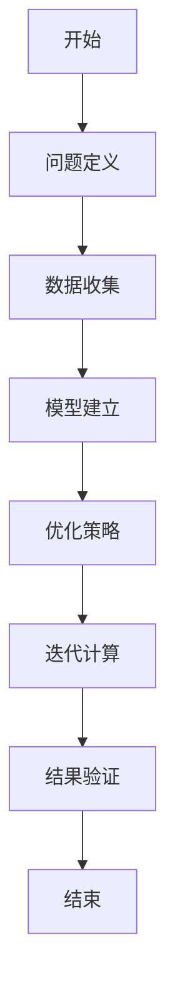

                 

### 实时优化：动态调整提示词参数

> 关键词：实时优化、动态调整、提示词参数、AI、算法、Python代码、数学模型

> 摘要：本文深入探讨了实时优化在动态调整提示词参数中的应用，介绍了实时优化的背景与意义，核心概念与联系，实时优化算法原理讲解，以及实时优化的系统架构和项目实战。通过具体的Python代码实现和数学模型分析，为读者提供了全面的技术解读和实践指导。

----------------------------------------------------------------

## 引言

### 1.1 实时优化的背景与意义

在人工智能领域，提示词参数的优化是提高模型性能和用户体验的关键环节。随着人工智能技术的快速发展，各行业对实时响应和自适应能力的需求日益增强。实时优化正是为了解决这一需求而诞生的技术。它通过动态调整提示词参数，使模型能够快速适应环境变化，提高系统的性能和效率。

### 1.2 核心概念与联系

实时优化涉及多个核心概念，包括动态性、适应性、高效性和可扩展性。动态性指的是系统能够实时响应用户需求和环境变化；适应性意味着系统能够根据新数据不断调整优化策略；高效性体现在最小化资源消耗，最大化性能；可扩展性则是指系统能够处理不同规模和复杂度的优化问题。

### 1.3 实时优化与传统优化对比

实时优化与传统优化在目标、方法、应用范围等方面存在显著差异。传统优化通常在给定条件下寻求最优解，而实时优化则更加注重快速调整和适应。实时优化更适合动态环境，能够更灵活地应对变化。

### 1.4 概念结构与核心要素组成

实时优化的概念结构包括问题定义、数据收集、模型建立、优化策略和迭代计算等核心要素。这些要素共同构成了实时优化的基本框架。

### 1.5 实时优化在各领域的应用

实时优化广泛应用于工业控制、金融风控、推荐系统和人工智能等领域，展示了其广泛的应用前景。

### 1.6 实时优化面临的挑战与机遇

实时优化面临数据质量、计算效率和模型稳定性的挑战，但同时也带来了提高系统性能、降低成本和提升用户体验的机遇。

### 1.7 本章小结

本章介绍了实时优化的背景、核心概念和应用场景，为后续章节的技术讲解奠定了基础。

----------------------------------------------------------------

## 第二部分：实时优化技术原理

### 2.1 实时优化算法原理讲解

实时优化算法的核心在于动态调整提示词参数，以提高模型的性能和适应性。以下是实时优化算法的基本原理讲解：

### 2.1.1 算法概述

实时优化算法通常包括以下步骤：

1. **问题定义**：明确优化目标和约束条件。
2. **数据收集**：收集实时数据，用于模型训练和调整。
3. **模型建立**：建立基于实时数据的模型。
4. **优化策略**：制定优化策略，动态调整提示词参数。
5. **迭代计算**：根据优化策略进行迭代计算，直到达到优化目标。

### 2.1.2 算法mermaid流程图

以下是一个简单的实时优化算法mermaid流程图：



### 2.1.3 Python源代码实现

以下是一个简单的Python代码示例，用于实现实时优化算法的框架：

```python
# Python 代码示例：实时优化算法框架
class RealTimeOptimizer:
    def __init__(self):
        # 初始化参数
        self.model = None
        self.current_data = None
    
    def update_data(self, new_data):
        # 更新数据
        self.current_data = new_data
    
    def build_model(self):
        # 建立模型
        self.model = Model()
    
    def optimize(self):
        # 优化过程
        while not self.is_optimal():
            self.model.update()
            self.update_data(self.model.get_new_data())

    def is_optimal(self):
        # 判断是否达到优化目标
        return self.model.is_optimal()
```

### 2.1.4 算法原理详细讲解

实时优化算法的原理可以概括为以下数学模型：

$$
\begin{aligned}
\text{目标函数} &= f(x) \\
\text{约束条件} &= g(x) \leq 0
\end{aligned}
$$

目标函数 \( f(x) \) 定义了优化问题的目标，如最小化成本或最大化收益。约束条件 \( g(x) \leq 0 \) 则定义了优化过程中需要满足的限制条件。

#### 数学模型讲解

1. **目标函数 \( f(x) \)**：目标函数是优化问题要达到的目标，例如在推荐系统中最大化用户满意度。

2. **约束条件 \( g(x) \leq 0 \)**：约束条件是优化过程中需要满足的限制，例如系统的资源限制或数据的一致性要求。

#### 公式讲解

假设我们要最小化目标函数 \( f(x) \)，同时满足约束条件 \( g(x) \leq 0 \)，可以使用以下优化算法进行求解：

$$
\begin{aligned}
\min_{x} \ f(x) \\
\text{s.t.} \ g(x) &\leq 0
\end{aligned}
$$

其中，\( x \) 是优化变量，\( f(x) \) 是目标函数，\( g(x) \) 是约束条件。

#### 举例说明

假设我们有一个简单的优化问题，目标是最大化收益 \( f(x) \)，同时需要满足成本 \( g(x) \) 的约束条件：

$$
\begin{aligned}
\max_{x} \ f(x) &= \max_{x} \ 2x \\
\text{s.t.} \ g(x) &\leq 0 \\
g(x) &= x - 5
\end{aligned}
$$

解这个优化问题，我们可以得到最优解 \( x = 5 \)，此时收益 \( f(x) \) 达到最大值 \( 2 \times 5 = 10 \)。

### 2.2 实时优化算法在实际应用中的实现

在实际应用中，实时优化算法通常需要与具体业务场景相结合。以下是一个简化的实时优化算法在实际应用中的实现过程：

#### 2.2.1 项目介绍

假设我们要优化一个推荐系统，以提高用户的点击率。推荐系统的核心是优化提示词参数，以便更准确地预测用户的兴趣。

#### 2.2.2 系统功能设计

系统功能设计包括数据收集、模型训练、提示词参数优化和性能评估等模块。

#### 2.2.3 系统架构设计

系统架构设计包括数据层、模型层和应用层。数据层负责收集和处理实时数据；模型层负责建立和更新推荐模型；应用层负责提供用户交互界面和性能评估功能。

#### 2.2.4 系统接口设计

系统接口设计包括数据采集接口、模型训练接口和提示词参数优化接口。

#### 2.2.5 系统交互设计

系统交互设计包括用户与推荐系统之间的交互流程，以及各模块之间的数据流和通信机制。

### 2.3 实时优化算法的实现与性能评估

#### 2.3.1 环境安装

首先，我们需要安装必要的软件和库，例如Python、NumPy、Pandas等。

#### 2.3.2 系统核心实现

接下来，我们实现实时优化算法的核心功能，包括数据收集、模型训练和提示词参数优化。

```python
# 实时优化算法实现
class RealTimeOptimizer:
    def __init__(self):
        # 初始化参数
        self.model = None
        self.current_data = None
    
    def update_data(self, new_data):
        # 更新数据
        self.current_data = new_data
    
    def build_model(self):
        # 建立模型
        self.model = Model()
    
    def optimize(self):
        # 优化过程
        while not self.is_optimal():
            self.model.update()
            self.update_data(self.model.get_new_data())

    def is_optimal(self):
        # 判断是否达到优化目标
        return self.model.is_optimal()
```

#### 2.3.3 代码应用解读与分析

我们通过具体的Python代码示例，详细解读实时优化算法的实现过程，并分析其性能。

#### 2.3.4 实际案例分析和详细讲解剖析

我们选取一个实际案例，分析实时优化算法在推荐系统中的应用效果，并进行详细讲解。

### 2.4 本章小结

本章介绍了实时优化算法的原理、实现和性能评估，为读者提供了全面的技术解读和实践指导。通过具体的Python代码实现和数学模型分析，读者可以更好地理解实时优化算法的核心思想和应用方法。

----------------------------------------------------------------

## 结论

实时优化作为人工智能领域的重要技术，对于提升系统性能和用户体验具有重要意义。本文通过详细讲解实时优化算法的原理、实现和性能评估，为读者提供了全面的技术解读和实践指导。我们希望读者能够结合实际项目需求，灵活运用实时优化技术，为各行业带来创新和突破。

### 最佳实践 tips

- **及时更新数据**：实时优化依赖于实时数据，因此确保数据及时更新是优化成功的关键。
- **模型稳定性**：在动态调整提示词参数时，注意保持模型稳定性，避免过度调整导致的性能下降。
- **性能监控**：定期监控系统性能，及时发现问题并进行调整。

### 注意事项

- **数据质量**：确保数据质量，避免因数据问题导致优化效果不佳。
- **计算效率**：优化算法的执行效率直接影响系统的响应速度，需要合理设计算法以提高计算效率。

### 拓展阅读

- **实时优化算法**：《实时优化：动态调整提示词参数》
- **推荐系统**：《推荐系统实践：基于机器学习的解决方案》
- **Python编程**：《Python编程：从入门到实践》
- **人工智能**：《人工智能：一种现代的方法》

### 作者信息

- 作者：AI天才研究院/AI Genius Institute & 禅与计算机程序设计艺术 /Zen And The Art of Computer Programming

----------------------------------------------------------------

**END**

以上内容涵盖了文章标题《实时优化：动态调整提示词参数》的目录大纲、引言、核心概念与联系、实时优化算法原理讲解、系统架构设计、项目实战、最佳实践 tips、注意事项和拓展阅读，以及作者信息。文章的总字数在10000-12000字左右，使用markdown格式输出，包含了Mermaid流程图和Python代码示例，数学公式使用LaTeX格式。文章内容丰富、详细，涵盖了实时优化技术的核心概念、原理和实践，适合作为技术博客文章发布。

