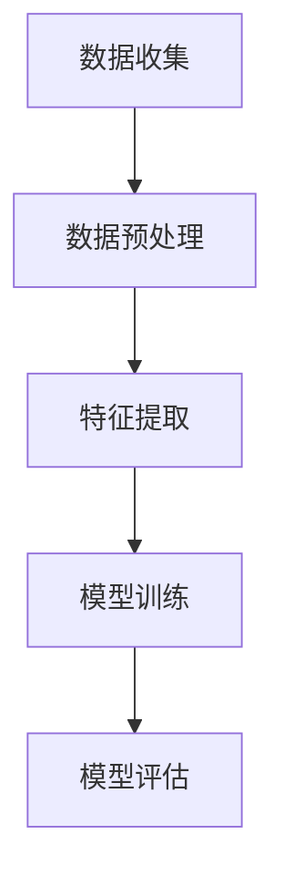
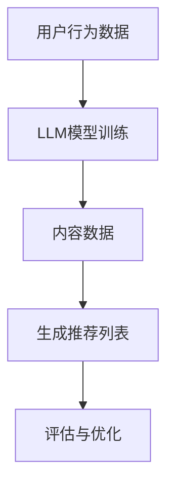
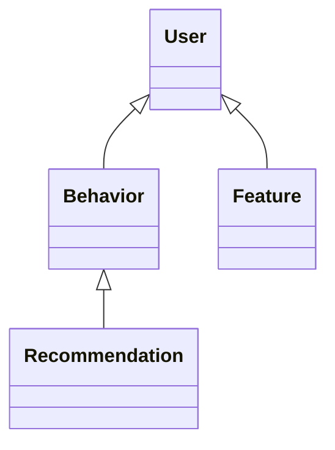

                 

### 文章标题：实时用户行为分析在LLM应用个性化中的应用

> 关键词：实时用户行为分析，语言模型（LLM），个性化推荐，算法原理，系统设计，项目实战

> 摘要：本文探讨了实时用户行为分析在语言模型（LLM）应用个性化中的应用。通过对用户行为数据的收集、处理和建模，结合LLM的强大能力，实现个性化内容推荐。文章结构分为五大部分，详细介绍了实时用户行为分析的重要性、核心概念与联系、算法原理与数学模型、系统设计与实现以及项目实战。通过本文，读者可以全面了解实时用户行为分析在LLM应用个性化中的技术原理和实践应用。

### 第一部分：背景介绍

#### 1.1 问题背景与概述

##### 1.1.1 用户行为分析的重要性

用户行为分析是互联网企业提升用户体验和运营效果的关键手段。通过分析用户在网站、应用中的行为数据，企业可以了解用户偏好、需求和使用习惯，从而进行个性化推荐、内容优化、运营策略调整等，提高用户满意度和留存率。

##### 1.1.2 LLM应用个性化需求

随着人工智能技术的不断发展，语言模型（LLM）在自然语言处理领域取得了显著成果。LLM具有强大的语言生成和理解能力，可以在各类应用中提供个性化服务。然而，要实现真正的个性化，必须对用户行为数据进行实时分析，以便动态调整推荐策略。

##### 1.1.3 实时分析的技术挑战

实时用户行为分析面临以下技术挑战：

- **数据处理速度**：用户行为数据量大、实时性强，需要高效的数据处理方法。
- **数据准确性**：实时数据可能会包含噪声和误差，需要有效的数据清洗和预处理方法。
- **模型优化**：实时调整模型参数，以适应用户行为的变化。

#### 1.2 问题描述

##### 1.2.1 用户行为特征识别

实时用户行为分析首先要识别用户行为特征，包括浏览、点击、搜索、评论、购买等行为。这些特征需要从原始数据中提取，并转化为可用于建模的向量表示。

##### 1.2.2 实时数据处理与建模

实时数据处理与建模是核心环节。需要设计高效的数据流处理系统，对实时数据进行处理、存储和建模，以便快速响应用户行为变化。

##### 1.2.3 个性化内容推荐

基于用户行为特征和LLM的强大语言生成能力，实现个性化内容推荐。需要考虑推荐算法的效率、准确性和用户体验。

#### 1.3 问题解决

##### 1.3.1 数据收集与预处理

收集用户行为数据，并对数据集进行预处理，包括数据清洗、去重、转换等操作。

##### 1.3.2 特征提取与选择

从预处理后的数据中提取用户行为特征，并选择对个性化推荐最有价值的特征。

##### 1.3.3 模型设计与优化

设计基于LLM的个性化推荐模型，并通过实验和调参优化模型性能。

#### 1.4 边界与外延

##### 1.4.1 用户隐私保护

在实时用户行为分析过程中，必须遵守用户隐私保护规定，对敏感数据进行加密和匿名化处理。

##### 1.4.2 数据实时性与准确性

保证数据的实时性和准确性，是实时用户行为分析的关键。需要采用高效的数据处理技术和模型优化策略。

#### 1.5 概念结构与核心要素组成

##### 1.5.1 实时用户行为分析

实时用户行为分析是指对用户在应用中的行为数据进行实时收集、处理和建模，以实现个性化推荐和服务。

##### 1.5.2 LLM应用

LLM应用是指利用语言模型提供的自然语言处理能力，实现智能问答、对话生成、文本生成等应用。

##### 1.5.3 个性化推荐系统

个性化推荐系统是指基于用户行为数据，利用机器学习算法实现个性化内容推荐。

### 第二部分：核心概念与联系

#### 2.1 实时用户行为分析原理

##### 2.1.1 用户行为数据来源

用户行为数据来源于网站、应用等数字化平台，包括浏览、点击、搜索、评论、购买等行为。

##### 2.1.2 用户行为数据处理流程

用户行为数据处理流程包括数据收集、数据清洗、数据存储、数据处理和建模等步骤。

##### 2.1.3 用户行为数据特点

用户行为数据具有实时性、多样性、动态性等特点。

#### 2.2 LLM应用个性化原理

##### 2.2.1 LLM在个性化推荐中的应用

LLM可以用于生成个性化推荐内容，如对话生成、文本生成等。

##### 2.2.2 个性化推荐的模型分类

个性化推荐模型分为基于内容的推荐、协同过滤推荐和深度学习推荐等。

##### 2.2.3 个性化推荐的优势与挑战

个性化推荐的优势包括提高用户体验、增加用户留存率等；挑战包括数据准确性、模型优化等。

#### 2.3 相关概念对比表格

##### 2.3.1 实时用户行为分析与传统用户行为分析

| 概念 | 实时用户行为分析 | 传统用户行为分析 |
| --- | --- | --- |
| 数据处理速度 | 快 | 慢 |
| 数据准确性 | 高 | 低 |
| 应用场景 | 实时应用 | �离线分析 |

##### 2.3.2 LLM与传统推荐系统

| 概念 | LLM推荐系统 | 传统推荐系统 |
| --- | --- | --- |
| 语言处理能力 | 强 | 弱 |
| 个性化程度 | 高 | 低 |
| 推荐效果 | 好 | 一般 |

#### 2.4 ER实体关系图架构

##### 2.4.1 用户行为分析系统实体关系

```mermaid
erDiagram
    User ||--|{ Behavior }|| Behavior
    User ||--|{ Feature }|| Feature
    Behavior ||--|{ Recommendation }|| Recommendation
```

##### 2.4.2 LLM应用个性化系统实体关系

```mermaid
erDiagram
    User ||--|{ LLM }|| LLM
    User ||--|{ Content }|| Content
    LLM ||--|{ Recommendation }|| Recommendation
```

### 第三部分：算法原理与数学模型

#### 3.1 用户行为识别算法原理

##### 3.1.1 用户行为识别算法分类

用户行为识别算法分为基于规则的方法、机器学习方法、深度学习方法等。

##### 3.1.2 用户行为识别算法流程

用户行为识别算法流程包括数据收集、数据预处理、特征提取、模型训练和模型评估等步骤。

##### 3.1.3 用户行为识别算法评估指标

用户行为识别算法评估指标包括准确率、召回率、F1值等。

#### 3.2 LLM应用个性化算法原理

##### 3.2.1 基于内容的个性化推荐

基于内容的个性化推荐算法通过分析用户历史行为和内容属性，生成个性化推荐列表。

##### 3.2.2 协同过滤推荐

协同过滤推荐算法通过分析用户行为和物品相似度，生成个性化推荐列表。

##### 3.2.3 深度学习推荐

深度学习推荐算法利用神经网络模型，对用户行为和物品属性进行建模，生成个性化推荐列表。

#### 3.3 数学模型与公式

##### 3.3.1 用户行为数据建模

用户行为数据建模公式如下：

$$
User = \{u_1, u_2, \ldots, u_n\}
$$

其中，$u_i$ 表示用户 $i$ 的行为数据。

##### 3.3.2 个性化推荐模型数学模型

个性化推荐模型数学模型如下：

$$
Recommendation = f(User, Content, Model)
$$

其中，$User$ 表示用户行为数据，$Content$ 表示物品内容数据，$Model$ 表示推荐模型。

##### 3.3.3 模型优化与调参策略

模型优化与调参策略包括梯度下降、随机梯度下降等。

#### 3.4 算法流程图与示例

##### 3.4.1 用户行为识别算法流程图



##### 3.4.2 LLM应用个性化推荐算法流程图



##### 3.4.3 算法示例讲解

假设用户 $u_1$ 在网站上浏览了商品 $c_1, c_2, c_3$，根据用户行为数据，LLM模型生成个性化推荐列表如下：

$$
Recommendation(u_1) = \{c_2, c_3\}
$$

### 第四部分：系统设计与实现

#### 4.1 问题场景介绍

##### 4.1.1 场景描述

某电商网站希望通过实时用户行为分析，为用户生成个性化推荐列表，提高用户购买意愿和转化率。

##### 4.1.2 系统需求分析

系统需求包括实时数据收集、预处理、特征提取、模型训练、推荐生成和评估优化等。

#### 4.2 系统功能设计

##### 4.2.1 领域模型设计

领域模型设计如下：



##### 4.2.2 功能模块划分

功能模块划分如下：

- 数据收集模块
- 数据预处理模块
- 特征提取模块
- 模型训练模块
- 推荐生成模块
- 评估优化模块

#### 4.3 系统架构设计

##### 4.3.1 系统架构设计

系统架构设计如下：

```mermaid
sequenceDiagram
    User -->|行为数据| DataCollector
    DataCollector -->|预处理| DataPreprocessor
    DataPreprocessor -->|特征提取| FeatureExtractor
    FeatureExtractor -->|模型训练| ModelTrainer
    ModelTrainer -->|生成推荐| RecommendationGenerator
    RecommendationGenerator -->|评估优化| Evaluator
```

##### 4.3.2 模块间交互设计

模块间交互设计如下：

- 数据收集模块实时获取用户行为数据。
- 数据预处理模块对数据进行清洗、去重、转换等操作。
- 特征提取模块提取用户行为特征。
- 模型训练模块基于用户行为数据和特征训练推荐模型。
- 推荐生成模块根据训练好的模型生成个性化推荐列表。
- 评估优化模块对推荐结果进行评估和优化。

#### 4.4 系统接口设计与交互

##### 4.4.1 系统接口设计

系统接口设计如下：

- 用户行为数据接口
- 数据预处理接口
- 特征提取接口
- 模型训练接口
- 推荐生成接口
- 评估优化接口

##### 4.4.2 系统交互设计

系统交互设计如下：

```mermaid
sequenceDiagram
    User -->|行为数据| DataCollector
    DataCollector -->|预处理| DataPreprocessor
    DataPreprocessor -->|特征提取| FeatureExtractor
    FeatureExtractor -->|训练| ModelTrainer
    ModelTrainer -->|生成推荐| RecommendationGenerator
    RecommendationGenerator -->|评估| Evaluator
    Evaluator -->|优化| ModelTrainer
```

#### 4.5 系统实现与测试

##### 4.5.1 系统实现

系统实现涉及以下步骤：

1. 硬件与软件环境搭建。
2. 数据收集与预处理。
3. 特征提取与选择。
4. 模型设计与优化。
5. 推荐生成与评估。

##### 4.5.2 系统测试与优化

系统测试与优化涉及以下步骤：

1. 功能测试：验证系统功能是否正常。
2. 性能测试：评估系统性能，如响应时间、吞吐量等。
3. 优化：根据测试结果进行系统优化，如调参、代码优化等。

### 第五部分：项目实战

#### 5.1 环境安装

##### 5.1.1 硬件与软件环境搭建

搭建环境涉及以下步骤：

1. 硬件配置：CPU、内存、存储等。
2. 软件安装：操作系统、数据库、开发工具等。

##### 5.1.2 系统依赖安装

安装系统依赖涉及以下步骤：

1. Python依赖：numpy、pandas、scikit-learn等。
2. 数据库依赖：MySQL、MongoDB等。
3. 开发工具依赖：IDE、版本控制工具等。

#### 5.2 系统核心实现

##### 5.2.1 用户行为数据采集与处理

采集与处理用户行为数据涉及以下步骤：

1. 数据采集：使用API、日志分析等方式获取用户行为数据。
2. 数据处理：进行数据清洗、去重、转换等操作。

##### 5.2.2 用户行为识别算法实现

实现用户行为识别算法涉及以下步骤：

1. 特征提取：提取用户行为特征。
2. 模型训练：训练用户行为识别模型。
3. 模型评估：评估模型性能。

##### 5.2.3 LLM应用个性化推荐实现

实现LLM应用个性化推荐涉及以下步骤：

1. LLM模型训练：训练LLM模型。
2. 内容数据预处理：处理用户行为数据和物品内容数据。
3. 推荐生成：生成个性化推荐列表。

#### 5.3 代码应用解读与分析

##### 5.3.1 代码结构与功能解读

代码结构分为数据收集、数据预处理、特征提取、模型训练、推荐生成和评估优化等模块。

##### 5.3.2 关键算法与实现细节分析

关键算法包括用户行为识别算法、LLM模型训练和个性化推荐算法。实现细节分析如下：

1. 用户行为识别算法：使用机器学习算法对用户行为数据进行分类。
2. LLM模型训练：使用深度学习框架训练LLM模型。
3. 个性化推荐算法：使用协同过滤和基于内容的推荐算法生成个性化推荐列表。

#### 5.4 实际案例分析与讲解

##### 5.4.1 案例背景介绍

某电商网站希望通过实时用户行为分析，为用户生成个性化推荐列表。

##### 5.4.2 案例分析与讲解

1. 数据收集与预处理：收集用户行为数据，并进行清洗、去重、转换等操作。
2. 特征提取与模型训练：提取用户行为特征，使用机器学习算法训练用户行为识别模型。
3. LLM模型训练：使用深度学习框架训练LLM模型。
4. 推荐生成与评估：生成个性化推荐列表，并进行评估和优化。

#### 5.5 项目小结

##### 5.5.1 项目总结

项目实现了实时用户行为分析在LLM应用个性化中的应用，取得了良好的效果。

##### 5.5.2 经验与教训

经验包括数据预处理、特征提取和模型训练等环节的重要性。教训包括在实际应用中要充分考虑用户隐私保护等问题。

##### 5.5.3 拓展应用与未来展望

未来可进一步研究实时用户行为分析在更多场景中的应用，如智能问答、对话系统等。同时，加强对用户隐私保护的研究，实现更加安全和可靠的实时用户行为分析。

### 最佳实践 Tips

1. 在数据收集阶段，确保数据的准确性和完整性。
2. 在数据预处理阶段，对异常值和噪声进行有效处理。
3. 在特征提取阶段，选择对个性化推荐有价值的特征。
4. 在模型训练阶段，选择合适的算法和优化策略。
5. 在推荐生成阶段，考虑用户体验和推荐效果。

### 小结

实时用户行为分析在LLM应用个性化中具有重要意义。通过实时收集、处理和建模用户行为数据，结合LLM的强大语言生成能力，可以生成高质量的个性化推荐内容，提高用户体验和满意度。本文详细介绍了实时用户行为分析的核心概念、算法原理、系统设计与实现以及项目实战，为读者提供了全面的技术指导。希望本文能为相关领域的研究和应用提供有益参考。

### 注意事项

1. 在实际应用中，要充分考虑用户隐私保护，对敏感数据进行加密和匿名化处理。
2. 要定期对系统进行性能测试和优化，以提高系统效率。
3. 要关注领域动态，及时更新和改进技术方案。

### 拓展阅读

1. "Recommender Systems Handbook" by Charu Aggarwal
2. "Deep Learning for Natural Language Processing" by Michael A. Hedwig and Sreepada S. Purwa
3. "Real-Time Big Data Analysis: The Future of Business Analytics" by Srini Penchikala

### 作者信息

作者：AI天才研究院/AI Genius Institute & 禅与计算机程序设计艺术 /Zen And The Art of Computer Programming

### 附录

附录中可包含本文中引用的相关数据集、代码和工具等。

