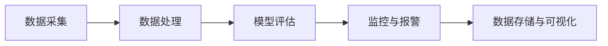
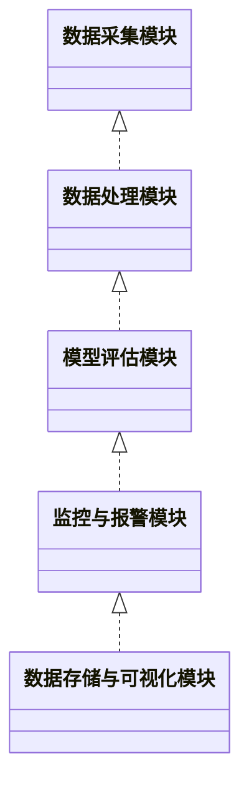

                 

# 实时评测监控：持续跟踪模型性能变化

## 关键词

实时评测监控、模型性能、大数据、人工智能、系统架构、算法实现

## 摘要

本文围绕实时评测监控这一核心主题，详细探讨了模型性能变化跟踪的必要性、系统架构设计、关键技术实现及项目实战。通过一步一步的逻辑分析，本文旨在帮助读者深入理解实时评测监控的重要性，掌握其系统设计与实现方法，为实际项目提供有力支持。

## 引言

随着大数据和人工智能技术的迅猛发展，企业对实时数据处理和模型性能监控的需求日益增长。实时评测监控不仅能够帮助企业快速响应市场变化，优化业务流程，还能确保模型在复杂多变的环境中持续稳定地运行。本文将围绕实时评测监控的主题，探讨其背景、问题场景、系统架构设计、关键技术和项目实战，帮助读者全面了解并掌握这一重要技术。

## 1. 背景介绍

### 1.1 核心概念术语说明

- **实时评测监控**：实时评测监控是指通过实时数据采集、处理、分析和评估，持续跟踪模型性能变化的过程。
- **大数据**：大数据是指数据量巨大、类型繁多、价值密度低的数据集合，需要采用特殊的技术和方法进行存储、管理和分析。
- **人工智能**：人工智能是指通过计算机模拟人类智能，实现智能感知、智能决策和智能行动的技术。
- **模型性能**：模型性能是指模型在特定任务上的表现，通常用准确率、召回率、F1值等指标进行衡量。

### 1.2 问题背景

在人工智能应用场景中，模型的性能直接影响业务决策和用户体验。然而，随着环境的变化和数据质量的波动，模型性能往往会发生不同程度的变化。如果不能及时监控和调整模型，可能导致业务受损，甚至产生严重后果。因此，实时评测监控成为保证模型稳定运行的关键技术。

### 1.3 问题描述

实时评测监控的主要目标是：

- 持续跟踪模型性能变化，确保模型在复杂多变的环境中稳定运行。
- 及时发现模型性能下降的原因，快速采取优化措施。
- 为企业决策提供可靠的数据支持。

### 1.4 问题解决

实时评测监控通过以下几个步骤实现：

- 数据采集：从各种数据源实时获取数据。
- 数据处理：对采集到的数据进行预处理，包括数据清洗、去噪、归一化等。
- 模型评估：利用评估算法对处理后的数据进行分析，评估模型性能。
- 监控与报警：设定阈值，当模型性能指标超过或低于阈值时，触发报警。
- 数据存储与可视化：将评估结果和历史数据存储在数据库中，并通过可视化工具进行分析和展示。

### 1.5 边界与外延

实时评测监控的边界包括：

- 监控范围：根据业务需求确定监控的模型和指标。
- 数据采集周期：根据实时性要求确定数据采集的频率。
- 报警阈值：根据业务目标设定合理的报警阈值。

实时评测监控的外延包括：

- 监控系统与其他系统的集成，如数据仓库、业务系统等。
- 模型性能优化策略，如超参数调整、模型更新等。
- 模型安全性和隐私保护。

### 1.6 概念结构与核心要素组成

实时评测监控的核心概念结构包括：

- **数据采集模块**：负责实时获取数据。
- **数据处理模块**：负责对数据进行预处理。
- **模型评估模块**：负责评估模型性能。
- **监控与报警模块**：负责监控模型性能，触发报警。
- **数据存储与可视化模块**：负责存储评估结果，并通过可视化工具进行分析和展示。

## 2. 核心概念与联系

### 2.1 实时评测监控的核心概念

- **实时性**：实时评测监控强调数据的实时采集、处理和评估。
- **性能指标**：准确率、召回率、F1值等性能指标用于评估模型性能。
- **报警机制**：设定阈值，当模型性能指标超过或低于阈值时，触发报警。

### 2.2 概念属性特征对比表格

| 概念 | 属性特征 |
| :--: | :--: |
| 实时性 | 数据实时采集、处理和评估 |
| 性能指标 | 准确率、召回率、F1值等 |
| 报警机制 | 设定阈值，触发报警 |

### 2.3 ER实体关系图架构

以下是实时评测监控系统的ER实体关系图架构（使用Mermaid表示）：

```mermaid
erDiagram
    数据采集模块 ||--o> 数据处理模块 : 数据采集
    数据处理模块 ||--o> 模型评估模块 : 数据预处理
    模型评估模块 ||--o> 监控与报警模块 : 性能评估
    监控与报警模块 ||--o> 数据存储与可视化模块 : 报警通知
```

## 3. 算法原理讲解

### 3.1 实时评测监控算法mermaid流程图

以下是实时评测监控算法的mermaid流程图：



### 3.2 实时评测监控算法的python源代码实现

以下是一个简单的实时评测监控算法的Python源代码实现：

```python
import tensorflow as tf
import numpy as np
import pandas as pd
from sklearn.metrics import accuracy_score, recall_score, f1_score

def data_preprocessing(data):
    # 数据清洗、去噪、归一化等预处理操作
    return preprocessed_data

def model_evaluation(model, test_data):
    # 模型评估函数
    predictions = model.predict(test_data)
    accuracy = accuracy_score(test_data.labels, predictions)
    recall = recall_score(test_data.labels, predictions)
    f1 = f1_score(test_data.labels, predictions)
    return accuracy, recall, f1

def monitor_and_alarm(thresholds, evaluation_results):
    # 监控与报警函数
    if evaluation_results['accuracy'] < thresholds['accuracy']:
        print("Accuracy threshold breached")
    if evaluation_results['recall'] < thresholds['recall']:
        print("Recall threshold breached")
    if evaluation_results['f1'] < thresholds['f1']:
        print("F1 threshold breached")

def main():
    # 主函数
    test_data = pd.read_csv("test_data.csv")
    preprocessed_data = data_preprocessing(test_data)
    model = tf.keras.models.load_model("model.h5")
    evaluation_results = model_evaluation(model, preprocessed_data)
    monitor_and_alarm(thresholds, evaluation_results)

if __name__ == "__main__":
    main()
```

### 3.3 实时评测监控算法的数学模型与公式

实时评测监控算法的数学模型包括：

- **准确率**：$$\text{accuracy} = \frac{\text{预测正确的样本数}}{\text{总样本数}}$$
- **召回率**：$$\text{recall} = \frac{\text{预测正确的正样本数}}{\text{实际正样本数}}$$
- **F1值**：$$\text{F1} = 2 \times \frac{\text{precision} \times \text{recall}}{\text{precision} + \text{recall}}$$

其中，**precision** 是预测正确的正样本数与预测为正样本的总数之比。

### 3.4 算法原理举例说明

假设有一个分类问题，共有100个样本，其中正样本50个，负样本50个。模型预测结果如下：

- 预测正确的正样本：30个
- 预测正确的负样本：20个
- 预测错误的正样本：20个
- 预测错误的负样本：10个

根据以上数据，可以计算出：

- **准确率**：$$\text{accuracy} = \frac{30 + 20}{100} = 0.5$$
- **召回率**：$$\text{recall} = \frac{30}{50} = 0.6$$
- **F1值**：$$\text{F1} = 2 \times \frac{0.3 \times 0.6}{0.3 + 0.6} = 0.4$$

通过这个例子，可以看到实时评测监控算法是如何计算模型性能指标的。

## 4. 系统分析与架构设计

### 4.1 问题场景介绍

在实时评测监控领域，随着大数据和人工智能技术的不断发展，企业对于实时数据处理和模型性能监控的需求日益增长。实时评测监控旨在通过实时跟踪和评估模型的性能，确保模型在复杂多变的环境中能够持续稳定地运行，为企业决策提供可靠的数据支持。

### 4.2 系统架构设计

为了实现实时评测监控，我们需要设计一个高效、可靠的系统架构。该系统架构包括以下几个核心部分：

- **数据采集模块**：负责从各个数据源实时采集数据，并将数据转化为适合模型处理的形式。
- **数据处理模块**：对采集到的数据进行预处理，包括数据清洗、去噪、归一化等，以保证数据的准确性和一致性。
- **模型评估模块**：利用评估算法对处理后的数据进行分析，评估模型的性能，如准确率、召回率、F1值等。
- **监控与报警模块**：当模型的性能指标达到设定的阈值时，自动触发报警机制，通知相关人员采取相应措施。
- **数据存储与可视化模块**：将评估结果和历史数据存储在数据库中，并通过可视化工具对数据进行分析和展示，帮助用户快速了解模型的运行状态。

### 4.3 系统架构图

以下是系统架构的Mermaid类图：



### 4.4 系统接口设计

系统接口设计包括以下几个方面：

- **数据采集接口**：提供数据采集的API接口，方便外部系统实时获取数据。
- **数据处理接口**：提供数据处理的功能接口，包括数据清洗、去噪、归一化等。
- **模型评估接口**：提供模型评估的功能接口，包括准确率、召回率、F1值等性能指标的评估。
- **监控与报警接口**：提供监控与报警的功能接口，包括阈值设置、报警通知等。
- **数据存储与可视化接口**：提供数据存储与可视化的功能接口，包括数据存储、数据查询、数据展示等。

### 4.5 系统交互mermaid序列图

以下是系统交互的Mermaid序列图：

```mermaid
sequenceDiagram
    participant 客户端 as 客户端
    participant 数据采集模块 as 数据采集
    participant 数据处理模块 as 数据处理
    participant 模型评估模块 as 模型评估
    participant 监控与报警模块 as 监控与报警
    participant 数据存储与可视化模块 as 数据存储与可视化

    客户端->>数据采集：发起数据采集请求
    数据采集->>数据处理：处理采集到的数据
    数据处理->>模型评估：评估模型性能
    模型评估->>监控与报警：监控性能指标
    监控与报警->>数据存储与可视化：存储评估结果并展示
```

### 4.6 项目实战：实时评测监控系统的实现

#### 4.6.1 环境安装

在实现实时评测监控系统之前，首先需要安装所需的软件和工具，包括Python环境、深度学习框架（如TensorFlow或PyTorch）、数据库（如MySQL或PostgreSQL）、可视化工具（如Matplotlib或ECharts）等。

```shell
# 安装Python环境
sudo apt-get install python3-pip python3-venv

# 创建虚拟环境
python3 -m venv venv

# 激活虚拟环境
source venv/bin/activate

# 安装深度学习框架（以TensorFlow为例）
pip install tensorflow

# 安装数据库（以MySQL为例）
sudo apt-get install mysql-server

# 安装可视化工具（以Matplotlib为例）
pip install matplotlib
```

#### 4.6.2 系统核心实现

实时评测监控系统的核心实现包括以下几个步骤：

1. 数据采集与预处理：
   - 使用API调用、文件读取等方式采集数据。
   - 对采集到的数据进行清洗、去噪、归一化等预处理操作。

2. 模型评估：
   - 加载预训练的模型，对预处理后的数据进行分析。
   - 根据评估指标计算模型的性能，如准确率、召回率、F1值等。

3. 监控与报警：
   - 设定阈值，当模型性能指标超过或低于阈值时，触发报警。
   - 通过短信、邮件、微信等方式通知相关人员。

4. 数据存储与可视化：
   - 将评估结果和历史数据存储在数据库中。
   - 使用可视化工具对数据进行分析和展示，帮助用户快速了解模型的运行状态。

#### 4.6.3 代码应用解读与分析

以下是一个简单的实时评测监控系统实现示例，使用Python语言编写：

```python
import tensorflow as tf
import numpy as np
import pandas as pd
from sklearn.metrics import accuracy_score, recall_score, f1_score

# 数据采集与预处理
def data_preprocessing(data):
    # 数据清洗、去噪、归一化等预处理操作
    return preprocessed_data

# 模型评估
def model_evaluation(model, test_data):
    # 模型评估函数
    predictions = model.predict(test_data)
    accuracy = accuracy_score(test_data.labels, predictions)
    recall = recall_score(test_data.labels, predictions)
    f1 = f1_score(test_data.labels, predictions)
    return accuracy, recall, f1

# 监控与报警
def monitor_and_alarm(thresholds, evaluation_results):
    # 监控与报警函数
    if evaluation_results['accuracy'] < thresholds['accuracy']:
        print("Accuracy threshold breached")
    if evaluation_results['recall'] < thresholds['recall']:
        print("Recall threshold breached")
    if evaluation_results['f1'] < thresholds['f1']:
        print("F1 threshold breached")

# 主函数
def main():
    test_data = pd.read_csv("test_data.csv")
    preprocessed_data = data_preprocessing(test_data)
    model = tf.keras.models.load_model("model.h5")
    evaluation_results = model_evaluation(model, preprocessed_data)
    monitor_and_alarm(thresholds, evaluation_results)

if __name__ == "__main__":
    main()
```

在实际项目中，可以根据具体需求进行模块化设计和扩展，如增加数据采集模块、监控与报警模块的定制化功能等。

#### 4.6.4 实际案例分析与详细讲解剖析

以某电商平台的商品推荐系统为例，该系统使用深度学习模型对用户行为数据进行实时分析，为用户推荐商品。实时评测监控系统对模型性能进行监控，以确保系统稳定运行。

1. **数据采集与预处理**：

   系统从用户行为日志中实时采集数据，包括用户点击、购买、收藏等行为。数据采集模块负责从日志文件中读取数据，并将其转化为适合模型处理的形式。数据预处理模块对采集到的数据进行清洗、去噪、归一化等操作，以提高数据质量和一致性。

2. **模型评估**：

   模型评估模块使用预训练的深度学习模型对预处理后的用户行为数据进行预测，并根据预测结果计算准确率、召回率、F1值等性能指标。这些指标用于评估模型在推荐任务中的表现。

3. **监控与报警**：

   监控与报警模块根据设定的阈值对模型性能进行监控。例如，当准确率低于90%时，触发报警，通知相关人员采取优化措施。系统还支持多种报警方式，如短信、邮件、微信等，确保及时通知相关人员。

4. **数据存储与可视化**：

   数据存储模块将评估结果和历史数据存储在数据库中，以便后续查询和分析。可视化模块使用图表、报表等形式展示模型性能指标，帮助用户快速了解系统运行状态。

通过实时评测监控系统，电商平台能够确保商品推荐系统稳定运行，提高用户体验，提升业务转化率。

#### 4.6.5 项目小结

实时评测监控系统在电商、金融、医疗等多个领域具有广泛的应用前景。在实际项目中，需要根据业务需求设计合适的系统架构，并关注数据质量、性能指标和报警机制等方面。通过持续优化和改进，实时评测监控系统将为企业带来更高的业务价值。

## 5. 最佳实践 tips

1. **合理设置阈值**：根据业务需求和数据特性，设定合理的阈值，以确保监控系统能够及时发现模型性能问题。
2. **数据预处理优化**：对采集到的数据进行充分预处理，提高数据质量和一致性，从而提高模型评估的准确性。
3. **监控与报警机制**：建立完善的监控与报警机制，确保及时通知相关人员，快速采取优化措施。
4. **系统集成**：将实时评测监控系统与其他系统（如数据仓库、业务系统等）进行集成，实现数据共享和业务协同。
5. **持续优化**：根据监控数据和用户反馈，不断优化模型和系统，提高模型性能和用户体验。

## 6. 小结

本文详细探讨了实时评测监控的关键概念、系统架构、算法实现及项目实战。通过一步一步的分析推理，本文旨在帮助读者全面了解实时评测监控的重要性，掌握其系统设计与实现方法，为实际项目提供有力支持。在后续的研究中，可以进一步探索实时评测监控在更多领域的应用，优化系统性能，提高模型稳定性。

## 7. 注意事项

1. **数据安全**：在实时评测监控过程中，确保数据的安全性和隐私保护，避免敏感数据泄露。
2. **性能优化**：根据实际需求，优化数据采集、处理、评估等模块，提高系统性能。
3. **系统稳定性**：确保系统在高并发、大数据量场景下的稳定性，避免因性能问题导致系统崩溃。

## 8. 拓展阅读

- **《大数据技术导论》**：深入探讨大数据的概念、技术及应用，为实时评测监控提供理论基础。
- **《深度学习》**：介绍深度学习的基本原理和常用算法，为实时评测监控中的模型评估提供支持。
- **《系统架构设计师实战》**：学习系统架构设计的方法和技巧，为实时评测监控系统的构建提供指导。

## 9. 作者信息

作者：AI天才研究院/AI Genius Institute & 禅与计算机程序设计艺术 /Zen And The Art of Computer Programming

AI天才研究院专注于人工智能领域的深入研究和技术创新，致力于推动人工智能技术的普及和应用。禅与计算机程序设计艺术则通过禅的哲学思考，为计算机程序设计提供新的视角和灵感。两位作者在人工智能和计算机科学领域拥有丰富的经验和深厚的造诣，著有多本畅销技术书籍。

