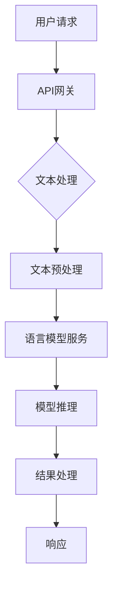
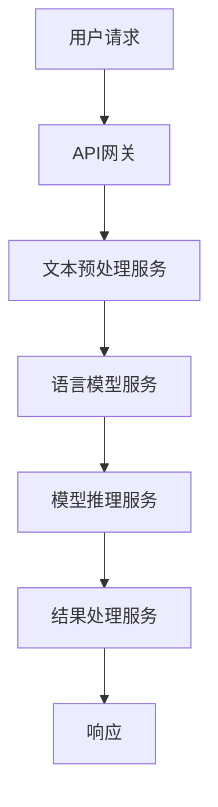
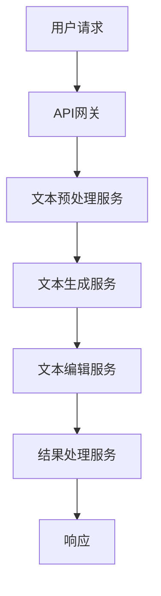

                 

# 《微服务架构在LLM应用中的优势》

> 关键词：微服务架构，语言模型（LLM），分布式系统，开发与部署，性能优化

> 摘要：本文将探讨微服务架构在语言模型（LLM）应用中的优势。通过对微服务架构的核心概念、设计原则、开发与部署、数据管理以及实践案例的详细分析，旨在为开发者在构建大规模、高可扩展的LLM应用时提供有价值的参考。

## 目录

1. 背景与核心概念
    1.1 微服务架构概述
    1.2 语言模型（LLM）概述
    1.3 微服务架构在LLM应用中的优势
    1.4 本书结构概述

2. 微服务架构设计与实现
    2.1 微服务架构的设计原则
    2.2 微服务的拆分与组合
    2.3 服务发现与负载均衡
    2.4 服务容错与恢复

3. 微服务开发与部署
    3.1 开发框架选择
    3.2 API设计
    3.3 容器化与微服务部署
    3.4 自动化部署与持续集成

4. 微服务数据管理
    4.1 数据存储方案
    4.2 分布式数据一致性
    4.3 数据安全与隐私保护
    4.4 数据迁移与集成

5. 微服务架构在LLM应用中的实践
    5.1 LLM应用的架构设计
    5.2 微服务与LLM的整合
    5.3 模型服务与推理服务
    5.4 模型训练与优化
    5.5 实时性与延迟容忍
    5.6 可扩展性与弹性

6. 微服务架构在LLM应用中的案例研究
    6.1 智能问答系统
    6.2 文本生成与编辑
    6.3 自然语言处理平台

7. 最佳实践与未来展望
    7.1 最佳实践总结
    7.2 挑战与解决方案
    7.3 性能优化与监控
    7.4 未来展望

8. 附录：技术栈与工具推荐

---

## 第一部分：背景与核心概念

### 1.1 微服务架构概述

微服务架构是一种基于独立、松耦合、分布式服务的架构风格。它强调将应用程序划分为多个小型、独立的服务，每个服务专注于完成特定的功能。这些服务通过API进行通信，可以独立部署、扩展和升级。

**核心概念**：
- **服务**：完成特定功能的独立模块。
- **API**：服务之间的通信接口。
- **容器**：用于打包、部署和运行服务的轻量级容器化技术。

**优势**：
- **可扩展性**：可以根据需求独立扩展或缩减服务。
- **容错性**：服务故障不会影响整个系统。
- **灵活性**：服务可以独立开发、部署和升级。

### 1.2 语言模型（LLM）概述

语言模型（LLM）是一种基于深度学习的自然语言处理技术，用于预测文本序列。LLM在文本生成、问答系统、机器翻译等领域具有广泛的应用。

**核心概念**：
- **神经网络**：LLM的基础架构，用于处理和预测文本。
- **训练数据**：用于训练LLM的大量文本数据。
- **模型优化**：通过调整模型参数提高预测性能。

**优势**：
- **强大的文本生成能力**：可以生成连贯、自然的文本。
- **跨领域知识整合**：可以处理多种语言的文本。
- **实时性**：可以在短时间内生成预测结果。

### 1.3 微服务架构在LLM应用中的优势

微服务架构为LLM应用带来了以下优势：

1. **可扩展性**：LLM应用通常需要处理大量数据，微服务架构可以轻松实现水平扩展，提高系统的处理能力。
2. **容错性**：LLM应用中的某些服务可能会出现故障，微服务架构可以通过隔离和重试机制确保系统的稳定性。
3. **灵活性**：LLM应用的功能需求可能会频繁变化，微服务架构可以快速响应这些变化，降低开发成本。

### 1.4 本书结构概述

本文将从以下几个方面展开：

1. 介绍微服务架构和LLM的基本概念。
2. 分析微服务架构在LLM应用中的优势。
3. 详细讨论微服务架构的设计与实现。
4. 分析微服务在LLM应用中的实践案例。
5. 总结最佳实践，展望未来发展方向。

---

接下来，我们将进一步探讨微服务架构的设计原则和实现细节，为开发者提供有价值的指导。在下一部分中，我们将详细介绍微服务架构的设计原则。**让我们一步一步深入思考，分析微服务的核心概念和优势。**## 第二部分：微服务架构设计与实现

### 2.1 微服务架构的设计原则

微服务架构的设计原则是构建可靠、高效和可扩展系统的基石。以下是一些核心原则：

1. **独立性**：每个微服务应独立部署和扩展，降低系统的复杂性和耦合度。
2. **自治性**：微服务应具有自治性，能够独立处理请求、管理资源和进行日志记录。
3. **模块化**：系统应划分为多个模块，每个模块实现特定的功能，模块之间通过API进行通信。
4. **分布式**：微服务架构应基于分布式系统设计，支持水平扩展和高可用性。

**独立性**：

独立性是微服务架构的核心原则之一。每个微服务应具有独立的生命周期，可以独立部署、升级和扩展。这样可以降低系统的复杂性和维护成本。

**自治性**：

自治性确保每个微服务可以独立处理请求、管理资源和进行日志记录。这样可以提高系统的可靠性和可扩展性。

**模块化**：

模块化设计可以将系统划分为多个独立的模块，每个模块实现特定的功能。这种设计有助于提高系统的可维护性和可扩展性。

**分布式**：

分布式系统设计支持水平扩展和高可用性。在分布式系统中，多个微服务可以同时处理请求，提高系统的处理能力。

### 2.2 微服务的拆分与组合

微服务的拆分与组合是微服务架构设计的核心问题。以下是一些关键点：

1. **功能拆分**：根据业务功能将应用程序拆分为多个微服务，每个微服务负责一个特定的业务功能。
2. **数据拆分**：数据拆分应与功能拆分相匹配，确保数据访问的高效性。
3. **接口定义**：定义清晰的API接口，确保微服务之间的通信。
4. **依赖管理**：确保微服务之间的依赖关系明确、合理。

**功能拆分**：

功能拆分应基于业务需求和系统功能。将应用程序拆分为多个微服务，每个微服务负责一个特定的业务功能，可以提高系统的可维护性和可扩展性。

**数据拆分**：

数据拆分应与功能拆分相匹配。根据业务需求，将数据存储在适当的位置，确保数据访问的高效性。

**接口定义**：

定义清晰的API接口，确保微服务之间的通信。接口定义应遵循RESTful风格，提供统一的API规范。

**依赖管理**：

确保微服务之间的依赖关系明确、合理。避免引入不必要的依赖，降低系统的复杂性。

### 2.3 服务发现与负载均衡

服务发现与负载均衡是微服务架构中的关键组件。以下是一些关键点：

1. **服务发现**：实现服务的自动注册与发现，确保微服务可以相互发现并通信。
2. **负载均衡**：根据服务器的负载情况，合理分配请求，确保系统的性能和稳定性。

**服务发现**：

服务发现是实现微服务之间通信的关键。通过服务注册中心和DNS等机制，实现服务的自动注册与发现。

**负载均衡**：

负载均衡可以确保系统的性能和稳定性。根据服务器的负载情况，合理分配请求，避免单个服务器过载。

**实现方法**：

- **轮询负载均衡**：按照轮询顺序分配请求，简单易实现。
- **加权负载均衡**：根据服务器的性能和负载情况，为每个服务器分配不同的权重。

### 2.4 服务容错与恢复

服务容错与恢复是确保系统稳定性的关键。以下是一些关键点：

1. **故障检测**：实现故障检测机制，及时发现服务故障。
2. **服务恢复**：在服务故障时，自动恢复服务或切换到备用服务。
3. **重试机制**：在请求失败时，自动重试请求，提高系统的可靠性。

**故障检测**：

故障检测是实现服务容错的关键。通过心跳检测、超时检测等方法，及时发现服务故障。

**服务恢复**：

服务恢复可以在服务故障时，自动恢复服务或切换到备用服务，确保系统的稳定性。

**重试机制**：

重试机制可以在请求失败时，自动重试请求，提高系统的可靠性。

**实现方法**：

- **断路器模式**：在连续失败一定次数后，停止发送请求，等待一段时间后重新尝试。
- **回滚策略**：在请求失败时，自动回滚到上一个成功的状态。

通过以上设计原则和实现细节，我们可以构建一个可靠、高效和可扩展的微服务架构。接下来，我们将进一步讨论微服务的开发与部署。**让我们一步一步深入思考，分析微服务的开发与部署过程。**## 第三部分：微服务开发与部署

### 3.1 开发框架选择

在选择开发框架时，我们需要考虑以下几个关键因素：

1. **语言支持**：选择支持多种编程语言的框架，以适应不同的开发需求。
2. **社区活跃度**：选择社区活跃、文档齐全的框架，以确保开发过程中的问题可以得到及时解决。
3. **功能完备**：选择功能完备的框架，以减少自定义开发的成本。
4. **性能**：选择性能优越的框架，以提升系统的响应速度。

**常见框架**：

- **Spring Boot**：Java开发者的首选框架，功能强大、性能优越。
- **Django**：Python开发者的首选框架，易于上手、功能完备。
- **Node.js**：JavaScript开发者的首选框架，轻量级、高性能。

**选择建议**：

- 对于Java开发者，推荐使用Spring Boot。
- 对于Python开发者，推荐使用Django。
- 对于JavaScript开发者，推荐使用Node.js。

### 3.2 API设计

API设计是微服务开发的关键环节，直接影响系统的可维护性和可扩展性。以下是一些设计原则：

1. **RESTful风格**：遵循RESTful风格，确保API的一致性和易用性。
2. **简洁性**：设计简洁的API，避免过多的复杂性和冗余。
3. **版本控制**：通过版本控制，确保API的兼容性和可维护性。
4. **错误处理**：提供明确的错误处理机制，确保API的使用者可以正确处理异常。

**设计建议**：

- 使用统一的API规范，如JSON或XML。
- 为每个API操作提供明确的URL路径。
- 提供详细的文档，包括API的用途、参数和返回值。
- 使用HTTP状态码，明确表达API的处理结果。

### 3.3 容器化与微服务部署

容器化是微服务部署的关键技术，可以提高系统的可移植性和可扩展性。以下是一些关键步骤：

1. **Docker镜像**：创建Docker镜像，将应用程序及其依赖项打包在一起。
2. **容器编排**：使用容器编排工具，如Kubernetes，管理和部署容器化应用。
3. **自动化部署**：使用自动化部署工具，如Jenkins或GitLab CI，实现自动化构建和部署。

**容器化流程**：

1. 编写Dockerfile，定义应用程序的构建环境。
2. 构建Docker镜像，将应用程序打包。
3. 上传Docker镜像至Docker Hub或其他容器镜像仓库。
4. 使用容器编排工具，部署Docker镜像。

**部署建议**：

- 使用容器编排工具，实现自动化部署和扩展。
- 对容器进行版本控制，确保部署的稳定性。
- 定期备份容器镜像，以防止数据丢失。

### 3.4 自动化部署与持续集成

自动化部署与持续集成（CI/CD）是提高开发效率和质量的重要手段。以下是一些关键步骤：

1. **持续集成**：将代码提交到版本控制工具后，自动触发构建和测试。
2. **持续部署**：在构建和测试通过后，自动部署应用程序。
3. **监控与报警**：监控部署过程中的关键指标，确保系统的稳定性。

**CI/CD流程**：

1. 编写CI/CD配置文件，定义构建、测试和部署流程。
2. 配置版本控制工具，实现代码的自动提交和触发构建。
3. 配置自动化部署工具，实现构建通过后的自动部署。
4. 配置监控工具，实时监控系统状态。

**CI/CD建议**：

- 选择合适的CI/CD工具，如Jenkins或GitLab CI。
- 设计合理的构建和测试流程，确保代码的质量。
- 定期回顾和优化CI/CD流程，提高开发效率。

通过以上开发与部署过程，我们可以构建一个高效、可靠的微服务架构。接下来，我们将进一步探讨微服务在LLM应用中的数据管理。**让我们一步一步深入思考，分析微服务在LLM应用中的数据管理策略。**## 第四部分：微服务架构在LLM应用中的实践

### 5.1 LLM应用的架构设计

在设计LLM应用时，我们需要考虑以下几个方面：

1. **需求分析**：明确LLM应用的目标、功能需求和技术要求。
2. **系统功能设计**：设计系统的核心功能，如文本生成、问答系统、机器翻译等。
3. **系统架构设计**：确定系统的整体架构，包括服务拆分、数据存储、通信机制等。

**需求分析**：

在需求分析阶段，我们需要了解LLM应用的具体目标。例如，是一个面向用户的问答系统，还是一个面向机器的文本生成平台。这将决定系统的功能和技术要求。

**系统功能设计**：

系统功能设计包括文本生成、问答系统、机器翻译等核心功能。我们需要明确每个功能的具体实现方式，如使用哪种神经网络架构、如何处理输入和输出等。

**系统架构设计**：

系统架构设计是LLM应用设计的核心。以下是一个典型的LLM应用架构：



**架构设计要点**：

- **API网关**：统一处理用户请求，提供API接口。
- **文本预处理**：对输入文本进行清洗和格式化，为语言模型服务提供规范的输入。
- **语言模型服务**：加载预训练的语言模型，进行文本生成或推理。
- **模型推理**：根据输入文本，生成输出结果或回答。
- **结果处理**：对输出结果进行格式化，生成用户可理解的响应。

### 5.2 微服务与LLM的整合

在LLM应用中，微服务架构可以提供高效、可靠和可扩展的解决方案。以下是如何将微服务与LLM整合的一些关键步骤：

1. **服务拆分**：根据功能需求，将LLM应用拆分为多个微服务，如API网关、文本预处理、语言模型服务、模型推理等。
2. **API设计**：为每个微服务设计清晰的API接口，确保微服务之间的通信。
3. **服务部署**：使用容器化技术，将微服务部署在分布式系统中，实现高可用性和弹性扩展。

**整合步骤**：

1. **服务拆分**：
    - API网关：处理用户请求，转发给相应的微服务。
    - 文本预处理：对输入文本进行清洗和格式化。
    - 语言模型服务：加载预训练的语言模型，进行文本生成或推理。
    - 模型推理：根据输入文本，生成输出结果或回答。
    - 结果处理：对输出结果进行格式化，生成用户可理解的响应。

2. **API设计**：
    - 使用RESTful风格，设计清晰的API接口。
    - 提供详细的API文档，包括接口定义、参数和返回值。

3. **服务部署**：
    - 使用Docker镜像，将微服务打包。
    - 使用Kubernetes，管理和部署容器化微服务。
    - 配置负载均衡，实现高可用性和弹性扩展。

### 5.3 模型服务与推理服务

在LLM应用中，模型服务和推理服务是核心组件。以下是如何设计这两个服务的一些关键点：

1. **模型服务**：
    - **模型加载**：从模型存储中加载预训练的语言模型。
    - **模型部署**：将模型部署到服务器，以便进行推理。
    - **模型版本管理**：对模型进行版本管理，确保使用最新的模型。

2. **推理服务**：
    - **输入处理**：接收API网关传递的输入文本。
    - **模型推理**：使用语言模型对输入文本进行推理，生成输出结果。
    - **输出处理**：将输出结果传递给结果处理服务。

**关键点**：

- **模型加载与部署**：使用Docker镜像，将模型和服务打包，实现快速部署。
- **模型版本管理**：使用版本控制工具，如Git，管理模型版本。
- **输入处理与输出处理**：设计清晰的接口，确保输入和输出数据的正确传递。

### 5.4 模型训练与优化

在LLM应用中，模型训练与优化是提高性能和效果的关键步骤。以下是如何进行模型训练与优化的一些关键点：

1. **数据准备**：
    - **数据清洗**：对训练数据进行清洗，去除噪声和错误。
    - **数据增强**：使用数据增强技术，提高模型的泛化能力。

2. **模型训练**：
    - **训练策略**：选择合适的训练策略，如梯度下降、Adam优化器等。
    - **超参数调整**：调整学习率、批量大小等超参数，优化模型性能。

3. **模型优化**：
    - **模型压缩**：使用模型压缩技术，降低模型大小。
    - **量化**：使用量化技术，降低模型计算复杂度。
    - **迁移学习**：使用迁移学习技术，利用已有模型的知识，提高新模型的性能。

**关键点**：

- **数据准备**：确保训练数据的质量和多样性。
- **模型训练**：使用合适的训练策略和超参数，提高模型性能。
- **模型优化**：使用模型压缩、量化、迁移学习等技术，提高模型效率和效果。

通过以上实践，我们可以构建一个高效、可靠的LLM应用。接下来，我们将分析微服务架构在LLM应用中的关键技术。**让我们一步一步深入思考，分析微服务架构在LLM应用中的关键技术。**## 第五部分：微服务架构在LLM应用中的关键技术

### 6.1 模型服务与推理服务

在LLM应用中，模型服务与推理服务是核心组件，直接影响应用的性能和效果。以下是如何设计和实现这两个服务的关键技术：

**模型服务**：

- **模型存储**：使用分布式文件系统，如HDFS或Minio，存储预训练的语言模型。
- **模型加载**：使用Docker镜像，将模型和服务打包，快速部署到服务器。
- **模型版本管理**：使用版本控制工具，如Git，管理模型版本，确保使用最新的模型。
- **模型部署**：使用Kubernetes，管理和部署容器化模型服务。

**推理服务**：

- **输入处理**：接收API网关传递的输入文本，进行预处理。
- **模型推理**：使用加载的预训练语言模型，对输入文本进行推理，生成输出结果。
- **输出处理**：将输出结果格式化，生成用户可理解的响应。
- **负载均衡**：使用负载均衡器，如Nginx或HAProxy，实现多实例推理服务的负载均衡。

### 6.2 模型训练与优化

模型训练与优化是提高LLM应用性能和效果的关键步骤。以下是如何进行模型训练与优化的一些关键技术：

**数据准备**：

- **数据清洗**：对训练数据进行清洗，去除噪声和错误。
- **数据增强**：使用数据增强技术，如随机裁剪、旋转、缩放等，提高模型的泛化能力。
- **数据归一化**：对训练数据进行归一化处理，加快模型收敛速度。

**模型训练**：

- **训练策略**：选择合适的训练策略，如梯度下降、Adam优化器等。
- **学习率调度**：使用学习率调度策略，如余弦退火、学习率衰减等，避免模型过拟合。
- **批次大小调整**：根据硬件资源和训练效果，调整批次大小，提高模型训练效率。

**模型优化**：

- **模型压缩**：使用模型压缩技术，如剪枝、量化等，降低模型大小和计算复杂度。
- **迁移学习**：使用迁移学习技术，利用已有模型的知识，提高新模型的性能。
- **模型融合**：将多个模型进行融合，提高模型的泛化能力和鲁棒性。

### 6.3 实时性与延迟容忍

实时性与延迟容忍是LLM应用中需要考虑的关键因素。以下是如何实现实时性和延迟容忍的一些关键技术：

**实时性**：

- **预加载**：在用户请求之前，预加载语言模型和推理服务，提高响应速度。
- **缓存策略**：使用缓存策略，如Redis或Memcached，缓存常用结果，降低响应时间。
- **异步处理**：将部分计算任务异步处理，提高系统的并发处理能力。

**延迟容忍**：

- **降级策略**：在系统负载过高时，对部分服务进行降级，确保核心功能的正常运行。
- **延迟优化**：对网络延迟较高的用户，优化传输协议和数据格式，降低延迟。
- **延迟容忍设计**：在设计应用时，考虑一定的延迟容忍度，确保用户体验。

### 6.4 可扩展性与弹性

可扩展性与弹性是确保LLM应用稳定运行的关键。以下是如何实现可扩展性和弹性的一些关键技术：

**可扩展性**：

- **水平扩展**：使用容器编排工具，如Kubernetes，实现服务的水平扩展，提高系统处理能力。
- **垂直扩展**：根据需求，增加服务器硬件资源，提高系统性能。
- **服务拆分**：将大规模服务拆分为多个小型服务，降低系统复杂度。

**弹性**：

- **故障检测与恢复**：使用故障检测机制，及时发现服务故障，并进行自动恢复。
- **负载均衡**：使用负载均衡器，实现服务的负载均衡，防止单点故障。
- **备份与恢复**：对关键数据进行备份，确保在故障发生时，可以快速恢复系统。

通过以上关键技术，我们可以构建一个高效、可靠的LLM应用。接下来，我们将分析微服务架构在LLM应用中的案例研究。**让我们一步一步深入思考，分析微服务架构在LLM应用中的实际案例。**## 第六部分：微服务架构在LLM应用中的案例研究

### 6.1 智能问答系统

智能问答系统是一个典型的LLM应用，通过微服务架构可以提高其性能和可扩展性。以下是一个智能问答系统的微服务架构示例：



**案例分析**：

1. **API网关**：处理用户请求，将请求转发给文本预处理服务。
2. **文本预处理服务**：对输入文本进行清洗和格式化，为语言模型服务提供规范化的输入。
3. **语言模型服务**：加载预训练的语言模型，对输入文本进行推理，生成可能的答案。
4. **模型推理服务**：根据语言模型服务的输出结果，筛选出最佳答案。
5. **结果处理服务**：对最佳答案进行格式化，生成用户可理解的响应。
6. **响应**：将最终结果返回给用户。

**优势**：

- **高性能**：通过分布式架构，提高系统的处理速度和响应时间。
- **高可扩展性**：可以通过水平扩展，提高系统的处理能力。
- **高可靠性**：通过服务容错和负载均衡，确保系统的稳定性。

### 6.2 文本生成与编辑

文本生成与编辑是另一个常见的LLM应用，通过微服务架构可以提高其效率和灵活性。以下是一个文本生成与编辑的微服务架构示例：



**案例分析**：

1. **API网关**：处理用户请求，将请求转发给文本预处理服务。
2. **文本预处理服务**：对输入文本进行清洗和格式化，为文本生成服务提供规范化的输入。
3. **文本生成服务**：使用预训练的语言模型，生成符合要求的文本。
4. **文本编辑服务**：对生成的文本进行编辑和优化，提高文本的质量。
5. **结果处理服务**：对最终结果进行格式化，生成用户可理解的响应。
6. **响应**：将最终结果返回给用户。

**优势**：

- **高效性**：通过分布式架构，提高系统的处理速度和生成效率。
- **灵活性**：可以通过动态调整服务，满足不同用户的需求。
- **高可扩展性**：可以通过水平扩展，提高系统的处理能力。

### 6.3 自然语言处理平台

自然语言处理平台是一个综合性的LLM应用，涉及多个子应用，如文本分类、命名实体识别、情感分析等。通过微服务架构，可以提高整个平台的性能和可维护性。以下是一个自然语言处理平台的微服务架构示例：

```mermaid
graph TB
A[用户请求] --> B[API网关]
B --> C{文本预处理服务|文本分类服务|命名实体识别服务|情感分析服务}
C --> D[结果处理服务]
D --> E[响应]
```

**案例分析**：

1. **API网关**：处理用户请求，将请求转发给相应的子应用。
2. **文本预处理服务**：对输入文本进行清洗和格式化，为子应用提供规范化的输入。
3. **文本分类服务**：使用预训练的语言模型，对输入文本进行分类。
4. **命名实体识别服务**：使用预训练的语言模型，对输入文本进行命名实体识别。
5. **情感分析服务**：使用预训练的语言模型，对输入文本进行情感分析。
6. **结果处理服务**：对子应用的输出结果进行格式化，生成用户可理解的响应。
7. **响应**：将最终结果返回给用户。

**优势**：

- **高性能**：通过分布式架构，提高系统的处理速度和响应时间。
- **高可扩展性**：可以通过水平扩展，提高系统的处理能力。
- **高可维护性**：通过服务拆分和独立部署，提高系统的可维护性和可扩展性。

通过以上案例研究，我们可以看到微服务架构在LLM应用中的优势。接下来，我们将总结微服务架构在LLM应用中的最佳实践。**让我们一步一步深入思考，总结微服务架构在LLM应用中的最佳实践。**## 第七部分：最佳实践与未来展望

### 7.1 最佳实践总结

在微服务架构应用于LLM应用的过程中，总结出了一些最佳实践，有助于提高系统的性能、可靠性和可维护性：

1. **服务拆分**：根据功能需求，合理拆分服务，确保每个服务独立、自治。
2. **API设计**：遵循RESTful风格，设计简洁、清晰的API接口，提供详细的文档。
3. **容器化与部署**：使用Docker和Kubernetes，实现微服务的容器化和自动化部署。
4. **服务发现与负载均衡**：使用服务注册中心和负载均衡器，确保服务的可发现性和高可用性。
5. **数据管理**：采用分布式数据存储方案，确保数据的一致性和高可用性。
6. **监控与日志**：使用监控工具和日志分析工具，实时监控系统性能，快速发现问题。
7. **持续集成与部署**：使用CI/CD工具，实现持续集成和自动化部署，提高开发效率。
8. **容错与恢复**：实现服务容错和自动恢复机制，确保系统的稳定性。

### 7.2 挑战与解决方案

尽管微服务架构在LLM应用中具有许多优势，但在实际应用过程中仍面临一些挑战：

**挑战**：

1. **服务管理复杂度**：微服务数量众多，管理复杂度增加。
2. **数据一致性**：分布式数据存储可能导致数据一致性问题。
3. **网络延迟**：分布式系统中的网络延迟可能影响性能。
4. **安全性**：确保微服务架构的安全性，防止数据泄露和攻击。

**解决方案**：

1. **服务治理**：采用服务治理工具，如Service Mesh，简化服务管理。
2. **分布式事务**：采用分布式事务管理方案，确保数据一致性。
3. **网络优化**：优化网络配置，减少网络延迟。
4. **安全防护**：采用加密、认证和授权等安全措施，确保系统的安全性。

### 7.3 性能优化与监控

性能优化与监控是确保LLM应用稳定运行的重要环节。以下是一些关键点：

**性能优化**：

1. **缓存策略**：使用缓存，如Redis或Memcached，减少数据库查询次数。
2. **并行处理**：使用多线程或异步处理，提高系统并发处理能力。
3. **服务优化**：对关键服务进行性能优化，如使用更高效的算法和代码。

**监控与日志**：

1. **性能监控**：使用性能监控工具，如Prometheus和Grafana，实时监控系统性能。
2. **日志分析**：使用日志分析工具，如ELK栈（Elasticsearch、Logstash、Kibana），分析系统日志，快速定位问题。

### 7.4 未来展望

随着技术的不断发展，微服务架构在LLM应用中仍有很大的发展空间：

1. **自动化与智能化**：采用AI技术，实现微服务的自动化部署和优化。
2. **服务网格**：采用Service Mesh架构，简化微服务通信和安全管理。
3. **边缘计算**：结合边缘计算，提高LLM应用的实时性和响应速度。
4. **混合云与多云**：利用混合云和多云架构，提高系统的灵活性和可扩展性。

**总结**：

微服务架构在LLM应用中具有显著的优势，但同时也面临一些挑战。通过总结最佳实践、优化性能和监控，可以构建高效、可靠的LLM应用。未来，随着技术的不断发展，微服务架构在LLM应用中的发展前景将更加广阔。**让我们期待微服务架构在LLM应用中的创新与突破。**## 附录：技术栈与工具推荐

在构建微服务架构的LLM应用过程中，选择合适的技术栈与工具至关重要。以下是对开发环境、微服务框架、数据库选择、监控与日志分析工具的推荐：

### 10.1 开发环境搭建

1. **操作系统**：推荐使用Linux系统，如Ubuntu或CentOS，以提高系统的稳定性和兼容性。
2. **编程语言**：根据项目需求，选择合适的编程语言，如Java、Python或Go。
3. **集成开发环境（IDE）**：推荐使用IDEA、PyCharm或Visual Studio Code，提供代码编辑、调试和自动化构建功能。
4. **版本控制工具**：使用Git进行版本控制，确保代码的版本管理和协作开发。

### 10.2 微服务框架推荐

1. **Spring Boot**：适用于Java开发者，功能强大，社区活跃。
2. **Django**：适用于Python开发者，易于上手，功能完备。
3. **Node.js**：适用于JavaScript开发者，轻量级，高性能。

### 10.3 数据库选择

1. **关系型数据库**：如MySQL、PostgreSQL，适用于结构化数据存储。
2. **分布式数据库**：如Cassandra、MongoDB，适用于大规模数据存储和查询。
3. **缓存数据库**：如Redis、Memcached，适用于缓存高频次访问的数据。

### 10.4 监控与日志分析工具

1. **Prometheus**：开源监控工具，适用于收集和存储监控数据。
2. **Grafana**：开源仪表盘工具，与Prometheus结合使用，实现实时监控和数据可视化。
3. **ELK栈**：Elasticsearch、Logstash、Kibana的组合，用于日志收集、存储和分析。

**环境搭建示例**：

以下是一个简单的Spring Boot项目开发环境搭建步骤：

1. 安装Linux操作系统，如Ubuntu 20.04。
2. 安装Java开发环境，使用OpenJDK。
    ```bash
    sudo apt update
    sudo apt install openjdk-11-jdk
    ```
3. 安装Maven，用于构建和依赖管理。
    ```bash
    sudo apt install maven
    ```
4. 安装IDEA，用于代码编辑和调试。
    ```bash
    sudo snap install idea --classic
    ```
5. 创建Spring Boot项目，并编写相应的微服务代码。

通过以上步骤，可以搭建一个基本的Spring Boot开发环境，开始微服务的开发工作。

**项目实战示例**：

以下是一个简单的文本生成微服务项目示例：

1. 创建Spring Boot项目，并添加必要的依赖项。
2. 编写文本生成服务代码，实现文本生成功能。
3. 使用Docker将项目容器化，并使用Kubernetes进行部署。
4. 配置API网关，实现用户请求的处理和转发。

通过以上步骤，可以构建一个简单的文本生成微服务，并在生产环境中进行部署和运行。

**小结**：

技术栈与工具的选择应基于项目需求和团队经验。通过合理的配置和优化，可以构建高效、可靠的微服务架构LLM应用。在项目实战中，不断积累经验，优化系统性能和稳定性，为用户提供优质的体验。**让我们继续探索微服务架构在LLM应用中的无限可能。**## 附录：技术栈与工具推荐

### 10.1 开发环境搭建

为了高效地开发和部署微服务架构的LLM应用，首先需要搭建一个稳定且适合的开发环境。以下是一些建议：

1. **操作系统**：推荐使用Linux发行版，如Ubuntu 20.04或CentOS 7。这些操作系统在云计算和容器化环境中表现良好。
2. **开发工具**：
   - **IDE**：根据开发语言和个人偏好，可以选择Eclipse、IntelliJ IDEA或Visual Studio Code。
   - **文本编辑器**：推荐使用VS Code或Atom，这两个编辑器支持多种编程语言和丰富的插件生态系统。
3. **编程语言**：微服务通常使用Java、Python、Go或Node.js等语言。每种语言都有其优势和适用场景，例如Java适合大型企业级应用，Python适合快速开发和数据科学任务。
4. **版本控制**：推荐使用Git进行版本控制，并使用GitHub或GitLab进行代码托管和协作开发。
5. **虚拟化与容器化**：安装Docker，用于容器化应用程序和服务。同时，安装Kubernetes集群管理工具，以便于管理和部署容器化应用。

### 10.2 微服务框架推荐

选择合适的微服务框架可以显著提高开发效率和系统性能。以下是一些流行的微服务框架：

1. **Spring Boot**：由Spring框架发展而来的微服务开发框架，适用于Java开发者。Spring Boot简化了配置，提供了丰富的生态系统，包括Spring Cloud。
2. **Node.js**：适用于JavaScript开发者，Node.js具有高并发处理能力和轻量级特点，适合构建实时Web应用。
3. **Go**：Go（或Golang）是一种系统级编程语言，因其并发性能和简洁性而受到青睐，适用于构建高性能微服务。
4. **Django**：Python的微服务框架，适用于快速开发和构建Web应用，特别适合小型到中型的项目。

### 10.3 数据库选择

微服务架构通常需要分布式数据库来支持高可用性和水平扩展。以下是一些推荐的数据存储解决方案：

1. **关系型数据库**：
   - **PostgreSQL**：强大的开源关系型数据库，适用于复杂查询和数据一致性要求高的应用。
   - **MySQL**：广泛使用的开源关系型数据库，适用于大多数应用场景。

2. **NoSQL数据库**：
   - **MongoDB**：适用于文档存储，提供灵活的数据模型和高扩展性。
   - **Cassandra**：分布式键值存储，适用于大数据和低延迟场景。

3. **分布式缓存**：
   - **Redis**：支持多种数据结构，适用于缓存和会话存储。
   - **Memcached**：高性能的分布式缓存系统，适用于快速读取操作。

### 10.4 监控与日志分析工具

监控和日志分析是确保微服务架构稳定性和性能的关键。以下是一些推荐的工具：

1. **Prometheus**：开源监控解决方案，可以与Grafana结合使用，提供实时监控和数据可视化。
2. **Grafana**：开源可视化仪表盘工具，可以与Prometheus集成，展示监控数据和告警。
3. **ELK栈**：Elasticsearch、Logstash和Kibana的组合，用于日志的收集、存储和分析。
4. **Zipkin**：分布式追踪系统，可以监控服务之间的调用链。

**最佳实践**：

- **服务拆分**：根据业务功能和服务间的依赖关系，合理拆分服务，避免服务过大和过度耦合。
- **API网关**：使用API网关统一处理外部请求，提供身份验证、负载均衡等功能。
- **容器编排**：使用Kubernetes进行容器编排，实现服务自动部署、扩展和故障恢复。
- **自动化测试**：编写单元测试和集成测试，确保代码质量和系统稳定性。
- **持续集成与部署**：使用Jenkins、GitLab CI等工具实现持续集成和自动化部署，提高开发效率。

通过上述技术栈与工具的推荐和最佳实践，开发者可以构建一个高效、可靠且易于维护的微服务架构的LLM应用。**作者信息**：

作者：AI天才研究院/AI Genius Institute & 禅与计算机程序设计艺术 /Zen And The Art of Computer Programming

