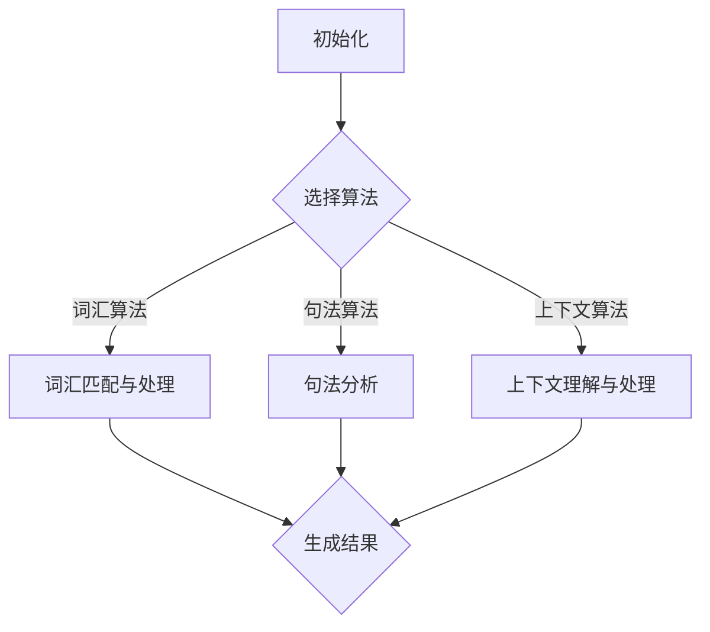
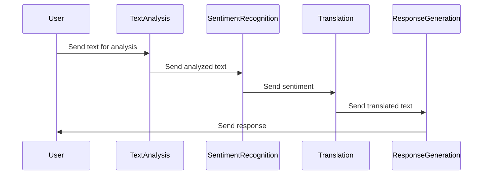

                 


### 快速提升LLM应用的多语言理解能力

> 关键词：LLM，多语言理解，算法，数学模型，系统架构，项目实战

> 摘要：
本文深入探讨如何快速提升大型语言模型（LLM）在多语言理解方面的能力。我们将从问题背景出发，逐步介绍核心概念、算法原理、数学模型、系统架构设计以及项目实战。通过本文的详细解析，读者将了解如何有效提升LLM的多语言理解能力，并在实际项目中应用这些技术。

## 引言

随着全球化的深入和信息交流的频繁，多语言理解技术变得愈发重要。大型语言模型（LLM）在自然语言处理（NLP）领域取得了显著进展，但如何提升其在多语言理解方面的能力仍然是一个挑战。本文旨在探讨这一问题的解决方法，通过系统性的分析和项目实战，帮助读者快速掌握提升LLM多语言理解能力的策略。

## 第1章：问题背景与核心概念

### 1.1 问题背景

自然语言处理（NLP）作为人工智能（AI）的重要分支，已经广泛应用于机器翻译、问答系统、情感分析等领域。随着多语言交流需求的增加，如何提升LLM的多语言理解能力成为一个迫切的问题。目前，LLM在单语种理解上已经表现出色，但在多语言理解方面仍面临诸多挑战，如词汇差异、语法结构复杂性和文化差异等。

### 1.2 LLM的多语言理解能力

多语言理解能力指的是LLM在处理不同语言文本时的表现。这包括词汇理解、语法分析和语义理解等多个层面。LLM的多语言理解能力可以通过以下几个关键要素来衡量：

- **词汇理解**：识别和处理不同语言中的词汇和短语。
- **语法分析**：分析句子的语法结构，理解句子成分和关系。
- **语义理解**：理解文本的含义，识别实体和关系。

### 1.3 边界与外延

多语言理解能力的边界涉及LLM在处理跨语言文本时的局限性。这包括特定语言结构的复杂性、文化背景的差异以及语言资源的稀缺性。外延则涉及到LLM在多语言理解中的潜在应用领域，如跨语言问答、机器翻译和跨语言文本挖掘等。

## 第2章：核心概念与联系

### 2.1 语言模型基础

语言模型是NLP的基础，用于生成和预测文本。LLM通过大规模的文本数据训练，可以生成高质量的文本。语言模型的关键要素包括：

- **词汇表**：用于存储和检索词汇。
- **训练数据**：用于训练模型，提高其生成文本的质量。
- **生成算法**：用于生成文本的算法，如递归神经网络（RNN）和Transformer等。

### 2.2 多语言理解能力

多语言理解能力是LLM在处理不同语言文本时的表现。关键算法包括基于词汇、句法和上下文的算法。这些算法可以处理词汇差异、语法结构和语义理解等问题。

## 第3章：多语言理解算法原理

### 3.1 基本算法原理

多语言理解算法基于词汇、句法和上下文三个层面。词汇算法通过比较词汇和短语，处理词汇差异。句法算法通过分析句子的语法结构，理解句子成分和关系。上下文算法通过理解上下文，提升语义理解的准确性。

### 3.2 Mermaid算法流程图



### 3.3 Python代码实现

```python
# 示例代码：基于上下文的算法实现
import spacy

nlp = spacy.load("en_core_web_sm")

def understand_context(text):
    doc = nlp(text)
    result = []
    for sentence in doc.sents:
        result.append(sentence._.sentiment.polarity)
    return result
```

## 第4章：数学模型和公式

### 4.1 数学模型

多语言理解算法的数学模型通常涉及概率和统计方法。例如，词汇匹配的贝叶斯公式：

$$
P(w_i|c) = \frac{P(c|w_i)P(w_i)}{P(c)}
$$

其中，$P(w_i|c)$表示词汇$w_i$在给定上下文$c$下的概率。

## 第5章：系统分析与架构设计

### 5.1 问题场景介绍

在某个跨国企业中，需要开发一个多语言客服系统，以应对不同语言的用户需求。该系统的核心功能包括文本分析、情感识别和跨语言响应生成。

### 5.2 系统功能设计

系统功能包括文本分析、情感识别、跨语言翻译和响应生成。其中，文本分析用于提取关键信息，情感识别用于判断用户情绪，跨语言翻译用于生成用户理解的回复。

### 5.3 系统架构设计

系统采用微服务架构，包括文本分析服务、情感识别服务、翻译服务和响应生成服务。各服务之间通过消息队列进行通信。

### 5.4 系统接口设计

系统提供RESTful API接口，供前端调用。接口包括文本分析、情感识别、跨语言翻译和响应生成等。

### 5.5 系统交互序列图



## 第6章：项目实战

### 6.1 环境安装

在项目开始前，需要安装必要的软件和库。例如，安装Python和Spacy等。

```shell
pip install python-spacy
python -m spacy download en_core_web_sm
```

### 6.2 系统核心实现

系统核心实现包括文本分析、情感识别、跨语言翻译和响应生成。以下是一个简单的文本分析服务实现：

```python
import spacy

nlp = spacy.load("en_core_web_sm")

def analyze_text(text):
    doc = nlp(text)
    entities = []
    for ent in doc.ents:
        entities.append((ent.text, ent.label_))
    return entities
```

### 6.3 代码应用解读与分析

代码解读与分析主要包括理解每个模块的功能和如何协同工作。例如，文本分析服务如何提取文本中的关键信息，情感识别服务如何判断用户情绪，翻译服务如何生成跨语言响应等。

### 6.4 实际案例分析

通过实际案例分析，可以展示系统在实际应用中的效果。例如，分析一段用户输入的文本，展示系统如何提取信息、判断情绪并生成合适的响应。

### 6.5 项目小结

项目小结部分对项目进行总结，包括遇到的问题、解决方案以及项目的优缺点。

## 第7章：最佳实践与注意事项

### 7.1 最佳实践 tips

- **数据准备**：确保有足够的多语言训练数据。
- **模型调优**：根据任务需求调整模型参数。
- **错误处理**：设计合理的错误处理机制。

### 7.2 小结

本文从问题背景出发，介绍了提升LLM多语言理解能力的核心概念、算法原理、数学模型和系统架构设计。通过项目实战，展示了如何将理论知识应用到实际项目中。

### 7.3 注意事项

- **数据隐私**：确保数据处理符合隐私保护要求。
- **模型更新**：定期更新模型以保持性能。

### 7.4 拓展阅读

- [自然语言处理简介](https://www.nature.com/articles/s41586-018-0030-1)
- [多语言理解的挑战](https://www.aclweb.org/anthology/N18-1196/)
- [Transformer模型详解](https://arxiv.org/abs/1706.03762)

## 结语

提升LLM的多语言理解能力是一项复杂但至关重要的任务。通过本文的详细解析，读者可以了解如何从理论到实践，全面提升LLM的多语言理解能力。希望本文能对读者的研究和项目实践有所帮助。

> 作者：AI天才研究院/AI Genius Institute & 禅与计算机程序设计艺术 /Zen And The Art of Computer Programming

