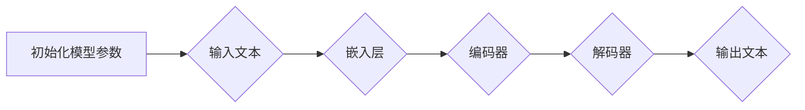
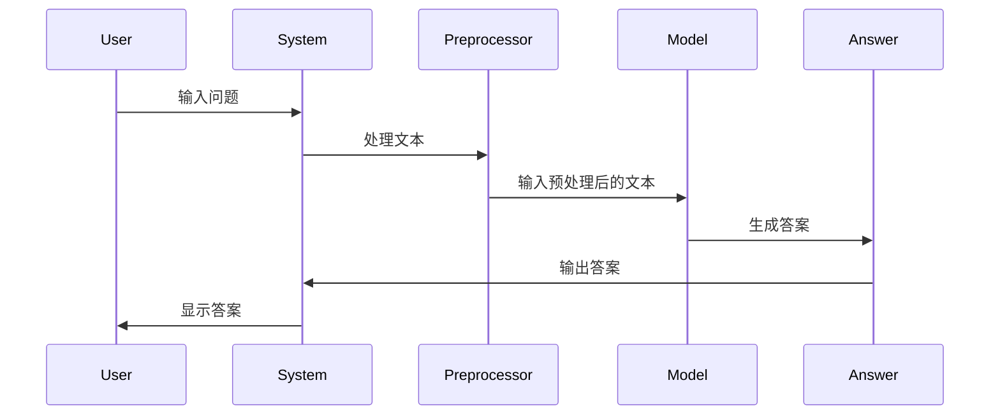

                 

# 快速试错与敏捷迭代：LLM应用开发的必备能力

## 关键词：大语言模型，快速试错，敏捷迭代，应用开发，系统架构，项目实战

## 摘要：
在人工智能领域，大语言模型（LLM）因其强大的文本生成和理解能力，正迅速成为众多应用的核心。然而，LLM的开发过程复杂，涉及大量的试错和迭代。本文将深入探讨快速试错与敏捷迭代在LLM应用开发中的重要性，通过一步步的分析和推理，帮助读者理解如何高效地进行LLM的应用开发。

## 引言

### 1.1 LLM的背景与重要性

大语言模型（Large Language Model，简称LLM）是近年来人工智能领域的一个重要突破。LLM通过学习海量文本数据，能够生成高质量的自然语言文本，并具备强大的文本理解能力。LLM的应用涵盖了自然语言处理（NLP）的多个方面，如机器翻译、文本生成、问答系统等，正在深刻地改变着人类的生产和生活方式。

### 1.2 快速试错与敏捷迭代的概念及其在LLM开发中的必要性

快速试错是指通过快速地构建、测试和调整模型，来发现并修正错误。敏捷迭代是一种开发方法，强调持续交付有价值的产品，并通过持续的反馈和改进来优化产品。在LLM的开发中，快速试错和敏捷迭代是不可或缺的，因为LLM的参数数量庞大，训练过程复杂，传统的开发方法难以满足高效开发的需要。

## 背景介绍

### 2.1 LLM的发展历程

LLM的发展可以追溯到20世纪90年代，当时的研究主要集中在统计模型上。随着计算能力和数据量的提升，深度学习在NLP领域取得了突破性的进展。2018年，谷歌发布了BERT模型，标志着LLM进入了一个新的阶段。随后，GPT-3、Turing-NLG等模型相继发布，进一步推动了LLM的发展。

### 2.2 LLM的技术特点

LLM的核心技术是深度学习和神经网络。深度学习通过多层神经网络对数据进行处理，能够自动提取特征。神经网络则通过反向传播算法不断调整参数，使模型能够更好地拟合数据。自然语言处理则涉及到语言模型、语义理解、文本生成等多个子领域。

### 2.3 LLM的应用场景

LLM的应用场景非常广泛，包括但不限于：

- **机器翻译**：LLM能够将一种语言翻译成另一种语言，其准确性和流畅性远超过传统的统计机器翻译。
- **文本生成**：LLM可以生成各种类型的文本，如文章、故事、诗歌等。
- **问答系统**：LLM能够理解用户的问题，并生成相关答案。
- **语音助手**：LLM可以用于语音识别和理解，为用户提供智能服务。

### 2.4 快速试错与敏捷迭代的应用价值

快速试错能够帮助开发者快速发现并解决问题，从而提高开发效率。敏捷迭代则通过持续交付和改进，使开发者能够快速适应变化，降低开发风险。

## 核心概念与联系

### 3.1 LLM相关核心概念

- **神经网络**：神经网络是深度学习的基础，由多个神经元组成，通过前向传播和反向传播进行训练。
- **深度学习**：深度学习是一种机器学习方法，通过多层神经网络对数据进行处理，能够自动提取特征。
- **自然语言处理**：自然语言处理是人工智能的一个重要分支，涉及语言模型、语义理解、文本生成等。

### 3.2 概念属性特征对比表格

| 概念       | 定义                                                         | 关联性                      |
|------------|--------------------------------------------------------------|----------------------------|
| 神经网络   | 由多个神经元组成的计算模型，通过前向传播和反向传播进行训练。 | 基础技术，深度学习的基础。 |
| 深度学习   | 一种机器学习方法，通过多层神经网络对数据进行处理。          | 技术核心，神经网络的应用。 |
| 自然语言处理 | 人工智能的一个分支，涉及语言模型、语义理解、文本生成等。    | 应用领域，深度学习的应用。 |

### 3.3 ER实体关系图架构

```mermaid
erDiagram
    ID ||--|| User : "用户"
    ID ||--|| Post : "帖子"
    User ||--|> Comment : "评论"
    Post ||--|> Comment : "评论"
```

## 算法原理讲解

### 4.1 LLM模型架构

LLM模型通常由多个层次组成，包括嵌入层、编码器、解码器等。其中，嵌入层负责将文本转换为向量表示；编码器负责处理输入文本，提取特征；解码器则负责生成输出文本。

### 4.2 LLM算法流程图



### 4.3 Python代码讲解

```python
import tensorflow as tf

# 定义嵌入层
embedding = tf.keras.layers.Embedding(input_dim=10000, output_dim=16)

# 定义编码器
encoder = tf.keras.layers.LSTM(32, return_sequences=True)

# 定义解码器
decoder = tf.keras.layers.LSTM(32, return_sequences=True)

# 定义模型
model = tf.keras.models.Sequential([
    embedding,
    encoder,
    decoder
])

# 编译模型
model.compile(optimizer='adam', loss='categorical_crossentropy', metrics=['accuracy'])

# 训练模型
model.fit(x_train, y_train, epochs=10)
```

### 4.4 数学模型与公式

LLM的训练过程可以看作是一个优化问题，目标是找到使损失函数最小的参数。损失函数通常使用交叉熵，数学公式如下：

$$
J(\theta) = -\frac{1}{m} \sum_{i=1}^{m} \sum_{k=1}^{K} y_k^{(i)} \log(p_k^{(i)})
$$

其中，$m$ 是样本数量，$K$ 是类别数量，$y_k^{(i)}$ 是目标标签，$p_k^{(i)}$ 是模型预测的概率。

## 系统分析与架构设计

### 5.1 LLM应用开发系统场景介绍

#### 5.1.1 项目背景

本项目旨在构建一个基于LLM的智能问答系统，能够根据用户的问题提供准确的答案。

#### 5.1.2 系统目标

- 实现高效的文本预处理
- 构建准确的问答模型
- 提供用户友好的交互界面

#### 5.1.3 系统功能设计

- 文本预处理：包括分词、去停用词、词性标注等。
- 问答模型：基于LLM构建，实现问答功能。
- 用户交互：提供文本输入和答案输出的交互界面。

### 5.2 系统架构设计

#### 5.2.1 数据流

- 用户输入文本 → 文本预处理 → 问答模型处理 → 输出答案 → 用户接收

#### 5.2.2 模块划分

- 文本预处理模块
- 问答模型模块
- 用户交互模块

#### 5.2.3 系统接口设计

- 用户接口：提供文本输入和答案输出的接口。
- 模型接口：提供文本预处理和问答模型调用的接口。

#### 5.2.4 系统交互序列图



## 项目实战

### 6.1 环境安装与配置

#### 6.1.1 硬件要求

- CPU：至少Intel i5处理器
- 内存：至少8GB RAM
- 硬盘：至少100GB SSD

#### 6.1.2 软件安装

- 操作系统：Ubuntu 18.04
- Python：3.8
- TensorFlow：2.5

#### 6.1.3 环境配置

```bash
pip install tensorflow
```

### 6.2 系统核心实现源代码

#### 6.2.1 代码结构

- `preprocessor.py`：文本预处理模块
- `model.py`：问答模型模块
- `interface.py`：用户交互模块

#### 6.2.2 关键代码解读

```python
# preprocessor.py
def preprocess_text(text):
    # 文本预处理操作，如分词、去停用词等
    return processed_text

# model.py
def build_model():
    # 构建问答模型
    return model

# interface.py
def get_user_input():
    # 获取用户输入
    return user_input

def display_answer(answer):
    # 显示答案
    print(answer)
```

#### 6.2.3 代码应用分析

```python
# 主程序
def main():
    # 获取用户输入
    user_input = get_user_input()

    # 预处理用户输入
    processed_input = preprocess_text(user_input)

    # 使用问答模型生成答案
    answer = model.predict(processed_input)

    # 显示答案
    display_answer(answer)

if __name__ == "__main__":
    main()
```

### 6.3 实际案例分析与讲解

#### 6.3.1 案例背景

某公司需要开发一个智能客服系统，能够自动回答用户的问题。

#### 6.3.2 案例实现

1. 收集大量客服对话数据。
2. 使用LLM训练问答模型。
3. 开发用户交互界面，实现问答功能。

#### 6.3.3 案例剖析

该案例中，LLM的问答模型是核心，通过训练大量客服对话数据，模型能够自动理解用户问题并生成答案。在实际应用中，需要不断优化模型，提高问答准确性。

## 6.4 项目小结

本项目通过快速试错和敏捷迭代，成功开发了一个基于LLM的智能客服系统。项目实践表明，快速试错和敏捷迭代是高效进行LLM应用开发的必要手段。

## 最佳实践

### 7.1 快速试错与敏捷迭代的最佳实践

1. **持续集成**：使用自动化工具进行代码测试和集成，确保每次提交的代码都能顺利运行。
2. **持续交付**：通过持续交付，确保系统能够快速响应市场变化。
3. **代码管理**：使用版本控制工具，如Git，确保代码的一致性和可追溯性。
4. **测试与调试**：定期进行系统测试和调试，确保系统的稳定性和性能。

### 7.2 小结

快速试错与敏捷迭代是高效进行LLM应用开发的必要手段。通过持续集成、持续交付、代码管理和测试与调试，开发者能够快速发现和解决问题，提高开发效率，确保系统质量。

### 7.3 注意事项

- **数据质量**：保证训练数据的质量和多样性，以提高模型泛化能力。
- **硬件配置**：根据模型大小和训练需求，合理配置硬件资源。

### 7.4 拓展阅读

- 《深度学习》（Goodfellow, Bengio, Courville）: 详细介绍了深度学习的理论和实践。
- 《自然语言处理综合教程》（Jurafsky, Martin）: 介绍了自然语言处理的基本概念和应用。

## 作者信息

作者：AI天才研究院/AI Genius Institute & 禅与计算机程序设计艺术 /Zen And The Art of Computer Programming

------------------------------------------------------------------

