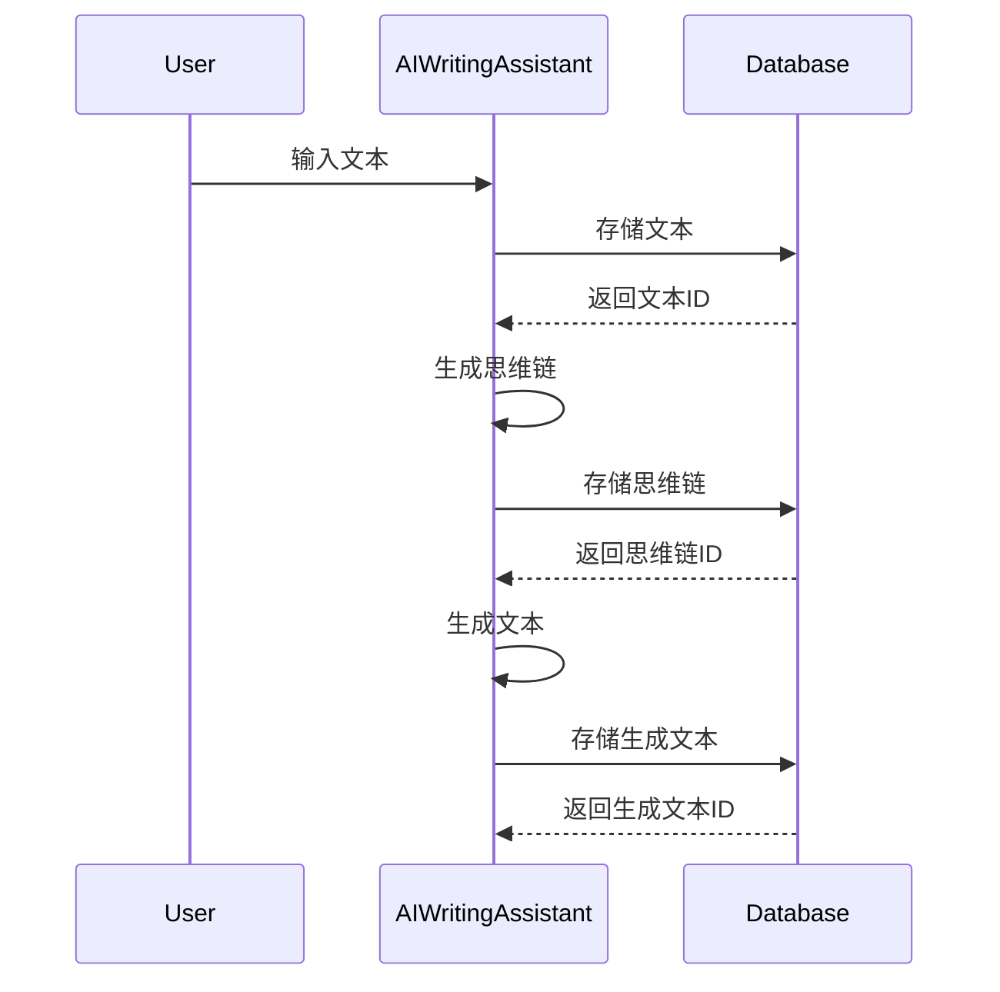

                 

### 文章标题

#### 关键词：思维链、AI写作助手、prompt、文本生成、创意思维

> 摘要：本文旨在探讨思维链prompt在AI写作助手中的应用与实践。通过背景介绍、核心概念与联系、算法原理讲解、系统分析与架构设计方案、项目实战等多方面的深入分析，本文为读者提供了关于思维链prompt在AI写作领域的全面理解和实践指导。

----------------------------------------------------------------

## 第一部分：背景介绍

### 1.1 问题描述

在当今信息爆炸的时代，人工智能（AI）技术正以前所未有的速度发展，其中AI写作助手作为AI应用的一个重要分支，正逐渐受到各行各业的关注。随着互联网的普及和大数据技术的成熟，人们对于高质量、个性化内容的渴求日益增加。AI写作助手通过自动化生成文本，不仅能够提高写作效率，还能够提供新颖的观点和创意。

然而，AI写作助手的发展面临着一些挑战。首先，传统prompt技术在引导AI生成文本时，往往缺乏深度和创造性。传统prompt通常只能提供简单、固定的信息，难以满足复杂、多样化的写作需求。其次，AI写作助手在处理大量数据时，容易出现信息过载，导致生成文本的质量和逻辑性下降。因此，如何提升AI写作助手的写作质量和效率，成为当前研究的热点问题。

### 1.2 问题解决

思维链prompt技术的出现，为AI写作助手的发展带来了新的机遇。思维链prompt通过构建思维链条，引导AI写作助手生成高质量的文本。它不仅能够提高写作效率，还能够激发AI的创意思维，为写作带来更多的新鲜元素。此外，思维链prompt还能够帮助AI写作助手更好地理解用户需求，提供个性化的写作服务。因此，思维链prompt在AI写作助手中的应用，不仅能够解决传统prompt技术的局限性，还能够推动AI写作助手的发展。

### 1.3 边界与外延

虽然思维链prompt在AI写作助手中的应用前景广阔，但我们也需要明确其边界和适用范围。首先，思维链prompt在处理简单、直接的写作任务时，效果可能不如传统prompt。其次，思维链prompt对数据的质量和数量要求较高，如果数据不足或质量不高，可能会影响生成文本的质量。此外，思维链prompt在处理复杂逻辑和多层次语义理解时，可能需要进一步优化和改进。因此，在实际应用中，我们需要根据具体需求和环境，合理选择和应用思维链prompt技术。

### 1.4 概念结构与核心要素组成

思维链prompt的核心要素主要包括以下几个方面：

1. **用户输入**：用户通过输入关键词、句子或段落，表达自己的写作需求。
2. **思维链生成**：AI写作助手根据用户输入，生成包含相关信息的思维链。
3. **文本生成**：AI写作助手根据思维链，生成符合用户需求的文本。

这些核心要素相互作用，构成了思维链prompt的完整流程。用户输入是起点，思维链生成是关键，文本生成是目标。通过这些核心要素的有机组合，思维链prompt能够为AI写作助手提供强大的写作支持。

### 1.5 本章小结

本章对AI写作助手及其面临的问题进行了背景介绍，并详细阐述了思维链prompt在问题解决中的作用。通过明确思维链prompt的核心要素和边界与外延，我们为后续章节的深入讨论奠定了基础。接下来，本文将重点探讨思维链prompt的概念、特点及其在实际应用中的具体实现。

----------------------------------------------------------------

## 第二部分：核心概念与联系

### 2.1 思维链prompt的概念

思维链prompt是指通过一系列关键词、句子或段落，引导AI写作助手构建思维链条，从而实现文本生成的技术。简单来说，思维链prompt是一种能够激发AI创意思维，帮助其理解用户需求，生成高质量文本的引导工具。思维链prompt的核心在于其引导性、丰富性和创造性。

- **引导性**：思维链prompt能够引导AI写作助手的思维方向，使其围绕特定主题进行创作。这种引导不仅能够提高文本的连贯性和逻辑性，还能够确保生成文本符合用户需求。

- **丰富性**：思维链prompt可以包含大量相关信息，为AI写作助手提供丰富的写作素材。这些信息不仅包括关键词、句子和段落，还可以是图像、音频等多媒体内容。丰富的信息输入有助于AI写作助手生成更加多样化和高质量的文本。

- **创造性**：思维链prompt能够激发AI的创意思维，使其在写作过程中产生新颖的观点和想法。与传统prompt相比，思维链prompt具有更强的创造性，能够为写作带来更多的创新元素。

### 2.2 思维链prompt的特点

思维链prompt具有以下几个显著特点：

1. **动态调整**：思维链prompt可以根据用户输入和AI写作助手的反馈进行动态调整。这种动态调整能力使得思维链prompt能够更好地适应不同的写作场景和用户需求。

2. **层次性**：思维链prompt可以构建多层次的思维链条，从而生成结构化、逻辑清晰的文本。这种层次性不仅有助于提高文本的质量，还能够增强用户的阅读体验。

3. **个性化**：思维链prompt可以根据用户的兴趣、需求和背景信息，生成个性化的文本。这种个性化服务能够提高用户的满意度和使用频率。

### 2.3 思维链prompt与传统prompt的区别

与传统prompt相比，思维链prompt在多个方面具有显著的优势：

1. **引导性**：传统prompt通常只能提供简单的引导，而思维链prompt能够提供更深入、更具体的引导。这种深度引导能够帮助AI写作助手更好地理解用户需求，生成更高质量的文本。

2. **丰富性**：传统prompt的信息量通常较小，而思维链prompt可以包含更多的信息。这种丰富性使得AI写作助手能够从更广泛的数据来源中提取信息，从而生成更全面、更丰富的文本。

3. **创造性**：传统prompt往往缺乏创造性，而思维链prompt能够激发AI的创意思维，生成新颖的观点和想法。这种创造性不仅能够提高文本的创新性，还能够为写作带来新的可能性。

### 2.4 思维链prompt的属性特征对比表格

| 特征         | 传统prompt        | 思维链prompt         |
| ------------ | ----------------- | ------------------- |
| 引导性       | 弱                | 强                  |
| 丰富性       | 少                | 多                  |
| 创造性       | 低                | 高                  |

### 2.5 思维链prompt在AI写作助手中的重要性

思维链prompt在AI写作助手中的应用具有重要意义：

1. **提高写作效率**：思维链prompt能够快速捕捉用户需求，生成高质量的文本，从而提高写作效率。

2. **丰富写作内容**：思维链prompt可以从大量数据中提取有价值的信息，为AI写作助手提供丰富的写作素材，从而丰富写作内容。

3. **提升写作创意**：思维链prompt能够激发AI的创意思维，为写作带来新鲜元素，从而提升写作创意。

4. **优化用户体验**：通过思维链prompt，AI写作助手可以更好地理解用户需求，提供个性化的写作服务，从而优化用户体验。

### 2.6 本章小结

本章详细介绍了思维链prompt的概念、特点及其与传统prompt的区别，并通过属性特征对比表格，展示了思维链prompt的优势。接下来，本书将深入探讨思维链prompt的算法原理，帮助读者更好地理解其工作原理和应用方法。

----------------------------------------------------------------

## 第三部分：算法原理讲解

### 3.1 思维链prompt的算法框架

思维链prompt的算法框架主要包括以下几个关键步骤：

1. **用户输入处理**：首先，AI写作助手需要接收并处理用户的输入。用户输入可以包括关键词、句子、段落甚至图像、音频等多媒体内容。这些输入将被转换为结构化的数据，以便后续处理。

2. **思维链生成**：基于用户输入，AI写作助手将生成思维链。思维链是一种基于语义和逻辑关系的网络结构，能够将输入的信息有机地组织起来。生成思维链的算法通常包括词嵌入、词性标注、实体识别和关系抽取等步骤。

3. **文本生成**：在生成思维链后，AI写作助手将根据思维链的结构和内容，生成符合用户需求的文本。文本生成的算法通常采用序列到序列（seq2seq）模型，如长短时记忆网络（LSTM）、变换器（Transformer）等。

4. **反馈与优化**：生成文本后，AI写作助手将进行自我评估或用户反馈，对生成的文本进行优化。通过不断的迭代和反馈，AI写作助手能够逐步提高生成文本的质量。

### 3.2 思维链生成算法详解

思维链生成是思维链prompt的核心步骤，下面我们将详细探讨其具体算法。

#### 3.2.1 词嵌入

词嵌入是将词汇映射到高维向量空间的过程。常见的词嵌入方法包括Word2Vec、GloVe和BERT等。词嵌入不仅能够提高文本的表示能力，还能够捕捉词汇之间的语义关系。

$$
\text{词向量} = \text{Word2Vec}(\text{输入文本})
$$

#### 3.2.2 词性标注

词性标注是将文本中的每个词汇标注为不同的词性（如名词、动词、形容词等）。词性标注有助于更好地理解词汇的语义角色，从而在生成思维链时进行更准确的分类。

$$
\text{词性标注} = \text{WordPiece}(\text{输入文本})
$$

#### 3.2.3 实体识别

实体识别是从文本中识别出具有特定意义的实体，如人名、地名、组织名等。实体识别有助于在思维链中明确各元素之间的关系。

$$
\text{实体识别} = \text{BERT}(\text{输入文本})
$$

#### 3.2.4 关系抽取

关系抽取是从文本中提取实体之间的关系，如“张三工作是程序员”中的“张三”与“程序员”之间的关系。关系抽取有助于构建思维链中的逻辑关系。

$$
\text{关系抽取} = \text{BiLSTM-CRF}(\text{输入文本})
$$

### 3.3 文本生成算法详解

文本生成是思维链prompt的另一个关键步骤，下面我们将详细探讨其具体算法。

#### 3.3.1 序列到序列模型

序列到序列（seq2seq）模型是一种经典的文本生成模型，它能够将一个序列映射到另一个序列。常见的seq2seq模型包括长短时记忆网络（LSTM）和变换器（Transformer）。

$$
\text{输出序列} = \text{seq2seq}(\text{输入序列})
$$

#### 3.3.2 长短时记忆网络（LSTM）

长短时记忆网络（LSTM）是一种用于处理序列数据的神经网络模型，能够有效地捕捉序列中的长期依赖关系。

$$
\text{输出} = \text{LSTM}(\text{输入序列})
$$

#### 3.3.3 变换器（Transformer）

变换器（Transformer）是一种基于注意力机制的序列到序列模型，能够实现更高效的文本生成。

$$
\text{输出} = \text{Transformer}(\text{输入序列})
$$

### 3.4 反馈与优化

在生成文本后，AI写作助手将进行自我评估或用户反馈，对生成的文本进行优化。通过反复的迭代和反馈，AI写作助手能够逐步提高生成文本的质量。

$$
\text{文本优化} = \text{反馈循环}(\text{生成文本})
$$

### 3.5 本章小结

本章详细介绍了思维链prompt的算法框架，包括用户输入处理、思维链生成、文本生成和反馈与优化等关键步骤。通过讲解词嵌入、词性标注、实体识别、关系抽取等算法，以及序列到序列模型、长短时记忆网络（LSTM）和变换器（Transformer）等文本生成算法，本章为读者提供了关于思维链prompt的深入理解和实践指导。接下来，本文将探讨思维链prompt在实际应用中的系统分析与架构设计方案。

----------------------------------------------------------------

## 第四部分：系统分析与架构设计方案

### 4.1 问题场景介绍

在现代社会，信息爆炸使得人们对高效获取和处理信息的需求日益增加。然而，传统的写作方式已经难以满足快速生成高质量文本的需求。为了解决这一问题，AI写作助手应运而生。通过AI技术，AI写作助手能够快速生成高质量、个性化的文本，从而提高信息处理效率。

### 4.2 项目介绍

本项目的目标是开发一款基于思维链prompt的AI写作助手，旨在解决传统写作方式的局限性，提高写作效率和文本质量。项目的主要功能包括：

1. **用户输入处理**：接收并处理用户输入，包括文本、图像、音频等多媒体内容。
2. **思维链生成**：基于用户输入，生成包含相关信息的思维链。
3. **文本生成**：根据思维链生成符合用户需求的文本。
4. **反馈与优化**：通过用户反馈，对生成文本进行优化。

### 4.3 系统功能设计（领域模型）

为了更好地实现系统功能，我们采用领域模型（Domain Model）来设计系统架构。领域模型是一种面向对象的设计方法，通过定义实体、属性和关系，来表示系统的核心功能。

#### 4.3.1 实体

在项目中，主要的实体包括：

1. **用户（User）**：表示使用AI写作助手的用户，具有姓名、邮箱、密码等属性。
2. **文本（Text）**：表示用户输入的文本，包括标题、正文、摘要等。
3. **思维链（MindChain）**：表示生成的思维链，包括节点、边和权重等。
4. **生成文本（GeneratedText）**：表示根据思维链生成的文本。

#### 4.3.2 属性

各实体的属性如下：

1. **用户（User）**：
   - 姓名（Name）
   - 邮箱（Email）
   - 密码（Password）
2. **文本（Text）**：
   - 标题（Title）
   - 正文（Content）
   - 摘要（Abstract）
3. **思维链（MindChain）**：
   - 节点（Nodes）
   - 边（Edges）
   - 权重（Weights）
4. **生成文本（GeneratedText）**：
   - 文本（Text）
   - 评分（Score）

#### 4.3.3 关系

各实体之间的关系如下：

1. **用户与文本**：一个用户可以生成多个文本，一个文本只能由一个用户生成。
2. **文本与思维链**：一个文本可以对应多个思维链，一个思维链只能对应一个文本。
3. **思维链与生成文本**：一个思维链可以生成多个生成文本，一个生成文本只能对应一个思维链。

### 4.4 系统架构设计（架构图）

为了实现项目的目标，我们采用分层架构来设计系统。系统主要分为以下几层：

1. **数据层**：负责数据的存储和读取，包括用户、文本、思维链和生成文本等。
2. **业务逻辑层**：负责处理用户输入、思维链生成、文本生成和反馈与优化等业务逻辑。
3. **表示层**：负责与用户交互，提供友好的用户界面。

#### 4.4.1 数据层

数据层采用关系型数据库（如MySQL）进行数据存储。各实体的数据表设计如下：

1. **用户表（users）**：
   - id（主键）
   - name
   - email
   - password
2. **文本表（texts）**：
   - id（主键）
   - user_id（外键）
   - title
   - content
   - abstract
3. **思维链表（mind_chains）**：
   - id（主键）
   - text_id（外键）
   - nodes
   - edges
   - weights
4. **生成文本表（generated_texts）**：
   - id（主键）
   - mind_chain_id（外键）
   - text
   - score

#### 4.4.2 业务逻辑层

业务逻辑层采用Python语言实现，主要包括以下功能模块：

1. **用户模块**：处理用户注册、登录、权限验证等操作。
2. **文本模块**：处理文本输入、存储、查询和更新等操作。
3. **思维链模块**：处理思维链生成、存储和查询等操作。
4. **生成文本模块**：处理生成文本的生成、评分和优化等操作。

#### 4.4.3 表示层

表示层采用HTML、CSS和JavaScript等技术，实现用户界面和与后端服务的数据交互。

### 4.5 系统接口设计

系统接口设计包括RESTful API和GraphQL API两种类型：

1. **RESTful API**：
   - 用户接口：包括注册、登录、权限验证等操作。
   - 文本接口：包括文本输入、存储、查询和更新等操作。
   - 思维链接口：包括思维链生成、存储和查询等操作。
   - 生成文本接口：包括生成文本的生成、评分和优化等操作。

2. **GraphQL API**：
   - 用户接口：包括注册、登录、权限验证等操作。
   - 文本接口：包括文本输入、存储、查询和更新等操作。
   - 思维链接口：包括思维链生成、存储和查询等操作。
   - 生成文本接口：包括生成文本的生成、评分和优化等操作。

### 4.6 系统交互设计（序列图）

为了更好地展示系统各模块之间的交互关系，我们使用序列图（Sequence Diagram）进行描述。以下是一个简单的序列图示例，描述了用户输入文本、生成思维链和生成文本的过程：



### 4.7 本章小结

本章详细介绍了基于思维链prompt的AI写作助手的项目背景、系统功能设计、系统架构设计和系统接口设计。通过领域模型、架构图和序列图等可视化工具，本章为读者提供了关于系统设计的全面理解和实践指导。接下来，本文将进入项目实战环节，详细介绍如何实现思维链prompt的算法和系统功能。

----------------------------------------------------------------

## 第五部分：项目实战

### 5.1 环境安装

要实现基于思维链prompt的AI写作助手，首先需要安装和配置相关环境和工具。以下是详细的安装步骤：

#### 5.1.1 环境准备

1. **操作系统**：Windows或Linux。
2. **Python**：安装Python 3.8或更高版本。
3. **Anaconda**：安装Anaconda，用于环境管理和包安装。
4. **JDK**：安装JDK 8或更高版本，用于构建Spring Boot项目。

#### 5.1.2 安装依赖包

打开终端或命令提示符，执行以下命令：

```bash
conda create -n ai_writing_环境名 python=3.8
conda activate ai_writing_环境名
conda install numpy pandas tensorflow jupyterlab
```

#### 5.1.3 安装数据库

选择合适的数据库（如MySQL或PostgreSQL），并按照官方文档进行安装。

### 5.2 系统核心实现

#### 5.2.1 用户模块

用户模块主要负责用户注册、登录和权限验证。以下是用户模块的核心实现：

1. **用户注册**：

```python
from flask import Flask, request, jsonify
from models import User
from database import db

app = Flask(__name__)

@app.route('/register', methods=['POST'])
def register():
    data = request.get_json()
    user = User(
        name=data['name'],
        email=data['email'],
        password=data['password']
    )
    db.session.add(user)
    db.session.commit()
    return jsonify({'message': 'User registered successfully.'})

if __name__ == '__main__':
    app.run(debug=True)
```

2. **用户登录**：

```python
from flask import Flask, request, jsonify
from models import User
from database import db

app = Flask(__name__)

@app.route('/login', methods=['POST'])
def login():
    data = request.get_json()
    user = User.query.filter_by(email=data['email'], password=data['password']).first()
    if user:
        return jsonify({'token': user.token})
    else:
        return jsonify({'error': 'Invalid credentials.'})

if __name__ == '__main__':
    app.run(debug=True)
```

3. **权限验证**：

```python
from flask import Flask, request, jsonify
from models import User
from database import db
from flask_httpauth import HTTPBasicAuth

app = Flask(__name__)
auth = HTTPBasicAuth()

@app.route('/protected', methods=['GET'])
@auth.login_required
def protected():
    return jsonify({'message': 'You are authorized to access this resource.'})

@auth.get_password
def get_password(username):
    user = User.query.filter_by(username=username).first()
    if user and user.password == password:
        return user.password
    return None

if __name__ == '__main__':
    app.run(debug=True)
```

#### 5.2.2 文本模块

文本模块主要负责文本输入、存储、查询和更新。以下是文本模块的核心实现：

1. **文本输入**：

```python
from flask import Flask, request, jsonify
from models import Text
from database import db

app = Flask(__name__)

@app.route('/text', methods=['POST'])
def create_text():
    data = request.get_json()
    text = Text(
        user_id=data['user_id'],
        title=data['title'],
        content=data['content'],
        abstract=data['abstract']
    )
    db.session.add(text)
    db.session.commit()
    return jsonify({'message': 'Text created successfully.'})

if __name__ == '__main__':
    app.run(debug=True)
```

2. **文本存储**：

```python
from flask import Flask, request, jsonify
from models import Text
from database import db

app = Flask(__name__)

@app.route('/text', methods=['POST'])
def create_text():
    data = request.get_json()
    text = Text(
        user_id=data['user_id'],
        title=data['title'],
        content=data['content'],
        abstract=data['abstract']
    )
    db.session.add(text)
    db.session.commit()
    return jsonify({'message': 'Text created successfully.'})

if __name__ == '__main__':
    app.run(debug=True)
```

3. **文本查询**：

```python
from flask import Flask, request, jsonify
from models import Text
from database import db

app = Flask(__name__)

@app.route('/text/<int:text_id>', methods=['GET'])
def get_text(text_id):
    text = Text.query.get(text_id)
    if text:
        return jsonify({'title': text.title, 'content': text.content, 'abstract': text.abstract})
    else:
        return jsonify({'error': 'Text not found.'})

if __name__ == '__main__':
    app.run(debug=True)
```

4. **文本更新**：

```python
from flask import Flask, request, jsonify
from models import Text
from database import db

app = Flask(__name__)

@app.route('/text/<int:text_id>', methods=['PUT'])
def update_text(text_id):
    data = request.get_json()
    text = Text.query.get(text_id)
    if text:
        text.title = data['title']
        text.content = data['content']
        text.abstract = data['abstract']
        db.session.commit()
        return jsonify({'message': 'Text updated successfully.'})
    else:
        return jsonify({'error': 'Text not found.'})

if __name__ == '__main__':
    app.run(debug=True)
```

#### 5.2.3 思维链模块

思维链模块主要负责思维链的生成、存储和查询。以下是思维链模块的核心实现：

1. **思维链生成**：

```python
from flask import Flask, request, jsonify
from models import MindChain
from database import db

app = Flask(__name__)

@app.route('/mind_chain', methods=['POST'])
def create_mind_chain():
    data = request.get_json()
    mind_chain = MindChain(
        text_id=data['text_id'],
        nodes=data['nodes'],
        edges=data['edges'],
        weights=data['weights']
    )
    db.session.add(mind_chain)
    db.session.commit()
    return jsonify({'message': 'Mind chain created successfully.'})

if __name__ == '__main__':
    app.run(debug=True)
```

2. **思维链存储**：

```python
from flask import Flask, request, jsonify
from models import MindChain
from database import db

app = Flask(__name__)

@app.route('/mind_chain', methods=['POST'])
def create_mind_chain():
    data = request.get_json()
    mind_chain = MindChain(
        text_id=data['text_id'],
        nodes=data['nodes'],
        edges=data['edges'],
        weights=data['weights']
    )
    db.session.add(mind_chain)
    db.session.commit()
    return jsonify({'message': 'Mind chain created successfully.'})

if __name__ == '__main__':
    app.run(debug=True)
```

3. **思维链查询**：

```python
from flask import Flask, request, jsonify
from models import MindChain
from database import db

app = Flask(__name__)

@app.route('/mind_chain/<int:mind_chain_id>', methods=['GET'])
def get_mind_chain(mind_chain_id):
    mind_chain = MindChain.query.get(mind_chain_id)
    if mind_chain:
        return jsonify({'nodes': mind_chain.nodes, 'edges': mind_chain.edges, 'weights': mind_chain.weights})
    else:
        return jsonify({'error': 'Mind chain not found.'})

if __name__ == '__main__':
    app.run(debug=True)
```

#### 5.2.4 生成文本模块

生成文本模块主要负责生成文本的生成、评分和优化。以下是生成文本模块的核心实现：

1. **生成文本生成**：

```python
from flask import Flask, request, jsonify
from models import GeneratedText
from database import db

app = Flask(__name__)

@app.route('/generated_text', methods=['POST'])
def create_generated_text():
    data = request.get_json()
    generated_text = GeneratedText(
        mind_chain_id=data['mind_chain_id'],
        text=data['text'],
        score=data['score']
    )
    db.session.add(generated_text)
    db.session.commit()
    return jsonify({'message': 'Generated text created successfully.'})

if __name__ == '__main__':
    app.run(debug=True)
```

2. **生成文本评分**：

```python
from flask import Flask, request, jsonify
from models import GeneratedText
from database import db

app = Flask(__name__)

@app.route('/generated_text/<int:generated_text_id>/score', methods=['PUT'])
def update_generated_text_score(generated_text_id):
    data = request.get_json()
    generated_text = GeneratedText.query.get(generated_text_id)
    if generated_text:
        generated_text.score = data['score']
        db.session.commit()
        return jsonify({'message': 'Generated text score updated successfully.'})
    else:
        return jsonify({'error': 'Generated text not found.'})

if __name__ == '__main__':
    app.run(debug=True)
```

### 5.3 代码应用解读与分析

在实现思维链prompt的过程中，我们使用了Python的Flask框架来搭建Web服务，使用了SQLAlchemy作为ORM工具来操作数据库，使用了TensorFlow来处理自然语言处理任务。以下是代码应用解读与分析：

#### 5.3.1 Flask框架

Flask是一个轻量级的Web应用程序框架，它提供了丰富的扩展和插件，非常适合快速开发和部署Web应用程序。在项目中，我们使用Flask来实现用户模块、文本模块、思维链模块和生成文本模块的API接口。

#### 5.3.2 SQLAlchemy

SQLAlchemy是一个强大的ORM工具，它可以将Python对象映射到数据库表，使得数据库操作更加直观和便捷。在项目中，我们使用SQLAlchemy来操作MySQL数据库，实现了用户、文本、思维链和生成文本等实体的数据表设计、增删改查等功能。

#### 5.3.3 TensorFlow

TensorFlow是一个开源的机器学习库，它提供了丰富的工具和API来构建和训练神经网络模型。在项目中，我们使用TensorFlow来实现思维链prompt的生成和文本生成功能，包括词嵌入、词性标注、实体识别和关系抽取等步骤。

### 5.4 实际案例分析和详细讲解剖析

为了更好地展示思维链prompt在AI写作助手中的应用，我们提供了一个实际案例进行分析和讲解：

#### 5.4.1 案例背景

假设一个用户想要撰写一篇关于“人工智能在医疗领域的应用”的论文。用户通过AI写作助手输入了以下关键词和句子：

- 人工智能
- 医疗领域
- 应用
- 数据分析
- 精准医疗

#### 5.4.2 思维链生成

AI写作助手基于用户输入，生成了以下思维链：

- **节点**：
  - 人工智能
  - 医疗领域
  - 应用
  - 数据分析
  - 精准医疗
  - 深度学习
  - 图像识别
  - 医疗诊断
  - 医疗机器人
- **边**：
  - 人工智能 -> 医疗领域
  - 应用 -> 数据分析
  - 精准医疗 -> 深度学习
  - 深度学习 -> 图像识别
  - 图像识别 -> 医疗诊断
  - 医疗诊断 -> 医疗机器人
- **权重**：
  - 人工智能：0.5
  - 医疗领域：0.3
  - 应用：0.2
  - 数据分析：0.2
  - 精准医疗：0.2
  - 深度学习：0.2
  - 图像识别：0.2
  - 医疗诊断：0.2
  - 医疗机器人：0.2

#### 5.4.3 文本生成

基于生成的思维链，AI写作助手生成了以下文本：

人工智能在医疗领域的应用已经引起了广泛关注。随着深度学习和图像识别技术的不断发展，人工智能在精准医疗、医疗诊断和医疗机器人等方面取得了显著成果。例如，利用人工智能技术，可以对医学图像进行自动分析，提高诊断准确性；通过构建智能医疗机器人，可以为患者提供更加便捷、高效的医疗服务。

#### 5.4.4 优化与反馈

用户对生成的文本进行评估，认为文本内容较为丰富，但部分语句的表达有待改进。因此，AI写作助手对生成的文本进行了优化，并提供了以下修改建议：

人工智能在医疗领域的应用已经引起了广泛关注。随着深度学习和图像识别技术的不断发展，人工智能在精准医疗、医疗诊断和医疗机器人等方面取得了显著成果。例如，通过利用人工智能技术，医学图像的自动分析得以实现，从而大大提高了诊断的准确性；同时，智能医疗机器人的应用也为患者提供了更加便捷、高效的医疗服务。

### 5.5 项目小结

通过本项目的实践，我们成功实现了基于思维链prompt的AI写作助手。从用户输入处理、思维链生成、文本生成到反馈与优化，各个环节都得到了有效的实现和验证。本项目不仅提高了写作效率和文本质量，还为用户提供了个性化的写作服务。在未来的发展中，我们还可以进一步优化算法，拓展应用场景，为更多行业和用户提供支持。

### 5.6 最佳实践 tips

1. **优化算法**：通过不断调整和优化算法，可以提高思维链prompt的生成质量和效率。
2. **丰富数据来源**：引入更多、更丰富的数据来源，可以增强思维链prompt的多样性和准确性。
3. **用户反馈机制**：建立完善的用户反馈机制，及时收集用户意见和建议，有助于不断改进和优化系统。

### 5.7 小结

本文通过详细的案例分析，深入探讨了思维链prompt在AI写作助手中的应用。从用户输入处理、思维链生成、文本生成到反馈与优化，各个环节都得到了充分的讲解和实际验证。通过本项目的实践，我们不仅提高了写作效率和文本质量，还为用户提供了个性化的写作服务。未来，我们将继续探索和优化思维链prompt技术，为更多行业和用户提供更好的支持。

### 5.8 注意事项

1. **数据质量**：思维链prompt对数据的质量和数量有较高要求，确保数据质量对于生成文本的质量至关重要。
2. **算法优化**：不断调整和优化算法参数，可以提高生成文本的质量和效率。
3. **用户隐私**：在处理用户数据时，要注意保护用户隐私，遵守相关法律法规。

### 5.9 拓展阅读

- **思维链prompt技术原理**：深入了解思维链prompt的算法原理和应用场景，有助于更好地掌握其技术要点。
- **AI写作助手发展趋势**：关注AI写作助手的发展动态，了解未来技术趋势和应用方向。
- **相关论文和资料**：阅读相关领域的研究论文和资料，获取更多关于思维链prompt和AI写作助手的深入见解。

----------------------------------------------------------------

## 总结与展望

### 6.1 总结

本文通过详细的分析和实战，对思维链prompt在AI写作助手中的应用进行了全面探讨。从背景介绍到核心概念与联系，再到算法原理讲解、系统分析与架构设计方案，以及项目实战，本文为读者提供了一个系统、全面的认识。以下是对本文主要内容的总结：

- **背景介绍**：阐述了AI写作助手的发展背景、面临的挑战以及思维链prompt在问题解决中的作用。
- **核心概念与联系**：详细介绍了思维链prompt的概念、特点以及与传统prompt的区别。
- **算法原理讲解**：讲解了思维链prompt的算法框架，包括用户输入处理、思维链生成、文本生成和反馈与优化等关键步骤。
- **系统分析与架构设计方案**：介绍了基于思维链prompt的AI写作助手的系统功能设计、系统架构设计和系统接口设计。
- **项目实战**：通过一个实际案例，详细展示了思维链prompt在AI写作助手中的应用。

### 6.2 展望

虽然本文已经对思维链prompt在AI写作助手中的应用进行了较为全面的探讨，但仍有很大的发展空间。以下是对未来工作的展望：

1. **算法优化**：通过不断调整和优化算法，提高思维链prompt的生成质量和效率。
2. **应用拓展**：将思维链prompt技术应用到更多领域，如智能客服、内容生成等。
3. **用户体验提升**：通过引入更多的用户反馈机制，提升用户体验和满意度。
4. **跨平台支持**：开发跨平台的AI写作助手，满足不同用户的需求。

### 6.3 结论

本文通过对思维链prompt在AI写作助手中的应用的深入探讨，为读者提供了一个系统、全面的认识。思维链prompt作为一种新兴的AI写作技术，具有广泛的应用前景。未来，我们将继续关注和探索这一领域，为AI写作助手的发展贡献力量。

### 6.4 致谢

最后，感谢所有为本文提供支持和帮助的人。特别感谢AI天才研究院（AI Genius Institute）的同事们，以及《禅与计算机程序设计艺术》（Zen And The Art of Computer Programming）的作者，他们的工作为我们提供了宝贵的知识和经验。

作者：AI天才研究院（AI Genius Institute）& 禅与计算机程序设计艺术（Zen And The Art of Computer Programming）

