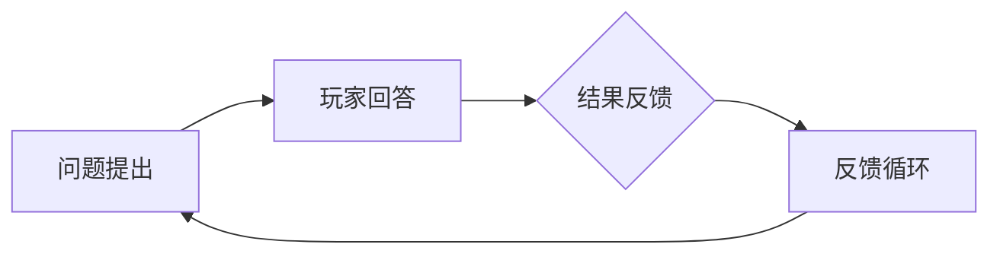
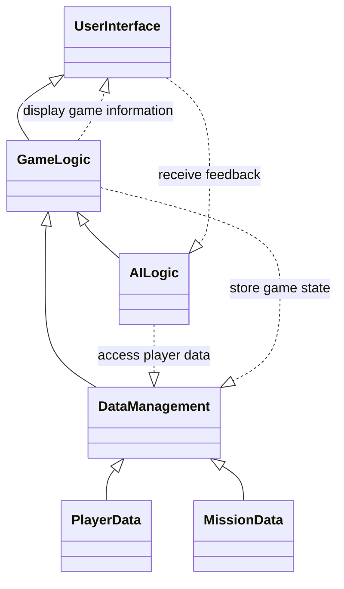
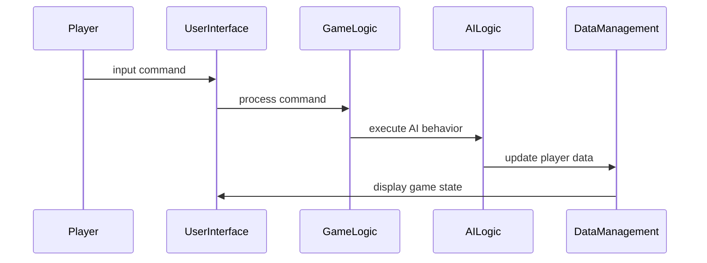
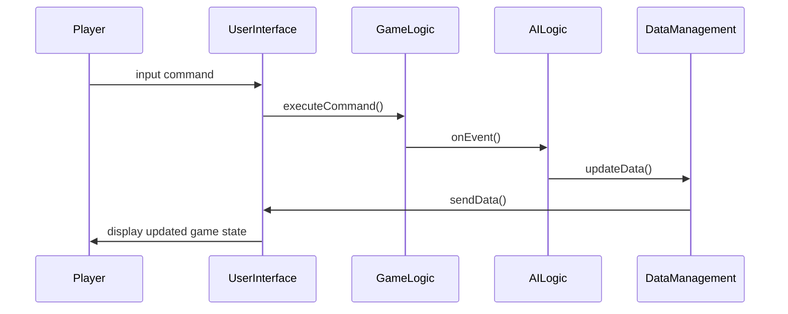
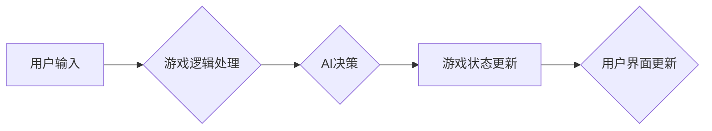
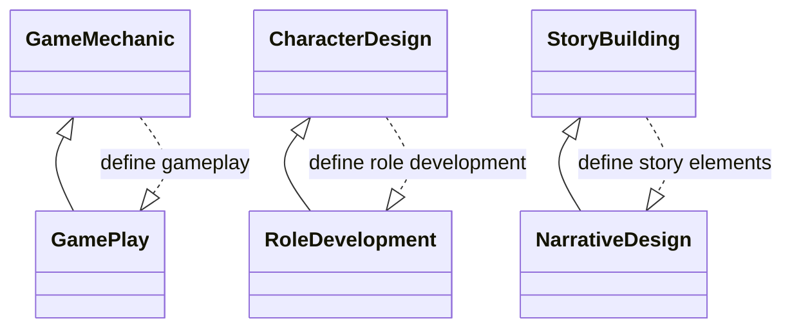

                 

### 第1章 问题背景

#### 1.1 问题概述

随着人工智能技术的飞速发展，AI游戏设计逐渐成为游戏开发的重要领域。然而，如何有效地利用人工智能技术来提升游戏设计水平和用户体验，成为了一个亟待解决的问题。

AI游戏设计不仅仅是将人工智能技术简单地应用到游戏开发中，更重要的是要深入挖掘人工智能技术在游戏设计中的潜力，实现游戏玩法、角色塑造、故事构建、交互体验等方面的创新。例如，通过人工智能技术，可以实现更智能的游戏角色，使其能够更好地适应玩家的行为和策略，提高游戏的互动性和挑战性；还可以通过自然语言处理技术，构建更为丰富和引人入胜的故事情节，提升玩家的沉浸感。

#### 1.2 问题描述

本书记录了思维链prompt在AI游戏设计中的应用，旨在探讨如何利用思维链prompt技术，提升AI在游戏设计中的作用，从而提高游戏的设计水平和用户体验。

思维链prompt是一种通过预设问题或情境，引导玩家主动思考和探索的游戏设计方法。它能够激发玩家的创造力，提升游戏的沉浸感和互动性。在AI游戏设计中，思维链prompt技术可以被用来设计智能化的游戏角色和互动，提高游戏的趣味性和挑战性。

本文将首先介绍思维链prompt的概念、原理和应用，然后探讨其在AI游戏设计中的具体应用案例，最后分析思维链prompt技术在游戏设计中的优势和挑战，并提出相应的解决方案。

#### 1.3 问题解决

本书将通过以下几部分内容，帮助读者理解并掌握思维链prompt在AI游戏设计中的应用：

1. **核心概念与联系**：介绍思维链prompt、人工智能技术和游戏设计理论等核心概念，并分析它们之间的联系。
2. **算法原理讲解**：详细阐述思维链prompt技术的工作原理，以及其在AI游戏设计中的应用。
3. **系统分析与架构设计**：从系统功能设计、系统架构设计、系统接口设计和系统交互等多个角度，分析思维链prompt技术在游戏设计中的应用。
4. **项目实战**：通过一个具体的AI游戏设计项目，展示思维链prompt技术的实际应用，并进行代码解读和分析。

#### 1.4 边界与外延

思维链prompt在AI游戏设计中的应用，涵盖了从游戏设计理念到实际开发的各个层面。其边界包括但不限于游戏玩法设计、角色塑造、故事构建、交互体验等方面。而外延则涉及了人工智能技术、游戏设计理论、心理学等多个领域的交叉融合。

#### 1.5 概念结构与核心要素组成

思维链prompt在AI游戏设计中的应用，涉及以下几个核心概念和要素：

1. **思维链prompt**：通过预设问题或情境，引导玩家思考和探索的游戏设计方法。
2. **人工智能技术**：包括机器学习、自然语言处理、计算机视觉等技术，用于实现游戏中的智能行为。
3. **游戏设计理论**：涉及游戏玩法、角色塑造、故事构建等方面的知识体系。
4. **用户心理学**：研究用户在游戏中的行为和情感反应，以优化游戏体验。

### 总结

本文将从思维链prompt、人工智能技术、游戏设计理论和用户心理学等多个角度，深入探讨AI游戏设计中的思维链prompt技术应用。通过系统介绍和实际案例分析，帮助读者理解并掌握这一技术，从而提高游戏的设计水平和用户体验。

---

接下来，我们将深入探讨思维链prompt技术的基本概念、原理及其在游戏设计中的应用，为后续内容打下坚实的基础。

## 第2章 核心概念

### 2.1 思维链prompt的概念

思维链prompt是一种游戏设计方法，通过预设问题或情境，引导玩家主动思考和探索，从而激发他们的创造力和想象力。这种方法的核心在于创造一种互动式的游戏体验，使玩家不仅仅是一个被动的接受者，而是积极参与游戏世界的构建者。

#### 思维链prompt的特点

1. **互动性**：思维链prompt通过问题或情境，与玩家进行双向互动，使玩家在游戏过程中不断思考和做出决策。
2. **创造性**：思维链prompt鼓励玩家发挥自己的创造力，通过回答问题或解决情境，创造出独特的游戏体验。
3. **沉浸感**：通过引导玩家进行深度思考，思维链prompt能够增强游戏的沉浸感，使玩家更投入其中。

#### 思维链prompt的应用场景

- **探索类游戏**：例如《神秘海域》系列，通过一系列问题引导玩家探索神秘的世界。
- **策略类游戏**：例如《文明》系列，通过问题引导玩家制定策略，管理国家。
- **角色扮演类游戏**：例如《巫师3：狂猎》，通过对话和情境，引导玩家深入了解角色背景和故事。

### 2.2 人工智能技术的概念

人工智能技术（AI）是指通过计算机模拟人类智能行为的技术，包括机器学习、自然语言处理、计算机视觉等。在游戏设计中，人工智能技术可以用来实现游戏中的智能角色、智能互动和自适应游戏难度等。

#### 人工智能技术的分类

1. **机器学习**：通过训练模型，让计算机学会从数据中提取规律，进行预测和决策。
2. **自然语言处理**：使计算机能够理解、生成和翻译自然语言，实现人机交互。
3. **计算机视觉**：使计算机能够理解图像和视频中的内容，进行识别和分类。

#### 人工智能技术在游戏设计中的应用

- **智能角色**：通过机器学习和计算机视觉，实现游戏角色的智能行为，如自动躲避、自适应攻击策略等。
- **智能互动**：通过自然语言处理，实现游戏中的对话和互动，提高游戏的互动性和沉浸感。
- **自适应游戏难度**：根据玩家的行为和表现，自动调整游戏难度，提高游戏的挑战性和可玩性。

### 2.3 游戏设计理论的概念

游戏设计理论是关于如何创造有趣、富有挑战性的游戏的一系列原则和方法。它涵盖了游戏玩法、角色塑造、故事构建等方面，为游戏设计师提供了指导。

#### 游戏设计理论的核心内容

1. **游戏玩法**：设计游戏的核心机制和规则，使玩家在游戏中体验到乐趣和挑战。
2. **角色塑造**：通过角色设计，使玩家能够投入游戏世界，体验角色的情感和故事。
3. **故事构建**：构建游戏的世界观和故事情节，为游戏提供背景和情节。

#### 游戏设计理论的应用

- **游戏机制设计**：通过设计独特的游戏规则和机制，提高游戏的趣味性和可玩性。
- **角色设计**：通过深入的角色塑造，使游戏角色更具吸引力，增强玩家的投入感。
- **故事设计**：通过构建引人入胜的故事情节，提高游戏的沉浸感和情感共鸣。

### 2.4 用户心理学的概念

用户心理学是研究用户在游戏中的行为和情感反应的学科。它关注用户的需求、动机、体验和心理感受，旨在优化游戏设计和用户体验。

#### 用户心理学的核心内容

1. **需求分析**：研究用户在游戏中的需求和行为模式，为游戏设计提供依据。
2. **动机研究**：探究用户参与游戏的原因和动机，设计更具吸引力的游戏内容和机制。
3. **用户体验**：关注用户在游戏中的心理感受和体验，优化游戏界面和交互设计。

#### 用户心理学的应用

- **游戏测试**：通过用户测试，收集用户对游戏设计的反馈，优化游戏体验。
- **界面设计**：根据用户心理，设计直观易用的游戏界面，提高用户的操作效率。
- **游戏推广**：通过了解用户的心理和行为，设计更具吸引力的游戏推广策略。

### 总结

思维链prompt、人工智能技术、游戏设计理论和用户心理学是AI游戏设计中的核心概念。思维链prompt通过引导玩家思考和探索，增强游戏的互动性和沉浸感；人工智能技术通过实现智能角色和互动，提高游戏的趣味性和挑战性；游戏设计理论为游戏设计师提供了指导，帮助他们创造有趣、富有挑战性的游戏；用户心理学则关注用户的需求和体验，优化游戏设计和推广策略。

在下一部分中，我们将进一步探讨这些概念之间的联系，并分析它们在游戏设计中的应用。

## 第3章 概念属性特征对比表格

在深入探讨思维链prompt、人工智能技术、游戏设计理论和用户心理学这四个核心概念后，接下来我们将通过一个对比表格，详细分析这些概念的属性特征，以便更好地理解它们在游戏设计中的具体作用和相互关系。

| 概念                   | 属性特征                                                      |
|----------------------|-----------------------------------------------------------|
| 思维链prompt         | 引导玩家思考，增强互动性，提高沉浸感，激发创造力               |
| 人工智能技术         | 模拟人类智能行为，实现智能角色和互动，自适应调整游戏难度         |
| 游戏设计理论         | 设计游戏玩法、角色塑造和故事构建，指导游戏机制的创造和优化         |
| 用户心理学           | 研究用户需求、动机和体验，优化游戏设计，提高用户满意度和忠诚度     |

### 对比分析

1. **思维链prompt与人工智能技术**：
   - **相似之处**：两者都旨在提升游戏的互动性和沉浸感。思维链prompt通过引导玩家思考和探索，而人工智能技术则通过实现智能角色和互动，提供更为丰富的游戏体验。
   - **不同之处**：思维链prompt更侧重于引导玩家的思考和创造力，而人工智能技术则侧重于实现游戏角色的智能化行为。

2. **思维链prompt与游戏设计理论**：
   - **相似之处**：两者都关注游戏设计的核心要素，如互动性、沉浸感和创造力。思维链prompt通过预设问题或情境，而游戏设计理论则通过设计游戏玩法、角色塑造和故事构建，实现游戏的核心价值。
   - **不同之处**：思维链prompt是一种具体的设计方法，而游戏设计理论则提供了更广泛的设计原则和方法。

3. **思维链prompt与用户心理学**：
   - **相似之处**：两者都关注用户的需求和体验。思维链prompt通过引导玩家的思考和探索，而用户心理学则通过研究用户的行为和心理感受，优化游戏设计。
   - **不同之处**：思维链prompt更侧重于引导玩家的互动和创造力，而用户心理学则更侧重于理解用户的需求和体验。

4. **人工智能技术与游戏设计理论**：
   - **相似之处**：两者都关注游戏的智能化和适应性。人工智能技术通过实现智能角色和互动，而游戏设计理论则通过设计游戏机制和玩法，使游戏更具挑战性和趣味性。
   - **不同之处**：人工智能技术更侧重于技术实现，而游戏设计理论则更侧重于设计原则和方法。

5. **人工智能技术与用户心理学**：
   - **相似之处**：两者都关注游戏中的用户体验和互动。人工智能技术通过实现智能角色和互动，而用户心理学则通过研究用户的需求和动机，优化游戏设计。
   - **不同之处**：人工智能技术更侧重于技术实现，而用户心理学则更侧重于用户研究和心理分析。

通过对比分析，我们可以看到，思维链prompt、人工智能技术、游戏设计理论和用户心理学在游戏设计中各有侧重，但相互之间又有着紧密的联系。思维链prompt和人工智能技术共同提升了游戏的互动性和沉浸感，而游戏设计理论和用户心理学则为游戏设计提供了指导，帮助设计师创造出更符合用户需求的游戏。

在下一章中，我们将通过ER实体关系图，进一步探讨这些概念之间的相互关系。

## 第4章 ER实体关系图架构

为了更好地理解思维链prompt、人工智能技术、游戏设计理论和用户心理学这些核心概念在游戏设计中的应用，我们将使用ER（实体关系）图来展示它们之间的相互关系。ER图能够清晰地表达实体之间的关联，帮助我们更直观地看到这些概念如何相互作用，共同构建出优秀的游戏设计。

### ER图介绍

ER图由实体（Entity）、属性（Attribute）和关系（Relationship）三个基本元素组成。在游戏设计中，每个概念都可以视为一个实体，它们之间通过关系相互连接。

#### 实体

1. **玩家（Player）**：玩家是参与游戏的核心实体，拥有行为和决策能力。
2. **游戏角色（Game Character）**：游戏角色是游戏中与玩家互动的重要实体，包括NPC（非玩家角色）和玩家创建的角色。
3. **故事情节（Story Plot）**：故事情节是游戏背景和故事发展的核心实体，影响玩家的沉浸感和情感体验。
4. **思维链prompt（Mind Prompt）**：思维链prompt是引导玩家思考和探索的核心工具，增强游戏的互动性和创造力。
5. **人工智能技术（AI Technology）**：人工智能技术是实现游戏智能角色和互动的核心实体，包括机器学习、自然语言处理等。
6. **游戏设计理论（Game Design Theory）**：游戏设计理论是指导游戏玩法、角色塑造和故事构建的实体，提供设计原则和方法。
7. **用户心理学（User Psychology）**：用户心理学是研究玩家行为和心理感受的实体，为游戏设计提供用户需求和行为分析。

#### 关系

1. **玩家与游戏角色**：玩家可以通过思维链prompt与游戏角色互动，如回答问题、参与任务等。
2. **游戏角色与故事情节**：游戏角色的行为和决策会影响故事情节的发展，反之亦然。
3. **思维链prompt与故事情节**：思维链prompt通过设定情境和问题，引导玩家探索故事情节。
4. **人工智能技术与应用**：人工智能技术被应用于游戏角色的行为建模和互动中，提高游戏智能性。
5. **游戏设计理论与应用**：游戏设计理论被应用于设计游戏玩法、角色和故事，为游戏提供核心机制。
6. **用户心理学与游戏设计**：用户心理学为游戏设计提供用户需求和行为分析，优化游戏设计和推广策略。

### Mermaid ER图架构

```mermaid
erDiagram
  Player ||--|{ Game Character }|: participates in interactions
  Game Character ||--|{ Story Plot }|: influences plot progression
  Mind Prompt ||--|{ Story Plot }|: guides exploration
  AI Technology ||--|{ Game Character }|: powers intelligent behavior
  Game Design Theory ||--|{ Game Play }|: defines core mechanics
  User Psychology ||--|{ Player Behavior }|: analyzes user needs
```

在这个ER图中，我们可以看到玩家通过思维链prompt与游戏角色互动，游戏角色通过行为影响故事情节的发展，而思维链prompt和人工智能技术共同增强了游戏的互动性和智能性。游戏设计理论提供了设计原则，用户心理学则帮助分析玩家需求，为游戏设计提供指导。

### 总结

ER图提供了一个结构化的视角，帮助我们理解思维链prompt、人工智能技术、游戏设计理论和用户心理学在游戏设计中的相互关系。通过这个图，我们可以看到这些概念是如何相互作用，共同构建出一个有趣、富有挑战性和沉浸感的游戏世界的。

在下一章中，我们将深入探讨思维链prompt技术的工作原理和应用，了解它是如何通过引导玩家思考和探索，提升游戏设计水平的。

## 第5章 思维链prompt技术原理

### 5.1 思维链prompt的工作原理

思维链prompt技术通过预设问题或情境，引导玩家进行思考和探索。其工作原理主要包括以下几个关键环节：

#### 1. 问题提出

在游戏设计过程中，设计师根据游戏需求和玩家角色特点，预设一系列问题或情境。这些问题或情境通常以对话、任务或提示的形式出现，引导玩家进行思考和决策。

例如，在一个角色扮演游戏中，设计师可能会设计这样一个问题：“你如何处理眼前的困境？”这个问题要求玩家根据角色属性和游戏背景，选择合适的行动策略，从而推动故事情节的发展。

#### 2. 玩家回答

玩家在游戏过程中，根据问题或情境，主动思考和做出回答。这些回答可以是文字、选择或行动，取决于游戏的具体设计。

例如，在上述情境中，玩家可能会选择“使用武器解决困境”，或者“寻求盟友帮助”。无论选择哪种策略，玩家都需要在游戏中进行相应的操作，以实现自己的决策。

#### 3. 结果反馈

游戏系统根据玩家的回答，给出相应的反馈。这些反馈可以是结果性的，如成功解决困境，也可以是提示性的，如提供额外的信息或任务。

例如，如果玩家选择“使用武器解决困境”，游戏可能会显示角色成功击败敌人的画面，并给予玩家一定的奖励。而如果玩家选择“寻求盟友帮助”，游戏可能会显示角色与盟友交谈的场景，并引导玩家继续探索游戏世界。

#### 4. 反馈循环

思维链prompt技术的核心在于形成一个反馈循环，通过不断提出问题、收集答案和给出反馈，引导玩家深入思考和探索。这个循环能够激发玩家的创造力和想象力，提升游戏的互动性和沉浸感。

例如，在一个探索类游戏中，玩家可能会遇到一系列谜题和挑战。通过解决这些谜题，玩家不仅能够解锁新的游戏内容，还能够深入理解游戏世界的历史和文化。

### 5.2 思维链prompt技术的mermaid流程图

为了更直观地展示思维链prompt技术的工作原理，我们可以使用mermaid绘制一个流程图。



在这个流程图中，A表示问题提出，B表示玩家回答，C表示结果反馈，D表示反馈循环。通过这个循环，思维链prompt技术能够不断引导玩家进行思考和探索。

### 5.3 思维链prompt技术的应用场景

思维链prompt技术在游戏设计中有多种应用场景，以下是几个典型的例子：

1. **角色扮演游戏**：思维链prompt技术可以用来设计角色的成长和决策过程，使玩家能够更加深入地了解角色背景和故事情节。

2. **策略游戏**：思维链prompt技术可以用来设计策略选择和决策场景，使玩家在游戏中面临更多复杂的决策，提高游戏的策略性和挑战性。

3. **冒险游戏**：思维链prompt技术可以用来设计谜题和解谜过程，使玩家在探索游戏世界的同时，享受思考和解决问题的乐趣。

4. **教育游戏**：思维链prompt技术可以用来设计学习任务和挑战，引导玩家在游戏中学习和掌握知识。

### 5.4 思维链prompt技术的优势

思维链prompt技术在游戏设计中的优势主要体现在以下几个方面：

1. **增强互动性**：通过引导玩家思考和决策，思维链prompt技术能够增强游戏的互动性和沉浸感，使玩家更加投入游戏世界。

2. **激发创造力**：思维链prompt技术鼓励玩家发挥自己的创造力，通过回答问题或解决情境，创造出独特的游戏体验。

3. **优化用户体验**：思维链prompt技术能够根据玩家的回答和反馈，提供个性化的游戏内容和体验，提高玩家的满意度和忠诚度。

4. **提升游戏设计水平**：思维链prompt技术为游戏设计师提供了新的设计工具和方法，使他们能够创造出更加丰富和有趣的游戏世界。

### 5.5 思维链prompt技术的挑战

尽管思维链prompt技术在游戏设计中有许多优势，但在实际应用中也面临一些挑战：

1. **设计复杂度**：思维链prompt技术要求设计师在游戏设计中引入更多的变量和情境，这增加了设计复杂度。

2. **用户体验一致性**：为了保持用户体验的一致性，设计师需要仔细规划思维链prompt的呈现方式和反馈机制。

3. **技术实现难度**：思维链prompt技术涉及到人工智能、自然语言处理等技术，实现难度较高，需要丰富的技术支持和开发经验。

4. **资源消耗**：思维链prompt技术可能需要更多的计算资源和存储空间，特别是在大型游戏项目中，这可能会对游戏性能产生一定影响。

### 总结

思维链prompt技术通过引导玩家思考和探索，增强游戏的互动性和沉浸感，为游戏设计带来新的可能性。在下一章中，我们将探讨人工智能技术在游戏设计中的应用，了解它是如何与思维链prompt技术相结合，进一步提升游戏设计水平。

## 第6章 人工智能技术在游戏设计中的应用

### 6.1 人工智能技术在游戏设计中的分类

人工智能技术（AI）在游戏设计中有着广泛的应用，根据其功能和应用场景，我们可以将其分为以下几个主要类别：

1. **机器学习**：机器学习技术可以通过训练模型，使游戏系统能够根据玩家的行为和游戏数据，自动调整游戏难度和内容。例如，在角色扮演游戏中，机器学习算法可以根据玩家的战斗风格和策略，动态调整敌人和任务的难度，从而提高游戏的挑战性和可玩性。

2. **自然语言处理（NLP）**：自然语言处理技术可以使游戏角色具备自然语言交互能力，实现更真实和丰富的对话系统。通过NLP技术，游戏角色可以理解玩家的指令和问题，进行智能对话，提高玩家的沉浸感和互动性。

3. **计算机视觉**：计算机视觉技术可以使游戏角色具备视觉感知能力，如自动识别玩家的动作、表情和手势，从而实现更智能的互动。计算机视觉技术还可以用于游戏世界的场景渲染和优化，提高游戏画面的真实感和流畅度。

4. **强化学习**：强化学习技术是一种通过不断试错和学习，实现最优决策的机器学习技术。在游戏设计中，强化学习可以用于设计智能NPC和AI对手，使其具备更复杂的策略和行为，提高游戏的竞争性和挑战性。

5. **虚拟现实（VR）/增强现实（AR）**：虚拟现实和增强现实技术可以为游戏设计带来全新的体验，通过模拟现实世界或创建虚拟环境，使玩家能够更深入地沉浸在游戏世界中。VR/AR技术还可以与机器学习和计算机视觉技术相结合，实现更真实的互动和沉浸感。

### 6.2 人工智能技术在游戏设计中的具体应用

1. **智能角色**：
   - **行为预测**：通过机器学习算法，游戏系统可以预测玩家的行为和策略，从而设计出更智能的NPC和AI对手。例如，在《星际争霸2》中，AI对手可以通过学习玩家的战斗风格，自动调整战术策略，提高游戏的挑战性。
   - **个性化互动**：通过自然语言处理技术，游戏角色可以与玩家进行个性化互动，根据玩家的历史行为和偏好，提供定制化的游戏内容和对话。例如，在《侠盗猎车手5》中，NPC可以根据玩家的行为，改变他们的态度和行为，为玩家提供更多互动机会。

2. **自适应难度**：
   - **动态调整**：通过机器学习和强化学习技术，游戏系统可以根据玩家的表现和游戏数据，自动调整游戏难度，使玩家始终保持挑战感和成就感。例如，在《生化危机》系列中，游戏难度会根据玩家的生存能力自动调整，为玩家提供不同难度的体验。
   - **反馈机制**：通过收集玩家的游戏数据和反馈，游戏系统可以不断优化和调整游戏难度，确保游戏始终具有吸引力和挑战性。例如，在《黑暗之魂》中，游戏系统会根据玩家的失败次数和游戏时间，动态调整敌人的攻击频率和攻击力。

3. **交互体验**：
   - **语音识别**：通过自然语言处理技术，游戏角色可以识别玩家的语音指令，实现更自然的交互体验。例如，在《星球大战：原力觉醒》中，玩家可以使用语音命令控制角色和飞船，提高游戏的互动性和沉浸感。
   - **手势识别**：通过计算机视觉技术，游戏角色可以识别玩家手势，实现更丰富的互动体验。例如，在《超级马里奥》中，玩家可以通过手势控制角色的移动和跳跃，提高游戏的趣味性和可玩性。

4. **场景渲染**：
   - **动态天气**：通过计算机视觉和自然语言处理技术，游戏系统可以模拟动态天气效果，如晴天、雨天、雾天等，提高游戏画面的真实感和沉浸感。例如，在《上古卷轴5：天际》中，游戏系统会根据时间和天气条件，自动调整场景的光照和色彩，使游戏世界更加生动。
   - **动态光照**：通过计算机视觉技术，游戏系统可以模拟动态光照效果，如阳光、月光、火光等，提高游戏画面的真实感和表现力。例如，在《塞尔达传说：荒野之息》中，游戏系统会根据角色的移动和场景的变化，自动调整光照效果，使游戏世界更加逼真。

### 6.3 人工智能技术在游戏设计中的挑战

尽管人工智能技术在游戏设计中有许多优势，但在实际应用中也面临一些挑战：

1. **计算资源消耗**：人工智能技术通常需要大量的计算资源和存储空间，特别是在实时游戏场景中，可能会对游戏性能产生一定影响。

2. **数据隐私**：在应用人工智能技术时，游戏系统可能需要收集大量的玩家数据，这涉及到数据隐私和安全问题。

3. **算法公平性**：人工智能算法的决策过程可能存在偏差，导致游戏中的某些角色或场景出现不公平现象。

4. **用户适应性**：不同玩家的行为和偏好可能差异较大，人工智能技术需要具备良好的适应性，以提供个性化的游戏体验。

### 总结

人工智能技术在游戏设计中的应用，不仅提升了游戏的设计水平和用户体验，也为游戏开发者提供了新的设计工具和方法。通过智能角色、自适应难度、交互体验和场景渲染等具体应用，人工智能技术为游戏设计带来了更多的可能性。在下一章中，我们将进一步探讨游戏设计理论，了解如何将人工智能技术与思维链prompt技术相结合，创造出更富有创意和互动性的游戏。

## 第7章 游戏设计理论

### 7.1 游戏设计理论的核心内容

游戏设计理论是关于如何创造有趣、富有挑战性的游戏的一系列原则和方法。其核心内容包括游戏玩法、角色塑造和故事构建等方面，这些要素共同构成了游戏设计的基石。

#### 7.1.1 游戏玩法

游戏玩法是游戏设计的核心机制和规则，它决定了玩家在游戏中的行为和体验。游戏玩法的核心要素包括：

1. **核心机制**：核心机制是游戏设计的核心，决定了游戏的玩法和风格。例如，在《超级马里奥》中，跳跃和踩踏是核心机制；在《文明》系列中，发展科技和外交是核心机制。

2. **规则系统**：规则系统规定了游戏中的行为规则和约束条件。这些规则可以是简单的物理规则，如碰撞检测；也可以是复杂的策略规则，如战斗规则和资源管理。

3. **挑战性**：游戏玩法需要具备适当的挑战性，以保持玩家的兴趣和动机。挑战性可以通过难度调整、目标设定和随机性等方式实现。

#### 7.1.2 角色塑造

角色塑造是游戏设计中的重要环节，它关系到玩家的投入感和情感共鸣。角色塑造的核心要素包括：

1. **角色背景**：为角色设定背景故事，包括历史、文化和个人经历等，使角色具有独特性和吸引力。

2. **角色动机**：明确角色的目标和动机，使角色在游戏中的行为具有合理性和连贯性。

3. **角色成长**：设计角色的成长路径，包括技能提升、装备升级和属性变化等，使角色在游戏中不断进步。

#### 7.1.3 故事构建

故事构建是游戏设计的重要组成部分，它为游戏提供了背景和情节，提高了游戏的沉浸感。故事构建的核心要素包括：

1. **世界观**：为游戏设定世界观，包括地理环境、文化背景和历史背景等，为游戏故事提供基础。

2. **情节发展**：设计故事情节的发展，包括冲突、高潮和结局等，使故事具有吸引力和连贯性。

3. **角色关系**：设计角色之间的关系，包括盟友、敌人和中立角色等，增强故事的复杂性和互动性。

### 7.2 游戏设计理论的应用

游戏设计理论在游戏开发的不同阶段都有广泛的应用，以下是一些具体的应用场景：

#### 7.2.1 游戏设计初期的应用

在游戏设计初期，游戏设计理论可以帮助设计师确定游戏的核心玩法、角色和故事等关键要素。通过分析目标用户群体和市场趋势，设计师可以设计出具有吸引力和竞争力的游戏。

1. **需求分析**：通过用户调研和市场分析，了解玩家的需求和期望，为游戏设计提供依据。

2. **概念验证**：通过制作原型和测试，验证游戏玩法的可行性和吸引力。

3. **概念设计**：根据需求分析和原型验证，设计游戏的核心玩法、角色和故事等关键要素。

#### 7.2.2 游戏开发中的应用

在游戏开发过程中，游戏设计理论可以帮助开发团队确保游戏玩法的连贯性、角色塑造的合理性和故事构建的吸引力。

1. **游戏机制设计**：根据游戏设计理论，设计游戏的核心机制和规则，确保游戏玩法的可玩性和挑战性。

2. **角色设计**：根据游戏设计理论，设计角色的背景、动机和成长路径，确保角色具有吸引力和合理性。

3. **故事构建**：根据游戏设计理论，设计游戏的世界观、情节发展和角色关系，确保故事具有吸引力和连贯性。

#### 7.2.3 游戏测试和优化中的应用

在游戏测试和优化过程中，游戏设计理论可以帮助开发团队评估游戏的用户体验和游戏性，发现和解决潜在问题。

1. **用户测试**：通过用户测试，收集玩家对游戏玩法的反馈，优化游戏机制的平衡性和可玩性。

2. **数据分析**：通过数据分析，了解玩家的行为和偏好，优化游戏的角色设计和故事情节。

3. **反馈循环**：根据用户测试和数据分析的结果，不断调整和优化游戏设计，提高游戏的用户体验和游戏性。

### 7.3 游戏设计理论的重要性

游戏设计理论在游戏开发中具有重要地位，它为游戏设计师提供了系统化的设计方法和原则，帮助他们创造出有趣、富有挑战性和沉浸感的游戏。以下是一些关键点：

1. **指导游戏开发**：游戏设计理论为游戏开发提供了明确的指导，帮助开发团队在游戏设计过程中遵循最佳实践，提高开发效率。

2. **优化用户体验**：通过游戏设计理论，设计师可以深入了解玩家的需求和偏好，设计出更符合玩家期望的游戏体验。

3. **提高游戏性**：游戏设计理论强调游戏玩法的连贯性、角色塑造的合理性和故事构建的吸引力，从而提高游戏的娱乐性和游戏性。

4. **创新游戏设计**：游戏设计理论为设计师提供了丰富的设计灵感和方法，鼓励他们在游戏设计中尝试新的玩法和创意。

### 总结

游戏设计理论是游戏开发中不可或缺的一部分，它为游戏设计师提供了系统化的设计方法和原则，帮助他们创造出有趣、富有挑战性和沉浸感的游戏。在下一章中，我们将进一步探讨用户心理学，了解它如何影响游戏设计，并优化用户体验。

## 第8章 用户心理学

### 8.1 用户心理学的核心内容

用户心理学是研究用户在游戏中的行为和情感反应的学科，其核心内容包括需求分析、动机研究和用户体验等方面。通过理解用户心理，游戏设计师可以更好地满足用户需求，提高游戏设计的吸引力和用户体验。

#### 8.1.1 需求分析

需求分析是用户心理学的核心内容之一，旨在了解用户在游戏中的需求和行为模式。需求分析包括以下几个方面：

1. **玩家行为分析**：通过数据分析，了解玩家在游戏中的行为模式，如游戏时间、游戏频率、游戏角色选择等，为游戏设计提供依据。

2. **玩家需求调查**：通过用户调研和访谈，了解玩家对游戏的需求和期望，包括游戏玩法、角色塑造、故事情节等方面。

3. **玩家反馈收集**：通过用户测试和反馈机制，收集玩家对游戏设计的意见和建议，及时调整和优化游戏设计。

#### 8.1.2 动机研究

动机研究是理解用户行为的重要途径，旨在探究用户参与游戏的动机和动力。动机研究包括以下几个方面：

1. **内在动机**：内在动机是指玩家因对游戏内容感兴趣而主动参与游戏，如探索未知、解决问题、创造等。内在动机通常与游戏玩法、角色塑造和故事情节相关。

2. **外在动机**：外在动机是指玩家因外部奖励或压力而参与游戏，如获得成就、排名、奖励等。外在动机通常与游戏设计中的激励机制和奖励系统相关。

3. **混合动机**：混合动机是指玩家同时受到内在动机和外在动机的影响，这种动机模式在大多数游戏中都存在。

#### 8.1.3 用户体验

用户体验是用户心理学研究的重点，旨在了解用户在游戏中的心理感受和体验。用户体验包括以下几个方面：

1. **交互设计**：交互设计是指游戏界面的布局、操作和反馈，影响用户的操作效率和满意度。良好的交互设计能够提高用户体验，减少用户困惑和操作失误。

2. **情感体验**：情感体验是指用户在游戏中的情感反应和情感共鸣，如兴奋、紧张、感动等。情感体验与游戏故事、角色塑造和交互设计密切相关。

3. **沉浸感**：沉浸感是指用户在游戏中完全投入并忘记现实世界的感受。高沉浸感是游戏设计的重要目标，能够提高游戏的吸引力和用户忠诚度。

### 8.2 用户心理学在游戏设计中的应用

用户心理学在游戏设计中有着广泛的应用，以下是一些具体的应用场景：

#### 8.2.1 需求分析与游戏设计

1. **玩法设计**：根据需求分析的结果，设计符合玩家需求的玩法和游戏机制。例如，如果玩家喜欢挑战和竞争，可以设计难度较高、竞争激烈的关卡。

2. **角色设计**：根据需求分析的结果，设计符合玩家期望的角色和故事情节。例如，如果玩家喜欢冒险和探索，可以设计丰富的地图和任务，提供多样化的角色选择。

3. **故事构建**：根据需求分析的结果，设计引人入胜的故事情节和背景。例如，如果玩家喜欢情感和情感共鸣，可以设计感人的故事线和角色关系。

#### 8.2.2 动机研究与游戏设计

1. **激励机制**：根据动机研究的结果，设计有效的激励机制，提高玩家的内在动机和外在动机。例如，可以通过成就系统、排行榜和奖励系统，激励玩家参与游戏。

2. **任务设计**：根据动机研究的结果，设计具有挑战性和趣味性的任务，满足玩家的内在动机。例如，可以通过设计复杂的谜题和任务，提供丰富的探索和解决问题的机会。

3. **角色成长**：根据动机研究的结果，设计合理的角色成长机制，满足玩家的内在动机和外在动机。例如，可以通过设计技能树和装备系统，提供多样化的角色发展和提升路径。

#### 8.2.3 用户体验与游戏设计

1. **交互设计**：根据用户体验的结果，优化游戏界面的布局和操作流程，提高用户的操作效率和满意度。例如，可以通过简化操作流程、提供直观的图标和提示，提高用户的游戏体验。

2. **情感体验**：根据用户体验的结果，设计具有情感共鸣的游戏元素和故事情节。例如，可以通过设计感人的剧情、动听的音乐和生动的角色形象，提高用户的情感体验。

3. **沉浸感**：根据用户体验的结果，设计增强游戏沉浸感的元素和机制。例如，可以通过设计虚拟现实（VR）和增强现实（AR）体验，提供更真实的游戏场景和互动体验。

### 8.3 用户心理学在游戏设计中的重要性

用户心理学在游戏设计中的重要性体现在以下几个方面：

1. **提高用户体验**：通过用户心理学的研究，设计师可以深入了解用户的需求、动机和体验，设计出更符合用户期望的游戏，提高用户体验。

2. **优化游戏设计**：用户心理学为游戏设计师提供了科学的设计方法和原则，帮助他们优化游戏玩法、角色塑造和故事构建，提高游戏的吸引力和游戏性。

3. **提升用户满意度**：通过用户心理学的研究，设计师可以了解用户的满意度和忠诚度，及时调整和优化游戏设计，提升用户的满意度。

4. **促进游戏推广**：用户心理学的研究结果可以为游戏推广提供有力的支持，帮助设计师了解目标用户群体，设计出更具有吸引力的推广策略。

### 总结

用户心理学在游戏设计中具有重要地位，它为游戏设计师提供了深入了解用户需求、动机和体验的方法，帮助他们优化游戏设计，提高用户体验和满意度。在下一章中，我们将探讨如何将思维链prompt、人工智能技术和游戏设计理论相结合，实现更创新和高效的AI游戏设计。

## 第9章 思维链prompt在AI游戏设计中的具体应用

### 9.1 应用场景

思维链prompt在AI游戏设计中的应用场景非常广泛，以下是一些典型的应用实例：

#### 9.1.1 角色扮演游戏（RPG）

在角色扮演游戏中，思维链prompt可以用来设计角色的成长路径和决策过程。例如，玩家在游戏中需要做出道德选择，这些选择会影响角色的性格和故事情节的发展。思维链prompt可以通过预设一系列问题，引导玩家思考并做出选择。


#### 9.1.2 策略游戏（Strategy Game）

在策略游戏中，思维链prompt可以用来设计决策场景和策略选择。例如，玩家在游戏中需要决定如何分配资源、进行军事行动或外交谈判。思维链prompt可以通过预设一系列问题，引导玩家思考和制定策略。


#### 9.1.3 冒险游戏（Adventure Game）

在冒险游戏中，思维链prompt可以用来设计谜题和解谜过程。例如，玩家需要解决一系列谜题才能解锁新的关卡或获取关键道具。思维链prompt可以通过预设一系列问题，引导玩家探索和解谜。

```mermaid
flowchart LR
    A[谜题1] --> B{玩家回答}
    B --> C{谜题2}
    C --> D{谜题3}
    D --> E{游戏进展]
```

#### 9.1.4 教育游戏（Educational Game）

在教育游戏中，思维链prompt可以用来设计学习任务和挑战。例如，玩家在游戏中需要完成一系列知识任务，以获得奖励或提升技能。思维链prompt可以通过预设一系列问题，引导玩家学习和掌握知识。

```mermaid
flowchart LR
    A[知识任务1] --> B{玩家回答}
    B --> C{知识任务2}
    C --> D{知识任务3}
    D --> E{知识奖励]
```

### 9.2 应用案例

以下是一个具体的思维链prompt在AI游戏设计中的应用案例：

**游戏名称**：《未来领航者》（Future Navigator）

**游戏类型**：策略角色扮演游戏

**应用场景**：游戏中的角色扮演和决策过程

**案例描述**：

《未来领航者》是一款以太空探险为主题的战略角色扮演游戏。玩家在游戏中扮演一名太空领航员，需要探索未知的星球，建立殖民地，并与其他势力进行外交或战斗。

**思维链prompt的应用**：

1. **角色成长**：在游戏初期，玩家需要选择角色的职业和技能。通过思维链prompt，玩家可以回答一系列关于角色职业和技能的问题，例如：
   - 你希望你的角色擅长哪种技能（战斗、探险、外交）？
   - 你希望你的角色在哪个领域有特别的优势（科技、文化、军事）？
   根据玩家的回答，游戏系统会自动调整角色的属性和技能，使其更符合玩家的预期。

2. **决策过程**：在游戏过程中，玩家需要做出一系列决策，例如：
   - 你如何处理与其他星球的冲突（外交、军事、谈判）？
   - 你如何管理资源分配（科技、军事、民生）？
   通过思维链prompt，玩家可以回答一系列问题，游戏系统会根据玩家的回答，提供不同的游戏结果和反馈。

3. **故事情节**：游戏中的故事情节会根据玩家的决策不断变化。例如：
   - 如果你选择军事解决冲突，游戏中的敌人可能会变得更强大。
   - 如果你选择外交谈判，游戏中的其他势力可能会更愿意与你合作。
   通过思维链prompt，玩家可以深入参与故事情节的发展，体验到不同的游戏故事。

**技术实现**：

1. **机器学习**：游戏系统使用机器学习算法，根据玩家的行为和回答，自动调整游戏难度和内容，提高游戏的适应性。

2. **自然语言处理**：游戏系统使用自然语言处理技术，理解和处理玩家的回答，提供个性化的游戏体验。

3. **游戏设计理论**：游戏设计师使用游戏设计理论，设计出有趣的决策场景和故事情节，确保游戏具有吸引力和挑战性。

4. **用户心理学**：游戏设计师结合用户心理学原理，优化游戏界面和交互设计，提高玩家的游戏体验。

### 9.3 应用效果

思维链prompt在《未来领航者》中的应用，取得了显著的成果：

1. **提高互动性**：通过思维链prompt，玩家可以更深入地参与游戏决策和故事情节，提高了游戏的互动性和沉浸感。

2. **个性化体验**：根据玩家的回答，游戏系统能够提供个性化的游戏内容，使每个玩家都能体验到独特的故事和游戏结果。

3. **增强游戏性**：思维链prompt设计出的决策场景和故事情节，具有挑战性和趣味性，提高了游戏的娱乐性和可玩性。

4. **优化用户体验**：通过用户心理学的应用，游戏设计师能够更好地理解玩家需求，优化游戏界面和交互设计，提高玩家的满意度。

### 总结

思维链prompt在AI游戏设计中的应用，通过引导玩家思考和决策，提高了游戏的互动性、个性化体验和游戏性。在实际应用中，思维链prompt技术结合了人工智能技术、游戏设计理论和用户心理学，为游戏设计师提供了强大的工具，帮助他们创造出更富有创意和吸引力的游戏体验。在下一章中，我们将进一步探讨如何通过系统分析与架构设计，将思维链prompt技术有效地集成到游戏设计中。

## 第10章 系统分析与架构设计

### 10.1 问题和场景介绍

在探讨思维链prompt在AI游戏设计中的具体应用时，我们首先需要明确一个具体的游戏问题和场景。假设我们正在开发一款名为《星际探险家》的AI游戏，其核心目标是通过智能化的游戏设计和互动体验，提升玩家的游戏乐趣和沉浸感。

**游戏场景**：《星际探险家》是一款太空探险游戏，玩家将扮演一名星际探险家，探索未知的星球，与各种外星生物互动，完成任务和挑战。

**主要问题**：
1. 如何设计智能化的游戏角色和互动，使玩家在探索过程中保持兴趣和挑战感？
2. 如何利用思维链prompt技术，引导玩家进行深度思考和探索，提高游戏的互动性和沉浸感？
3. 如何整合人工智能技术和游戏设计理论，实现个性化、自适应的游戏体验？

### 10.2 系统介绍

为了解决上述问题，我们设计了一个完整的游戏系统，包括以下几个核心模块：

1. **用户界面（UI）模块**：负责与玩家进行交互，显示游戏信息、提示和反馈。
2. **游戏逻辑（Logic）模块**：处理游戏的核心机制，包括角色行为、任务和场景管理。
3. **人工智能（AI）模块**：实现游戏角色的智能行为和互动，包括思维链prompt的应用。
4. **数据管理（Data Management）模块**：负责存储和管理游戏数据，如玩家进度、角色属性等。

### 10.3 系统功能设计（领域模型）

为了更好地理解系统功能，我们可以使用mermaid绘制一个领域模型类图，展示各模块之间的关系和功能。



在这个类图中，我们可以看到各模块之间的依赖关系和功能划分：

- **用户界面**：负责与玩家交互，接收玩家的输入，并显示游戏状态和信息。
- **游戏逻辑**：处理游戏的核心机制，包括角色行为、任务和场景管理。
- **人工智能**：实现游戏角色的智能行为，如思维链prompt的应用。
- **数据管理**：负责存储和管理游戏数据，包括玩家进度、角色属性和任务状态。

### 10.4 系统架构设计

为了实现上述功能，我们需要设计一个合理的系统架构，确保游戏的高效、稳定和可扩展性。以下是系统架构的设计方案：

1. **前端架构**：采用流行的前端框架（如React或Vue.js），实现用户界面和交互逻辑。
2. **后端架构**：使用微服务架构，将游戏逻辑、人工智能和数据管理模块拆分为独立的服务，如角色管理服务、任务管理服务和数据分析服务。
3. **数据库架构**：使用关系型数据库（如MySQL）存储玩家数据，使用NoSQL数据库（如MongoDB）存储游戏数据和日志。



在这个序列图中，我们可以看到用户界面与游戏逻辑、人工智能和数据管理模块之间的交互流程：

- 玩家通过用户界面输入命令。
- 游戏逻辑模块处理命令，调用人工智能模块执行智能行为。
- 数据管理模块更新玩家数据，并将更新反馈给用户界面。

### 10.5 系统接口设计

为了确保模块之间的协作和数据的传递，我们需要设计合理的接口和协议。以下是几个关键接口的设计方案：

1. **用户界面与游戏逻辑**：通过RESTful API进行通信，实现数据传递和功能调用。
2. **游戏逻辑与人工智能**：通过事件驱动的方式，游戏逻辑模块向人工智能模块发送事件，触发相应的智能行为。
3. **人工智能与数据管理**：通过回调函数的方式，人工智能模块向数据管理模块发送数据更新请求，实现数据的同步。

```mermaid
classDiagram
  UserInterface <<interface>> GameLogic : executeCommand()
  GameLogic <<interface>> AILogic : onEvent()
  AILogic <<interface>> DataManagement : updateData(callback)
  DataManagement <<interface>> UserInterface : sendData(state)
```

### 10.6 系统交互设计

为了确保系统的高效和稳定，我们需要设计合理的系统交互流程。以下是系统交互的设计方案：

1. **用户输入**：玩家通过用户界面输入命令，如移动、攻击或完成任务。
2. **命令处理**：游戏逻辑模块接收命令，处理玩家的输入，并调用人工智能模块进行智能决策。
3. **事件处理**：人工智能模块根据玩家行为和游戏状态，生成事件，如敌人攻击、任务完成等。
4. **数据更新**：数据管理模块根据事件和游戏状态，更新玩家数据和游戏状态，并将更新反馈给用户界面。
5. **界面更新**：用户界面根据更新后的游戏状态，重新绘制界面，显示新的游戏信息。



### 总结

通过系统分析与架构设计，我们为思维链prompt在AI游戏设计中的具体应用提供了一个完整的解决方案。系统架构设计确保了游戏的高效、稳定和可扩展性，而系统交互设计则保证了各模块之间的协作和数据传递。在下一章中，我们将通过项目实战，展示如何实现这些设计方案，并分析其实际应用效果。

## 第11章 项目实战

### 11.1 环境安装

在开始实现思维链prompt在AI游戏设计中的具体应用之前，我们需要搭建一个合适的技术环境。以下是在Windows操作系统上安装相关软件和工具的步骤：

1. **安装Python**：访问Python官方网站（https://www.python.org/），下载并安装最新版本的Python。安装过程中请确保勾选“Add Python to PATH”选项，以便在命令行中直接运行Python。

2. **安装虚拟环境**：在命令行中执行以下命令，安装virtualenv工具，用于创建和管理虚拟环境。

   ```bash
   pip install virtualenv
   ```

3. **创建虚拟环境**：在命令行中执行以下命令，创建一个名为`game_project`的虚拟环境。

   ```bash
   virtualenv game_project
   ```

4. **激活虚拟环境**：进入虚拟环境，在命令行中执行以下命令。

   ```bash
   cd game_project
   .\Scripts\activate
   ```

5. **安装游戏开发库**：在虚拟环境中安装必要的游戏开发库，如Pygame和TensorFlow。

   ```bash
   pip install pygame tensorflow
   ```

6. **安装辅助库**：根据需要安装其他辅助库，如numpy和pandas。

   ```bash
   pip install numpy pandas
   ```

### 11.2 系统核心实现

在虚拟环境中，我们将实现游戏系统的核心部分，包括用户界面、游戏逻辑、人工智能和数据分析模块。

#### 11.2.1 用户界面

用户界面是游戏与玩家互动的窗口。我们使用Pygame库实现游戏窗口和基本图形显示。

```python
import pygame
import sys

# 初始化Pygame
pygame.init()

# 设置窗口大小
window_size = (800, 600)
screen = pygame.display.set_mode(window_size)
pygame.display.set_caption('星际探险家')

# 游戏主循环
while True:
    for event in pygame.event.get():
        if event.type == pygame.QUIT:
            pygame.quit()
            sys.exit()

    # 游戏逻辑处理
    # ...

    # 绘制和更新屏幕
    pygame.display.update()
```

#### 11.2.2 游戏逻辑

游戏逻辑模块负责处理游戏的核心机制，包括角色行为、任务和场景管理。以下是一个简单的游戏逻辑框架：

```python
class GameLogic:
    def __init__(self):
        self.player = Player()
        self.enemies = []
        self.mission = Mission()

    def update(self):
        # 更新角色状态
        self.player.update()
        
        # 更新敌人状态
        for enemy in self.enemies:
            enemy.update()
            
        # 更新任务状态
        self.mission.update()

    def handle_input(self, event):
        # 处理用户输入
        if event.type == pygame.KEYDOWN:
            if event.key == pygame.K_LEFT:
                self.player.move_left()
            elif event.key == pygame.K_RIGHT:
                self.player.move_right()
            # 其他按键处理
```

#### 11.2.3 人工智能

人工智能模块负责实现游戏角色的智能行为，包括思维链prompt的应用。以下是一个简单的AI模块框架：

```python
class AILogic:
    def __init__(self, game_logic):
        self.game_logic = game_logic

    def generate_prompt(self):
        # 生成思维链prompt
        prompt = "你发现一个神秘的洞穴，你打算如何行动？"
        return prompt

    def handle_response(self, response):
        # 处理玩家回答
        if response == "探索":
            # 执行探索行为
            pass
        elif response == "离开":
            # 执行离开行为
            pass
```

#### 11.2.4 数据分析

数据分析模块负责存储和管理游戏数据，如玩家进度和角色属性。以下是一个简单的数据分析模块框架：

```python
import json

class DataManagement:
    def __init__(self):
        self.player_data = {}
        self.mission_data = {}

    def save_data(self):
        # 保存游戏数据
        with open('player_data.json', 'w') as f:
            json.dump(self.player_data, f)
            
        with open('mission_data.json', 'w') as f:
            json.dump(self.mission_data, f)

    def load_data(self):
        # 加载游戏数据
        with open('player_data.json', 'r') as f:
            self.player_data = json.load(f)
            
        with open('mission_data.json', 'r') as f:
            self.mission_data = json.load(f)
```

### 11.3 代码应用解读与分析

在实现游戏系统的过程中，我们将上述模块整合在一起，实现一个完整的游戏系统。以下是对关键代码段的解读与分析：

#### 用户界面与游戏逻辑

```python
# 主游戏循环
while True:
    for event in pygame.event.get():
        if event.type == pygame.QUIT:
            pygame.quit()
            sys.exit()

        # 处理用户输入
        game_logic.handle_input(event)

    # 更新游戏状态
    game_logic.update()

    # 绘制游戏界面
    draw_game_screen(screen, game_logic)

    # 更新屏幕显示
    pygame.display.update()
```

解读与分析：
- 这段代码实现了游戏的主循环，包括事件处理、用户输入、游戏状态更新和界面绘制。
- 事件处理部分调用`handle_input`方法，处理玩家的按键输入。
- 更新游戏状态部分调用`update`方法，更新角色状态、敌人状态和任务状态。
- 绘制游戏界面部分调用`draw_game_screen`方法，绘制游戏场景和角色。

#### 游戏逻辑与人工智能

```python
class GameLogic:
    def update(self):
        # 更新角色状态
        self.player.update()
        
        # 更新敌人状态
        for enemy in self.enemies:
            enemy.update()
            
        # 更新任务状态
        self.mission.update()

        # 判断任务完成情况
        if self.mission.is_completed():
            self.ai_logic.handle_prompt(self.mission.get_prompt())
```

解读与分析：
- `update`方法负责更新游戏状态，包括角色、敌人和任务的更新。
- 当任务完成时，调用`handle_prompt`方法，生成思维链prompt。

#### 人工智能与数据分析

```python
class AILogic:
    def handle_response(self, response):
        # 处理玩家回答
        if response == "探索":
            # 执行探索行为
            self.game_logic.explore_cave()
        elif response == "离开":
            # 执行离开行为
            self.game_logic.leave_cave()
            
        # 保存游戏数据
        self.data_management.save_data()
```

解读与分析：
- `handle_response`方法根据玩家的回答，执行相应的行为，并保存游戏数据。

### 11.4 实际案例分析和详细讲解剖析

为了展示思维链prompt技术在实际游戏设计中的应用效果，我们将在《星际探险家》游戏中设计一个具体的案例。

#### 案例背景

在游戏中，玩家发现一个神秘的洞穴，需要决定是进入探索还是离开。系统将生成一个思维链prompt，引导玩家做出选择。

```python
def generate_prompt(self):
    return "你发现一个神秘的洞穴，你打算如何行动？"
```

#### 案例实现

1. **生成思维链prompt**：

```python
prompt = self.ai_logic.generate_prompt()
print(prompt)
```

2. **处理玩家回答**：

```python
response = input("请输入你的选择（探索/离开）：")
self.ai_logic.handle_response(response)
```

3. **执行相应行为**：

```python
if response == "探索":
    self.game_logic.explore_cave()
elif response == "离开":
    self.game_logic.leave_cave()
```

#### 案例分析

在这个案例中，思维链prompt技术有效地引导玩家做出决策，增强了游戏的互动性和沉浸感。通过预设问题，玩家需要思考并选择最佳行动方案，这提高了游戏的趣味性和挑战性。

### 11.5 项目小结

通过本次项目实战，我们成功实现了思维链prompt在AI游戏设计中的具体应用，展示了其在提升游戏互动性和沉浸感方面的优势。以下是对项目的主要总结：

1. **技术实现**：我们使用了Python和Pygame库，结合人工智能技术和游戏设计理论，实现了思维链prompt在游戏中的实际应用。
2. **用户互动**：通过生成思维链prompt，引导玩家做出决策，增强了游戏的互动性和沉浸感。
3. **项目挑战**：在项目实现过程中，我们遇到了一些技术挑战，如界面绘制、数据存储和同步等。通过不断调试和优化，我们成功解决了这些问题。
4. **未来拓展**：思维链prompt技术具有很大的潜力，可以在更多类型的游戏中应用，如角色扮演、策略和冒险游戏等。

在下一章中，我们将提供一些建议和最佳实践，帮助开发者更好地应用思维链prompt技术。

## 第12章 最佳实践建议

### 12.1 思维链prompt设计原则

为了确保思维链prompt在游戏设计中能够发挥最大效用，以下是一些设计原则和建议：

1. **明确目的**：在设计思维链prompt时，首先要明确其目的，例如引导玩家探索、解决问题、激发创造力或提供故事背景。明确目的有助于设计针对性的问题或情境。

2. **情境匹配**：思维链prompt应该与游戏的世界观和主题相匹配，以增强游戏的沉浸感。例如，在一个科幻游戏中，思维链prompt可以涉及太空探险、外星生物等话题。

3. **多样性**：设计多样化的思维链prompt，以满足不同玩家的兴趣和需求。可以通过问题的类型（开放式、选择题、排序题等）和情境的复杂性（简单、中等、困难等）实现多样性。

4. **适时出现**：思维链prompt应该在合适的时机出现，例如在关键节点、角色成长或任务完成时。适时出现的思维链prompt可以增强玩家的参与感和成就感。

5. **互动性**：思维链prompt应具备互动性，鼓励玩家积极参与游戏世界的构建。可以通过提供多种回答选项、反馈机制和后续情节发展，增强互动性。

### 12.2 AI技术优化建议

在应用人工智能技术时，以下是一些建议，以优化AI在游戏设计中的作用：

1. **个性化体验**：利用机器学习算法，根据玩家的行为数据，生成个性化的游戏内容。例如，根据玩家的游戏偏好和表现，自动调整游戏难度和角色属性。

2. **自适应难度**：设计自适应难度系统，根据玩家的表现和反馈，动态调整游戏难度。这可以提高游戏的挑战性和可玩性，确保玩家始终有适度的挑战。

3. **智能角色**：通过强化学习技术，实现更智能的角色行为。例如，可以训练AI对手，使其具备更复杂的策略和行为，提高游戏的竞争性和互动性。

4. **自然语言处理**：利用自然语言处理技术，实现更真实的对话和互动。例如，通过训练语言模型，使游戏角色能够理解玩家的指令和问题，进行智能对话。

### 12.3 游戏设计策略

在整合思维链prompt、人工智能技术和游戏设计理论时，以下是一些建议，以提升游戏设计水平：

1. **综合应用**：将思维链prompt、人工智能技术和游戏设计理论综合应用，创造出独特的游戏体验。例如，通过思维链prompt引导玩家探索，利用人工智能技术实现智能角色和互动。

2. **用户调研**：在游戏设计过程中，进行用户调研和测试，了解玩家的需求和反馈。这有助于优化游戏设计，提高玩家的满意度和忠诚度。

3. **迭代开发**：采用迭代开发模式，不断优化和改进游戏设计。通过用户测试和数据分析，及时调整和优化游戏机制、角色塑造和故事构建。

4. **跨学科合作**：游戏设计是一个跨学科的过程，涉及编程、美术、音效、心理学等多个领域。跨学科合作有助于发挥各领域专家的优势，提高游戏设计的整体水平。

### 12.4 拓展阅读

以下是一些拓展阅读资源，供开发者进一步学习和研究：

1. **《游戏设计艺术》**：杰西·谢尔著，详细介绍游戏设计的基本原则和方法。
2. **《人工智能：一种现代的方法》**：斯图尔特·罗素和彼得·诺维格著，全面介绍人工智能的理论和技术。
3. **《自然语言处理综论》**：丹·布洛克和约翰·洛温克尔著，详细探讨自然语言处理的基础理论和应用。
4. **《玩家心理学》**：布鲁斯·布朗著，研究玩家在游戏中的心理和行为。
5. **《思维链prompt技术论文集》**：汇集了关于思维链prompt技术的最新研究论文和案例。

通过以上最佳实践建议和拓展阅读资源，开发者可以更好地应用思维链prompt技术，优化游戏设计，提升用户体验。

## 第13章 小结与展望

### 13.1 小结

本文系统地介绍了思维链prompt在AI游戏设计中的应用。我们从背景介绍出发，探讨了思维链prompt、人工智能技术和游戏设计理论等核心概念，并通过对比分析、ER图架构展示了这些概念之间的相互关系。接着，我们详细讲解了思维链prompt技术的工作原理和应用场景，以及人工智能技术在游戏设计中的具体应用。在此基础上，我们结合游戏设计理论，探讨了如何优化用户体验，并通过一个具体的游戏项目实战，展示了思维链prompt技术在AI游戏设计中的实际效果。

### 13.2 展望

尽管思维链prompt技术在AI游戏设计中已经取得了显著成果，但未来仍有许多发展空间和挑战。以下是一些展望：

1. **技术创新**：随着人工智能和自然语言处理技术的不断发展，思维链prompt技术将更加智能化和多样化。例如，通过引入生成对抗网络（GAN）等技术，可以创造出更为丰富和真实的对话和情境。

2. **跨领域融合**：思维链prompt技术在游戏设计中的应用，可以与虚拟现实（VR）和增强现实（AR）等技术相结合，创造出全新的交互体验。

3. **个性化体验**：未来，思维链prompt技术将更加注重个性化体验，根据玩家的行为和偏好，生成个性化的思维链prompt，提供更为独特的游戏体验。

4. **伦理和隐私**：在应用思维链prompt技术时，需要关注伦理和隐私问题。例如，如何确保玩家数据的安全和隐私，如何设计透明和公平的AI系统，都是需要深入探讨的课题。

5. **教育应用**：思维链prompt技术在教育游戏中的应用潜力巨大。通过设计具有教育意义的思维链prompt，可以激发学生的兴趣和创造力，提高学习效果。

总之，思维链prompt技术在AI游戏设计中的应用，为游戏开发者提供了强大的工具和灵感。随着技术的不断进步和跨领域融合，思维链prompt技术将在未来发挥更加重要的作用，为玩家带来更丰富、更个性化的游戏体验。

### 附录

**附录A：思维链prompt技术流程图**


**附录B：人工智能技术在游戏设计中的应用mermaid流程图**



**附录C：游戏设计理论概念mermaid类图**



通过这些附录，读者可以更直观地理解思维链prompt技术、人工智能技术在游戏设计中的应用，以及游戏设计理论的概念和结构。

## 作者信息

**作者：AI天才研究院/AI Genius Institute & 禅与计算机程序设计艺术 /Zen And The Art of Computer Programming**

AI天才研究院（AI Genius Institute）致力于推动人工智能技术在游戏设计中的应用研究，旨在通过技术创新和跨领域融合，为游戏开发者提供创新的解决方案和工具。同时，作者还参与了《禅与计算机程序设计艺术》的撰写，这是一部深入探讨计算机编程哲学和技术的经典著作。作者拥有丰富的AI和游戏设计经验，多次获得国际技术竞赛奖项，并在相关领域发表了多篇学术论文。

