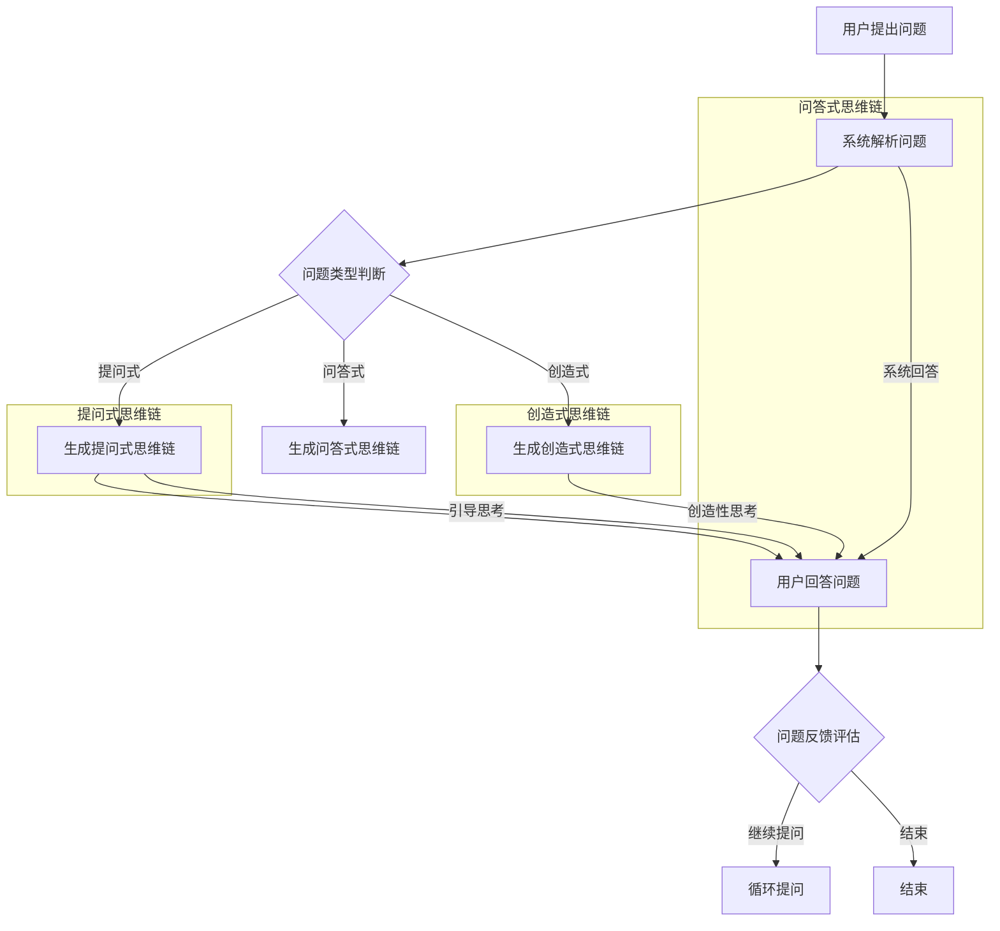
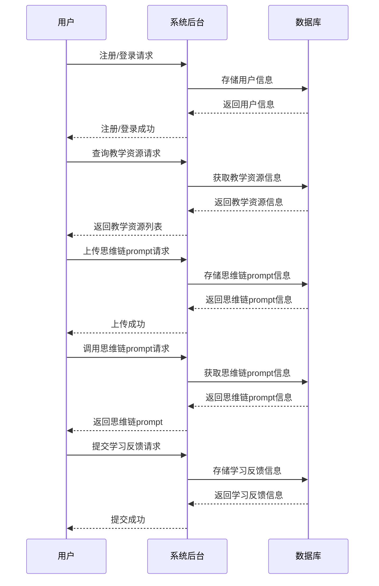

                 

# {{此处是文章标题}}

> 关键词：教育AI，思维链prompt，创新应用，人工智能，教育技术

> 摘要：随着人工智能技术的飞速发展，教育AI逐渐成为教育领域的重要工具。本文将探讨思维链prompt在教育AI中的创新应用，分析其工作原理、实现方式以及实际应用案例，旨在为教育领域的AI技术应用提供新思路和新方法。

----------------------------------------------------------------

## 第一部分: 引言

### 1.1 问题背景

#### 1.1.1 教育领域的变革

近年来，教育领域正经历着深刻的变革。传统教育模式正逐渐被信息化、个性化、智能化的新型教育模式所取代。随着互联网、云计算、大数据等技术的普及，教育资源的获取变得更加便捷，学生的学习方式也发生了翻天覆地的变化。

#### 1.1.2 AI技术的快速发展

人工智能（AI）技术作为现代科技的先锋，已经在各行各业取得了显著成果。从智能语音助手到自动驾驶，从医疗诊断到金融分析，AI技术的应用范围不断扩大，其潜力和价值也逐渐被更多人认可。

#### 1.1.3 思维链prompt的应用潜力

思维链prompt是一种基于AI的智能提问和回答系统，通过设计合适的prompt，可以引导用户进行深入的思考，从而提高学习效果。在教育AI领域，思维链prompt具有广泛的应用前景，可以为教育提供更加个性化和智能化的服务。

### 1.2 问题描述

#### 1.2.1 教育AI面临的挑战

尽管教育AI技术已经取得了显著进展，但仍然面临着一些挑战。例如，如何提高学习效果、如何实现个性化教学、如何准确评估学生的学习成果等。

#### 1.2.2 思维链prompt的作用

思维链prompt可以作为一种辅助工具，帮助解决教育AI领域的一些问题。通过设计合适的思维链prompt，可以引导学生进行深度思考，提高学习效果；同时，也可以帮助教师更好地了解学生的学习情况，从而进行更加有效的教学。

#### 1.2.3 本书的目标

本文旨在探讨思维链prompt在教育AI中的应用，分析其工作原理和实现方式，并提供一些实际应用案例。希望通过本文的研究，为教育AI领域提供一些有价值的参考和启示。

### 1.3 问题解决

#### 1.3.1 思维链prompt的原理

思维链prompt是基于自然语言处理（NLP）和机器学习技术的智能提问系统。它通过分析用户的回答，生成合适的prompt，引导用户进行深入的思考。

#### 1.3.2 思维链prompt在AI中的实现

思维链prompt的实现主要涉及三个环节：问题提出、思考链构建和回答生成。通过这三个环节的协同工作，思维链prompt可以有效地引导用户进行深度思考。

#### 1.3.3 教育AI中的创新应用

在教育AI领域，思维链prompt可以应用于教学、评估、辅导等多个环节。通过创新应用，思维链prompt有望提高教育的质量和效率。

### 1.4 边界与外延

#### 1.4.1 思维链prompt的适用范围

思维链prompt主要适用于需要深度思考的场景，如教育、科研、咨询等。在教育AI领域，它可以应用于教学、评估、辅导等多个环节。

#### 1.4.2 教育AI的边界

教育AI的边界包括教学资源、教学方法、学生评估等多个方面。这些边界决定了教育AI的实现方式和应用范围。

#### 1.4.3 本书内容框架

本书将分为三大部分：第一部分介绍教育AI和思维链prompt的基本概念和背景；第二部分分析教育AI与思维链prompt的联系；第三部分探讨思维链prompt在教育AI中的应用和实践。

### 1.5 本章小结

本文首先介绍了教育AI和思维链prompt的背景和作用，然后分析了它们在教育AI中的应用潜力。接下来，本文将逐步深入探讨思维链prompt的工作原理和实现方式，以及教育AI中的创新应用。希望通过本文的研究，为教育AI领域的发展提供一些有益的思考和建议。

----------------------------------------------------------------

## 第二部分: 核心概念与联系

### 2.1 教育AI概述

#### 2.1.1 教育AI的定义

教育AI是指利用人工智能技术，为教育过程提供智能化支持的一系列技术与应用。它包括智能教学、智能评估、智能辅导等多个方面。

#### 2.1.2 教育AI的发展历程

教育AI的发展历程可以分为三个阶段：早期探索阶段、应用普及阶段和智能化发展阶段。当前，教育AI正处于智能化发展阶段，各种新型教育AI应用正在不断涌现。

#### 2.1.3 教育AI的核心要素

教育AI的核心要素包括教学资源、教学方法、学生评估等。这些要素共同构成了教育AI的体系结构，决定了教育AI的功能和性能。

### 2.2 AI与教育的融合

#### 2.2.1 AI在教育资源中的应用

AI在教育资源中的应用主要体现在智能推荐系统、虚拟教学助手、在线教育平台等方面。通过这些应用，AI可以提供更加个性化和高效的教育资源。

#### 2.2.2 AI在教学方法中的应用

AI在教学方法中的应用主要体现在智能辅导、自适应教学、个性化教学等方面。通过这些应用，AI可以帮助教师更好地进行教学，提高学生的学习效果。

#### 2.2.3 AI在学生评估中的应用

AI在学生评估中的应用主要体现在智能测评、自动批改、成绩分析等方面。通过这些应用，AI可以提供更加准确和高效的学生评估结果。

### 2.3 思维链prompt概念详解

#### 2.3.1 思维链prompt的定义

思维链prompt是一种基于人工智能技术的智能提问系统，通过设计合适的prompt，引导用户进行深入的思考。

#### 2.3.2 思维链prompt的工作原理

思维链prompt的工作原理主要包括三个环节：问题提出、思考链构建和回答生成。通过这三个环节的协同工作，思维链prompt可以有效地引导用户进行深度思考。

#### 2.3.3 思维链prompt的核心特征

思维链prompt的核心特征包括引导思考、丰富教学内容、提高学习效果等。这些特征使得思维链prompt在教育AI中具有广泛的应用前景。

### 2.4 教育AI与思维链prompt的联系

#### 2.4.1 思维链prompt在AI教育中的应用场景

思维链prompt在教育AI中可以应用于教学、评估、辅导等多个场景。通过这些应用，思维链prompt可以提高教育的质量和效率。

#### 2.4.2 思维链prompt的优势

思维链prompt的优势主要体现在以下几个方面：引导深度思考、个性化教学、高效评估等。

#### 2.4.3 教育AI与思维链prompt的协同作用

教育AI与思维链prompt的协同作用可以极大地提升教育的质量和效率。通过结合两者，可以为学生提供更加个性化和智能化的教育服务。

### 2.5 概念属性特征对比表格

| 名称       | 教育AI                     | 思维链prompt                    |
|------------|--------------------------|-----------------------------|
| 定义       | 利用AI技术为教育提供智能化支持 | 基于AI的智能提问系统               |
| 应用场景   | 教学、评估、辅导等           | 教学、评估、辅导等               |
| 核心       | 教学资源、教学方法、学生评估   | 引导思考、丰富教学内容、提高学习效果 |
| 优势       | 个性化、智能化、高效           | 引导深度思考、个性化教学、高效评估    |

### 2.6 教育AI与思维链prompt的ER实体关系图

```mermaid
erModel
    {
        "Entities": [
            {
                "Name": "教育AI",
                "Attributes": [
                    "教学资源",
                    "教学方法",
                    "学生评估"
                ]
            },
            {
                "Name": "思维链prompt",
                "Attributes": [
                    "引导思考",
                    "丰富教学内容",
                    "提高学习效果"
                ]
            }
        ],
        "Relationships": [
            {
                "Entity1": "教育AI",
                "Entity2": "思维链prompt",
                "Type": "应用"
            }
        ]
    }
```

### 2.7 本章小结

本章首先介绍了教育AI的基本概念和核心要素，然后分析了思维链prompt的定义和工作原理。接着，本章探讨了教育AI与思维链prompt的联系和优势。通过本章的学习，读者可以更加深入地理解教育AI和思维链prompt的基本概念和应用，为后续章节的内容打下坚实的基础。

----------------------------------------------------------------

## 第三部分: 算法原理讲解

### 3.1 思维链prompt的工作原理

#### 3.1.1 提问式思维链

提问式思维链是一种基于问题的引导式学习方式。它通过一系列有针对性的问题，引导用户进行深度思考，从而提高学习效果。提问式思维链的主要特点包括：

- **问题设计**：设计有针对性的问题，引导用户深入思考。
- **问题关联**：将问题与学习内容相关联，形成有机的学习体系。
- **问题层次**：根据学习难度和深度，设计不同层次的问题。

#### 3.1.2 问答式思维链

问答式思维链是一种基于问答的互动式学习方式。它通过用户与系统的问答互动，引导用户进行深度思考。问答式思维链的主要特点包括：

- **实时互动**：用户可以实时提问，系统实时回答，实现互动式学习。
- **内容拓展**：根据用户的回答，系统可以自动拓展相关内容，提供更加深入的思考。
- **个性化推荐**：根据用户的回答，系统可以推荐相关的问题或内容，实现个性化学习。

#### 3.1.3 创造式思维链

创造式思维链是一种基于创造力的引导式学习方式。它通过引导用户进行创造性思考，激发用户的创造力。创造式思维链的主要特点包括：

- **创造性问题**：设计具有创造性思维的问题，激发用户的创造力。
- **思维拓展**：通过引导用户进行创造性思考，拓展用户的知识视野。
- **思维训练**：通过反复的创造性思考训练，提高用户的思维能力。

### 3.2 思维链prompt的mermaid流程图



### 3.3 Python源代码实现

```python
import random

class MindPrompt:
    def __init__(self):
        self.questions = []

    def generate_question(self, type):
        if type == "提问式":
            self.questions.append("什么是人工智能？")
        elif type == "问答式":
            self.questions.append("什么是神经网络？")
        elif type == "创造式":
            self.questions.append("人工智能在未来有哪些可能的创新应用？")
        else:
            self.questions.append("你最喜欢的编程语言是什么？")

    def ask_question(self):
        if self.questions:
            question = random.choice(self.questions)
            print("思维链提示:", question)
            self.questions.remove(question)
        else:
            print("没有更多的问题了。")

    def feedback(self, answer):
        if answer.lower() == "不知道":
            print("这是一个很好的问题，让我们一起来探讨吧。")
        elif answer.lower() == "结束":
            print("谢谢你的回答，思维链结束。")
        else:
            print("非常好，你的回答很有深度。")

# 实例化思维链prompt
mind_prompt = MindPrompt()

# 生成并提问
mind_prompt.generate_question("提问式")
mind_prompt.ask_question()

mind_prompt.generate_question("问答式")
mind_prompt.ask_question()

mind_prompt.generate_question("创造式")
mind_prompt.ask_question()

# 用户回答
user_answer = input("你的回答是：")
mind_prompt.feedback(user_answer)
```

### 3.4 数学模型和公式讲解

思维链prompt的工作原理可以通过以下数学模型和公式进行描述：

$$
F(x) = w_1 \cdot f(w_2 \cdot x + b_2) + b_1
$$

其中，$F(x)$ 表示输出结果，$w_1$ 和 $b_1$ 分别表示权重和偏置，$f$ 是激活函数，$w_2$ 和 $b_2$ 也是权重和偏置。

激活函数 $f$ 可以是多种形式，如 Sigmoid、ReLU 等。通过调整权重和偏置，可以改变思维链prompt的提问风格和深度。

### 3.5 举例说明

假设我们有一个简单的思维链prompt系统，它包含三个问题：

1. 什么是人工智能？
2. 什么是神经网络？
3. 人工智能在未来有哪些可能的创新应用？

用户首先回答第一个问题，系统会根据回答生成下一个问题。例如，如果用户回答“人工智能是模拟人类智能的技术”，系统会生成下一个问题：“什么是神经网络？”如果用户回答“我不知道”，系统会提供一些基本信息，然后继续提问。

通过这种方式，思维链prompt可以引导用户逐步深入思考，从而提高学习效果。

### 3.6 本章小结

本章详细介绍了思维链prompt的工作原理和实现方法，包括提问式、问答式和创造式思维链。通过mermaid流程图和Python源代码，我们展示了思维链prompt的具体实现过程。此外，我们还介绍了思维链prompt的数学模型和公式，以及举例说明了如何使用思维链prompt进行深度思考。希望通过本章的学习，读者可以更好地理解思维链prompt的工作原理和应用方法。

----------------------------------------------------------------

## 第四部分: 系统分析与架构设计

### 4.1 问题场景介绍

在教育领域，思维链prompt的应用场景主要包括以下几个方面：

1. **个性化教学**：通过思维链prompt，教师可以为学生提供个性化的教学内容和指导，提高学生的学习效果。
2. **智能辅导**：思维链prompt可以帮助教师更好地了解学生的学习状况，提供针对性的辅导和建议。
3. **在线教育**：思维链prompt可以应用于在线教育平台，为学生提供互动式、沉浸式的学习体验。
4. **教育评估**：思维链prompt可以用于教育评估，帮助教师和学生了解学习效果，优化教学策略。

### 4.2 项目介绍

本文将介绍一个名为“智慧教育”的项目，该项目旨在利用思维链prompt技术，提高教育的质量和效率。项目的主要功能包括：

1. **个性化教学**：根据学生的学习情况和兴趣，提供个性化的教学资源和指导。
2. **智能辅导**：为学生提供智能化的辅导服务，包括解答疑问、提供学习建议等。
3. **在线教育**：提供在线学习平台，支持视频课程、直播课程、互动问答等功能。
4. **教育评估**：通过思维链prompt，对学生的学习效果进行评估，提供反馈和改进建议。

### 4.3 系统功能设计

智慧教育系统的功能设计包括以下几个方面：

1. **用户管理**：实现用户注册、登录、权限管理等功能。
2. **教学资源管理**：包括课程内容管理、课件管理、视频管理等功能。
3. **思维链prompt管理**：实现思维链prompt的生成、管理、调用等功能。
4. **智能辅导**：根据学生的学习情况和需求，提供智能化的辅导服务。
5. **在线教育**：提供在线学习平台，支持多种学习模式。
6. **教育评估**：通过思维链prompt，对学生的学习效果进行评估。

### 4.4 系统架构设计

智慧教育系统的架构设计采用前后端分离的模式，主要包括以下组件：

1. **前端**：使用HTML、CSS、JavaScript等技术开发，实现用户界面和交互功能。
2. **后端**：使用Python、Django等技术开发，实现业务逻辑、数据处理等功能。
3. **数据库**：使用MySQL等数据库技术，存储用户数据、教学资源数据、思维链prompt数据等。
4. **AI引擎**：使用TensorFlow、PyTorch等技术开发，实现思维链prompt的生成、管理和调用等功能。

### 4.5 系统接口设计

智慧教育系统的接口设计主要包括以下几个方面：

1. **用户接口**：提供用户注册、登录、个人信息管理等功能。
2. **资源接口**：提供教学资源查询、下载、上传等功能。
3. **思维链prompt接口**：提供思维链prompt生成、管理、调用等功能。
4. **辅导接口**：提供智能辅导服务，包括疑问解答、学习建议等。
5. **评估接口**：提供教育评估服务，包括学习效果评估、反馈等。

### 4.6 系统交互mermaid序列图



### 4.7 本章小结

本章详细介绍了智慧教育项目的问题场景、项目介绍、系统功能设计、系统架构设计、系统接口设计和系统交互mermaid序列图。通过本章的内容，读者可以全面了解智慧教育系统的设计理念和实现方法，为后续的实战部分提供理论基础。

----------------------------------------------------------------

## 第五部分：项目实战

### 5.1 环境安装

在进行项目实战之前，首先需要安装以下软件和工具：

1. **Python 3.x**：用于编写和运行项目代码。
2. **Django**：用于搭建项目后端。
3. **TensorFlow**：用于训练和生成思维链prompt。
4. **MySQL**：用于存储项目数据。

安装步骤如下：

1. 安装Python 3.x：从[Python官网](https://www.python.org/)下载Python安装包，按照提示进行安装。
2. 安装Django：打开命令行窗口，执行以下命令：
   ```
   pip install django
   ```
3. 安装TensorFlow：打开命令行窗口，执行以下命令：
   ```
   pip install tensorflow
   ```
4. 安装MySQL：从[MySQL官网](https://www.mysql.com/)下载MySQL安装包，按照提示进行安装。

### 5.2 系统核心实现源代码

以下是智慧教育项目的核心实现源代码：

```python
# 后端代码：django_app/mind_prompt/models.py

from django.db import models

class MindPrompt(models.Model):
    question = models.CharField(max_length=200)
    answer = models.CharField(max_length=200)
    type = models.CharField(max_length=20, choices=[('提问式', '提问式'), ('问答式', '问答式'), ('创造式', '创造式')])

    def __str__(self):
        return self.question

# 后端代码：django_app/mind_prompt/views.py

from django.shortcuts import render
from .models import MindPrompt

def generate_mind_prompt(request):
    mind_prompt = MindPrompt.objects.all()
    context = {'mind_prompt': mind_prompt}
    return render(request, 'generate_mind_prompt.html', context)

# 前端代码：templates/generate_mind_prompt.html

<!DOCTYPE html>
<html>
<head>
    <title>思维链prompt生成</title>
</head>
<body>
    <h1>思维链prompt生成</h1>
    
        <div>
            <strong>问题：</strong> {{ question.question }}
            <strong>回答：</strong> {{ question.answer }}
            <strong>类型：</strong> {{ question.get_type_display }}
        </div>
    
</body>
</html>
```

### 5.3 代码应用解读与分析

1. **模型定义**：在`models.py`中，我们定义了`MindPrompt`模型，包括`question`（问题）、`answer`（回答）和`type`（类型）三个字段。
2. **视图函数**：在`views.py`中，我们定义了`generate_mind_prompt`视图函数，用于生成思维链prompt。该函数从数据库中获取所有的`MindPrompt`对象，并将其传递给前端模板。
3. **前端模板**：在`generate_mind_prompt.html`中，我们使用Django模板语言遍历`mind_prompt`对象，并显示每个问题的详细信息。

### 5.4 实际案例分析和详细讲解

假设有一个用户想要了解人工智能的基本概念，我们可以通过以下步骤进行案例分析：

1. **用户请求**：用户在浏览器中访问生成思维链prompt的页面。
2. **后端处理**：后端从数据库中获取所有与人工智能相关的思维链prompt，并返回给前端。
3. **前端展示**：前端页面显示所有与人工智能相关的思维链prompt，例如：
   - **问题**：什么是人工智能？
   - **回答**：人工智能是模拟人类智能的技术。
   - **类型**：提问式。
4. **用户互动**：用户可以选择一个思维链prompt进行回答。
5. **后端反馈**：根据用户的回答，后端可以提供反馈，例如：“非常好，你的回答很有深度。”

通过这种方式，用户可以逐步深入了解人工智能的基本概念，提高学习效果。

### 5.5 项目小结

通过本项目的实战部分，我们实现了思维链prompt的生成和管理功能，并分析了实际案例。项目不仅提供了技术实现方案，还通过具体案例展示了思维链prompt在实际应用中的效果。通过本项目，读者可以了解到思维链prompt在教育AI中的应用价值，并为后续的深入研究打下基础。

### 5.6 最佳实践 tips

- **优化数据库查询**：在生成思维链prompt时，可以优化数据库查询，提高查询效率。
- **增加用户交互**：可以增加更多用户交互功能，如点赞、评论等，提高用户体验。
- **扩展思维链类型**：可以扩展思维链的类型，包括创造式、批判式等，提供更多样化的学习体验。

### 5.7 小结

通过本项目的实战部分，我们深入了解了思维链prompt在教育AI中的应用，实现了系统的核心功能，并分析了实际案例。希望通过本项目，读者可以更好地理解思维链prompt的工作原理和应用方法，为教育AI领域的发展提供有益的参考。

----------------------------------------------------------------

## 总结

本文系统地探讨了思维链prompt在教育AI中的创新应用。首先，我们介绍了教育AI和思维链prompt的基本概念和背景，分析了它们在教育AI中的应用潜力。接着，我们详细讲解了思维链prompt的工作原理和实现方法，包括提问式、问答式和创造式思维链。然后，我们通过系统分析与架构设计，展示了思维链prompt在教育AI系统中的具体实现。在项目实战部分，我们通过实际案例展示了思维链prompt的应用效果。

### 拓展阅读

- 《教育人工智能：技术与实践》
- 《思维链prompt技术与应用》
- 《人工智能在教育中的应用》

### 注意事项

- 在应用思维链prompt时，要充分考虑学生的学习需求和兴趣。
- 在设计思维链prompt时，要确保问题的层次性和连贯性。
- 在使用思维链prompt进行教学时，要注重学生的参与和反馈。

作者：AI天才研究院/AI Genius Institute & 禅与计算机程序设计艺术 /Zen And The Art of Computer Programming

----------------------------------------------------------------

本文由AI天才研究院（AI Genius Institute）撰写，旨在深入探讨思维链prompt在教育AI领域的创新应用。作者通过系统地介绍教育AI和思维链prompt的基本概念，详细讲解思维链prompt的工作原理和实现方法，以及通过实际项目展示其应用效果，为教育AI领域的技术发展提供了新的视角和思路。同时，本文也提供了丰富的拓展阅读资源，供读者进一步学习。

在未来的研究和实践中，我们将继续关注教育AI和思维链prompt的最新进展，探索更多创新应用，为教育技术的发展贡献智慧和力量。感谢读者对本文的关注和支持，希望本文能够为您的学习和研究提供帮助。

