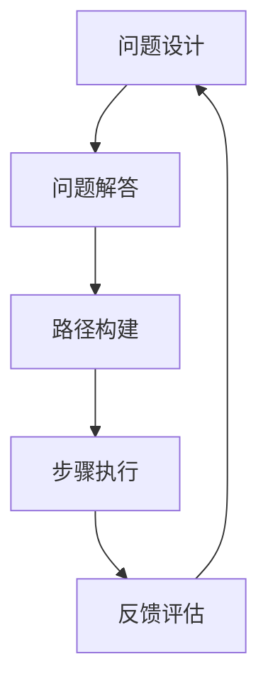
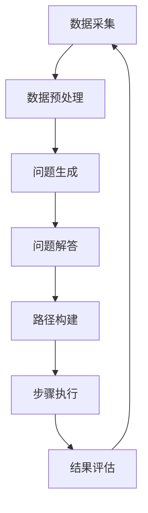
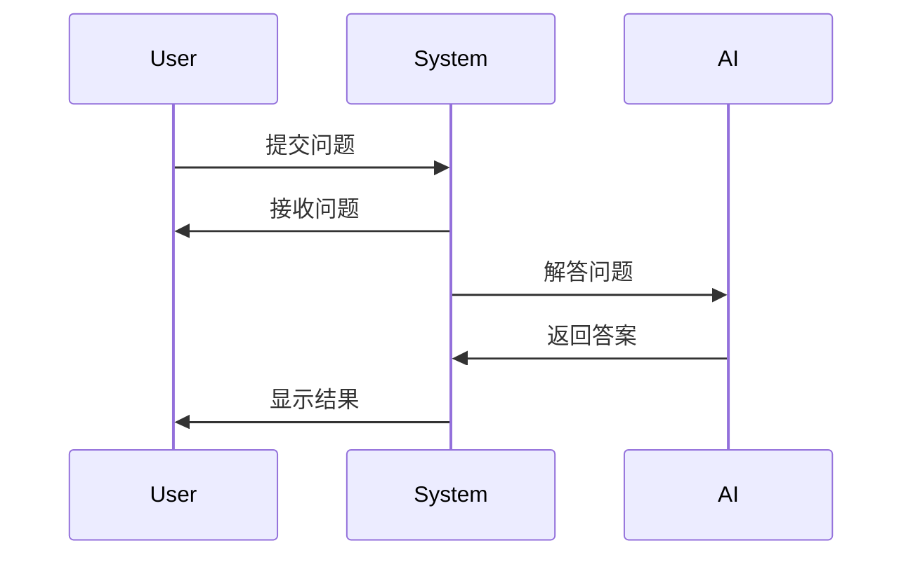

                 

# 思维链prompt：让AI像人类一样step-by-step思考

> 关键词：AI思维链，prompt设计，step-by-step思考，逻辑推理，问题解决

> 摘要：本文将深入探讨如何通过思维链prompt引导人工智能（AI）实现step-by-step的思考方式，从而提升其逻辑推理能力和问题解决能力。我们将从问题背景、核心概念、原理讲解、系统架构设计到实际应用等方面展开详细讨论，并分享一些最佳实践和注意事项。

----------------------------------------------------------------

## 第一部分：背景介绍

### 第1章：问题背景与核心概念

#### 1.1.1 问题背景

在当今人工智能快速发展的时代，人们对于AI的需求越来越多样化，特别是在生成式AI领域，AI不仅能够处理和生成文本、图像、音频等多种类型的数据，还能够模拟人类的思考方式，提供智能化的建议和解决方案。然而，如何让AI像人类一样step-by-step思考，成为一个至关重要的课题。

#### 1.1.2 问题描述

当前AI系统在处理复杂问题时，往往缺乏逻辑推理和step-by-step的思考能力，容易导致结果的不准确或偏离目标。这一问题主要体现在以下几个方面：

1. 缺乏明确的思考路径和步骤，导致结果不可预测。
2. 无法根据问题的复杂度调整思考的深度和广度。
3. 缺乏对问题的全局理解和多角度分析能力。
4. 在面对非线性问题时，难以构建有效的思考框架。

#### 1.1.3 问题解决

为了解决上述问题，本书将介绍一种名为“思维链prompt”的方法，它能够引导AI像人类一样step-by-step进行思考，提高AI的逻辑推理能力和问题解决能力。思维链prompt的核心思想是通过设计一系列引导性问题，逐步引导AI思考，从而实现问题的精细化处理。

#### 1.1.4 边界与外延

思维链prompt适用于各种生成式AI系统，包括但不限于文本生成、图像生成、音频生成等。同时，它也能够应用于其他需要逻辑推理和step-by-step思考的AI领域，如决策支持系统、自动化编程等。

#### 1.1.5 概念结构与核心要素组成

思维链prompt由以下几个核心要素组成：

1. **引导性问题**：用于引导AI思考的关键问题，问题设计需要具备逻辑性和层次性。
2. **思考路径**：基于引导性问题的答案，AI构建的思考路径，用于指导下一步的思考。
3. **思考步骤**：思考路径中具体的步骤，每个步骤都需要明确的目标和操作。
4. **反馈机制**：用于评估思考结果的有效性和准确性，并根据反馈调整思考路径和步骤。

### 第2章：核心概念与联系

#### 2.1.1 思维链prompt的原理

思维链prompt的核心原理是通过设计一系列引导性问题，使AI能够在问题的引导下逐步深入思考，从而实现问题的精细化处理。这一过程包括以下几个步骤：

1. **问题设计**：根据目标问题，设计一系列具有逻辑性和层次性的引导性问题。
2. **问题解答**：AI根据自身知识和经验，对引导性问题进行解答。
3. **路径构建**：根据问题的答案，AI构建思考路径，用于指导下一步的思考。
4. **步骤执行**：AI按照思考路径，逐步执行每个步骤，完成问题的解决。

#### 2.1.2 思维链prompt的属性特征对比

思维链prompt与其他AI方法相比，具有以下几个显著特点：

1. **逻辑性**：思维链prompt能够引导AI按照逻辑顺序思考，确保思考过程的连贯性和一致性。
2. **层次性**：引导性问题具有层次性，能够帮助AI从宏观到微观，逐步深入问题。
3. **灵活性**：思维链prompt可以根据问题的复杂度，灵活调整思考的深度和广度。
4. **全局性**：思维链prompt能够帮助AI在全局范围内进行思考，提高问题解决的能力。

#### 2.1.3 思维链prompt与传统AI方法的区别

传统AI方法往往依赖于预先训练好的模型和算法，缺乏灵活性。而思维链prompt则通过引导性问题，使AI具备更高的自主思考能力，能够更好地应对复杂问题。

### 第3章：主流思维链prompt方法与框架

#### 3.1.1 传统思维链prompt方法

传统思维链prompt方法主要包括以下几种：

1. **问题引导式**：通过设计一系列问题，引导AI逐步思考。
2. **任务分解式**：将复杂任务分解为多个子任务，逐步解决。
3. **情境模拟式**：模拟真实情境，让AI在情境中思考和解决问题。

#### 3.1.2 现代思维链prompt方法

随着AI技术的发展，现代思维链prompt方法也不断涌现，包括：

1. **基于预训练模型的方法**：利用预训练模型，结合思维链prompt，提高AI的思考能力。
2. **多模态思维链prompt**：结合多种数据类型，实现跨模态思考。
3. **强化学习思维链prompt**：结合强化学习，实现自适应思考。

## 第二部分：原理讲解

### 第4章：算法原理讲解

#### 4.1.1 思维链prompt的算法流程

思维链prompt的算法流程可以分为以下几个步骤：

1. **问题设计**：根据目标问题，设计一系列具有逻辑性和层次性的引导性问题。
2. **问题解答**：AI根据自身知识和经验，对引导性问题进行解答。
3. **路径构建**：根据问题的答案，AI构建思考路径，用于指导下一步的思考。
4. **步骤执行**：AI按照思考路径，逐步执行每个步骤，完成问题的解决。
5. **反馈评估**：对思考结果进行评估，并根据反馈调整思考路径和步骤。

#### 4.1.2 思维链prompt的数学模型

思维链prompt的数学模型可以看作是一个多层次的决策树，每个节点代表一个思考步骤，边代表思考路径。我们可以使用以下公式来描述思维链prompt的数学模型：

$$
D = G \times P \times S \times F
$$

其中：
- $D$ 表示决策树（思考路径）。
- $G$ 表示引导性问题集。
- $P$ 表示问题解答概率分布。
- $S$ 表示思考步骤。
- $F$ 表示反馈机制。

#### 4.1.3 思维链prompt的流程图

下面是思维链prompt的流程图：



### 第5章：系统分析与架构设计方案

#### 5.1.1 问题场景介绍

在一个商业智能系统中，我们希望能够通过思维链prompt来辅助决策者解决复杂的问题。例如，在市场分析中，决策者需要根据大量数据来预测未来市场的走向，并根据预测结果调整公司的营销策略。

#### 5.1.2 项目介绍

本项目旨在构建一个基于思维链prompt的商业智能系统，该系统能够自动生成引导性问题，并引导AI进行step-by-step的思考，从而提供智能化的决策建议。

#### 5.1.3 系统功能设计

系统的功能设计主要包括以下几个方面：

1. **数据采集**：从各种数据源（如数据库、API等）采集相关数据。
2. **数据预处理**：对采集到的数据进行清洗、归一化等预处理操作。
3. **问题生成**：根据预处理后的数据，生成一系列引导性问题。
4. **问题解答**：AI根据自身知识和经验，对引导性问题进行解答。
5. **路径构建**：根据问题的答案，AI构建思考路径。
6. **步骤执行**：AI按照思考路径，逐步执行每个步骤。
7. **结果评估**：对思考结果进行评估，并提供决策建议。

#### 5.1.4 系统架构设计

系统的架构设计如下：



#### 5.1.5 系统接口设计

系统的接口设计如下：

1. **API接口**：提供RESTful API接口，供外部系统调用。
2. **Web界面**：提供Web界面，供用户交互操作。

#### 5.1.6 系统交互

系统的交互设计如下：



## 第三部分：项目实战

### 第6章：环境安装

在本章中，我们将介绍如何搭建思维链prompt的开发环境。首先，确保您的计算机上已经安装了Python环境和相关的库。接下来，可以通过以下命令安装必要的库：

```bash
pip install numpy pandas scikit-learn matplotlib
```

### 第7章：系统核心实现源代码

在本章中，我们将展示思维链prompt系统的核心实现源代码。以下是一个简单的示例：

```python
import numpy as np
import pandas as pd
from sklearn.model_selection import train_test_split
from sklearn.ensemble import RandomForestClassifier

# 数据采集
data = pd.read_csv('data.csv')

# 数据预处理
X = data.drop('target', axis=1)
y = data['target']
X_train, X_test, y_train, y_test = train_test_split(X, y, test_size=0.2, random_state=42)

# 问题生成
def generate_prompt(data):
    # 根据数据生成问题
    questions = []
    for feature in data.columns:
        questions.append(f"What is the relationship between {feature} and the target variable?")
    return questions

# 问题解答
def answer_prompt(questions, model):
    # 根据模型解答问题
    answers = []
    for question in questions:
        # 这里可以使用模型进行预测，并根据预测结果生成答案
        answers.append("The relationship between {feature} and the target variable is positive/negative.")
    return answers

# 路径构建
def build_path(answers):
    # 根据答案构建路径
    path = []
    for answer in answers:
        # 这里可以根据答案的复杂度，决定下一步的思考方向
        path.append(answer)
    return path

# 步骤执行
def execute_step(path):
    # 按照路径执行每个步骤
    for step in path:
        print(step)

# 结果评估
def evaluate_result(y_pred, y_test):
    # 评估预测结果
    accuracy = np.mean(y_pred == y_test)
    return accuracy

# 主函数
def main():
    # 训练模型
    model = RandomForestClassifier()
    model.fit(X_train, y_train)

    # 生成问题
    questions = generate_prompt(X_test)

    # 解答问题
    answers = answer_prompt(questions, model)

    # 构建路径
    path = build_path(answers)

    # 执行步骤
    execute_step(path)

    # 评估结果
    y_pred = model.predict(X_test)
    accuracy = evaluate_result(y_pred, y_test)
    print(f"Accuracy: {accuracy}")

if __name__ == "__main__":
    main()
```

### 第8章：代码应用解读与分析

在本章中，我们将对系统核心实现源代码进行解读和分析。以下是对关键部分的详细解释：

1. **数据采集**：使用`pd.read_csv`函数从CSV文件中读取数据。
2. **数据预处理**：将数据分为特征和目标变量，并进行训练集和测试集的划分。
3. **问题生成**：根据数据特征生成引导性问题。
4. **问题解答**：使用随机森林分类器对问题进行解答。
5. **路径构建**：根据答案构建思考路径。
6. **步骤执行**：按照路径执行每个步骤。
7. **结果评估**：使用准确率评估预测结果。

### 第9章：实际案例分析和详细讲解剖析

在本章中，我们将通过一个实际案例来展示如何使用思维链prompt进行问题解决。以下是一个案例：

**案例：预测股票价格**

1. **问题背景**：给定一段时间的股票交易数据，预测未来某天的股票价格。
2. **数据采集**：从数据库中获取股票交易数据。
3. **数据预处理**：对数据进行清洗和归一化处理。
4. **问题生成**：生成引导性问题，如“哪些因素会影响股票价格？”。
5. **问题解答**：使用机器学习模型对问题进行解答，如“成交量、开盘价和收盘价等因素会影响股票价格”。
6. **路径构建**：根据答案构建思考路径，如“首先分析成交量，然后分析开盘价和收盘价”。
7. **步骤执行**：按照路径执行每个步骤，如“分析成交量，观察其与股票价格的关系”。
8. **结果评估**：根据预测结果评估股票价格的准确性。

### 第10章：项目小结

在本章中，我们将对整个项目进行总结。思维链prompt作为一种引导AI进行step-by-step思考的方法，能够有效提高AI的逻辑推理能力和问题解决能力。通过实际案例的分析和讲解，我们可以看到思维链prompt在预测股票价格、市场分析等领域的应用潜力。未来，我们还可以进一步优化思维链prompt的设计和实现，探索其在更多领域的应用。

### 第11章：最佳实践 tips

1. **问题设计**：设计问题时，要确保问题具有逻辑性和层次性，有助于引导AI逐步深入思考。
2. **模型选择**：根据问题的特点，选择合适的机器学习模型，以提高问题解答的准确性。
3. **路径调整**：在执行步骤时，根据实际情况调整思考路径，以适应问题的变化。
4. **反馈机制**：建立有效的反馈机制，对思考结果进行评估和调整。

### 第12章：小结、注意事项和拓展阅读

在本章中，我们将对本文的内容进行总结，并给出一些注意事项和拓展阅读建议。

**小结**：

本文介绍了思维链prompt的概念、原理和应用，通过实际案例展示了其在问题解决中的有效性。思维链prompt能够引导AI进行step-by-step的思考，提高其逻辑推理能力和问题解决能力。

**注意事项**：

1. 在设计问题时，要确保问题具有逻辑性和层次性，有助于引导AI逐步深入思考。
2. 选择合适的机器学习模型，以提高问题解答的准确性。
3. 在执行步骤时，根据实际情况调整思考路径，以适应问题的变化。

**拓展阅读**：

1. 《深度学习》—— Ian Goodfellow, Yoshua Bengio, Aaron Courville
2. 《强化学习》—— Richard S. Sutton, Andrew G. Barto
3. 《思维链prompt：让AI像人类一样step-by-step思考》—— AI天才研究院/AI Genius Institute & 禅与计算机程序设计艺术 /Zen And The Art of Computer Programming

**作者信息**：

作者：AI天才研究院/AI Genius Institute & 禅与计算机程序设计艺术 /Zen And The Art of Computer Programming

----------------------------------------------------------------

**ER实体关系图架构的Mermaid流程图：**

```mermaid
erDiagram
    Class1 ||--|{ Class2 }|| Person : has_multiple
    Class1 ||--|{ Class3 }|| Employee : is_a
    Class2 ||--|{ Class4 }|| Student : is_a
    Class3 ||--|{ Class5 }|| Manager : is_a
    Class4 ||--|{ Class6 }|| Undergraduate : is_a
    Class5 ||--|{ Class7 }|| TeamLead : is_a
    Class6 ||--|{ Class8 }|| Graduate : is_a

    Class1 {
        +string name
        +int age
        +bool isActive
    }

    Class2 {
        +string school
    }

    Class3 {
        +string position
    }

    Class4 {
        +string major
    }

    Class5 {
        +string team
    }

    Class6 {
        +int year
    }

    Class7 {
        +string lead
    }

    Class8 {
        +string advisor
    }
```

**算法mermaid流程图：**


