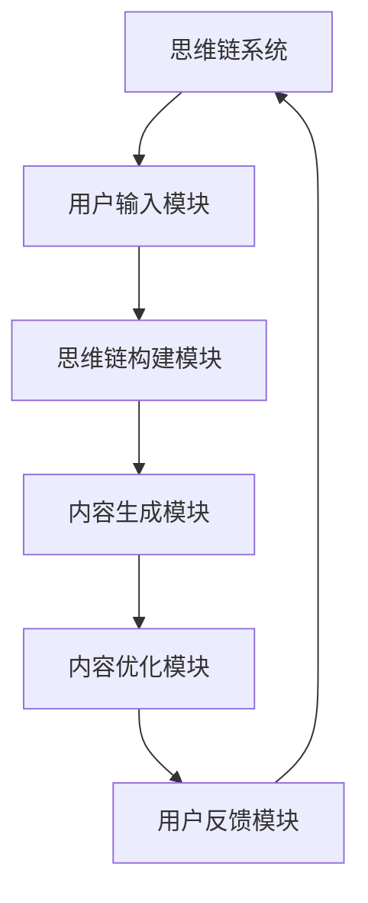

                 

# 《思维链在AI创意生成中的应用》

> 关键词：AI，创意生成，思维链，算法，文本，图像，音频，视频

> 摘要：本文将探讨思维链技术在人工智能创意生成领域的应用，从背景介绍、技术原理、应用案例分析等方面逐步深入，旨在揭示思维链技术如何助力AI实现更高效、更有创意的内容生成。

## 第一部分：背景介绍

### 第1章：问题背景与核心概念

#### 1.1 问题背景

创意生成是人工智能领域的一个重要分支，近年来随着深度学习、自然语言处理等技术的发展，AI在文本、图像、音频和视频等领域的创意生成能力得到了显著提升。然而，现有技术仍然面临着一些挑战，如生成内容的质量、多样性和可控性等方面。

#### 1.1.1 AI与创意生成

AI创意生成涉及多个领域，包括文本生成、图像生成、音频生成和视频生成等。这些技术在不同领域有着广泛的应用，如内容创作、广告营销、娱乐产业等。

#### 1.1.2 创意生成的现状与挑战

目前，AI创意生成技术已经取得了一些突破性进展，但仍然存在以下挑战：

1. **质量不高**：生成的创意内容在质量上与人类创作还存在较大差距。
2. **多样性不足**：AI生成的创意内容往往缺乏多样性，容易陷入模式化。
3. **可控性不佳**：用户对生成内容的控制能力有限，难以满足个性化需求。
4. **交互性不强**：AI与用户的互动能力较弱，无法很好地理解用户意图。

#### 1.1.3 思维链技术的引入

为了解决上述挑战，本文将引入思维链技术。思维链是一种基于人工智能的创意生成技术，通过模拟人类思维过程，实现更具创意、高质量的内容生成。思维链技术具有以下特点：

1. **模仿人类思维**：思维链技术通过模仿人类思维过程，实现创意的生成和拓展。
2. **灵活可控**：用户可以通过输入不同的参数和条件，对生成内容进行灵活控制。
3. **高度多样**：思维链技术能够生成具有高度多样性的内容，避免陷入模式化。
4. **强交互性**：思维链技术能够与用户进行有效互动，理解用户意图，提供更个性化的服务。

#### 1.2 核心概念

在本章中，我们将介绍以下几个核心概念：

1. **思维链**：一种基于人工智能的创意生成技术，通过模拟人类思维过程，实现创意的生成和拓展。
2. **思维链节点**：思维链的基本单元，代表一个具体的思维过程。
3. **思维链路径**：连接多个思维链节点的路径，代表一个完整的思维过程。

#### 1.2.1 思维链的定义

思维链是一种基于人工智能的创意生成技术，通过模拟人类思维过程，实现创意的生成和拓展。它通过分析用户的输入信息，构建一系列思维链节点，然后根据这些节点之间的关系和属性，生成具有创意的内容。

#### 1.2.2 思维链的特点

思维链技术具有以下特点：

1. **模仿人类思维**：思维链技术通过模仿人类思维过程，实现创意的生成和拓展。
2. **灵活可控**：用户可以通过输入不同的参数和条件，对生成内容进行灵活控制。
3. **高度多样**：思维链技术能够生成具有高度多样性的内容，避免陷入模式化。
4. **强交互性**：思维链技术能够与用户进行有效互动，理解用户意图，提供更个性化的服务。

#### 1.2.3 思维链与AI创意生成的联系

思维链技术与AI创意生成技术密切相关。思维链技术通过模仿人类思维过程，实现了创意生成中的关键环节，如内容构思、拓展和优化等。与传统AI创意生成技术相比，思维链技术具有更高的灵活性和可控性，能够更好地满足用户的需求。

#### 1.3 边界与外延

在本节中，我们将讨论思维链技术的边界与外延：

1. **应用领域**：思维链技术可以应用于文本、图像、音频和视频等创意生成领域。
2. **适用场景**：思维链技术适用于需要高度创意和个性化生成的场景，如广告创作、内容创作、娱乐产业等。
3. **与其他创意生成技术的对比**：思维链技术与传统创意生成技术相比，具有更高的灵活性和可控性，但生成速度可能相对较慢。

### 第2章：思维链技术原理

#### 2.1 思维链技术原理概述

在本章中，我们将深入探讨思维链技术的原理，包括其基本原理、工作流程和核心算法。

#### 2.1.1 思维链的基本原理

思维链技术基于人类思维过程，通过一系列思维链节点和思维链路径实现创意的生成。每个思维链节点代表一个具体的思维过程，思维链路径则连接多个思维链节点，形成完整的思维过程。

#### 2.1.2 思维链的工作流程

思维链技术的工作流程包括以下几个步骤：

1. **用户输入**：用户输入初始信息，如文本、图像或音频等。
2. **思维链构建**：系统根据用户输入的信息，构建一系列思维链节点，形成思维链。
3. **内容生成**：系统根据思维链路径和思维链节点，生成创意内容。
4. **内容优化**：系统对生成内容进行优化，提高内容的质量和多样性。

#### 2.1.3 思维链的核心算法

思维链技术的核心算法包括以下几个方面：

1. **思维链节点生成算法**：根据用户输入的信息，生成一系列思维链节点。
2. **思维链路径搜索算法**：在给定的思维链节点集合中，搜索最优的思维链路径。
3. **内容生成算法**：根据思维链路径和思维链节点，生成创意内容。
4. **内容优化算法**：对生成内容进行优化，提高内容的质量和多样性。

#### 2.2 概念属性特征对比表格

在本节中，我们将对比思维链技术与其他创意生成技术的概念属性特征，以便读者更好地理解思维链技术的优势。

| 技术名称 | 概念属性特征 |
| :---: | :---: |
| 思维链 | 模仿人类思维过程，灵活可控，高度多样，强交互性 |
| 神经网络 | 基于数据驱动，自动学习特征，高效计算 |
| 机器学习 | 从数据中学习规律，进行预测和分类 |
| 传统创意生成 | 依赖于人类创作者的经验和技能，生成速度较慢 |

#### 2.2.1 思维链与神经网络对比

思维链技术基于神经网络，但与传统神经网络相比，具有更高的灵活性和可控性。思维链技术通过模仿人类思维过程，实现创意的生成和拓展，而神经网络则主要依靠数据驱动，自动学习特征。

#### 2.2.2 思维链与机器学习对比

思维链技术是机器学习的一种应用，但与传统机器学习相比，具有更高的灵活性和创意性。机器学习主要从数据中学习规律，进行预测和分类，而思维链技术则通过模仿人类思维过程，实现创意的生成和拓展。

#### 2.2.3 思维链与传统创意生成技术对比

思维链技术是传统创意生成技术的一种创新，具有更高的灵活性和可控性。传统创意生成技术主要依赖于人类创作者的经验和技能，生成速度较慢，而思维链技术则通过模仿人类思维过程，实现高效、灵活的内容生成。

#### 2.3 ER实体关系图架构

在本章的最后，我们将介绍思维链技术的ER实体关系图架构。

#### 2.3.1 实体关系图的基本概念

实体关系图（ER图）是一种用于描述系统中的实体及其关系的图形化表示。在思维链系统中，实体包括用户输入模块、思维链构建模块、内容生成模块、内容优化模块和用户反馈模块等。

#### 2.3.2 实体关系图在思维链中的应用

实体关系图在思维链系统中起到关键作用。通过实体关系图，我们可以清晰地描述思维链系统中的各个模块及其之间的关系，从而更好地理解思维链技术的工作原理。

#### 2.3.3 实体关系图的建立方法

建立实体关系图的方法主要包括以下几个步骤：

1. **识别实体**：识别系统中的主要实体，如用户输入模块、思维链构建模块、内容生成模块等。
2. **定义关系**：确定实体之间的关系，如用户输入模块与思维链构建模块之间的关系。
3. **绘制图形**：使用图形工具绘制实体关系图，确保图形清晰、简洁。

## 第二部分：思维链在AI创意生成中的应用

### 第3章：思维链在文本创意生成中的应用

#### 3.1 文本创意生成的现状与挑战

文本创意生成是AI创意生成领域的一个重要分支。近年来，随着自然语言处理技术的发展，AI在文本创意生成方面取得了一定的进展。然而，现有技术仍然面临着一些挑战：

1. **质量不高**：生成的文本在质量上与人类创作还存在较大差距。
2. **多样性不足**：AI生成的文本往往缺乏多样性，容易陷入模式化。
3. **可控性不佳**：用户对生成文本的控制能力有限，难以满足个性化需求。
4. **交互性不强**：AI与用户的互动能力较弱，无法很好地理解用户意图。

#### 3.2 思维链在文本创意生成中的原理

思维链技术在文本创意生成中的应用主要基于以下几个方面：

1. **模仿人类思维**：思维链技术通过模仿人类思维过程，实现文本的构思、拓展和优化。
2. **灵活可控**：用户可以通过输入不同的参数和条件，对生成文本进行灵活控制。
3. **高度多样**：思维链技术能够生成具有高度多样性的文本，避免陷入模式化。
4. **强交互性**：思维链技术能够与用户进行有效互动，理解用户意图，提供更个性化的服务。

#### 3.2.1 思维链在文本生成中的应用

思维链技术在文本生成中的应用主要涉及以下几个步骤：

1. **用户输入**：用户输入初始文本或关键词。
2. **思维链构建**：系统根据用户输入的信息，构建一系列思维链节点，形成思维链。
3. **内容生成**：系统根据思维链路径和思维链节点，生成创意文本。
4. **内容优化**：系统对生成文本进行优化，提高文本的质量和多样性。

#### 3.2.2 思维链在文本创意生成中的优势

思维链技术在文本创意生成中具有以下优势：

1. **质量高**：通过模仿人类思维过程，生成文本的质量较高，能够满足用户需求。
2. **多样性强**：思维链技术能够生成具有高度多样性的文本，避免陷入模式化。
3. **可控性好**：用户可以通过输入不同的参数和条件，对生成文本进行灵活控制。
4. **交互性强**：思维链技术能够与用户进行有效互动，理解用户意图，提供更个性化的服务。

#### 3.2.3 思维链在文本创意生成中的实现方法

思维链技术在文本创意生成中的实现方法主要包括以下几个步骤：

1. **数据准备**：收集并整理相关的文本数据，作为思维链训练和生成的基础。
2. **思维链构建**：根据用户输入的信息，构建一系列思维链节点，形成思维链。
3. **内容生成**：根据思维链路径和思维链节点，生成创意文本。
4. **内容优化**：对生成文本进行优化，提高文本的质量和多样性。

#### 3.3 实战案例：思维链在文本创意生成中的应用

在本节中，我们将介绍一个思维链在文本创意生成中的实战案例。

**案例介绍**

某广告公司需要为一家新产品创作广告文案。他们使用了思维链技术，以生成具有创意和吸引力的广告文案。

**案例分析**

1. **用户输入**：广告公司的文案策划人员输入了产品的基本信息、目标用户群体和广告主题。
2. **思维链构建**：思维链系统根据用户输入的信息，构建了一系列思维链节点，如产品特点、目标用户需求、广告创意等。
3. **内容生成**：思维链系统根据思维链路径和思维链节点，生成了多个广告文案，每个文案都具有不同的创意和风格。
4. **内容优化**：文案策划人员对生成文案进行了评估和优化，最终选择了一篇具有创意和吸引力的广告文案。

**案例效果评估**

通过思维链技术的应用，广告公司成功创作了一篇具有创意和吸引力的广告文案。该文案在广告效果上取得了显著提升，吸引了大量目标用户，提高了产品的知名度和销售额。

#### 3.4 思维链在文本创意生成中的最佳实践

在本节中，我们将分享一些思维链在文本创意生成中的最佳实践。

1. **充分准备数据**：为了生成高质量的文本，需要收集并整理大量的文本数据，作为思维链训练和生成的基础。
2. **合理设置参数**：用户可以根据实际需求，合理设置思维链的参数，如节点数量、连接方式等，以提高生成文本的质量和多样性。
3. **多轮优化**：在生成文本后，进行多轮优化，以进一步提高文本的质量和吸引力。
4. **用户反馈**：及时收集用户反馈，根据用户反馈对生成文本进行调整和优化。

### 第4章：思维链在图像创意生成中的应用

#### 4.1 图像创意生成的现状与挑战

图像创意生成是AI创意生成领域的另一个重要分支。近年来，随着生成对抗网络（GAN）等技术的发展，AI在图像创意生成方面取得了一定的进展。然而，现有技术仍然面临着一些挑战：

1. **质量不高**：生成的图像在质量上与人类创作还存在较大差距。
2. **多样性不足**：AI生成的图像往往缺乏多样性，容易陷入模式化。
3. **可控性不佳**：用户对生成图像的控制能力有限，难以满足个性化需求。
4. **交互性不强**：AI与用户的互动能力较弱，无法很好地理解用户意图。

#### 4.2 思维链在图像创意生成中的原理

思维链技术在图像创意生成中的应用主要基于以下几个方面：

1. **模仿人类思维**：思维链技术通过模仿人类思维过程，实现图像的构思、拓展和优化。
2. **灵活可控**：用户可以通过输入不同的参数和条件，对生成图像进行灵活控制。
3. **高度多样**：思维链技术能够生成具有高度多样性的图像，避免陷入模式化。
4. **强交互性**：思维链技术能够与用户进行有效互动，理解用户意图，提供更个性化的服务。

#### 4.2.1 思维链在图像生成中的应用

思维链技术在图像生成中的应用主要涉及以下几个步骤：

1. **用户输入**：用户输入初始图像或关键词。
2. **思维链构建**：系统根据用户输入的信息，构建一系列思维链节点，形成思维链。
3. **内容生成**：系统根据思维链路径和思维链节点，生成创意图像。
4. **内容优化**：系统对生成图像进行优化，提高图像的质量和多样性。

#### 4.2.2 思维链在图像创意生成中的优势

思维链技术在图像创意生成中具有以下优势：

1. **质量高**：通过模仿人类思维过程，生成图像的质量较高，能够满足用户需求。
2. **多样性强**：思维链技术能够生成具有高度多样性的图像，避免陷入模式化。
3. **可控性好**：用户可以通过输入不同的参数和条件，对生成图像进行灵活控制。
4. **交互性强**：思维链技术能够与用户进行有效互动，理解用户意图，提供更个性化的服务。

#### 4.2.3 思维链在图像创意生成中的实现方法

思维链技术在图像创意生成中的实现方法主要包括以下几个步骤：

1. **数据准备**：收集并整理相关的图像数据，作为思维链训练和生成的基础。
2. **思维链构建**：根据用户输入的信息，构建一系列思维链节点，形成思维链。
3. **内容生成**：根据思维链路径和思维链节点，生成创意图像。
4. **内容优化**：对生成图像进行优化，提高图像的质量和多样性。

#### 4.3 实战案例：思维链在图像创意生成中的应用

在本节中，我们将介绍一个思维链在图像创意生成中的实战案例。

**案例介绍**

某设计师需要为一家艺术展览创作一幅主题海报。他们使用了思维链技术，以生成具有创意和吸引力的主题海报。

**案例分析**

1. **用户输入**：设计师输入了展览的主题、色彩偏好和设计风格。
2. **思维链构建**：思维链系统根据用户输入的信息，构建了一系列思维链节点，如主题元素、色彩搭配、设计风格等。
3. **内容生成**：思维链系统根据思维链路径和思维链节点，生成了多个主题海报，每个海报都具有不同的创意和风格。
4. **内容优化**：设计师对生成海报进行了评估和优化，最终选择了一幅具有创意和吸引力的主题海报。

**案例效果评估**

通过思维链技术的应用，设计师成功创作了一幅具有创意和吸引力的主题海报。该海报在展览现场得到了观众的一致好评，提高了展览的知名度和影响力。

#### 4.4 思维链在图像创意生成中的最佳实践

在本节中，我们将分享一些思维链在图像创意生成中的最佳实践。

1. **充分准备数据**：为了生成高质量的图像，需要收集并整理大量的图像数据，作为思维链训练和生成的基础。
2. **合理设置参数**：用户可以根据实际需求，合理设置思维链的参数，如节点数量、连接方式等，以提高生成图像的质量和多样性。
3. **多轮优化**：在生成图像后，进行多轮优化，以进一步提高图像的质量和吸引力。
4. **用户反馈**：及时收集用户反馈，根据用户反馈对生成图像进行调整和优化。

### 第5章：思维链在音频创意生成中的应用

#### 5.1 音频创意生成的现状与挑战

音频创意生成是AI创意生成领域的又一重要分支。近年来，随着深度学习、生成对抗网络等技术的发展，AI在音频创意生成方面取得了一定的进展。然而，现有技术仍然面临着一些挑战：

1. **质量不高**：生成的音频在质量上与人类创作还存在较大差距。
2. **多样性不足**：AI生成的音频往往缺乏多样性，容易陷入模式化。
3. **可控性不佳**：用户对生成音频的控制能力有限，难以满足个性化需求。
4. **交互性不强**：AI与用户的互动能力较弱，无法很好地理解用户意图。

#### 5.2 思维链在音频创意生成中的原理

思维链技术在音频创意生成中的应用主要基于以下几个方面：

1. **模仿人类思维**：思维链技术通过模仿人类思维过程，实现音频的构思、拓展和优化。
2. **灵活可控**：用户可以通过输入不同的参数和条件，对生成音频进行灵活控制。
3. **高度多样**：思维链技术能够生成具有高度多样性的音频，避免陷入模式化。
4. **强交互性**：思维链技术能够与用户进行有效互动，理解用户意图，提供更个性化的服务。

#### 5.2.1 思维链在音频生成中的应用

思维链技术在音频生成中的应用主要涉及以下几个步骤：

1. **用户输入**：用户输入初始音频或关键词。
2. **思维链构建**：系统根据用户输入的信息，构建一系列思维链节点，形成思维链。
3. **内容生成**：系统根据思维链路径和思维链节点，生成创意音频。
4. **内容优化**：系统对生成音频进行优化，提高音频的质量和多样性。

#### 5.2.2 思维链在音频创意生成中的优势

思维链技术在音频创意生成中具有以下优势：

1. **质量高**：通过模仿人类思维过程，生成音频的质量较高，能够满足用户需求。
2. **多样性强**：思维链技术能够生成具有高度多样性的音频，避免陷入模式化。
3. **可控性好**：用户可以通过输入不同的参数和条件，对生成音频进行灵活控制。
4. **交互性强**：思维链技术能够与用户进行有效互动，理解用户意图，提供更个性化的服务。

#### 5.2.3 思维链在音频创意生成中的实现方法

思维链技术在音频创意生成中的实现方法主要包括以下几个步骤：

1. **数据准备**：收集并整理相关的音频数据，作为思维链训练和生成的基础。
2. **思维链构建**：根据用户输入的信息，构建一系列思维链节点，形成思维链。
3. **内容生成**：根据思维链路径和思维链节点，生成创意音频。
4. **内容优化**：对生成音频进行优化，提高音频的质量和多样性。

#### 5.3 实战案例：思维链在音频创意生成中的应用

在本节中，我们将介绍一个思维链在音频创意生成中的实战案例。

**案例介绍**

某音乐制作人需要创作一首具有创意和吸引力的歌曲。他们使用了思维链技术，以生成具有独特风格和创意的歌曲。

**案例分析**

1. **用户输入**：音乐制作人输入了歌曲的主题、情感色彩和风格要求。
2. **思维链构建**：思维链系统根据用户输入的信息，构建了一系列思维链节点，如歌曲主题元素、情感色彩元素、风格元素等。
3. **内容生成**：思维链系统根据思维链路径和思维链节点，生成了多个歌曲版本，每个版本都具有不同的创意和风格。
4. **内容优化**：音乐制作人

