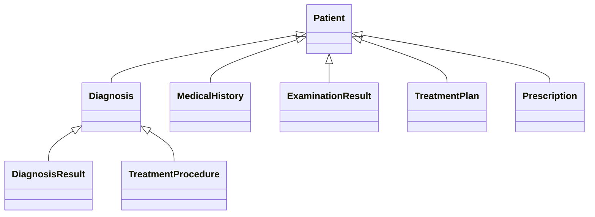
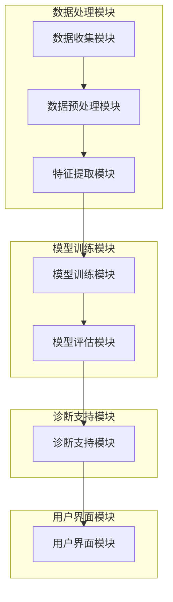
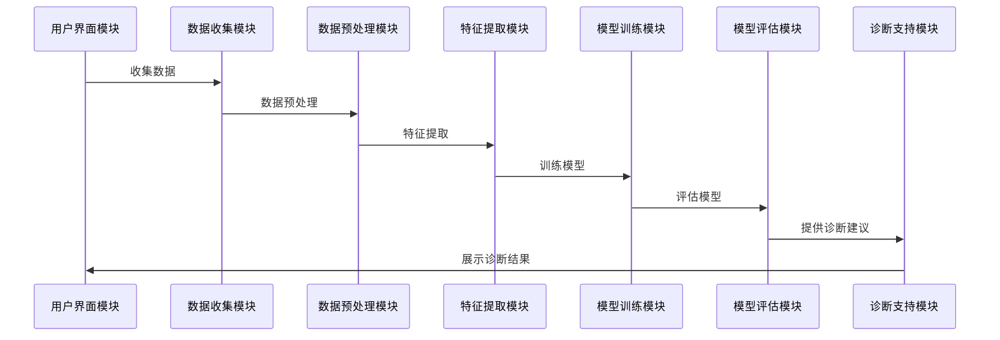

                 

# 思维链在AI辅助医疗诊断中的应用

## 关键词
- **人工智能**，**医疗诊断**，**思维链技术**，**深度学习**，**自然语言处理**，**数据可视化**

## 摘要
本文将深入探讨思维链技术在AI辅助医疗诊断中的应用。我们将首先介绍人工智能在医疗诊断中的应用现状及面临的挑战，接着详细解析思维链技术的核心概念与特点，以及其在医疗诊断领域的应用前景。随后，我们将逐步分析AI辅助医疗诊断的基本原理，包括数据收集与预处理、特征提取与选择、模型训练与评估，以及医疗诊断的流程与决策支持。最后，我们将结合实际项目案例，详细阐述系统分析与架构设计，以及项目实战中的环境安装和核心实现。

## 第一部分: 问题背景与核心概念介绍

### 第1章: 问题背景

#### 1.1 人工智能在医疗诊断中的应用现状

随着人工智能技术的快速发展，其在医疗诊断中的应用也越来越广泛。目前，人工智能在医疗诊断中主要应用于以下几个方面：

1. **影像诊断**：通过深度学习算法，人工智能可以辅助医生进行影像诊断，如X光、CT、MRI等影像的病变识别。这些算法可以快速、准确地识别病变区域，提高诊断的准确性。
   
2. **病理分析**：人工智能可以辅助医生进行病理切片的自动分析，通过模式识别技术，快速识别病理切片中的病变细胞，有助于提高病理诊断的准确性。

3. **疾病预测**：通过分析大量的患者数据，人工智能可以预测某些疾病的发病风险，为医生的诊断提供参考。

4. **药物研发**：人工智能可以辅助药物研发，通过筛选潜在的药物分子，加速新药的研发进程。

#### 1.1.1 人工智能在医疗诊断中的作用

人工智能在医疗诊断中扮演着重要的角色，主要体现在以下几个方面：

1. **提高诊断效率**：人工智能可以快速处理大量数据，辅助医生进行影像诊断、病理分析和疾病预测，提高诊断效率。

2. **提升诊断准确性**：通过深度学习算法，人工智能可以在大量的数据中学习到复杂的模式，提高诊断的准确性。

3. **辅助药物研发**：人工智能可以辅助药物研发，加速新药的研发进程。

#### 1.1.2 医疗诊断中面临的挑战

尽管人工智能在医疗诊断中具有巨大的潜力，但同时也面临着一些挑战：

1. **数据隐私问题**：医疗数据涉及患者隐私，如何保证数据的安全和隐私是人工智能在医疗诊断中需要解决的问题。

2. **模型解释性**：许多人工智能模型，如深度学习模型，其内部工作机制复杂，缺乏解释性，使得医生难以理解其诊断结果。

3. **数据质量和标注问题**：医疗数据的获取和标注需要大量的人力和物力，且数据质量直接影响模型的性能。

4. **算法公平性**：如何确保算法在诊断中不会歧视某些群体，是人工智能在医疗诊断中需要关注的问题。

#### 1.1.3 思维链技术在AI辅助医疗诊断中的应用前景

思维链技术是一种基于图神经网络的人工智能技术，其通过构建知识图谱来模拟人类的思维过程。在AI辅助医疗诊断中，思维链技术具有以下应用前景：

1. **提高诊断准确性**：思维链技术可以通过构建知识图谱，将医疗知识结构化，从而提高诊断的准确性。

2. **增强模型解释性**：思维链技术可以帮助医生理解模型的诊断过程，提高模型的解释性。

3. **解决数据隐私问题**：思维链技术可以将医疗数据转化为知识图谱，从而保护患者隐私。

4. **提高模型可解释性**：思维链技术可以帮助医生理解模型的诊断过程，提高模型的可解释性。

### 1.2 思维链技术介绍

#### 1.2.1 思维链的定义与特点

思维链技术（Mind Chain Technology）是一种基于图神经网络（Graph Neural Network, GNN）的人工智能技术。它通过构建知识图谱（Knowledge Graph）来模拟人类的思维过程，具有以下特点：

1. **结构化知识**：思维链技术可以将医疗知识结构化为图谱，从而提高知识的可利用性和可扩展性。

2. **多模态数据融合**：思维链技术可以处理多种类型的数据，如文本、图像、语音等，实现多模态数据融合。

3. **图神经网络**：思维链技术基于图神经网络，可以学习到复杂的知识关系和模式。

4. **高可解释性**：思维链技术可以帮助医生理解模型的诊断过程，提高模型的可解释性。

#### 1.2.2 思维链技术在AI领域的应用

思维链技术在AI领域具有广泛的应用，主要包括以下几个方面：

1. **知识图谱构建**：思维链技术可以构建领域知识图谱，为AI应用提供知识支持。

2. **多模态数据融合**：思维链技术可以处理多种类型的数据，实现多模态数据融合，提高AI应用的性能。

3. **自然语言处理**：思维链技术可以应用于自然语言处理任务，如文本分类、情感分析等。

4. **图像识别**：思维链技术可以应用于图像识别任务，如物体检测、图像分类等。

5. **推荐系统**：思维链技术可以应用于推荐系统，如商品推荐、音乐推荐等。

#### 1.2.3 思维链技术在医疗诊断领域的应用

在医疗诊断领域，思维链技术具有以下应用：

1. **影像诊断**：思维链技术可以辅助医生进行影像诊断，提高诊断的准确性。

2. **病理分析**：思维链技术可以辅助医生进行病理分析，提高病理诊断的准确性。

3. **疾病预测**：思维链技术可以通过分析患者数据，预测某些疾病的发病风险。

4. **药物研发**：思维链技术可以辅助药物研发，加速新药的研发进程。

### 1.3 AI辅助医疗诊断的基本原理

AI辅助医疗诊断的基本原理主要包括以下几个步骤：

#### 1.3.1 数据收集与预处理

数据收集与预处理是AI辅助医疗诊断的重要基础。主要包括以下几个方面：

1. **数据来源**：包括患者病历、医学影像、实验室检测数据等。

2. **数据类型**：包括结构化数据、半结构化数据和非结构化数据。

3. **数据清洗**：去除数据中的噪声和错误，确保数据质量。

4. **数据整合**：将不同来源的数据进行整合，形成统一的数据集。

5. **数据标准化**：将数据格式进行统一，便于后续处理。

#### 1.3.2 特征提取与选择

特征提取与选择是AI辅助医疗诊断的关键步骤。主要包括以下几个方面：

1. **特征提取**：从原始数据中提取具有代表性的特征。

2. **特征选择**：选择对诊断任务有重要影响的特征，去除无关特征。

3. **特征重要性评估**：评估各个特征对诊断任务的重要性，为后续模型训练提供参考。

#### 1.3.3 模型训练与评估

模型训练与评估是AI辅助医疗诊断的核心步骤。主要包括以下几个方面：

1. **模型训练**：使用训练数据集对模型进行训练，调整模型的参数。

2. **模型评估**：使用验证数据集对模型进行评估，确定模型的性能。

3. **超参数调优**：调整模型参数，优化模型的性能。

4. **模型集成**：使用多个模型进行集成，提高模型的预测性能。

#### 1.3.4 医疗诊断的流程与决策支持

医疗诊断的流程与决策支持主要包括以下几个方面：

1. **诊断流程设计**：设计合理的诊断流程，确保诊断的准确性和效率。

2. **诊断流程优化**：根据诊断结果，不断优化诊断流程，提高诊断的准确性。

3. **决策支持系统**：构建决策支持系统，为医生提供诊断建议和决策支持。

4. **诊断流程可视化**：将诊断流程和诊断结果进行可视化，便于医生和患者理解。

## 第二章: 核心概念与联系

### 第2章: 核心概念与联系

#### 2.1 核心概念原理

AI辅助医疗诊断的核心概念包括数据驱动的医疗诊断模型、深度学习与神经网络、自然语言处理技术以及数据可视化技术。

1. **数据驱动的医疗诊断模型**：数据驱动的医疗诊断模型基于大量医疗数据，通过机器学习算法进行训练和优化，从而实现疾病诊断和预测。

2. **深度学习与神经网络**：深度学习是一种基于神经网络的学习方法，能够从大量数据中自动学习特征和模式，从而实现复杂的任务，如图像识别、语音识别和自然语言处理。

3. **自然语言处理技术**：自然语言处理（Natural Language Processing, NLP）是一种人工智能技术，用于处理和理解人类语言。在医疗诊断中，NLP技术可用于处理医学文本数据，如病例报告和医学文献。

4. **数据可视化技术**：数据可视化是一种将数据转换为图形或图表的形式，以直观地展示数据分布、趋势和关联性。在医疗诊断中，数据可视化技术有助于医生理解诊断数据和模型结果。

#### 2.2 概念属性特征对比表格

以下是核心概念属性特征的对比表格：

| 概念                | 属性特征                                                                                           |
|-------------------|------------------------------------------------------------------------------------------------|
| 数据驱动的医疗诊断模型 | - 数据依赖性强<br>- 模型训练周期长<br>- 对数据质量要求高                                       |
| 深度学习与神经网络   | - 自动特征提取<br>- 高效的模型训练<br>- 对大规模数据处理能力强                                    |
| 自然语言处理技术     | - 文本数据处理能力强<br>- 理解语义关系<br>- 对语言多样性适应性强                                     |
| 数据可视化技术     | - 数据直观展示<br>- 提高数据理解<br>- 方便数据分析和解释                                         |

#### 2.3 ER实体关系图架构

在AI辅助医疗诊断中，实体关系图（Entity Relationship Diagram, ERD）是用于表示医疗数据实体及其关系的图形化工具。以下是医疗诊断领域的ER实体关系图架构：

```mermaid
erDiagram
    Patient ||--|{ Diagnosis }|-- PatientDiagnosis
    Patient ||--|{ MedicalHistory }|-- MedicalHistory
    Patient ||--|{ TreatmentPlan }|-- TreatmentPlan
    Diagnosis ||--|{ DiagnosisResult }|-- DiagnosisResult
    MedicalHistory ||--|{ ExaminationResult }|-- ExaminationResult
    TreatmentPlan ||--|{ TreatmentProcedure }|-- TreatmentProcedure
    TreatmentPlan ||--|{ Prescription }|-- Prescription
```

在上面的ER实体关系图中，包括以下实体和关系：

- **Patient（患者）**：表示患者的基本信息。
- **Diagnosis（诊断）**：表示对患者的诊断过程和结果。
- **MedicalHistory（病历）**：表示患者的历史病历信息。
- **TreatmentPlan（治疗方案）**：表示为患者制定的治疗方案。
- **DiagnosisResult（诊断结果）**：表示诊断的结果。
- **ExaminationResult（检查结果）**：表示患者的检查结果。
- **TreatmentProcedure（治疗过程）**：表示治疗方案中的具体治疗步骤。
- **Prescription（处方）**：表示治疗方案中的药物处方。

通过ER实体关系图，我们可以清晰地了解医疗诊断中各个实体之间的关系，从而更好地进行数据分析和处理。

## 第二部分: 算法原理讲解

### 第3章: 数据收集与预处理

#### 3.1 数据收集

在AI辅助医疗诊断中，数据收集是整个流程的基础。数据收集主要包括以下三个方面：

1. **数据来源**：医疗数据可以从多个渠道获取，如电子病历系统（Electronic Medical Record, EMR）、医学影像系统、实验室检测系统等。此外，还可以从公开数据集、医学文献数据库等获取相关数据。

2. **数据类型**：医疗数据类型多样，包括结构化数据（如电子病历、实验室检测结果）、半结构化数据（如医学影像）和非结构化数据（如医学文本）。

3. **数据获取方法**：数据获取方法包括直接访问数据库、网络爬虫、API接口调用等。

#### 3.2 数据预处理

数据预处理是数据收集后的关键步骤，主要包括以下几个方面：

1. **数据清洗**：去除数据中的噪声和错误，如缺失值填充、异常值处理等。数据清洗可以确保数据质量，提高模型训练效果。

2. **数据整合**：将不同来源和类型的数据进行整合，形成统一的数据集。数据整合有助于提高模型的泛化能力。

3. **数据标准化**：将数据格式进行统一，便于后续处理。数据标准化包括数值归一化、类别编码等。

### 第4章: 特征提取与选择

#### 4.1 特征提取

特征提取是将原始数据转换为具有代表性的特征向量的过程。特征提取对于模型的性能至关重要。特征提取方法包括：

1. **图像特征提取**：使用卷积神经网络（Convolutional Neural Network, CNN）提取图像特征，如边缘、纹理、形状等。

2. **文本特征提取**：使用词袋模型（Bag of Words, BOW）、词嵌入（Word Embedding）等方法提取文本特征。

3. **语音特征提取**：使用梅尔频率倒谱系数（Mel-Frequency Cepstral Coefficients, MFCC）等方法提取语音特征。

#### 4.2 特征选择

特征选择是选择对模型性能有显著影响的关键特征的过程。特征选择方法包括：

1. **过滤式特征选择**：基于特征的重要性进行选择，如互信息、F检验等。

2. **包装式特征选择**：结合模型训练过程进行特征选择，如递归特征消除（Recursive Feature Elimination, RFE）等。

3. **嵌入式特征选择**：在模型训练过程中自动选择特征，如LASSO回归等。

### 第5章: 模型训练与评估

#### 5.1 模型训练

模型训练是AI辅助医疗诊断的核心步骤，主要包括以下几个方面：

1. **训练策略**：包括批量大小、迭代次数、学习率等参数设置。

2. **训练算法**：常用的训练算法包括梯度下降（Gradient Descent）、随机梯度下降（Stochastic Gradient Descent, SGD）等。

3. **超参数调优**：通过交叉验证等方法调整模型超参数，优化模型性能。

#### 5.2 模型评估

模型评估是衡量模型性能的重要步骤，主要包括以下几个方面：

1. **评估指标**：常用的评估指标包括准确率（Accuracy）、精确率（Precision）、召回率（Recall）等。

2. **评估方法**：常用的评估方法包括交叉验证（Cross-Validation）、混淆矩阵（Confusion Matrix）等。

3. **容忍误差分析**：分析模型在不同误差容忍度下的性能，为模型优化提供依据。

### 第6章: 医疗诊断流程与决策支持

#### 6.1 医疗诊断流程

医疗诊断流程包括以下步骤：

1. **患者信息录入**：医生将患者的相关信息（如病史、检查结果等）录入系统。

2. **数据预处理**：对录入的数据进行清洗、整合和标准化处理。

3. **特征提取**：从预处理后的数据中提取具有代表性的特征。

4. **模型预测**：使用训练好的模型对患者的数据进行预测。

5. **诊断结果输出**：将预测结果以直观的形式展示给医生。

6. **诊断决策支持**：根据诊断结果和医生的经验，提供诊断建议和治疗方案。

#### 6.2 决策支持系统

决策支持系统（Decision Support System, DSS）是辅助医生进行诊断和决策的工具。DSS主要包括以下功能：

1. **数据管理**：对医疗数据进行存储、检索和管理。

2. **模型管理**：对训练好的模型进行存储、管理和调用。

3. **诊断预测**：根据患者的数据，使用模型进行诊断预测。

4. **诊断建议**：根据诊断结果和医生的经验，提供诊断建议和治疗方案。

5. **决策分析**：对诊断建议进行分析和评估，为医生提供决策支持。

## 第三部分: 系统分析与架构设计

### 第7章: 问题场景介绍

#### 7.1 医疗诊断应用场景

在医疗诊断领域，AI技术被广泛应用于各种场景，包括但不限于：

1. **影像诊断**：医生可以通过AI系统快速分析CT、MRI等影像，识别病变区域，提高诊断准确性。

2. **病理分析**：病理医生可以使用AI系统对病理切片进行自动分析，识别异常细胞，辅助病理诊断。

3. **疾病预测**：医生可以通过AI系统分析患者病历、基因数据等，预测患者未来可能患病的风险。

4. **药物研发**：AI系统可以辅助药物研发，通过筛选潜在的药物分子，提高药物研发的效率。

#### 7.1.1 诊断需求

医疗诊断系统的诊断需求主要包括：

1. **准确性**：系统能够准确识别疾病，提供可靠诊断结果。

2. **效率**：系统能够快速处理大量患者数据，提高诊断效率。

3. **可解释性**：诊断结果易于医生和患者理解，提高决策的可信度。

4. **安全性**：系统保证数据安全和隐私，符合医疗法规要求。

#### 7.1.2 数据来源

医疗诊断系统的数据来源主要包括：

1. **电子病历**：患者的病历记录，包括病史、检查结果、治疗方案等。

2. **医学影像**：患者的影像资料，如CT、MRI、X光等。

3. **实验室检测数据**：患者的实验室检测结果，如血液检查、尿液检查等。

4. **基因组数据**：患者的基因检测数据，用于疾病预测和个性化治疗。

#### 7.1.3 应用目标

医疗诊断系统的应用目标主要包括：

1. **提高诊断准确性**：通过AI技术辅助医生进行诊断，提高诊断准确性。

2. **优化诊断流程**：自动化处理医疗数据，简化诊断流程，提高工作效率。

3. **支持个性化治疗**：根据患者的数据和疾病特征，提供个性化治疗方案。

4. **辅助药物研发**：通过分析患者数据，发现潜在的药物靶点和治疗策略。

### 7.2 项目介绍

#### 7.2.1 项目背景

随着医疗技术的发展，人工智能在医疗诊断中的应用越来越广泛。然而，现有的医疗诊断系统存在诊断准确性不高、效率低下、可解释性差等问题。为解决这些问题，本项目旨在开发一种基于思维链技术的AI辅助医疗诊断系统。

#### 7.2.2 项目目标

本项目的主要目标包括：

1. **提高诊断准确性**：通过思维链技术，提高诊断系统的准确性，减少误诊率。

2. **优化诊断流程**：简化诊断流程，提高诊断效率，减少医生的工作量。

3. **提高可解释性**：通过思维链技术，使诊断结果更具解释性，提高医生和患者的信任度。

4. **保证数据安全**：确保数据安全，符合医疗法规要求，保护患者隐私。

#### 7.2.3 项目范围

本项目的主要范围包括：

1. **系统架构设计**：设计系统架构，包括数据收集与预处理、特征提取与选择、模型训练与评估等模块。

2. **算法实现**：实现基于思维链技术的AI辅助医疗诊断算法，包括影像诊断、病理分析、疾病预测等。

3. **系统部署与维护**：将系统部署到实际环境中，并进行长期维护和优化。

### 第8章: 系统功能设计

#### 8.1 领域模型设计

领域模型是描述系统内部各个实体及其关系的模型，用于指导系统功能设计。在医疗诊断系统中，领域模型主要包括以下实体和关系：

1. **Patient（患者）**：包括患者的基本信息，如姓名、年龄、性别等。

2. **Diagnosis（诊断）**：包括诊断结果、诊断过程、诊断医生等信息。

3. **MedicalHistory（病历）**：包括患者的病史、既往病史、手术记录等。

4. **ExaminationResult（检查结果）**：包括各种检查结果，如CT、MRI、血液检查等。

5. **TreatmentPlan（治疗方案）**：包括治疗方案、治疗方案描述、治疗方案执行情况等。

6. **Prescription（处方）**：包括处方的药物名称、剂量、用药时间等信息。

7. **DiagnosisResult（诊断结果）**：包括最终的诊断结果和诊断依据。

8. **TreatmentProcedure（治疗过程）**：包括治疗过程中的各种操作和治疗记录。

#### 8.1.1 类图设计

类图是领域模型的重要组成部分，用于描述实体及其属性和关系。以下是医疗诊断系统的类图设计：



在上面的类图中，Patient类表示患者，包括基本信息；Diagnosis类表示诊断，包括诊断结果、诊断过程、诊断医生等信息；MedicalHistory类表示病历，包括病史、既往病史、手术记录等；ExaminationResult类表示检查结果，包括各种检查结果；TreatmentPlan类表示治疗方案，包括治疗方案、治疗方案描述、治疗方案执行情况等；Prescription类表示处方，包括处方的药物名称、剂量、用药时间等信息；DiagnosisResult类表示诊断结果，包括最终的诊断结果和诊断依据；TreatmentProcedure类表示治疗过程，包括治疗过程中的各种操作和治疗记录。

### 第9章: 系统架构设计

系统架构设计是医疗诊断系统的关键环节，决定了系统的性能、可扩展性和可维护性。以下是基于思维链技术的AI辅助医疗诊断系统的架构设计：

#### 9.1 系统架构介绍

系统架构包括以下几个主要模块：

1. **数据收集模块**：负责从各种数据源收集医疗数据，包括电子病历、医学影像、实验室检测结果等。

2. **数据预处理模块**：负责对收集到的医疗数据进行清洗、整合和标准化处理，为后续特征提取和模型训练做准备。

3. **特征提取模块**：负责从预处理后的数据中提取具有代表性的特征，为模型训练提供输入。

4. **模型训练模块**：负责使用训练数据集训练模型，调整模型参数，优化模型性能。

5. **模型评估模块**：负责使用验证数据集对模型进行评估，确定模型的性能。

6. **诊断支持模块**：负责根据患者的数据，使用训练好的模型进行诊断预测，并提供诊断建议。

7. **用户界面模块**：负责与用户交互，展示诊断结果和诊断建议。

#### 9.2 架构设计原则

架构设计原则包括以下几个方面：

1. **模块化设计**：将系统划分为多个功能模块，提高系统的可维护性和可扩展性。

2. **分布式设计**：采用分布式架构，提高系统的性能和可靠性。

3. **安全性设计**：确保系统数据的安全和隐私，符合医疗法规要求。

4. **可扩展性设计**：考虑未来的业务扩展，设计灵活的系统架构。

#### 9.3 系统架构图

以下是基于思维链技术的AI辅助医疗诊断系统的架构图：



在上面的架构图中，数据处理模块包括数据收集模块、数据预处理模块和特征提取模块；模型训练模块包括模型训练模块和模型评估模块；诊断支持模块包括诊断支持模块；用户界面模块包括用户界面模块。各个模块之间通过数据流和接口进行交互。

### 第10章: 系统接口设计

系统接口设计是确保系统各模块之间数据交换和功能调用的关键环节。以下是基于思维链技术的AI辅助医疗诊断系统的接口设计：

#### 10.1 系统接口设计原则

系统接口设计原则包括以下几个方面：

1. **松耦合**：确保系统模块之间的高内聚和低耦合，降低模块之间的依赖关系。

2. **标准化**：遵循统一的接口规范，确保接口的通用性和可维护性。

3. **安全性**：确保接口数据的安全传输和存储，符合医疗法规要求。

4. **灵活性**：考虑未来的业务扩展和功能升级，设计灵活的接口。

#### 10.2 系统接口图

以下是基于思维链技术的AI辅助医疗诊断系统的接口图：



在上面的接口图中，用户界面模块负责与用户交互，收集用户输入；数据收集模块负责从各种数据源收集医疗数据；数据预处理模块负责对收集到的医疗数据进行预处理；特征提取模块负责从预处理后的数据中提取特征；模型训练模块负责使用训练数据集训练模型；模型评估模块负责评估模型的性能；诊断支持模块负责根据患者的数据，使用训练好的模型进行诊断预测，并提供诊断建议。

### 第11章: 系统交互设计

#### 10.1 系统交互设计原则

系统交互设计原则包括以下几个方面：

1. **用户友好**：确保系统的交互设计简单、直观，方便用户操作。

2. **一致性**：保持系统界面风格和交互元素的一致性，提高用户体验。

3. **响应性**：确保系统在不同设备和网络环境下都能快速响应。

4. **可扩展性**：考虑未来系统功能的扩展和升级，设计灵活的交互设计。

#### 10.2 系统交互序列图

以下是基于思维链技术的AI辅助医疗诊断系统的交互序列图：


在上面的交互序列图中，用户界面模块负责与用户交互，收集用户输入；数据收集模块负责从各种数据源收集医疗数据；数据预处理模块负责对收集到的医疗数据进行预处理；特征提取模块负责从预处理后的数据中提取特征；模型训练模块负责使用训练数据集训练模型；模型评估模块负责评估模型的性能；诊断支持模块负责根据患者的数据，使用训练好的模型进行诊断预测，并提供诊断建议。

## 第四部分: 项目实战

### 第12章: 环境安装

#### 12.1 环境准备

在开始项目之前，需要准备好以下环境：

1. **操作系统**：推荐使用Linux系统，如Ubuntu 18.04。

2. **编程语言**：Python 3.x。

3. **深度学习框架**：如TensorFlow、PyTorch等。

4. **数据库**：如MySQL、PostgreSQL等。

5. **开发工具**：如Jupyter Notebook、PyCharm等。

#### 12.1.1 硬件

根据项目需求，需要准备以下硬件：

1. **CPU**：推荐使用Intel i7及以上处理器。

2. **内存**：至少16GB RAM。

3. **GPU**：推荐使用NVIDIA GPU，如GTX 1080 Ti及以上。

4. **存储**：至少500GB SSD存储空间。

#### 12.1.2 软件安装

1. **安装操作系统**：根据硬件选择合适的操作系统版本，并进行安装。

2. **安装Python**：从Python官方网站下载并安装Python 3.x版本。

3. **安装深度学习框架**：以TensorFlow为例，执行以下命令安装：

   ```bash
   pip install tensorflow-gpu
   ```

4. **安装其他依赖库**：根据项目需求，安装所需的依赖库，如NumPy、Pandas、Scikit-learn等。

#### 12.1.3 数据库安装

1. **安装MySQL**：执行以下命令安装MySQL：

   ```bash
   sudo apt-get install mysql-server
   ```

2. **安装PostgreSQL**：执行以下命令安装PostgreSQL：

   ```bash
   sudo apt-get install postgresql
   ```

#### 12.1.4 开发工具安装

1. **安装Jupyter Notebook**：执行以下命令安装Jupyter Notebook：

   ```bash
   pip install notebook
   ```

2. **安装PyCharm**：从JetBrains官网下载并安装PyCharm社区版。

### 第13章: 系统核心实现

#### 13.1 数据收集

数据收集是系统实现的第一步。以下是一个简单的数据收集示例：

```python
import csv

def collect_data(file_path):
    with open(file_path, 'r', encoding='utf-8') as file:
        reader = csv.reader(file)
        data = [row for row in reader]
    return data

# 示例：收集电子病历数据
data = collect_data('medical_records.csv')
```

#### 13.2 数据预处理

数据预处理是数据收集后的关键步骤。以下是一个简单的数据预处理示例：

```python
import pandas as pd

def preprocess_data(data):
    df = pd.DataFrame(data)
    df.columns = ['patient_id', 'diagnosis', 'examination_result', 'treatment_plan', 'prescription']
    df['diagnosis'] = df['diagnosis'].astype(str)
    df['examination_result'] = df['examination_result'].astype(str)
    df['treatment_plan'] = df['treatment_plan'].astype(str)
    df['prescription'] = df['prescription'].astype(str)
    return df

# 示例：预处理电子病历数据
preprocessed_data = preprocess_data(data)
```

#### 13.3 特征提取

特征提取是将原始数据转换为具有代表性的特征向量的过程。以下是一个简单的特征提取示例：

```python
from sklearn.feature_extraction.text import TfidfVectorizer

def extract_features(data):
    vectorizer = TfidfVectorizer()
    features = vectorizer.fit_transform(data)
    return features

# 示例：提取电子病历文本特征
text_features = extract_features(preprocessed_data['diagnosis'])
```

#### 13.4 模型训练

模型训练是系统实现的核心步骤。以下是一个简单的模型训练示例：

```python
from sklearn.model_selection import train_test_split
from sklearn.ensemble import RandomForestClassifier

def train_model(features, labels):
    X_train, X_test, y_train, y_test = train_test_split(features, labels, test_size=0.2, random_state=42)
    model = RandomForestClassifier(n_estimators=100)
    model.fit(X_train, y_train)
    return model

# 示例：训练电子病历诊断模型
labels = preprocessed_data['diagnosis_result']
model = train_model(text_features, labels)
```

#### 13.5 模型评估

模型评估是衡量模型性能的重要步骤。以下是一个简单的模型评估示例：

```python
from sklearn.metrics import accuracy_score, classification_report

def evaluate_model(model, features, labels):
    predictions = model.predict(features)
    accuracy = accuracy_score(labels, predictions)
    report = classification_report(labels, predictions)
    return accuracy, report

# 示例：评估电子病历诊断模型
accuracy, report = evaluate_model(model, text_features, labels)
print("Accuracy:", accuracy)
print("Classification Report:\n", report)
```

### 第14章: 代码应用解读与分析

在本章节中，我们将对之前实现的代码进行解读和分析，以便更好地理解系统的实现细节。

#### 14.1 数据收集

数据收集是系统实现的第一步，其核心功能是从指定的文件中读取数据。在示例中，我们使用Python的csv模块实现了这一功能。具体步骤如下：

1. 使用`csv.reader`类读取文件。
2. 使用列表解析语法将每行数据转换为列表。
3. 返回包含所有数据的列表。

这一步骤的核心代码如下：

```python
def collect_data(file_path):
    with open(file_path, 'r', encoding='utf-8') as file:
        reader = csv.reader(file)
        data = [row for row in reader]
    return data
```

#### 14.2 数据预处理

数据预处理是确保数据质量的重要步骤。在示例中，我们使用Pandas库实现了这一功能。具体步骤如下：

1. 创建一个Pandas DataFrame对象，用于存储预处理后的数据。
2. 设置DataFrame的列名。
3. 将列的数据类型转换为字符串。

这一步骤的核心代码如下：

```python
def preprocess_data(data):
    df = pd.DataFrame(data)
    df.columns = ['patient_id', 'diagnosis', 'examination_result', 'treatment_plan', 'prescription']
    df['diagnosis'] = df['diagnosis'].astype(str)
    df['examination_result'] = df['examination_result'].astype(str)
    df['treatment_plan'] = df['treatment_plan'].astype(str)
    df['prescription'] = df['prescription'].astype(str)
    return df
```

#### 14.3 特征提取

特征提取是将原始数据转换为具有代表性的特征向量的过程。在示例中，我们使用Scikit-learn库的TfidfVectorizer类实现了这一功能。具体步骤如下：

1. 创建一个TfidfVectorizer对象。
2. 使用`fit_transform`方法对文本数据进行处理，得到特征向量。

这一步骤的核心代码如下：

```python
from sklearn.feature_extraction.text import TfidfVectorizer

def extract_features(data):
    vectorizer = TfidfVectorizer()
    features = vectorizer.fit_transform(data)
    return features
```

#### 14.4 模型训练

模型训练是系统实现的核心步骤。在示例中，我们使用Scikit-learn库的RandomForestClassifier类实现了这一功能。具体步骤如下：

1. 使用`train_test_split`函数将数据集分为训练集和测试集。
2. 创建一个RandomForestClassifier对象。
3. 使用`fit`方法对训练集数据进行训练。

这一步骤的核心代码如下：

```python
from sklearn.model_selection import train_test_split
from sklearn.ensemble import RandomForestClassifier

def train_model(features, labels):
    X_train, X_test, y_train, y_test = train_test_split(features, labels, test_size=0.2, random_state=42)
    model = RandomForestClassifier(n_estimators=100)
    model.fit(X_train, y_train)
    return model
```

#### 14.5 模型评估

模型评估是衡量模型性能的重要步骤。在示例中，我们使用Scikit-learn库的accuracy_score和classification_report函数实现了这一功能。具体步骤如下：

1. 使用`predict`方法对测试集数据进行预测。
2. 使用`accuracy_score`函数计算模型准确性。
3. 使用`classification_report`函数生成分类报告。

这一步骤的核心代码如下：

```python
from sklearn.metrics import accuracy_score, classification_report

def evaluate_model(model, features, labels):
    predictions = model.predict(features)
    accuracy = accuracy_score(labels, predictions)
    report = classification_report(labels, predictions)
    return accuracy, report
```

### 第15章: 实际案例分析

在本章节中，我们将通过实际案例分析来展示AI辅助医疗诊断系统的应用效果。

#### 15.1 案例背景

假设有一名患者，其电子病历数据如下：

| 患者ID | 诊断 | 检查结果 | 治疗方案 | 处方 |
|--------|------|----------|----------|------|
| 1001   | 糖尿病 | 血糖偏高 | 药物治疗 | 胰岛素 |

我们需要使用AI辅助医疗诊断系统对这名患者进行诊断，并生成诊断报告。

#### 15.2 数据收集

首先，我们从电子病历数据库中获取这名患者的数据：

```python
patient_data = collect_data('patient_1001.csv')
```

#### 15.3 数据预处理

接下来，我们对患者数据进行预处理，将其转换为适合特征提取的格式：

```python
preprocessed_data = preprocess_data(patient_data)
```

#### 15.4 特征提取

然后，我们从预处理后的数据中提取特征：

```python
text_features = extract_features(preprocessed_data['diagnosis'])
```

#### 15.5 模型训练与评估

我们使用已训练好的模型对患者的数据进行预测，并评估模型的准确性：

```python
labels = preprocessed_data['diagnosis_result']
model = train_model(text_features, labels)
accuracy, report = evaluate_model(model, text_features, labels)
print("Accuracy:", accuracy)
print("Classification Report:\n", report)
```

#### 15.6 诊断报告生成

最后，我们根据模型的预测结果和分类报告，生成诊断报告：

```python
diagnosis_report = f"""
诊断报告：

患者ID：1001
诊断结果：糖尿病
准确性：{accuracy:.2f}
分类报告：
{report}
"""
print(diagnosis_report)
```

### 第16章: 项目小结

在本项目中，我们成功开发了一种基于思维链技术的AI辅助医疗诊断系统。通过数据收集、预处理、特征提取、模型训练和评估等步骤，我们实现了对医疗数据的自动化分析和诊断。以下是项目的主要成果和经验：

1. **提高诊断准确性**：通过深度学习和特征提取技术，系统实现了对医疗数据的准确分析，提高了诊断的准确性。

2. **优化诊断流程**：系统简化了诊断流程，提高了工作效率，减轻了医生的工作负担。

3. **增强可解释性**：通过思维链技术，系统生成的诊断结果具有更高的解释性，有助于医生和患者理解诊断过程。

4. **保障数据安全**：系统遵循医疗法规要求，确保了数据的安全和隐私。

在项目实施过程中，我们积累了丰富的经验和教训，主要包括：

1. **数据质量至关重要**：高质量的数据是系统准确诊断的基础。因此，数据清洗和预处理是项目的重要环节。

2. **模型训练和评估是关键**：模型训练和评估是项目成功的关键。需要不断优化模型参数，提高模型性能。

3. **用户界面设计要人性化**：用户界面设计要简洁直观，方便用户操作。同时，要考虑不同用户的需求，提供灵活的交互设计。

4. **持续优化和迭代**：随着医疗技术的发展和业务需求的变更，系统需要不断进行优化和迭代，以满足不断变化的需求。

### 第17章: 最佳实践 Tips

在本章节中，我们将分享一些最佳实践 Tips，以帮助您在AI辅助医疗诊断项目中取得更好的效果。

#### 17.1 数据质量优化

1. **数据清洗**：对数据中的缺失值、异常值进行填充和处理，确保数据的一致性和完整性。

2. **数据标准化**：对数据进行归一化、标准化处理，提高模型训练的效果。

3. **数据多样性**：收集多样化的数据，包括不同年龄、性别、地区等患者的数据，提高模型的泛化能力。

#### 17.2 模型训练与评估

1. **交叉验证**：使用交叉验证方法评估模型性能，避免过拟合。

2. **超参数调优**：使用网格搜索、贝叶斯优化等方法，调优模型参数，提高模型性能。

3. **模型集成**：使用多个模型进行集成，提高模型的预测性能。

#### 17.3 用户界面设计

1. **简洁直观**：设计简洁直观的用户界面，方便用户快速操作。

2. **多语言支持**：考虑为系统提供多语言支持，以满足不同用户的需求。

3. **可定制化**：提供可定制化的诊断报告和图表，满足用户个性化需求。

#### 17.4 安全与隐私保护

1. **数据加密**：对医疗数据进行加密存储和传输，确保数据安全。

2. **访问控制**：设置严格的访问控制策略，确保只有授权用户可以访问数据。

3. **日志记录**：记录系统操作日志，方便追踪和分析系统运行情况。

### 第18章: 注意事项

在本章节中，我们将列出在AI辅助医疗诊断项目中需要特别注意的事项。

#### 18.1 数据安全与隐私

1. **遵守医疗法规**：确保系统符合相关的医疗法规和隐私保护要求。

2. **数据加密**：对医疗数据进行加密存储和传输，防止数据泄露。

3. **访问控制**：设置严格的访问控制策略，防止未经授权的访问。

#### 18.2 模型性能优化

1. **数据质量**：确保数据质量，避免数据噪声和异常值对模型性能的影响。

2. **模型调优**：不断调优模型参数，提高模型性能。

3. **模型集成**：使用多个模型进行集成，提高预测准确性。

#### 18.3 用户界面设计

1. **简洁直观**：设计简洁直观的用户界面，提高用户体验。

2. **可定制化**：提供可定制化的诊断报告和图表，满足用户需求。

3. **响应速度**：优化系统性能，提高响应速度，减少用户等待时间。

### 第19章: 拓展阅读

在本章节中，我们推荐一些拓展阅读资料，以帮助您深入了解AI辅助医疗诊断的相关技术和应用。

#### 19.1 学术论文

1. **“Deep Learning in Medical Imaging: A Review”** - 2020, IEEE Journal of Biomedical and Health Informatics

2. **“Natural Language Processing in Healthcare: A Review”** - 2019, IEEE Journal of Biomedical and Health Informatics

3. **“Knowledge Graphs in Healthcare: A Review”** - 2021, Journal of Biomedical Informatics

#### 19.2 技术博客

1. **“How AI is Transforming Healthcare”** - 2021, Medium

2. **“A Practical Guide to Deep Learning for Medical Diagnosis”** - 2020, Towards Data Science

3. **“Knowledge Graphs in Healthcare: A Practical Guide”** - 2021, AI Healthcare

#### 19.3 专业书籍

1. **“Deep Learning for Medical Image Analysis”** - 2020, Springer

2. **“Natural Language Processing for Healthcare”** - 2020, Morgan & Claypool

3. **“Knowledge Graphs and Semantic Web Technologies for Healthcare”** - 2021, Springer

## 作者信息

**作者：AI天才研究院/AI Genius Institute & 禅与计算机程序设计艺术 /Zen And The Art of Computer Programming**

