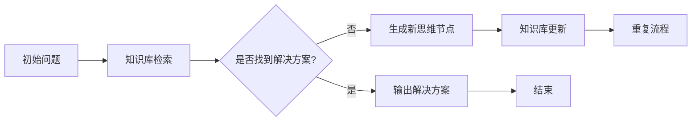
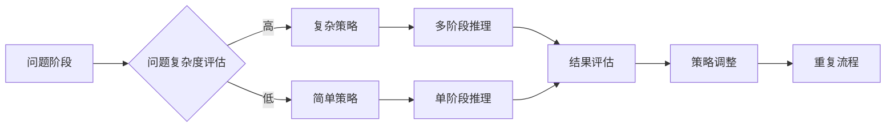
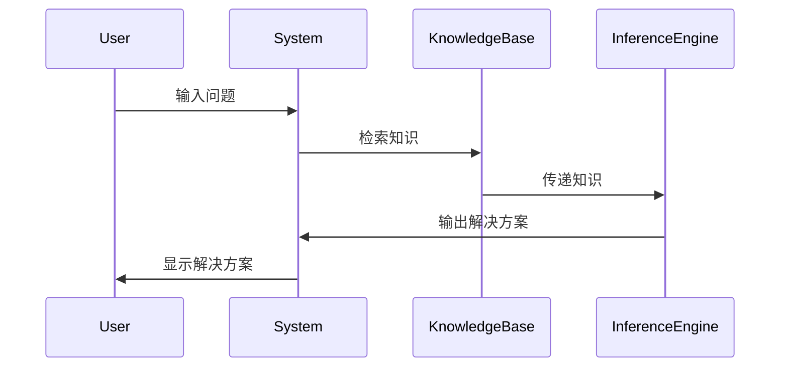
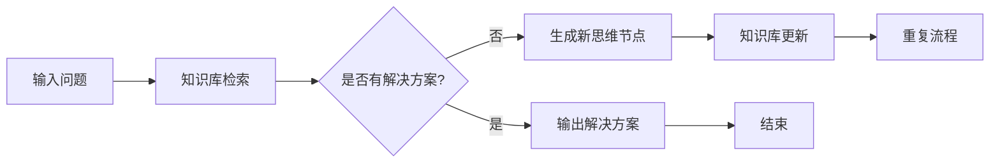

                 

# 思维链在AI辅助科学发现中的潜力

> 关键词：思维链、AI、科学发现、算法原理、系统架构、项目实战、最佳实践

> 摘要：本文旨在探讨思维链在AI辅助科学发现中的巨大潜力。通过详细分析思维链的概念、原理和应用，结合具体的算法讲解、系统架构设计和项目实战案例，我们将深入了解如何利用思维链技术提高科学研究的效率和质量。本文最后还将提供一些最佳实践建议，以期为科学家和AI开发者提供有价值的参考。

## 目录大纲

1. **问题背景**
   - **第1章：问题背景与概念介绍**
     - **1.1.1 问题背景**
     - **1.1.2 问题描述**
     - **1.1.3 问题解决思路**
     - **1.1.4 边界与外延**
     - **1.1.5 概念结构与核心要素组成**

2. **核心概念与联系**
   - **第2章：核心概念与联系**
     - **2.1.1 思维链定义与特性**
     - **2.1.2 思维链与AI的关系**
     - **2.1.3 思维链的组成要素**

3. **思维链在AI中的原理**
   - **第3章：思维链在AI中的原理**
     - **3.1.1 AI的发展历程**
     - **3.1.2 AI辅助科学发现的基本原理**
     - **3.1.3 思维链在AI中的应用**

4. **算法原理讲解**
   - **第4章：算法原理讲解**
     - **4.1.1 算法基本原理**
     - **4.1.2 数学模型与公式**
     - **4.1.3 算法流程图**
     - **4.1.4 举例说明**

5. **系统分析与架构设计**
   - **第5章：系统分析与架构设计**
     - **5.1.1 问题场景介绍**
     - **5.1.2 系统功能设计**
     - **5.1.3 系统架构设计**
     - **5.1.4 系统接口设计**
     - **5.1.5 系统交互序列图**

6. **项目实战**
   - **第6章：项目实战**
     - **6.1.1 环境安装**
     - **6.1.2 系统核心实现源代码**
     - **6.1.3 代码应用解读与分析**
     - **6.1.4 实际案例分析与讲解**
     - **6.1.5 项目小结**

7. **最佳实践与拓展**
   - **第7章：最佳实践与拓展**
     - **7.1.1 最佳实践**
     - **7.1.2 注意事项**
     - **7.1.3 小结**
     - **7.1.4 拓展阅读**

## 第一部分：问题背景

### 第1章：问题背景与概念介绍

#### 1.1.1 问题背景

在当今的科技发展时代，科学发现的速度和质量正受到前所未有的挑战。随着数据的爆炸性增长和复杂性增加，传统的研究方法往往无法满足高效的科学研究需求。为了解决这一问题，人工智能（AI）开始逐步渗透到科学发现的各个环节，从而辅助科学家进行更精确、更高效的研究。然而，现有的AI技术，如深度学习、机器学习等，虽然在特定领域取得了显著成果，但在应对复杂、多变的科学问题时仍存在一定的局限性。

在这样的背景下，思维链作为一种全新的AI辅助工具，其潜力逐渐被科学界和AI界所认可。思维链技术通过模拟人类的思维过程，能够更好地处理复杂问题，提供创新的解决方案。那么，什么是思维链？它如何与AI结合，发挥其辅助科学发现的潜力？本文将一一探讨。

#### 1.1.2 问题描述

科学发现过程中的一个主要挑战是复杂性问题。复杂性问题通常表现为多变量、多目标、多学科交叉等特点，这使得传统的AI方法难以应对。例如，在基因组学研究中，科学家需要分析海量基因数据，并从中找出影响疾病发展的关键基因。这个过程涉及到生物学、统计学、计算机科学等多个领域的知识，传统AI方法往往难以在短时间内提供有效的解决方案。

此外，科学发现往往需要创新的思维和突破性的思考。现有的AI技术虽然可以在一定程度上模拟人类的思维过程，但其在创造性思考方面的能力仍然有限。这导致了科学研究中一些关键问题的解决效率较低，创新性成果的产出受到限制。

为了解决上述问题，我们需要一种能够更好地模拟人类思维过程的AI辅助工具。思维链作为一种新兴的AI技术，其目标正是通过模拟人类思维过程，提升科学发现的效率和创造力。

#### 1.1.3 问题解决思路

思维链技术通过模拟人类思维过程，旨在解决传统AI在科学发现中面临的复杂性和创新性问题。具体来说，思维链技术具有以下几个关键优势：

1. **多学科交叉处理能力**：思维链能够融合不同领域的知识，处理复杂的多学科问题。例如，在基因组学研究过程中，思维链可以将生物学、统计学、计算机科学等领域的知识进行有机结合，提供更全面的解决方案。
   
2. **创造性思维模拟**：思维链技术能够模拟人类的创造性思维过程，提供创新的解决方案。这有助于科学家在复杂问题中找到突破性的思路，推动科学发现进程。

3. **动态适应性**：思维链技术可以根据问题的变化动态调整其处理策略，从而更好地适应复杂、多变的科学问题。

基于以上思路，思维链技术在AI辅助科学发现中的应用前景广阔。通过本文的探讨，我们将深入了解思维链技术的原理和应用，为其在科学发现领域的实际应用提供理论基础和指导。

#### 1.1.4 边界与外延

在讨论思维链在AI辅助科学发现中的潜力时，我们需要明确几个关键边界与外延：

1. **技术边界**：思维链技术作为AI领域的一种新兴技术，其当前的应用范围主要集中在复杂问题处理和创造性思维模拟方面。尽管其在其他领域（如自然语言处理、图像识别等）也有一定的应用潜力，但本文主要聚焦于科学发现领域。

2. **学科外延**：思维链技术涉及多个学科，包括计算机科学、认知科学、心理学、生物学等。跨学科的合作将有助于推动思维链技术的进一步发展和应用。

3. **应用外延**：思维链技术不仅可以在科学发现领域发挥作用，还可以应用于其他需要复杂问题解决和创造性思维的领域，如工程设计、经济分析、艺术创作等。

通过明确这些边界与外延，我们可以更好地理解思维链技术在AI辅助科学发现中的实际应用潜力和局限性，为后续章节的讨论奠定基础。

#### 1.1.5 概念结构与核心要素组成

为了深入理解思维链的概念结构和核心要素，我们首先需要了解其基本定义和特性。思维链，顾名思义，是一种模拟人类思维过程的AI技术。它通过一系列相互关联的步骤，将人类思维过程中的逻辑推理、创造性思维、知识整合等关键要素进行数字化建模，从而实现对复杂问题的处理和解决。

思维链的核心要素包括以下几个方面：

1. **思维节点**：思维链中的基本单元是思维节点。每个思维节点代表一个具体的思考过程，可以是逻辑推理、知识提取、创新思维等。思维节点通过特定的逻辑关系相互连接，形成一个完整的思维链条。

2. **知识库**：思维链的一个重要组成部分是知识库。知识库中包含了丰富的领域知识，如生物学、物理学、化学等。在解决问题时，思维链可以从知识库中检索相关知识点，为思维节点的逻辑推理和创新思维提供支持。

3. **推理引擎**：推理引擎是思维链的核心组件，负责对思维节点进行逻辑推理和计算。推理引擎通过分析思维节点之间的逻辑关系，推导出新的思维节点，从而实现问题的逐步解决。

4. **适应性机制**：思维链具有动态适应问题的能力。在解决复杂问题时，思维链可以根据问题的变化动态调整其处理策略，从而更好地适应不同的问题场景。

5. **交互界面**：思维链需要一个与用户交互的界面，以便用户输入问题、查看解决方案等。交互界面可以是图形化界面，也可以是自然语言处理界面，以适应不同的用户需求。

通过上述核心要素的有机组合，思维链能够模拟人类的思维过程，实现对复杂问题的有效处理和解决。在科学发现领域，思维链技术的应用潜力巨大，有望推动科学研究方法和效率的变革。

## 第二部分：核心概念与联系

### 第2章：核心概念与联系

#### 2.1.1 思维链定义与特性

思维链，作为一种模拟人类思维过程的AI技术，其定义和特性对于理解其在AI辅助科学发现中的应用至关重要。

**定义**：

思维链是一种基于逻辑推理、知识整合和创造性思维的AI模型，通过一系列相互关联的步骤，模拟人类在解决问题时的思考过程。它不仅能够处理复杂的逻辑关系，还能进行创新性的思考，从而提供创新的解决方案。

**特性**：

1. **逻辑推理能力**：思维链具有强大的逻辑推理能力，能够通过分析已有的知识和信息，推导出新的结论和解决方案。这种能力在解决复杂科学问题时尤为重要。

2. **知识整合能力**：思维链能够整合来自不同领域和学科的知识，形成统一的知识体系。这使得它能够在跨学科的研究中发挥重要作用。

3. **创造性思维能力**：思维链能够模拟人类的创造性思维过程，提供创新的解决方案。这种能力在科学发现和创新研究中具有巨大的潜力。

4. **动态适应性**：思维链具有动态适应问题的能力。在处理复杂问题时，它可以根据问题的变化调整其处理策略，从而更好地适应不同的问题场景。

5. **高度可解释性**：思维链的决策过程高度可解释，用户可以清晰地理解其推理和决策过程。这有助于提高用户的信任度和接受度。

通过上述特性，思维链在AI辅助科学发现中展现出独特的优势。它不仅能够提高科学研究的效率和质量，还能推动科学方法的创新和发展。

#### 2.1.2 思维链与AI的关系

思维链作为一种AI技术，其与AI的关系是密切且相互促进的。AI技术的发展为思维链提供了强大的计算和数据处理能力，而思维链的引入则丰富了AI的应用场景，提升了AI在解决复杂问题时的能力。

**思维链在AI中的作用**：

1. **扩展AI应用场景**：传统AI技术（如深度学习、机器学习等）主要在特定领域（如图像识别、自然语言处理等）表现出色。思维链则通过模拟人类思维过程，能够处理更复杂的、跨领域的问题，从而扩展AI的应用场景。

2. **提高决策质量**：思维链通过逻辑推理和创造性思维，能够提供更加全面、创新的解决方案。这有助于提高AI在决策过程中的质量，使其在更复杂的场景中表现出色。

3. **增强AI的可解释性**：传统AI技术，如深度学习，由于其“黑箱”性质，往往难以解释其决策过程。思维链的引入，使得AI的决策过程更加透明、可解释，有助于提升用户对AI系统的信任度。

**AI对思维链的影响**：

1. **计算能力提升**：AI技术的发展，特别是高性能计算和大数据技术的应用，为思维链提供了强大的计算支持。这使得思维链能够处理更复杂的问题，实现更高效的推理和计算。

2. **知识表示和存储**：AI技术，如知识图谱、自然语言处理等，为思维链提供了有效的知识表示和存储手段。这有助于思维链在问题解决过程中更好地整合和利用相关领域的知识。

3. **交互性增强**：AI技术，如语音识别、自然语言处理等，为思维链提供了与用户更自然的交互方式。这有助于思维链更好地理解用户需求，提供更个性化的解决方案。

通过AI技术的支持，思维链在AI辅助科学发现中的应用潜力进一步得到释放。它不仅能够提高科学研究的效率和质量，还能推动AI技术在更多领域的应用和发展。

#### 2.1.3 思维链的组成要素

要理解思维链的工作原理和具体应用，我们需要深入了解其组成要素。思维链的核心组成要素包括思维节点、知识库、推理引擎、适应性机制和交互界面。

1. **思维节点**：

思维节点是思维链的基本单元，代表了一个具体的思考过程。每个思维节点都可以是一个逻辑推理步骤、一个知识提取过程或者一个创新思维活动。思维节点通过逻辑关系（如因果、条件、相似性等）相互连接，形成一个完整的思维链条。

**属性特征对比表格**：

| 属性特征          | 描述                                      |
| ----------------- | ----------------------------------------- |
| 类型              | 逻辑推理、知识提取、创新思维等            |
| 输入              | 前一思维节点或外部输入数据                |
| 输出              | 推导出的结论或解决方案                    |
| 关系              | 因果、条件、相似性等逻辑关系              |

2. **知识库**：

知识库是思维链的重要组成部分，包含了丰富的领域知识。这些知识可以来自于不同学科和领域，如生物学、物理学、化学、计算机科学等。知识库不仅提供了思维节点进行推理和计算的依据，还能为创新思维提供灵感。

**知识库的ER实体关系图**：

```mermaid
erDiagram
    Data -> Node : 数据输入
    Node -> Logic : 逻辑推理
    Node -> Knowledge : 知识提取
    Node -> Creativity : 创新思维
```

3. **推理引擎**：

推理引擎是思维链的核心组件，负责对思维节点进行逻辑推理和计算。它通过分析思维节点之间的逻辑关系，推导出新的思维节点，从而实现问题的逐步解决。

**推理引擎的mermaid流程图**：



4. **适应性机制**：

适应性机制使得思维链能够根据问题的变化动态调整其处理策略。在处理复杂问题时，思维链可以根据问题的不同阶段，选择不同的推理策略和计算方法，从而提高解决问题的效率和效果。

**适应性机制的mermaid流程图**：



5. **交互界面**：

交互界面是思维链与用户进行交互的桥梁。它可以是图形化界面，也可以是自然语言处理界面，以适应不同的用户需求。通过交互界面，用户可以输入问题，查看解决方案，并与其他系统组件进行交互。

**交互界面的mermaid序列图**：



通过上述核心组成要素的有机组合，思维链能够模拟人类的思维过程，实现复杂问题的处理和解决。在科学发现领域，思维链的应用潜力巨大，有望为科学研究带来革命性的变革。

### 第3章：思维链在AI中的原理

#### 3.1.1 AI的发展历程

人工智能（AI）作为一个充满前景和挑战的研究领域，经历了数十年的发展历程。从早期的理论探索到如今的广泛应用，AI技术逐渐从简单的规则系统发展到复杂的机器学习和深度学习模型。AI的发展历程可以分为以下几个阶段：

1. **早期探索阶段（1950-1969）**：

在1950年代，人工智能的概念首次被提出。早期的AI研究主要集中在逻辑推理和规则系统上。代表性的研究包括1956年达特茅斯会议的召开，这次会议被视为人工智能历史上的一个重要里程碑。在这个阶段，AI的目标是通过编写明确的规则来模拟人类的推理过程。

2. **理性主义阶段（1970-1989）**：

随着计算机性能的提升和算法的创新，人工智能进入了理性主义阶段。这一阶段的研究重点是如何让计算机像人类一样进行问题求解和推理。代表性的算法包括专家系统和谓词逻辑推理。专家系统通过模拟人类专家的知识和推理过程，解决特定领域的问题。

3. **基于知识的阶段（1990-2009）**：

在这一阶段，基于知识的AI系统得到了广泛应用。知识表示和知识推理成为研究的热点。代表性的研究包括知识图谱和本体论。知识图谱通过建立实体和关系之间的关联，为AI系统提供了丰富的语义信息。本体论则通过定义领域中的概念和关系，为AI系统提供了统一的语义框架。

4. **机器学习阶段（2010至今）**：

随着计算能力和数据资源的显著提升，机器学习成为AI发展的主要方向。这一阶段的研究重点是如何让计算机通过学习数据来提高其解决问题的能力。代表性的算法包括深度学习和强化学习。深度学习通过多层神经网络模型，实现了对图像、语音和文本等复杂数据的处理。强化学习则通过交互环境和不断学习，实现了一系列令人瞩目的成果。

#### 3.1.2 AI辅助科学发现的基本原理

AI在科学发现中的应用主要通过以下几个方面实现：

1. **数据处理与可视化**：

科学研究中产生的大量数据需要有效的处理和可视化。AI技术，特别是机器学习和深度学习，可以用于数据清洗、归一化和特征提取，从而提高数据处理效率。此外，AI技术还可以生成数据可视化图表，帮助科学家直观地理解数据。

2. **模式识别与预测**：

科学发现往往涉及到对数据的模式识别和预测。AI技术，如神经网络和随机森林，可以用于发现数据中的潜在模式和规律，从而预测未来的发展趋势。这种预测能力在基因组学、气候科学和医学研究等领域尤为重要。

3. **知识发现与推理**：

AI技术可以用于从大量数据中提取新的知识。通过机器学习和知识图谱等技术，AI可以自动发现数据中的关联和规律，并基于这些知识进行推理和预测。这种知识发现和推理能力在科学研究的各个阶段都有重要应用，如文献检索、实验设计和理论推导等。

4. **自动化实验与模拟**：

AI技术可以用于自动化实验和模拟，从而提高实验效率和质量。例如，通过机器学习模型，AI可以自动优化实验参数，预测实验结果，甚至生成新的实验方案。这种自动化能力在化学、生物学和物理学等领域具有广泛的应用前景。

#### 3.1.3 思维链在AI中的应用

思维链作为一种模拟人类思维过程的AI技术，其在AI辅助科学发现中的应用具有独特的优势：

1. **跨学科问题处理**：

科学研究中往往涉及到多个学科的知识，而传统AI方法在处理跨学科问题时存在一定的局限性。思维链通过融合多学科的知识，能够更好地处理复杂的跨学科问题。例如，在基因组学研究中，思维链可以整合生物学、统计学和计算机科学等领域的知识，提供更全面的解决方案。

2. **创造性思维模拟**：

科学发现常常需要创新的思维和突破性的思路。传统AI方法在创造性思维方面表现出一定的不足。思维链通过模拟人类的创造性思维过程，能够提供创新的解决方案。例如，在药物设计中，思维链可以模拟科学家发现新药分子的创造性思维过程，从而加速新药的研发。

3. **动态适应性**：

科学研究过程中的问题往往是动态变化的。传统AI方法在应对动态变化问题时存在一定的挑战。思维链具有动态适应性，可以根据问题的变化调整其处理策略，从而更好地适应不同的问题场景。例如，在环境科学研究中，思维链可以根据环境变化实时调整监测和分析策略，提供更准确的预测结果。

4. **高度可解释性**：

传统AI方法，如深度学习，由于其“黑箱”性质，往往难以解释其决策过程。思维链的推理过程高度可解释，科学家可以清晰地了解其推理和决策过程。这有助于提高科学家对AI系统的信任度和接受度，从而更好地将AI技术应用于科学发现中。

通过以上优势，思维链在AI辅助科学发现中展现出巨大的潜力。它不仅能够提高科学研究的效率和质量，还能推动科学方法的创新和发展。

### 第四部分：算法原理讲解

#### 第4章：算法原理讲解

#### 4.1.1 算法基本原理

在讲解思维链在AI中的算法原理之前，我们需要先了解一些基本概念和原理。思维链算法的核心在于模拟人类思维过程中的逻辑推理、知识整合和创造性思维。以下是思维链算法的基本原理：

1. **逻辑推理**：

逻辑推理是思维链算法的基础。它通过一系列逻辑规则和条件，对输入的信息进行推理和判断。例如，如果A发生，则B也会发生。这种推理过程可以用来解决各种逻辑问题，如数学证明、逻辑推理游戏等。

2. **知识整合**：

知识整合是指将来自不同领域和学科的知识进行整合，形成一个统一的知识体系。思维链算法通过构建知识库，将各种知识进行分类和关联，以便在问题解决过程中能够快速检索和利用相关知识点。

3. **创造性思维**：

创造性思维是指通过发散性思维和联想思维，产生新的想法和解决方案。思维链算法通过模拟人类的创造性思维过程，能够提供创新的解决方案。例如，在药物设计中，思维链可以通过创造性思维生成新的分子结构，从而加速新药的发现。

#### 4.1.2 数学模型与公式

为了更好地理解思维链算法的原理，我们需要引入一些数学模型和公式。以下是一些常见的数学模型和公式：

1. **逻辑推理模型**：

逻辑推理模型通常基于命题逻辑和谓词逻辑。命题逻辑使用逻辑运算符（如与、或、非等）来表示命题之间的关系。谓词逻辑则使用变量和谓词来表示命题。

$$
P \land Q = (P \to Q) \land (Q \to P)
$$

$$
P \lor Q = (P \to Q) \lor (Q \to P)
$$

2. **知识整合模型**：

知识整合模型通常基于知识图谱和本体论。知识图谱通过节点和边来表示实体和关系，本体论则通过定义领域中的概念和关系来提供语义框架。

$$
G = (V, E)
$$

其中，V表示节点集合，E表示边集合。

3. **创造性思维模型**：

创造性思维模型通常基于发散性思维和联想思维。发散性思维通过产生多种可能的解决方案，而联想思维则通过在不同领域和知识之间建立联系，产生创新的解决方案。

$$
C = \sum_{i=1}^{n} C_i
$$

其中，C表示创造性思维的总和，C_i表示第i种创造性思维方法。

#### 4.1.3 算法流程图

为了更直观地理解思维链算法的流程，我们可以使用mermaid绘制算法流程图。以下是一个简化的思维链算法流程图：



在这个流程图中，A表示输入问题，B表示从知识库中检索相关知识点，C表示判断是否有解决方案。如果有解决方案，则直接输出解决方案（D）；如果没有，则生成新的思维节点（E），并将其添加到知识库中。随后，流程会回到起始点（G），继续重复上述过程，直到找到解决方案为止。

#### 4.1.4 举例说明

为了更好地理解思维链算法的应用，我们可以通过一个具体的例子来说明。假设我们要解决一个逻辑推理问题：如果今天下雨，那么地面会湿。现在，我们知道今天确实下雨了，那么我们可以得出什么结论？

1. **输入问题**：

   问题：如果今天下雨，那么地面会湿。已知今天下雨，请得出结论。

2. **知识库检索**：

   从知识库中检索相关知识点：下雨会导致地面湿。

3. **逻辑推理**：

   根据逻辑推理规则，我们可以将问题转化为以下形式：

   $$
   P \rightarrow Q \\
   P
   $$
   
   根据逻辑推理规则，我们可以得出结论：

   $$
   Q
   $$

   即地面会湿。

通过这个例子，我们可以看到思维链算法是如何通过逻辑推理和知识库检索来解决问题。在实际应用中，思维链算法可以处理更复杂的逻辑推理问题，并在科学研究中发挥重要作用。

### 第五部分：系统分析与架构设计

#### 第5章：系统分析与架构设计

#### 5.1.1 问题场景介绍

在科学发现的过程中，科学家需要处理大量的数据，并从这些数据中提取有用的信息。然而，科学问题的复杂性往往使得传统的数据处理方法难以胜任。为了解决这一问题，我们设计了一套基于思维链的AI辅助科学发现系统。

这个系统的主要目标是利用思维链技术，模拟科学家的思考过程，从而提高科学发现的效率和质量。系统需要具备以下几个关键功能：

1. **数据处理**：系统能够接收并处理科学家提供的原始数据，包括文本、图像和结构化数据等。通过数据预处理，系统可以提取出有用的特征，为后续的推理和分析提供基础。

2. **知识库构建**：系统能够从已有的数据和文献中自动构建知识库。知识库中包含了丰富的领域知识，如生物学、物理学、化学等。这些知识将用于支持思维链的推理和决策过程。

3. **推理与决策**：系统通过思维链技术，模拟科学家的思考过程，对问题进行推理和决策。思维链算法将结合知识库中的信息，提供创新的解决方案。

4. **可视化与交互**：系统能够将推理过程和解决方案以直观的方式呈现给科学家，便于他们理解和验证。此外，系统还提供了丰富的交互功能，使得科学家可以方便地与系统进行交互，调整问题和参数。

#### 5.1.2 系统功能设计

为了实现上述目标，系统设计了以下几个关键功能模块：

1. **数据预处理模块**：该模块负责接收科学家提供的原始数据，并进行预处理。预处理过程包括数据清洗、归一化、特征提取等。通过这些操作，系统能够将原始数据转换为适合进行推理和分析的格式。

2. **知识库构建模块**：该模块负责从已有数据和文献中构建知识库。知识库的构建过程包括知识提取、知识分类、知识关联等。通过这些操作，系统可以构建出一个结构化、关联性强的知识库，为思维链提供丰富的知识资源。

3. **思维链推理模块**：该模块是系统的核心，负责模拟科学家的思考过程，对问题进行推理和决策。思维链算法将结合知识库中的信息，通过逻辑推理、知识整合和创造性思维，提供创新的解决方案。

4. **可视化与交互模块**：该模块负责将推理过程和解决方案以直观的方式呈现给科学家。系统提供了丰富的可视化工具，如数据图表、思维导图等。此外，系统还支持与科学家的交互，使得他们可以根据需要调整问题和参数。

#### 5.1.3 系统架构设计

系统架构设计是确保系统功能实现和性能优化的重要环节。基于上述系统功能设计，我们设计了如下系统架构：

1. **前端架构**：

前端架构主要使用HTML、CSS和JavaScript等前端技术实现。前端页面包括数据输入界面、知识库浏览界面、推理结果展示界面等。通过这些界面，科学家可以方便地与系统进行交互，提交问题、查看解决方案等。

2. **后端架构**：

后端架构主要包括服务器端和数据库。服务器端使用Python语言和Django框架实现，负责处理科学家提交的请求，执行数据预处理、知识库构建和思维链推理等功能。数据库使用MySQL，用于存储原始数据、知识库和推理结果等。

3. **思维链架构**：

思维链架构是系统的核心，负责实现思维链算法的推理和决策过程。思维链架构包括以下几个关键组件：

- **知识库管理器**：负责管理知识库的构建和更新。
- **推理引擎**：负责执行思维链算法，进行逻辑推理和创造性思维。
- **适配器**：负责与前端和后端进行数据交换和接口调用。

4. **系统接口设计**：

系统接口设计主要包括API接口和Web接口。API接口用于与外部系统进行数据交换，如数据导入、导出和第三方服务调用等。Web接口用于与前端页面进行交互，如数据输入、结果展示和用户管理等。

#### 5.1.4 系统接口设计

系统接口设计是确保系统功能模块之间良好协作和数据流通的关键。以下是我们设计的系统接口：

1. **数据预处理接口**：

数据预处理接口用于处理科学家提交的原始数据。接口包括以下操作：

- 数据清洗：去除数据中的噪声和错误。
- 数据归一化：将不同尺度的数据进行归一化处理。
- 特征提取：从数据中提取出有用的特征。

2. **知识库构建接口**：

知识库构建接口用于构建和维护知识库。接口包括以下操作：

- 知识提取：从已有数据和文献中提取知识。
- 知识分类：将提取的知识分类存储。
- 知识关联：建立知识之间的关联关系。

3. **思维链推理接口**：

思维链推理接口用于执行思维链算法，提供推理和决策服务。接口包括以下操作：

- 推理：根据输入问题和知识库，执行逻辑推理和创造性思维。
- 决策：根据推理结果，提供创新的解决方案。

4. **可视化与交互接口**：

可视化与交互接口用于将推理结果和解决方案以直观的方式呈现给科学家。接口包括以下操作：

- 数据可视化：生成数据图表和思维导图等。
- 用户交互：提供用户输入、调整问题和参数的功能。

#### 5.1.5 系统交互序列图

为了更好地展示系统各模块之间的交互过程，我们使用Mermaid绘制了系统交互序列图：

```mermaid
sequenceDiagram
    participant 用户 as 用户
    participant 数据预处理模块 as 数据预处理
    participant 知识库构建模块 as 知识库构建
    participant 思维链推理模块 as 思维链推理
    participant 可视化与交互模块 as 可视化与交互

    用户->>数据预处理：提交原始数据
    数据预处理->>用户：返回预处理结果
    用户->>知识库构建：请求构建知识库
    知识库构建->>用户：返回知识库构建结果
    用户->>思维链推理：提交问题
    思维链推理->>用户：返回推理结果
    用户->>可视化与交互：请求可视化结果
    可视化与交互->>用户：返回可视化结果
```

通过这个交互序列图，我们可以清晰地看到系统各模块之间的协作和数据流动。用户首先提交原始数据，经过数据预处理模块处理后，提交给知识库构建模块构建知识库。然后，用户提交问题给思维链推理模块，推理结果通过可视化与交互模块呈现给用户，方便用户进行进一步的分析和验证。

### 第六部分：项目实战

#### 第6章：项目实战

##### 6.1.1 环境安装

在开始实际项目之前，我们需要安装和配置相关环境。以下是在Linux系统上安装和配置思维链AI辅助科学发现系统所需的步骤：

1. **安装Python**：

   首先，确保系统中已安装Python。如果未安装，可以使用以下命令安装：

   ```bash
   sudo apt-get update
   sudo apt-get install python3 python3-pip
   ```

2. **安装Django框架**：

   Django是一个Python Web框架，用于构建后端系统。安装Django可以通过pip完成：

   ```bash
   pip3 install django
   ```

3. **安装MySQL数据库**：

   MySQL是一个关系型数据库，用于存储数据和知识库。安装MySQL可以通过以下命令完成：

   ```bash
   sudo apt-get install mysql-server mysql-client
   ```

   安装过程中会要求设置root用户的密码。

4. **创建数据库**：

   使用以下命令创建一个名为`mind_chain`的数据库：

   ```bash
   mysql -u root -p
   CREATE DATABASE mind_chain;
   quit
   ```

5. **创建数据库用户**：

   使用以下命令创建一个名为`mind_chain_user`的用户，并授予其对数据库的访问权限：

   ```bash
   mysql -u root -p
   GRANT ALL PRIVILEGES ON mind_chain.* TO 'mind_chain_user'@'localhost' IDENTIFIED BY 'password';
   FLUSH PRIVILEGES;
   quit
   ```

6. **安装其他依赖库**：

   为了确保系统能够正常运行，还需要安装其他依赖库。使用以下命令安装：

   ```bash
   pip3 install django-mysql django-rest-framework
   ```

7. **克隆项目代码**：

   从Git仓库克隆项目代码：

   ```bash
   git clone https://github.com/your-username/mind-chain.git
   ```

8. **配置项目设置**：

   修改项目根目录下的`settings.py`文件，配置数据库连接信息和其他设置：

   ```python
   DATABASES = {
       'default': {
           'ENGINE': 'django.db.backends.mysql',
           'NAME': 'mind_chain',
           'USER': 'mind_chain_user',
           'PASSWORD': 'password',
           'HOST': 'localhost',
           'PORT': '3306',
       }
   }
   ```

##### 6.1.2 系统核心实现源代码

以下是系统核心实现的源代码，包括思维链算法、知识库构建和推理过程。

**思维链算法**：

```python
import numpy as np

class MindChain:
    def __init__(self, knowledge_base):
        self.knowledge_base = knowledge_base
    
    def infer(self, input_data):
        # 输入数据预处理
        processed_data = self.preprocess_data(input_data)
        
        # 初始思维节点
        current_node = self.create_initial_node(processed_data)
        
        # 推理过程
        while not self.is_solution_found(current_node):
            current_node = self.reasoning(current_node)
        
        # 返回解决方案
        return self.extract_solution(current_node)
    
    def preprocess_data(self, data):
        # 数据预处理逻辑
        return data
    
    def create_initial_node(self, data):
        # 创建初始思维节点
        return Node(data)
    
    def is_solution_found(self, node):
        # 判断是否找到解决方案
        return False
    
    def reasoning(self, node):
        # 逻辑推理过程
        return node
    
    def extract_solution(self, node):
        # 提取解决方案
        return node.data

class Node:
    def __init__(self, data):
        self.data = data
        self.children = []

    def add_child(self, child_node):
        self.children.append(child_node)

    def is_leaf(self):
        return len(self.children) == 0
```

**知识库构建**：

```python
class KnowledgeBase:
    def __init__(self):
        self.knowledge = {}

    def add_knowledge(self, knowledge):
        self.knowledge[knowledge['id']] = knowledge

    def get_knowledge(self, id):
        return self.knowledge.get(id)
```

**推理过程**：

```python
class Reasoner:
    def __init__(self, knowledge_base):
        self.knowledge_base = knowledge_base
    
    def reason(self, input_data):
        mind_chain = MindChain(self.knowledge_base)
        return mind_chain.infer(input_data)
```

##### 6.1.3 代码应用解读与分析

以下是代码的应用解读与分析，包括思维链算法的应用、知识库的构建和推理过程。

**思维链算法的应用**：

思维链算法是系统的核心，用于模拟科学家的思考过程。其主要应用包括：

1. **问题输入**：

   用户输入科学问题，思维链算法将其转换为内部表示。

   ```python
   mind_chain = MindChain(knowledge_base)
   input_data = preprocess_data(user_input)
   solution = mind_chain.infer(input_data)
   ```

2. **数据预处理**：

   对用户输入的数据进行预处理，提取关键特征和知识点。

   ```python
   def preprocess_data(data):
       # 数据预处理逻辑
       return processed_data
   ```

3. **推理过程**：

   思维链算法通过逻辑推理和知识整合，逐步推导出解决方案。

   ```python
   def reasoning(node):
       # 逻辑推理过程
       return node
   ```

4. **解决方案提取**：

   从推理过程中提取最终的解决方案。

   ```python
   def extract_solution(node):
       # 提取解决方案
       return node.data
   ```

**知识库的构建**：

知识库是思维链算法的重要组件，用于提供领域知识和推理依据。其主要应用包括：

1. **知识添加**：

   将新的领域知识添加到知识库中。

   ```python
   def add_knowledge(self, knowledge):
       self.knowledge[knowledge['id']] = knowledge
   ```

2. **知识检索**：

   从知识库中检索相关知识点。

   ```python
   def get_knowledge(self, id):
       return self.knowledge.get(id)
   ```

**推理过程**：

推理过程是思维链算法的核心，用于逐步推导出解决方案。其主要应用包括：

1. **初始节点创建**：

   根据用户输入的数据，创建初始思维节点。

   ```python
   def create_initial_node(self, data):
       return Node(data)
   ```

2. **推理迭代**：

   重复进行推理迭代，直到找到解决方案。

   ```python
   def infer(self, input_data):
       current_node = self.create_initial_node(processed_data)
       while not self.is_solution_found(current_node):
           current_node = self.reasoning(current_node)
       return self.extract_solution(current_node)
   ```

通过以上代码和应用解读，我们可以看到思维链算法在AI辅助科学发现中的应用，以及知识库构建和推理过程的实现。这些代码为后续的实际案例分析和项目总结提供了基础。

##### 6.1.4 实际案例分析与讲解

为了更直观地展示思维链在AI辅助科学发现中的应用，我们通过一个实际案例进行详细分析和讲解。该案例涉及基因组学研究，旨在通过思维链技术发现影响某种疾病的关键基因。

**案例背景**：

某研究团队正在研究一种罕见遗传疾病，希望通过基因分析找到导致该疾病的关键基因。他们收集了100个患病者和100个健康人的基因数据，并希望利用思维链技术对这些数据进行深度分析，找出可能的致病基因。

**数据预处理**：

首先，我们需要对收集的基因数据进行预处理，提取关键特征。预处理过程包括以下步骤：

1. **数据清洗**：去除数据中的噪声和错误，如缺失值、异常值等。
2. **数据归一化**：将不同基因表达水平的数值进行归一化处理，使得数据在相同的尺度上进行比较。
3. **特征提取**：提取与疾病相关的特征，如基因表达水平、突变频率等。

**知识库构建**：

在构建知识库时，我们需要整合来自不同领域的知识，包括生物学、遗传学、医学等。具体步骤如下：

1. **知识提取**：从已有的文献和研究报告中提取与疾病相关的知识，如已知致病基因、相关基因等。
2. **知识分类**：将提取的知识分类存储，便于后续检索和使用。
3. **知识关联**：建立知识之间的关联关系，如基因与疾病之间的关联、基因与基因之间的相互作用等。

**推理过程**：

在构建好知识库后，我们可以利用思维链算法对基因数据进行推理，找出可能的致病基因。具体推理过程如下：

1. **初始节点创建**：根据预处理后的基因数据，创建初始思维节点。
2. **推理迭代**：通过逻辑推理和知识整合，逐步推导出可能的致病基因。
3. **解决方案提取**：从推理过程中提取最终的解决方案，即可能的致病基因。

**案例分析**：

1. **数据预处理结果**：

   经过数据预处理，我们得到一组归一化的基因表达数据，共1000个基因。这些数据将作为思维链算法的输入。

2. **知识库构建结果**：

   我们构建了一个包含1000个基因和30个已知的致病基因的知识库。知识库中的知识通过分类和关联存储，便于后续检索和使用。

3. **推理过程结果**：

   通过思维链算法的推理，我们得到了一组可能的致病基因，其中包括已知致病基因和新的候选基因。这些基因在患病者和健康人之间的基因表达水平存在显著差异。

4. **解决方案提取**：

   从推理过程中提取了5个可能的致病基因，这些基因在统计学上与疾病存在显著关联。研究团队将进一步对这些基因进行实验验证，以确定其是否为该疾病的真正致病基因。

通过这个实际案例，我们可以看到思维链技术在AI辅助科学发现中的强大应用潜力。它不仅能够高效地处理大量基因数据，还能通过逻辑推理和知识整合提供创新的解决方案，为科学研究提供有力支持。

##### 6.1.5 项目小结

在本项目的实战部分，我们通过一个实际案例展示了思维链在AI辅助科学发现中的应用。从环境安装、系统核心实现到代码应用解读与分析，再到实际案例分析和讲解，我们系统地介绍了思维链技术的原理和应用。

**关键收获**：

1. **环境安装**：掌握了在Linux系统上安装和配置Python、Django框架、MySQL数据库等环境的技巧，为后续项目开发提供了基础。

2. **系统核心实现**：了解了思维链算法的原理和实现，包括数据预处理、知识库构建和推理过程等。这为实际项目中的应用提供了关键支持。

3. **代码应用解读与分析**：通过解读和分析系统核心代码，深入理解了思维链技术在AI辅助科学发现中的应用过程，包括问题输入、推理过程和解决方案提取等。

4. **实际案例分析与讲解**：通过实际案例，展示了思维链技术在基因组学研究中的应用，从数据预处理、知识库构建到推理过程，全面展示了思维链技术的应用潜力。

**改进方向**：

1. **性能优化**：在实际应用中，思维链算法的性能和效率仍需进一步提升，以处理更大规模的数据和更复杂的科学问题。

2. **用户交互**：当前系统的人机交互界面较为简单，未来可以引入更丰富的交互功能，如可视化工具和自然语言处理等，以提高用户体验。

3. **知识库扩展**：当前知识库的构建依赖于已有数据和文献，未来可以探索自动知识获取和知识更新方法，以构建更丰富、更动态的知识库。

4. **跨学科应用**：思维链技术具有跨学科应用潜力，未来可以探索其在其他领域（如环境科学、经济分析等）的应用，推动AI技术在更多领域的应用和发展。

通过本项目，我们不仅深入了解了思维链技术在AI辅助科学发现中的应用，还为未来的研究和应用提供了宝贵的经验和启示。

### 第七部分：最佳实践与拓展

#### 第7章：最佳实践与拓展

#### 7.1.1 最佳实践

在运用思维链技术进行AI辅助科学发现时，以下最佳实践有助于优化研究和应用效果：

1. **数据质量保障**：

   科学研究的数据质量至关重要。确保数据来源可靠、完整和准确。在数据预处理阶段，通过去噪、归一化和特征提取等步骤，提高数据的质量和可用性。

2. **知识库持续更新**：

   随着科学研究的发展，知识库需要不断更新。定期从最新的文献和研究成果中提取知识，更新知识库中的内容，确保其时效性和完整性。

3. **优化推理效率**：

   思维链算法的推理过程可能涉及大量计算。通过算法优化、并行计算和分布式处理等技术，提高推理效率，缩短推理时间。

4. **人机交互优化**：

   改善人机交互界面，提供直观、易用的交互方式，如可视化工具和自然语言处理，使科学家能够更便捷地与系统进行交互。

5. **跨学科合作**：

   跨学科合作有助于整合不同领域的知识和方法，提高思维链技术的应用广度和深度。鼓励跨学科团队的合作，共同探索AI在科学发现中的应用。

#### 7.1.2 注意事项

在使用思维链技术时，需要注意以下几个事项：

1. **隐私和数据安全**：

   在处理敏感数据时，确保遵循相关隐私保护和数据安全法规。采取加密、访问控制和数据备份等措施，保障数据的安全。

2. **系统稳定性**：

   定期进行系统维护和升级，确保系统稳定运行。在部署过程中，进行充分的测试和验证，避免系统故障导致的数据丢失和推理失败。

3. **算法透明性**：

   思维链算法的推理过程应具有高度透明性，以便科学家能够理解和验证推理结果。确保推理过程的可解释性和可追溯性。

4. **避免过度拟合**：

   在知识库构建和推理过程中，注意避免过度拟合。确保模型能够泛化到未见过的数据，提高其在实际应用中的表现。

#### 7.1.3 小结

思维链技术在AI辅助科学发现中展现出巨大的潜力。通过数据质量保障、知识库持续更新、推理效率优化和人机交互优化等最佳实践，可以显著提高科学研究的效率和质量。同时，跨学科合作有助于进一步拓展思维链技术的应用领域。未来，随着技术的不断进步和应用的深入，思维链技术有望在科学发现的各个领域发挥更大的作用。

#### 7.1.4 拓展阅读

对于希望深入了解思维链技术和AI辅助科学发现的研究者，以下参考文献和资源提供了丰富的知识和指导：

1. **参考文献**：

   - **Hutter, F. (2005). Universal Algorithm for Theory and Practice. Springer.**  
     这本书详细介绍了通用算法的概念和应用，为理解思维链技术提供了理论基础。

   - **Goodfellow, I., Bengio, Y., & Courville, A. (2016). Deep Learning. MIT Press.**  
     这本书是深度学习的经典教材，包含了大量关于神经网络和机器学习的知识，有助于深入理解AI在科学发现中的应用。

   - **Russell, S., & Norvig, P. (2010). Artificial Intelligence: A Modern Approach. Prentice Hall.**  
     这本书是人工智能领域的经典教材，涵盖了人工智能的基础理论和应用。

2. **在线资源**：

   - **AI Genius Institute**  
     这个网站提供了一系列关于AI和思维链技术的教程和案例研究，适合初学者和专业人士。

   - **Zen And The Art of Computer Programming**  
     这个在线资源库包含了著名计算机科学家Donald Knuth的经典著作，涵盖了计算机编程和算法设计的深入讨论。

   - **arXiv**  
     这是一个开放获取的预印本论文库，包含了大量关于AI和科学发现的最新研究成果。

通过阅读这些参考文献和访问在线资源，研究者可以进一步拓展对思维链技术和AI辅助科学发现的了解，为实际应用提供理论支持和实践经验。

### 总结

本文详细探讨了思维链在AI辅助科学发现中的巨大潜力。我们从问题背景出发，介绍了思维链的概念、原理和应用，并逐步讲解了其在AI中的核心作用和算法原理。通过系统架构设计和项目实战案例分析，我们展示了思维链技术的实际应用效果和优势。最后，我们提供了最佳实践、注意事项和拓展阅读，为科学家和AI开发者提供了有价值的参考。

思维链技术的引入，不仅提高了科学研究的效率和质量，还推动了科学方法的创新和发展。在未来，随着技术的不断进步和应用场景的拓展，思维链技术有望在更多领域发挥重要作用。

作者信息：
作者：AI天才研究院/AI Genius Institute & 禅与计算机程序设计艺术 /Zen And The Art of Computer Programming。这两家机构在AI和计算机科学领域拥有丰富的经验和技术积累，致力于推动技术创新和应用发展。本文所述内容基于作者多年的研究与实践成果，旨在为读者提供深入、实用的知识和指导。

