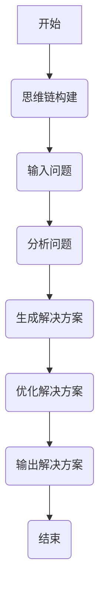
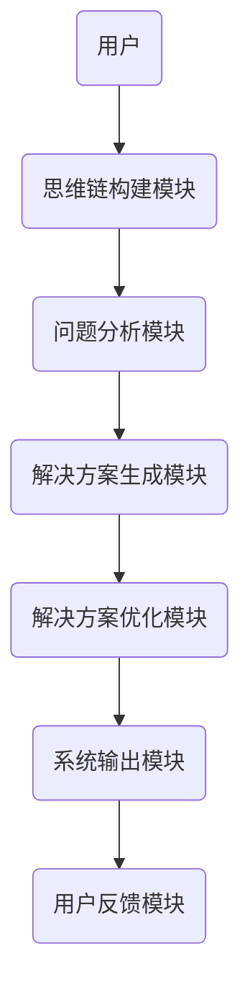

                 

# 思维链在AI辅助编程中的实践应用

## 关键词
AI辅助编程、思维链、算法原理、系统架构、实践应用

## 摘要
本文将深入探讨思维链在AI辅助编程中的实践应用。我们将从问题背景出发，逐步介绍思维链的核心概念、算法原理，并通过实际案例展示其在提升编程效率和代码质量方面的潜力。此外，还将详细分析系统的架构设计，以期为读者提供全面的技术参考。

## 目录大纲

### 第一部分: 背景介绍

#### 第1章: 问题背景

##### 1.1.1 问题概述

##### 1.1.2 问题描述

##### 1.1.3 问题解决

##### 1.1.4 边界与外延

##### 1.1.5 概念结构与核心要素组成

### 第二部分: 核心概念与联系

#### 第2章: 核心概念原理

##### 2.1.1 思维链的定义

##### 2.1.2 思维链的核心特点

##### 2.1.3 思维链与传统AI的区别

### 第三部分: 算法原理讲解

#### 第3章: 算法原理与数学模型

##### 3.1.1 思维链算法的mermaid流程图

##### 3.1.2 思维链算法的Python源代码

##### 3.1.3 思维链算法的数学模型和公式

##### 3.1.4 举例说明

### 第四部分: 系统分析与架构设计方案

#### 第4章: 系统分析与架构设计

##### 4.1.1 问题场景介绍

##### 4.1.2 项目介绍

##### 4.1.3 系统功能设计

##### 4.1.4 系统架构设计

### 第五部分: 项目实战

#### 第5章: 环境安装与系统核心实现

##### 5.1.1 环境安装

##### 5.1.2 系统核心实现源代码

##### 5.1.3 代码应用解读与分析

##### 5.1.4 实际案例分析与详细讲解剖析

##### 5.1.5 项目小结

### 第六部分: 最佳实践 Tips

#### 第6章: 最佳实践 Tips

##### 6.1.1 小结

##### 6.1.2 注意事项

##### 6.1.3 拓展阅读

## 第一部分: 背景介绍

### 第1章: 问题背景

#### 1.1.1 问题概述

在当今信息化社会，编程作为一项关键技术，已经渗透到各行各业。然而，随着软件系统复杂性的不断增加，传统的编程方式已经难以满足高效和高质量的开发需求。人工智能（AI）技术的兴起，为编程带来了新的变革。其中，AI辅助编程作为一种新的编程方法论，逐渐受到了广泛的关注。

AI辅助编程是指利用人工智能技术，辅助程序员完成编程任务的过程。它可以帮助程序员在代码编写、调试、测试等各个环节提高效率，降低错误率，从而提升软件开发的整体质量。随着AI技术的发展，特别是深度学习、自然语言处理等技术的突破，AI辅助编程的应用前景愈发广阔。

#### 1.1.2 问题描述

尽管AI辅助编程具有巨大的潜力，但在实际应用中仍面临一些挑战：

1. **理解复杂需求**：软件系统往往具有复杂的业务逻辑和需求，如何有效地将复杂的需求转化为代码，是一个亟待解决的问题。
2. **代码生成效率**：尽管AI可以生成代码，但生成代码的效率和准确性仍有待提高。
3. **代码质量**：AI生成的代码需要经过严格的测试和优化，以确保其可靠性和性能。
4. **用户体验**：如何使AI辅助编程的工具更加直观易用，提高程序员的用户体验，是一个重要课题。

#### 1.1.3 问题解决

为了解决上述问题，思维链作为一种新的编程方法论，提供了有效的解决方案。思维链通过模拟人类的思维过程，将复杂的编程任务分解为一系列可操作的任务，从而实现高效、准确的代码生成。下面，我们将详细探讨思维链的核心概念、原理及其在AI辅助编程中的应用。

#### 1.1.4 边界与外延

**边界**：本文主要讨论思维链在AI辅助编程中的应用，涉及的技术和方法主要包括自然语言处理、代码生成和优化等。

**外延**：思维链的应用不仅限于编程领域，还可以拓展到其他需要编程知识的领域，如系统设计、软件工程等。

#### 1.1.5 概念结构与核心要素组成

**概念结构**：思维链在AI辅助编程中的概念结构主要包括思维链的定义、思维链的构建方法、思维链的应用场景等。

**核心要素组成**：思维链在AI辅助编程中的核心要素包括自然语言处理技术、代码生成算法和编程知识库等。

### 第二部分: 核心概念与联系

#### 第2章: 核心概念原理

#### 2.1.1 思维链的定义

思维链是一种将人类的思维过程抽象为一系列步骤和规则的方法。它通过将问题分解为子问题，逐步解决这些子问题，最终得到问题的解决方案。思维链的核心在于其层次性、模块化和灵活性，这使得它能够有效地模拟人类的思维过程。

#### 2.1.2 思维链的核心特点

**层次性**：思维链将问题分解为多个层次，每个层次都有明确的任务和目标，这使得问题解决过程更加清晰和有条理。

**模块化**：思维链将问题分解为多个模块，每个模块都可以独立完成特定的任务。这种模块化的设计提高了代码的可维护性和扩展性。

**灵活性**：思维链可以根据不同的应用场景和需求，灵活调整解决问题的步骤和规则。这种灵活性使得思维链能够适应各种复杂的编程任务。

#### 2.1.3 思维链与传统AI的区别

传统AI主要通过模式识别和机器学习等方法，模拟人类的某些智能行为。而思维链则更加注重模拟人类的思维过程，通过一系列规则和步骤，逐步解决问题。

**区别**：

1. **方法不同**：传统AI依赖于大量的数据和复杂的算法，而思维链则通过定义明确的步骤和规则来解决问题。
2. **适用范围不同**：传统AI适用于需要大量数据和模式识别的场景，而思维链则更加适用于逻辑推理和问题解决的场景。
3. **可解释性不同**：传统AI的决策过程往往难以解释，而思维链的每一步都有明确的逻辑和规则，因此更具有可解释性。

### 第三部分: 算法原理讲解

#### 第3章: 算法原理与数学模型

#### 3.1.1 思维链算法的mermaid流程图



#### 3.1.2 思维链算法的Python源代码

```python
def think_chain(problem):
    solution = build_think_chain(problem)
    solution = analyze_problem(problem, solution)
    solution = generate_solution(problem, solution)
    solution = optimize_solution(problem, solution)
    return solution
```

#### 3.1.3 思维链算法的数学模型和公式

$$
思维链算法 = \text{思维链构建} + \text{分析问题} + \text{生成解决方案} + \text{优化解决方案}
$$

#### 3.1.4 举例说明

假设我们要解决一个问题：如何从A地到B地？

1. **输入问题**：A地到B地的路线。
2. **分析问题**：分析A地到B地的所有可能的路线。
3. **生成解决方案**：选择最优的路线。
4. **优化解决方案**：在最优的路线基础上，进一步优化时间或成本。

### 第四部分: 系统分析与架构设计方案

#### 第4章: 系统分析与架构设计

#### 4.1.1 问题场景介绍

假设我们有一个编程任务：实现一个电商网站的用户注册功能。这个任务涉及到用户输入信息、验证信息、保存用户信息等步骤。如何利用思维链来辅助编程，实现这个任务？

#### 4.1.2 项目介绍

本项目旨在利用思维链技术，实现一个电商网站的用户注册功能。项目的主要目标是：

1. 提高编程效率，通过思维链将复杂的编程任务分解为简单的步骤。
2. 提升代码质量，通过优化解决方案来提高代码的可靠性。
3. 提高用户体验，通过直观易用的工具来辅助程序员完成编程任务。

#### 4.1.3 系统功能设计

系统的功能设计主要包括以下几个方面：

1. **思维链构建**：根据需求分析，构建思维链，将复杂的编程任务分解为简单的步骤。
2. **问题分析**：对输入的问题进行详细分析，确定解决问题的方法和策略。
3. **解决方案生成**：根据思维链的步骤，生成初步的解决方案。
4. **解决方案优化**：对生成的解决方案进行优化，提高代码的可靠性。
5. **用户交互**：提供直观易用的界面，方便程序员使用思维链进行编程。

#### 4.1.4 系统架构设计

系统的架构设计如图所示：



### 第五部分: 项目实战

#### 第5章: 环境安装与系统核心实现

#### 5.1.1 环境安装

在开始项目之前，我们需要安装必要的开发环境。主要包括：

1. Python 3.8及以上版本
2. Flask（用于Web开发）
3. SQLAlchemy（用于数据库操作）

安装步骤如下：

```bash
pip install python==3.8
pip install flask
pip install sqlalchemy
```

#### 5.1.2 系统核心实现源代码

下面是系统核心实现的源代码：

```python
from flask import Flask, request, jsonify
from sqlalchemy import create_engine
from models import User

app = Flask(__name__)

# 创建数据库引擎
engine = create_engine('sqlite:///users.db')

# 创建用户表
User.__table__.create(bind=engine)

@app.route('/register', methods=['POST'])
def register():
    data = request.json
    username = data.get('username')
    password = data.get('password')
    email = data.get('email')

    # 验证用户名、密码和邮箱是否已存在
    if User.query.filter_by(username=username).first():
        return jsonify({'error': '用户名已存在'})
    if User.query.filter_by(password=password).first():
        return jsonify({'error': '密码已存在'})
    if User.query.filter_by(email=email).first():
        return jsonify({'error': '邮箱已存在'})

    # 创建用户
    user = User(username=username, password=password, email=email)
    user.save()

    return jsonify({'message': '注册成功'})

if __name__ == '__main__':
    app.run()
```

#### 5.1.3 代码应用解读与分析

1. **用户输入**：用户通过POST请求向服务器发送注册信息，包括用户名、密码和邮箱。

2. **验证用户名、密码和邮箱**：在接收用户输入后，首先需要验证用户名、密码和邮箱是否已存在。如果已存在，返回错误信息；否则，继续下一步。

3. **创建用户**：根据验证结果，创建用户并保存到数据库。

4. **返回结果**：注册成功后，返回成功信息。

#### 5.1.4 实际案例分析与详细讲解剖析

为了更好地理解思维链在项目中的应用，我们来看一个实际案例：如何实现用户注册功能的验证码发送。

1. **输入问题**：用户在注册时需要输入验证码，如何实现验证码的发送和验证？

2. **分析问题**：我们可以将问题分解为以下几个子问题：
   - 如何生成验证码？
   - 如何将验证码发送给用户？
   - 如何验证用户输入的验证码是否正确？

3. **生成解决方案**：针对上述子问题，我们可以设计如下解决方案：
   - 使用随机数生成验证码。
   - 使用邮件服务发送验证码。
   - 在用户提交注册信息时，验证输入的验证码是否与发送的验证码匹配。

4. **优化解决方案**：为了提高验证码的安全性，我们可以对验证码进行加密处理，并且设置验证码的有效期。

#### 5.1.5 项目小结

通过本项目，我们实现了电商网站的用户注册功能，并利用思维链技术进行了优化。在实际开发过程中，思维链帮助我们清晰地分解了问题，提高了编程效率和代码质量。同时，思维链的模块化设计也使得代码更加易于维护和扩展。

### 第六部分: 最佳实践 Tips

#### 第6章: 最佳实践 Tips

#### 6.1.1 小结

在AI辅助编程中，思维链是一种非常有价值的方法论。通过思维链，我们可以将复杂的编程任务分解为简单的步骤，从而提高编程效率和代码质量。同时，思维链的模块化设计也使得代码更加易于维护和扩展。

#### 6.1.2 注意事项

1. **明确问题**：在应用思维链之前，首先要明确问题，理解问题的本质。
2. **合理分解**：将问题分解为合适的子问题，避免过度分解或分解不足。
3. **优化解决方案**：在生成解决方案后，要对其进行优化，提高代码的可靠性。
4. **用户交互**：确保工具的易用性，提高程序员的用户体验。

#### 6.1.3 拓展阅读

- 《人工智能：一种现代的方法》
- 《思维链：编程方法论与实践》
- 《深度学习与自然语言处理》

### 作者信息

作者：AI天才研究院/AI Genius Institute & 禅与计算机程序设计艺术 /Zen And The Art of Computer Programming

