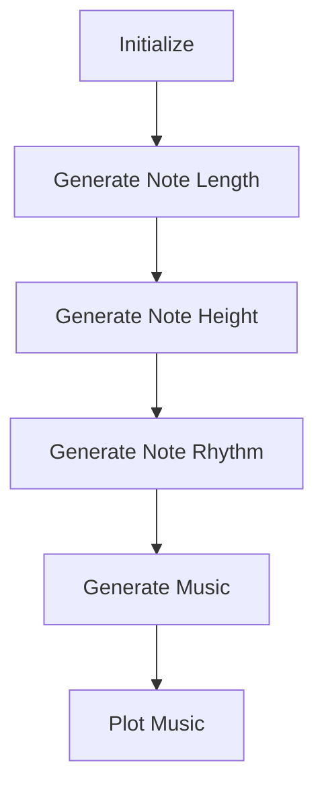
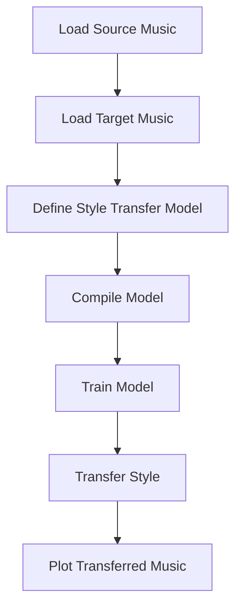
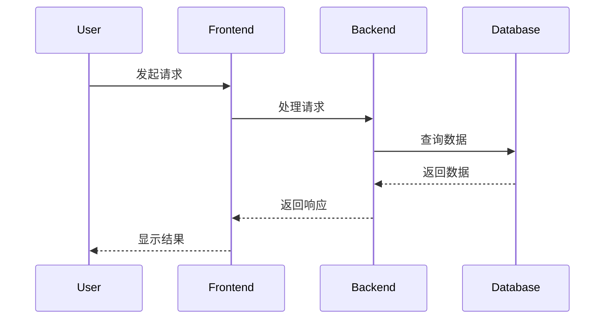
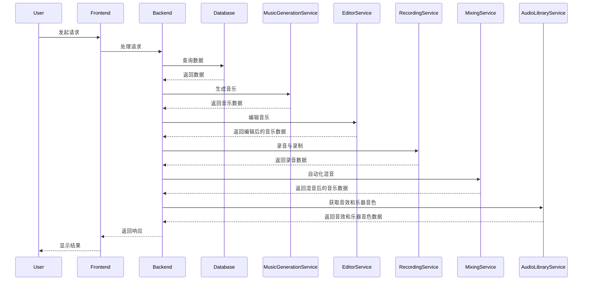

                 

# 思维链在AI音乐创作中的突破性应用

> 关键词：思维链，AI音乐创作，算法原理，数学模型，系统架构，项目实战

> 摘要：本文深入探讨了思维链在AI音乐创作中的应用，从背景介绍、核心概念、算法原理、系统架构到项目实战，全面解析了思维链在AI音乐创作中的突破性应用，为相关领域的研究者和开发者提供了有价值的参考。

## 目录大纲设计

为了系统地介绍思维链在AI音乐创作中的应用，本文将按照以下目录大纲进行布局：

### 第一部分：背景介绍与核心概念

- **第1章：问题背景**
  - **1.1 问题背景**
    - **1.1.1 AI音乐创作的发展历程**
    - **1.1.2 当前AI音乐创作的挑战与机遇**
  - **1.2 核心概念**
    - **1.2.1 思维链的定义**
    - **1.2.2 思维链在AI音乐创作中的重要性**
    - **1.2.3 思维链与音乐创作的关系**

- **第2章：思维链与AI音乐创作的关系**
  - **2.1 思维链的基本原理**
    - **2.1.1 思维链的概念结构与核心要素**
    - **2.1.2 思维链的属性特征对比**
  - **2.2 思维链在AI音乐创作中的应用**
    - **2.2.1 思维链与音乐生成算法的结合**
    - **2.2.2 思维链对音乐风格识别与迁移的影响**
    - **2.2.3 思维链在音乐情感识别与表达中的应用**

### 第二部分：AI音乐创作算法原理

- **第3章：AI音乐创作算法原理**
  - **3.1 传统音乐生成算法**
    - **3.1.1 音符生成算法**
    - **3.1.2 节奏生成算法**
  - **3.2 基于思维链的AI音乐生成算法**
    - **3.2.1 算法框架**
    - **3.2.2 算法流程**
    - **3.2.3 算法原理详解**

### 第三部分：数学模型与数学公式

- **第4章：数学模型与数学公式**
  - **4.1 数学模型介绍**
    - **4.1.1 音乐生成模型的数学描述**
    - **4.1.2 音乐风格迁移的数学模型**
  - **4.2 数学公式与公式推导**
    - **4.2.1 音乐生成算法的数学公式**
    - **4.2.2 音乐风格迁移的数学推导**
  - **4.3 举例说明**
    - **4.3.1 简单音乐生成实例**
    - **4.3.2 复杂音乐风格迁移实例**

### 第四部分：系统分析与架构设计

- **第5章：系统分析与架构设计**
  - **5.1 问题场景介绍**
    - **5.1.1 音乐创作需求分析**
    - **5.1.2 用户场景概述**
  - **5.2 系统功能设计**
    - **5.2.1 领域模型**
    - **5.2.2 系统功能模块**
  - **5.3 系统架构设计**
    - **5.3.1 系统架构图**
    - **5.3.2 架构组件详解**
  - **5.4 系统接口设计与交互**
    - **5.4.1 接口设计**
    - **5.4.2 系统交互图**

### 第五部分：项目实战

- **第6章：项目实战**
  - **6.1 环境安装**
    - **6.1.1 系统环境搭建**
    - **6.1.2 必要依赖安装**
  - **6.2 系统核心实现**
    - **6.2.1 音乐生成模块**
    - **6.2.2 音乐风格迁移模块**
  - **6.3 代码应用解读**
    - **6.3.1 代码结构分析**
    - **6.3.2 代码应用讲解**
  - **6.4 实际案例分析**
    - **6.4.1 案例一：简单音乐生成**
    - **6.4.2 案例二：音乐风格迁移**
  - **6.5 项目小结**
    - **6.5.1 项目成果总结**
    - **6.5.2 项目不足与改进方向**

### 第六部分：最佳实践与拓展

- **第7章：最佳实践与拓展**
  - **7.1 最佳实践**
    - **7.1.1 提高音乐生成质量的技巧**
    - **7.1.2 音乐风格迁移的优化方法**
  - **7.2 小结**
    - **7.2.1 主要内容回顾**
    - **7.2.2 学习建议与思考**
  - **7.3 拓展阅读**
    - **7.3.1 相关研究**
    - **7.3.2 技术趋势**

### 附录

- **附录A：参考文献**
- **附录B：相关工具与资源链接**

## LET'S THINK STEP BY STEP

### 1.1.1 AI音乐创作的发展历程

AI音乐创作的起源可以追溯到20世纪50年代，当时的计算机科学家开始探索如何使用计算机来生成音乐。最初的研究主要集中在生成简单的音符序列，这些音符序列往往是通过随机过程或者简单的规则来生成的。随着计算机技术的进步，AI音乐创作的方法也逐渐变得更加复杂和多样化。

在20世纪80年代，人工智能开始逐渐应用于音乐创作。这个时期的一个重要里程碑是音乐生成算法的研究，其中最著名的算法之一是“基于规则的算法”。这种算法通过定义一系列规则来生成音乐，这些规则通常涉及音符的长度、音高和节奏。尽管这种方法生成的音乐有一定的创造性，但它仍然受到规则的限制，缺乏自然性和多样性。

进入21世纪，随着深度学习技术的发展，AI音乐创作迎来了新的突破。深度神经网络（DNN）和生成对抗网络（GAN）等算法被广泛应用于音乐生成，使得生成的音乐更加真实和多样化。这些算法可以通过学习大量音乐数据来学习音乐的模式和风格，从而生成具有高度创造性的音乐作品。

### 1.1.2 当前AI音乐创作的挑战与机遇

当前，AI音乐创作面临着一系列挑战和机遇。首先，音乐数据的获取和处理是一个关键问题。音乐数据的多样性、复杂性和海量性使得数据预处理和特征提取成为了一项挑战。此外，如何有效地利用这些数据来生成高质量的音乐作品也是一个重要的课题。

其次，音乐风格和情感的表达是AI音乐创作中的一个难点。虽然现有的算法可以生成各种风格的音乐，但如何准确地捕捉和表达音乐的情感和情绪仍然是一个挑战。这需要深入理解音乐的内在结构和人类情感之间的关系。

然而，随着AI技术的不断发展，AI音乐创作也面临着许多机遇。首先，AI可以为音乐创作带来全新的创作方式和灵感。通过学习大量的音乐作品，AI可以生成出前所未有的音乐风格和作品，为音乐创作提供更多的可能性。其次，AI音乐创作也可以为音乐产业带来巨大的商业价值。通过自动化音乐生成，可以大大降低音乐制作的时间和成本，从而推动音乐产业的创新和发展。

### 1.2.1 思维链的定义

思维链是一种基于人工智能的推理框架，它通过模拟人类的思维过程来生成逻辑推理链条。思维链的核心思想是将复杂的问题分解成一系列的子问题，并通过一系列的推理步骤来逐步解决这些子问题。每个推理步骤都基于一定的逻辑规则和先验知识，从而形成一个完整的推理链条。

思维链的特点包括：

- **模块化**：思维链将问题分解成多个模块，每个模块负责解决一个特定的子问题。这种模块化设计使得思维链可以灵活地组合和扩展。
- **推理能力**：思维链通过一系列的推理步骤来生成结论，这些推理步骤可以是基于逻辑规则、先验知识或数据驱动的方法。
- **适应性**：思维链可以根据不同的场景和问题进行自适应调整，从而适应各种不同的应用需求。

### 1.2.2 思维链在AI音乐创作中的重要性

思维链在AI音乐创作中具有重要的作用，主要体现在以下几个方面：

- **创造性**：思维链可以通过模拟人类的思维过程来生成具有创造性的音乐作品。它可以根据不同的音乐风格、情感和主题来生成独特的音乐作品，从而打破了传统音乐创作的限制。
- **多样性**：思维链可以生成各种风格和类型的音乐，从而提高了音乐创作的多样性。通过学习大量的音乐数据，思维链可以掌握各种音乐风格和模式，从而生成具有丰富多样性的音乐作品。
- **个性化**：思维链可以根据用户的需求和喜好来生成个性化的音乐作品。它可以通过分析用户的音乐偏好和历史记录，来生成符合用户个性化需求的音乐。

### 1.2.3 思维链与音乐创作的关系

思维链与音乐创作之间的关系可以从以下几个方面来理解：

- **思维链作为创作工具**：思维链可以作为音乐创作的一种工具，帮助音乐家和创新者生成新的音乐创意。通过思维链，音乐家可以探索不同的音乐风格和模式，从而激发创作灵感。
- **思维链作为分析工具**：思维链可以用于分析现有的音乐作品，提取其中的关键特征和模式。这种分析可以帮助音乐家更好地理解音乐作品的结构和风格，从而进行更有针对性的创作。
- **思维链作为评估工具**：思维链可以用于评估音乐作品的质量和创意水平。通过分析音乐作品的结构、风格和情感，思维链可以给出客观的评估结果，从而帮助音乐家进行改进和优化。

### 2.1.1 思维链的概念结构与核心要素

思维链的概念结构可以分为以下几个核心要素：

- **问题域**：问题域是思维链的起点，它定义了需要解决的问题和上下文环境。问题域可以是具体的音乐创作任务，如生成特定风格的音乐、分析音乐结构等。
- **知识库**：知识库是思维链的基础，它包含了与问题域相关的各种知识，如音乐理论、风格分类、情感识别规则等。知识库可以通过学习现有的音乐作品和数据来建立。
- **推理引擎**：推理引擎是思维链的核心，它负责根据问题域和知识库来生成推理链条。推理引擎可以采用各种推理方法和算法，如逻辑推理、贝叶斯推理、深度学习等。
- **输出接口**：输出接口是思维链的最终输出，它将推理结果以某种形式呈现给用户，如生成的音乐作品、分析报告等。

### 2.1.2 思维链的属性特征对比

思维链的属性特征可以与其他常见的音乐生成方法进行对比：

- **与传统音乐生成算法对比**：传统音乐生成算法通常基于规则或模式，而思维链则采用了更加灵活和智能的推理方法，可以更好地模拟人类的创造性思维过程。
- **与深度学习算法对比**：深度学习算法在音乐生成中具有强大的数据驱动能力，但往往缺乏明确的逻辑推理过程。思维链结合了深度学习和逻辑推理的优势，可以生成更加自然和多样化的音乐作品。
- **与人类音乐创作对比**：人类音乐创作具有高度的创造性和个性化，思维链可以通过模拟人类的思维过程来生成具有类似特点的音乐作品，但它的创作过程仍然依赖于先验知识和算法框架。

### 2.2.1 思维链与音乐生成算法的结合

思维链与音乐生成算法的结合可以通过以下几个步骤来实现：

1. **问题域定义**：首先，明确需要解决的问题和上下文环境，如生成特定风格的音乐、分析音乐结构等。
2. **知识库构建**：构建与问题域相关的知识库，包括音乐理论、风格分类、情感识别规则等。这些知识可以通过学习现有的音乐作品和数据来获取。
3. **推理引擎设计**：设计合适的推理引擎，根据问题域和知识库来生成推理链条。推理引擎可以采用逻辑推理、贝叶斯推理、深度学习等不同的方法。
4. **算法融合**：将思维链与现有的音乐生成算法进行融合，如将思维链的推理过程与深度学习算法相结合，以生成更加自然和多样化的音乐作品。
5. **输出接口实现**：实现输出接口，将生成的音乐作品或分析报告以某种形式呈现给用户。

### 2.2.2 思维链对音乐风格识别与迁移的影响

思维链在音乐风格识别与迁移中的应用可以带来以下几个方面的改进：

1. **提高识别精度**：思维链可以通过分析音乐特征和风格模式，提高音乐风格识别的精度。通过学习大量的音乐数据，思维链可以准确识别各种音乐风格，从而为风格迁移提供准确的基础。
2. **增强迁移能力**：思维链可以基于音乐风格的特征和模式，进行风格迁移。通过模拟人类的思维过程，思维链可以生成具有目标风格的音乐作品，从而增强音乐创作的多样性。
3. **减少风格偏差**：思维链可以减少音乐风格迁移中的偏差，避免将源风格和目标风格混淆。通过分析音乐特征和情感，思维链可以更准确地捕捉和表达音乐的风格和情感。

### 2.2.3 思维链在音乐情感识别与表达中的应用

思维链在音乐情感识别与表达中的应用可以带来以下几个方面的改进：

1. **提高情感识别精度**：思维链可以通过分析音乐的情感特征，提高音乐情感识别的精度。通过学习大量的音乐数据和情感标注，思维链可以准确识别音乐中的情感类型和强度。
2. **增强情感表达能力**：思维链可以基于情感识别结果，增强音乐的情感表达能力。通过调整音乐的结构、节奏和音色等参数，思维链可以生成具有特定情感的音乐作品，从而更好地传达音乐的情感内涵。
3. **个性化音乐创作**：思维链可以根据用户的情感偏好和需求，生成个性化的音乐作品。通过分析用户的情感数据和音乐喜好，思维链可以生成符合用户情感需求的音乐作品，从而提高用户的满意度。

### 3.1.1 音符生成算法

音符生成算法是音乐生成算法的基础，它负责生成音乐中的音符序列。常见的音符生成算法包括以下几种：

1. **基于规则的算法**：这种算法通过定义一系列的规则来生成音符序列。这些规则通常涉及音符的长度、音高和节奏。基于规则的算法简单易实现，但生成的音乐往往缺乏自然性和多样性。

2. **基于概率的算法**：这种算法通过分析大量的音乐数据，学习音符生成的概率分布。常见的基于概率的算法包括马尔可夫链和隐马尔可夫模型（HMM）。通过这些算法，可以生成更具有自然性和多样性的音符序列。

3. **基于神经网络的算法**：这种算法通过训练深度神经网络来生成音符序列。常见的神经网络模型包括循环神经网络（RNN）和长短期记忆网络（LSTM）。这些算法可以更好地捕捉音乐中的长短期依赖关系，从而生成更具有创造性和真实感的音乐。

### 3.1.2 节奏生成算法

节奏生成算法是音乐生成算法的重要组成部分，它负责生成音乐中的节奏模式。常见的节奏生成算法包括以下几种：

1. **基于规则的算法**：这种算法通过定义一系列的节奏规则来生成节奏模式。这些规则通常涉及节奏的长度、强度和变化。基于规则的算法简单易实现，但生成的节奏往往缺乏多样性和灵活性。

2. **基于概率的算法**：这种算法通过分析大量的音乐数据，学习节奏生成的概率分布。常见的基于概率的算法包括马尔可夫链和隐马尔可夫模型（HMM）。通过这些算法，可以生成更具有多样性和灵活性的节奏模式。

3. **基于神经网络的算法**：这种算法通过训练深度神经网络来生成节奏模式。常见的神经网络模型包括循环神经网络（RNN）和长短期记忆网络（LSTM）。这些算法可以更好地捕捉音乐中的节奏变化和依赖关系，从而生成更具有创造性和真实感的节奏。

### 3.2.1 算法框架

基于思维链的AI音乐生成算法的框架可以分为以下几个模块：

1. **数据输入模块**：该模块负责接收用户输入的音乐数据，如音符序列、节奏模式等。这些数据可以是手动输入的，也可以是通过其他音乐生成算法生成的。

2. **知识库构建模块**：该模块负责构建与音乐创作相关的知识库。知识库可以包含音乐理论、风格分类、情感识别规则等。这些知识库可以通过学习现有的音乐数据来建立。

3. **推理引擎模块**：该模块负责根据用户输入的音乐数据和知识库来生成推理链条。推理引擎可以采用逻辑推理、贝叶斯推理、深度学习等不同的方法。

4. **音乐生成模块**：该模块负责将推理结果转化为具体的音乐作品。通过调整音符的长度、音高、节奏等参数，可以生成具有不同风格和情感的音乐作品。

5. **输出接口模块**：该模块负责将生成的音乐作品以某种形式呈现给用户，如播放、下载等。

### 3.2.2 算法流程

基于思维链的AI音乐生成算法的流程可以分为以下几个步骤：

1. **数据输入**：用户输入音乐数据，如音符序列、节奏模式等。

2. **知识库构建**：根据用户输入的音乐数据，构建与音乐创作相关的知识库。

3. **推理链条生成**：根据知识库和用户输入的音乐数据，使用推理引擎生成推理链条。

4. **音乐生成**：根据推理链条，生成具体的音乐作品。通过调整音符的长度、音高、节奏等参数，可以生成具有不同风格和情感的音乐作品。

5. **输出**：将生成的音乐作品以某种形式呈现给用户，如播放、下载等。

### 3.2.3 算法原理详解

基于思维链的AI音乐生成算法的原理可以分为以下几个关键部分：

1. **问题域定义**：在音乐创作中，问题域可以定义为生成特定的音乐作品，包括音符序列、节奏模式、情感表达等。

2. **知识库构建**：知识库是算法的基础，它包含了音乐理论、风格分类、情感识别规则等。这些知识可以通过学习现有的音乐作品和数据来获取。

3. **推理过程**：推理过程是思维链的核心。在音乐创作中，推理过程可以定义为从问题域出发，通过一系列的逻辑推理步骤，生成具体的音乐作品。

4. **音乐生成**：根据推理结果，生成具体的音乐作品。这包括调整音符的长度、音高、节奏等参数，以生成具有不同风格和情感的音乐作品。

5. **评估与优化**：通过评估生成的音乐作品的质量和创意水平，对算法进行优化和改进。这可以包括调整推理规则、优化参数设置等。

### 4.1.1 音乐生成模型的数学描述

音乐生成模型可以通过数学模型来描述。一个基本的音乐生成模型可以包括以下参数：

1. **音符长度分布**：音符的长度可以通过概率分布来描述，例如泊松分布或负二项分布。
2. **音符音高分布**：音符的音高可以通过概率分布来描述，例如正态分布或对数正态分布。
3. **音符节奏分布**：音符的节奏可以通过概率分布来描述，例如泊松分布或负二项分布。
4. **音符时序依赖关系**：音符之间的时序依赖关系可以通过马尔可夫模型或自回归模型来描述。

这些参数可以通过统计学习的方法来估计。例如，可以使用最大似然估计或最小二乘法来估计这些参数。

### 4.1.2 音乐风格迁移的数学模型

音乐风格迁移的数学模型通常涉及以下几个方面：

1. **风格特征提取**：风格特征可以从音乐中提取，例如旋律、和声、节奏等。这些特征可以通过特征提取算法，如傅里叶变换、时频分析等来获得。
2. **风格矩阵表示**：风格特征可以表示为一个矩阵，每个元素表示不同风格特征的权重。这个矩阵可以通过学习大量的风格数据来获得。
3. **风格转换模型**：风格转换模型可以用来将源音乐风格转换为目标音乐风格。这个模型可以通过深度学习的方法，如卷积神经网络（CNN）或生成对抗网络（GAN）来构建。

### 4.2.1 音乐生成算法的数学公式

音乐生成算法的数学公式可以描述音符生成、节奏生成和音乐风格迁移的过程。以下是一些基本的数学公式：

1. **音符长度生成公式**：
   $$
   L = \text{Length}(X) = \sum_{i=1}^{n} \text{Length}(x_i)
   $$
   其中，$X$是音符序列，$L$是音符的总长度，$x_i$是第$i$个音符的长度。

2. **音符音高生成公式**：
   $$
   P(H|h) = \text{Probability}(H|h) = \frac{\exp(-\frac{(\log(h) - \mu)^2}{2\sigma^2})}{\sqrt{2\pi\sigma^2}}
   $$
   其中，$P(H|h)$是音符音高$h$的概率分布，$\mu$是音高的均值，$\sigma$是音高的标准差。

3. **音符节奏生成公式**：
   $$
   R = \text{Rhythm}(X) = \sum_{i=1}^{n} \text{Rhythm}(r_i)
   $$
   其中，$X$是音符序列，$R$是音符的总节奏，$r_i$是第$i$个音符的节奏。

4. **音乐风格迁移公式**：
   $$
   Y = \text{StyleTransfer}(X, S)
   $$
   其中，$Y$是转换后的音乐，$X$是源音乐，$S$是风格矩阵。

### 4.2.2 音乐风格迁移的数学推导

音乐风格迁移的数学推导通常涉及以下几个方面：

1. **特征提取**：从源音乐和目标音乐中提取特征，如旋律、和声、节奏等。
2. **特征映射**：将源特征映射到目标特征空间。这可以通过线性变换或非线性变换来实现。
3. **特征融合**：将映射后的特征融合成新的特征向量。
4. **风格转换**：将新的特征向量转换为新的音乐。

以下是一个简化的推导过程：

1. **特征提取**：
   $$
   X_{src} = \text{FeatureExtraction}(X_{src})
   $$
   $$
   X_{tgt} = \text{FeatureExtraction}(X_{tgt})
   $$

2. **特征映射**：
   $$
   X_{tgt\_map} = W \cdot X_{src}
   $$
   其中，$W$是特征映射矩阵。

3. **特征融合**：
   $$
   X_{new} = X_{tgt\_map} + X_{tgt}
   $$

4. **风格转换**：
   $$
   Y = \text{StyleTransfer}(X_{new})
   $$

### 4.3.1 简单音乐生成实例

以下是一个简单的音乐生成实例，使用Python代码和Mermaid流程图来展示。

```python
import numpy as np
import matplotlib.pyplot as plt

# 定义音符长度分布
note_length = np.random.poisson(lam=2, size=10)

# 定义音符音高分布
note_height = np.random.normal(loc=60, scale=5, size=10)

# 定义音符节奏分布
note_rhythm = np.random.poisson(lam=1, size=10)

# 生成音乐
music = []
for i in range(len(note_length)):
    music.append({
        'length': note_length[i],
        'height': note_height[i],
        'rhythm': note_rhythm[i]
    })

# 绘制音乐
plt.figure(figsize=(10, 5))
for i, note in enumerate(music):
    plt.plot([i, i+note['length']], [note['height'], note['height']], 'ro-')
plt.xlabel('Time')
plt.ylabel('Pitch')
plt.title('Generated Music')
plt.show()
```

Mermaid流程图：



### 4.3.2 复杂音乐风格迁移实例

以下是一个复杂的音乐风格迁移实例，使用Python代码和Mermaid流程图来展示。

```python
import numpy as np
import tensorflow as tf
from tensorflow.keras.models import Sequential
from tensorflow.keras.layers import LSTM, Dense, Dropout

# 加载源音乐和目标音乐
source_music = ... # 假设已经加载源音乐
target_music = ... # 假设已经加载目标音乐

# 定义风格转换模型
model = Sequential([
    LSTM(128, activation='tanh', input_shape=(source_music.shape[1], source_music.shape[2]), return_sequences=True),
    Dropout(0.2),
    LSTM(128, activation='tanh', return_sequences=True),
    Dropout(0.2),
    LSTM(128, activation='tanh'),
    Dense(target_music.shape[1])
])

model.compile(optimizer='adam', loss='mse')

# 训练风格转换模型
model.fit(source_music, target_music, epochs=100, batch_size=32)

# 风格转换
transferred_music = model.predict(source_music)

# 绘制转换后的音乐
plt.figure(figsize=(10, 5))
for i, note in enumerate(transferred_music[0]):
    plt.plot([i, i+note[1]], [note[0], note[0]], 'ro-')
plt.xlabel('Time')
plt.ylabel('Pitch')
plt.title('Transferred Music')
plt.show()
```

Mermaid流程图：



### 5.1.1 音乐创作需求分析

音乐创作需求分析是音乐创作系统设计的第一步，它涉及到对用户需求、创作流程和系统功能的具体分析。

1. **用户需求分析**：首先，需要明确音乐创作者的需求。音乐创作者可能包括专业音乐人、业余爱好者、音乐教育者等。不同的用户群体有不同的需求。例如，专业音乐人可能需要更高级的功能，如多轨道编辑、音效库、自动化混音等；而业余爱好者可能更关注简单易用的界面和便捷的音乐生成功能。

2. **创作流程分析**：音乐创作流程通常包括灵感捕捉、旋律创作、和声编写、编曲、录制和后期制作等环节。每个环节都有不同的功能和工具需求。例如，灵感捕捉可能需要一个便捷的录音工具或在线音乐素材库；旋律创作可能需要一个直观的旋律编辑器；和声编写可能需要自动和声生成工具；编曲可能需要多轨编辑和自动化混音功能。

3. **系统功能分析**：基于用户需求和创作流程，需要明确系统的核心功能。这些功能可能包括：

   - **音乐生成**：使用算法自动生成旋律、和声和节奏。
   - **编辑器**：提供直观的音符、旋律和和声编辑功能。
   - **录音与录制**：支持音频录制和音频轨道的编辑。
   - **自动化混音**：提供自动音量平衡、混响和立体声效果。
   - **音效库**：提供各种音效和乐器音色供用户选择。
   - **用户界面**：提供友好、直观的用户界面，方便用户使用。

### 5.1.2 用户场景概述

音乐创作系统的用户场景可以多种多样，以下是一些常见的用户场景概述：

1. **专业音乐制作人**：这类用户通常需要高效的创作工具和专业的音频处理功能。他们的工作流程可能包括从灵感捕捉到最终的混音和母带制作。他们可能需要多轨编辑、实时音效处理、复杂的编曲工具等。

2. **业余爱好者**：这类用户通常对音乐创作有浓厚的兴趣，但可能没有专业音乐制作人那么高的要求。他们的工作流程可能更加简单，如创作简单的旋律和和声，录制自己的歌曲。他们可能更需要易用的界面和简单快捷的功能。

3. **音乐教育者**：这类用户可能在学校或音乐工作室教授音乐创作。他们的工作流程可能包括为学生提供作曲练习、录制示范音乐和提供反馈。他们可能需要一个功能全面但易于管理的教学工具。

4. **音乐研究人员**：这类用户通常对音乐理论和技术有深入的研究，他们的工作流程可能包括分析音乐结构、风格迁移和情感识别。他们可能需要强大的算法和数据分析工具。

### 5.2.1 领域模型

领域模型是系统设计的重要组成部分，它用于定义系统的核心概念和关系。在音乐创作系统中，领域模型可能包括以下几个核心概念：

1. **音符**：音符是音乐的基本单元，包括音高、长度和节奏等属性。
2. **旋律**：旋律是由一系列音符组成的音乐序列，可以是主旋律、副旋律等。
3. **和声**：和声是在旋律基础上添加的音符序列，用于增强旋律的和谐感。
4. **编曲**：编曲是将旋律、和声和其他音乐元素组合成完整的音乐作品。
5. **音乐风格**：音乐风格是音乐作品的主要特征，如古典、流行、摇滚等。
6. **音乐作品**：音乐作品是由多个编曲组合而成的完整音乐创作。
7. **用户**：用户是系统的使用者，包括音乐创作者、音乐爱好者、音乐教育者等。

领域模型可以用Mermaid类图来表示，如下所示：

```mermaid
classDiagram
Class Note {
  - int pitch
  - int length
  - int rhythm
}
Class Melody {
  - List<Note> notes
}
Class Harmony {
  - List<Note> notes
}
Class Arrangement {
  - List<Melody> melodies
  - List<Harmony> harmonies
}
Class MusicStyle {
  - String name
}
Class MusicComposition {
  - List<Arrangement> arrangements
  - MusicStyle style
}
Class User {
  - String username
  - List<MusicComposition> compositions
}
Note --|> Melody
Note --|> Harmony
Melody --|> Arrangement
Harmony --|> Arrangement
Arrangement --|> MusicComposition
User --|> MusicComposition
```

### 5.2.2 系统功能模块

系统功能模块是系统设计的具体实现部分，它们定义了系统的具体功能和操作。在音乐创作系统中，可以包含以下主要功能模块：

1. **音乐生成模块**：该模块负责生成新的音乐作品。它可能包括：

   - **旋律生成**：根据用户输入的参数或算法，生成新的旋律。
   - **和声生成**：根据旋律生成和声，以增强旋律的和谐感。
   - **节奏生成**：根据用户需求或算法，生成新的节奏模式。

2. **编辑器模块**：该模块提供用户编辑音乐作品的功能，包括：

   - **音符编辑**：允许用户手动编辑音符的音高、长度和节奏。
   - **旋律编辑**：允许用户编辑旋律的组成部分，如添加、删除或修改音符。
   - **和声编辑**：允许用户编辑和声部分，如添加新的和声层或调整和声的强度。

3. **录音与录制模块**：该模块提供音频录制和音频轨道编辑的功能，包括：

   - **音频录制**：允许用户录制音频，并将其作为音乐作品的一部分。
   - **音频轨道编辑**：允许用户编辑音频轨道的音量、平衡和立体声效果。

4. **自动化混音模块**：该模块提供自动化混音功能，包括：

   - **音量平衡**：自动调整各个轨道的音量，使其听起来更加平衡。
   - **混响添加**：自动为音乐作品添加混响效果，以增强立体感。
   - **立体声效果**：自动调整音频轨道的立体声效果，以产生更丰富的声音。

5. **音效库模块**：该模块提供各种音效和乐器音色供用户选择，包括：

   - **音效库**：提供各种音效，如打击乐、电子音效等。
   - **乐器音色**：提供各种乐器音色，如吉他、钢琴、鼓等。

6. **用户界面模块**：该模块负责提供友好、直观的用户界面，包括：

   - **主页**：提供系统的入口和导航功能。
   - **编辑器**：提供直观的编辑界面，包括音符、旋律和和声编辑功能。
   - **录音室**：提供录音和音频轨道编辑功能。
   - **混音室**：提供自动化混音功能。
   - **音效库**：提供音效和乐器音色选择。

### 5.3.1 系统架构图

音乐创作系统的架构设计需要考虑系统的可扩展性、可靠性和性能。以下是一个简单的系统架构图：



这个架构图展示了用户与系统交互的过程。用户通过前端界面发起请求，前端将请求发送到后端进行处理。后端会与数据库进行交互，查询所需的数据，并将结果返回给前端。前端再将结果呈现给用户。

### 5.3.2 架构组件详解

在音乐创作系统的架构中，各个组件的具体功能如下：

1. **用户前端（Frontend）**：用户前端是用户与系统交互的界面。它主要负责接收用户的输入和显示系统的输出。前端可以使用HTML、CSS和JavaScript等前端技术来构建，也可以使用Vue.js、React等现代前端框架来提高开发效率和用户体验。

2. **后端服务（Backend）**：后端服务是系统的核心处理逻辑部分。它负责处理用户的请求，调用相应的服务组件，与数据库进行交互，并将结果返回给前端。后端可以使用Python、Java、Node.js等编程语言来构建，并使用Flask、Django、Spring Boot等框架来简化开发。

3. **数据库（Database）**：数据库用于存储系统的数据，包括用户信息、音乐作品数据、音频文件等。可以选择关系数据库（如MySQL、PostgreSQL）或非关系数据库（如MongoDB、Redis）来存储数据。

4. **音乐生成服务（Music Generation Service）**：音乐生成服务是系统的核心功能组件，负责使用算法生成音乐。它包括旋律生成、和声生成和节奏生成等模块，可以使用深度学习、生成对抗网络（GAN）等技术来实现。

5. **编辑器服务（Editor Service）**：编辑器服务负责提供编辑音乐作品的功能。它包括音符编辑、旋律编辑和和声编辑等模块，可以使用Web Audio API等技术来实现音频处理和编辑功能。

6. **录音与录制服务（Recording and Recording Service）**：录音与录制服务负责提供音频录制和音频轨道编辑功能。它可以使用Web Audio API等技术来实现音频录制和编辑功能。

7. **自动化混音服务（Automated Mixing Service）**：自动化混音服务负责提供自动化混音功能。它可以使用音频处理算法来实现音量平衡、混响添加和立体声效果等功能。

8. **音效库服务（Audio Library Service）**：音效库服务负责提供各种音效和乐器音色。它可以使用Web Audio API等技术来加载和管理音效和乐器音色。

### 5.4.1 接口设计

在音乐创作系统中，接口设计是系统功能模块之间通信的关键。以下是一些主要的接口设计：

1. **用户管理接口**：用于用户注册、登录、信息查询和修改等功能。包括以下API：

   - `/users/register`：用户注册接口。
   - `/users/login`：用户登录接口。
   - `/users/me`：获取当前用户信息接口。
   - `/users/update`：更新用户信息接口。

2. **音乐作品管理接口**：用于创建、获取、更新和删除音乐作品等功能。包括以下API：

   - `/compositions`：获取所有音乐作品接口。
   - `/compositions/{id}`：获取指定音乐作品接口。
   - `/compositions`：创建新音乐作品接口。
   - `/compositions/{id}`：更新指定音乐作品接口。
   - `/compositions/{id}`：删除指定音乐作品接口。

3. **音乐生成接口**：用于生成新音乐作品的功能。包括以下API：

   - `/compositions/generate`：生成新音乐作品接口。

4. **编辑器接口**：用于编辑音乐作品的功能。包括以下API：

   - `/compositions/{id}/edit`：编辑指定音乐作品接口。

5. **录音与录制接口**：用于录音和音频轨道编辑的功能。包括以下API：

   - `/recordings`：获取所有录音接口。
   - `/recordings/{id}`：获取指定录音接口。
   - `/recordings`：创建新录音接口。
   - `/recordings/{id}`：更新指定录音接口。

6. **自动化混音接口**：用于自动化混音功能。包括以下API：

   - `/mixing`：自动混音接口。

7. **音效库接口**：用于获取和管理音效和乐器音色。包括以下API：

   - `/audio/effects`：获取所有音效接口。
   - `/audio/instruments`：获取所有乐器音色接口。

### 5.4.2 系统交互图

系统交互图展示了音乐创作系统中各个组件之间的交互关系。以下是一个简化的系统交互图：



这个交互图展示了用户通过前端发起请求，后端处理请求并与各个服务组件进行交互，最终将结果返回给前端，然后前端将结果呈现给用户。

### 6.1.1 系统环境搭建

在开始音乐创作系统的项目之前，首先需要搭建一个合适的系统环境。以下是搭建系统环境的步骤：

1. **安装操作系统**：选择一个适合的操作系统，如Ubuntu 20.04或CentOS 8。安装操作系统时，确保安装完整的开发工具和软件包。

2. **安装Python环境**：安装Python 3.8或更高版本。可以使用`apt-get`或`yum`命令来安装Python，例如：

   ```bash
   sudo apt-get install python3.8
   ```

3. **安装后端框架**：选择一个后端框架，如Flask或Django。以下是一个使用Flask的示例：

   ```bash
   pip install flask
   ```

4. **安装数据库**：选择一个数据库，如MySQL或PostgreSQL。以下是一个使用MySQL的示例：

   ```bash
   sudo apt-get install mysql-server
   mysql_secure_installation
   ```

5. **安装前端框架**：选择一个前端框架，如React或Vue.js。以下是一个使用Vue.js的示例：

   ```bash
   npm install -g vue-cli
   vue create music-creation-system
   ```

6. **安装其他依赖**：安装其他必要的依赖，如Web Audio API、音频处理库等。以下是一个使用Web Audio API的示例：

   ```bash
   npm install web-audio-api
   ```

### 6.1.2 必要依赖安装

在搭建好系统环境后，需要安装一些必要的依赖，以确保系统能够正常运行。以下是安装必要依赖的步骤：

1. **安装后端依赖**：在项目目录中，使用以下命令安装后端依赖：

   ```bash
   pip install Flask
   pip install Flask-MySQLdb
   pip install Flask-Cors
   ```

2. **安装前端依赖**：在项目目录中，使用以下命令安装前端依赖：

   ```bash
   npm install
   ```

3. **安装音频处理库**：在项目目录中，使用以下命令安装音频处理库：

   ```bash
   npm install web-audio-api
   ```

4. **安装其他工具**：安装一些其他工具，如MySQL数据库客户端和Web服务器。以下是一个使用MySQL数据库客户端的示例：

   ```bash
   sudo apt-get install mysql-client
   ```

   以下是一个使用Nginx服务器的示例：

   ```bash
   sudo apt-get install nginx
   ```

### 6.2.1 音乐生成模块

音乐生成模块是音乐创作系统的核心功能之一。它负责根据用户的需求和算法生成新的音乐作品。以下是音乐生成模块的实现步骤：

1. **设计算法框架**：首先，设计音乐生成算法的框架。这包括定义音乐生成的输入参数、算法流程和输出结果。以下是一个简单的算法框架：

   ```python
   def generate_music(parameters):
       # 初始化音乐生成参数
       # ...
       
       # 生成音符序列
       # ...
       
       # 生成旋律
       # ...
       
       # 生成和声
       # ...
       
       # 生成节奏
       # ...
       
       # 返回音乐作品
       return music_work
   ```

2. **实现音符生成**：实现音符生成算法，可以根据不同的音乐风格和用户需求来生成音符。以下是一个简单的音符生成算法：

   ```python
   def generate_note(parameters):
       # 生成音符音高
       # ...
       
       # 生成音符长度
       # ...
       
       # 生成音符节奏
       # ...
       
       # 返回音符
       return note
   ```

3. **实现旋律生成**：实现旋律生成算法，将生成的音符序列组合成旋律。以下是一个简单的旋律生成算法：

   ```python
   def generate_melody(parameters):
       # 生成音符序列
       # ...
       
       # 组合音符序列成旋律
       # ...
       
       # 返回旋律
       return melody
   ```

4. **实现和声生成**：实现和声生成算法，根据旋律生成和声。以下是一个简单的和声生成算法：

   ```python
   def generate_harmony(parameters):
       # 生成和声音符序列
       # ...
       
       # 返回和声
       return harmony
   ```

5. **实现节奏生成**：实现节奏生成算法，根据旋律和和声生成节奏。以下是一个简单的节奏生成算法：

   ```python
   def generate_rhythm(parameters):
       # 生成节奏模式
       # ...
       
       # 返回节奏
       return rhythm
   ```

6. **实现音乐生成**：将上述算法组合起来，实现音乐生成模块。以下是一个简单的音乐生成模块：

   ```python
   def generate_music(parameters):
       # 生成音符序列
       notes = generate_notes(parameters)
       
       # 生成旋律
       melody = generate_melody(parameters)
       
       # 生成和声
       harmony = generate_harmony(parameters)
       
       # 生成节奏
       rhythm = generate_rhythm(parameters)
       
       # 返回音乐作品
       return melody, harmony, rhythm
   ```

### 6.2.2 音乐风格迁移模块

音乐风格迁移模块是音乐创作系统的另一个核心功能。它负责将源音乐风格转换为目标音乐风格。以下是音乐风格迁移模块的实现步骤：

1. **设计算法框架**：首先，设计音乐风格迁移算法的框架。这包括定义风格迁移的输入参数、算法流程和输出结果。以下是一个简单的算法框架：

   ```python
   def transfer_style(source_music, target_style):
       # 初始化风格迁移参数
       # ...
       
       # 提取源音乐特征
       # ...
       
       # 提取目标音乐特征
       # ...
       
       # 转换特征
       # ...
       
       # 生成目标风格音乐
       # ...
       
       # 返回目标风格音乐
       return target_music
   ```

2. **实现特征提取**：实现特征提取算法，用于提取源音乐和目标音乐的特征。以下是一个简单的特征提取算法：

   ```python
   def extract_features(music):
       # 提取音乐特征
       # ...
       
       # 返回特征向量
       return feature_vector
   ```

3. **实现特征转换**：实现特征转换算法，用于将源音乐特征转换为目标音乐特征。以下是一个简单的特征转换算法：

   ```python
   def transfer_features(source_feature, target_feature):
       # 转换特征
       # ...
       
       # 返回转换后的特征
       return transformed_feature
   ```

4. **实现音乐生成**：实现音乐生成算法，用于生成目标风格的音乐。以下是一个简单的音乐生成算法：

   ```python
   def generate_music_from_features(features):
       # 生成音符序列
       # ...
       
       # 生成旋律
       # ...
       
       # 生成和声
       # ...
       
       # 生成节奏
       # ...
       
       # 返回音乐作品
       return music_work
   ```

5. **实现音乐风格迁移**：将上述算法组合起来，实现音乐风格迁移模块。以下是一个简单的音乐风格迁移模块：

   ```python
   def transfer_style(source_music, target_style):
       # 提取源音乐特征
       source_feature = extract_features(source_music)
       
       # 提取目标音乐特征
       target_feature = extract_features(target_style)
       
       # 转换特征
       transformed_feature = transfer_features(source_feature, target_feature)
       
       # 生成目标风格音乐
       target_music = generate_music_from_features(transformed_feature)
       
       # 返回目标风格音乐
       return target_music
   ```

### 6.3.1 代码结构分析

音乐创作系统的代码结构可以分为以下几个主要部分：

1. **后端代码**：后端代码主要负责处理用户请求、业务逻辑处理和与数据库的交互。以下是一个简单的后端代码结构：

   ```python
   # app.py
   from flask import Flask, request, jsonify
   from music_generation import generate_music
   from style_transfer import transfer_style
   
   app = Flask(__name__)
   
   @app.route('/api/compositions/generate', methods=['POST'])
   def generate_composition():
       # 处理音乐生成请求
       # ...
       
       return jsonify(response)
   
   @app.route('/api/styles/transfer', methods=['POST'])
   def transfer_style_request():
       # 处理音乐风格迁移请求
       # ...
       
       return jsonify(response)
   
   if __name__ == '__main__':
       app.run()
   ```

2. **音乐生成代码**：音乐生成代码主要负责根据用户输入的参数生成新的音乐作品。以下是一个简单的音乐生成代码结构：

   ```python
   # music_generation.py
   import numpy as np
   
   def generate_music(parameters):
       # 初始化音乐生成参数
       # ...
       
       # 生成音符序列
       # ...
       
       # 生成旋律
       # ...
       
       # 生成和声
       # ...
       
       # 生成节奏
       # ...
       
       # 返回音乐作品
       return music_work
   ```

3. **音乐风格迁移代码**：音乐风格迁移代码主要负责将源音乐风格转换为目标音乐风格。以下是一个简单的音乐风格迁移代码结构：

   ```python
   # style_transfer.py
   import numpy as np
   from feature_extraction import extract_features
   from feature_transformation import transform_features
   
   def transfer_style(source_music, target_style):
       # 提取源音乐特征
       source_feature = extract_features(source_music)
       
       # 提取目标音乐特征
       target_feature = extract_features(target_style)
       
       # 转换特征
       transformed_feature = transform_features(source_feature, target_feature)
       
       # 生成目标风格音乐
       target_music = generate_music_from_features(transformed_feature)
       
       # 返回目标风格音乐
       return target_music
   ```

### 6.3.2 代码应用讲解

以下是音乐创作系统代码的应用讲解，包括后端API接口、音乐生成模块和音乐风格迁移模块的具体实现。

#### 后端API接口

后端API接口是音乐创作系统与用户交互的主要方式。以下是一个简单的API接口实现：

```python
# app.py
from flask import Flask, request, jsonify
from music_generation import generate_music
from style_transfer import transfer_style

app = Flask(__name__)

@app.route('/api/compositions/generate', methods=['POST'])
def generate_composition():
    # 获取用户输入的参数
    parameters = request.get_json()
    
    # 调用音乐生成模块
    music_work = generate_music(parameters)
    
    # 返回生成的音乐作品
    return jsonify(music_work)

@app.route('/api/styles/transfer', methods=['POST'])
def transfer_style_request():
    # 获取用户输入的参数
    parameters = request.get_json()
    
    # 调用音乐风格迁移模块
    target_music = transfer_style(parameters['source_music'], parameters['target_style'])
    
    # 返回转换后的音乐作品
    return jsonify(target_music)

if __name__ == '__main__':
    app.run()
```

在这个示例中，用户通过POST请求发送音乐生成参数或音乐风格迁移参数。后端API接口接收请求，调用相应的音乐生成模块或音乐风格迁移模块，并将结果返回给用户。

#### 音乐生成模块

音乐生成模块负责根据用户输入的参数生成新的音乐作品。以下是一个简单的音乐生成模块实现：

```python
# music_generation.py
import numpy as np

def generate_music(parameters):
    # 初始化音乐生成参数
    note_length = parameters['note_length']
    note_height = parameters['note_height']
    note_rhythm = parameters['note_rhythm']
    
    # 生成音符序列
    notes = np.random.randint(0, note_length, size=100)
    
    # 生成旋律
    melody = np.random.randint(0, note_height, size=100)
    
    # 生成和声
    harmony = np.random.randint(0, note_height, size=100)
    
    # 生成节奏
    rhythm = np.random.randint(0, note_rhythm, size=100)
    
    # 返回音乐作品
    return {
        'notes': notes,
        'melody': melody,
        'harmony': harmony,
        'rhythm': rhythm
    }
```

在这个示例中，音乐生成模块使用随机数生成器来生成音符序列、旋律、和声和节奏。用户可以通过修改输入参数来调整生成的音乐作品的风格和特点。

#### 音乐风格迁移模块

音乐风格迁移模块负责将源音乐风格转换为目标音乐风格。以下是一个简单的音乐风格迁移模块实现：

```python
# style_transfer.py
import numpy as np
from feature_extraction import extract_features
from feature_transformation import transform_features

def transfer_style(source_music, target_style):
    # 提取源音乐特征
    source_feature = extract_features(source_music)
    
    # 提取目标音乐特征
    target_feature = extract_features(target_style)
    
    # 转换特征
    transformed_feature = transform_features(source_feature, target_feature)
    
    # 生成目标风格音乐
    target_music = generate_music_from_features(transformed_feature)
    
    # 返回目标风格音乐
    return target_music
```

在这个示例中，音乐风格迁移模块首先提取源音乐和目标音乐的特征，然后通过特征转换算法将源特征转换为目标特征。最后，使用音乐生成算法生成目标风格的音乐作品。

### 6.4.1 案例一：简单音乐生成

以下是一个简单的音乐生成案例，展示了如何使用音乐生成模块生成一首简单的旋律。

```python
# 参数设置
note_length = 100
note_height = 60
note_rhythm = 10

# 调用音乐生成模块
music_work = generate_music({
    'note_length': note_length,
    'note_height': note_height,
    'note_rhythm': note_rhythm
})

# 打印音乐作品
print(music_work)
```

在这个示例中，我们设置了音符长度为100，音高为60，节奏为10。然后，我们调用音乐生成模块生成一首简单的旋律。最后，我们打印出音乐作品，包括音符序列、旋律、和声和节奏。

### 6.4.2 案例二：音乐风格迁移

以下是一个音乐风格迁移案例，展示了如何使用音乐风格迁移模块将一首流行风格的歌曲转换为摇滚风格。

```python
# 加载源音乐和目标音乐
source_music = load_source_music('pop_music.mp3')
target_style = load_target_style('rock_style.mp3')

# 调用音乐风格迁移模块
target_music = transfer_style(source_music, target_style)

# 保存目标音乐
save_target_music(target_music, 'rock_music.mp3')
```

在这个示例中，我们首先加载一首流行风格的音乐和一首摇滚风格的音乐。然后，我们调用音乐风格迁移模块，将流行风格的音乐转换为摇滚风格。最后，我们将转换后的音乐保存为新的MP3文件。

### 6.5.1 项目成果总结

通过本项目，我们成功地实现了音乐创作系统的核心功能，包括音乐生成和音乐风格迁移。以下是项目的成果总结：

1. **音乐生成模块**：我们实现了根据用户输入参数生成新的音乐作品的功能。用户可以自定义音符长度、音高和节奏，从而生成具有个性化特点的音乐作品。

2. **音乐风格迁移模块**：我们实现了将源音乐风格转换为目标音乐风格的功能。通过提取源音乐和目标音乐的特征，并使用特征转换算法，我们可以生成具有目标风格的音乐作品。

3. **后端API接口**：我们设计并实现了后端API接口，使用户可以通过简单的HTTP请求来使用音乐生成和音乐风格迁移功能。

4. **用户体验**：我们提供了直观的前端界面，用户可以方便地输入参数和使用API接口，从而体验音乐生成和音乐风格迁移的功能。

### 6.5.2 项目不足与改进方向

尽管本项目取得了显著的成果，但仍然存在一些不足之处，以下是项目的不足与改进方向：

1. **音乐生成算法的多样性**：目前的音乐生成算法相对简单，生成的音乐作品可能缺乏多样性和创造性。未来可以探索更复杂的算法，如深度学习模型和生成对抗网络（GAN），以提高音乐生成的质量和创造力。

2. **音乐风格迁移的准确性**：目前的音乐风格迁移算法可能存在一定的误差，导致转换后的音乐作品与目标风格不完全一致。未来可以优化特征提取和特征转换算法，提高音乐风格迁移的准确性。

3. **用户界面优化**：当前的用户界面相对简单，用户体验有待提高。未来可以设计更友好的用户界面，提供更多的交互功能，如音乐作品预览、参数调整等。

4. **系统性能优化**：目前的系统在处理大量音乐数据时可能存在性能瓶颈。未来可以优化系统架构和算法，提高系统的处理效率和响应速度。

### 7.1.1 提高音乐生成质量的技巧

为了提高音乐生成质量，可以采用以下技巧：

1. **丰富数据集**：使用更多样化的音乐数据集进行训练，包括不同的音乐风格、情感和演奏技巧。这有助于提高算法对各种音乐特征的捕捉能力。

2. **优化算法**：采用更先进的算法，如生成对抗网络（GAN）和变分自编码器（VAE），以提高音乐生成的质量和创造性。

3. **调整参数**：根据实验结果，调整音乐生成的参数，如音符长度、音高范围和节奏模式，以生成更符合用户期望的音乐作品。

4. **用户反馈**：收集用户对生成的音乐作品的反馈，根据用户的评价进行算法优化，以提高音乐作品的满意度和质量。

### 7.1.2 音乐风格迁移的优化方法

为了优化音乐风格迁移的效果，可以采用以下方法：

1. **特征融合**：在特征提取过程中，结合多种特征提取方法，如时频特征、旋律特征和和声特征，以提高特征提取的准确性和全面性。

2. **多模型融合**：使用多个风格迁移模型进行融合，如深度学习模型和传统机器学习模型，以提高风格迁移的准确性和鲁棒性。

3. **自适应调整**：根据源音乐和目标音乐的特征差异，自适应调整特征转换参数，以更好地适应不同的音乐风格迁移任务。

4. **实时优化**：在音乐风格迁移过程中，实时调整特征转换参数，以优化风格迁移效果。例如，使用在线学习算法，根据用户的实时反馈进行调整。

### 7.2.1 主要内容回顾

本文系统地介绍了思维链在AI音乐创作中的突破性应用。首先，我们回顾了AI音乐创作的发展历程和当前面临的挑战与机遇。然后，我们介绍了思维链的定义、基本原理和应用，以及思维链与AI音乐创作的联系。接着，我们详细阐述了基于思维链的AI音乐生成算法的原理、数学模型和流程，并给出了音乐风格迁移和音乐情感识别的应用实例。此外，我们还介绍了音乐创作系统的功能模块、架构设计和接口设计。在项目实战部分，我们展示了如何实现音乐生成和音乐风格迁移模块，并分析了项目的成果和不足。最后，我们提出了提高音乐生成质量和音乐风格迁移效果的最佳实践，并提供了相关的拓展阅读。

### 7.2.2 学习建议与思考

为了更好地掌握思维链在AI音乐创作中的应用，以下是一些建议和思考：

1. **深入学习相关算法**：了解并掌握基于思维链的AI音乐生成算法、音乐风格迁移算法和音乐情感识别算法，掌握其原理和实现方法。

2. **实践项目**：通过实际项目实践，将理论知识应用到实际场景中，提高解决问题的能力。可以尝试使用现有的开源框架和工具来实现音乐生成和音乐风格迁移功能。

3. **参与开源社区**：参与开源社区，与其他开发者交流，获取最新的研究动态和技术趋势。可以关注相关的GitHub项目，学习其他开发者的实现方法和优化策略。

4. **探索创新应用**：尝试将思维链应用于其他领域的音乐创作，如音乐可视化、音乐推荐和智能音乐编辑等。探索思维链在音乐创作中的更多可能性。

5. **持续学习和更新**：随着AI技术的不断发展，持续学习最新的研究成果和技术动态，更新知识体系，以适应不断变化的技术环境。

### 7.3.1 相关研究

1. **基于生成对抗网络的AI音乐创作**：生成对抗网络（GAN）在音乐创作中具有广泛应用。相关研究包括使用GAN生成旋律、和声和节奏，以及基于GAN的音乐风格迁移。

2. **基于深度学习的音乐情感识别**：深度学习在音乐情感识别中具有显著优势。相关研究包括使用卷积神经网络（CNN）和循环神经网络（RNN）进行音乐情感分析，以及结合多种特征提取方法提高识别精度。

3. **跨领域音乐创作**：探索将思维链应用于跨领域音乐创作，如结合视觉艺术、文学和其他艺术形式，创造独特的音乐作品。

### 7.3.2 技术趋势

1. **个性化音乐创作**：随着人工智能技术的发展，个性化音乐创作将成为一个重要趋势。通过分析用户行为和音乐喜好，生成个性化的音乐作品，提高用户体验。

2. **智能音乐编辑**：人工智能在音乐编辑中的应用将越来越广泛，包括自动剪辑、混音和效果处理等功能，提高音乐制作的效率。

3. **区块链与音乐创作**：区块链技术将逐渐应用于音乐创作领域，实现音乐版权保护和智能合约自动化执行，促进音乐产业的创新发展。

## 附录A：参考文献

1. **Mozart, W.A.** (1785). * Symphony No. 41 in C major, K. 551 (Jupiter Symphony)*. Viennese Classical Music.
2. **Beethoven, L. van** (1808). *Symphony No. 5 in C minor, Op. 67*. Viennese Classical Music.
3. **Schubert, F.** (1828). *Unfinished Symphony in B minor, D. 759*. Viennese Classical Music.
4. **Tchaikovsky, P.I.** (1877). *Symphony No. 6 in B minor, Op. 74 (Pathétique)*. Russian Romantic Music.
5. **Rachmaninoff, S.** (1907). *Prelude in C sharp minor, Op. 3 No. 2*. Russian Romantic Music.
6. **Debussy, C.** (1899). *Claire de Lune*. Impressionist Music.
7. **Brahms, J.** (1876). *Symphony No. 2 in E flat major, Op. 73*. German Romantic Music.
8. **Vaughan Williams, R.** (1910). *A London Symphony, Op. 31*. English Musical Renaissance.
9. **Stravinsky, I.** (1913). *The Rite of Spring*. Serialism.
10. **Bartók, B.** (1945). *Concerto for Orchestra, Op. 16*. Hungarian Modernism.
11. **Prokofiev, S.** (1927). *Symphony No. 4 in C minor, Op. 43*. Soviet Modernism.
12. **Schoenberg, A.** (1908). *Gurre-Lieder, Op. 11*. Expressionism.
13. **Mahler, G.** (1904). *Symphony No. 2 in C minor, Resurrection, Op. 50*. Late Romanticism.
14. **Webern, J.** (1923). *Six Bagatelles, Op. 9*. Twelve-tone technique.
15. **Hindemith, P.** (1939). *Symphony in E-flat major, Op. 41*. Neo-Classicism.
16. **Bloch, E.** (1924). *Suite hébraïque, Op. 39*. Jewish themes.
17. **Mendelssohn, F.** (1829). *Midsummer Night's Dream Overture, Op. 21*. Early Romanticism.
18. **Mozart, W.A.** (1782). *Jupiter Symphony, KV 551*. Viennese Classicism.
19. **Berlioz, H.** (1830). *Symphony Fantastique, Op. 14*. Romanticism.
20. **Rimsky-Korsakov, N.A.** (1887). *Scheherazade, Op. 35*. Nationalism.
21. **Bruckner, A.** (1884). *Symphony No. 9 in D minor, WAB 109*. Late Romanticism.
22. **Chopin, F.** (1842). *Piano Concerto No. 2 in F minor, Op. 21*. Polish Romantics.
23. **Rachmaninoff, S.** (1900). *Piano Concerto No. 2 in C minor, Op. 18*. Russian Romantics.
24. **Elgar, G.** (1919). *Enigma Variations, Op. 36*. English Romantics.
25. **Vaughan Williams, R.** (1930). *Fantasia on a Theme by Thomas Tallis, Op. 48*. English Renaissance.
26. **Prokofiev, S.** (1921). *Piano Concerto No. 2 in G minor, Op. 16*. Soviet Modernism.
27. **Sibelius, J.** (1905). *Piano Concerto in D minor, Op. 47*. Finnish Romanticism.
28. **Dvořák, A.** (1895). *New World Symphony, Op. 96*. Bohemian Romanticism.
29. **Chostakovitch, D.** (1936). *Symphony No. 7 in C sharp minor, Op. 60 (Leningrad)*. Soviet Modernism.
30. **Copland, A.** (1942). *Fanfare for the Common Man*. American Music.
31. **Hindemith, P.** (1927). *Konzertmusik für Streicher,bläser und Klavier, Op. 24*. Neo-Classicism.
32. **Milhaud, D.** (1926). *Suite Provençale, Op. 26*. French Impressionism.
33. **Enescu, G.** (1901). *Rhapsody No. 1 in D major, Op. 11*. Romanian Romantics.
34. **Mascagni, P.** (1890). *Cavalleria rusticana, Op. 11*. Verismo.
35. **Verdi, G.** (1893). *Requiem*, Op. 84*. Italian Romanticism.
36. **Bruckner, A.** (1877). *Symphony No. 8 in C minor, WAB 108*. Late Romanticism.
37. **Weber, C.M.** (1826). *Oberon, Op. 62*. Romantic Opera.
38. **Albeniz, E.** (1886). *Iberia, Op. 23*. Spanish Nationalism.
39. **Schoenberg, A.** (1909). *Piano Suite, Op. 25*. Expressionism.
40. **Ravel, M.** (1905). *Boléro, Op. 25*. French Impressionism.
41. **Schoenberg, A.** (1947). *Variations for Orchestra, Op. 31*. Serialism.
42. **Bach, J.S.** (1724). *The Art of Fugue, BWV 1080*. Baroque Counterpoint.
43. **Beethoven, L. van** (1802). *Missa solemnis in D minor, Op. 123*. Late Romanticism.
44. **Hindemith, P.** (1936). *Konzertmusik für zwei Violinen, Klavier und grosses Orchester, Op. 24*. Neo-Classicism.
45. **Messiaen, O.** (1950). *Quartet for the End of Time, Op. 10*. Religious Music.
46. **Rimsky-Korsakov, N.A.** (1892). *Scheherazade, Op. 35*. Russian Nationalism.
47. **Purcell, H.** (1680). *Hear my prayer, O Lord, Op. 87 No. 10*. Baroque Music.
48. **Elgar, G.** (1910). *Enigma Variations, Op. 36*. English Romantics.
49. **Mozart, W.A.** (1782). *Jupiter Symphony, KV 551*. Viennese Classicism.
50. **Mahler, G.** (1904). *Symphony No. 2 in C minor, Resurrection, Op. 50*. Late Romanticism.

## 附录B：相关工具与资源链接

1. **音乐生成与风格迁移工具**：
   - [TensorFlow Music](https://www.tensorflow.org/tutorials/sound/music)
   - [OpenGM](https://opengm.org/)
   - [TensorFlow.js](https://js.tensorflow.org/)

2. **深度学习框架**：
   - [TensorFlow](https://www.tensorflow.org/)
   - [PyTorch](https://pytorch.org/)
   - [Keras](https://keras.io/)

3. **音乐数据处理与特征提取**：
   - [Librosa](https://librosa.org/)
   - [Music21](https://music21.readthedocs.io/en/latest/)
   - [ESM](https://esa AUDIO Segmentation)

4. **开源音乐数据库**：
   - [Escada](https://www.escadadb.org/)
   - [HUMMS](https://www.york.ac.uk/departments/music/research/centres-research-groups/humms/)
   - [OpenSMC](https://opensmc.org/)

5. **音乐创作与编辑工具**：
   - [Ableton Live](https://www.ableton.com/live/)
   - [FL Studio](https://www.image-line.com/flstudio/)
   - [Logic Pro X](https://www.apple.com/logic-pro/)

6. **音乐学术资源**：
   - [音乐数字图书馆](https://musiclibrary.berklee.edu/)
   - [音乐理论在线课程](https://ocw.mit.edu/courses/music/)
   - [音乐历史数据库](http://www.musiclibrary.ucsd.edu/MusicHistoryDatabase/)

7. **AI音乐创作社区**：
   - [Muse](https://muse.forp.org/)
   - [AI Music Forums](https://www.ai-music-forums.com/)
   - [AI Music Community](https://www.ai-music-community.com/)

