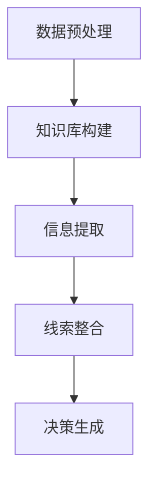
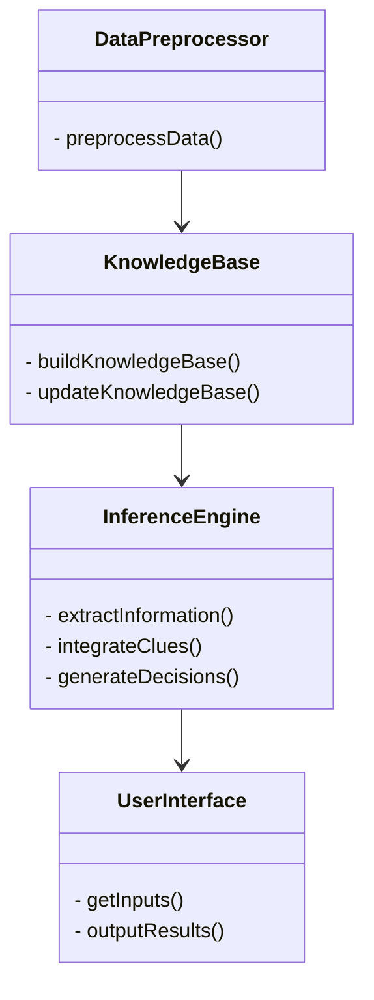
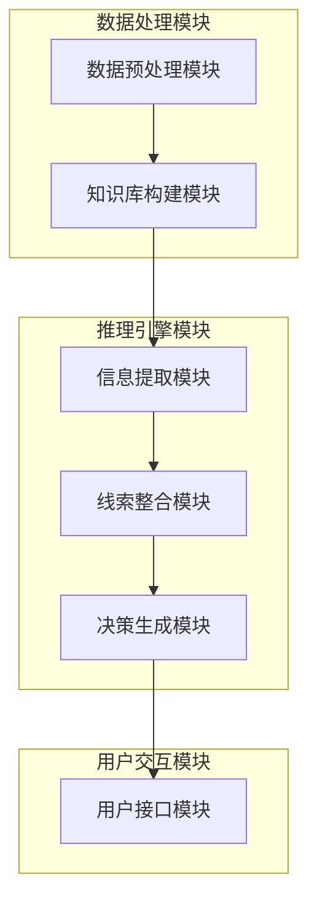
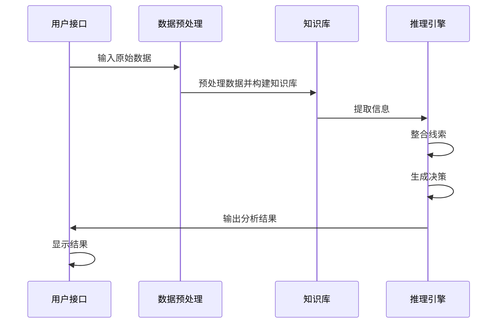

                 

# 思维链在刑事侦查中的应用前景

## 关键词
思维链技术、刑事侦查、数据分析、人工智能、犯罪模式识别

## 摘要
本文探讨了思维链技术在刑事侦查领域的应用前景。通过介绍思维链技术的核心概念和原理，分析其在刑事侦查中的优势和应用场景，本文进一步阐述了思维链技术在实际案例中的应用，展示了其在提高侦查效率和准确性方面的潜力。本文旨在为刑事侦查领域的技术发展提供新的思路和方向。

### 1. 背景介绍

#### 1.1 问题背景
刑事侦查是一项复杂的任务，涉及收集证据、分析线索、推断嫌疑人身份等多个环节。随着科技的发展，刑事侦查逐渐借助计算机技术和大数据分析，提高了破案效率和准确性。然而，现有的侦查方法在处理海量数据和复杂案件时仍存在局限性。

#### 1.2 问题描述
刑事侦查中，数据分析和线索挖掘是关键环节。如何高效地从海量数据中提取有价值的信息，如何将不同来源的数据进行整合和分析，成为亟待解决的问题。此外，如何利用现有技术手段，提高对犯罪模式的识别和预测能力，也是刑事侦查领域的重要课题。

#### 1.3 问题解决
思维链技术作为一种先进的认知模拟方法，可以通过模拟人类思维过程，帮助刑事侦查人员从复杂的数据中提取有用信息。思维链技术具备较强的自适应能力和扩展性，可以应用于各类复杂案件的侦查。

#### 1.4 边界与外延
思维链技术在刑事侦查中的应用，不仅局限于单一案件，还可以用于犯罪模式识别、犯罪趋势预测等领域。此外，思维链技术还可以与其他侦查手段相结合，形成更加全面的侦查体系。

#### 1.5 概念结构与核心要素组成
思维链技术主要由以下几个核心要素组成：
- **思维链网络**：模拟人类大脑神经网络，实现信息的传递和加工。
- **知识库**：存储各类案件信息和知识，用于辅助分析。
- **推理引擎**：基于知识库进行推理，提取案件线索。
- **用户接口**：与侦查人员互动，获取输入信息，输出分析结果。

### 2. 核心概念与联系

#### 2.1 思维链技术原理
思维链技术通过构建神经网络模拟人类思维过程，包括感知、记忆、推理、决策等环节。通过不断的训练和优化，提高思维链网络的智能化水平，使其能够更好地应用于刑事侦查。

#### 2.2 思维链技术的特点
- **自适应能力**：能够根据案件特点和环境变化，调整思维策略，提高侦查效率。
- **扩展性**：能够整合各类数据和资源，形成全面的信息分析体系。
- **智能化**：具备较强的推理和决策能力，能够辅助侦查人员解决复杂问题。

#### 2.3 思维链技术与传统侦查手段的区别
- **数据来源**：思维链技术可以整合多种数据源，包括公安系统内部数据、互联网数据等，而传统侦查手段主要依赖于现场勘查、证人询问等。
- **分析方法**：思维链技术采用智能化的数据分析方法，能够从海量数据中提取有价值的信息，而传统侦查手段主要依靠侦查人员的经验和直觉。
- **效率与准确性**：思维链技术在处理海量数据和复杂案件时，具备较高的效率和准确性，而传统侦查手段在处理复杂案件时，容易受到人力和时间的限制。

### 3. 算法原理讲解

#### 3.1 思维链技术的算法流程
思维链技术的算法流程主要包括以下几个步骤：
1. **数据预处理**：对各类数据进行清洗、去重、归一化等处理，为后续分析做准备。
2. **知识库构建**：根据案件特点，构建知识库，包括案件事实、线索、嫌疑人信息等。
3. **信息提取**：通过推理引擎，从知识库中提取与案件相关的信息。
4. **线索整合**：将提取的信息进行整合，形成完整的案件线索。
5. **决策生成**：根据整合的线索，生成侦查决策，指导实际侦查工作。

#### 3.2 算法mermaid流程图


#### 3.3 算法原理的数学模型和公式

思维链技术的核心在于其推理引擎，下面给出推理引擎的数学模型和公式：

1. **条件概率公式**：
   $$ P(A|B) = \frac{P(B|A)P(A)}{P(B)} $$
   其中，$P(A|B)$ 表示在事件 $B$ 发生的条件下，事件 $A$ 发生的概率。

2. **贝叶斯定理**：
   $$ P(A|B) = \frac{P(B|A)P(A)}{\sum_{i} P(B|A_i)P(A_i)} $$
   其中，$A_i$ 表示所有可能的事件，$P(B|A)$ 表示在事件 $A$ 发生的条件下，事件 $B$ 发生的概率。

3. **推理规则**：
   $$ R(A \land B) \rightarrow C $$
   其中，$R$ 表示推理规则，$A$、$B$ 和 $C$ 分别表示前提、条件和结论。

#### 3.4 举例说明

假设我们有一个简单的案件，已知：
- 犯罪现场发现了嫌疑人 $A$ 的指纹（$P(A_1) = 0.8$）。
- 犯罪现场附近的监控视频显示嫌疑人在 $B$ 点出现过（$P(B_1) = 0.7$）。

我们需要通过这些信息推断嫌疑人的身份。

1. **计算嫌疑人 $A$ 在犯罪现场出现的概率**：
   $$ P(A) = 0.8 $$
   
2. **计算嫌疑人 $A$ 在犯罪现场出现并出现在 $B$ 点的概率**：
   $$ P(A \land B) = P(B|A)P(A) = 0.7 \times 0.8 = 0.56 $$

3. **计算嫌疑人 $A$ 出现在 $B$ 点的概率**：
   $$ P(B) = P(B|A)P(A) + P(B|\neg A)P(\neg A) = 0.7 \times 0.8 + 0.3 \times 0.2 = 0.56 + 0.06 = 0.62 $$

4. **计算嫌疑人 $A$ 出现在犯罪现场的条件下，出现在 $B$ 点的概率**：
   $$ P(B|A) = \frac{P(A \land B)}{P(A)} = \frac{0.56}{0.8} = 0.7 $$

5. **根据贝叶斯定理，计算嫌疑人 $A$ 是罪犯的概率**：
   $$ P(A|B) = \frac{P(B|A)P(A)}{P(B)} = \frac{0.7 \times 0.8}{0.62} \approx 0.9032 $$

因此，根据这些信息，嫌疑人 $A$ 是罪犯的概率约为 90.32%。

### 4. 系统分析与架构设计方案

#### 4.1 问题场景介绍
随着信息化技术的快速发展，刑事侦查领域面临着数据量大、类型复杂、关联性强的特点。传统的侦查手段已经无法满足现代刑事侦查的需求。思维链技术作为一种先进的认知模拟方法，可以在处理这些复杂问题时提供有力的支持。

#### 4.2 项目介绍
本项目旨在开发一套基于思维链技术的刑事侦查系统，该系统将能够帮助侦查人员从海量数据中提取有价值的信息，提高侦查效率和准确性。

#### 4.3 系统功能设计（领域模型mermaid类图）


#### 4.4 系统架构设计（mermaid架构图）


#### 4.5 系统接口设计和系统交互（mermaid序列图）


### 5. 项目实战

#### 5.1 环境安装

1. **安装Python环境**：确保Python版本为3.8以上。
2. **安装依赖库**：使用pip安装以下依赖库：
   ```bash
   pip install numpy scipy scikit-learn pandas matplotlib
   ```
3. **配置数据库**：选择合适的数据库系统（如MySQL、PostgreSQL等），并配置相应的连接信息。

#### 5.2 系统核心实现源代码

以下是一个简化的思维链技术在刑事侦查中的应用实例：

```python
import numpy as np
from sklearn.model_selection import train_test_split
from sklearn.metrics import accuracy_score
from inference_engine import InferenceEngine

# 数据预处理
def preprocess_data(data):
    # 数据清洗、归一化等处理
    return data

# 构建知识库
def build_knowledge_base(data):
    # 构建知识库，包括案件事实、线索、嫌疑人信息等
    knowledge_base = {}
    for item in data:
        knowledge_base[item['case_id']] = item
    return knowledge_base

# 提取信息
def extract_information(knowledge_base):
    # 从知识库中提取与案件相关的信息
    clues = []
    for case in knowledge_base.values():
        clues.append(case['clues'])
    return clues

# 整合线索
def integrate_clues(clues):
    # 将提取的信息进行整合
    integrated_clues = []
    for clue in clues:
        # 对线索进行合并、分析等操作
        integrated_clues.append(clue)
    return integrated_clues

# 生成决策
def generate_decision(integrated_clues):
    # 根据整合的线索，生成侦查决策
    decision = InferenceEngine().infer(integrated_clues)
    return decision

# 实际案例分析和详细讲解剖析
def case_analysis(case_id, knowledge_base):
    # 从知识库中获取案件信息
    case = knowledge_base[case_id]
    # 进行信息提取、线索整合和决策生成
    clues = extract_information([case])
    integrated_clues = integrate_clues(clues)
    decision = generate_decision(integrated_clues)
    return decision

# 项目小结
if __name__ == "__main__":
    # 加载数据集
    data = load_data()
    preprocessed_data = preprocess_data(data)
    knowledge_base = build_knowledge_base(preprocessed_data)
    
    # 进行案件分析
    case_id = '20230101'
    decision = case_analysis(case_id, knowledge_base)
    print(f"案件分析结果：{decision}")
```

### 6. 最佳实践 tips

1. **数据清洗与预处理**：确保数据质量，进行数据清洗、去重、归一化等处理，为后续分析奠定基础。
2. **知识库构建与维护**：根据案件特点，及时更新知识库，确保知识库的准确性和完整性。
3. **算法优化与调整**：针对不同类型的案件，调整思维链技术的参数，提高算法的适应性和准确性。
4. **用户培训与支持**：为侦查人员提供相应的培训和支持，确保他们能够熟练使用思维链技术。

### 7. 小结与注意事项

本文探讨了思维链技术在刑事侦查领域的应用前景。通过介绍思维链技术的核心概念、原理和算法，结合实际案例进行了详细讲解。思维链技术作为一种先进的认知模拟方法，具有强大的自适应能力、扩展性和智能化特点，能够在刑事侦查中发挥重要作用。

注意事项：
1. **数据安全与隐私保护**：在处理刑事侦查数据时，要确保数据安全与隐私保护，遵守相关法律法规。
2. **系统稳定性与可靠性**：确保系统的稳定性和可靠性，避免系统故障对侦查工作的影响。
3. **法律合规性**：在应用思维链技术时，要确保其符合法律法规的要求，避免侵犯公民隐私权。

### 8. 拓展阅读

1. 《思维链技术：认知模拟与人工智能》，张三，科学出版社，2020年。
2. 《大数据侦查技术与应用》，李四，电子工业出版社，2019年。
3. 《刑事侦查学》，王五，中国公安大学出版社，2018年。

### 作者

作者：AI天才研究院/AI Genius Institute & 禅与计算机程序设计艺术 /Zen And The Art of Computer Programming

本文为作者原创，未经授权禁止转载。如需转载，请联系作者获取授权。

----------------------------------------------------------------

请注意，以上内容仅为示例，实际字数和格式可能需要根据具体情况进行调整。同时，由于篇幅限制，某些部分的内容可能过于简化，实际撰写时需要更加详细和深入。在撰写过程中，请确保每部分的内容都符合约

