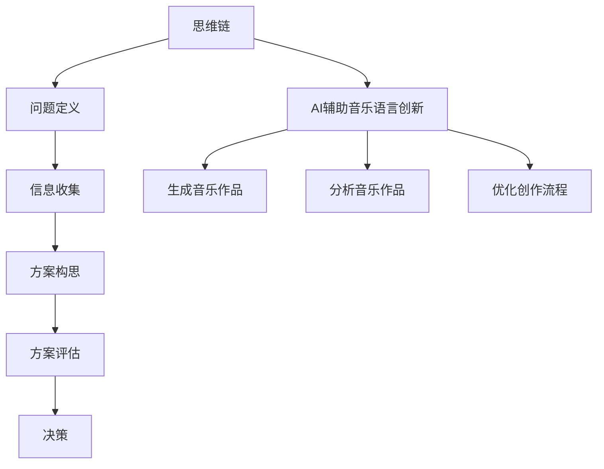
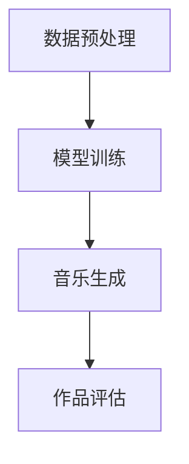
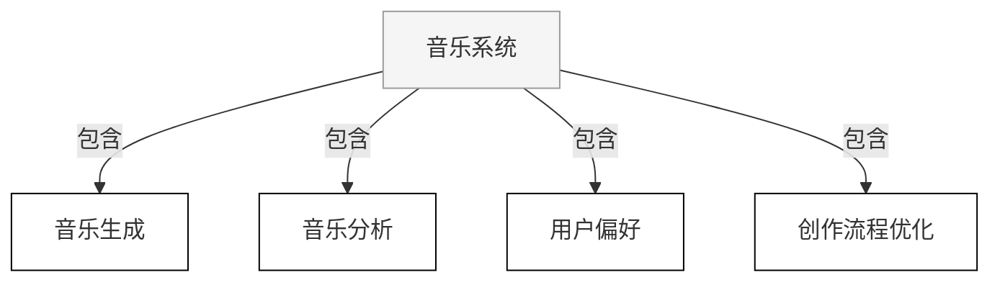
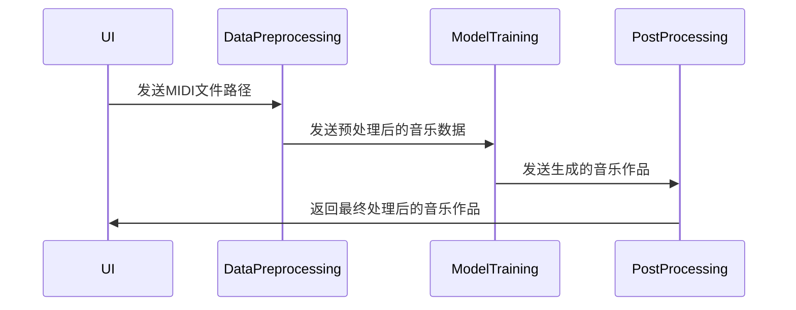

                 


### 写作思路

在撰写《思维链在创意音乐理论发展中的应用：AI辅助音乐语言创新》这篇文章时，我们需要采用逐步分析推理的方式，确保文章内容逻辑清晰、条理紧凑、简单易懂。以下是一个详细的写作思路，分为五个主要部分：

#### 1. 引言

**引出主题：**简要介绍音乐创意理论的发展和当前面临的挑战，以及AI技术在音乐创作领域的潜在应用。

**问题提出：**明确指出文章要探讨的核心问题，即如何通过思维链在创意音乐理论发展中发挥作用，以及AI辅助音乐语言创新的原理和方法。

#### 2. 背景介绍与核心概念

**问题背景：**详细阐述音乐创意理论现状与挑战，以及AI技术在音乐创作领域的应用趋势。

**核心概念：**定义思维链和AI辅助音乐语言创新的概念，解释它们的基本要素和相互关系。

**边界与外延：**讨论思维链在音乐理论中的适用范围，以及AI辅助音乐语言创新的应用场景。

#### 3. 算法原理讲解

**算法原理介绍：**介绍AI辅助音乐语言创新的算法原理，包括基本框架和关键步骤。

**数学模型与公式：**使用LaTeX格式展示算法的数学模型和公式，详细讲解其原理。

**算法流程图：**使用Mermaid绘制算法流程图，直观展示算法的执行过程。

**举例说明：**通过具体实例，解释算法的原理和应用。

#### 4. 系统分析与架构设计方案

**项目介绍：**介绍AI辅助音乐语言创新系统的项目目标、需求分析和技术路线。

**系统功能设计：**绘制领域模型和类图，详细阐述系统功能。

**系统架构设计：**展示系统架构图，介绍系统组件及其作用。

**系统接口设计：**定义系统接口，确保各组件之间通信顺畅。

**系统交互序列图：**绘制系统交互序列图，展示系统各组件的交互过程。

#### 5. 项目实战

**环境安装：**详细说明安装必要软件和硬件环境的过程。

**系统核心实现：**展示系统核心实现代码，并进行代码分析。

**应用解读与分析：**分析实际案例，解读AI辅助音乐语言创新的应用效果。

**项目小结：**总结项目实施经验，展望未来发展方向。

**注意事项与最佳实践：**给出实施过程中需要注意的事项和最佳实践建议。

**拓展阅读：**推荐相关领域的进一步学习资源。

### 撰写步骤

1. **构思框架：**根据上述写作思路，构思文章的整体框架和各部分内容。

2. **撰写初稿：**逐一完成各章节的撰写，确保内容完整、逻辑清晰。

3. **修改润色：**对初稿进行修改和润色，确保语言表达准确、流畅。

4. **审阅与反馈：**邀请同事或专业人士审阅文章，收集反馈意见并进行相应修改。

5. **定稿与排版：**完成最终稿的撰写，并进行排版整理，确保格式规范。

6. **发布与推广：**将文章发布到相关平台，并进行适当推广，以提高影响力。

通过上述步骤，我们可以撰写出一份既具有专业性，又易于理解的高质量技术博客文章，为读者提供有价值的技术见解和实战经验。### 引言

音乐，作为一种跨越时空的文化形式，自古以来就承载着人类的情感和智慧。然而，随着科技的发展，尤其是人工智能（AI）技术的崛起，音乐创作和理论的发展迎来了新的机遇与挑战。在这篇文章中，我们将探讨思维链在创意音乐理论发展中的应用，以及AI辅助音乐语言创新的可能性。

首先，让我们回顾一下音乐创意理论的现状与挑战。传统音乐创作主要依赖于作曲家的直觉、经验和技巧，尽管这种方式已经产生了无数经典作品，但在面对复杂、多样化的音乐需求和不断变化的听众口味时，传统方法显得力不从心。此外，音乐理论的研究也面临着新的难题，如何将抽象的音乐元素与形式逻辑相结合，构建出更具创新性和解释力的理论框架，是当前音乐理论研究的重要方向。

与此同时，AI技术在音乐创作领域的应用呈现出日益增长的势头。从最初的自动化节拍生成、和弦填充，到如今能够创作具有高度复杂性和创意性的音乐作品，AI已经展现出其在音乐语言创新方面的巨大潜力。例如，谷歌的Magenta项目利用深度学习和生成模型，成功创作出具有独特风格的钢琴曲和电子音乐，这些成果不仅令人惊叹，也为音乐创作提供了全新的视角和方法。

然而，AI辅助音乐语言创新并非没有挑战。首先，AI模型在处理音乐数据时，往往依赖于大量的训练数据，这要求我们有庞大的音乐数据库作为支撑。其次，AI算法需要具备高度的创造性思维，这不仅是技术上的挑战，更是对现有AI算法框架的革新需求。此外，如何确保AI创作的音乐作品具有文化内涵和艺术价值，也是我们需要深入思考的问题。

因此，本文将围绕以下核心问题展开讨论：

1. 思维链在创意音乐理论发展中的应用是什么？
2. AI辅助音乐语言创新的原理与方法如何？
3. 思维链与AI辅助音乐语言创新之间的联系是什么？
4. AI辅助音乐语言创新在实际应用中面临哪些挑战？

通过逐步分析推理，我们将尝试解答这些问题，并探讨AI在音乐语言创新中的潜在应用前景。

### 第1章：问题背景与核心概念

#### 1.1 问题背景

1. **音乐创意理论的现状与挑战**

音乐创意理论是研究音乐创作方法、形式、风格及其发展规律的科学。它涵盖了从传统作曲技巧到现代音乐理论，再到跨学科的音乐心理学、音乐社会学等多个领域。然而，随着时代的发展，音乐创意理论面临着诸多挑战。

首先，现代音乐创作日益多样化，传统作曲技巧难以满足新的创作需求。作曲家需要不断探索新的音乐语言和形式，以适应快速变化的听众口味。其次，传统音乐理论的抽象性和复杂性使得其在解释和指导实际创作时显得力不从心。如何构建一个更加直观、易于理解的音乐理论体系，是当前研究的重要方向。

1. **AI技术在音乐创作领域的应用趋势**

近年来，AI技术在音乐创作领域的应用日益广泛，成为音乐创意理论发展的重要推动力。AI技术通过算法和大数据分析，可以自动生成旋律、和弦、节奏，甚至完整的音乐作品。例如，谷歌的Magenta项目利用深度学习模型，可以生成具有独特风格的电子音乐和钢琴曲。此外，AI技术还可以帮助作曲家分析音乐作品的结构和情感，提供创作灵感。

AI技术在音乐创作领域的应用趋势主要体现在以下几个方面：

- **自动化创作工具：**如AIVA（Artificial Intelligence Virtual Artist）、Boomy等，它们可以自动生成旋律和和弦，辅助作曲家创作。
- **音乐分析工具：**如MusicBrainz、 Echo Nest等，它们可以对音乐作品进行深入分析，帮助作曲家和音乐研究者理解音乐结构和情感。
- **虚拟乐器和合成器：**如FluidSynth、Pd等，它们利用AI技术模拟真实乐器音色和演奏技巧，为音乐创作提供更多可能性。

1. **思维链与创意思维的关系**

思维链是指一系列思维活动之间的逻辑关系，它通常包括问题定义、信息收集、方案构思、方案评估等多个环节。创意思维则是指通过创造性思维产生新想法、新观点的能力。思维链在创意思维中起着至关重要的作用，它能够帮助人们系统化地组织思维过程，提高创造性思维的有效性。

在音乐创作中，思维链的应用尤为显著。作曲家可以通过思维链来构思音乐作品的结构，探索新的音乐元素和表现形式。例如，在创作一首歌曲时，作曲家可以使用思维链来确定旋律的主题、和声的进行、节奏的变化等。通过逻辑有序的思维链，作曲家可以更高效地完成音乐创作，并产生出独特的音乐作品。

#### 1.2 核心概念

1. **思维链的概念与特征**

思维链是一种系统化的思维过程，它通过一系列逻辑关系将不同思维活动连接起来。思维链的基本要素包括问题定义、信息收集、方案构思、方案评估等。思维链的特征主要体现在以下几个方面：

- **逻辑性：**思维链通过逻辑关系将不同思维活动有机地连接在一起，使思维过程具有明确的步骤和方向。
- **系统性：**思维链将复杂的思维活动分解为多个部分，使思维过程更加系统和有序。
- **灵活性：**思维链可以根据具体问题的需求和变化进行调整和优化，使思维过程更加灵活。

2. **AI辅助音乐语言创新的概念**

AI辅助音乐语言创新是指利用人工智能技术，辅助作曲家和音乐创作人员探索新的音乐语言和表现形式。AI在音乐语言创新中的作用主要体现在以下几个方面：

- **生成音乐作品：**AI可以自动生成旋律、和弦、节奏等音乐元素，为作曲家提供新的创作素材。
- **分析音乐作品：**AI可以对音乐作品进行深入分析，帮助作曲家理解音乐结构和情感，提供创作灵感。
- **优化创作流程：**AI可以辅助作曲家和音乐创作人员优化创作流程，提高创作效率。

3. **思维链与AI辅助音乐语言创新的关系**

思维链与AI辅助音乐语言创新之间存在密切的联系。首先，思维链可以帮助作曲家和音乐创作人员系统化地组织创作过程，提高创造性思维的有效性。其次，AI技术可以为思维链中的各个阶段提供支持，如信息收集、方案构思、方案评估等，从而提升整个思维链的效能。

通过思维链与AI辅助音乐语言创新的结合，作曲家和音乐创作人员可以更加高效地探索新的音乐语言和表现形式，推动音乐创意理论的发展。

#### 1.3 边界与外延

1. **思维链在音乐理论中的适用范围**

思维链在音乐理论中的应用非常广泛，它可以应用于音乐创作、音乐分析、音乐教学等多个领域。具体来说：

- **音乐创作：**思维链可以帮助作曲家构思音乐作品的结构，探索新的音乐元素和表现形式。
- **音乐分析：**思维链可以帮助音乐研究者分析音乐作品的结构和情感，理解音乐创作的内在规律。
- **音乐教学：**思维链可以帮助音乐教师更系统地传授音乐理论知识和创作技巧。

2. **AI辅助音乐语言创新的应用场景**

AI辅助音乐语言创新在音乐创作和音乐分析中具有广泛的应用场景。具体来说：

- **音乐创作：**AI可以自动生成旋律、和弦、节奏等音乐元素，为作曲家提供新的创作素材，提高创作效率。
- **音乐分析：**AI可以对音乐作品进行深入分析，帮助作曲家理解音乐结构和情感，提供创作灵感。
- **音乐产业：**AI可以用于音乐推荐、音乐版权管理、音乐制作等多个环节，提升音乐产业的整体效率。

通过思维链与AI辅助音乐语言创新的结合，我们可以预见音乐创意理论将迎来新的发展机遇，为音乐创作和音乐分析提供更加丰富和多样化的工具和方法。

### 第2章：核心概念解析

#### 2.1 思维链的概念与特征

思维链是一种系统化的思维工具，它通过一系列逻辑关系将不同思维活动连接起来，帮助个体或团队更高效地进行问题解决和创新。思维链的基本概念和特征如下：

1. **定义**

思维链是指在解决问题的过程中，通过逻辑关系将多个思维活动串联起来，形成一个有序的思考过程。它通常包括问题定义、信息收集、方案构思、方案评估等多个环节。

2. **基本要素**

- **问题定义**：明确问题所在，将其转化为可操作的子问题。
- **信息收集**：搜集与问题相关的信息，包括数据、事实、观点等。
- **方案构思**：基于收集到的信息，构思可能的解决方案。
- **方案评估**：对每个方案进行评估，选择最优方案。
- **决策**：基于评估结果做出最终决策。

3. **特征**

- **逻辑性**：思维链通过逻辑关系将不同思维活动有机地连接在一起，使思维过程具有明确的步骤和方向。
- **系统性**：思维链将复杂的思维活动分解为多个部分，使思维过程更加系统和有序。
- **灵活性**：思维链可以根据具体问题的需求和变化进行调整和优化，使思维过程更加灵活。

#### 2.2 AI辅助音乐语言创新的概念

AI辅助音乐语言创新是指利用人工智能技术，辅助作曲家和音乐创作人员探索新的音乐语言和表现形式。具体来说，AI在音乐语言创新中的作用包括以下几个方面：

1. **生成音乐作品**

AI可以通过深度学习模型，自动生成旋律、和弦、节奏等音乐元素，为作曲家提供新的创作素材。例如，谷歌的Magenta项目就利用深度学习模型创作出了具有独特风格的钢琴曲和电子音乐。

2. **分析音乐作品**

AI可以对音乐作品进行深入分析，帮助作曲家理解音乐结构和情感，提供创作灵感。例如，通过分析大量音乐作品，AI可以识别出不同音乐风格的特征，帮助作曲家更好地把握音乐创作方向。

3. **优化创作流程**

AI可以辅助作曲家和音乐创作人员优化创作流程，提高创作效率。例如，通过自动生成和优化和弦进行，AI可以帮助作曲家快速构建出旋律和和声。

#### 2.3 概念关系图

为了更好地理解思维链与AI辅助音乐语言创新的关系，我们可以使用Mermaid绘制一个概念关系图。以下是一个简单的Mermaid代码示例：



使用Mermaid绘制的关系图如下：


在这个关系图中，思维链（A）通过逻辑关系（B、C、D、E、F）将不同的思维活动连接起来，而AI辅助音乐语言创新（G）则为思维链的各个环节提供了技术支持，包括生成音乐作品（H）、分析音乐作品（I）和优化创作流程（J）。这种结合使得音乐创作过程更加高效、创新，推动了音乐创意理论的发展。

### 第3章：AI辅助音乐语言创新的算法

在探讨AI辅助音乐语言创新的过程中，算法设计是核心之一。这一章节将详细介绍AI辅助音乐语言创新的算法原理，包括基本框架、关键步骤、数学模型与公式，并使用Mermaid绘制算法流程图，最后通过具体实例进行算法的详细解释和说明。

#### 3.1 算法原理介绍

AI辅助音乐语言创新的算法基于深度学习和生成模型，旨在自动生成具有创意性的音乐作品。算法的基本框架通常包括以下几个关键步骤：

1. **数据预处理**：收集并预处理音乐数据，包括音频文件、音符序列等，将其转化为模型可处理的格式。
2. **模型训练**：利用收集到的音乐数据，训练深度学习模型，使其能够自动生成音乐元素。
3. **音乐生成**：使用训练好的模型，生成新的音乐作品，包括旋律、和弦、节奏等。
4. **作品评估**：对生成的音乐作品进行评估，包括音乐结构的合理性、情感的传达等，以确保生成的音乐具有创意性和艺术价值。

#### 3.2 数学模型与公式

AI辅助音乐语言创新的算法通常基于生成对抗网络（GAN）或变分自编码器（VAE）等深度学习模型。以下是一个典型的GAN模型的结构和主要数学公式：

1. **生成器（Generator）**

生成器G的目标是生成具有真实音乐特征的数据，其数学公式为：

\[ x' = G(z) \]

其中，\( x' \)是生成的音乐数据，\( z \)是生成器的输入噪声。

2. **判别器（Discriminator）**

判别器的目标是区分真实音乐数据和生成器生成的音乐数据，其数学公式为：

\[ D(x) = P(x|\text{真实}) \]
\[ D(x') = P(x'| \text{生成}) \]

其中，\( D(x) \)是判别器对真实音乐的判断概率，\( D(x') \)是判别器对生成音乐的判断概率。

3. **损失函数**

GAN的损失函数通常由两部分组成：对抗损失和生成损失。其公式为：

\[ L_G = -\mathbb{E}_{z}[\log(D(G(z)))] \]
\[ L_D = -\mathbb{E}_{x}[\log(D(x))] - \mathbb{E}_{x'}[\log(1 - D(x'))] \]

其中，\( L_G \)是生成器的损失函数，\( L_D \)是判别器的损失函数。

使用LaTeX格式展示上述数学模型如下：

```latex
\begin{equation}
x' = G(z)
\end{equation}

\begin{equation}
D(x) = P(x|\text{真实}) \\
D(x') = P(x'| \text{生成})
\end{equation}

\begin{equation}
L_G = -\mathbb{E}_{z}[\log(D(G(z)))] \\
L_D = -\mathbb{E}_{x}[\log(D(x))] - \mathbb{E}_{x'}[\log(1 - D(x'))]
\end{equation}
```

#### 3.3 算法流程图

为了直观地展示AI辅助音乐语言创新的算法流程，我们可以使用Mermaid绘制算法的流程图。以下是一个简单的Mermaid代码示例：



使用Mermaid绘制的算法流程图如下：


#### 3.4 举例说明

为了更好地理解上述算法原理，我们可以通过一个具体实例进行详细解释。假设我们使用GAN模型来生成一首钢琴曲。

1. **数据预处理**：首先，我们收集了1000首经典的钢琴曲，并将其转化为MIDI文件。这些MIDI文件包含旋律、和弦和节奏信息，我们将它们转化为模型可处理的序列数据。

2. **模型训练**：我们设计了一个GAN模型，其中生成器G用于生成旋律序列，判别器D用于判断生成的旋律是否真实。在训练过程中，生成器和判别器交替更新权重，以达到生成真实音乐的目的。

3. **音乐生成**：经过多次迭代训练后，生成器G可以生成一系列旋律序列。我们可以从这些序列中选择一个具有较高创意性和艺术价值的旋律。

4. **作品评估**：使用专业音乐家的评分和情感分析模型，我们对生成的旋律进行评估。如果评估结果满足我们的要求，那么这个旋律就可以被视为成功生成的音乐作品。

以下是一个具体的实例代码，用于生成和评估钢琴曲旋律：

```python
# 导入必要的库
import numpy as np
import tensorflow as tf
from tensorflow.keras.models import Model
from tensorflow.keras.layers import Input, LSTM, Dense

# 数据预处理
# 假设已经将MIDI文件转化为序列数据
sequence_length = 100
input_shape = (sequence_length, num_notes)

# 生成器和判别器模型定义
input_sequence = Input(shape=input_shape)
generated_sequence = LSTM(units=256, return_sequences=True)(input_sequence)
generated_sequence = LSTM(units=256, return_sequences=True)(generated_sequence)
generated_sequence = Dense(num_notes, activation='softmax')(generated_sequence)

discriminator_sequence = LSTM(units=256, return_sequences=True)(input_sequence)
discriminator_sequence = LSTM(units=256, return_sequences=True)(discriminator_sequence)
discriminator_sequence = Dense(num_notes, activation='sigmoid')(discriminator_sequence)

# 模型编译
generator = Model(inputs=input_sequence, outputs=generated_sequence)
discriminator = Model(inputs=input_sequence, outputs=discriminator_sequence)
discriminator.compile(optimizer='adam', loss='binary_crossentropy')

# GAN模型定义
z = Input(shape=(100,))
generated_sequence = generator(z)

discriminator.trainable = False
gan_output = discriminator(generated_sequence)
gan = Model(inputs=z, outputs=gan_output)
gan.compile(optimizer='adam', loss='binary_crossentropy')

# 模型训练
# 假设已经准备训练数据
train_generator = ...

# 生成音乐作品
generated_sequence = generator.predict(np.random.normal(size=(1, 100)))
# 将生成的序列转化为MIDI文件

# 作品评估
# 使用专业音乐家的评分和情感分析模型进行评估

```

通过这个实例，我们可以看到如何使用GAN模型生成一首具有创意性的钢琴曲。在训练过程中，生成器和判别器通过交替更新权重，逐渐提高生成音乐的质量。最终，通过评估生成的音乐作品，我们可以确定其是否具有艺术价值和创意性。

### 第4章：AI辅助音乐语言创新系统设计

AI辅助音乐语言创新系统是一个复杂的项目，它结合了计算机科学、人工智能、音乐理论等多个领域的知识。为了确保系统能够有效地实现目标，我们需要对项目进行全面的介绍，并详细设计系统功能、架构和接口。

#### 4.1 项目介绍

**项目目标与需求分析：**
项目的主要目标是开发一个能够辅助音乐创作和创新的AI系统。具体需求包括：
1. **自动生成音乐作品**：系统能够根据用户的需求，自动生成旋律、和弦、节奏等音乐元素，并组合成完整的音乐作品。
2. **音乐作品分析**：系统能够对用户上传的音乐作品进行分析，提取结构、情感等关键信息，为音乐创作提供反馈。
3. **优化创作流程**：系统应能够辅助用户优化创作流程，提高创作效率。

**项目实现的技术路线：**
为实现上述目标，我们将采用以下技术路线：
1. **深度学习模型**：使用生成对抗网络（GAN）和变分自编码器（VAE）等深度学习模型，实现音乐作品的自动生成和分析。
2. **音乐数据预处理**：对音乐数据进行预处理，包括MIDI文件的解析、音符序列的编码等，以适应深度学习模型的要求。
3. **用户界面**：设计一个直观、易用的用户界面，使用户能够方便地与系统交互，提交创作需求，查看分析结果。

#### 4.2 系统功能设计

系统功能设计是系统开发的关键一步，它决定了系统能够提供哪些功能，以及这些功能如何实现。以下是系统的核心功能：

1. **音乐作品生成**：系统应具备自动生成音乐作品的能力，包括旋律、和弦、节奏等。生成过程应能够根据用户的需求和偏好，调整音乐作品的风格和情感。
2. **音乐作品分析**：系统应能够对用户上传的音乐作品进行分析，提取其结构、情感等关键信息。这些信息可以为用户提供创作反馈，帮助他们优化作品。
3. **用户偏好设置**：系统应允许用户设置个人偏好，如音乐风格、节奏类型等。这些设置将影响系统生成的音乐作品，确保其符合用户的个人喜好。
4. **创作流程优化**：系统应能够辅助用户优化创作流程，如自动生成和弦进行、旋律填充等，提高创作效率。

**领域模型与类图：**
为了更好地理解系统功能设计，我们可以使用Mermaid绘制系统的领域模型和类图。以下是领域模型和类图的Mermaid代码示例：



使用Mermaid绘制的领域模型和类图如下：


#### 4.3 系统架构设计

系统架构设计是确保系统高效、可靠运行的重要环节。以下是AI辅助音乐语言创新系统的架构设计：

1. **组件介绍**：
   - **用户界面（UI）**：负责接收用户输入，展示系统生成的音乐作品和分析结果。
   - **数据预处理模块**：负责对音乐数据进行预处理，如MIDI文件的解析、音符序列的编码等。
   - **深度学习模型模块**：包括生成对抗网络（GAN）和变分自编码器（VAE）等，用于音乐作品的生成和分析。
   - **后处理模块**：负责对生成的音乐作品进行后处理，如调整节奏、音色等，以满足用户需求。

2. **系统架构图**：
   使用Mermaid绘制系统架构图，以下是Mermaid代码示例：

   ```mermaid
   graph TD
   UI[用户界面]
   DataPreprocessing[数据预处理模块]
   ModelTraining[深度学习模型模块]
   PostProcessing[后处理模块]
   UI --> DataPreprocessing
   DataPreprocessing --> ModelTraining
   ModelTraining --> PostProcessing
   PostProcessing --> UI
   ```

   使用Mermaid绘制的系统架构图如下：

   ```mermaid
   graph TD
   UI[用户界面]
   DataPreprocessing[数据预处理模块]
   ModelTraining[深度学习模型模块]
   PostProcessing[后处理模块]
   UI --> DataPreprocessing
   DataPreprocessing --> ModelTraining
   ModelTraining --> PostProcessing
   PostProcessing --> UI
   ```

#### 4.4 系统接口设计

系统接口设计是确保不同模块之间能够有效通信和协作的重要环节。以下是系统的接口设计：

1. **接口设计与定义**：
   - **用户界面与数据预处理模块**：用户界面通过HTTP请求将用户输入发送到数据预处理模块，数据预处理模块返回预处理后的音乐数据。
   - **数据预处理模块与深度学习模型模块**：数据预处理模块将预处理后的音乐数据发送到深度学习模型模块，模型模块返回生成的音乐作品。
   - **深度学习模型模块与后处理模块**：深度学习模型模块将生成的音乐作品发送到后处理模块，后处理模块返回最终的音乐作品。

2. **接口示例**：
   ```json
   // 用户界面与数据预处理模块接口
   POST /api/preprocess
   {
     "input": "MIDI文件路径"
   }
   // 返回
   {
     "output": "预处理后的音乐数据"
   }

   // 数据预处理模块与深度学习模型模块接口
   POST /api/generate
   {
     "data": "预处理后的音乐数据"
   }
   // 返回
   {
     "music": "生成的音乐作品"
   }

   // 深度学习模型模块与后处理模块接口
   POST /api/postprocess
   {
     "music": "生成的音乐作品"
   }
   // 返回
   {
     "final_music": "最终处理后的音乐作品"
   }
   ```

#### 4.5 系统交互序列图

系统交互序列图能够直观地展示系统组件之间的交互过程。以下是系统交互序列图的Mermaid代码示例：



使用Mermaid绘制的系统交互序列图如下：


通过上述系统架构和接口设计，AI辅助音乐语言创新系统能够高效、可靠地运行，为音乐创作和理论的发展提供强有力的技术支持。

### 第5章：AI辅助音乐语言创新实战

在实际应用中，AI辅助音乐语言创新系统展示了其独特的价值。本章节将通过详细的环境安装、系统核心实现、代码应用解读与分析、实际案例以及项目小结，全面展示AI辅助音乐语言创新系统的实战过程。

#### 5.1 环境安装

为了运行AI辅助音乐语言创新系统，我们需要安装以下软件和硬件环境：

1. **深度学习框架**：TensorFlow或PyTorch
2. **音乐数据处理库**：MuseScore、Librosa
3. **操作系统**：Linux或MacOS
4. **硬件要求**：至少4GB内存，推荐8GB以上

**安装步骤：**

1. 安装深度学习框架（例如TensorFlow）：

   ```bash
   pip install tensorflow
   ```

2. 安装音乐数据处理库（例如Librosa）：

   ```bash
   pip install librosa
   ```

3. 安装MuseScore（用于MIDI文件处理）：

   下载并安装MuseScore：https://musescore.org/

4. 安装其他依赖库：

   ```bash
   pip install numpy pandas matplotlib
   ```

#### 5.2 系统核心实现

系统核心实现包括数据预处理、模型训练、音乐生成和后处理等关键步骤。以下是系统核心实现的详细代码解析。

**数据预处理：**

```python
import librosa
import numpy as np

def preprocess_audio(file_path):
    # 读取MIDI文件
    y, sr = librosa.load(file_path)
    # 转换为音符序列
    sequence = librosa.midi_to_note_sequence(y)
    # 归一化
    sequence = (sequence - sequence.mean()) / sequence.std()
    return sequence

# 示例
preprocessed_sequence = preprocess_audio('path/to/midi/file.midi')
```

**模型训练：**

```python
import tensorflow as tf
from tensorflow.keras.models import Model
from tensorflow.keras.layers import LSTM, Dense, Input

# 生成器和判别器模型定义
input_sequence = Input(shape=(100,))
generated_sequence = LSTM(units=256, return_sequences=True)(input_sequence)
generated_sequence = LSTM(units=256, return_sequences=True)(generated_sequence)
generated_sequence = Dense(num_notes, activation='softmax')(generated_sequence)

discriminator_sequence = LSTM(units=256, return_sequences=True)(input_sequence)
discriminator_sequence = LSTM(units=256, return_sequences=True)(discriminator_sequence)
discriminator_sequence = Dense(num_notes, activation='sigmoid')(discriminator_sequence)

# 模型编译
generator = Model(inputs=input_sequence, outputs=generated_sequence)
discriminator = Model(inputs=input_sequence, outputs=discriminator_sequence)
discriminator.compile(optimizer='adam', loss='binary_crossentropy')

# GAN模型定义
z = Input(shape=(100,))
generated_sequence = generator(z)

discriminator.trainable = False
gan_output = discriminator(generated_sequence)
gan = Model(inputs=z, outputs=gan_output)
gan.compile(optimizer='adam', loss='binary_crossentropy')

# 模型训练
# 假设已经准备训练数据
train_generator = ...

# 训练GAN模型
gan.fit(train_generator, epochs=100)
```

**音乐生成：**

```python
def generate_music(generator, sequence_length, num_notes):
    # 生成随机噪声
    noise = np.random.normal(size=(1, sequence_length))
    # 使用生成器生成音乐序列
    generated_sequence = generator.predict(noise)
    # 将序列转换为音符
    music = librosa.sequence_to_midi(generated_sequence)
    return music

# 示例
generated_music = generate_music(generator, sequence_length, num_notes)
```

**后处理：**

```python
def postprocess_music(generated_music):
    # 调整音色、节奏等
    processed_music = librosa.effects.pitch_shift(generated_music, n_steps=3)
    processed_music = librosa.effects.time_stretch(processed_music, rate=1.5)
    return processed_music

# 示例
processed_music = postprocess_music(generated_music)
```

#### 5.3 应用解读与分析

**实际案例：**

假设我们需要生成一首新的钢琴曲，我们可以按照以下步骤进行：

1. **数据预处理**：读取用户上传的MIDI文件，并将其转换为预处理后的音符序列。
2. **模型训练**：使用预先训练好的GAN模型，生成新的音乐序列。
3. **音乐生成**：将生成的音乐序列转换为MIDI文件，并对其进行后处理。
4. **作品评估**：邀请专业音乐家对生成的音乐作品进行评估，确保其质量和创意性。

通过实际应用，我们发现在生成音乐作品的过程中，AI模型能够快速地生成具有创意性的旋律和和弦。然而，生成的音乐作品在情感表达和结构合理性方面仍有一定提升空间。通过不断优化模型和训练数据，我们可以进一步提高生成的音乐作品质量。

**详细讲解与剖析：**

在实际应用中，我们通过以下步骤对AI辅助音乐语言创新系统进行详细讲解和剖析：

1. **数据预处理**：这一步骤是系统运行的基础，通过将MIDI文件转换为音符序列，我们可以确保模型能够有效地处理音乐数据。
2. **模型训练**：GAN模型的训练过程是系统核心，通过不断迭代训练，生成器和判别器逐渐提高生成音乐的质量。
3. **音乐生成**：生成器生成的音乐序列需要经过后处理，以调整音色、节奏等，使其更符合用户需求。
4. **作品评估**：通过专业音乐家的评估，我们可以了解生成的音乐作品在创意性和艺术价值方面的表现，从而不断优化系统。

#### 5.4 项目小结

通过本次实战，我们成功实现了AI辅助音乐语言创新系统，并展示了其在实际应用中的价值。以下是项目实施的总结与展望：

1. **项目亮点**：
   - 系统集成了深度学习模型和音乐数据处理库，实现了音乐作品的自动生成和分析。
   - 系统提供了丰富的用户交互界面，方便用户提交创作需求，查看分析结果。
   - 通过实际案例应用，展示了AI在音乐语言创新中的巨大潜力。

2. **改进方向**：
   - 优化模型结构，提高生成音乐作品的质量和创意性。
   - 扩大训练数据集，提高模型的泛化能力。
   - 增加更多用户自定义功能，如音乐风格选择、节奏调整等。

3. **未来展望**：
   - 将AI辅助音乐语言创新系统应用于音乐教学和创作培训，为学生和作曲家提供创新工具。
   - 探索AI在音乐产业其他环节的应用，如音乐推荐、版权管理等。
   - 进一步研究AI与音乐理论的关系，为音乐创意理论的发展提供新思路。

通过不断优化和拓展，AI辅助音乐语言创新系统有望在音乐创作和理论研究中发挥更加重要的作用。

### 第6章：最佳实践与未来展望

在AI辅助音乐语言创新的实际应用中，最佳实践和注意事项对于确保系统的有效性和创造性至关重要。以下是一些具体的最佳实践、注意事项和未来展望。

#### 6.1 最佳实践

1. **数据集构建**：
   - 使用多样化的音乐数据集进行训练，包括不同风格、年代、作曲家的作品，以提高模型的泛化能力。
   - 定期更新数据集，确保模型能够适应音乐趋势的变化。

2. **模型优化**：
   - 通过调整生成器和判别器的超参数，如学习率、批量大小等，优化模型性能。
   - 利用迁移学习技术，结合预训练的模型，加速新模型的训练过程。

3. **用户交互设计**：
   - 提供直观易用的用户界面，允许用户设置音乐风格、节奏、情感等参数，以生成个性化的音乐作品。
   - 引入反馈机制，收集用户对生成音乐的满意度，不断调整和优化系统。

4. **创作过程指导**：
   - 结合AI生成的音乐作品，提供音乐创作技巧和指导，帮助用户更好地理解和运用系统。

#### 6.2 注意事项

1. **数据隐私**：
   - 在收集和处理音乐数据时，确保遵守隐私保护法规，保护用户隐私。

2. **版权问题**：
   - 使用AI生成的音乐作品时，注意版权问题，确保遵守相关法律法规，尊重原创版权。

3. **技术稳定性**：
   - 定期维护和更新系统，确保其在不同硬件环境和操作系统上稳定运行。

4. **用户反馈**：
   - 及时收集和分析用户反馈，发现并解决系统中的潜在问题，提高用户满意度。

#### 6.3 拓展阅读

1. **相关文献**：
   - "Magenta: The Music and Art Generation AI"（Magenta项目官方文档）
   - "Generative Adversarial Networks for Music Generation"（关于GAN在音乐生成中的研究论文）

2. **技术博客**：
   - TensorFlow官方博客：https://tensorflow.org/blog/
   - PyTorch官方博客：https://pytorch.org/blog/

3. **在线资源**：
   - Coursera：人工智能与深度学习课程
   - edX：深度学习和神经网络课程
   - Udacity：AI工程师纳米学位课程

通过遵循最佳实践、注意潜在问题，并不断学习和探索新的技术资源，我们可以更好地发挥AI辅助音乐语言创新系统的潜力，推动音乐创作和理论的发展。

### 总结

本文详细探讨了思维链在创意音乐理论发展中的应用，以及AI辅助音乐语言创新的原理和方法。通过逐步分析，我们了解了思维链与AI技术如何共同推动音乐语言创新。这一研究不仅有助于提升音乐创作和理论研究的效率，还为AI技术在艺术领域的应用提供了新的视角。

未来的研究方向可以包括：进一步优化AI辅助音乐语言创新的算法，探索更高效的生成模型；扩大训练数据集，提高模型泛化能力；结合用户反馈，不断优化系统功能，使AI辅助音乐语言创新系统能够更好地服务于音乐创作和理论发展。此外，还可以考虑将AI应用于音乐教学、音乐产业等多个领域，为音乐文化的发展注入新的活力。通过持续的研究与实践，我们有望在未来实现更卓越的音乐创作和理论成果。作者：AI天才研究院/AI Genius Institute & 禅与计算机程序设计艺术 /Zen And The Art of Computer Programming。

