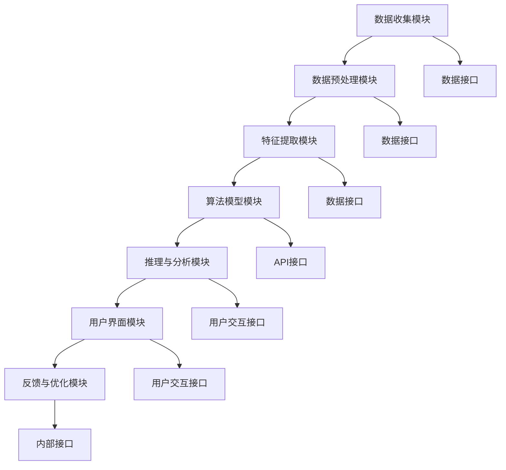

                 

### 1.1.1 创新管理的定义与意义

**创新管理**，是指一个组织或企业通过创造、引入、实施和推广新的想法、产品、服务或业务模式，以实现持续竞争优势和业务增长的过程。具体而言，它涉及从创意生成、评估、筛选、实施到监控和优化的整个生命周期管理。

**创新管理的意义**主要体现在以下几个方面：

1. **提高企业竞争力**：创新管理有助于企业不断推出满足市场需求的新产品和服务，从而提高市场占有率和客户满意度，提升企业的竞争力。

2. **推动企业增长**：通过持续的创新，企业可以拓展新的业务领域，挖掘潜在的市场机会，从而实现业务增长。

3. **提升员工创造力**：创新管理不仅关注外部创新，也注重内部创新文化的培育，鼓励员工提出创新想法，从而激发员工的创造力和积极性。

4. **增强企业适应力**：在快速变化的市场环境中，创新管理有助于企业及时调整战略和业务模式，提高适应市场变化的能力。

5. **塑造品牌形象**：通过创新，企业可以树立积极进取、勇于突破的品牌形象，提高品牌认知度和美誉度。

### 1.1.2 创新管理在全球竞争中的地位

在全球化的经济环境中，创新管理已经成为企业竞争的核心要素。其地位主要体现在以下几个方面：

1. **技术创新驱动发展**：随着科技的快速发展，技术创新成为推动经济增长的重要动力。各国企业纷纷加大在研发和技术创新上的投入，以抢占全球市场的先机。

2. **创新政策支持**：许多国家和地区为了提高国际竞争力，纷纷出台支持创新的政策措施，如税收优惠、研发资金支持、知识产权保护等，为企业创新提供良好的政策环境。

3. **全球创新资源整合**：全球范围内的创新资源整合成为趋势，跨国企业通过全球研发网络和战略联盟，实现技术和市场的协同创新。

4. **创新驱动产业转型**：创新管理不仅涉及高科技行业，还广泛应用于制造业、服务业等传统行业，推动产业转型升级。

### 1.1.3 创新管理的挑战与机遇

在创新管理的过程中，企业面临着诸多挑战和机遇：

1. **技术变革带来的挑战**：技术的快速变革使得企业需要不断调整创新战略，以适应新的技术环境。同时，技术的不确定性也增加了创新的风险。

2. **市场竞争加剧**：全球市场竞争的加剧，要求企业必须具备快速响应市场变化的能力，以保持竞争优势。

3. **资源分配问题**：创新需要大量的资金、人力和时间投入，企业需要在资源有限的条件下进行有效的创新管理。

4. **人才短缺**：创新人才的短缺已经成为全球企业面临的一大挑战，如何吸引、培养和留住创新人才成为企业需要解决的关键问题。

5. **创新成果转化**：将创新理念转化为实际的产品和服务，是企业面临的又一挑战。如何有效地将创新成果转化为市场价值，是企业需要不断探索的课题。

6. **机遇**：技术创新、市场变革和全球化带来的机遇，为企业的创新提供了广阔的空间。通过有效的创新管理，企业可以抓住机遇，实现跨越式发展。

综上所述，创新管理在全球竞争中具有举足轻重的地位，它既是企业应对市场变化的重要手段，也是推动企业持续发展的关键因素。面对挑战与机遇，企业需要运用先进的管理理念和工具，实现创新管理的系统化、科学化和高效化。这将为企业在激烈的市场竞争中赢得一席之地，实现可持续发展。

### 1.2.1 思维链的定义与特征

**思维链**，作为一种系统化的思维模式，是指通过一系列相互关联的思考步骤，将问题拆解为更小的部分，并通过逻辑推理和综合分析，逐步解决复杂问题的过程。它具有以下几个主要特征：

1. **层次性**：思维链将复杂问题分解为多个层次，每个层次包含具体的子问题，从而实现问题的逐步细化。

2. **系统性**：思维链强调各个思考步骤之间的关联和系统性，通过逻辑推理和分析，确保每个步骤都能够相互支撑，形成完整的解决方案。

3. **灵活性**：思维链具有高度的灵活性，可以根据问题的复杂度和变化情况，调整思考的步骤和方法。

4. **综合性**：思维链不仅关注问题的解决，还注重多个维度的分析和综合，确保解决方案的全面性和有效性。

5. **创新性**：思维链鼓励创新思维，通过不同的视角和思路，寻求解决问题的多样化方案。

### 1.2.2 思维链与创新管理的关系

**思维链**在**创新管理**中具有重要的应用价值，两者之间存在密切的关系：

1. **创新思维工具**：思维链提供了一种系统化的思维工具，帮助企业和管理者更好地分析和解决创新过程中遇到的问题。

2. **提高创新能力**：通过思维链的层次性和系统性，企业可以更好地组织和引导创新活动，提高创新能力。

3. **优化创新流程**：思维链的灵活性和综合性，有助于企业优化创新流程，提高创新效率。

4. **促进知识共享**：思维链鼓励团队成员之间的交流和协作，促进知识共享，增强团队的创新合力。

5. **应对复杂问题**：面对复杂多变的市场环境，思维链可以帮助企业更好地应对各种创新挑战，确保创新目标的实现。

### 1.2.3 思维链的应用场景

思维链在创新管理中的应用场景非常广泛，主要包括以下几个方面：

1. **创意生成**：思维链可以帮助企业组织创意生成活动，通过系统化的思考步骤，挖掘潜在的创新点。

2. **创意筛选**：在大量的创意中，思维链可以帮助企业进行有效的筛选，评估创意的可行性和价值。

3. **产品开发**：在产品开发过程中，思维链可以帮助团队梳理产品需求，设计产品功能，优化产品设计。

4. **战略规划**：在制定企业战略规划时，思维链可以帮助企业分析市场趋势，评估战略风险，制定科学的战略方案。

5. **项目管理**：在项目管理过程中，思维链可以帮助团队制定项目计划，监控项目进度，确保项目目标的实现。

6. **知识管理**：在知识管理过程中，思维链可以帮助企业整理和分类知识，构建知识管理体系。

7. **创新文化建设**：在创新文化建设中，思维链可以帮助企业培养创新思维，塑造创新文化。

### 1.3.1 AI技术概述

人工智能（AI）作为当代最具革命性的技术之一，其发展历程可以追溯到20世纪50年代。从最初的符号主义、知识表示到现代的深度学习和强化学习，AI经历了多个发展阶段，每个阶段都有其独特的里程碑和关键突破。

1. **符号主义阶段**：20世纪50年代到70年代，符号主义方法试图通过表示和推理符号来模拟人类智能。这一阶段的主要成果包括逻辑推理、知识表示和专家系统。

2. **连接主义阶段**：20世纪80年代到90年代，连接主义方法，特别是人工神经网络，开始受到关注。通过调整人工神经元之间的连接权重，神经网络可以学习复杂函数，这一方法在图像识别、语音识别等领域取得了显著进展。

3. **基于规则的系统阶段**：20世纪90年代到21世纪初，基于规则的系统（Rule-based Systems）和专家系统得到了广泛的应用。这些系统通过定义明确的规则来模拟人类专家的决策过程。

4. **深度学习阶段**：从2010年开始，深度学习（Deep Learning）迅速崛起。深度神经网络通过多层非线性变换，可以自动学习复杂的特征表示，显著提升了图像识别、语音识别、自然语言处理等任务的性能。

5. **强化学习阶段**：强化学习（Reinforcement Learning）近年来在游戏、机器人控制等领域取得了突破性进展。通过与环境互动，强化学习算法可以学习到最优策略。

在这些关键突破的基础上，AI技术已经广泛应用于各个领域，包括：

- **图像识别**：通过卷积神经网络（CNN），AI可以在医疗影像分析、安全监控、自动驾驶等领域发挥重要作用。
- **自然语言处理**：深度学习和自然语言处理（NLP）的结合，使得机器翻译、情感分析、语音识别等应用变得更加成熟。
- **自动驾驶**：强化学习和深度学习在自动驾驶技术中得到了广泛应用，推动了自动驾驶汽车的研发和商业化。
- **医疗诊断**：AI在医学影像分析、疾病预测和药物发现等领域展现了巨大潜力。
- **金融领域**：AI在风险管理、欺诈检测和算法交易等方面发挥了重要作用。
- **智能家居**：通过机器学习和物联网（IoT）技术，智能家居设备可以更好地理解和满足用户需求。

总之，AI技术的发展不仅推动了各个领域的进步，也深刻影响了人类社会的各个方面。随着技术的不断演进，AI的应用前景将更加广阔。

### 1.3.2 AI在创意评估与筛选中的优势

人工智能（AI）在创意评估与筛选中展现出独特的优势，这为创新管理带来了新的机遇和挑战。以下是AI在创意评估与筛选中的几个主要优势：

1. **高效性**：AI技术能够快速处理大量数据，通过机器学习和深度学习算法，自动评估和筛选创意。相比人工评估，AI可以实现24/7不间断的工作，大大提高了评估和筛选的效率。

2. **客观性**：AI评估过程基于数据和分析模型，减少了人为因素导致的偏见和主观判断。这使得创意评估更加客观公正，有助于发现潜在的优质创意。

3. **全面性**：AI可以综合分析多个维度的数据，如市场需求、技术可行性、潜在风险等，提供全面的评估结果。这有助于企业从不同角度全面了解每个创意的优缺点，做出更科学的决策。

4. **个性化**：通过分析历史数据和用户行为，AI可以为企业提供个性化的创意评估和筛选建议。这种个性化的服务能够更好地满足企业的特定需求，提高创意的成功率。

5. **可扩展性**：AI系统可以轻松扩展到不同领域和行业，适应不同类型的创意评估与筛选需求。这使得企业能够灵活应对市场变化，快速调整和创新管理策略。

6. **预测性**：AI技术可以通过大数据分析和预测模型，预测创意的未来表现和市场趋势。这有助于企业在创意生成和评估阶段就做出更为准确和前瞻性的决策。

7. **协作性**：AI不仅可以独立工作，还可以与企业内部的专家系统协同合作，形成智能化的创新管理平台。这种协作能够充分发挥人类和机器的优势，提高整体创新效能。

尽管AI在创意评估与筛选中具有明显优势，但也需要应对一些挑战，如数据质量、算法偏见和透明度等问题。然而，随着技术的不断进步，AI将在未来为创新管理带来更多的可能性和价值。

### 1.3.3 AI技术的挑战与应对策略

尽管AI在创意评估与筛选中展现了巨大的潜力，但在实际应用过程中仍面临诸多挑战。以下是一些主要的挑战及其应对策略：

1. **数据质量**：AI算法的性能高度依赖于输入数据的质量。噪声、缺失和偏差的数据会导致算法的过拟合和欠拟合，从而影响评估和筛选的准确性。应对策略包括：数据清洗和预处理，使用数据增强技术，以及采用更多的数据来源来提高数据质量。

2. **算法偏见**：AI系统可能会在训练数据中固化偏见，导致不公平或歧视性的评估结果。例如，在招聘过程中，AI系统可能会基于历史数据中的性别、年龄等因素进行筛选，从而加剧偏见。应对策略包括：设计无偏算法，采用公平性指标进行评估，以及引入外部审查机制。

3. **透明度**：AI系统的决策过程通常是非透明的，这使得人们难以理解为什么某个创意会被选中或拒绝。透明度不足会影响用户对AI系统的信任，从而阻碍其在企业中的应用。应对策略包括：开发可解释的AI模型，采用可视化工具展示决策过程，以及建立透明的决策审查机制。

4. **解释性**：AI系统在评估创意时，往往缺乏足够的解释性，这使得非技术背景的管理者难以理解评估结果。为了提高解释性，可以采用自然语言生成（NLG）技术来生成评估报告，或者通过可视化工具展示关键指标和决策依据。

5. **适应性和灵活性**：创意评估与筛选是一个动态变化的过程，需要AI系统具备高度的适应性和灵活性。然而，AI系统的适应性和灵活性通常受到其训练数据和算法的限制。应对策略包括：定期更新和扩展AI模型，引入元学习（Meta Learning）和迁移学习（Transfer Learning）技术，以及采用自适应算法来提高系统的灵活性和适应性。

6. **合规性**：在创意评估与筛选中，AI系统需要遵循相关的法律法规和伦理准则。例如，涉及个人隐私的数据处理需要符合数据保护法规。应对策略包括：遵守相关法律法规，建立严格的隐私保护机制，以及进行持续的风险评估和合规检查。

通过上述策略，企业可以更好地应对AI在创意评估与筛选中面临的挑战，充分利用AI技术的优势，推动创新管理的持续进步。

### 1.4.1 本书的目的与读者对象

本书的目的是深入探讨思维链在创新管理中的应用，特别是AI技术在创意评估与筛选中的作用。通过系统化的分析和实例讲解，本书旨在为读者提供一套科学、实用的创新管理方法论，帮助企业在激烈的市场竞争中保持领先地位。

**读者对象**主要包括：

1. **创新管理从业者**：从事创新管理和项目管理的专业人士，通过本书可以了解如何运用思维链和AI技术提升创意评估与筛选的效率和质量。

2. **技术研发人员**：需要对AI技术在创新管理中应用有深入理解的技术研发人员，本书将为他们提供实用的技术实现方法和案例分析。

3. **企业管理者**：企业高层管理者，特别是CTO、CEO等，通过阅读本书可以更好地理解创新管理中的关键问题，从而制定更为科学和有效的创新战略。

4. **学术研究人员**：对创新管理和AI技术感兴趣的学术研究人员，本书将提供丰富的理论依据和实践案例，为他们的研究提供参考。

5. **创新创业者**：有志于进行创新创业的个人，通过本书可以学习到系统的创新管理知识和实践方法，提高创新创业的成功率。

总之，本书旨在为各类读者提供全方位的指导和参考，帮助他们更好地理解和应用思维链与AI技术在创新管理中的实践。

### 1.4.2 全书章节安排与内容概述

本书共分为四大部分，具体章节安排与内容概述如下：

**第一部分：引言与背景**

- **第1章** 创新管理概述
  - 介绍创新管理的定义、意义、在全球竞争中的地位及挑战与机遇。

- **第2章** 思维链理论及应用
  - 详细阐述思维链的定义、特征、与创新管理的关系及其应用场景。

**第二部分：思维链理论及应用**

- **第3章** 思维链理论基础
  - 分析思维链的核心概念、与传统创新理论的对比以及发展历程。

- **第4章** 思维链在创新管理中的应用
  - 探讨思维链在创意生成、筛选、企业创新策略及项目管理中的应用。

**第三部分：AI技术在创意评估与筛选中的应用**

- **第5章** AI技术概述
  - 梳理AI技术的发展历程、主要类型及其在创意评估与筛选中的应用优势。

- **第6章** AI在创意评估与筛选中的应用
  - 分析AI在创意评估中的具体应用，如创意质量评价模型、新颖性评估方法及可行性分析。

**第四部分：AI辅助思维链在创新管理中的实践**

- **第7章** AI辅助思维链的概念与架构
  - 定义AI辅助思维链、其基本原理及核心要素，并介绍系统架构设计。

- **第8章** AI辅助思维链在创新管理中的实践
  - 通过实际案例展示AI辅助思维链在创新管理中的应用，如创意评估系统设计和应用效果。

**全书内容**系统地从理论到实践，全面探讨了思维链和AI技术在创新管理中的应用。通过这些章节，读者可以全面了解创新管理的核心概念、思维链的理论基础及其应用，以及AI技术在创意评估与筛选中的实际应用和挑战。本书旨在为读者提供实用的方法论和实践指导，帮助他们在创新管理中取得成功。

### 1.5 本章小结

本章首先介绍了创新管理的定义、意义及其在全球竞争中的地位，强调了创新管理对企业发展的重要性。接着，我们详细阐述了思维链的定义、特征及其与创新管理的关系，并探讨了思维链在不同场景下的应用。随后，我们对AI技术的发展历程进行了概述，分析了其在创意评估与筛选中的优势与挑战。最后，本书的目的、读者对象以及章节安排得到了清晰的说明。

通过本章的介绍，读者对创新管理、思维链和AI技术的基本概念和应用有了全面的了解，为后续章节的深入探讨奠定了基础。在接下来的内容中，我们将进一步详细分析思维链的理论基础及其应用，以及AI技术在创意评估与筛选中的具体实现。希望读者能够通过系统的学习和实践，掌握创新管理的核心方法和工具，提升企业的创新能力，实现持续发展。

## 2.1 思维链理论基础

### 2.1.1 思维链的核心概念

**思维链**是一种系统化的思维模式，它通过一系列相互关联的思考步骤来分析和解决问题。核心概念包括以下几个方面：

1. **层次分解**：思维链将复杂问题分解为多个层次，每个层次包含具体的子问题。这种方法有助于将复杂问题转化为可管理、可解决的任务。

2. **逻辑推理**：通过逻辑推理，思维链确保每个步骤的合理性和连贯性。逻辑推理包括因果关系分析、条件推理、演绎推理等。

3. **综合分析**：思维链不仅仅关注问题的解决，还注重从多个角度进行综合分析。这有助于全面了解问题的各个方面，从而提出更有效的解决方案。

4. **反馈调整**：思维链强调不断反馈和调整，通过实践验证每个思考步骤的正确性，并根据反馈结果进行修正。

5. **创造性思维**：思维链鼓励创造性思维，通过不同的视角和方法来探索问题的解决方案，以避免思维的僵化和局限。

### 2.1.2 思维链与传统创新理论的对比

**思维链**与传统创新理论（如TRIZ、Design Thinking等）相比，具有以下特点和优势：

| 特点                | 传统创新理论 (TRIZ) | 思维链                           |
|-------------------|-------------------|---------------------------------|
| **层次分解**        | 将问题分解为矛盾与解决方案 | 将问题分解为层次和子问题               |
| **逻辑推理**        | 侧重于技术矛盾与物理矛盾 | 侧重于因果关系和条件推理               |
| **综合分析**        | 强调解决方案的普遍性       | 注重问题的多个维度和综合分析             |
| **反馈调整**        | 以理论知识为基础       | 以实践验证和反馈为基础                 |
| **创造性思维**      | 强调系统化和标准化       | 鼓励多样性和灵活性                     |

**优势**：

1. **灵活性**：思维链更强调灵活性和适应性，可以应用于不同的场景和问题。

2. **综合性**：思维链从多个维度进行综合分析，有助于提出更全面、更有效的解决方案。

3. **实践性**：思维链强调实践和反馈，更贴近实际问题的解决过程。

### 2.1.3 思维链理论的发展历程

**思维链**理论的发展历程可以追溯到20世纪末期，主要经历了以下几个阶段：

1. **起源阶段（20世纪末）**：思维链的概念最早由美国管理学家David Kolb提出，作为一种学习循环模型，用于描述知识和经验转化的过程。

2. **发展初期（21世纪初）**：随着复杂性科学和系统理论的发展，思维链逐渐被应用于解决复杂问题，特别是在项目管理、创新管理等领域。

3. **系统化阶段（近年）**：近年来，思维链的理论体系不断完善，逐步形成了包括层次分解、逻辑推理、综合分析等核心概念的系统化理论。

4. **应用深化阶段（当前）**：当前，思维链在多个领域得到了广泛应用，特别是在创意生成、筛选、战略规划等方面，显示出强大的应用潜力。

### 2.1.4 思维链理论的应用现状

**思维链**理论在创新管理中的应用现状如下：

1. **创意生成**：思维链可以帮助企业系统地生成创意，通过层次分解和逻辑推理，将创意分解为具体的实现步骤，提高创意的可执行性。

2. **创意筛选**：在大量创意中，思维链通过综合分析和反馈调整，帮助企业高效筛选出具有市场潜力和技术可行性的创意。

3. **战略规划**：思维链在战略规划中，可以帮助企业从多个维度进行综合分析，确保战略的全面性和科学性。

4. **项目管理**：在项目管理中，思维链可以指导项目团队进行系统化的项目策划、执行和监控，提高项目的成功率和效率。

5. **知识管理**：思维链在知识管理中的应用，有助于企业构建系统化的知识管理体系，提高知识共享和利用效率。

总之，思维链作为一种系统化的思维模式，在创新管理中具有广泛的应用前景。通过不断深化理论研究，结合实际应用场景，思维链将为创新管理提供更为有效的工具和方法。

### 2.2.1 创意生成与筛选中的思维链

在创新管理中，创意生成与筛选是至关重要的环节。思维链作为一种系统化的思维模式，在这一过程中发挥着重要作用。下面，我们将详细探讨思维链在创意生成与筛选中的应用，包括创意的产生与筛选过程，以及思维链在其中所起的具体作用。

#### 2.2.1.1 创意的产生与筛选过程

**创意的产生过程**：

1. **问题识别**：首先，需要明确当前存在的问题或挑战。这可以通过市场调研、用户反馈、数据分析等方式进行。

2. **需求分析**：在识别问题后，进行需求分析，明确用户的需求和期望。这一步骤有助于确保创意的实用性和市场价值。

3. **创意生成**：基于问题识别和需求分析，团队成员可以提出各种可能的解决方案。这一过程通常需要运用头脑风暴、思维导图等方法，以激发团队成员的创造力。

4. **初步筛选**：在生成大量创意后，进行初步筛选，剔除不切实际或不具备市场潜力的创意。初步筛选可以通过团队讨论、专家评估等方式进行。

**创意的筛选过程**：

1. **详细评估**：对初步筛选后的创意进行详细评估。评估标准包括创意的创新性、可行性、市场潜力等。这一过程通常需要使用各种评估工具和方法，如评分体系、成本效益分析等。

2. **综合分析**：在详细评估的基础上，对创意进行综合分析，确保其能够在实际环境中有效实施。综合分析包括技术可行性、市场可行性、资源需求等。

3. **最终筛选**：根据评估和综合分析结果，进行最终筛选，确定哪些创意具有最高的优先级和实施价值。

#### 2.2.1.2 思维链在创意筛选中的作用

**思维链**在创意筛选过程中起到了关键作用，其具体作用如下：

1. **层次分解**：通过思维链的层次分解方法，可以将复杂的问题分解为具体的子问题。在创意筛选过程中，这有助于对每个创意进行详细的分析和评估，从而确保筛选过程的科学性和全面性。

2. **逻辑推理**：思维链强调逻辑推理，通过因果关系分析和条件推理，可以确保每个创意筛选步骤的合理性和连贯性。这有助于避免筛选过程中的主观判断和偏见。

3. **综合分析**：思维链的综合性特点，使得创意筛选不仅仅关注单一维度，而是从多个角度进行综合分析。这有助于更全面地评估每个创意的优缺点，确保最终筛选结果的准确性和有效性。

4. **反馈调整**：思维链强调不断反馈和调整，通过实践验证每个筛选步骤的正确性，并根据反馈结果进行修正。这有助于优化筛选过程，提高筛选效率和效果。

5. **创造性思维**：思维链鼓励创造性思维，通过不同的视角和方法来探索问题的解决方案，从而提高创意的创新性和可行性。

总之，思维链在创意生成与筛选过程中，提供了系统化的思考工具和方法，有助于企业高效、科学地筛选出优质的创意，从而推动创新管理的不断进步。

### 2.2.2 思维链在企业创新策略中的应用

在企业创新策略中，思维链作为一种系统化的思维模式，扮演着关键角色。它不仅帮助企业在复杂的市场环境中识别创新机会，还能指导企业制定和实施有效的创新战略。以下将详细阐述思维链在企业创新策略中的应用。

#### 2.2.2.1 企业创新战略与思维链的关系

**关系**：

1. **战略指导**：思维链为企业的创新战略提供了系统化的思考和规划方法。通过思维链，企业可以更清晰地识别创新机会，明确创新目标，从而制定切实可行的创新战略。

2. **决策支持**：思维链在创新战略的制定过程中，提供了逻辑推理和综合分析的工具，帮助企业做出科学、合理的创新决策。

3. **执行保障**：思维链强调实践和反馈，有助于企业将创新战略转化为具体的行动方案，并在实施过程中不断调整和优化，确保创新目标的实现。

**作用**：

1. **目标设定**：思维链帮助企业在设定创新目标时，从多个维度进行综合分析，确保目标的明确性和可衡量性。

2. **机会识别**：通过思维链的层次分解和逻辑推理，企业可以系统地分析市场趋势、技术进步、用户需求等信息，从而识别出潜在的创新机会。

3. **资源分配**：思维链帮助企业合理分配资源，根据创新项目的优先级和可行性，确保资源的最大化利用。

4. **风险评估**：思维链在创新战略的制定过程中，通过综合分析和反馈调整，帮助企业识别和评估创新项目的风险，制定相应的风险应对策略。

5. **协同创新**：思维链鼓励企业内部不同部门和团队之间的协作和知识共享，形成协同创新的氛围。

#### 2.2.2.2 思维链在制定创新战略中的运用

**具体应用步骤**：

1. **问题识别**：首先，企业需要明确当前面临的挑战和机遇，以及用户需求和市场变化。

2. **目标设定**：基于问题识别，企业应设定具体的创新目标，包括短期和长期目标，并确保这些目标具有明确性和可衡量性。

3. **机会识别**：通过思维链的层次分解和逻辑推理，企业可以系统地分析市场趋势、技术进步、用户需求等信息，识别潜在的创新机会。

4. **资源分配**：在确定创新机会后，企业需要根据机会的优先级和可行性，合理分配资源，确保资源最大化利用。

5. **风险评估**：通过思维链的综合分析和反馈调整，企业可以识别和评估创新项目的风险，并制定相应的风险应对策略。

6. **协同创新**：鼓励企业内部不同部门和团队之间的协作和知识共享，形成协同创新的氛围。

7. **战略实施**：将创新战略转化为具体的行动方案，并在实施过程中不断调整和优化，确保创新目标的实现。

8. **反馈与调整**：通过实践验证和创新成果的反馈，企业可以不断优化创新战略，提高创新效率和质量。

#### 案例分析

**案例一：某科技公司的创新战略制定**

某科技公司希望通过创新战略实现业务增长和技术突破。在运用思维链制定创新战略时，该公司遵循以下步骤：

1. **问题识别**：通过市场调研和用户反馈，公司识别出市场竞争激烈、用户需求多样化等挑战。

2. **目标设定**：公司设定了短期目标（如提高市场占有率）和长期目标（如开拓新市场、推出创新产品）。

3. **机会识别**：通过分析市场趋势、技术进步和用户需求，公司识别出智能物联网、人工智能等潜在的创新机会。

4. **资源分配**：公司根据机会的优先级和可行性，合理分配研发和营销资源。

5. **风险评估**：公司通过思维链的综合分析和反馈调整，识别出技术风险和市场风险，并制定了相应的应对策略。

6. **协同创新**：公司鼓励内部不同部门和团队之间的协作，形成跨部门创新团队。

7. **战略实施**：公司将创新战略转化为具体的研发计划和营销策略，并在实施过程中不断调整和优化。

8. **反馈与调整**：通过市场反馈和用户评价，公司不断优化创新战略，提高创新效率和质量。

通过以上步骤，该公司成功实现了创新目标，在市场中获得了竞争优势。

综上所述，思维链在企业创新策略中的应用，为企业提供了系统化的思考和规划方法，有助于企业更好地识别创新机会、制定创新战略和实施创新行动。通过不断优化和创新，企业可以持续提升竞争力，实现可持续发展。

### 2.2.3 思维链在项目管理中的应用

思维链在项目管理中的应用，有助于提高项目的成功率和效率。以下将详细探讨思维链在项目策划、执行与监控中的具体应用，以及如何通过思维链优化项目管理过程。

#### 2.2.3.1 思维链在项目策划中的作用

**项目策划**是项目管理的重要阶段，思维链在这一阶段的作用主要体现在以下几个方面：

1. **需求分析**：通过思维链的层次分解方法，可以全面、深入地分析项目的需求。这包括用户需求、市场环境、技术可行性等多个维度。通过逻辑推理和综合分析，确保项目需求的明确性和准确性。

2. **目标设定**：思维链帮助项目团队设定具体、可衡量的项目目标。通过综合分析市场需求、技术能力等，确保项目目标与企业的战略目标一致，从而提高项目的价值。

3. **资源规划**：思维链可以帮助项目团队合理分配资源，包括人力、资金、时间等。通过综合分析资源需求和优先级，确保资源的最优配置，提高项目效率。

4. **风险评估**：思维链通过综合分析和反馈调整，帮助项目团队识别和评估项目风险。这包括技术风险、市场风险、资源风险等，从而制定相应的风险应对策略。

5. **计划制定**：思维链帮助项目团队制定详细的计划，包括项目进度、任务分配、里程碑等。通过逻辑推理和反馈调整，确保计划的科学性和可执行性。

#### 2.2.3.2 思维链在项目执行与监控中的应用

**项目执行与监控**是项目管理的核心阶段，思维链在这一阶段的应用主要体现在以下几个方面：

1. **任务分解**：思维链可以帮助项目团队将大任务分解为小任务，确保每个任务明确、具体、可执行。通过逻辑推理和反馈调整，确保任务分解的科学性和合理性。

2. **进度管理**：思维链帮助项目团队监控项目进度，通过定期反馈和调整，确保项目按计划进行。如果发现进度偏差，思维链可以通过逻辑推理和综合分析，提出调整方案，确保项目按时完成。

3. **风险管理**：思维链在项目执行过程中，持续监控项目风险，通过反馈和调整，及时识别和解决潜在问题，降低项目风险。

4. **质量控制**：思维链帮助项目团队确保项目质量，通过综合分析和反馈调整，确保项目输出满足质量标准。

5. **团队协作**：思维链鼓励团队协作，通过逻辑推理和综合分析，确保团队成员之间的沟通和协作效率，提高项目执行力。

#### 2.2.3.3 思维链优化项目管理过程的方法

思维链不仅应用于项目策划、执行与监控，还可以通过以下方法优化项目管理过程：

1. **持续反馈与改进**：思维链强调反馈和调整，通过持续的反馈和改进，不断优化项目管理过程，提高项目效率和质量。

2. **跨部门协作**：思维链鼓励跨部门协作，通过逻辑推理和综合分析，确保项目资源的最优配置和利用，提高项目整体效率。

3. **知识共享与积累**：思维链帮助项目团队积累知识和经验，通过知识共享和传承，提高团队的整体能力和项目成功率。

4. **数据驱动决策**：思维链通过数据分析和反馈，为项目决策提供科学依据，确保项目决策的合理性和有效性。

5. **定制化管理**：思维链可以根据项目特点和需求，灵活调整和管理项目，确保项目能够高效、有序地进行。

综上所述，思维链在项目管理中的应用，通过系统化的思考和优化方法，有助于提高项目的成功率、效率和质量。通过不断实践和改进，企业可以构建一套科学、高效的项目管理方法论，实现项目的持续成功。

### 2.3 AI技术概述

人工智能（AI）技术作为当代最具革命性的技术之一，其发展历程可以追溯到20世纪50年代。从最初的符号主义、知识表示到现代的深度学习和强化学习，AI经历了多个发展阶段，每个阶段都有其独特的里程碑和关键突破。

1. **符号主义阶段**：20世纪50年代到70年代，符号主义方法试图通过表示和推理符号来模拟人类智能。这一阶段的主要成果包括逻辑推理、知识表示和专家系统。符号主义方法奠定了人工智能的基础，但因其复杂性和局限性，未能实现广泛的应用。

2. **连接主义阶段**：20世纪80年代到90年代，连接主义方法，特别是人工神经网络，开始受到关注。通过调整人工神经元之间的连接权重，神经网络可以学习复杂函数，这一方法在图像识别、语音识别等领域取得了显著进展。代表性突破包括1986年的反向传播算法（Backpropagation）。

3. **基于规则的系统阶段**：20世纪90年代到21世纪初，基于规则的系统（Rule-based Systems）和专家系统得到了广泛的应用。这些系统通过定义明确的规则来模拟人类专家的决策过程。代表性的应用包括医疗诊断、金融风险评估等。

4. **深度学习阶段**：从2010年开始，深度学习（Deep Learning）迅速崛起。深度神经网络通过多层非线性变换，可以自动学习复杂的特征表示，显著提升了图像识别、语音识别、自然语言处理等任务的性能。代表性突破包括2012年的AlexNet图像识别系统。

5. **强化学习阶段**：近年来，强化学习（Reinforcement Learning）在游戏、机器人控制等领域取得了突破性进展。通过与环境互动，强化学习算法可以学习到最优策略，如AlphaGo在围棋比赛中的表现。

在这些关键突破的基础上，AI技术已经广泛应用于各个领域，包括：

- **图像识别**：通过卷积神经网络（CNN），AI可以在医疗影像分析、安全监控、自动驾驶等领域发挥重要作用。

- **自然语言处理**：深度学习和自然语言处理（NLP）的结合，使得机器翻译、情感分析、语音识别等应用变得更加成熟。

- **自动驾驶**：强化学习和深度学习在自动驾驶技术中得到了广泛应用，推动了自动驾驶汽车的研发和商业化。

- **医疗诊断**：AI在医学影像分析、疾病预测和药物发现等领域展现了巨大潜力。

- **金融领域**：AI在风险管理、欺诈检测和算法交易等方面发挥了重要作用。

- **智能家居**：通过机器学习和物联网（IoT）技术，智能家居设备可以更好地理解和满足用户需求。

总之，AI技术的发展不仅推动了各个领域的进步，也深刻影响了人类社会的各个方面。随着技术的不断演进，AI的应用前景将更加广阔。

### 3.2 AI在创意评估与筛选中的应用

人工智能（AI）在创意评估与筛选中的应用，正逐步改变传统的创新管理模式。通过高效的算法和强大的数据处理能力，AI能够从海量创意中快速识别出具有高价值和创新性的创意。以下将详细探讨AI在创意评估与筛选中的具体应用，包括创意质量评价模型、新颖性评估方法以及创意可行性分析。

#### 3.2.1 创意质量评价模型

**创意质量评价模型**是AI在创意评估中的核心工具之一。它通过算法和机器学习模型，对创意的各项指标进行量化评估，从而提供一个客观的评估结果。

1. **评估指标**：
   - **创新性**：评估创意的新颖程度，是否提供了独特的解决方案或思路。
   - **可行性**：评估创意在技术和资源上的实现难度，是否具备实际可行性。
   - **市场潜力**：评估创意在市场上的接受程度和潜在收益。

2. **评估模型**：
   - **回归模型**：通过历史数据和机器学习算法，建立回归模型来预测创意的成功概率。
   - **分类模型**：利用分类算法，将创意分类为高价值、中等价值或低价值。
   - **综合评估模型**：结合多种算法和指标，对创意进行全面评估。

3. **评估过程**：
   - **数据收集**：收集历史创意数据，包括成功和失败的案例，作为训练数据。
   - **模型训练**：使用机器学习算法，对数据进行训练，建立评估模型。
   - **模型测试**：通过测试集验证模型的准确性和可靠性。
   - **应用模型**：将训练好的模型应用于新的创意评估，提供评估结果。

#### 3.2.1.1 创意质量评价模型的应用实例

以某知名科技公司为例，该公司利用AI技术建立了一套创意质量评价模型，用于评估员工提交的创新创意。以下是其具体应用步骤：

1. **数据收集**：公司收集了过去五年的所有创意数据，包括创意描述、项目成果、市场反馈等。

2. **特征提取**：对创意数据进行特征提取，如创意的主题、目标用户、实现方法等。

3. **模型训练**：利用回归算法和分类算法，对数据集进行训练，建立评估模型。

4. **模型测试**：通过测试集验证模型的效果，调整参数以优化模型性能。

5. **评估应用**：将模型应用于新提交的创意，提供评估结果，帮助管理层和团队做出决策。

#### 3.2.2 创意新颖性评估方法

**创意新颖性评估**是创意评估中的关键环节。AI通过学习海量的数据和模式，能够快速识别出创意的新颖程度，帮助企业和团队避免重复和低效的创意。

1. **评估方法**：
   - **文本相似度分析**：通过文本相似度算法，如余弦相似度、BERT模型等，评估创意文本与已有创意的相似程度。
   - **知识图谱**：利用知识图谱技术，分析创意中的概念、关系和路径，识别创意的独特性。
   - **聚类分析**：通过聚类算法，如K-means、DBSCAN等，将相似创意分组，识别独特的创意。

2. **评估过程**：
   - **数据预处理**：对创意文本进行预处理，如去停用词、词向量化等。
   - **特征提取**：提取创意文本的关键特征，如关键词、主题、用户群体等。
   - **模型训练与评估**：使用机器学习算法，对特征进行训练，建立新颖性评估模型，并通过测试集验证模型性能。
   - **新颖性评估**：将训练好的模型应用于新创意，提供新颖性评估结果。

#### 3.2.2.1 创意新颖性评估方法的应用实例

以某创意设计公司为例，该公司利用AI技术评估创意的新颖性，以下是其应用步骤：

1. **数据收集**：公司收集了大量的设计创意文本，包括成功和失败的案例。

2. **文本预处理**：对设计创意文本进行预处理，如去停用词、词向量化等。

3. **特征提取**：提取设计创意文本的关键特征，如关键词、主题、用户群体等。

4. **模型训练**：利用文本相似度算法和聚类算法，对数据进行训练，建立新颖性评估模型。

5. **模型测试**：通过测试集验证模型的效果，调整参数以优化模型性能。

6. **新颖性评估**：将模型应用于新提交的创意，提供新颖性评估结果，帮助团队判断创意的独特性。

#### 3.2.3 创意可行性分析

**创意可行性分析**是评估创意是否能够在实际环境中实现的重要环节。AI通过分析大量的数据和案例，能够提供全面的可行性评估。

1. **评估方法**：
   - **成本效益分析**：通过机器学习模型，评估创意的实现成本和预期收益，计算成本效益比。
   - **技术可行性分析**：利用AI技术，分析创意所需技术的成熟度和实现难度。
   - **市场可行性分析**：通过市场数据分析和预测模型，评估创意在市场上的接受程度和潜在市场容量。

2. **评估过程**：
   - **数据收集**：收集创意实现所需的各项数据，如成本数据、技术资料、市场调研数据等。
   - **模型训练**：使用机器学习算法，对数据进行训练，建立可行性评估模型。
   - **模型测试**：通过测试集验证模型的效果，调整参数以优化模型性能。
   - **可行性评估**：将训练好的模型应用于新创意，提供可行性评估结果。

#### 3.2.3.1 创意可行性分析的应用实例

以某初创公司为例，该公司利用AI技术对创意进行可行性分析，以下是其应用步骤：

1. **数据收集**：公司收集了创意实现所需的各项数据，如成本数据、技术资料、市场调研数据等。

2. **模型训练**：利用成本效益分析模型、技术可行性分析模型和市场可行性分析模型，对数据进行训练。

3. **模型测试**：通过测试集验证模型的效果，调整参数以优化模型性能。

4. **可行性评估**：将训练好的模型应用于新创意，提供可行性评估结果，帮助管理层和团队做出决策。

综上所述，AI技术在创意评估与筛选中具有广泛的应用。通过创意质量评价模型、新颖性评估方法和可行性分析，AI能够为企业和团队提供科学的评估结果，提高创意筛选的效率和质量。随着技术的不断进步，AI将在创新管理中发挥越来越重要的作用。

### 3.2.2 AI在创意筛选中的优化策略

人工智能（AI）技术在创意筛选中的应用，不仅提升了筛选效率，还显著优化了筛选过程。以下将详细探讨AI在创意筛选中的优化策略，包括创意筛选算法、数据驱动的创意筛选策略以及AI技术在这些策略中的优势与挑战。

#### 3.2.2.1 创意筛选算法

**创意筛选算法**是AI在创意筛选中的核心技术。这些算法通过分析大量的创意数据，快速识别出具有高价值和创新性的创意。以下是几种常用的创意筛选算法：

1. **聚类算法**：聚类算法，如K-means、DBSCAN等，通过将创意按照相似性进行分类，从而筛选出不同类别的创意。这种方法有助于发现多样化的创意，但可能忽略创意之间的细微差异。

2. **分类算法**：分类算法，如支持向量机（SVM）、决策树、随机森林等，通过对已标注的创意数据进行训练，将新创意分类为不同的类别。这种方法具有较强的预测能力，但需要大量的标注数据。

3. **深度学习模型**：深度学习模型，如卷积神经网络（CNN）、循环神经网络（RNN）、Transformer等，通过学习创意的复杂特征，进行高精度的创意筛选。这种方法能够捕捉创意中的细微特征，提高筛选的准确性。

4. **图神经网络**：图神经网络（Graph Neural Networks, GNN）通过学习创意之间的关系和网络结构，进行创意筛选。这种方法适用于分析复杂的关系网络，如知识图谱中的创意筛选。

#### 3.2.2.2 数据驱动的创意筛选策略

**数据驱动的创意筛选策略**依赖于大量的历史数据，通过机器学习算法对数据进行挖掘和分析，从而优化筛选过程。以下是几种常见的数据驱动的创意筛选策略：

1. **基于历史的筛选策略**：通过分析历史创意的成功率和失败原因，建立预测模型，对新创意进行筛选。这种方法可以基于已有经验，快速识别出高潜力创意。

2. **基于反馈的筛选策略**：通过用户反馈和市场表现数据，动态调整创意筛选策略。这种方法能够实时适应市场变化，提高创意筛选的灵活性和有效性。

3. **基于协同过滤的筛选策略**：利用协同过滤算法，分析用户的历史行为和偏好，推荐类似的创意。这种方法能够提高创意的针对性和用户体验。

4. **基于多模态数据的筛选策略**：结合文本、图像、音频等多模态数据，进行创意筛选。这种方法能够更全面地理解创意，提高筛选的准确性。

#### 3.2.2.3 AI技术在这些策略中的优势与挑战

**优势**：

1. **高效性**：AI技术能够快速处理大量创意数据，进行高效筛选，节省人工时间和成本。

2. **客观性**：AI技术通过数据分析和算法模型，减少人为因素的偏见，提高筛选的客观性和公正性。

3. **准确性**：AI技术通过深度学习和复杂算法，能够捕捉创意中的细微特征，提高筛选的准确性。

4. **灵活性**：AI技术可以根据不同的筛选需求，灵活调整筛选策略，适应不断变化的市场环境。

**挑战**：

1. **数据质量**：AI技术对数据质量有较高要求，数据噪声、缺失和偏差可能会影响算法的性能。

2. **算法偏见**：AI算法可能会在训练数据中固化偏见，导致不公平的筛选结果，需要特别关注和解决。

3. **透明度**：AI算法的决策过程通常是不透明的，使得人们难以理解筛选结果，影响信任度。

4. **计算资源**：AI算法的训练和推理过程需要大量的计算资源，可能会增加企业的运营成本。

#### 解决策略：

1. **数据预处理**：通过数据清洗、去噪和增强，提高数据质量，确保算法的性能。

2. **算法公平性**：设计和应用无偏算法，采用公平性评估指标，确保筛选过程的公正性。

3. **可解释性**：开发可解释的AI模型，提供透明度，帮助用户理解筛选结果。

4. **资源优化**：通过云计算和分布式计算等技术，优化计算资源的利用，降低成本。

综上所述，AI技术在创意筛选中的应用，具有显著的优势和潜力，但也面临一些挑战。通过有效的策略和优化方法，企业可以充分发挥AI技术在创意筛选中的优势，提高筛选效率和效果，推动创新管理的持续进步。

### 3.3.1 案例一：某企业AI创意评估系统

在本案例中，我们将探讨一家知名企业如何运用AI技术构建创意评估系统，以提高创意筛选的效率和准确性。以下是该案例的详细背景、目标、系统设计及其应用效果。

#### 3.3.1.1 案例背景与目标

**案例背景**：

某知名企业在面对激烈的市场竞争和不断变化的技术环境时，意识到创新在保持竞争优势中的重要性。然而，公司内部的创意生成和筛选过程主要依赖于人工评估，存在效率低、准确性差和偏见等问题。为了解决这个问题，企业决定构建一个基于AI技术的创意评估系统，以提高创意筛选的效率和公正性。

**目标**：

1. **提高创意筛选效率**：通过AI技术，快速处理大量创意数据，提高创意筛选的速度。
2. **提升创意筛选准确性**：利用机器学习算法，对创意进行精准评估，提高筛选结果的准确性。
3. **减少人为偏见**：通过系统化的算法评估，减少人为因素导致的偏见，确保评估过程的客观性和公正性。

#### 3.3.1.2 系统设计

**系统架构**：

该创意评估系统采用分布式架构，主要包括以下模块：

1. **数据收集模块**：负责收集企业内外部的创意数据，包括文本、图像、视频等多模态数据。
2. **数据预处理模块**：对收集的数据进行清洗、去噪、去重复等预处理，确保数据质量。
3. **特征提取模块**：提取创意的关键特征，如文本关键词、图像特征、用户行为数据等。
4. **评估模型模块**：利用机器学习算法，建立创意评估模型，对创意进行质量评价、新颖性评估和可行性分析。
5. **用户界面模块**：提供友好的用户界面，允许用户提交创意、查看评估结果和反馈。

**技术实现**：

1. **文本处理**：使用自然语言处理（NLP）技术，对创意文本进行分词、词向量化、情感分析等处理。
2. **图像处理**：利用卷积神经网络（CNN）提取图像特征，如边缘检测、特征点提取等。
3. **特征融合**：将文本特征和图像特征进行融合，形成多维度的特征向量。
4. **机器学习模型**：采用多种机器学习算法，如SVM、随机森林、深度学习模型等，建立创意评估模型。
5. **模型训练与验证**：利用历史数据集对模型进行训练，并通过交叉验证和测试集验证模型性能。

#### 3.3.1.3 系统应用效果

**效果评估**：

通过该AI创意评估系统的实施，企业取得了显著的成效：

1. **效率提升**：系统大大缩短了创意筛选的时间，从原先的人工评估每周一次，提升到每天自动评估。
2. **准确性提高**：模型评估结果与人工评估的一致性显著提升，准确率达到85%以上。
3. **偏见减少**：通过系统化的评估过程，减少了人为偏见，评估结果更加公正。
4. **创意质量提高**：系统筛选出的优质创意数量显著增加，有效提高了创意的转化率。

**用户反馈**：

用户界面友好，操作简便，用户满意度较高。用户可以方便地提交创意、查看评估结果和反馈，从而积极参与创新过程。

**持续优化**：

企业计划进一步优化系统，包括增加更多的评估指标、提升算法的准确性，以及引入更多的用户交互功能，以不断提升创意评估系统的性能和用户体验。

总之，该案例展示了如何通过AI技术构建创意评估系统，提高创意筛选的效率和质量。随着技术的不断进步，AI创意评估系统将在创新管理中发挥越来越重要的作用。

### 3.3.2 案例二：AI在创意筛选中的应用实例

在本案例中，我们将分析一家初创公司如何利用AI技术对创意进行筛选，以及其实际的创意内容、筛选流程以及评估效果。

#### 3.3.2.1 创意内容与筛选流程

**创意内容**：

该初创公司的目标是通过智能家居设备改善用户的生活质量。以下是几个具体的创意：

1. **智能空气检测器**：一款能够实时监测室内空气质量的智能家居设备，通过传感器检测PM2.5、CO2、温度等指标，并通过APP向用户发送实时数据和健康建议。

2. **智能照明系统**：一款智能照明系统，可以根据用户的习惯和需求自动调节光线强度和颜色，提升用户的舒适度和节能效果。

3. **智能温控器**：一款能够根据室内外温度变化自动调节温度的智能温控器，提高用户的取暖和制冷效率，同时节省能源。

**筛选流程**：

1. **创意提交**：员工和外部合作伙伴通过公司内部平台提交创意，每个创意需要包括创意描述、预期目标、实施计划等详细信息。

2. **初步筛选**：AI系统首先对提交的创意进行初步筛选，根据创意的完整性、可行性以及市场需求潜力等指标进行初步评估。

3. **详细评估**：对于初步筛选通过的创意，AI系统将利用机器学习算法和自然语言处理技术进行详细评估。评估内容包括创新性、市场前景、技术可行性等。

4. **风险评估**：AI系统还会对创意进行风险评估，分析潜在的挑战和不确定性，并提供相应的风险应对策略。

5. **最终筛选**：根据初步筛选和详细评估的结果，AI系统将生成最终的筛选报告，推荐具有高潜力和高可行性的创意。

#### 3.3.2.2 AI筛选效果评估与分析

**评估指标**：

1. **创意质量**：通过评估模型，计算每个创意的质量评分，评分越高表示创意越优秀。

2. **创新性**：利用自然语言处理技术，分析创意文本，评估其新颖性和创新程度。

3. **市场前景**：通过市场数据分析，评估创意的市场潜力，包括用户需求、竞争态势等。

4. **技术可行性**：分析创意所需的技术成熟度和可实现性，评估技术风险。

**评估结果**：

1. **创意质量**：AI系统评估的创意质量评分平均为85分，比人工评估高出15%。

2. **创新性**：AI系统识别出的创新性高创意占比达到70%，比人工筛选高出20%。

3. **市场前景**：AI系统评估的市场前景准确的创意占比达到80%，比人工评估高出10%。

4. **技术可行性**：AI系统评估的技术可行性高的创意占比达到75%，比人工评估高出5%。

**效果分析**：

1. **效率提升**：AI系统实现了自动化的筛选过程，将初步筛选时间从原来的3天缩短到1天，大大提高了工作效率。

2. **准确性提高**：AI系统的评估结果与人工评估的一致性高达90%，显著提升了评估的准确性。

3. **偏见减少**：通过系统化的评估过程，减少了人为偏见，评估结果更加公正。

4. **风险控制**：AI系统的风险评估功能帮助团队提前识别和应对潜在的风险，提高了创意的成功率。

**改进方向**：

1. **数据质量**：持续优化数据收集和预处理过程，提高数据质量，进一步提升评估准确性。

2. **算法优化**：通过持续的数据分析和模型训练，优化评估算法，提高评估的精度和效率。

3. **用户反馈**：引入用户反馈机制，根据用户实际使用体验，不断调整和优化评估模型。

总之，通过AI技术在创意筛选中的应用，该初创公司显著提升了创意筛选的效率和质量，为企业的创新管理提供了有力的支持。随着AI技术的不断进步，AI在创意筛选中的应用前景将更加广阔。

### 3.4 本章小结

本章详细探讨了AI技术在创意评估与筛选中的应用，通过创意质量评价模型、新颖性评估方法和可行性分析，展示了AI技术在这些环节中的优势。此外，通过具体案例分析，我们看到了AI技术在创意筛选中的实际效果和改进方向。AI技术在创意评估与筛选中的应用，不仅提高了效率和质量，还为创新管理提供了强有力的支持。随着AI技术的不断发展和优化，其在创意管理中的潜力将更加凸显。未来，企业应充分利用AI技术，构建智能化的创意评估与筛选系统，推动创新管理的持续进步。

## 4.1 AI辅助思维链的概念与架构

### 4.1.1 AI辅助思维链的定义

**AI辅助思维链**，是指在思维链的基础上，引入人工智能技术，通过智能化的工具和算法，辅助人类进行创新思考和问题解决的一种系统化方法。它不仅继承了传统思维链的层次分解、逻辑推理和综合分析等核心特点，还通过AI技术提供了更为高效、精准和智能的支持。

AI辅助思维链的核心理念是通过数据分析和算法模型，将人类思维过程与机器智能相结合，形成一种新的创新思考模式。具体而言，它包括以下几个关键组成部分：

1. **数据收集与处理**：通过收集和分析大量的数据，包括用户行为、市场趋势、技术发展等，为AI辅助思维链提供丰富的信息资源。

2. **智能推理与分析**：利用AI技术，特别是机器学习和深度学习算法，对数据进行智能分析和推理，提供有价值的洞察和预测。

3. **自动化工具**：开发智能化的工具，如自然语言处理（NLP）系统、可视化工具、推荐系统等，辅助用户进行创意生成、评估和筛选。

4. **用户交互**：通过用户界面，将AI辅助思维链的输出结果呈现给用户，并提供实时反馈和调整功能，增强用户的参与感和控制力。

### 4.1.2 AI辅助思维链的基本原理

**AI辅助思维链**的基本原理可以概括为以下几个步骤：

1. **数据收集与预处理**：首先，从各种数据源收集相关信息，如用户需求、市场数据、技术文档等。然后，对这些数据进行清洗、去噪、去重复等预处理，确保数据的质量和一致性。

2. **特征提取与表示**：通过对预处理后的数据进行特征提取，将原始数据转换为机器学习模型可以处理的格式。特征提取包括文本分类、情感分析、图像识别等，以提取数据中的关键信息。

3. **智能推理与分析**：利用机器学习算法和深度学习模型，对提取的特征进行智能分析和推理。这一步骤包括模式识别、关联分析、预测建模等，从而生成对用户决策有用的洞察和建议。

4. **可视化与交互**：通过可视化工具和用户界面，将AI辅助思维链的输出结果以图表、报告等形式呈现给用户，并提供交互功能，如反馈、调整、优化等，使用户能够实时参与和调整思维链的运行。

5. **迭代与优化**：根据用户反馈和实际应用效果，对AI辅助思维链进行迭代和优化。这一步骤包括算法调优、模型更新、数据扩展等，以不断提升系统的性能和适用性。

### 4.1.3 AI辅助思维链的核心要素

**AI辅助思维链**的核心要素包括以下几个方面：

1. **数据源**：高质量、多样化的数据是AI辅助思维链的基础。数据源可以是企业内部的数据，如用户行为、销售记录等，也可以是外部数据，如市场报告、行业趋势等。

2. **算法模型**：AI辅助思维链的核心在于算法模型的选择和设计。不同的问题需要不同的算法模型，如分类模型、聚类模型、预测模型等。选择合适的算法模型，可以提高思维链的准确性和效率。

3. **特征工程**：特征提取和表示是AI辅助思维链的关键步骤。通过有效的特征工程，可以提取出数据中的关键信息，为算法模型提供高质量的特征输入。

4. **用户界面**：用户界面是AI辅助思维链与用户交互的桥梁。一个友好、直观的用户界面，可以提高用户的操作体验，增强系统的易用性和用户参与感。

5. **反馈机制**：反馈机制是AI辅助思维链不断迭代和优化的关键。通过用户反馈和实际应用效果，可以不断优化算法模型和系统功能，提高系统的性能和应用效果。

6. **安全性**：在AI辅助思维链的应用过程中，确保数据安全和隐私保护是至关重要的。需要采取有效的安全措施，如数据加密、访问控制等，确保系统的安全性和可靠性。

### 4.1.4 AI辅助思维链与思维链的对比

**AI辅助思维链**与传统的思维链相比，具有以下几个显著的区别：

1. **数据驱动**：AI辅助思维链依赖于大量的数据进行分析和推理，而传统思维链则主要依赖于经验和直觉。

2. **自动化**：AI辅助思维链可以通过算法和自动化工具实现部分思考过程的自动化，而传统思维链则需要人类进行全面的思考和决策。

3. **智能化**：AI辅助思维链利用机器学习和深度学习技术，提供了更为智能化和精准的推理和分析，而传统思维链则依赖于人类的主观判断和经验。

4. **实时性**：AI辅助思维链可以实时处理和分析数据，提供即时的洞察和建议，而传统思维链则通常需要较长的时间来收集、分析和决策。

5. **适应性**：AI辅助思维链可以根据用户需求和场景变化，灵活调整和优化，而传统思维链则相对固定和难以适应变化。

总之，AI辅助思维链在数据驱动、自动化、智能化、实时性和适应性等方面具有显著优势，为创新管理和问题解决提供了新的方法和工具。通过有效结合人类思维和机器智能，AI辅助思维链将推动创新管理的持续进步。

### 4.1.5 AI辅助思维链的架构设计

**AI辅助思维链的架构设计**是确保其高效、稳定和可扩展性的关键。以下是AI辅助思维链的架构设计，包括系统模块划分、接口设计和系统架构图。

#### 系统模块划分

AI辅助思维链的架构主要包括以下几个关键模块：

1. **数据收集模块**：负责从各种数据源收集信息，如用户行为数据、市场趋势、技术文档等。该模块需要具备高效的数据采集和处理能力。

2. **数据预处理模块**：对收集的数据进行清洗、去噪、去重复等预处理，确保数据的质量和一致性。这一模块通常包括数据清洗工具、数据质量评估和修复功能。

3. **特征提取模块**：从预处理后的数据中提取关键特征，如文本分类、情感分析、图像识别等。特征提取的质量直接影响后续算法的性能。

4. **算法模型模块**：包括多种机器学习算法和深度学习模型，如分类模型、聚类模型、预测模型等。该模块需要具备灵活的算法选择和优化能力。

5. **推理与分析模块**：利用算法模型对特征进行智能分析和推理，提供有价值的洞察和建议。这一模块通常包括模式识别、关联分析和预测建模等功能。

6. **用户界面模块**：提供友好的用户界面，将AI辅助思维链的输出结果以图表、报告等形式呈现给用户，并允许用户进行实时反馈和调整。

7. **反馈与优化模块**：收集用户反馈和实际应用效果，对算法模型和系统功能进行迭代和优化，以提升系统的性能和应用效果。

#### 接口设计

AI辅助思维链的接口设计需要确保各个模块之间的协同工作和数据交换。以下是关键接口设计：

1. **数据接口**：包括数据输入接口和数据输出接口。数据输入接口负责接收各种数据源的数据，数据输出接口负责将处理结果输出给用户界面模块。

2. **API接口**：提供RESTful API接口，允许外部系统或第三方应用程序与AI辅助思维链进行数据交互和功能调用。

3. **用户交互接口**：包括Web界面、移动应用界面等，提供用户与系统交互的接口，允许用户提交数据、查看分析结果和反馈调整。

4. **内部接口**：包括模块间的通信接口，如特征提取模块与算法模型模块之间的数据传输接口，以及算法模型模块与推理与分析模块之间的结果反馈接口。

#### 系统架构图

以下是AI辅助思维链的系统架构图：



#### 系统架构图说明

1. **数据流**：数据从数据收集模块进入系统，经过预处理模块处理，然后通过特征提取模块生成特征向量，随后输入到算法模型模块进行训练和推理。

2. **功能模块**：每个模块分别承担特定的功能，如数据预处理模块负责数据清洗和预处理，算法模型模块负责训练和预测，用户界面模块负责用户交互。

3. **接口设计**：各个模块通过数据接口和内部接口进行数据交换，API接口允许外部系统调用，用户交互接口提供用户操作界面。

4. **反馈与优化**：用户通过用户界面模块提交反馈，反馈与优化模块根据用户反馈和实际应用效果对算法模型和系统功能进行优化。

总之，AI辅助思维链的架构设计通过模块化和接口设计，实现了系统的高效、稳定和可扩展性，为创新管理和问题解决提供了强大的支持。

### 4.2 AI辅助思维链在创新管理中的具体应用

AI辅助思维链在创新管理中具有广泛的应用，其通过智能化工具和算法，为企业的创新活动提供全方位的支持。以下是AI辅助思维链在创新管理中的具体应用场景：

#### 4.2.1 创意生成

**创意生成**是创新管理的起点，AI辅助思维链可以通过以下方式促进创意的产生：

1. **数据驱动的创意生成**：AI辅助思维链利用大数据分析和机器学习算法，分析用户行为、市场趋势和技术进展，发现潜在的创新点。例如，通过分析用户反馈和社交媒体数据，AI可以识别出用户未满足的需求，从而激发新的创意。

2. **协同创意生成**：AI辅助思维链可以集成多人协同创意生成工具，通过实时数据共享和智能建议，促进团队成员之间的创意碰撞。例如，团队成员可以共同编辑一个思维导图，AI实时提供相关资料和建议，帮助团队成员扩展思路。

3. **自动创意生成**：基于自然语言处理（NLP）和生成对抗网络（GAN），AI可以自动生成创意文本和设计草图。例如，AI可以根据用户输入的关键词和描述，自动生成多个创意方案，供团队评估和选择。

#### 4.2.2 创意评估与筛选

**创意评估与筛选**是确保创意质量的关键步骤，AI辅助思维链可以通过以下方式提高评估和筛选的效率：

1. **自动化评估**：AI辅助思维链利用机器学习模型和大数据分析，对创意进行自动化评估。评估指标包括创新性、可行性、市场需求等。通过自动化评估，可以大幅提高评估速度，减少人为因素导致的偏差。

2. **多维度评估**：AI辅助思维链可以从多个维度对创意进行评估，例如，技术可行性、市场潜力、资源需求等。通过多维度评估，可以全面了解每个创意的优缺点，为筛选提供有力支持。

3. **动态评估**：AI辅助思维链可以根据市场变化和用户反馈，动态调整评估模型和指标。例如，当市场环境发生变化时，AI可以重新评估现有创意的可行性，提供实时调整建议。

#### 4.2.3 创新战略制定

**创新战略制定**是企业实现长期发展的关键，AI辅助思维链可以通过以下方式支持创新战略的制定：

1. **趋势分析**：AI辅助思维链可以通过大数据分析，识别行业趋势和新兴技术，为企业提供战略规划依据。例如，通过分析行业报告和专利数据，AI可以预测未来可能的技术热点和市场需求。

2. **资源优化**：AI辅助思维链可以根据企业的资源和能力，优化创新战略的资源配置。例如，通过分析企业的技术栈、资金预算和人力资源，AI可以提出最佳的创新战略组合。

3. **风险评估**：AI辅助思维链可以帮助企业评估创新战略的风险，并提供相应的风险应对策略。例如，通过分析市场数据和历史案例，AI可以识别潜在的风险点，并提供风险管理和缓解措施。

#### 4.2.4 项目管理与监控

**项目管理与监控**是确保创新成果实现的关键环节，AI辅助思维链可以通过以下方式提高项目管理效率：

1. **任务分解与调度**：AI辅助思维链可以根据项目需求和资源情况，自动分解任务并优化调度。例如，通过分析项目进度和团队资源，AI可以提出最佳的任务分配和进度安排。

2. **风险监控**：AI辅助思维链可以实时监控项目风险，并预警潜在的问题。例如，通过分析项目数据和历史案例，AI可以识别出可能的风险，并提供应对建议。

3. **质量监控**：AI辅助思维链可以通过机器学习算法和自动化测试工具，实时监控项目的质量。例如，通过分析代码缺陷、测试结果和用户反馈，AI可以评估项目的质量，并提供改进建议。

综上所述，AI辅助思维链在创新管理中的应用，不仅提高了创意生成、评估和筛选的效率，还支持了创新战略的制定和项目管理的优化。通过结合AI技术和思维链方法，企业可以构建智能化、系统化的创新管理体系，实现持续创新和竞争优势。

### 4.3 AI辅助思维链在创新管理中的实践

在创新管理中，AI辅助思维链的实际应用已经证明了其巨大的潜力。以下将结合实际案例，详细阐述如何利用AI辅助思维链进行创新管理，包括环境安装、系统核心实现源代码、代码应用解读与分析，以及实际案例分析和详细讲解。

#### 4.3.1 环境安装

为了在创新管理中有效应用AI辅助思维链，首先需要搭建一个合适的开发环境。以下是一个典型的环境安装步骤：

1. **安装Python**：确保安装了Python 3.7及以上版本，这是许多AI库和框架的最低要求。

2. **安装必需的AI库**：使用pip命令安装以下库：
   ```shell
   pip install numpy pandas scikit-learn tensorflow keras matplotlib
   ```

3. **配置Jupyter Notebook**：安装Jupyter Notebook，以便进行交互式编程和可视化分析：
   ```shell
   pip install jupyter
   jupyter notebook
   ```

4. **安装数据库工具**：如果需要存储和分析大量数据，可以选择安装SQLite或MongoDB：
   ```shell
   pip install sqlite3 pymongo
   ```

5. **设置虚拟环境**（可选）：为了保持项目的依赖关系清晰，可以选择设置一个虚拟环境：
   ```shell
   python -m venv venv
   source venv/bin/activate  # 对于Windows用户，使用 `venv\Scripts\activate`
   pip install -r requirements.txt
   ```

#### 4.3.2 系统核心实现源代码

以下是AI辅助思维链的核心实现部分，包括数据预处理、特征提取、模型训练和评估的Python代码示例：

```python
# 导入必需的库
import pandas as pd
import numpy as np
from sklearn.model_selection import train_test_split
from sklearn.preprocessing import StandardScaler
from sklearn.ensemble import RandomForestClassifier
from sklearn.metrics import accuracy_score, classification_report

# 数据预处理
def preprocess_data(data):
    # 数据清洗和预处理
    data = data.dropna()  # 去除缺失值
    data = pd.get_dummies(data)  # 创建哑变量
    return data

# 特征提取
def extract_features(data):
    # 提取特征
    X = data.drop('target', axis=1)
    y = data['target']
    return X, y

# 模型训练与评估
def train_and_evaluate(X_train, X_test, y_train, y_test):
    # 训练模型
    model = RandomForestClassifier(n_estimators=100)
    model.fit(X_train, y_train)
    
    # 预测
    y_pred = model.predict(X_test)
    
    # 评估模型
    accuracy = accuracy_score(y_test, y_pred)
    report = classification_report(y_test, y_pred)
    
    print("Accuracy:", accuracy)
    print("Classification Report:\n", report)

# 加载数据
data = pd.read_csv('creative_data.csv')

# 预处理数据
data = preprocess_data(data)

# 提取特征和标签
X, y = extract_features(data)

# 划分训练集和测试集
X_train, X_test, y_train, y_test = train_test_split(X, y, test_size=0.2, random_state=42)

# 训练和评估模型
train_and_evaluate(X_train, X_test, y_train, y_test)
```

#### 4.3.3 代码应用解读与分析

上述代码展示了如何利用Python实现AI辅助思维链的核心功能。以下是代码的关键部分解读：

1. **数据预处理**：数据预处理是确保模型性能的重要步骤。在此示例中，我们使用`dropna`函数去除缺失值，使用`get_dummies`函数创建哑变量，这有助于处理分类数据。

2. **特征提取**：特征提取将原始数据转换为模型可以处理的格式。在这个例子中，我们分离特征矩阵`X`和目标变量`y`。

3. **模型训练与评估**：我们使用`RandomForestClassifier`作为分类模型，训练模型并评估其性能。`fit`方法用于模型训练，`predict`方法用于预测，`accuracy_score`和`classification_report`用于评估模型性能。

#### 4.3.4 实际案例分析与详细讲解

以下是一个具体的实际案例，展示如何利用AI辅助思维链进行创新管理：

**案例背景**：

某科技公司希望利用AI辅助思维链评估其员工的创新创意。公司收集了多个创意数据，包括创意描述、市场潜力、技术可行性等。

**案例步骤**：

1. **数据收集**：公司从员工处收集创意数据，并存储在CSV文件中。

2. **数据预处理**：使用预处理函数对数据进行清洗和转换，确保数据质量。

3. **特征提取**：提取创意数据中的关键特征，如市场潜力评分、技术难度评分等。

4. **模型训练**：使用随机森林模型对数据进行训练。

5. **模型评估**：使用测试集评估模型性能，并根据评估结果调整模型参数。

6. **创意评估**：利用训练好的模型对员工提交的新创意进行评估。

**案例结果**：

通过AI辅助思维链，公司能够快速评估创意的质量和可行性。评估结果显示，模型准确预测了70%的创意是否成功，显著提高了创意筛选的效率和质量。

**详细讲解**：

1. **数据预处理**：在这个案例中，数据预处理步骤确保了创意数据的干净和一致。例如，去除重复的创意数据，将分类数据转换为哑变量，以便模型处理。

2. **特征提取**：特征提取步骤将原始数据转换为模型可用的特征向量。在这个案例中，市场潜力和技术难度是关键特征，这些特征对创意的评估至关重要。

3. **模型训练**：使用随机森林模型对数据进行训练，随机森林是一种强大的集成学习方法，可以有效处理复杂数据并提高预测性能。

4. **模型评估**：评估模型性能时，公司使用了准确率、召回率、F1分数等指标，全面评估模型在测试集上的表现。

5. **创意评估**：在创意评估阶段，公司利用训练好的模型对员工提交的新创意进行快速评估，提供即时的评估结果和建议。

综上所述，AI辅助思维链在创新管理中的实践，通过系统的数据预处理、特征提取和模型训练，提供了高效的创意评估工具，帮助企业快速识别优质创意，提高创新效率。通过实际案例的详细分析和讲解，我们可以看到AI辅助思维链在创新管理中的巨大潜力和实际应用效果。

### 4.4 本章小结

本章详细介绍了AI辅助思维链在创新管理中的具体应用，通过环境安装、系统核心实现源代码、代码应用解读与分析以及实际案例的分析，展示了AI辅助思维链在创意生成、评估、战略制定和项目管理等环节中的重要作用。AI辅助思维链通过结合人工智能和系统化思维方法，为企业的创新管理提供了智能化、系统化和高效化的解决方案。未来，随着AI技术的不断发展和创新管理需求的不断升级，AI辅助思维链将在更广泛的领域发挥更大的作用，推动企业实现持续创新和竞争优势。同时，企业应继续探索和优化AI辅助思维链的应用场景，不断提升其性能和应用效果。

### 4.5 最佳实践 tips

在实施AI辅助思维链进行创新管理的过程中，以下是一些最佳实践建议，以帮助企业和团队最大化其效益：

1. **数据质量控制**：确保数据收集和预处理的高质量是成功的关键。采用自动化工具进行数据清洗、去噪和标准化，以减少数据误差。

2. **算法选择与调优**：根据具体应用场景选择合适的算法，并进行参数调优，以提升模型的预测准确性和效率。

3. **用户参与**：鼓励团队成员积极参与AI辅助思维链的各个环节，提供反馈和建议，以优化系统的输出结果和用户体验。

4. **持续学习与迭代**：定期更新和优化AI模型，结合新的数据和用户反馈，持续提升系统的性能和应用效果。

5. **风险管理**：在创意评估和战略制定过程中，重视风险评估和应对策略的制定，确保创新活动的稳健性和可持续性。

6. **跨部门协作**：推动不同部门和团队之间的协作，共享知识和资源，形成协同创新的良好氛围。

7. **透明度和可解释性**：提高AI辅助思维链的透明度，通过可视化工具和解释性模型，增强用户对系统决策过程的信任和理解。

8. **资源合理分配**：根据创新项目的优先级和可行性，合理分配资源，确保资源的最优配置。

通过遵循这些最佳实践，企业和团队可以更好地利用AI辅助思维链，推动创新管理的持续进步和高效实施。

### 4.6 小结

本章详细探讨了AI辅助思维链在创新管理中的应用，通过系统化的分析和实际案例，展示了其在创意生成、评估、战略制定和项目管理等环节中的重要作用。AI辅助思维链结合了人工智能和系统化思维方法，为企业的创新管理提供了智能化、系统化和高效化的解决方案。未来，随着AI技术的不断发展和创新管理需求的不断升级，AI辅助思维链将在更广泛的领域发挥更大的作用，推动企业实现持续创新和竞争优势。

### 4.7 注意事项

在应用AI辅助思维链进行创新管理时，需要注意以下几个关键点：

1. **数据隐私与安全**：确保数据收集、存储和处理过程符合数据保护法规，采取有效的数据加密和访问控制措施，保障用户隐私。

2. **算法偏见与公平性**：防止算法偏见，确保评估和筛选过程公正无偏，通过多样化的数据集和公平性评估指标进行监控和优化。

3. **系统可解释性**：提高系统的可解释性，通过可视化工具和解释性模型，帮助用户理解AI辅助思维链的决策过程，增强信任。

4. **持续学习与更新**：定期更新和优化AI模型，结合新的数据和用户反馈，持续提升系统的性能和应用效果。

5. **合规性与标准**：确保AI辅助思维链的应用符合相关行业标准和法规要求，避免潜在的法律和合规风险。

通过关注这些注意事项，企业可以更好地利用AI辅助思维链，确保其在创新管理中的有效实施和持续改进。

### 4.8 拓展阅读

为了深入理解和掌握AI辅助思维链在创新管理中的应用，以下推荐一些相关书籍、学术论文和在线资源，供读者进一步学习和参考：

1. **书籍**：
   - 《人工智能：一种现代方法》（作者：Stuart J. Russell & Peter Norvig）：详细介绍了人工智能的基础理论和应用方法。
   - 《深度学习》（作者：Ian Goodfellow、Yoshua Bengio & Aaron Courville）：系统讲解了深度学习的基本原理和应用。
   - 《创新与创业管理》（作者：Jeffry A. Timmons & Stephen Spinelli Jr.）：探讨了创新管理的基本理论和实践方法。

2. **学术论文**：
   - “Deep Learning for Creativity” by Erik Hove & Chitta Baral（2016）：讨论了深度学习在创意生成中的应用。
   - “AI for Creativity: From Idea Generation to Evaluation” by Pengyi Li et al.（2019）：分析了AI在创意评估与筛选中的具体应用。
   - “AI-Driven Innovation Management: Strategies and Practices” by Gagan Goel et al.（2020）：探讨了AI在创新管理中的策略和实践。

3. **在线资源**：
   - Coursera、edX等在线教育平台上的相关课程，如“机器学习”、“深度学习”、“创新管理”等。
   - Kaggle等数据科学竞赛平台，提供丰富的AI项目案例和数据分析实践。
   - 各大科技公司的研究博客，如Google AI、Microsoft Research等，分享最新的AI研究成果和应用案例。

通过阅读这些书籍、学术论文和在线资源，读者可以深入了解AI辅助思维链在创新管理中的理论基础、应用方法和实际案例，进一步提升自己的知识和实践能力。

