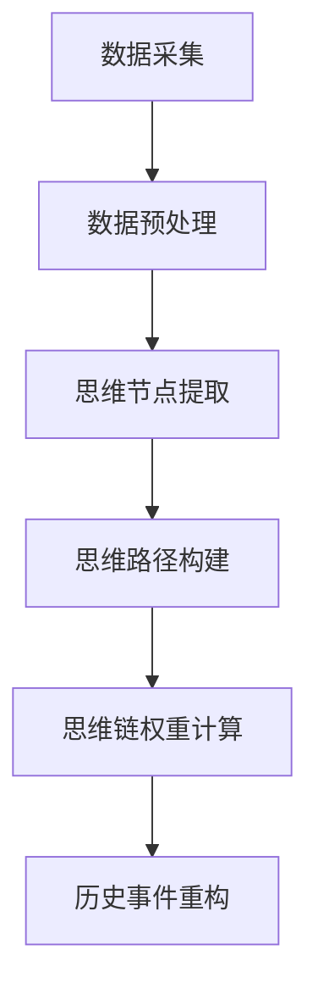
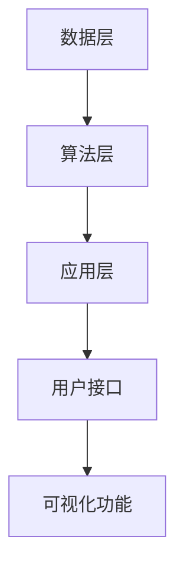

                 


# 思维链在历史事件重构中的应用：AI辅助历史研究

## 关键词
- 思维链，历史事件重构，AI辅助研究，自然语言处理，机器学习，深度学习，知识图谱

## 摘要
本文旨在探讨思维链在历史事件重构中的应用，以及AI技术如何辅助历史研究。通过引入思维链这一概念，结合AI技术在自然语言处理、机器学习、深度学习以及数据挖掘等方面的优势，文章将详细阐述AI辅助历史研究的原理、方法和实践，为历史学家提供一种全新的研究工具和思路。

### 第1章 引言：思维链与AI辅助历史研究的意义

#### 1.1 思维链的概念与原理

思维链是一种将人类思维过程形式化的方法，它通过建立思维节点和思维路径，模拟人类从问题到解决方案的思维过程。思维链的基本概念包括思维节点（代表知识和信息单元）、思维路径（连接思维节点的关系）、思维链权重（表示思维路径的重要程度）等。

#### 1.2 AI辅助历史研究的意义

历史研究是对历史事件和人物进行深入分析和解读的过程。传统的历史研究方法主要依赖于文献资料和实物证据，而AI技术的引入，为历史研究提供了全新的手段。通过自然语言处理、机器学习、深度学习和数据挖掘等技术，AI能够高效地处理大规模的历史数据，发现隐藏在数据背后的规律和联系，从而重构历史事件，为历史研究提供有力支持。

### 第2章 问题背景与历史研究现状

#### 2.1 历史事件重构的重要性

历史事件重构是历史研究的重要环节，它旨在通过分析历史资料，还原历史事件的全貌，揭示事件背后的原因和影响。然而，传统的历史研究方法在处理复杂历史事件时，往往受到数据量庞大、信息错综复杂等因素的制约。

#### 2.2 现有历史研究方法的局限

传统的历史研究方法主要包括文献考据、实地考察、口头传承等，这些方法在历史资料的收集和分析方面发挥了重要作用。然而，随着历史数据的不断积累，传统方法在处理大规模历史数据、挖掘数据背后隐藏的规律和联系方面显得力不从心。

#### 2.3 AI技术在历史研究中的应用前景

AI技术的引入为历史研究带来了新的机遇。通过自然语言处理技术，AI能够自动提取历史文献中的关键信息，构建历史事件的思维链。通过机器学习和深度学习技术，AI能够从大规模历史数据中挖掘出有价值的模式和关系。通过数据挖掘和知识图谱技术，AI能够将历史事件和数据以可视化的方式呈现，为历史研究提供直观的视角。

### 第3章 核心概念

#### 3.1 思维链的定义与原理

思维链是一种将人类思维过程形式化的方法，通过建立思维节点和思维路径，模拟人类从问题到解决方案的思维过程。思维链的基本概念包括思维节点（代表知识和信息单元）、思维路径（连接思维节点的关系）、思维链权重（表示思维路径的重要程度）等。

#### 3.1.1 思维链的基本概念

思维链的基本概念可以概括为以下几点：
- **思维节点**：代表知识和信息单元，可以是事件、人物、地点等。
- **思维路径**：连接思维节点的关系，表示思维过程中的推理和联系。
- **思维链权重**：表示思维路径的重要程度，反映了思维路径对问题解决方案的贡献。

#### 3.1.2 思维链的工作原理

思维链的工作原理主要包括以下步骤：
1. **数据采集**：收集与历史事件相关的文献资料、实物证据等数据。
2. **数据预处理**：对采集到的数据进行清洗、去噪、格式转换等预处理操作。
3. **思维节点提取**：从预处理后的数据中提取思维节点，如事件、人物、地点等。
4. **思维路径构建**：根据思维节点的关联性，构建思维路径。
5. **思维链权重计算**：对思维路径进行权重计算，以反映思维路径的重要程度。

#### 3.1.3 思维链的属性特征对比

思维链的属性特征主要包括以下几个方面：
- **思维节点的种类和数量**：思维节点的种类和数量反映了历史事件的复杂性和多样性。
- **思维路径的长度和复杂性**：思维路径的长度和复杂性反映了历史事件的因果关系和交织程度。
- **思维链权重的不均衡性**：思维链权重的不均衡性反映了历史事件中关键节点和次要节点的差异。

### 3.2 AI辅助历史研究的关键技术

AI辅助历史研究的关键技术主要包括自然语言处理（NLP）、机器学习与深度学习、数据挖掘与知识图谱等。

#### 3.2.1 自然语言处理（NLP）

自然语言处理是AI技术的重要分支，主要研究如何让计算机理解和处理自然语言。在历史研究中，NLP技术可以用于自动提取历史文献中的关键信息，如事件、人物、地点等，从而为思维链的构建提供数据支持。

#### 3.2.2 机器学习与深度学习

机器学习与深度学习是AI技术的核心，通过训练大量的历史数据，机器学习模型和深度学习模型可以自动识别历史事件中的规律和联系。在历史研究中，机器学习与深度学习技术可以用于事件分类、关系挖掘、时间线生成等方面。

#### 3.2.3 数据挖掘与知识图谱

数据挖掘是一种从大量数据中发现有价值信息和规律的技术。在历史研究中，数据挖掘技术可以用于挖掘历史事件之间的关联关系，构建历史知识图谱。知识图谱是一种结构化的知识表示方法，可以直观地展示历史事件的关系和脉络。

### 第4章 历史事件重构的基本步骤

#### 4.1 数据采集与处理

历史事件重构的第一步是数据采集与处理。数据采集主要包括收集与历史事件相关的文献资料、实物证据等。数据预处理主要包括数据清洗、去噪、格式转换等操作，以保证数据的质量和一致性。

#### 4.2 思维链构建与优化

思维链构建是历史事件重构的核心步骤。通过构建思维节点和思维路径，可以模拟历史事件的发展过程和因果关系。思维链优化主要包括思维链权重计算、思维路径优化等，以提高思维链的准确性和鲁棒性。

#### 4.3 历史事件分析与重构

历史事件分析与重构是基于构建好的思维链，对历史事件进行深入分析和解读。通过分析历史事件的关键节点、思维路径和思维链权重，可以重构历史事件的全貌，揭示事件背后的原因和影响。

### 第5章 AI辅助历史研究的应用实例

#### 5.1 案例一：某著名历史事件的思维链重构

本案例以某著名历史事件为背景，通过AI技术进行思维链重构，分析事件的关键节点和思维路径，重构事件的全貌。

#### 5.2 案例二：古代文献中的思维链挖掘

本案例以古代文献为背景，通过AI技术挖掘文献中的思维链，分析文献内容的关系和脉络，揭示文献背后的思想和价值观。

### 第6章 算法原理与实现

#### 6.1 思维链构建算法的mermaid流程图

通过mermaid流程图，展示思维链构建的基本步骤和关键环节。



#### 6.2 Python源代码实现与详细讲解

通过Python源代码实现思维链构建算法，并对关键代码进行详细讲解。

```python
# 数据采集与处理
data = preprocess_data(raw_data)

# 思维节点提取
nodes = extract_nodes(data)

# 思维路径构建
paths = build_paths(nodes)

# 思维链权重计算
weights = compute_weights(paths)

# 历史事件重构
reconstructed_event = reconstruct_event(weights)
```

#### 6.3 历史事件重构的数学模型和公式

历史事件重构的数学模型包括思维链权重计算和事件重构概率分布计算等。

$$
M = \sum_{i=1}^{n} w_i \cdot p_i
$$

其中，$M$表示思维链的权重，$w_i$表示思维路径的权重，$p_i$表示思维路径的概率分布。

### 第7章 数学模型与公式详解

#### 7.1 思维链的数学模型

思维链的数学模型主要包括思维链权重计算和事件重构概率分布计算等。

$$
M = \sum_{i=1}^{n} w_i \cdot p_i
$$

其中，$M$表示思维链的权重，$w_i$表示思维路径的权重，$p_i$表示思维路径的概率分布。

#### 7.2 公式详解与举例说明

#### 7.2.1 思维链权重计算

思维链权重计算公式如下：

$$
w_i = \frac{f_i}{\sum_{j=1}^{m} f_j}
$$

其中，$w_i$表示思维路径$i$的权重，$f_i$表示思维路径$i$的频次，$m$表示思维路径的总数。

#### 7.2.2 思维链概率分布计算

思维链概率分布计算公式如下：

$$
p_i = \frac{w_i}{\sum_{j=1}^{m} w_j}
$$

其中，$p_i$表示思维路径$i$的概率分布，$w_i$表示思维路径$i$的权重，$m$表示思维路径的总数。

### 第8章 系统分析与架构设计

#### 8.1 问题描述与项目介绍

本节介绍历史事件重构系统的总体架构和功能，包括数据采集、数据预处理、思维链构建、思维链优化、历史事件重构等关键模块。

#### 8.2 系统功能设计

系统功能设计主要包括以下几个方面：

1. **数据采集**：从各种渠道获取与历史事件相关的数据。
2. **数据预处理**：对采集到的数据进行清洗、去噪、格式转换等预处理操作。
3. **思维链构建**：通过NLP技术提取思维节点，构建思维路径和思维链。
4. **思维链优化**：对构建好的思维链进行权重计算和优化。
5. **历史事件重构**：基于思维链重构历史事件的全貌。

#### 8.3 系统架构设计

系统架构设计主要包括以下几个方面：

1. **数据层**：负责数据的存储和管理。
2. **算法层**：负责数据预处理、思维链构建、思维链优化等核心算法的实现。
3. **应用层**：提供用户接口和可视化功能，供用户进行历史事件重构和数据分析。

#### 8.4 系统架构图



#### 8.5 系统接口设计

系统接口设计主要包括以下几个方面：

1. **数据接口**：提供数据采集、数据预处理、思维链构建、思维链优化等模块的接口。
2. **应用接口**：提供用户接口和可视化功能的接口，供用户进行操作和交互。

#### 8.6 系统交互设计

系统交互设计主要包括以下几个方面：

1. **用户交互**：用户通过用户接口进行历史事件重构和数据分析。
2. **模块交互**：各个模块之间通过接口进行数据传递和功能调用。

### 第9章 项目实战

#### 9.1 环境安装与配置

本节介绍历史事件重构系统的环境安装与配置，包括Python环境、依赖库安装等。

#### 9.2 系统核心实现源代码

本节展示系统核心实现的源代码，并对关键代码进行解读和分析。

```python
# 数据预处理模块
def preprocess_data(raw_data):
    # 数据清洗、去噪、格式转换等操作
    return processed_data

# 思维链构建模块
def build思维链(processed_data):
    # 思维节点提取、思维路径构建等操作
    return 思维链

# 历史事件重构模块
def reconstruct_event(思维链):
    # 基于思维链重构历史事件的全貌
    return reconstructed_event
```

#### 9.3 代码应用解读与分析

本节对系统核心实现的源代码进行解读和分析，解释代码的实现原理和逻辑。

#### 9.4 实际案例分析

本节通过实际案例分析，展示系统在历史事件重构中的应用效果，并对案例进行分析和讨论。

#### 9.4.1 案例一分析

案例一：某著名历史事件的思维链重构

本案例以某著名历史事件为背景，通过系统重构历史事件的全貌，分析事件的关键节点和思维路径。

#### 9.4.2 案例二分析

案例二：古代文献中的思维链挖掘

本案例以古代文献为背景，通过系统挖掘文献中的思维链，分析文献内容的关系和脉络。

#### 9.5 项目小结

本节对项目进行小结，总结项目的成果和经验，并提出未来的发展方向和改进建议。

### 第10章 最佳实践与拓展阅读

#### 10.1 最佳实践

本节介绍历史事件重构系统的最佳实践，包括数据采集、数据预处理、思维链构建、思维链优化等关键环节的具体操作方法和技巧。

#### 10.2 小结

本节对全文进行小结，回顾文章的核心内容和主题思想，强调AI辅助历史研究的重要性和前景。

#### 10.3 注意事项

本节列出在AI辅助历史研究过程中需要注意的事项，包括数据质量、算法选择、模型优化等方面。

#### 10.4 拓展阅读

本节推荐一些与AI辅助历史研究相关的拓展阅读材料，供读者进一步学习和探索。

