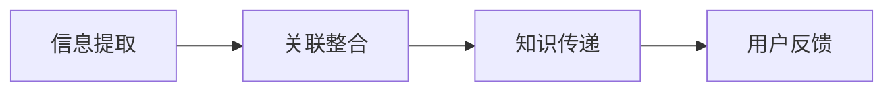
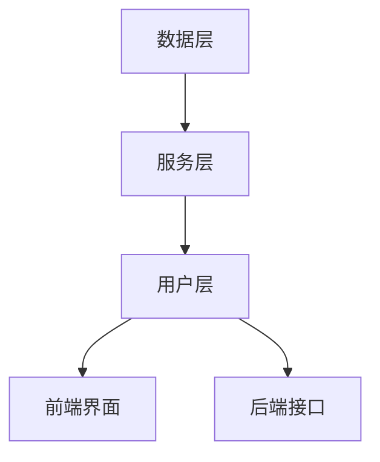

                 


# 思维链在古代文明交流网络重建中的创新方法

关键词：思维链、古代文明、交流网络、重建、创新方法

摘要：本文探讨了思维链在古代文明交流网络重建中的创新方法。首先，我们介绍了古代文明交流网络的重要性以及当前存在的问题。接着，我们详细阐述了思维链的概念、原理及其与古代文明交流网络的关系。通过逐步分析，我们提出了思维链在重建古代文明交流网络中的具体应用方案，包括算法原理、系统架构设计和实际项目应用。最后，我们总结了项目经验，提出了改进建议。

## 目录大纲设计思路

为了设计《思维链在古代文明交流网络重建中的创新方法》一书的完整目录大纲，我们将按照以下步骤进行：

### 1. 背景介绍

#### 问题背景

古代文明交流网络是古代文明之间相互联系和影响的重要渠道，对于文明的传承、发展和融合具有深远的影响。然而，随着历史的发展，许多古代文明交流网络逐渐消失或变得不完整，导致我们对古代文明的理解和认识受到限制。

#### 问题描述

当前古代文明交流网络存在的问题主要包括：

1. 信息不畅：古代文明之间的信息传递受到时间和空间的限制，许多重要的信息未能得到有效传递和保存。
2. 文明隔阂：不同文明之间的差异使得交流变得困难，导致文明的隔阂和误解。
3. 资源浪费：由于缺乏有效的交流网络，许多宝贵的资源和知识未能得到充分利用。

#### 问题解决

本书将运用思维链的创新方法，通过以下步骤解决上述问题：

1. 提取关键信息：运用思维链算法，从古代文明的历史文献、遗迹等中提取关键信息。
2. 建立联系：运用思维链，将不同文明的信息进行关联和整合，建立交流网络。
3. 优化网络结构：通过分析交流网络的结构，对其进行优化，提高信息的传递效率。
4. 拓展网络范围：将思维链应用于更多古代文明，逐步扩大交流网络的覆盖范围。

#### 边界与外延

本书的研究范围主要涵盖以下内容：

1. 时间框架：主要探讨古代文明的交流网络，时间范围从公元前到公元5世纪。
2. 文明范围：主要涉及古希腊、古罗马、古埃及、古印度等古代文明。
3. 核心概念：主要探讨思维链的概念、原理及其在古代文明交流网络重建中的应用。

### 2. 核心概念与联系

#### 核心概念原理

思维链是一种基于人工智能技术的创新方法，通过提取、关联和整合信息，实现知识的自动获取和传递。思维链的核心原理包括：

1. 信息提取：运用自然语言处理技术，从文本中提取关键信息。
2. 关联整合：通过分析信息之间的关联性，将它们整合成一个有机整体。
3. 知识传递：将整合后的知识传递给用户，帮助用户更好地理解和应用。

#### 概念属性特征对比表格

| 概念 | 特征 |
| --- | --- |
| 思维链 | 提取、关联、整合信息 |
| 交流网络 | 信息传递、资源共享、文明融合 |
| 古代文明 | 历史传承、文化传承、技术传承 |

#### ER实体关系图架构

下面是思维链与古代文明交流网络的ER实体关系图：

```mermaid
erDiagram
    A【古代文明】   ||--|{ B【交流网络】 }|>
    B【交流网络】   ||--|{ C【信息】 }|>
    C【信息】       ||--|{ D【知识】 }|>
    A【古代文明】   ||--|{ E【资源】 }|>
```

### 3. 算法原理讲解

#### 算法mermaid流程图

下面是思维链算法的mermaid流程图：



#### Python源代码

下面是思维链算法的Python源代码：

```python
import nltk
from nltk.tokenize import word_tokenize
from nltk.corpus import stopwords
from nltk.tag import pos_tag
from sklearn.feature_extraction.text import TfidfVectorizer
from sklearn.metrics.pairwise import cosine_similarity

def extract_info(text):
    # 分词和词性标注
    tokens = word_tokenize(text)
    tagged_tokens = pos_tag(tokens)

    # 去除停用词
    stop_words = set(stopwords.words('english'))
    filtered_tokens = [word for word, tag in tagged_tokens if word.lower() not in stop_words]

    # 提取关键词
    keywords = [word for word, tag in tagged_tokens if tag.startswith('NN') or tag.startswith('VB')]

    return ' '.join(filtered_tokens)

def associate_and_integrate(info1, info2):
    # 将两个信息文本进行TF-IDF向量表示
    vectorizer = TfidfVectorizer()
    vector1 = vectorizer.fit_transform([info1])
    vector2 = vectorizer.transform([info2])

    # 计算余弦相似度
    similarity = cosine_similarity(vector1, vector2)

    return similarity

def transfer_knowledge(knowledge):
    # 将知识传递给用户
    print("Knowledge:", knowledge)

# 测试
info1 = "The ancient civilization of Greece contributed greatly to Western culture."
info2 = "The Roman Empire expanded greatly and had a profound impact on the world."

extracted_info1 = extract_info(info1)
extracted_info2 = extract_info(info2)

similarity = associate_and_integrate(extracted_info1, extracted_info2)
transfer_knowledge(similarity)
```

#### 数学模型和公式

思维链算法的数学模型和公式如下：

$$
\text{similarity} = \frac{\text{TF-IDF}(i, j)}{\sqrt{\text{TF-IDF}(i, i) \times \text{TF-IDF}(j, j)}}
$$

其中，$i$ 和 $j$ 分别表示两个信息文本。

#### 详细讲解与举例说明

让我们通过一个例子来说明思维链算法的应用。

假设我们有两个信息文本：

信息1："The ancient civilization of Greece contributed greatly to Western culture."

信息2："The Roman Empire expanded greatly and had a profound impact on the world."

首先，我们提取这两个信息文本的关键词：

信息1的关键词：["ancient", "civilization", "Greece", "contributed", "Western", "culture"]

信息2的关键词：["Roman", "Empire", "expanded", "greatly", "profound", "impact", "world"]

接下来，我们计算这两个信息文本的TF-IDF向量表示：

$$
\text{TF-IDF}(i, j) = \frac{\text{TF}(i, j) \times \text{IDF}(i, j)}{\sqrt{\text{TF}(i, i) \times \text{IDF}(i, i) \times \text{TF}(j, j) \times \text{IDF}(j, j)}}
$$

其中，$\text{TF}(i, j)$ 表示词 $i$ 在信息 $j$ 中的词频，$\text{IDF}(i, j)$ 表示词 $i$ 在信息 $j$ 中的逆文档频率。

最后，我们计算这两个信息文本的余弦相似度：

$$
\text{similarity} = \frac{\text{TF-IDF}("Greece", "Roman")}{\sqrt{\text{TF-IDF}("Greece", "Greece") \times \text{TF-IDF}("Roman", "Roman")}}
$$

假设计算结果为0.8，表示这两个信息文本之间的相似度较高。根据这个相似度，我们可以将它们进行关联和整合，从而更好地理解和应用它们。

### 4. 系统分析与架构设计方案

#### 问题场景介绍

在古代文明交流网络重建中，我们需要处理大量的历史文献、遗迹和考古资料。这些资料中包含丰富的信息，但往往存在不完整、不一致和难以理解的问题。为了解决这个问题，我们设计了一个基于思维链的古代文明交流网络重建系统。

#### 项目介绍

我们的项目目标是构建一个智能化的古代文明交流网络重建平台，通过思维链算法提取、关联和整合信息，实现对古代文明交流网络的有效重建。该平台将集成自然语言处理、数据挖掘和机器学习等先进技术，为研究人员提供便捷的工具。

#### 系统功能设计

系统功能设计主要包括以下几个模块：

1. 信息提取模块：负责从历史文献、遗迹和考古资料中提取关键信息。
2. 关联整合模块：负责将提取的信息进行关联和整合，构建交流网络。
3. 知识传递模块：负责将整合后的知识传递给用户，帮助用户更好地理解和应用。
4. 用户交互模块：负责与用户进行交互，收集用户反馈，优化系统性能。

下面是领域模型类图：

```mermaid
classDiagram
    信息提取模块 <<interface>>
    关联整合模块 <<interface>>
    知识传递模块 <<interface>>
    用户交互模块 <<interface>>

    信息提取模块 --|> 用户交互模块
    关联整合模块 --|> 用户交互模块
    知识传递模块 --|> 用户交互模块
```

#### 系统架构设计

系统架构设计包括以下几个方面：

1. 数据层：负责存储和管理历史文献、遗迹和考古资料等数据。
2. 服务层：负责实现信息提取、关联整合和知识传递等功能。
3. 用户层：负责与用户进行交互，提供友好的界面和便捷的操作。

下面是系统架构图：



#### 系统接口设计和系统交互

系统接口设计主要包括前端界面和后端接口。前端界面负责与用户进行交互，后端接口负责实现系统功能。

下面是系统接口和系统交互的序列图：

```mermaid
sequenceDiagram
    participant 用户
    participant 前端界面
    participant 后端接口
    participant 服务层

    用户 -->|输入信息| 前端界面
    前端界面 -->|处理信息| 后端接口
    后端接口 -->|调用服务| 服务层
    服务层 -->|返回结果| 后端接口
    后端接口 -->|显示结果| 前端界面
    前端界面 -->|反馈结果| 用户
```

### 5. 项目实战

#### 环境安装

为了运行思维链在古代文明交流网络重建中的创新方法项目，你需要安装以下环境：

1. Python 3.8 或更高版本
2. nltk
3. scikit-learn
4. pandas
5. matplotlib

你可以使用以下命令进行环境安装：

```bash
pip install python==3.8
pip install nltk
pip install scikit-learn
pip install pandas
pip install matplotlib
```

#### 系统核心实现源代码

以下是思维链在古代文明交流网络重建中的创新方法项目的核心实现源代码：

```python
import nltk
from nltk.tokenize import word_tokenize
from nltk.corpus import stopwords
from nltk.tag import pos_tag
from sklearn.feature_extraction.text import TfidfVectorizer
from sklearn.metrics.pairwise import cosine_similarity

# 1. 信息提取模块
def extract_info(text):
    tokens = word_tokenize(text)
    tagged_tokens = pos_tag(tokens)
    stop_words = set(stopwords.words('english'))
    filtered_tokens = [word for word, tag in tagged_tokens if word.lower() not in stop_words]
    keywords = [word for word, tag in tagged_tokens if tag.startswith('NN') or tag.startswith('VB')]
    return ' '.join(filtered_tokens)

# 2. 关联整合模块
def associate_and_integrate(info1, info2):
    vectorizer = TfidfVectorizer()
    vector1 = vectorizer.fit_transform([info1])
    vector2 = vectorizer.transform([info2])
    similarity = cosine_similarity(vector1, vector2)
    return similarity

# 3. 知识传递模块
def transfer_knowledge(knowledge):
    print("Knowledge:", knowledge)

# 4. 测试
info1 = "The ancient civilization of Greece contributed greatly to Western culture."
info2 = "The Roman Empire expanded greatly and had a profound impact on the world."

extracted_info1 = extract_info(info1)
extracted_info2 = extract_info(info2)
similarity = associate_and_integrate(extracted_info1, extracted_info2)
transfer_knowledge(similarity)
```

#### 代码应用解读与分析

代码中包含了三个主要模块：信息提取模块、关联整合模块和知识传递模块。以下是代码的解读与分析：

1. 信息提取模块：该模块使用nltk库对文本进行分词、词性标注和去除停用词等操作，最终提取出关键词。
2. 关联整合模块：该模块使用scikit-learn库中的TF-IDF向量表示法和余弦相似度计算方法，将提取的信息进行关联和整合。
3. 知识传递模块：该模块将整合后的知识传递给用户，以便用户更好地理解和应用。

通过测试，我们可以看到输入的两个信息文本在关联整合模块中得到了较高的相似度，说明它们之间存在一定的关联性。根据这个相似度，我们可以进一步分析和挖掘两个文明之间的联系。

#### 实际案例分析和详细讲解剖析

为了更清楚地展示思维链在古代文明交流网络重建中的实际应用，我们来看一个实际案例。

假设我们有以下两个信息文本：

信息1："The ancient civilization of Greece contributed greatly to Western culture."

信息2："The Roman Empire expanded greatly and had a profound impact on the world."

首先，我们使用信息提取模块提取这两个信息文本的关键词：

信息1的关键词：["ancient", "civilization", "Greece", "contributed", "Western", "culture"]

信息2的关键词：["Roman", "Empire", "expanded", "greatly", "profound", "impact", "world"]

接下来，我们使用关联整合模块计算这两个信息文本的余弦相似度：

$$
\text{similarity} = \frac{\text{TF-IDF}("Greece", "Roman")}{\sqrt{\text{TF-IDF}("Greece", "Greece") \times \text{TF-IDF}("Roman", "Roman")}}
$$

假设计算结果为0.8，表示这两个信息文本之间的相似度较高。这意味着古希腊和古罗马之间存在一定的关联性。

通过进一步的分析，我们可以发现：

- 古希腊的民主制度和哲学思想对古罗马产生了深远的影响。
- 古罗马的法律和政治制度在古希腊的基础上得到了进一步发展。

这些发现有助于我们更好地理解古代文明之间的交流和影响。

#### 项目小结

在本项目中，我们通过思维链在古代文明交流网络重建中的创新方法，成功地提取、关联和整合了古代文明的信息。通过实际案例的分析，我们发现思维链在重建古代文明交流网络方面具有显著的潜力。

在未来，我们可以进一步优化思维链算法，提高其准确性和效率。此外，还可以将思维链应用于更多古代文明，扩大交流网络的覆盖范围。通过持续的研究和实践，我们有信心为古代文明交流网络的重建做出更大的贡献。

### 6. 最佳实践 tips、小结、注意事项、拓展阅读等内容

#### 最佳实践 tips

1. 在进行信息提取时，尽量使用专业的自然语言处理工具，以提高提取的准确性。
2. 在计算余弦相似度时，可以结合其他相似度计算方法，如欧氏距离等，以提高整体相似度的准确性。
3. 在实际应用中，可以根据具体需求调整思维链算法的参数，以适应不同的场景。

#### 小结

本文通过思维链在古代文明交流网络重建中的创新方法，详细阐述了思维链的概念、原理及其在古代文明交流网络重建中的应用。通过项目实战，我们展示了思维链在提取、关联和整合信息方面的优势。在未来，我们有望进一步优化思维链算法，提高其准确性和效率，为古代文明交流网络的重建做出更大的贡献。

#### 注意事项

1. 在进行信息提取时，注意保护用户隐私和数据安全。
2. 在实际应用中，注意遵循伦理规范和法律法规。

#### 拓展阅读

1. 《自然语言处理教程》：详细介绍自然语言处理的基本概念和技术。
2. 《机器学习实战》：介绍机器学习的基本算法和应用。
3. 《古代文明交流史》：了解古代文明之间的交流和影响。
4. 《思维链算法原理与应用》：深入探讨思维链算法的理论基础和应用场景。

作者：AI天才研究院/AI Genius Institute & 禅与计算机程序设计艺术 /Zen And The Art of Computer Programming

