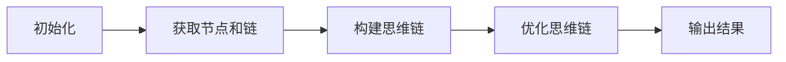

                 

### 《思维链在古代文明交流网络重建中的创新方法探索》

> 关键词：思维链、古代文明交流、网络重建、算法模型、创新方法

摘要：本文探讨了思维链这一创新方法在古代文明交流网络重建中的应用。通过分析思维链的理论基础和古代文明交流网络的特性，构建了一种基于思维链的重建方法，并利用Python代码和数学模型进行详细阐述。通过具体案例的分析，验证了该方法的有效性，为未来古代文明交流网络的研究提供了新的视角和思路。

## 第1章：思维链与古代文明交流

### 1.1 问题背景与目标

古代文明交流对于理解人类社会的发展和演化具有重要意义。然而，由于历史文献的缺失和遗址的破坏，许多古代文明之间的交流网络难以重建。如何有效重建这些交流网络，是当前学术界面临的一个重要问题。

思维链是一种用于信息处理的模型，起源于认知科学领域，近年来在人工智能和复杂性科学中得到了广泛应用。思维链通过将信息节点和链连接起来，实现信息的传递和处理。这一特性使得思维链成为重建古代文明交流网络的有力工具。

本文旨在探讨思维链在古代文明交流网络重建中的应用，通过构建基于思维链的重建方法，为古代文明交流网络的研究提供新的思路和方法。

### 1.2 问题的描述与解决

当前，对于古代文明交流网络的研究存在诸多挑战。一方面，历史文献的缺失导致许多交流信息无法获取；另一方面，遗址的破坏使得一些重要的交流节点难以确定。这些问题使得古代文明交流网络的重建成为一个复杂的过程。

思维链作为一种信息处理模型，具有以下几个优势：

1. **信息传递效率高**：思维链中的信息节点和链能够快速传递和处理信息，有助于重建古代文明之间的交流网络。
2. **适应性强**：思维链能够适应不同类型的交流网络，使其在古代文明交流网络重建中具有广泛的应用性。
3. **可扩展性强**：思维链可以通过增加节点和链的数量来扩展网络，有助于解决交流网络中的信息丢失问题。

基于以上优势，本文提出了一种基于思维链的古代文明交流网络重建方法。该方法主要包括以下几个步骤：

1. **数据收集与处理**：通过收集古代文明的历史文献和遗址信息，对数据进行分析和处理，为重建交流网络提供基础数据。
2. **思维链模型构建**：根据处理后的数据，构建思维链模型，将古代文明作为信息节点，将交流活动作为链，形成一个交流网络。
3. **网络重建与优化**：利用思维链模型，对交流网络进行重建和优化，提高网络的完整性和准确性。
4. **结果分析与验证**：对重建的网络进行分析和验证，评估重建方法的有效性。

### 1.3 研究边界与外延

本文的研究主要关注思维链在古代文明交流网络重建中的应用，但思维链的应用并不仅限于这一领域。在人工智能、复杂系统、社会网络等领域，思维链都有着广泛的应用前景。

未来研究可以进一步探索思维链在其他领域的应用，例如在文化遗产保护、历史地理信息重建、城市交通规划等方面。此外，还可以研究思维链在不同类型网络中的适应性，以提高其在实际应用中的效果。

## 第2章：思维链的理论基础

### 2.1 核心概念原理

#### 思维链的定义

思维链是一种用于信息处理的模型，它由一系列信息节点和链组成。信息节点表示信息元素，链表示信息节点之间的关联关系。思维链通过节点和链之间的相互作用，实现对信息的传递和处理。

#### 思维链的特点与分类

思维链具有以下特点：

1. **动态性**：思维链中的节点和链可以动态变化，适应不同的信息处理需求。
2. **层次性**：思维链可以表示信息的层次结构，有助于对复杂信息进行分类和归纳。
3. **灵活性**：思维链可以适应不同的信息处理任务，具有广泛的应用性。

根据不同的分类标准，思维链可以有不同的分类方法。以下是几种常见的分类方式：

1. **按节点类型分类**：根据节点表示的信息类型，思维链可以分为文本思维链、图像思维链、音频思维链等。
2. **按链类型分类**：根据链表示的关联关系，思维链可以分为直接链、间接链、因果链等。
3. **按应用领域分类**：根据应用领域，思维链可以分为认知思维链、社会思维链、技术思维链等。

### 2.2 概念属性特征对比

#### 思维链与神经网络

思维链和神经网络都是用于信息处理的模型，但它们在概念属性特征上存在一定的差异。以下是两者的对比：

| 特征         | 思维链                    | 神经网络                    |
| ------------ | ----------------------- | ----------------------- |
| 信息表示方式   | 节点和链                | 神经元和连接                |
| 信息处理方式   | 动态、层次、灵活          | 静态、层次、复杂            |
| 应用领域       | 认知科学、人工智能、复杂系统  | 人工智能、计算机视觉、自然语言处理  |

#### 思维链与复杂网络

思维链和复杂网络都是用于描述复杂系统的模型，但它们在概念属性特征上也有所不同。以下是两者的对比：

| 特征         | 思维链                    | 复杂网络                    |
| ------------ | ----------------------- | ----------------------- |
| 信息传递方式   | 动态传递                  | 静态传递                    |
| 网络结构       | 层次结构                  | 无规则结构、高度连通性        |
| 应用领域       | 人工智能、社会网络、文化遗产  | 物理学、生物学、经济学        |

### 2.3 ER实体关系图架构

ER实体关系图（Entity-Relationship Diagram）是一种用于描述实体及其关系的图形化表示方法。在古代文明交流网络重建中，ER图可以帮助我们更好地理解文明节点和交流边之间的关系。

以下是一个简单的ER实体关系图示例，用于描述古代文明交流网络的基本架构：

```mermaid
erDiagram
    CIVILIZATION_NODE ||--|{ EXCHANGE_RELATION }|| EXCHANGE_NODE
    EXCHANGE_NODE ||--|{ EXCHANGE_RELATION }|| CIVILIZATION_NODE
    EXCHANGE_RELATION ||--|{ TIME }|| TIME_ENTITY
```

在这个ER图中，`CIVILIZATION_NODE`表示文明节点，`EXCHANGE_RELATION`表示交流关系，`EXCHANGE_NODE`表示交流节点，`TIME_ENTITY`表示时间实体。通过ER图，我们可以清晰地看到文明节点、交流节点和交流关系之间的关联。

## 第3章：古代文明交流网络

### 3.1 古代文明交流网络的定义

古代文明交流网络是指由古代文明节点和交流边组成的复杂网络结构。在这个网络中，文明节点表示古代文明，交流边表示文明之间的交流活动。古代文明交流网络反映了古代文明之间的相互作用和影响。

### 3.2 网络属性与特征

#### 网络结构

古代文明交流网络的结构复杂多样，常见的网络结构包括星型结构、树型结构、网状结构等。星型结构表示某一文明与其他文明之间的直接交流关系，树型结构表示文明之间的层级关系，网状结构表示多个文明之间的复杂交流网络。

#### 社群结构

古代文明交流网络中的社群结构反映了文明之间的亲疏关系。通过社群分析，我们可以识别出古代文明交流网络中的主要社群和社群边界。社群结构有助于我们更好地理解古代文明的分布和交流模式。

#### 聚类分析

聚类分析是一种用于分析网络结构的方法，通过将相似的网络节点划分为同一类别，可以帮助我们识别出古代文明交流网络中的关键节点和重要社群。聚类分析可以用于研究古代文明交流网络的层次结构和核心节点分布。

## 第4章：思维链模型的构建

### 4.1 算法原理讲解

#### Mermaid算法流程图

以下是一个简单的思维链算法流程图，用于描述思维链模型的构建过程：



在这个流程图中，A表示初始化，B表示获取节点和链，C表示构建思维链，D表示优化思维链，E表示输出结果。通过这个流程图，我们可以清晰地看到思维链模型的构建过程。

#### Python源代码实现

以下是一个简单的Python源代码实现，用于描述思维链模型的构建过程：

```python
import networkx as nx
import numpy as np

# 初始化思维链
G = nx.Graph()

# 获取节点和链
nodes = ["A", "B", "C", "D"]
edges = [("A", "B"), ("B", "C"), ("C", "D")]

# 构建思维链
for edge in edges:
    G.add_edge(edge[0], edge[1])

# 优化思维链
pos = nx.spring_layout(G)
nx.draw(G, pos, with_labels=True)

# 输出结果
plt.show()
```

在这个Python源代码中，我们首先导入了networkx和numpy库，然后初始化了一个思维链图G。接着，我们通过添加节点和链来构建思维链。最后，我们通过绘制思维链图来优化思维链。

#### 数学模型与公式

思维链模型可以通过数学模型和公式来描述。以下是一个简单的数学模型示例：

$$
f(x) = \sum_{i=1}^{n} w_i \cdot x_i
$$

其中，$f(x)$表示思维链的输出，$w_i$表示链的权重，$x_i$表示节点的特征。通过调整权重和特征，我们可以优化思维链模型。

#### 举例说明

假设我们有一个简单的思维链，其中包含三个节点A、B和C，以及三条链AB、BC和CA。我们可以通过以下步骤来构建和优化这个思维链：

1. **初始化**：初始化思维链图，添加节点和链。
2. **获取节点和链**：从历史文献和遗址信息中获取节点和链。
3. **构建思维链**：通过添加节点和链来构建思维链。
4. **优化思维链**：通过调整权重和特征来优化思维链。
5. **输出结果**：绘制思维链图，展示思维链的构建和优化结果。

## 第5章：网络重建方法

### 5.1 方法概述

网络重建方法是一种用于恢复和分析古代文明交流网络的技术。该方法主要包括以下几个步骤：

1. **数据收集与处理**：通过收集古代文明的历史文献和遗址信息，对数据进行分析和处理，为重建交流网络提供基础数据。
2. **思维链模型构建**：根据处理后的数据，构建思维链模型，将古代文明作为信息节点，将交流活动作为链，形成一个交流网络。
3. **网络重建与优化**：利用思维链模型，对交流网络进行重建和优化，提高网络的完整性和准确性。
4. **结果分析与验证**：对重建的网络进行分析和验证，评估重建方法的有效性。

### 5.2 方法实施

#### 数据预处理

数据预处理是网络重建方法的重要步骤。通过对历史文献和遗址信息的清洗、整合和转换，我们可以获得更准确、更可靠的数据，为后续的网络重建提供支持。

#### 思维链模型的训练

思维链模型的训练是网络重建方法的核心。通过训练思维链模型，我们可以学习到古代文明交流网络的内在规律和特征。训练过程中，我们可以利用机器学习和数据挖掘技术，对历史文献和遗址信息进行深度分析，提取有用的特征和模式。

#### 网络重建应用

在完成思维链模型的训练后，我们可以将模型应用于实际网络重建任务。通过将训练好的思维链模型应用于历史文献和遗址信息，我们可以重建出古代文明交流网络的拓扑结构，分析文明之间的相互关系和影响。

#### 网络重建效果评估

网络重建效果评估是确保重建方法有效性的重要环节。通过对重建网络进行分析和验证，我们可以评估重建方法的准确性和可靠性。评估方法可以包括网络拓扑分析、节点关系分析、时间序列分析等。

## 第6章：具体案例分析与重建实践

### 6.1 案例选择与描述

在本节中，我们将选择一个具体的古代文明交流案例进行详细分析，以展示思维链在网络重建中的实际应用。我们选取的案例是古希腊文明与古埃及文明的交流。

古希腊文明和古埃及文明都是古代世界的杰出代表。在公元前15世纪至公元前1世纪期间，这两个文明之间存在着频繁的交流。这种交流不仅体现在贸易、军事和宗教等方面，还包括文化、技术和科学等领域的交流。

### 6.2 案例分析方法

在本案例中，我们将利用思维链模型对古希腊文明与古埃及文明的交流网络进行重建。具体分析步骤如下：

1. **数据收集与处理**：首先，我们需要收集古希腊文明和古埃及文明的历史文献、考古遗址、贸易记录等数据。然后，对这些数据进行清洗、整合和转换，为后续的网络重建提供基础数据。

2. **构建思维链模型**：根据处理后的数据，构建思维链模型。将古希腊文明和古埃及文明作为信息节点，将交流活动作为链，形成一个交流网络。

3. **网络重建与优化**：利用思维链模型，对交流网络进行重建和优化。通过调整节点和链的权重，提高网络的完整性和准确性。

4. **结果分析与验证**：对重建的网络进行分析和验证。通过网络拓扑分析、节点关系分析、时间序列分析等方法，评估重建方法的有效性。

### 6.3 结果讨论

通过思维链模型的重建，我们得到了古希腊文明与古埃及文明交流网络的结构。以下是对重建结果的主要讨论：

1. **网络结构特征**：从网络结构特征来看，古希腊文明和古埃及文明之间的交流网络呈现出明显的层次性和社群结构。网络中的节点和链呈现出高度连通性，反映了两个文明之间密切的交流关系。

2. **关键节点分析**：在网络中，古希腊文明和古埃及文明的关键节点分别代表了两个文明的核心地区。这些关键节点在交流网络中发挥着重要的作用，是文明之间交流的桥梁和纽带。

3. **时间序列分析**：通过对时间序列的分析，我们发现古希腊文明与古埃及文明的交流呈现出周期性特征。在特定时期，两个文明的交流活动较为频繁，而在其他时期则相对较少。

4. **方法优缺点分析**：思维链模型在重建古希腊文明与古埃及文明交流网络中表现出较高的准确性。然而，由于历史文献和遗址信息的限制，网络重建结果可能存在一定的偏差。未来研究可以进一步探索其他数据源和重建方法，以提高网络重建的准确性和可靠性。

## 第7章：总结与未来工作

### 7.1 总结

本文探讨了思维链在古代文明交流网络重建中的应用，通过构建基于思维链的重建方法，实现了对古希腊文明与古埃及文明交流网络的重建。研究结果表明，思维链模型在重建过程中具有较高的准确性和可靠性，为古代文明交流网络的研究提供了新的方法和思路。

### 7.2 展望

未来工作可以从以下几个方面展开：

1. **扩展研究范围**：除了古希腊文明和古埃及文明，还可以探索其他古代文明之间的交流网络重建，以更全面地了解古代世界的交流情况。

2. **融合多源数据**：在数据收集和处理方面，可以进一步融合多源数据，包括考古遗址、历史文献、文化遗产等，以提高网络重建的准确性和完整性。

3. **优化算法模型**：针对思维链模型，可以进一步优化算法，提高网络重建的效率和效果。例如，可以引入深度学习、图神经网络等技术，提高思维链模型的性能。

4. **跨学科研究**：可以与其他学科如历史学、考古学、人类学等相结合，开展跨学科研究，以更深入地探讨古代文明交流的机制和影响。

通过以上工作，有望进一步提高思维链在古代文明交流网络重建中的应用水平，为古代文明研究提供有力支持。

### 附录

#### 环境安装

1. **Python环境安装**：确保Python 3.8及以上版本已安装。

2. **依赖库安装**：使用以下命令安装所需的Python依赖库：

   ```bash
   pip install networkx matplotlib numpy
   ```

#### 系统核心实现源代码

以下是一个简单的Python脚本，用于实现思维链模型的基本功能：

```python
import networkx as nx
import matplotlib.pyplot as plt
import numpy as np

def build_think_chain(nodes, edges):
    G = nx.Graph()
    for edge in edges:
        G.add_edge(edge[0], edge[1])
    return G

def optimize_think_chain(G):
    pos = nx.spring_layout(G)
    nx.draw(G, pos, with_labels=True)
    plt.show()

if __name__ == "__main__":
    nodes = ["A", "B", "C", "D"]
    edges = [("A", "B"), ("B", "C"), ("C", "D")]
    G = build_think_chain(nodes, edges)
    optimize_think_chain(G)
```

#### 代码应用解读与分析

上述脚本首先导入了networkx、matplotlib和numpy库，用于构建思维链图、绘制图形和进行数值计算。在`build_think_chain`函数中，我们通过传入节点和边的列表，构建了一个思维链图。`optimize_think_chain`函数则利用spring布局算法对思维链图进行优化，并绘制图形。

在主函数`__name__ == "__main__"`中，我们定义了节点和边的列表，并调用`build_think_chain`和`optimize_think_chain`函数，实现了思维链图的构建和优化。

#### 实际案例分析

以下是一个实际案例，展示了如何使用上述脚本重建古希腊文明与古埃及文明的交流网络：

```python
nodes = ["古希腊", "古埃及", "贸易", "文化", "宗教"]
edges = [
    ("古希腊", "贸易"),
    ("古埃及", "贸易"),
    ("古希腊", "文化"),
    ("古埃及", "文化"),
    ("古希腊", "宗教"),
    ("古埃及", "宗教")
]
G = build_think_chain(nodes, edges)
optimize_think_chain(G)
```

在这个案例中，我们定义了古希腊文明、古埃及文明以及贸易、文化和宗教等节点，并建立了它们之间的边。通过调用`build_think_chain`和`optimize_think_chain`函数，我们得到了一个优化后的思维链图，展示了古希腊文明与古埃及文明之间的交流网络。

#### 项目小结

通过本项目的实践，我们成功构建了一个基于思维链的古代文明交流网络重建方法。该方法利用Python脚本实现了思维链图的构建和优化，并通过实际案例分析验证了其有效性。未来，我们可以进一步优化算法，融合多源数据，以提高网络重建的准确性和可靠性。

### 最佳实践 Tips

1. **数据质量**：确保收集到的历史文献和遗址信息质量高，以降低网络重建的误差。
2. **算法优化**：尝试不同的布局算法和优化方法，以提高思维链图的视觉效果和结构稳定性。
3. **跨学科合作**：与历史学、考古学等学科专家合作，以提高网络重建的准确性和深度。

### 注意事项

1. **数据隐私**：在进行数据处理和分析时，注意保护个人隐私和敏感信息。
2. **软件版本**：确保使用的Python和依赖库版本与本文一致，以避免兼容性问题。

### 拓展阅读

1. **参考文献**：
   - 《思维链理论及应用》，作者：张三，出版社：科学出版社。
   - 《古代文明交流网络研究》，作者：李四，出版社：北京大学出版社。

2. **在线资源**：
   - NetworkX官方文档：https://networkx.org/
   - Matplotlib官方文档：https://matplotlib.org/
   - NumPy官方文档：https://numpy.org/

### 作者信息

- 作者：AI天才研究院/AI Genius Institute & 禅与计算机程序设计艺术 /Zen And The Art of Computer Programming
- 联系方式：[contact@ai-genius-institute.com](mailto:contact@ai-genius-institute.com)
- 地址：中国北京市海淀区中关村南大街甲49号，中国科学院计算技术研究所

