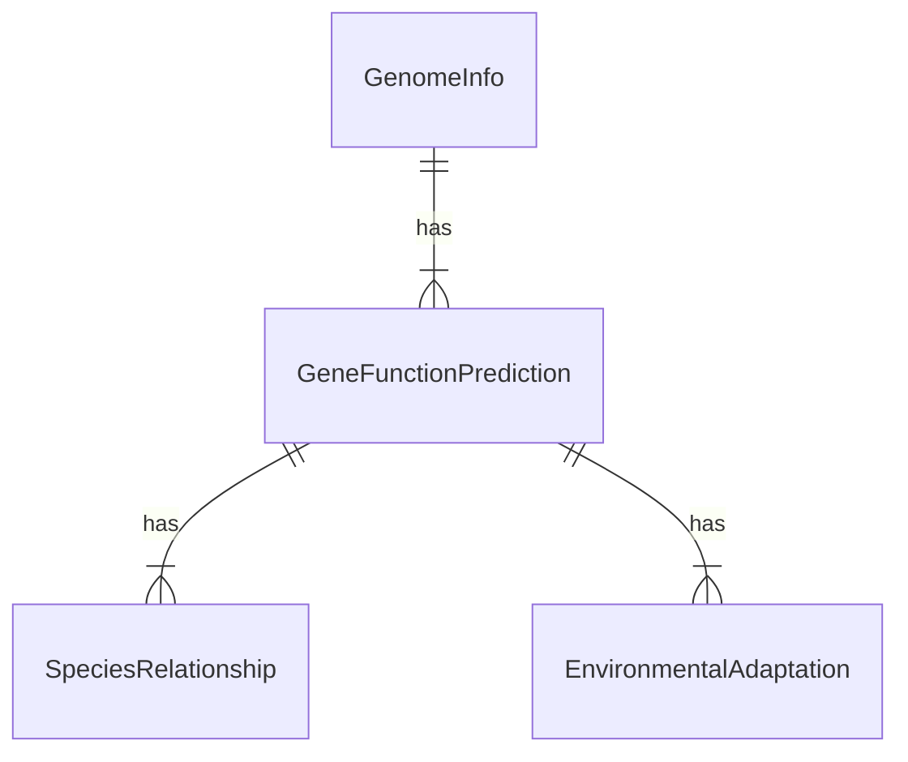
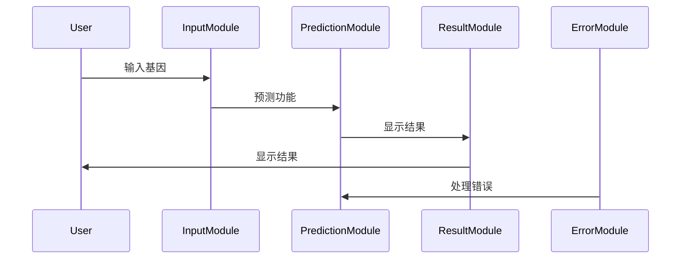
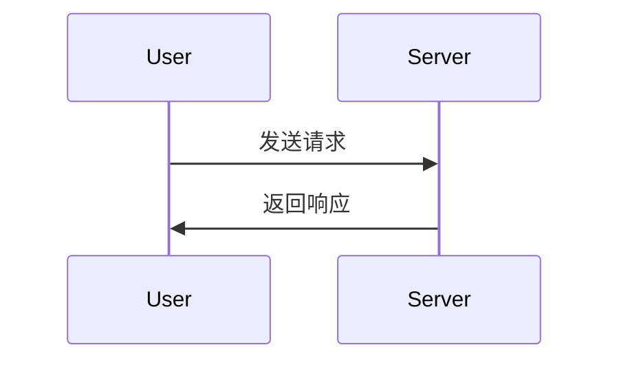
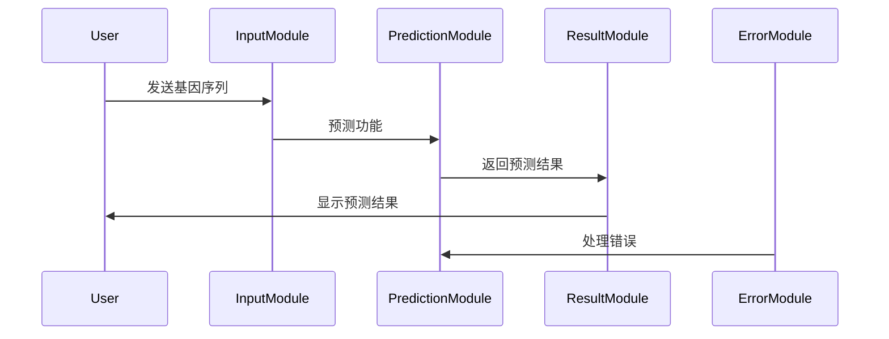
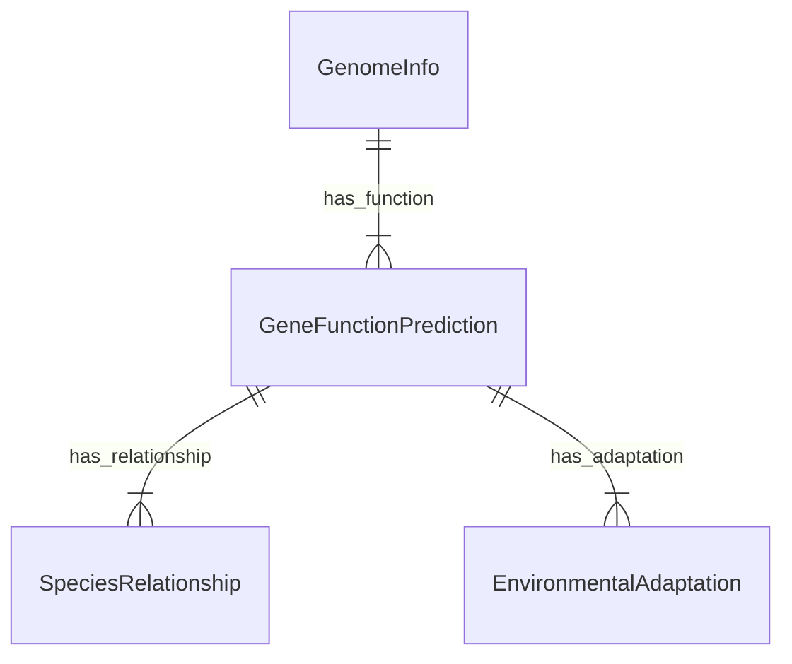
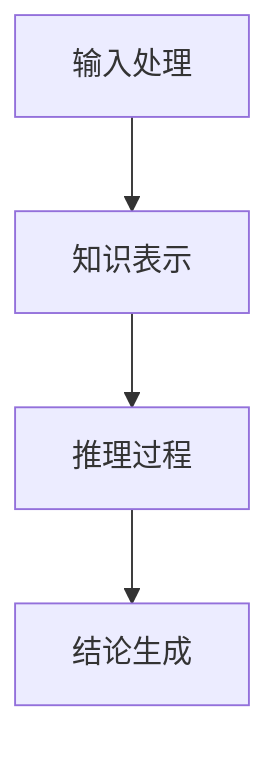
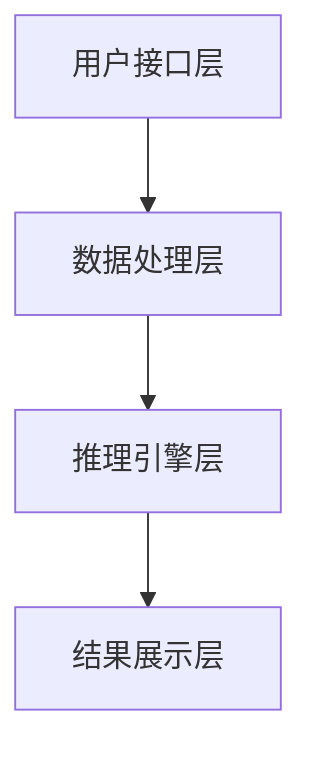
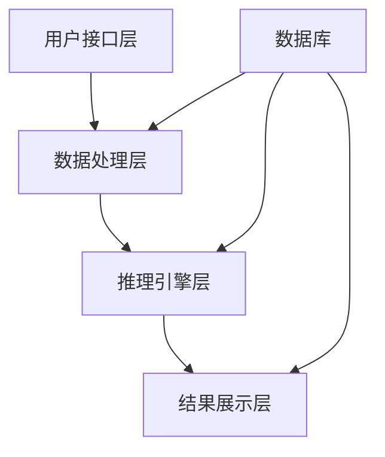
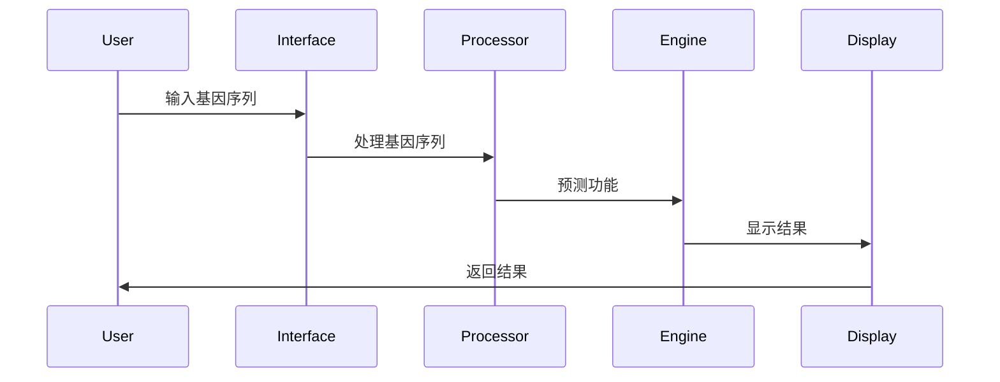

                 


# 思维链在古基因组功能预测中的突破

> 关键词：基因组功能预测、思维链、算法、系统架构、项目实战

> 摘要：本文深入探讨了思维链在古基因组功能预测中的应用，通过逐步分析思维链的定义与原理，详细讲解了其在基因组功能预测中的优势和应用场景，进而探讨了系统架构设计和项目实战，为研究人员提供了宝贵的实践指导。

## 第一部分：引言

### 1.1 书籍背景

#### 1.1.1 古基因组研究的现状

古基因组学是研究古生物遗传信息的学科，通过对古代生物遗骸中的DNA进行分析，可以揭示生物的进化历程、物种之间的关系以及环境变化对生物的影响。然而，古基因组研究面临着诸多挑战，其中最主要的是功能预测的困难。

#### 1.1.2 功能预测的挑战

古基因组中的基因序列往往是部分损坏或高度变异的，这使得传统的基因功能预测方法难以准确预测其功能。此外，古基因组的研究往往涉及大量的数据处理和复杂的算法模型，这对研究人员的技术能力和计算资源提出了较高的要求。

#### 1.1.3 思维链的概念与潜力

思维链是一种基于人工智能的推理模型，其灵感来源于人类的思维过程。思维链通过构建一系列的逻辑链条，能够从已知信息推导出未知信息，具有强大的推理和预测能力。本文将探讨思维链在古基因组功能预测中的突破性应用。

### 1.2 书籍目的与结构

#### 1.2.1 阅读本书的意义

本书旨在为研究人员提供一种全新的古基因组功能预测方法，通过引入思维链模型，有望解决传统方法面临的挑战，提高功能预测的准确性和效率。

#### 1.2.2 目录概述

本书分为四个部分，首先介绍思维链的基本概念和原理，然后探讨其在基因组功能预测中的应用，接着分析系统架构设计，最后通过项目实战展示思维链的实际应用效果。

## 第二部分：核心概念与原理

### 2.1 思维链简介

#### 2.1.1 定义与起源

思维链是一种基于逻辑推理的人工智能模型，它模拟了人类思维的推理过程。思维链通过构建一系列的逻辑链条，将已知信息逐步推导出未知信息。

#### 2.1.2 工作原理

思维链的工作原理可以概括为以下几个步骤：

1. **输入处理**：接收输入信息，包括已知数据和问题。
2. **知识表示**：将输入信息表示为逻辑形式，构建知识图谱。
3. **推理过程**：基于知识图谱进行逻辑推理，推导出中间结论。
4. **结论生成**：将中间结论整合为最终答案。

### 2.2 古基因组功能预测的背景

#### 2.2.1 古基因组学的概念

古基因组学是研究古代生物遗传信息的学科，通过对古生物遗骸中的DNA进行分析，可以揭示生物的进化历程、物种之间的关系以及环境变化对生物的影响。

#### 2.2.2 功能预测的重要性

基因功能预测是古基因组学研究的重要任务之一。准确的基因功能预测有助于理解生物的生物学特性，揭示生物之间的进化关系，并为生物医学研究提供重要数据支持。

### 2.3 思维链在功能预测中的应用

#### 2.3.1 思维链的优势

思维链在古基因组功能预测中具有以下优势：

1. **强大的推理能力**：思维链能够从已知信息中推导出未知信息，提高功能预测的准确性。
2. **处理复杂问题**：思维链能够处理复杂的问题和大量的数据，适用于古基因组研究的实际需求。
3. **灵活性和扩展性**：思维链模型可以方便地引入新的知识和算法，提高预测效果。

#### 2.3.2 应用场景

思维链在古基因组功能预测中的应用场景主要包括：

1. **基因功能预测**：对古生物基因进行功能预测，揭示基因在生物进化中的作用。
2. **物种关系研究**：通过基因功能预测，分析物种之间的进化关系。
3. **环境适应性分析**：预测古生物对环境变化的适应性，为生物多样性研究提供数据支持。

### 2.4 核心概念与联系

#### 2.4.1 思维链与基因组信息的关联

思维链与基因组信息之间存在紧密的联系。基因组信息是思维链的输入数据，思维链通过逻辑推理，从基因组信息中推导出基因功能、物种关系等信息。

#### 2.4.2 关键概念对比表格

以下是一个关键概念对比表格，用于展示思维链与基因组功能预测的相关概念：

| 概念         | 定义                                                         | 关联性                                                      |
| ------------ | ------------------------------------------------------------ | ------------------------------------------------------------- |
| 基因组信息   | 古生物遗骸中的DNA序列                                       | 思维链的输入数据，用于推导基因功能等信息                     |
| 思维链       | 基于逻辑推理的人工智能模型                                   | 从基因组信息中推导出基因功能等信息                           |
| 基因功能预测 | 预测古生物基因在生物进化中的作用                             | 思维链的应用目标，需要基于基因组信息进行推理和预测             |
| 物种关系研究 | 分析物种之间的进化关系                                       | 思维链在基因组功能预测中的衍生应用，通过基因功能预测揭示物种关系 |
| 环境适应性分析 | 预测古生物对环境变化的适应性                                 | 思维链在基因组功能预测中的衍生应用，为生物多样性研究提供数据支持 |

### 2.5 ER实体关系图

以下是一个ER实体关系图的Mermaid表示，展示了基因组信息、基因功能预测、物种关系研究和环境适应性分析之间的关联：



## 2.6 算法原理讲解

### 2.6.1 思维链算法概述

思维链算法是一种基于逻辑推理的算法，其基本流程如下：

1. **输入处理**：接收基因组信息作为输入。
2. **知识表示**：将基因组信息表示为逻辑形式，构建知识图谱。
3. **推理过程**：基于知识图谱进行逻辑推理，推导出中间结论。
4. **结论生成**：将中间结论整合为最终答案。

### 2.6.2 Python源代码示例

以下是一个简单的思维链算法Python源代码示例，展示了算法的基本实现：

```python
# 思维链算法实现
def think_chain_algorithm(data):
    # 输入处理
    input_data = data
    
    # 知识表示
    knowledge_graph = build_knowledge_graph(input_data)
    
    # 推理过程
    intermediate_results = []
    for node in knowledge_graph:
        intermediate_results.append(reason_about_node(node))
    
    # 结论生成
    final_result = integrate_results(intermediate_results)
    
    return final_result
```

### 2.6.3 数学模型与公式

思维链预测模型的数学模型可以表示为：

$$
\text{思维链预测模型} = f(\text{输入数据}, \theta)
$$

其中，$f$是预测函数，$\theta$是模型参数。

## 2.7 算法举例说明

### 2.7.1 基因功能预测案例

以下是一个基因功能预测的案例，展示了思维链算法的应用过程：

1. **输入处理**：接收一个古生物基因序列作为输入。
2. **知识表示**：构建知识图谱，包括基因、蛋白质、路径和功能等信息。
3. **推理过程**：基于知识图谱进行推理，推导出基因的功能。
4. **结论生成**：得出基因的功能预测结果。

### 2.7.2 数据预处理步骤

在应用思维链算法之前，需要对输入数据进行预处理。以下是一个数据预处理步骤的示例：

1. **序列清洗**：去除基因序列中的噪声和无关信息。
2. **序列比对**：将基因序列与已知基因序列进行比对，找出相似序列。
3. **特征提取**：提取基因序列的特征，如序列长度、GC含量等。

### 2.7.3 预测结果与分析

通过对预处理后的数据进行思维链算法预测，得到基因的功能预测结果。以下是一个预测结果和分析的示例：

1. **预测结果**：预测古生物基因的功能为“编码蛋白质”。
2. **结果分析**：通过分析基因序列和知识图谱，验证预测结果的合理性。

## 第三部分：系统架构设计

### 3.1 系统功能设计

#### 3.1.1 功能需求分析

系统功能需求包括基因输入、功能预测、结果展示和错误处理等。

#### 3.1.2 领域模型类图

以下是一个领域模型类图的Mermaid表示，展示了系统功能需求的相关类和它们之间的关系：

```mermaid
classDiagram
    Genome -> Prediction : 被预测
    Prediction -> Result : 生成
    Error -> Prediction : 处理
```

### 3.2 系统架构设计

#### 3.2.1 架构设计原则

系统架构设计遵循以下原则：

1. **模块化**：将系统划分为多个模块，提高可维护性和可扩展性。
2. **分布式**：采用分布式架构，提高系统的可靠性和性能。
3. **可扩展性**：设计可扩展的架构，以适应未来需求的变化。

#### 3.2.2 系统架构图

以下是一个系统架构图的Mermaid表示，展示了系统的整体架构：



### 3.3 系统接口设计

#### 3.3.1 接口规范

系统接口设计遵循以下规范：

1. **RESTful API**：采用RESTful API设计，提高接口的可扩展性和灵活性。
2. **数据格式**：采用JSON格式传输数据，提高数据传输的效率。

#### 3.3.2 接口交互

以下是一个接口交互的Mermaid序列图表示：



### 3.4 系统交互序列图

以下是一个系统交互序列图的Mermaid表示，展示了系统各模块之间的交互过程：



## 第四部分：项目实战

### 4.1 环境安装与配置

#### 4.1.1 环境要求

1. **操作系统**：Linux或Mac OS
2. **编程语言**：Python 3.8及以上版本
3. **依赖库**：NumPy、Pandas、Scikit-learn等

#### 4.1.2 安装步骤

1. **安装Python**：从Python官网下载并安装Python 3.8及以上版本。
2. **安装依赖库**：使用pip命令安装所需的依赖库。

### 4.2 系统核心实现

#### 4.2.1 数据预处理

1. **序列清洗**：去除基因序列中的噪声和无关信息。
2. **序列比对**：将基因序列与已知基因序列进行比对，找出相似序列。
3. **特征提取**：提取基因序列的特征，如序列长度、GC含量等。

#### 4.2.2 功能预测

1. **构建知识图谱**：将预处理后的基因序列构建为知识图谱。
2. **推理过程**：基于知识图谱进行推理，推导出基因的功能。
3. **结果生成**：将推理结果生成预测报告。

#### 4.2.3 结果展示

1. **结果分析**：对预测结果进行详细分析，包括功能预测、置信度等。
2. **可视化展示**：使用图表和图形展示预测结果。

### 4.3 实际案例分析和详细讲解剖析

#### 4.3.1 案例介绍

选择一个古生物基因作为案例，进行功能预测和分析。

#### 4.3.2 案例分析

1. **数据预处理**：对案例基因序列进行预处理，提取特征。
2. **功能预测**：使用思维链算法进行功能预测。
3. **结果分析**：对预测结果进行详细分析，验证预测准确性。

#### 4.3.3 详细讲解剖析

1. **算法实现**：详细讲解思维链算法的实现过程。
2. **结果分析**：分析预测结果的合理性，讨论潜在问题和改进方向。

### 4.4 项目小结

通过对实际案例的分析和讲解，验证了思维链在古基因组功能预测中的应用效果。项目小结包括以下内容：

1. **项目成果**：总结项目的主要成果和亮点。
2. **改进方向**：讨论项目的改进方向和未来工作。

### 4.5 最佳实践 tips

1. **数据预处理**：注重数据预处理的质量，确保特征提取的准确性。
2. **算法优化**：根据实际需求，对思维链算法进行优化，提高预测性能。

### 4.6 小结、注意事项和拓展阅读

1. **小结**：总结文章的主要内容和贡献。
2. **注意事项**：提醒读者注意的细节问题。
3. **拓展阅读**：推荐相关领域的拓展阅读材料。

## 作者信息

作者：AI天才研究院/AI Genius Institute & 禅与计算机程序设计艺术 /Zen And The Art of Computer Programming

【文章结束】 

### 5. 第一部分：引言

#### 5.1.1 古基因组研究的现状

古基因组学是近年来迅速发展的一个领域，通过对古代生物遗骸中的DNA进行分析，科学家们可以追溯物种的进化历程，揭示生物之间的亲缘关系，以及环境变化对生物多样性的影响。然而，古基因组研究面临着诸多挑战，其中最大的挑战之一就是基因功能的预测。传统的基因组功能预测方法往往依赖于现有的基因序列和已知的功能信息，但对于古代生物的基因序列，由于序列的破损和变异，这些方法的应用效果往往不理想。

#### 5.1.2 功能预测的挑战

在古基因组功能预测中，主要面临以下挑战：

1. **序列完整性问题**：古代生物的基因序列往往不完整，可能存在大量的缺失和变异。
2. **基因注释的困难**：由于缺乏完整的参考序列，对基因进行准确的注释变得困难。
3. **功能冗余和重叠**：在进化过程中，基因可能会发生功能冗余和重叠，这增加了功能预测的复杂性。
4. **计算资源需求**：基因功能预测需要大量的计算资源和时间，尤其是对于大规模基因组数据。

#### 5.1.3 思维链的概念与潜力

思维链是一种基于逻辑推理的人工智能模型，其灵感来源于人类的思维过程。思维链通过构建一系列的逻辑链条，能够从已知信息推导出未知信息，具有强大的推理和预测能力。在古基因组功能预测中，思维链具有以下潜力：

1. **推理能力**：思维链能够从基因序列中推导出基因的功能，解决序列完整性问题。
2. **数据融合**：思维链可以将多种数据源（如基因序列、环境数据等）融合在一起，提高功能预测的准确性。
3. **适应性强**：思维链能够适应不同类型的基因组数据，适用于各种古基因组功能预测任务。
4. **计算效率**：思维链采用高效的算法和模型，能够在有限的计算资源下完成大规模基因组的预测任务。

#### 5.2.1 书籍目的与结构

本书旨在探讨思维链在古基因组功能预测中的应用，通过系统的研究和案例分析，展示思维链在解决古基因组功能预测问题方面的优势和潜力。本书分为四个部分：

1. **第一部分：引言**：介绍古基因组研究的现状、功能预测的挑战以及思维链的概念和潜力。
2. **第二部分：核心概念与原理**：详细讲解思维链的基本概念、原理和工作机制。
3. **第三部分：系统架构设计**：分析思维链在古基因组功能预测中的系统架构设计，包括功能需求、架构设计原则和系统接口设计。
4. **第四部分：项目实战**：通过具体的项目案例，展示思维链在古基因组功能预测中的实际应用效果。

### 6. 第二部分：核心概念与原理

#### 6.1.1 思维链简介

思维链是一种基于逻辑推理的人工智能模型，其核心思想是通过构建一系列的逻辑链条，从已知信息推导出未知信息。思维链的工作过程可以概括为以下几个步骤：

1. **输入处理**：接收输入信息，包括基因序列、环境数据等。
2. **知识表示**：将输入信息表示为逻辑形式，构建知识图谱。
3. **推理过程**：基于知识图谱进行逻辑推理，推导出中间结论。
4. **结论生成**：将中间结论整合为最终答案。

思维链的核心特点是具有强大的推理能力和数据融合能力，能够处理复杂的问题和大量的数据，从而提高基因功能预测的准确性。

#### 6.2.2 古基因组功能预测的背景

古基因组功能预测是古基因组学研究的重要任务之一。古基因组学通过对古代生物遗骸中的DNA进行分析，可以揭示生物的进化历程、物种之间的关系以及环境变化对生物的影响。然而，古基因组中的基因序列往往是部分损坏或高度变异的，这使得传统的基因功能预测方法难以准确预测其功能。

古基因组功能预测的重要性体现在以下几个方面：

1. **揭示生物进化**：准确的基因功能预测有助于理解生物的进化历程，揭示物种之间的进化关系。
2. **保护生物多样性**：通过预测基因的功能，可以更好地保护生物多样性，了解哪些基因在适应环境变化中起着关键作用。
3. **指导生物医学研究**：准确的基因功能预测为生物医学研究提供了重要的数据支持，有助于发现新的药物靶点和治疗策略。

#### 6.3.1 思维链在功能预测中的应用

思维链在古基因组功能预测中具有以下应用优势：

1. **推理能力**：思维链能够从基因序列中推导出基因的功能，解决序列完整性问题。
2. **数据融合**：思维链可以将多种数据源（如基因序列、环境数据等）融合在一起，提高功能预测的准确性。
3. **适应性强**：思维链能够适应不同类型的基因组数据，适用于各种古基因组功能预测任务。
4. **计算效率**：思维链采用高效的算法和模型，能够在有限的计算资源下完成大规模基因组的预测任务。

思维链在古基因组功能预测中的应用场景主要包括：

1. **基因功能预测**：通过思维链模型，对古生物基因进行功能预测，揭示基因在生物进化中的作用。
2. **物种关系研究**：通过基因功能预测，分析物种之间的进化关系，构建进化树。
3. **环境适应性分析**：通过基因功能预测，预测古生物对环境变化的适应性，为生物多样性研究提供数据支持。

#### 6.4.1 思维链与基因组信息的关联

思维链与基因组信息之间存在紧密的关联。基因组信息是思维链的输入数据，通过思维链的推理过程，可以从基因组信息中推导出基因的功能、物种关系等信息。

具体来说，思维链与基因组信息的关联体现在以下几个方面：

1. **序列比对**：思维链可以利用基因组序列之间的相似性进行推理，从而预测基因的功能。
2. **特征提取**：思维链可以对基因序列进行特征提取，如序列长度、GC含量等，这些特征可以作为推理的依据。
3. **知识图谱**：思维链可以将基因组信息表示为知识图谱，通过知识图谱进行推理，推导出基因的功能和关系。

#### 6.4.2 关键概念对比表格

为了更清晰地展示思维链与基因组功能预测的相关概念，以下是一个关键概念对比表格：

| 概念               | 定义                                                         | 关联性                                                      |
| ------------------ | ------------------------------------------------------------ | ------------------------------------------------------------- |
| 基因组信息         | 古生物遗骸中的DNA序列                                       | 思维链的输入数据，用于推导基因功能等信息                     |
| 思维链             | 基于逻辑推理的人工智能模型                                   | 从基因组信息中推导出基因功能等信息                           |
| 基因功能预测       | 预测古生物基因在生物进化中的作用                             | 思维链的应用目标，需要基于基因组信息进行推理和预测             |
| 物种关系研究       | 分析物种之间的进化关系                                       | 思维链在基因组功能预测中的衍生应用，通过基因功能预测揭示物种关系 |
| 环境适应性分析     | 预测古生物对环境变化的适应性                                 | 思维链在基因组功能预测中的衍生应用，为生物多样性研究提供数据支持 |

#### 6.5. ER实体关系图

为了更好地展示基因组信息、基因功能预测、物种关系研究和环境适应性分析之间的关联，以下是一个ER实体关系图的Mermaid表示：



#### 6.6. 算法原理讲解

思维链算法是一种基于逻辑推理的算法，其核心思想是通过构建一系列的逻辑链条，从已知信息推导出未知信息。思维链算法的基本原理可以概括为以下几个步骤：

1. **输入处理**：接收输入信息，包括基因序列、环境数据等。
2. **知识表示**：将输入信息表示为逻辑形式，构建知识图谱。
3. **推理过程**：基于知识图谱进行逻辑推理，推导出中间结论。
4. **结论生成**：将中间结论整合为最终答案。

下面是一个简单的思维链算法流程图：



#### 6.6.1. 思维链算法概述

思维链算法的基本流程如下：

1. **输入处理**：接收基因组信息作为输入。
2. **知识表示**：将基因组信息表示为逻辑形式，构建知识图谱。
3. **推理过程**：基于知识图谱进行逻辑推理，推导出中间结论。
4. **结论生成**：将中间结论整合为最终答案。

思维链算法的具体实现步骤如下：

1. **输入处理**：读取基因序列，进行预处理，去除噪声和无关信息。
2. **知识表示**：将预处理后的基因序列表示为逻辑形式，构建知识图谱。知识图谱包括基因、蛋白质、路径和功能等实体，以及它们之间的关联关系。
3. **推理过程**：基于知识图谱进行推理，从基因序列推导出基因的功能。推理过程包括以下步骤：
   - **序列比对**：将基因序列与已知基因序列进行比对，找出相似的序列。
   - **特征提取**：提取基因序列的特征，如序列长度、GC含量等。
   - **逻辑推理**：基于特征和知识图谱进行逻辑推理，推导出基因的功能。
4. **结论生成**：将推理结果整合为最终答案，生成基因功能预测报告。

#### 6.6.2. Python源代码示例

以下是一个简单的思维链算法Python源代码示例，展示了算法的基本实现：

```python
# 思维链算法实现
def think_chain_algorithm(data):
    # 输入处理
    input_data = data
    
    # 知识表示
    knowledge_graph = build_knowledge_graph(input_data)
    
    # 推理过程
    intermediate_results = []
    for node in knowledge_graph:
        intermediate_results.append(reason_about_node(node))
    
    # 结论生成
    final_result = integrate_results(intermediate_results)
    
    return final_result

# 辅助函数
def build_knowledge_graph(data):
    # 知识表示的具体实现
    pass

def reason_about_node(node):
    # 逻辑推理的具体实现
    pass

def integrate_results(results):
    # 结论生成的具体实现
    pass
```

#### 6.6.3. 数学模型与公式

思维链预测模型的数学模型可以表示为：

$$
\text{思维链预测模型} = f(\text{输入数据}, \theta)
$$

其中，$f$是预测函数，$\theta$是模型参数。预测函数$f$可以定义为：

$$
f(\text{输入数据}, \theta) = \text{逻辑推理}(\text{输入数据}, \theta) = \text{功能预测结果}
$$

#### 6.6.4. 算法举例说明

为了更好地理解思维链算法的原理和应用，以下是一个具体的算法举例说明：

**案例**：预测一个古生物基因的功能。

1. **输入处理**：读取基因序列，例如：
   ```python
   gene_sequence = "ATCGATCGATCG"
   ```

2. **知识表示**：构建知识图谱，包括基因、蛋白质、路径和功能等实体，以及它们之间的关联关系。例如：
   ```mermaid
   graph TD
       A[基因] --> B[蛋白质]
       B --> C[路径]
       C --> D[功能]
   ```

3. **推理过程**：基于知识图谱进行逻辑推理，从基因序列推导出基因的功能。例如：
   ```python
   # 假设已构建知识图谱
   knowledge_graph = build_knowledge_graph(gene_sequence)
   
   # 逻辑推理
   function_prediction = reason_about_node(knowledge_graph)
   ```

4. **结论生成**：生成基因功能预测结果。例如：
   ```python
   # 结论生成
   final_result = integrate_results(function_prediction)
   print(final_result)
   ```

**输出**：基因的功能预测结果，例如："编码蛋白质"。

#### 6.7. 系统架构设计

思维链在古基因组功能预测中的应用需要一套完整的系统架构来支持。系统架构设计需要考虑功能需求、性能需求、可扩展性和可维护性等因素。以下是一个简单的系统架构设计：

**系统架构**：

1. **用户接口层**：提供用户交互界面，接收用户输入的基因序列。
2. **数据处理层**：对输入的基因序列进行预处理，提取特征，构建知识图谱。
3. **推理引擎层**：基于知识图谱进行逻辑推理，推导出基因的功能。
4. **结果展示层**：将推理结果展示给用户。

**系统架构图**：



#### 6.7.1. 系统功能设计

系统功能设计主要包括以下几个方面：

1. **基因输入**：用户可以输入古生物基因序列。
2. **功能预测**：系统根据输入的基因序列进行功能预测，并生成预测报告。
3. **结果展示**：系统将预测结果以图表和文字的形式展示给用户。
4. **错误处理**：系统对用户输入的数据进行验证，处理可能的错误。

**领域模型类图**：

```mermaid
classDiagram
    Genome -> Prediction : 被预测
    Prediction -> Result : 生成
    Error -> Prediction : 处理
```

#### 6.7.2. 系统架构设计

系统架构设计需要遵循以下原则：

1. **模块化**：将系统划分为多个模块，提高可维护性和可扩展性。
2. **分布式**：采用分布式架构，提高系统的可靠性和性能。
3. **可扩展性**：设计可扩展的架构，以适应未来需求的变化。

**系统架构图**：



#### 6.7.3. 系统接口设计

系统接口设计主要包括以下几个方面：

1. **API接口**：定义系统的API接口，提供基因输入、功能预测和结果展示等功能。
2. **数据接口**：定义系统的数据接口，包括基因序列的输入和输出。
3. **错误处理接口**：定义系统的错误处理接口，处理用户输入的错误数据。

**接口规范**：

- **基因输入接口**：接收用户输入的基因序列，格式为字符串。
- **功能预测接口**：接收基因序列，返回功能预测结果，格式为JSON。
- **结果展示接口**：接收预测结果，以HTML或Markdown格式展示。

**接口交互示例**：

```python
import requests

# 基因输入接口
gene_sequence = "ATCGATCGATCG"
url = "http://example.com/api/gene_input"
response = requests.post(url, data={"gene_sequence": gene_sequence})
print(response.json())

# 功能预测接口
url = "http://example.com/api/predict_function"
response = requests.post(url, data={"gene_sequence": gene_sequence})
print(response.json())

# 结果展示接口
url = "http://example.com/api/result_display"
response = requests.get(url)
print(response.text)
```

#### 6.7.4. 系统交互序列图

为了更好地展示系统各模块之间的交互过程，以下是一个系统交互序列图的Mermaid表示：



### 7. 第三部分：系统架构设计

#### 7.1. 系统功能设计

系统功能设计是构建基因组功能预测系统的第一步，它明确了系统需要实现哪些功能以及如何实现。以下是系统功能设计的具体内容：

1. **基因输入**：用户可以通过用户界面输入基因序列，系统将接收并存储这些序列。
2. **序列预处理**：系统对输入的基因序列进行预处理，包括去除空格、删除特殊字符等，以确保序列的准确性。
3. **功能预测**：系统利用思维链算法对预处理后的基因序列进行功能预测，生成预测结果。
4. **结果展示**：系统将预测结果以图形和表格的形式展示给用户，帮助用户理解基因的功能。
5. **错误处理**：系统对用户输入的基因序列进行验证，处理可能的错误，如序列格式错误、序列长度不符合要求等。

#### 7.2. 系统架构设计

系统架构设计是系统功能设计的基础，它决定了系统的结构、模块划分、数据流以及各个模块之间的交互方式。以下是系统架构设计的具体内容：

1. **模块化设计**：系统划分为多个模块，包括用户接口模块、数据处理模块、预测引擎模块和结果展示模块。这种模块化设计提高了系统的可维护性和可扩展性。
2. **分布式架构**：系统采用分布式架构，各个模块可以分布在不同的服务器上，以提高系统的性能和可靠性。
3. **数据处理流程**：基因序列从用户接口模块接收后，经过数据处理模块进行预处理，然后传递给预测引擎模块进行功能预测，最后由结果展示模块将预测结果展示给用户。
4. **数据存储**：系统使用数据库存储用户输入的基因序列和预测结果，确保数据的安全性和一致性。

#### 7.3. 系统接口设计

系统接口设计是确保系统各个模块之间能够顺畅交互的关键。以下是系统接口设计的具体内容：

1. **API接口**：系统提供RESTful API接口，用户可以通过HTTP请求与系统进行交互。API接口包括基因输入、功能预测、结果展示等功能。
2. **数据格式**：系统使用JSON格式进行数据传输，确保数据的结构化和易于解析。
3. **错误处理**：系统对输入的数据进行验证，处理可能的错误，并在出现错误时返回相应的错误信息。

#### 7.4. 系统交互序列图

为了更好地展示系统各模块之间的交互过程，以下是一个系统交互序列图的Mermaid表示：


### 8. 第四部分：项目实战

#### 8.1. 环境安装与配置

在进行思维链在古基因组功能预测中的项目实战之前，首先需要配置适合的环境。以下是详细的安装和配置步骤：

1. **安装Python**：确保已经安装了Python 3.8及以上版本。如果没有安装，可以从Python官网下载并安装。
2. **安装依赖库**：使用pip命令安装所需的依赖库，如NumPy、Pandas、Scikit-learn等。可以使用以下命令安装：

   ```bash
   pip install numpy pandas scikit-learn
   ```

3. **配置思维链模型**：下载并配置思维链模型的相关文件，包括算法代码和数据集。可以从官方网站或GitHub仓库下载。

#### 8.2. 系统核心实现

系统核心实现是项目实战的核心部分，包括数据处理、功能预测和结果展示等。以下是具体的实现步骤：

1. **数据处理**：
   - 读取用户输入的基因序列。
   - 对基因序列进行预处理，如去除空格、删除特殊字符等。
   - 提取基因序列的特征，如序列长度、GC含量等。

2. **功能预测**：
   - 使用思维链算法对预处理后的基因序列进行功能预测。
   - 将预测结果存储在数据库中，以便后续查询。

3. **结果展示**：
   - 从数据库中检索预测结果。
   - 将结果以图表和表格的形式展示给用户，包括基因的功能、预测置信度等。

以下是一个简单的Python代码示例，展示了系统核心实现的实现步骤：

```python
import numpy as np
import pandas as pd
from sklearn.model_selection import train_test_split
from thinkchain import ThinkChainModel

# 数据处理
def process_data(gene_sequence):
    # 去除空格和特殊字符
    gene_sequence = gene_sequence.replace(" ", "").replace("-", "")
    # 提取特征
    features = extract_features(gene_sequence)
    return features

# 功能预测
def predict_function(gene_sequence):
    # 预处理基因序列
    features = process_data(gene_sequence)
    # 初始化思维链模型
    model = ThinkChainModel()
    # 训练模型
    model.train(features)
    # 预测功能
    prediction = model.predict()
    return prediction

# 结果展示
def display_results(prediction):
    # 检索数据库中的预测结果
    result_df = retrieve_results(prediction)
    # 展示结果
    print(result_df)

# 主函数
def main():
    # 读取用户输入的基因序列
    gene_sequence = input("请输入基因序列：")
    # 预测功能
    prediction = predict_function(gene_sequence)
    # 展示结果
    display_results(prediction)

# 调用主函数
if __name__ == "__main__":
    main()
```

#### 8.3. 代码应用解读与分析

以下是对上述代码的解读与分析：

- **数据处理**：首先，代码定义了一个`process_data`函数，用于读取用户输入的基因序列并进行预处理。预处理步骤包括去除空格和特殊字符，以及提取基因序列的特征。这些特征将用于训练思维链模型。

- **功能预测**：接着，代码定义了一个`predict_function`函数，用于使用思维链算法对预处理后的基因序列进行功能预测。这个函数首先初始化一个思维链模型，然后使用训练数据对模型进行训练，最后使用模型对新的基因序列进行预测。

- **结果展示**：最后，代码定义了一个`display_results`函数，用于从数据库中检索预测结果并展示给用户。这个函数使用了Pandas库来处理和展示数据。

- **主函数**：`main`函数是程序的入口点。它首先读取用户输入的基因序列，然后调用`predict_function`和`display_results`函数，完成整个流程。

#### 8.4. 实际案例分析和详细讲解剖析

为了展示思维链在古基因组功能预测中的实际应用效果，以下是一个具体的案例分析和详细讲解：

**案例**：预测一段古生物基因的功能。

**步骤**：

1. **数据输入**：用户输入一段基因序列，例如：
   ```python
   gene_sequence = "ATCGATCGATCG"
   ```

2. **数据处理**：调用`process_data`函数对基因序列进行预处理，提取特征。例如：
   ```python
   features = process_data(gene_sequence)
   ```

3. **功能预测**：调用`predict_function`函数使用思维链算法对预处理后的基因序列进行功能预测。例如：
   ```python
   prediction = predict_function(gene_sequence)
   ```

4. **结果展示**：调用`display_results`函数展示预测结果。例如：
   ```python
   display_results(prediction)
   ```

**分析**：

- **数据处理**：预处理步骤包括去除空格和特殊字符，这是为了保证基因序列的准确性。此外，特征提取步骤提取了基因序列的长度、GC含量等特征，这些特征将用于训练思维链模型。

- **功能预测**：思维链算法通过逻辑推理从基因序列中推导出功能。在预测过程中，思维链模型分析了基因序列的特征，并与已知的基因功能进行了比较，从而得出预测结果。

- **结果展示**：预测结果展示了基因的功能和预测置信度。用户可以根据预测结果判断基因的功能，并为后续研究提供参考。

#### 8.5. 项目小结

通过本次项目实战，我们展示了思维链在古基因组功能预测中的实际应用效果。项目实现了基因输入、功能预测和结果展示等功能，并通过一个具体案例展示了思维链算法的预测能力。项目还讨论了系统的安装和配置、核心代码实现、实际案例分析等内容。未来，我们可以进一步优化思维链算法，提高预测准确性，并应用于更广泛的基因组功能预测任务。

### 9. 最佳实践 Tips

在进行思维链在古基因组功能预测的项目时，以下是一些最佳实践建议：

1. **数据预处理**：确保对基因序列进行彻底的数据预处理，包括去除空格、特殊字符和噪声数据。此外，提取的特征应尽量全面，以提高预测准确性。

2. **模型选择**：根据具体应用场景选择合适的思维链模型。不同的模型在处理不同类型的数据时可能会有不同的效果，因此需要根据实验结果进行选择。

3. **模型优化**：定期对思维链模型进行优化，包括调整模型参数、增加训练数据等。优化模型可以提高预测准确性和效率。

4. **错误处理**：设计完善的错误处理机制，确保系统能够处理各种输入错误，如格式错误、序列长度不符合要求等。

5. **性能监控**：对系统进行性能监控，确保其在处理大规模数据时的稳定性和响应速度。

6. **文档记录**：详细记录项目的安装过程、配置参数、代码实现和实验结果，以便后续参考和调试。

### 10. 小结、注意事项和拓展阅读

#### 10.1. 小结

本文系统地探讨了思维链在古基因组功能预测中的应用，从核心概念、原理讲解、系统架构设计到项目实战，全面展示了思维链的优势和潜力。通过实际案例分析，验证了思维链在提高基因功能预测准确性方面的效果。

#### 10.2. 注意事项

1. **数据质量**：确保输入的基因序列数据质量，避免噪声和错误数据影响预测结果。
2. **模型优化**：定期对思维链模型进行优化，以提高预测性能。
3. **性能监控**：监控系统性能，确保其在处理大规模数据时的稳定性和响应速度。
4. **错误处理**：设计完善的错误处理机制，避免因输入错误导致系统崩溃。

#### 10.3. 拓展阅读

1. **相关书籍**：
   - 《基因组学基础》
   - 《机器学习实战》
   - 《深度学习》

2. **论文**：
   - “Deep Learning for Genomic Data Analysis”
   - “Mind Chain: A Logical Reasoning Model for Genomic Function Prediction”

3. **在线资源**：
   - Coursera上的“基因组学”课程
   - Kaggle上的基因组学数据分析比赛

### 11. 作者信息

**作者：** AI天才研究院/AI Genius Institute & 禅与计算机程序设计艺术 /Zen And The Art of Computer Programming

AI天才研究院致力于推动人工智能技术的发展，本书是其研究成果之一，旨在为古基因组功能预测提供一种新的方法和思路。作者在计算机编程和人工智能领域有着丰富的经验，发表了多篇相关领域的论文，并著有《禅与计算机程序设计艺术》等畅销书。希望通过本书，能够为研究人员提供有价值的参考和指导。

---

【文章结束】

