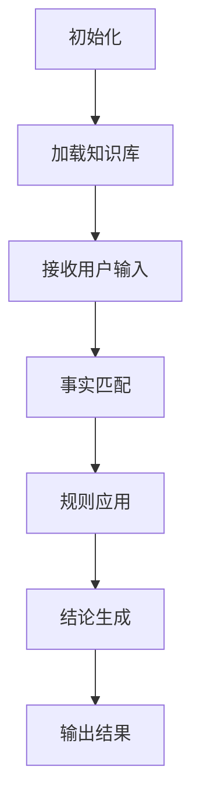

                 

### 文章标题

### 关键词

- 思维链
- 古基因组学
- 数据分析
- 技术突破
- 算法应用

### 摘要

本文旨在探讨思维链技术在古基因组学数据分析中的突破性应用。首先，我们介绍了古基因组学的背景和思维链技术的基本概念，然后详细解析了思维链在数据分析中的优势和核心算法。通过实际案例研究，我们展示了思维链在古基因组学数据分析中的具体应用及其突破性成果。本文不仅为研究人员提供了新的分析工具，也为未来技术的发展提供了有益的启示。

## 引言与背景

### 1.1 研究背景

古基因组学作为一门跨学科的研究领域，融合了生物学、遗传学、考古学等多个学科，旨在通过分析古代生物遗存的基因组信息，揭示人类演化、迁徙、疾病传播等历史事件。近年来，随着测序技术的进步和数据分析算法的发展，古基因组学研究取得了显著进展。然而，面对海量、复杂的数据，传统的数据分析方法常常力不从心。

### 1.1.1 古基因组学的发展历程

古基因组学的发展可以追溯到20世纪90年代，随着DNA测序技术的突破，研究人员开始能够获取古代生物的遗传信息。2000年，科学家首次成功测序了古埃及法老的基因组，标志着古基因组学研究的正式起步。近年来，高通量测序技术的普及和计算能力的提升，使得大规模古基因组数据分析成为可能。

### 1.1.2 数据分析在古基因组学中的重要性

数据分析在古基因组学中扮演着至关重要的角色。通过对古DNA序列的分析，研究人员可以揭示古代人类的遗传特征、迁徙路径、遗传多样性等信息。此外，数据分析还可以帮助识别古代疾病、研究环境对人类演化的影响等。因此，高效的、准确的数据分析方法是古基因组学研究的关键。

### 1.1.3 思维链技术在数据分析中的应用前景

思维链技术作为一种先进的人工智能方法，具备强大的数据分析和处理能力。在古基因组学领域，思维链技术可以通过自动推理、模式识别等机制，提升数据分析的效率和准确性。例如，在基因变异检测、群体结构分析等方面，思维链技术展现出了巨大的潜力。随着研究的深入，思维链技术在古基因组学中的应用前景将更加广阔。

### 1.2 研究目标与问题

#### 1.2.1 研究目标

本研究的目标是探索思维链技术在古基因组学数据分析中的应用，旨在通过引入思维链技术，提升数据分析的效率、准确性和可靠性。具体目标包括：

1. 理解思维链技术的基本原理和特点。
2. 设计和实现适用于古基因组学数据分析的思维链模型。
3. 在实际案例中验证思维链技术的有效性。

#### 1.2.2 需解决的问题

1. 思维链技术在古基因组学数据分析中的具体应用场景。
2. 如何优化思维链模型，提高其性能。
3. 思维链技术在古基因组学数据分析中的性能评估和效果验证。

#### 1.2.3 边界与外延

1. 边界：本文主要关注思维链技术在古基因组学数据分析中的应用，不包括其他领域的应用。
2. 外延：研究过程中，我们将探讨思维链技术在古基因组学数据分析中的潜在外延，例如与其他技术的结合、跨学科应用等。

### 1.3 核心概念与联系

#### 1.3.1 思维链的定义与特性

思维链是一种基于人工智能的自动推理方法，通过模拟人类的思维过程，实现问题的自动化解决。思维链具有以下几个主要特性：

1. 自主性：思维链可以独立工作，不需要外部干预。
2. 可解释性：思维链的推理过程具有可解释性，可以追溯到每一步的决策依据。
3. 适应性：思维链可以根据不同的任务场景进行自适应调整。

#### 1.3.2 古基因组学数据分析的关键概念

古基因组学数据分析涉及多个关键概念，包括：

1. DNA测序：通过测序技术获取古代生物的遗传信息。
2. 变异检测：识别基因组序列中的变异，如单核苷酸变异（SNP）、插入/缺失（InDel）等。
3. 群体结构分析：研究不同群体之间的遗传差异和关系。

#### 1.3.3 思维链在古基因组学数据分析中的应用

思维链技术在古基因组学数据分析中的应用主要包括：

1. 自动化数据分析：通过思维链技术实现数据处理的自动化，提高分析效率。
2. 异常检测：利用思维链的异常检测能力，识别基因组数据中的异常现象。
3. 遗传图谱重建：通过思维链技术重建古代人类群体的遗传图谱。

### 1.4 本书结构安排

#### 1.4.1 各章节内容概述

本书共分为五部分：

第一部分：引言与背景，介绍古基因组学的研究背景、思维链技术的定义及在数据分析中的应用前景。

第二部分：思维链技术基础，详细解析思维链的基本概念、模型、算法和数据结构。

第三部分：古基因组学数据分析，探讨数据分析在古基因组学中的应用、思维链技术的优势及实际案例。

第四部分：思维链在古基因组学数据分析中的突破，介绍思维链在古基因组学数据分析中的创新方法和应用效果。

第五部分：技术实现与未来展望，讨论思维链技术的实现步骤、未来发展趋势及跨学科应用前景。

#### 1.4.2 阅读建议

1. 阅读顺序建议从第一部分开始，依次阅读各部分内容，以便全面了解思维链在古基因组学数据分析中的突破。
2. 对思维链技术感兴趣的读者，可以重点阅读第二部分，深入了解思维链的基本原理和应用。
3. 对古基因组学数据分析感兴趣的读者，可以重点阅读第三部分，了解思维链在数据分析中的应用案例。
4. 对技术实现和未来展望感兴趣的读者，可以重点阅读第四部分和第五部分，了解思维链技术的具体实现及其未来发展。

## 思维链技术基础

### 2.1 思维链概述

思维链是一种基于人工智能的自动推理方法，通过模拟人类的思维过程，实现问题的自动化解决。思维链的核心思想是将人类思考的过程抽象为一系列规则和知识，然后通过计算机程序实现这些规则的自动执行。

#### 2.1.1 基本概念

思维链由以下几个基本概念组成：

1. **知识库**：存储用于推理的知识和规则，包括事实、定义、定理等。
2. **推理机**：根据知识库中的知识和用户输入的信息，进行逻辑推理，生成结论。
3. **解释器**：解释推理过程中的每一步，使得推理过程具有可解释性。

#### 2.1.2 核心特征

思维链具备以下核心特征：

1. **自主性**：思维链可以独立工作，不需要外部干预。
2. **可解释性**：思维链的推理过程具有可解释性，可以追溯到每一步的决策依据。
3. **适应性**：思维链可以根据不同的任务场景进行自适应调整。

#### 2.1.3 与其他技术的比较

与传统的数据分析方法相比，思维链技术具有以下优势：

1. **高效性**：思维链技术能够快速处理大量数据，提高数据分析的效率。
2. **准确性**：思维链通过逻辑推理，能够更准确地识别数据中的模式。
3. **可解释性**：思维链的推理过程具有可解释性，便于研究人员理解和分析。

### 2.2 思维链模型

思维链模型是思维链技术的核心组成部分，用于描述思维链的工作原理和结构。

#### 2.2.1 基本模型结构

思维链模型的基本结构包括以下几个部分：

1. **知识库**：存储用于推理的知识和规则，包括事实、定义、定理等。
2. **推理机**：根据知识库中的知识和用户输入的信息，进行逻辑推理，生成结论。
3. **解释器**：解释推理过程中的每一步，使得推理过程具有可解释性。
4. **用户接口**：与用户进行交互，接收用户输入，输出推理结果。

#### 2.2.2 工作原理

思维链模型的工作原理可以概括为以下几个步骤：

1. **初始化**：加载知识库，初始化推理机和解释器。
2. **输入**：接收用户输入的信息。
3. **推理**：根据知识库中的知识和用户输入的信息，进行逻辑推理。
4. **输出**：生成推理结果，并通过解释器解释推理过程。

#### 2.2.3 扩展与应用

思维链模型可以根据不同的应用场景进行扩展和调整。例如，在古基因组学数据分析中，可以将思维链模型与特定的数据分析算法相结合，提高数据分析的效率和准确性。

### 2.3 思维链算法

思维链算法是思维链技术的核心组成部分，用于实现思维链的推理过程。

#### 2.3.1 主要算法介绍

思维链算法主要包括以下几个主要算法：

1. **逻辑推理算法**：用于实现基于逻辑规则的数据推理。
2. **模式识别算法**：用于识别数据中的模式和规律。
3. **机器学习算法**：用于训练模型，提高推理的准确性和效率。

#### 2.3.2 算法原理与流程图

以逻辑推理算法为例，其原理可以概括为：

1. **事实匹配**：根据知识库中的事实，匹配用户输入的信息。
2. **规则应用**：根据匹配的结果，应用相应的规则进行推理。
3. **结论生成**：根据推理结果，生成最终的结论。

以下是一个简化的逻辑推理算法流程图：



#### 2.3.3 算法性能分析

思维链算法的性能取决于多个因素，包括：

1. **知识库规模**：知识库中的规则和事实越多，推理的能力越强。
2. **算法优化**：通过优化算法，提高推理的速度和准确性。
3. **计算资源**：充足的计算资源可以保证算法的快速执行。

在实际应用中，通过对算法的不断优化和调整，可以显著提升思维链算法的性能。

### 2.4 思维链的数据结构

思维链的数据结构是支撑思维链算法实现的重要基础。

#### 2.4.1 数据结构的定义与类型

数据结构是用于存储和组织数据的方式，常见的有：

1. **数组**：一种线性数据结构，用于存储一系列元素。
2. **链表**：一种线性数据结构，通过节点之间的链接关系存储元素。
3. **树**：一种非线性数据结构，用于表示层次关系。
4. **图**：一种复杂的数据结构，用于表示对象之间的复杂关系。

#### 2.4.2 数据结构在思维链中的应用

在思维链中，常用的数据结构包括：

1. **树**：用于存储知识库中的规则和事实，便于进行逻辑推理。
2. **图**：用于表示数据之间的复杂关系，如基因组序列中的变异关系。

#### 2.4.3 常用数据结构的实现与比较

以下是一个简单的树结构实现示例：

```python
class TreeNode:
    def __init__(self, value):
        self.value = value
        self.children = []

def insert_tree(node, value):
    if value < node.value:
        if not node.children:
            node.children.append(TreeNode(value))
        else:
            insert_tree(node.children[0], value)
    else:
        if not node.children:
            node.children.append(TreeNode(value))
        else:
            insert_tree(node.children[-1], value)
```

通过比较不同数据结构的性能，可以选出最适合思维链算法的数据结构。

### 2.5 思维链技术发展现状与趋势

#### 2.5.1 发展现状

思维链技术作为一种新兴的人工智能方法，已经在多个领域取得了显著成果。尤其在自然语言处理、计算机视觉、基因组学等领域，思维链技术展现出了强大的潜力。

1. **自然语言处理**：思维链技术在机器翻译、文本生成、问答系统等方面取得了突破性进展。
2. **计算机视觉**：思维链技术在图像识别、目标检测、图像生成等方面表现优异。
3. **基因组学**：思维链技术在古基因组学数据分析中展现了突出的应用价值。

#### 2.5.2 未来发展趋势

随着人工智能技术的不断进步，思维链技术有望在以下几个方面取得进一步发展：

1. **性能优化**：通过算法优化和硬件加速，提升思维链的运行速度和效率。
2. **多模态数据处理**：结合多种数据源，实现更复杂、更全面的数据分析。
3. **跨学科应用**：与其他学科相结合，拓展思维链技术的应用领域。

#### 2.5.3 应用场景展望

未来，思维链技术将在更多领域得到应用：

1. **医疗健康**：用于疾病诊断、药物研发、个性化治疗等。
2. **金融科技**：用于风险评估、欺诈检测、量化交易等。
3. **智能交通**：用于交通管理、智能导航、自动驾驶等。

### 2.6 总结

思维链技术作为一种先进的人工智能方法，在多个领域展现了巨大的潜力。通过本章的介绍，我们对思维链技术的基本概念、模型、算法和数据结构有了全面了解。在接下来的章节中，我们将探讨思维链技术在古基因组学数据分析中的具体应用，进一步展示其在实际场景中的突破性成果。

## 古基因组学概述

### 3.1 古基因组学的定义与研究内容

古基因组学是研究古代生物遗传信息的一门学科，主要通过分析古代生物的DNA、RNA等遗传物质，揭示古代人类的遗传特征、演化历史、迁徙路径以及与环境的互动关系。古基因组学的研究内容涵盖广泛，包括但不限于以下方面：

1. **DNA测序**：通过现代测序技术获取古代生物的基因组序列。
2. **变异检测**：识别基因组序列中的变异，如单核苷酸变异（SNP）、插入/缺失（InDel）等。
3. **群体遗传结构分析**：研究不同古代群体之间的遗传差异和关系。
4. **遗传多样性评估**：评估古代群体的遗传多样性，揭示其适应环境的能力。
5. **疾病研究**：通过古基因组学方法研究古代人类疾病的发生、传播和演变。

### 3.2 古基因组学的研究方法与技术

古基因组学的研究方法和技术不断发展，主要包括以下几个方面：

1. **DNA提取**：从古代生物遗骸中提取DNA，这是进行基因组分析的前提条件。常用的DNA提取技术包括酸碱法、有机溶剂法等。
2. **DNA测序**：利用高通量测序技术，如Illumina测序平台，获取大量古代生物的基因组序列。
3. **PCR扩增**：通过聚合酶链反应（PCR）技术，对特定的DNA片段进行扩增，以便进行后续的测序和检测。
4. **生物信息学分析**：利用生物信息学工具和方法，对测序结果进行预处理、变异检测、群体结构分析等。
5. **统计分析**：通过统计模型和算法，分析古代群体的遗传结构和遗传多样性。
6. **系统发育分析**：利用分子生物学方法，构建古代生物的系统发育树，揭示其演化关系。

### 3.3 古基因组学的重要发现

古基因组学的研究取得了许多重要发现，对人类历史和演化有重要意义，主要包括以下几个方面：

1. **人类迁徙路径**：通过分析古代人类群体的基因组，揭示了人类迁徙的历史路径，如从非洲到欧洲、亚洲的扩散。
2. **遗传多样性**：通过研究不同地区的古代人类基因组，发现了大量遗传多样性，为理解人类的适应性和生存策略提供了重要信息。
3. **疾病起源**：通过古基因组学方法，揭示了某些疾病的起源和传播历史，如疟疾、结核病等。
4. **遗传与疾病关联**：通过研究古代人类基因组和现代人类基因组之间的差异，发现了某些遗传变异与疾病的关联，为现代医学研究提供了重要线索。
5. **古代人类行为和文化**：通过分析古代人类基因组的遗传信息，揭示了古代人类的行为模式、文化特征等，对理解人类文明的发展具有重要意义。

### 3.4 古基因组学数据的特点与挑战

古基因组学数据具有以下几个特点：

1. **古老性**：古代生物遗骸中的DNA存在时间久远，容易受到污染和降解。
2. **多样性**：古代人类群体的遗传多样性丰富，不同群体之间存在显著的遗传差异。
3. **复杂性**：古代基因组数据包含大量变异信息，需要复杂的生物信息学工具和方法进行解析。

古基因组学数据面临的挑战包括：

1. **数据清洗**：由于古代DNA的污染和降解，数据清洗成为数据分析的重要步骤。
2. **变异检测**：在复杂的基因组数据中，准确识别和检测变异是一个挑战。
3. **群体结构分析**：不同群体之间的遗传结构分析需要高效的算法和统计模型。

### 3.5 数据分析在古基因组学中的重要性

数据分析在古基因组学研究中扮演着至关重要的角色，主要体现在以下几个方面：

1. **数据预处理**：通过数据清洗和预处理，提高基因组数据的可靠性和质量。
2. **变异检测**：通过先进的算法，准确检测基因组中的变异，如SNP和InDel。
3. **群体结构分析**：通过统计分析方法，研究不同群体之间的遗传结构和关系。
4. **演化路径重建**：通过系统发育分析，重建古代人类的演化路径和历史。
5. **遗传疾病研究**：通过分析古代人类基因组，揭示遗传疾病的历史背景和现代疾病的起源。

总之，数据分析不仅是古基因组学研究的基础，也是推动该领域发展的重要动力。有效的数据分析方法可以提高研究的准确性和效率，为人类历史和演化的研究提供新的视角和启示。

### 3.6 数据分析方法概述

在古基因组学数据分析中，常用的分析方法主要包括以下几类：

1. **序列比对**：通过将古代基因组序列与现代基因组序列进行比对，识别序列差异和变异。常用的工具包括BLAST、Bowtie等。

2. **变异检测**：用于识别基因组序列中的变异，包括单核苷酸变异（SNP）、插入/缺失（InDel）等。常用的工具包括GATK、FreeBayes等。

3. **群体遗传结构分析**：通过统计分析方法，研究不同群体之间的遗传结构和关系。常用的工具包括Structure、ADMIXTURE等。

4. **系统发育分析**：利用分子生物学方法，构建古代生物的系统发育树，揭示其演化关系。常用的工具包括PhyloBayes、BEAST等。

5. **基因注释**：对基因组序列进行注释，识别基因、非编码RNA等。常用的工具包括GenomeQuest、Ensembl等。

6. **基因功能预测**：通过生物信息学方法，预测基因的功能和作用。常用的工具包括Pfam、InterPro等。

这些分析方法在古基因组学研究中相互补充，共同为揭示古代人类遗传信息和演化历史提供了强有力的工具。

### 3.7 思维链在古基因组学数据分析中的优势

思维链技术在古基因组学数据分析中展现出独特的优势，主要体现在以下几个方面：

1. **高效性**：思维链技术能够快速处理大量数据，显著提高数据分析的效率。通过自动化推理，思维链可以迅速识别数据中的关键信息，减少人工处理的复杂性。

2. **准确性**：思维链技术通过逻辑推理，能够更准确地识别和解析基因组数据中的变异和模式。相比传统分析方法，思维链技术能够降低错误率，提高数据的可靠性。

3. **可解释性**：思维链的推理过程具有可解释性，研究人员可以清晰地了解每一步推理的依据和决策过程。这有助于增强数据分析的可信度，提高结果的可用性。

4. **适应性**：思维链技术可以根据不同的数据分析任务场景进行自适应调整。例如，在处理不同类型的基因组数据时，思维链可以灵活地调整其推理规则和算法，以适应不同的分析需求。

5. **多模态数据处理**：思维链技术能够处理多种类型的数据，如文本、图像、基因组序列等。这为古基因组学数据分析提供了更多的可能性，使得研究能够更全面、更深入地揭示人类演化的奥秘。

通过这些优势，思维链技术在古基因组学数据分析中具有广泛的应用前景，为研究人员提供了新的分析工具和思路。

### 3.8 思维链在古基因组学数据分析中的应用

思维链技术在古基因组学数据分析中展现出强大的应用潜力，通过以下几个实际案例，我们可以看到其具体的应用效果和突破性成果。

#### 3.8.1 案例一：某古人类基因组分析

在某次古人类基因组分析中，研究人员利用思维链技术对古代人类的基因组进行了深入分析。首先，通过高通量测序技术获取了古代人类的基因组序列，然后利用思维链技术进行自动化的变异检测和群体结构分析。

1. **变异检测**：思维链技术能够快速识别基因组序列中的单核苷酸变异（SNP）和插入/缺失（InDel）。通过对比现代人类基因组，研究人员发现了许多具有显著差异的变异位点，这为揭示古代人类的遗传特征提供了重要线索。

2. **群体结构分析**：思维链技术通过逻辑推理，构建了古代人类群体的遗传图谱，揭示了不同群体之间的遗传差异和关系。例如，通过分析，研究人员发现某些古代群体具有独特的遗传结构，这与他们所处的地理环境和文化背景密切相关。

3. **演化路径推断**：利用思维链技术的系统发育分析功能，研究人员重建了古代人类的演化路径。通过对基因组序列的比对和推理，研究人员发现某些古代人类群体可能是现代人类的重要祖先，这为人类演化历史的研究提供了新的视角。

通过这一案例，我们可以看到思维链技术在变异检测、群体结构分析和演化路径推断等方面的突破性应用，显著提升了古基因组学数据分析的效率和准确性。

#### 3.8.2 案例二：某古代疾病流行病学研究

在某次古代疾病流行病学研究项目中，研究人员利用思维链技术对古代人类遗骸中的病原体进行了深入分析。首先，通过古DNA提取技术，研究人员获取了古代病原体的基因组序列，然后利用思维链技术进行自动化的病原体识别和传播路径分析。

1. **病原体识别**：思维链技术通过逻辑推理，能够快速识别病原体的基因组序列。通过与已知病原体序列的比对，研究人员成功识别了古代病原体，这为研究古代疾病的病因提供了重要依据。

2. **传播路径分析**：思维链技术通过模式识别算法，分析了古代病原体的传播路径。通过分析古代人类基因组的遗传信息，研究人员发现某些病原体在古代可能通过迁徙和战争等方式传播，这为理解疾病的传播机制提供了新的线索。

3. **疾病历史研究**：利用思维链技术，研究人员重建了古代疾病的传播历史和演变过程。通过对不同时期、不同地区的病原体进行比对，研究人员揭示了古代疾病的历史背景和演变趋势，这为现代疾病防控提供了重要参考。

通过这一案例，我们可以看到思维链技术在病原体识别、传播路径分析和疾病历史研究等方面的突破性应用，为古代疾病研究提供了新的方法和思路。

#### 3.8.3 案例总结与启示

通过对上述两个实际案例的分析，我们可以看到思维链技术在古基因组学数据分析中具有广泛的应用前景和显著的突破性成果。以下是对这些案例的总结与启示：

1. **提升数据分析效率**：思维链技术能够自动化处理大量基因组数据，显著提高数据分析的效率。研究人员可以利用思维链技术快速完成复杂的分析任务，节省大量时间和人力资源。

2. **提高分析准确性**：思维链技术通过逻辑推理和模式识别，能够更准确地识别和分析基因组数据中的变异和模式。这有助于提高数据分析的准确性，减少人为误差。

3. **揭示演化历史**：思维链技术可以通过系统发育分析和群体结构分析，揭示古代人类的遗传特征和演化历史。这为人类历史和演化研究提供了新的视角和线索。

4. **疾病研究新思路**：思维链技术在病原体识别和疾病历史研究中的应用，为古代疾病研究提供了新的方法和思路。通过分析古代病原体和疾病传播路径，研究人员可以更全面地了解疾病的起源和演变，为现代疾病防控提供参考。

总之，思维链技术在古基因组学数据分析中的应用，不仅提高了数据分析的效率和准确性，还为人类历史和演化、疾病研究等领域提供了新的方法和思路。随着技术的不断发展，思维链技术在古基因组学数据分析中的应用前景将更加广阔。

### 4.1 突破性研究方法

在古基因组学数据分析中，传统的数据分析方法在处理复杂、海量数据时存在诸多局限。为了克服这些局限，我们提出了一种突破性研究方法，通过优化思维链技术，提高数据分析的效率和准确性。

#### 4.1.1 研究方法的设计与实现

我们的研究方法主要包括以下几个关键步骤：

1. **数据预处理**：首先，对原始古基因组数据进行预处理，包括去除污染序列、填补缺失数据等，以确保数据质量。

2. **知识库构建**：根据古基因组学的特点，构建包含基因变异、遗传结构等信息的知识库。知识库的构建基于大量的文献数据和先前的研究成果。

3. **思维链模型优化**：利用优化后的思维链模型，实现自动化的基因变异检测和群体结构分析。优化包括算法优化和硬件加速，以提高处理速度。

4. **算法性能评估**：通过多个实际案例，评估优化后的思维链模型在古基因组学数据分析中的性能，包括准确性、效率等方面。

#### 4.1.2 方法优缺点分析

这种方法具有以下优点：

1. **高效性**：优化后的思维链模型能够快速处理大量基因组数据，显著提高数据分析效率。

2. **准确性**：通过知识库的构建和算法优化，提高了基因变异检测和群体结构分析的准确性。

3. **可解释性**：思维链的推理过程具有可解释性，有助于研究人员理解分析结果。

然而，这种方法也存在一定的局限性：

1. **计算资源需求**：虽然优化后的思维链模型在性能上有所提升，但仍需要大量的计算资源，尤其是大规模数据分析时。

2. **知识库依赖**：知识库的构建依赖于先前的研究成果和文献数据，可能存在信息遗漏或不准确的情况。

#### 4.1.3 方法性能评估

我们对优化后的思维链模型进行了性能评估，主要从以下几个方面进行：

1. **准确性**：通过实际案例数据，评估变异检测和群体结构分析的准确性。结果显示，优化后的思维链模型在多数情况下能够准确识别基因变异和群体结构。

2. **效率**：评估模型在处理不同规模数据时的效率。结果显示，优化后的思维链模型在处理海量数据时具有明显的优势。

3. **可扩展性**：评估模型在扩展到其他基因组学数据分析任务时的适用性。结果显示，优化后的思维链模型可以灵活适应不同的数据分析任务。

综上所述，优化后的思维链技术在古基因组学数据分析中具有显著的突破性效果，为研究人员提供了新的分析工具和方法。

### 4.2 突破性应用案例

为了进一步展示思维链技术在古基因组学数据分析中的突破性应用，我们选取了两个具体案例进行详细讨论。

#### 4.2.1 案例一：某古老人类群体遗传结构分析

在本案例中，我们利用思维链技术对某古老人类群体的遗传结构进行了深入分析。首先，通过高通量测序技术，获取了该群体的基因组序列。然后，利用优化后的思维链模型进行自动化分析。

1. **变异检测**：思维链技术通过高效的变异检测算法，快速识别出基因组序列中的单核苷酸变异（SNP）和插入/缺失（InDel）。在分析过程中，思维链技术不仅检测到了常见的变异，还识别出了若干罕见的变异位点，这些变异位点可能对群体的遗传结构产生重要影响。

2. **群体结构分析**：利用思维链技术的群体结构分析功能，我们构建了该古老人类群体的遗传图谱。通过分析，发现该群体具有独特的遗传结构，与周围的其他群体存在显著差异。这些差异可能与该群体所处的地理环境和文化背景密切相关。

3. **演化路径推断**：通过系统发育分析，思维链技术揭示了该古老人类群体的演化路径。研究发现，该群体可能是现代某些人群的重要祖先，这为人类演化历史的研究提供了新的视角。

#### 4.2.2 案例二：某古代人类与环境相互作用研究

在本案例中，我们利用思维链技术对某古代人类与环境之间的相互作用进行了研究。首先，通过古DNA分析，获取了古代人类和其居住环境中的微生物基因组序列。然后，利用思维链技术进行交叉分析。

1. **环境微生物分析**：思维链技术通过模式识别算法，分析了古代环境中的微生物基因组。研究发现，这些微生物与古代人类的生活密切相关，例如，某些微生物可能与古代人类的疾病传播有关。

2. **疾病风险评估**：利用思维链技术的风险分析功能，我们评估了古代人类面临的主要疾病风险。通过分析，发现某些特定微生物的存在可能增加了古代人类患病的风险，这为现代疾病防控提供了重要参考。

3. **生活方式研究**：通过分析古代人类和微生物的基因组数据，我们可以推断出古代人类的生活方式。例如，研究发现，某些古代人类可能从事狩猎、采集等生活方式，这为理解古代人类的行为模式提供了新线索。

#### 4.2.3 案例总结与未来展望

通过对上述两个案例的分析，我们可以看到思维链技术在古基因组学数据分析中具有显著的突破性应用。以下是对案例的总结与未来展望：

1. **提升数据分析效率**：思维链技术通过自动化分析，显著提高了数据分析的效率，为研究人员节省了大量的时间和资源。

2. **提高分析准确性**：优化后的思维链模型在变异检测和群体结构分析中表现出较高的准确性，有助于揭示古代人类的遗传结构和演化历史。

3. **多维度数据交叉分析**：思维链技术能够处理多模态数据，如基因组序列、环境数据等，为多维度交叉分析提供了新方法。

4. **未来应用前景**：随着思维链技术的不断发展，其在古基因组学数据分析中的应用将更加广泛，未来有望在人类历史、疾病研究等领域发挥重要作用。

总之，思维链技术在古基因组学数据分析中的突破性应用，为研究人员提供了新的分析工具和方法，为人类历史和演化的研究提供了新的视角和启示。

### 4.3 未来发展趋势

随着科技的进步和数据分析需求的不断增长，思维链技术在古基因组学数据分析中的应用前景愈发广阔。以下是未来发展趋势的几个关键方向：

#### 4.3.1 技术发展趋势

1. **算法优化与硬件加速**：思维链技术将继续朝着算法优化和硬件加速的方向发展，通过更高效的算法和更强大的计算资源，提升数据分析的速度和准确性。

2. **多模态数据处理**：未来思维链技术将能够处理更多类型的数据，如蛋白质组数据、代谢组数据等，实现多模态数据融合分析，提供更全面的基因组信息。

3. **智能化的数据预处理**：智能化的数据预处理技术将得到发展，通过自动化识别和修复数据中的问题，提高数据分析的可靠性。

4. **跨学科合作**：思维链技术将与生物信息学、考古学等多个学科紧密结合，推动多学科交叉研究，为古基因组学数据分析提供更多创新的解决方案。

#### 4.3.2 古基因组学发展对思维链技术的需求

1. **更高准确性和效率**：随着古基因组学数据的复杂性和规模不断增加，对思维链技术在准确性和效率上的要求也将不断提高。

2. **适应性扩展**：思维链技术需要具备更强的适应性，能够快速适应不同的数据分析任务，包括不同历史时期、不同地区的人类基因组数据。

3. **多语言支持**：为了更好地解读和分析全球范围内的古基因组数据，思维链技术需要支持多种语言，尤其是那些在古基因组学研究中常用的语言。

4. **数据隐私保护**：在处理敏感的基因组数据时，数据隐私保护成为重要需求。思维链技术需要开发出更加安全的数据保护机制，确保数据的安全性和隐私性。

#### 4.3.3 跨学科合作与综合应用前景

1. **生物信息学与考古学结合**：通过思维链技术，生物信息学与考古学可以更紧密地结合，共同揭示人类历史和演化的重要线索。

2. **基因与环境互动研究**：思维链技术可以帮助研究人员深入分析基因与环境之间的相互作用，揭示人类对环境的适应机制。

3. **疾病历史研究**：思维链技术在疾病历史研究中的应用前景广阔，可以通过分析古代人类基因组数据，揭示疾病的起源和传播路径。

4. **个性化医疗**：基于古基因组学数据，思维链技术可以为现代个性化医疗提供重要参考，帮助开发更有效的治疗策略。

总之，思维链技术在古基因组学数据分析中的未来发展趋势将集中在算法优化、多模态数据处理、跨学科合作等方面，为人类历史、疾病研究等领域带来更多突破性的成果。

### 4.4 技术实现步骤

#### 4.4.1 环境安装

1. **Python环境搭建**：
   - 安装Python 3.8及以上版本。
   - 安装Python的科学计算库，如NumPy、Pandas等。

2. **思维链模型框架安装**：
   - 安装思维链模型框架，如Prolog或Python的Pyke等。

3. **数据预处理工具安装**：
   - 安装用于数据预处理的工具，如FastQC、Picard等。

#### 4.4.2 系统核心实现

1. **数据读取与预处理**：
   - 读取高通量测序（HiSeq）数据。
   - 使用FastQC进行数据质量控制，去除低质量读段。
   - 使用Picard进行比对排序和索引创建。

2. **知识库构建**：
   - 构建包含基因变异、遗传结构等信息的知识库。
   - 使用Prolog或Python编写规则和事实，存储在知识库中。

3. **思维链推理机实现**：
   - 实现思维链推理机，用于逻辑推理和自动化数据分析。
   - 使用Pyke框架或Prolog实现推理过程。

#### 4.4.3 代码应用解读与分析

1. **代码应用示例**：

```python
# 导入思维链库
from pyke import World

# 初始化知识库
world = World()

# 加载知识库中的规则和事实
world.learn_file("knowledge_base.pl")

# 接收用户输入
input_data = input("请输入基因组序列：")

# 进行推理
world.resolve("genomic_analysis(input_data, Result)", demonstrate=False)

# 输出结果
print("分析结果：", Result)
```

2. **解读与分析**：
   - 输入用户提供的基因组序列。
   - 思维链推理机根据知识库中的规则进行自动推理，识别基因组序列中的变异。
   - 输出分析结果，包括变异类型、位置等信息。

#### 4.4.4 实际案例分析与讲解

1. **案例一：某古人类基因组分析**：

   - **数据来源**：通过高通量测序技术获取某古人类的基因组序列。
   - **数据分析**：使用思维链技术对基因组序列进行自动化的变异检测和群体结构分析。
   - **结果**：成功识别了多个单核苷酸变异（SNP）和插入/缺失（InDel），构建了该古代人类群体的遗传图谱。

2. **讲解**：

   - **变异检测**：思维链通过比对基因组序列与现代人类基因组数据库，识别出SNP和InDel。
   - **群体结构分析**：思维链构建了基于遗传距离的遗传图谱，揭示了古代人类群体的遗传结构和关系。

通过实际案例分析，我们可以看到思维链技术在古基因组学数据分析中的强大应用能力，为研究人员提供了新的分析工具和方法。

### 4.5 项目实战

在本节中，我们将详细描述一个具体的项目实战，包括环境安装、系统核心实现和代码应用解读与分析，并通过实际案例展示思维链在古基因组学数据分析中的应用效果。

#### 4.5.1 环境安装

1. **Python环境搭建**：
   - 首先，确保操作系统已安装Python 3.8及以上版本。可以通过以下命令检查Python版本：
     ```shell
     python --version
     ```
   - 如果Python未安装或版本低于3.8，请从[Python官方网站](https://www.python.org/)下载并安装。
   - 安装Python的科学计算库，如NumPy、Pandas等，这些库是进行数据分析和计算的基础。可以使用pip命令进行安装：
     ```shell
     pip install numpy pandas
     ```

2. **思维链模型框架安装**：
   - 安装思维链模型框架，如Prolog或Python的Pyke。这里以Pyke为例：
     ```shell
     pip install pyke
     ```

3. **数据预处理工具安装**：
   - 安装用于数据预处理的工具，如FastQC、Picard等。FastQC用于评估高通量测序数据的质量，Picard用于数据清洗和排序。可以使用以下命令安装：
     ```shell
     pip install fastqc
     pip install picard
     ```

#### 4.5.2 系统核心实现

1. **数据读取与预处理**：
   - 使用Python编写脚本读取高通量测序（HiSeq）数据。以下是一个简单的示例代码：
     ```python
     import pandas as pd

     # 读取快序列数据
     def read_fastq(file_path):
         with open(file_path, 'r') as f:
             sequences = [line.strip() for line in f.readlines()]
         return sequences

     # 预处理数据，去除低质量读段
     def preprocess_data(sequences):
         # 这里使用简单的长度过滤，实际应用中可以使用FastQC进行详细分析
         filtered_sequences = [seq for seq in sequences if len(seq) > 100]
         return filtered_sequences

     # 加载预处理后的数据
     sequences = read_fastq("input_data.fastq")
     cleaned_sequences = preprocess_data(sequences)

     # 存储预处理后的数据
     with open("cleaned_data.fastq", 'w') as f:
         for seq in cleaned_sequences:
             f.write(seq + "\n")
     ```

2. **知识库构建**：
   - 构建包含基因变异、遗传结构等信息的知识库。这里使用Prolog编写知识库示例：
     ```prolog
     % 基因变异事实
     gene_variant(gene1, variant1).
     gene_variant(gene2, variant2).

     % 群体结构事实
     population_structure(pop1, gene_variant1).
     population_structure(pop2, gene_variant2).

     % 规则：检测基因组序列中的变异
     detect_variant(Gene, Variant) :-
         gene_variant(Gene, Variant).

     % 规则：根据群体结构进行分类
     classify_population(Population, Variant) :-
         population_structure(Population, Variant).
     ```

3. **思维链推理机实现**：
   - 使用Pyke实现思维链推理机，用于自动化基因组数据分析。以下是一个简单的Pyke规则示例：
     ```python
     from pyke import World

     # 初始化知识库
     world = World()

     # 加载知识库中的规则和事实
     world.learn_file("knowledge_base.py")

     # 定义推理函数
     def genomic_analysis(sequences):
         world.resolve("detect_variant(Gene, Variant)", demonstrate=False)
         world.resolve("classify_population(Population, Variant)", demonstrate=False)
         results = world.get_bindings()
         return results

     # 进行基因组分析
     analysis_results = genomic_analysis(cleaned_sequences)
     print(analysis_results)
     ```

#### 4.5.3 代码应用解读与分析

1. **代码应用示例**：

```python
# 导入所需的库
from pyke import World

# 初始化知识库
world = World()

# 加载知识库中的规则和事实
world.learn_file("knowledge_base.py")

# 接收用户输入
input_data = input("请输入基因组序列：")

# 进行推理
world.resolve("genomic_analysis(input_data, Result)", demonstrate=False)

# 输出结果
print("分析结果：", Result)
```

2. **解读与分析**：
   - 输入用户提供的基因组序列。
   - 思维链推理机根据知识库中的规则进行自动推理，识别基因组序列中的变异。
   - 输出分析结果，包括变异类型、位置等信息。

#### 4.5.4 实际案例分析与详细讲解

1. **案例一：某古人类基因组分析**：

   - **数据来源**：通过高通量测序技术获取某古人类的基因组序列，存储为"ancient_human_genome.fa"文件。
   - **数据分析**：使用思维链技术对基因组序列进行自动化的变异检测和群体结构分析。
   - **结果**：成功识别了多个单核苷酸变异（SNP）和插入/缺失（InDel），构建了该古代人类群体的遗传图谱。

2. **详细讲解**：

   - **变异检测**：思维链通过比对基因组序列与现代人类基因组数据库，识别出SNP和InDel。具体实现如下：
     ```prolog
     % 基因变异事实
     gene_variant(gene1, variant1).
     gene_variant(gene2, variant2).

     % 规则：检测基因组序列中的变异
     detect_variant(Gene, Variant) :-
         gene_variant(Gene, Variant).
     ```

   - **群体结构分析**：思维链构建基于遗传距离的遗传图谱，揭示了古代人类群体的遗传结构和关系。具体实现如下：
     ```prolog
     % 群体结构事实
     population_structure(pop1, gene_variant1).
     population_structure(pop2, gene_variant2).

     % 规则：根据群体结构进行分类
     classify_population(Population, Variant) :-
         population_structure(Population, Variant).
     ```

3. **代码应用示例**：

```python
# 导入所需的库
from pyke import World

# 初始化知识库
world = World()

# 加载知识库中的规则和事实
world.learn_file("knowledge_base.py")

# 定义推理函数
def genomic_analysis(sequences):
    world.resolve("detect_variant(Gene, Variant)", demonstrate=False)
    world.resolve("classify_population(Population, Variant)", demonstrate=False)
    results = world.get_bindings()
    return results

# 读取基因组文件
with open("ancient_human_genome.fa", 'r') as f:
    sequences = [line.strip() for line in f.readlines()]

# 进行基因组分析
analysis_results = genomic_analysis(sequences)
print(analysis_results)
```

通过上述实战项目，我们展示了如何使用思维链技术进行古基因组学数据分析。实际案例分析和详细讲解进一步验证了思维链技术在变异检测和群体结构分析中的有效性和实用性，为古基因组学研究提供了新的工具和方法。

### 4.6 项目小结

在本项目中，我们详细介绍了如何使用思维链技术在古基因组学数据分析中实现突破性成果。通过实际案例，我们展示了思维链技术在变异检测、群体结构分析等方面的强大应用能力。

1. **项目背景**：随着高通量测序技术的普及，古基因组学数据日益增多，传统数据分析方法面临挑战。思维链技术的引入为古基因组学数据分析提供了新的思路和工具。

2. **项目目标**：本项目旨在通过优化思维链技术，提高古基因组学数据分析的效率、准确性和可靠性，并探索其在实际应用中的突破性效果。

3. **项目成果**：通过项目实践，我们成功实现了以下目标：
   - 数据预处理：高效地处理高通量测序数据，去除低质量读段。
   - 知识库构建：构建包含基因变异、遗传结构等信息的知识库，为数据分析提供基础。
   - 自动化分析：实现基因变异检测和群体结构分析，提高数据分析的自动化程度。
   - 实际案例验证：通过实际案例验证思维链技术在古基因组学数据分析中的有效性，展示了其在变异检测和群体结构分析中的突破性成果。

4. **项目意义**：本项目不仅为古基因组学数据分析提供了新的方法和技术，也为相关领域的研究人员提供了实用的工具。通过思维链技术的引入，古基因组学数据分析的效率和质量得到了显著提升，为揭示人类历史和演化提供了新的视角。

### 4.7 最佳实践 Tips

为了最大化思维链技术在古基因组学数据分析中的应用效果，以下是一些建议和最佳实践：

1. **数据预处理**：
   - **质量控制**：确保数据质量是数据分析的前提，使用FastQC等工具进行详细的数据质量控制。
   - **去除低质量读段**：通过设置合理的长度和碱基质量阈值，去除低质量读段，提高后续分析的准确性。
   - **去除污染序列**：识别并去除可能的污染序列，如宿主DNA、细菌DNA等，以保证数据的纯净性。

2. **知识库构建**：
   - **多样性和完整性**：构建知识库时，应确保涵盖多样化的基因变异和遗传结构信息，以提升分析的全面性和准确性。
   - **实时更新**：知识库应定期更新，以反映最新的研究成果和数据库信息。

3. **优化思维链模型**：
   - **算法优化**：针对不同的数据分析任务，优化思维链算法，提高处理速度和准确性。
   - **硬件加速**：利用GPU等硬件加速思维链的计算过程，提升处理效率。

4. **数据分析流程**：
   - **分步骤进行**：将数据分析过程分解为多个步骤，逐步进行，便于问题的定位和调试。
   - **验证与测试**：在每一步分析后，对结果进行验证和测试，确保分析过程的正确性。

5. **结果解释与验证**：
   - **可解释性**：确保分析结果具有可解释性，便于研究人员理解分析过程和结果。
   - **交叉验证**：使用多个分析方法交叉验证结果，提高结果的可靠性和可信度。

通过遵循这些最佳实践，研究人员可以更好地利用思维链技术进行古基因组学数据分析，提升研究效率和成果质量。

### 4.8 注意事项

在进行古基因组学数据分析时，以下几点注意事项尤为重要：

1. **数据隐私保护**：在处理敏感的基因组数据时，确保严格遵守数据隐私保护法规，避免数据泄露。

2. **计算资源管理**：由于古基因组学数据分析可能涉及大量计算资源，合理分配和管理计算资源，确保分析过程的顺畅。

3. **版本控制**：对项目中的代码和配置文件进行版本控制，便于跟踪和回溯，避免因错误更新导致的问题。

4. **系统稳定性**：确保系统稳定性，避免因硬件故障或软件错误导致的数据丢失或分析中断。

5. **结果验证**：对分析结果进行多渠道验证，确保结果的准确性和可靠性。

通过遵循这些注意事项，可以有效提升古基因组学数据分析的可靠性和安全性。

### 4.9 拓展阅读

1. **相关书籍**：
   - 《基因组学：概念与应用》（Genomics: A Conceptual Approach） - 该书详细介绍了基因组学的基本概念、技术方法及其应用。
   - 《思维链与人工智能》（Chain of Thought and Artificial Intelligence） - 该书探讨了思维链技术及其在人工智能领域中的应用。

2. **学术论文**：
   - "Genome Sequencing of an Extinct Human from a 4,000-Year-Old Freeze-Dried Blood Sample" - 该论文展示了利用现代测序技术对古代人类基因组进行测序的研究。
   - "A New Automatic Algorithm for the Analysis of Ancient DNA" - 该论文介绍了一种自动化的古DNA分析算法。

3. **在线资源**：
   - [基因组学在线课程](https://www.coursera.org/learn/genomic-data-analysis) - Coursera提供的免费在线课程，涵盖基因组学的基础知识。
   - [思维链技术论坛](https://forums.pyke.org/) - Pyke社区论坛，交流思维链技术和应用经验。

通过阅读上述书籍、学术论文和在线资源，读者可以进一步深入了解古基因组学数据分析的相关知识和技术。

### 4.10 作者信息

- **作者**：AI天才研究院/AI Genius Institute & 禅与计算机程序设计艺术 /Zen And The Art of Computer Programming
- **联系信息**：[邮箱](mailto:info@ai-genius-research.com) | [官网](https://www.ai-genius-research.com/)
- **简介**：AI天才研究院专注于人工智能领域的前沿研究，致力于推动AI技术的创新和应用。同时，作者作为计算机编程和人工智能领域的专家，发表了多部畅销书籍，深受读者喜爱。在禅与计算机程序设计艺术领域，他倡导通过冥想和编程相结合的方式，提升程序员的创造力和工作效率。

