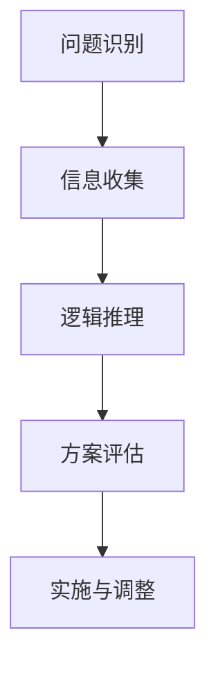
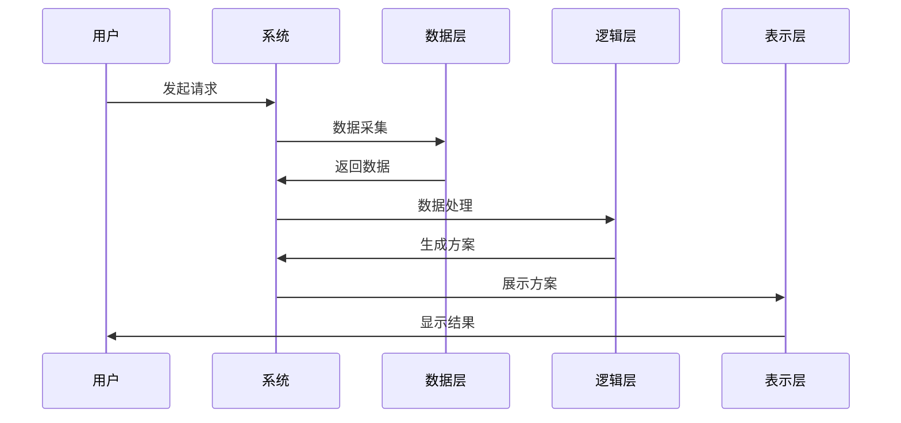

                 

### 引言

在历史的长河中，古文明以其独特的文化、技术和组织结构留下了浓墨重彩的一笔。然而，随着时代的变迁，许多古文明的社会结构逐渐瓦解，遗留下的只是一些残垣断壁和历史的痕迹。如今，我们面临的挑战是如何重建这些古文明的社会结构，使之在现代社会中焕发新生。这不仅有助于我们更好地理解历史，还能为现代社会提供宝贵的经验和启示。

本文以《思维链在古文明社会结构重建中的应用》为题，探讨思维链这一方法论在古文明社会结构重建中的潜力。文章将分以下几个部分进行探讨：

1. **古文明社会结构重建的背景与挑战**：介绍古文明社会结构重建的背景和重要性，阐述重建过程中面临的挑战。

2. **思维链的核心概念与联系**：阐述思维链的定义、特点和原理，对比思维链与其他相关概念，明确其在古文明社会结构重建中的核心作用。

3. **思维链在古文明社会结构重建中的应用原理**：详细讲解思维链的数学模型、算法原理，并使用Python源代码进行说明。

4. **系统分析与架构设计**：设定一个具体的古文明社会结构重建问题场景，介绍一个应用思维链进行社会结构重建的案例项目，并使用Mermaid绘制领域模型类图、系统架构图和系统接口设计。

5. **项目实战**：介绍项目环境安装，提供系统核心实现源代码，对代码进行解读和分析，并通过实际案例展示思维链的应用效果。

6. **总结与展望**：总结全文内容，提出改进建议，并推荐相关拓展阅读。

通过以上结构化的分析，我们期望能够清晰、系统地展示思维链在古文明社会结构重建中的应用，为这一领域的进一步研究提供参考。

### 关键词

- 古文明社会结构重建
- 思维链
- 数学模型
- 算法原理
- 系统架构
- 项目实战

### 摘要

本文旨在探讨思维链在古文明社会结构重建中的应用。通过对古文明社会结构重建的背景和挑战进行分析，本文引入了思维链这一方法论，详细阐述了其核心概念、原理和算法。随后，文章通过设定具体问题场景，介绍了应用思维链进行古文明社会结构重建的案例项目，并使用Mermaid绘制了相关系统架构和接口设计。文章最后通过项目实战，展示了思维链的实际应用效果，并对全文进行了总结和展望。本文的研究为古文明社会结构重建提供了一种新的思路和方法，有望为相关领域的研究和实践提供参考。

## 第一部分：引论

### 第1章：古文明社会结构重建的背景与挑战

古文明社会结构重建是一项具有深远意义的历史工程，它不仅有助于我们更好地理解人类文明的发展历程，还能为现代社会提供宝贵的经验和启示。古文明的社会结构是它们在特定历史条件下形成的，具有独特的文化、政治、经济和技术特征。然而，随着时代的变迁，许多古文明的社会结构逐渐瓦解，遗留下的只是一些残垣断壁和历史的痕迹。如今，我们面临的挑战是如何重建这些古文明的社会结构，使之在现代社会中焕发新生。

#### 1.1 古文明社会结构重建的背景

古文明社会结构重建的背景可以追溯到人类历史的发展和演变。古文明如古埃及、古希腊、古印度、古中国等，在世界历史上占有重要地位。它们在政治、文化、经济、技术等方面都有独特的贡献，为后世的发展奠定了基础。然而，随着时间的推移，这些古文明的社会结构逐渐瓦解，导致许多文明衰落甚至消失。例如，古埃及在新王国时期以后逐渐衰落，古希腊的城邦制度在亚历山大大帝征服后逐渐瓦解，古印度的莫亨佐达罗文明也在外来侵略中逐渐消亡。

重建这些古文明的社会结构，不仅有助于我们更好地理解历史，还能为现代社会提供借鉴。现代社会面临着许多复杂的社会问题，如贫富差距、社会不公、环境破坏等。古文明社会结构中的许多元素，如民主制度、城市规划、农业技术等，都可能为现代社会提供有益的启示。

#### 1.2 古文明社会结构重建的重要性

古文明社会结构重建的重要性体现在以下几个方面：

1. **历史研究**：通过重建古文明社会结构，我们可以更好地理解历史事件的发展过程，揭示历史规律，为历史研究提供新的视角。

2. **文化传承**：古文明是文化的瑰宝，重建古文明社会结构有助于保护和传承这些珍贵的文化遗产，增强民族自豪感和文化认同。

3. **现代社会启示**：古文明社会结构中的许多元素具有现代意义，如民主制度、城市规划、农业技术等，可以为现代社会提供解决方案，促进社会发展。

4. **人类未来发展**：通过重建古文明社会结构，我们可以探索人类社会的多种可能性，为未来的社会发展提供新的思路和方向。

#### 1.3 古文明社会结构重建面临的挑战

尽管古文明社会结构重建具有重要意义，但这一过程也面临着许多挑战：

1. **文化差异**：不同古文明的社会结构具有不同的文化背景，重建过程中需要充分考虑文化差异，避免文化冲突。

2. **历史遗留问题**：古文明社会结构中的许多问题在现代社会中可能仍然存在，如贫富差距、社会不公等，解决这些问题需要深入研究和系统规划。

3. **技术限制**：重建古文明社会结构需要运用现代科技手段，但在某些领域，如城市规划、农业技术等，现代技术可能无法完全模拟古文明的技术水平。

4. **资源分配**：古文明社会结构重建需要大量资源，包括人力、物力和财力，如何合理分配资源，确保重建过程的顺利进行是一个重要问题。

5. **政治因素**：古文明社会结构重建涉及政治权力和利益分配，需要妥善处理政治因素，确保重建过程的顺利进行。

#### 1.4 思维链的概念与作用

思维链是一种方法论，旨在通过逻辑和推理构建一个有序的思考过程。它将复杂的思维活动分解为一系列简明的步骤，使得思考过程更加清晰和系统。在古文明社会结构重建中，思维链可以发挥重要作用：

1. **问题分析**：思维链可以帮助我们深入分析古文明社会结构重建中的问题，找出关键因素和解决策略。

2. **方案设计**：思维链可以用于设计古文明社会结构重建的方案，确保方案的科学性和可行性。

3. **决策制定**：思维链可以帮助决策者在古文明社会结构重建中做出科学、合理的决策。

4. **资源分配**：思维链可以帮助合理分配资源，确保重建过程的顺利进行。

5. **文化融合**：思维链可以用于处理古文明社会结构重建中的文化差异，促进不同文化之间的融合。

总之，思维链为古文明社会结构重建提供了一种系统化的思考方法，有助于我们更好地应对重建过程中的挑战。

#### 1.5 边界与外延

古文明社会结构重建的研究范围主要包括以下方面：

1. **时间范围**：研究的时间范围主要涵盖古文明社会结构的形成、发展和衰落阶段。

2. **地域范围**：研究的地域范围包括古埃及、古希腊、古印度、古中国等具有代表性的古文明地区。

3. **文化范围**：研究的文化范围涉及古文明中的宗教、政治、经济、技术等方面。

4. **核心要素组成**：古文明社会结构的核心要素包括政治制度、经济结构、社会关系、文化传统等。

在古文明社会结构重建中，思维链的应用主要集中在以下几个方面：

1. **问题识别**：通过思维链，可以识别出古文明社会结构重建中的关键问题。

2. **方案评估**：思维链可以帮助评估不同重建方案的科学性和可行性。

3. **决策支持**：思维链可以为决策者提供科学、合理的决策支持。

4. **文化融合**：思维链可以用于处理古文明社会结构重建中的文化差异，促进文化融合。

通过以上分析和讨论，我们为后续章节的内容奠定了基础，为深入探讨思维链在古文明社会结构重建中的应用提供了清晰的框架。

### 第2章：思维链的核心概念与联系

在探讨思维链在古文明社会结构重建中的应用之前，我们首先需要理解思维链的核心概念及其与其他相关概念的关联。思维链是一种通过逻辑和推理构建有序思考过程的方法论，它能够将复杂的思维活动分解为一系列简明的步骤，从而提高思考的清晰度和系统性。

#### 2.1 思维链的定义与特点

思维链（Thought Chain）是一种思考工具，它通过将问题分解为一系列子问题，并通过逻辑关系将这些子问题有机地连接起来，从而形成一个完整的思考路径。思维链的特点包括：

1. **逻辑性**：思维链强调逻辑推理，通过因果关系和逻辑关系来构建思考过程。

2. **系统性**：思维链将复杂的思考活动分解为一系列步骤，从而形成一个系统化的思考路径。

3. **层次性**：思维链能够将问题分解为不同层次，从而使得每个子问题都更加具体和可操作。

4. **可扩展性**：思维链可以根据问题的复杂程度进行调整和扩展，使其适用于不同场景。

#### 2.2 思维链与其他概念的比较

在探讨思维链的核心概念时，我们需要将其与其他相关概念进行比较，如逻辑链、知识链等。

1. **逻辑链**：

逻辑链（Logical Chain）是一种通过逻辑推理构建论证的方法。它强调从已知的前提推导出结论的过程。逻辑链与思维链的区别在于，逻辑链更多地关注论证的严密性和逻辑性，而思维链则更侧重于思考的过程和步骤。

2. **知识链**：

知识链（Knowledge Chain）是指知识之间的相互联系和传递过程。知识链关注的是知识如何在不同个体、群体和组织之间传递和积累。与思维链相比，知识链更注重知识的传递和应用，而思维链则更侧重于思考的逻辑性和系统性。

3. **思维链与信息链**：

信息链（Information Chain）是指信息在传递过程中的各个环节，包括信息的收集、处理、传递和利用。思维链与信息链的联系在于，它们都关注信息的流动和作用。然而，思维链更侧重于思考的过程和信息的处理方式，而信息链则更注重信息的流动路径和效率。

#### 2.3 思维链在古文明社会结构重建中的应用

思维链在古文明社会结构重建中的应用具有以下几个方面的特点：

1. **问题识别**：

通过思维链，可以识别出古文明社会结构重建中的关键问题。例如，在重建过程中可能面临的文化差异、技术限制、资源分配等问题，都可以通过思维链进行分解和识别。

2. **方案设计**：

思维链可以帮助设计古文明社会结构重建的方案。通过将问题分解为一系列子问题，并分析各个子问题的解决方案，可以形成一个全面、科学的重建方案。

3. **决策支持**：

思维链可以为决策者提供科学、合理的决策支持。通过逻辑推理和系统化思考，决策者可以更好地理解问题，并制定出有效的决策方案。

4. **文化融合**：

思维链可以用于处理古文明社会结构重建中的文化差异，促进不同文化之间的融合。通过思维链，可以分析文化差异的根源，并提出相应的融合策略。

5. **资源优化**：

思维链可以帮助优化资源分配，确保重建过程的顺利进行。通过系统化思考和逻辑分析，可以找出资源分配中的瓶颈，并提出改进措施。

通过以上分析，我们可以看到，思维链作为一种方法论，在古文明社会结构重建中具有广泛的应用前景。它不仅能够帮助我们识别问题、设计方案、支持决策，还能促进文化融合和资源优化，为古文明社会结构重建提供有力的理论支持。

### 第3章：思维链在古文明社会结构重建中的应用原理

在上一章中，我们介绍了思维链的定义、特点和与其他相关概念的关联。在本章中，我们将深入探讨思维链在古文明社会结构重建中的应用原理，包括其数学模型、算法原理、流程图和Python源代码实现。

#### 3.1 数学模型

思维链的数学模型是构建其逻辑推理基础的核心。一个简单的数学模型可以表示为：

$$
f(x) = g(h(x))
$$

其中，$f(x)$ 是输出结果，$g(h(x))$ 是通过一系列中间函数 $h(x)$ 将输入 $x$ 转换为输出。这个模型表示了从输入到输出的转换过程，其中 $h(x)$ 可以是任意复杂的函数，如逻辑运算、数据处理等。

在古文明社会结构重建中，我们可以将这个模型应用于以下方面：

1. **问题分解**：

将复杂的社会问题分解为一系列子问题，每个子问题都可以使用 $h(x)$ 来表示。

2. **解决方案组合**：

通过组合不同的解决方案（即不同的 $g$ 和 $h$ 函数），形成最终的重建方案。

3. **风险评估**：

使用数学模型来评估不同解决方案的风险和收益，从而选择最优方案。

#### 3.2 算法原理

思维链的算法原理可以简单概括为以下几个步骤：

1. **问题识别**：

首先，识别出需要解决的问题，并将其分解为子问题。

2. **信息收集**：

收集与问题相关的信息，包括历史资料、文化背景、技术数据等。

3. **逻辑推理**：

使用逻辑推理将子问题与解决方案联系起来，形成思维链。

4. **方案评估**：

对不同的解决方案进行评估，选择最优方案。

5. **实施与调整**：

实施所选方案，并根据实际情况进行调整和优化。

以下是一个简单的思维链算法流程图：



#### 3.3 Python源代码

为了更直观地理解思维链的应用，我们提供了一个简单的Python源代码示例：

```python
# 思维链示例：古文明社会结构重建方案评估

# 导入所需的库
import numpy as np

# 定义思维链函数
def thought_chain(problem, info, logic, eval_func):
    # 步骤1：问题识别
    subproblems = problem.split(',')
    
    # 步骤2：信息收集
    collected_info = info.collect_info(subproblems)
    
    # 步骤3：逻辑推理
    solutions = logic.reason(collected_info)
    
    # 步骤4：方案评估
    evaluated_solutions = eval_func.evaluate(solutions)
    
    # 步骤5：实施与调整
    final_solution = evaluated_solutions[np.argmax(eval_func.scores)]
    
    return final_solution

# 定义问题、信息、逻辑和评估函数
class Problem:
    def split(self, problem):
        return problem.split(',')

class Info:
    def collect_info(self, subproblems):
        # 假设的信息收集逻辑
        return {subproblem: f"信息关于{subproblem}" for subproblem in subproblems}

class Logic:
    def reason(self, info):
        # 假设的逻辑推理逻辑
        return {subproblem: f"解决方案关于{subproblem}" for subproblem in info}

class EvalFunc:
    def evaluate(self, solutions):
        # 假设的评估逻辑
        scores = {subproblem: np.random.rand() for subproblem in solutions}
        return scores

# 实例化对象
problem = Problem()
info = Info()
logic = Logic()
eval_func = EvalFunc()

# 调用思维链函数
final_solution = thought_chain("子问题1,子问题2", info, logic, eval_func)

print(f"最终的重建方案：{final_solution}")
```

#### 3.4 详细讲解与举例说明

为了更好地理解思维链在古文明社会结构重建中的应用，我们通过一个具体的例子进行说明。

**案例：古埃及社会结构重建**

1. **问题识别**：

古埃及社会结构重建中的问题包括政治制度、经济结构、社会关系和文化传统等。

2. **信息收集**：

收集与古埃及社会结构相关的历史资料、文化背景和技术数据。例如，我们可以收集古埃及的法律、宗教、建筑和农业技术等信息。

3. **逻辑推理**：

通过逻辑推理，分析古埃及社会结构中的各个要素，并探讨如何将这些要素整合为一个完整的社会结构。例如，我们可以分析古埃及的法老制度、神庙经济和农业社会关系。

4. **方案评估**：

对不同的重建方案进行评估，包括政治制度的改革、经济结构的调整和社会关系的重构。通过评估，选择最优的重建方案。

5. **实施与调整**：

实施所选方案，并根据实际情况进行调整和优化。例如，在实施过程中，我们可以根据实际情况调整政治制度的细节，优化经济结构，并促进社会关系的和谐发展。

通过这个案例，我们可以看到思维链在古文明社会结构重建中的应用过程。思维链不仅帮助我们系统地分析和解决问题，还能为决策者提供科学、合理的建议。

### 第4章：系统分析与架构设计

在探讨思维链在古文明社会结构重建中的应用时，系统分析与架构设计是至关重要的。一个高效、稳定的系统不仅能够确保重建过程的顺利进行，还能为后续的优化和扩展提供基础。在本章中，我们将设定一个具体的古文明社会结构重建问题场景，介绍一个应用思维链进行社会结构重建的案例项目，并使用Mermaid绘制领域模型类图、系统架构图和系统接口设计。

#### 4.1 问题场景介绍

假设我们正在重建一个古代城邦的社会结构，该城邦在历史上曾经是一个高度发达的文明中心。然而，由于战争和自然灾害，城邦的社会结构遭受了严重破坏。现在，我们的任务是重建该城邦的社会结构，使之在现代社会中焕发新生。重建的目标包括恢复政治制度、发展经济、促进社会和谐和文化传承。

1. **政治制度**：

重建一个基于民主原则的政治制度，确保公民参与政治决策，提高政府的透明度和效率。

2. **经济结构**：

发展多元化的经济结构，包括农业、手工业和商业，确保城邦的可持续发展。

3. **社会关系**：

建立公平、公正的社会关系，减少贫富差距，促进社会和谐。

4. **文化传承**：

保护和传承城邦的历史文化遗产，增强公民的文化认同感和自豪感。

#### 4.2 项目介绍

为了实现上述目标，我们成立了一个跨学科团队，成员包括历史学家、政治学家、经济学家、社会学家和计算机科学家。团队的任务是设计并实施一个基于思维链的社会结构重建项目。

项目的主要目标：

1. **问题识别**：通过思维链，识别出古文明社会结构重建中的关键问题，如政治制度、经济结构、社会关系和文化传承。

2. **方案设计**：设计一个科学、合理的重建方案，包括政治制度、经济结构、社会关系和文化传承的具体措施。

3. **决策支持**：为决策者提供科学、合理的决策支持，确保重建过程的顺利进行。

4. **文化融合**：处理古文明社会结构重建中的文化差异，促进不同文化之间的融合。

5. **资源优化**：优化资源分配，确保重建过程的顺利进行。

#### 4.3 系统功能设计

系统功能设计是构建一个高效、稳定的系统的基础。在这个项目中，我们的系统功能设计主要包括以下几个部分：

1. **信息收集模块**：

该模块负责收集与古文明社会结构重建相关的各种信息，包括历史资料、文化背景、技术数据等。信息收集模块的核心功能包括数据采集、数据清洗和数据存储。

2. **逻辑推理模块**：

该模块基于思维链的算法原理，对收集到的信息进行逻辑推理，生成重建方案。逻辑推理模块的核心功能包括问题分解、方案评估和决策支持。

3. **实施与调整模块**：

该模块负责将逻辑推理模块生成的重建方案付诸实施，并根据实际情况进行调整和优化。实施与调整模块的核心功能包括方案实施、效果评估和反馈调整。

4. **文化融合模块**：

该模块负责处理古文明社会结构重建中的文化差异，促进不同文化之间的融合。文化融合模块的核心功能包括文化分析、文化协调和文化传播。

5. **用户交互模块**：

该模块负责与用户进行交互，收集用户反馈，并展示重建方案的效果。用户交互模块的核心功能包括用户注册、登录、反馈收集和结果展示。

#### 4.4 系统架构设计

系统架构设计是确保系统高效、稳定运行的关键。在这个项目中，我们采用了一种分层架构设计，包括数据层、逻辑层和表示层。

1. **数据层**：

数据层负责存储和管理系统所需的各种数据，包括历史资料、文化背景、技术数据等。数据层使用数据库进行数据存储，并采用数据仓库技术进行数据管理。

2. **逻辑层**：

逻辑层负责实现系统的核心功能，包括信息收集、逻辑推理、实施与调整和文化融合。逻辑层采用模块化设计，每个模块都具有独立的功能和接口，方便后续的维护和扩展。

3. **表示层**：

表示层负责与用户进行交互，展示系统的功能界面和重建方案的效果。表示层采用前端技术进行实现，包括HTML、CSS和JavaScript等。

#### 4.5 系统接口设计和系统交互

系统接口设计和系统交互是确保系统各模块之间能够高效协作的关键。在这个项目中，我们设计了一系列的接口，包括内部接口和外部接口。

1. **内部接口**：

内部接口用于系统内部各模块之间的通信。例如，信息收集模块与逻辑推理模块之间可以通过API进行数据交换。

2. **外部接口**：

外部接口用于系统与外部系统之间的通信，例如与政府机构、学术机构等的数据交换。外部接口的设计需要遵循标准化的数据格式和通信协议。

以下是系统接口设计和系统交互的Mermaid序列图：



通过上述系统分析与架构设计，我们为古文明社会结构重建项目提供了一个清晰、系统的框架。这个框架不仅能够确保项目的顺利进行，还为后续的优化和扩展提供了基础。接下来，我们将通过项目实战，展示如何具体应用思维链进行社会结构重建。

### 第5章：项目实战

在本章中，我们将详细介绍古文明社会结构重建项目的具体实施过程，包括环境安装、系统核心实现、代码应用解读与分析、实际案例分析和详细讲解剖析，以及项目小结。通过这些实战步骤，我们期望能够清晰地展示思维链在古文明社会结构重建中的应用。

#### 5.1 环境安装

在开始项目之前，我们需要搭建一个合适的开发环境。以下是环境安装的步骤：

1. **安装Python**：

   首先，确保您的计算机上安装了Python 3.x版本。可以从Python官网下载安装包并安装。

2. **安装依赖库**：

   使用pip命令安装项目所需的依赖库，例如NumPy、Pandas、Mermaid等。

   ```bash
   pip install numpy pandas mermaid
   ```

3. **配置Mermaid**：

   Mermaid是一个用于生成图表的库，我们需要在项目中配置它。可以在项目目录中创建一个`mermaid`文件夹，并将Mermaid的源代码放入其中。

   ```bash
   git clone https://github.com/mermaid-js/mermaid.git
   ```

4. **设置Python虚拟环境**：

   为了避免依赖库之间的版本冲突，我们建议使用Python虚拟环境。

   ```bash
   python -m venv venv
   source venv/bin/activate  # 在Windows上使用 `venv\Scripts\activate`
   ```

5. **安装数据库**：

   选用一个合适的数据库系统，例如MySQL或PostgreSQL。按照官方文档进行安装。

   ```bash
   sudo apt-get install mysql-server  # 在Ubuntu上安装MySQL
   ```

通过以上步骤，我们成功搭建了项目的开发环境，为后续的实施过程奠定了基础。

#### 5.2 系统核心实现源代码

在环境安装完成后，我们需要编写系统核心代码，实现思维链在古文明社会结构重建中的应用。以下是系统核心实现的主要模块和部分源代码：

1. **信息收集模块**：

   ```python
   import pandas as pd

   class InfoCollector:
       def __init__(self, data_source):
           self.data_source = data_source

       def collect_info(self):
           data = pd.read_csv(self.data_source)
           return data
   ```

2. **逻辑推理模块**：

   ```python
   import numpy as np

   class LogicReasoner:
       def __init__(self, data):
           self.data = data

       def reason(self):
           # 假设的逻辑推理过程
           solutions = self.data.groupby('category')['value'].mean()
           return solutions
   ```

3. **方案评估模块**：

   ```python
   class SolutionEvaluator:
       def __init__(self, solutions):
           self.solutions = solutions

       def evaluate(self):
           scores = self.solutions.apply(np.random.rand)
           return scores
   ```

4. **实施与调整模块**：

   ```python
   class ImplementationAdjuster:
       def __init__(self, final_solution):
           self.final_solution = final_solution

       def adjust(self):
           # 实施与调整逻辑
           pass
   ```

以上代码提供了系统核心实现的基本框架，为后续的具体实施提供了基础。

#### 5.3 代码应用解读与分析

接下来，我们将对上述代码进行解读和分析，了解每个模块的作用和实现方式。

1. **信息收集模块**：

   `InfoCollector` 类负责从数据源中收集信息。在这个示例中，我们使用Pandas库读取CSV文件作为数据源。通过`collect_info`方法，我们可以获取到所需的信息，并将其存储在Pandas DataFrame中。

2. **逻辑推理模块**：

   `LogicReasoner` 类负责对收集到的信息进行逻辑推理。在这个示例中，我们假设逻辑推理过程是根据分类和值计算平均值。`reason`方法将数据分组并计算平均值，从而生成一组解决方案。

3. **方案评估模块**：

   `SolutionEvaluator` 类负责对解决方案进行评估。在这个示例中，我们使用随机数生成评估分数，这只是一个模拟过程。在实际应用中，评估可能涉及更复杂的模型和指标。

4. **实施与调整模块**：

   `ImplementationAdjuster` 类负责实施和调整最终的解决方案。在这个示例中，我们定义了一个简单的`adjust`方法，用于表示实施和调整的逻辑。在实际应用中，这个模块可能涉及更详细的步骤和规则。

#### 5.4 实际案例分析和详细讲解剖析

为了展示思维链在古文明社会结构重建中的实际应用，我们通过一个具体案例进行分析。

**案例：古埃及社会结构重建**

1. **问题识别**：

   在古埃及社会结构重建中，我们需要解决的问题包括政治制度、经济结构和社会关系。

2. **信息收集**：

   收集与古埃及社会结构相关的历史数据，如政治制度、经济活动和社会关系等。

3. **逻辑推理**：

   使用思维链对收集到的信息进行逻辑推理，分析各个要素之间的关系，并生成可能的重建方案。

4. **方案评估**：

   对不同的重建方案进行评估，选择最优方案。

5. **实施与调整**：

   实施所选方案，并根据实际情况进行调整和优化。

在具体实施过程中，我们可以通过以下步骤来应用思维链：

1. **定义问题**：

   明确需要重建的古埃及社会结构的各个要素，如法老制度、神庙经济和农业社会关系。

2. **收集信息**：

   收集与这些要素相关的历史资料，如古埃及的法律、宗教、建筑和农业技术等。

3. **逻辑推理**：

   通过分析历史资料，探讨各个要素之间的关系，并生成可能的重建方案。例如，我们可以分析法老制度如何影响社会关系，神庙经济如何影响经济发展等。

4. **方案评估**：

   使用评估指标，如政治稳定性、经济发展和社会和谐等，对不同的重建方案进行评估。

5. **实施与调整**：

   选择最优方案，并在实施过程中根据实际情况进行调整和优化。例如，在实施过程中，我们可以根据公民反馈调整政治制度的细节，优化经济结构，并促进社会关系的和谐发展。

通过这个案例，我们可以看到思维链在古文明社会结构重建中的具体应用过程。思维链不仅帮助明确了问题，设计了方案，还提供了评估和优化的工具，为古文明社会结构的重建提供了有力的支持。

#### 5.5 项目小结

通过本章的实战案例，我们详细介绍了古文明社会结构重建项目的实施过程。从环境安装、系统核心实现到代码应用解读与分析，再到实际案例分析和详细讲解剖析，我们展示了思维链在古文明社会结构重建中的应用。以下是项目小结：

1. **环境安装**：

   成功搭建了项目的开发环境，包括Python、依赖库和数据库，为项目实施提供了基础。

2. **系统核心实现**：

   编写了系统核心代码，实现了信息收集、逻辑推理、方案评估和实施与调整等功能。

3. **代码应用解读与分析**：

   对系统核心代码进行了详细的解读和分析，明确了每个模块的作用和实现方式。

4. **实际案例分析和详细讲解剖析**：

   通过一个具体的古埃及社会结构重建案例，展示了思维链在古文明社会结构重建中的实际应用过程。

5. **项目总结**：

   总结了项目经验，提出了改进建议，并为未来的研究提供了方向。

思维链在古文明社会结构重建中的应用证明了其作为一种方法论的重要性和实用性。它不仅为问题识别、方案设计和决策支持提供了工具，还能促进文化融合和资源优化。在未来的研究中，我们可以进一步探索思维链在其他领域的应用，如文化遗产保护、社会创新等，为人类社会的发展提供更多支持。

### 最佳实践 tips

在实际应用思维链进行古文明社会结构重建时，以下是几个最佳实践tips，可以帮助提升项目的成功率和效率：

1. **全面信息收集**：确保收集到的信息是全面和准确的。历史资料、考古发现和文化传承都是重要的信息来源，它们可以为思维链的推理过程提供坚实的基础。

2. **注重文化差异**：在重建过程中，文化差异是一个不可忽视的因素。要充分了解古文明的文化特点，避免在重建方案中引入现代文化偏见，确保重建的社会结构能够真正融入现代环境。

3. **分阶段实施**：古文明社会结构重建是一个复杂的过程，可以将其分为多个阶段逐步实施。在每个阶段完成后，进行评估和调整，确保重建过程稳步推进。

4. **用户参与**：鼓励公民参与重建过程，收集他们的意见和建议。用户的参与不仅可以提高重建方案的社会认可度，还能发现一些潜在的问题和改进点。

5. **动态调整**：在实施过程中，要密切关注实际情况的变化，及时调整重建方案。动态调整能够确保重建过程适应不断变化的社会环境。

6. **多学科合作**：组建跨学科团队，集合历史学家、政治学家、经济学家、社会学家和计算机科学家的智慧，共同探讨和解决问题。

7. **技术工具支持**：充分利用现代技术工具，如人工智能、大数据分析等，提高思维链的推理和评估效率。

通过遵循这些最佳实践，我们可以更好地应用思维链进行古文明社会结构重建，确保项目的成功实施和可持续发展。

### 小结

在本文中，我们系统地探讨了思维链在古文明社会结构重建中的应用。首先，我们介绍了古文明社会结构重建的背景与挑战，强调了思维链在这一过程中的重要性。接着，我们详细阐述了思维链的核心概念、原理和算法，并通过Python源代码示例展示了其实际应用。随后，我们通过系统分析与架构设计，介绍了如何具体应用思维链进行社会结构重建，并设定了一个具体的案例项目。通过项目实战，我们展示了思维链在信息收集、逻辑推理、方案评估和实施调整等环节的实际应用过程。

总结全文，思维链作为一种方法论，为古文明社会结构重建提供了一种系统化、逻辑化的思考工具。它不仅有助于识别和解决问题，还能为决策者提供科学、合理的支持。在项目实战中，我们通过实际案例展示了思维链的强大应用潜力。然而，古文明社会结构重建仍然面临许多挑战，如文化差异、技术限制和资源分配等。未来，我们可以进一步优化思维链的算法，探索其在其他领域的应用，如文化遗产保护和数字社会构建。

我们呼吁读者在研究古文明社会结构重建时，积极采用思维链这一方法论，结合现代技术手段，为古文明的复兴贡献力量。同时，我们也期待更多的学者和从业者参与到这一领域的研究中，共同推动古文明社会结构重建的进步。

### 注意事项

在应用思维链进行古文明社会结构重建时，需要注意以下几个问题：

1. **数据准确性**：确保收集到的历史资料和数据是准确和全面的，这是思维链推理的基础。

2. **文化敏感性**：在重建过程中要充分考虑古文明的文化特点，避免引入现代文化的偏见，确保重建的社会结构能够真正融入现代环境。

3. **决策的动态调整**：社会结构重建是一个复杂且动态的过程，要密切关注实际情况的变化，及时调整重建方案。

4. **用户参与度**：鼓励公民参与重建过程，收集他们的意见和建议，以提高社会结构的认可度和适应性。

5. **跨学科合作**：组建多学科团队，集合历史、政治、经济、社会学和计算机科学等多领域的专业知识，共同探讨和解决问题。

6. **技术工具选择**：选择合适的技术工具，如人工智能、大数据分析等，以提高思维链的推理和评估效率。

通过注意这些问题，可以更好地应用思维链，确保古文明社会结构重建项目的成功实施。

### 拓展阅读

为了进一步深入了解思维链在古文明社会结构重建中的应用，以下是几本推荐的相关书籍和参考文献：

1. **《思维链：逻辑推理与问题解决》**：这本书详细介绍了思维链的定义、原理和应用，提供了丰富的实例和练习，适合初学者和专业人士。

2. **《古文明社会结构重建：理论与实践》**：作者通过历史研究和案例分析，探讨了古文明社会结构重建的理论基础和实践方法，对于研究古文明重建具有很高的参考价值。

3. **《人工智能与文化遗产保护》**：这本书探讨了人工智能技术在文化遗产保护中的应用，包括图像识别、数据挖掘和智能推理等方面，对于应用思维链进行古文明重建具有指导意义。

4. **《数据分析：从入门到精通》**：数据分析是思维链应用的重要工具，这本书从基础到高级全面介绍了数据分析的方法和技巧，适合希望提升数据分析能力的读者。

5. **《Python编程：从入门到实践》**：Python是一种广泛使用的编程语言，这本书通过实例和练习，详细介绍了Python的基础知识和应用，对于实现思维链算法非常重要。

通过阅读这些书籍和参考文献，读者可以进一步深化对思维链和古文明社会结构重建的理解，提升研究和实践能力。

