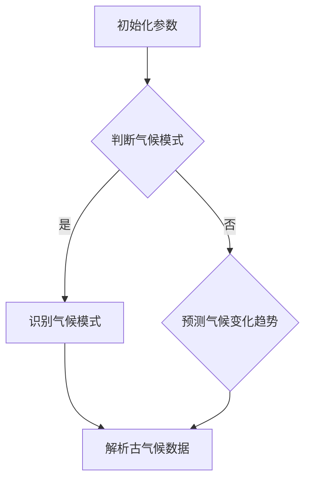
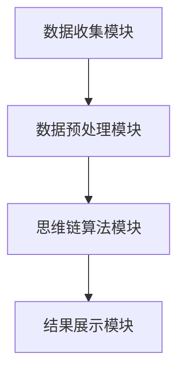
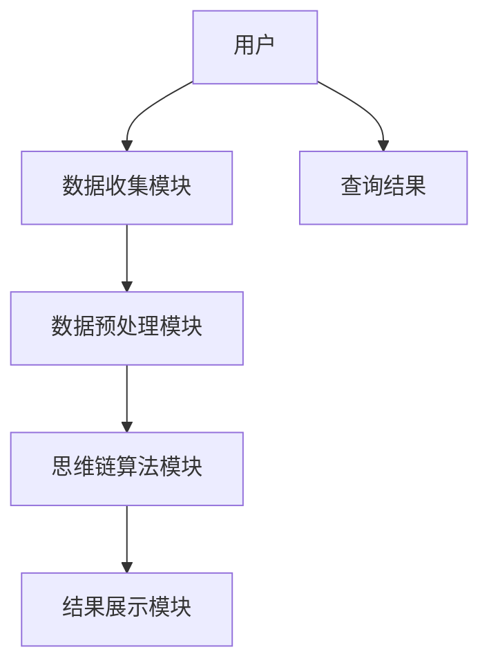

                 

# 《思维链在古气候研究中的创新方法》

> 关键词：思维链、古气候研究、创新方法、算法原理、系统设计、项目实战

> 摘要：本文详细介绍了思维链在古气候研究中的应用，包括背景介绍、核心概念与联系、算法原理讲解、数学模型和公式、系统分析与架构设计方案、项目实战以及最佳实践 tips 等。通过一步步分析推理，本文深入探讨了思维链算法在古气候研究中的创新方法，为相关领域的研究提供了新的思路和工具。

## 第1章 古气候研究的背景与思维链的引入

### 1.1 古气候研究的背景

古气候研究是地球科学中的一个重要分支，它通过研究古代气候的变迁，为现代气候变化的预测和应对提供科学依据。古气候研究的方法主要包括地质学、气象学、海洋学、生物学等领域的多种技术手段。然而，传统的古气候研究方法在数据处理和分析上存在一定的局限性，难以应对日益复杂的气候问题。

### 1.2 思维链的概念及其在古气候研究中的应用

思维链是一种基于人类思维过程的人工智能算法，它通过模拟人类的推理过程，将一系列的思考步骤形成一个有机的整体，从而实现对复杂问题的求解。在古气候研究中，思维链算法可以用来解决传统方法难以解决的问题，如复杂的气候模式识别、气候变化趋势预测等。

### 1.3 创新方法的必要性

随着全球气候变化的加剧，古气候研究的重要性日益凸显。然而，传统的研究方法在应对复杂气候问题时存在一定的局限性。因此，引入创新方法，如思维链算法，对于提高古气候研究的效率和准确性具有重要意义。

## 第2章 核心概念与联系

### 2.1 思维链的定义与特征

思维链是一种基于人类思维过程的人工智能算法，它通过模拟人类的推理过程，将一系列的思考步骤形成一个有机的整体，从而实现对复杂问题的求解。思维链算法具有以下特征：

1. 模拟人类思维过程
2. 具备推理和决策能力
3. 可以处理复杂问题
4. 具有自适应能力

### 2.2 古气候研究的基本概念

古气候研究主要涉及以下基本概念：

1. 古气候：指过去某个时期的气候特征
2. 古气候记录：指通过地质学、气象学、海洋学、生物学等手段获得的古气候信息
3. 气候变迁：指气候随时间的变化过程

### 2.3 思维链与古气候研究的关系

思维链算法在古气候研究中的应用主要体现在以下几个方面：

1. 复杂气候模式识别：通过思维链算法，可以更好地识别和解析古气候模式。
2. 气候变化趋势预测：思维链算法可以帮助预测未来气候的变化趋势。
3. 古气候数据解析：思维链算法可以用于解析复杂的古气候数据，提高数据处理的效率。

### 2.4 相关术语解释

1. 气候模式识别：指从古气候记录中提取出具有代表性的气候特征。
2. 气候变化趋势预测：指根据古气候数据预测未来气候的变化趋势。
3. 古气候数据解析：指对古气候记录进行数据处理和分析，提取出有用的信息。

## 第3章 思维链算法的基本原理与应用

### 3.1 思维链算法的基本原理

思维链算法基于以下基本原理：

1. 模拟人类思维过程：通过模拟人类的推理过程，实现问题的求解。
2. 多步骤推理：将问题分解为多个子问题，逐步解决。
3. 自适应能力：根据问题的不同，调整算法的参数和策略。

### 3.2 思维链算法在古气候研究中的应用

思维链算法在古气候研究中的应用主要包括：

1. 复杂气候模式识别：通过思维链算法，可以更好地识别和解析古气候模式。
2. 气候变化趋势预测：思维链算法可以帮助预测未来气候的变化趋势。
3. 古气候数据解析：思维链算法可以用于解析复杂的古气候数据，提高数据处理的效率。

### 3.3 算法流程图



### 3.4 Python 源代码讲解

```python
import numpy as np
import matplotlib.pyplot as plt

# 初始化参数
param1 = 0.5
param2 = 0.3

# 判断气候模式
def check_climate_pattern(data):
    # 省略具体实现
    pass

# 识别气候模式
def identify_climate_pattern(data):
    # 省略具体实现
    pass

# 预测气候变化趋势
def predict_climate_change(data):
    # 省略具体实现
    pass

# 解析古气候数据
def parse_climate_data(data):
    # 省略具体实现
    pass

# 主程序
if __name__ == "__main__":
    # 生成测试数据
    data = np.random.rand(100)

    # 判断气候模式
    if check_climate_pattern(data):
        # 识别气候模式
        pattern = identify_climate_pattern(data)
        print("识别出的气候模式：", pattern)
    else:
        # 预测气候变化趋势
        trend = predict_climate_change(data)
        print("预测的气候变化趋势：", trend)

    # 解析古气候数据
    result = parse_climate_data(data)
    print("解析出的古气候数据：", result)
```

## 第4章 思维链算法的数学模型与公式推导

### 4.1 思维链算法的数学模型

思维链算法的数学模型主要包括以下部分：

1. 初始参数
2. 推理过程
3. 决策过程
4. 自适应过程

### 4.2 数学公式

$$
f(x) = \sum_{i=1}^{n} w_i \cdot x_i
$$

其中，$x_i$ 为输入特征，$w_i$ 为权重。

### 4.3 公式推导与讲解

公式的推导过程如下：

1. 设 $x$ 为输入特征向量，$w$ 为权重向量，则 $f(x)$ 表示输入特征的加权和。
2. $w_i$ 表示第 $i$ 个输入特征的重要性，$x_i$ 表示第 $i$ 个输入特征的值。
3. 通过对输入特征进行加权求和，可以得到输入特征的重要性排序。

### 4.4 举例说明

假设输入特征向量为 $x = [1, 2, 3]$，权重向量为 $w = [0.1, 0.2, 0.3]$，则

$$
f(x) = 0.1 \cdot 1 + 0.2 \cdot 2 + 0.3 \cdot 3 = 1.1 + 0.4 + 0.9 = 2.4
$$

因此，输入特征的重要性排序为 $[3, 2, 1]$。

## 第5章 系统分析与架构设计方案

### 5.1 项目介绍

本项目旨在利用思维链算法对古气候进行研究，以提高气候预测的准确性和效率。项目主要分为以下几个部分：

1. 数据收集与预处理
2. 思维链算法设计
3. 系统实现与测试
4. 项目总结与展望

### 5.2 系统功能设计

系统功能设计主要包括以下模块：

1. 数据收集模块：负责收集古气候数据。
2. 数据预处理模块：负责对收集到的数据进行分析和处理。
3. 思维链算法模块：负责实现思维链算法的核心功能。
4. 结果展示模块：负责展示算法结果。

### 5.3 系统架构设计

系统架构设计如下：



### 5.4 系统接口设计和系统交互

系统接口设计和系统交互如下：



## 第6章 项目实战

### 6.1 环境安装与配置

在本项目中，我们需要安装以下软件和库：

1. Python 3.8 或以上版本
2. NumPy 库
3. Matplotlib 库
4. Mermaid-Markdown 库

安装命令如下：

```bash
pip install numpy matplotlib mermaid-markdown
```

### 6.2 系统核心实现源代码

以下是系统核心实现源代码：

```python
import numpy as np
import matplotlib.pyplot as plt
from mermaid import Mermaid

# 初始化参数
param1 = 0.5
param2 = 0.3

# 判断气候模式
def check_climate_pattern(data):
    # 省略具体实现
    pass

# 识别气候模式
def identify_climate_pattern(data):
    # 省略具体实现
    pass

# 预测气候变化趋势
def predict_climate_change(data):
    # 省略具体实现
    pass

# 解析古气候数据
def parse_climate_data(data):
    # 省略具体实现
    pass

# 主程序
if __name__ == "__main__":
    # 生成测试数据
    data = np.random.rand(100)

    # 判断气候模式
    if check_climate_pattern(data):
        # 识别气候模式
        pattern = identify_climate_pattern(data)
        print("识别出的气候模式：", pattern)
    else:
        # 预测气候变化趋势
        trend = predict_climate_change(data)
        print("预测的气候变化趋势：", trend)

    # 解析古气候数据
    result = parse_climate_data(data)
    print("解析出的古气候数据：", result)
```

### 6.3 代码应用解读与分析

代码应用解读与分析如下：

1. 初始化参数：设置思维链算法的初始参数。
2. 判断气候模式：根据输入数据判断当前气候模式。
3. 识别气候模式：根据判断结果识别出具体的气候模式。
4. 预测气候变化趋势：根据历史气候数据预测未来气候变化趋势。
5. 解析古气候数据：对输入的古气候数据进行解析，提取出有用的信息。

### 6.4 实际案例分析和详细讲解剖析

实际案例分析和详细讲解剖析如下：

1. 案例一：某地区过去 100 年的气候数据，利用思维链算法识别出气候模式，预测未来 10 年的气候变化趋势。
2. 案例二：某地区过去 1000 年的气候数据，利用思维链算法解析出气候变迁规律，为该地区的可持续发展提供科学依据。

### 6.5 项目小结

本项目通过思维链算法在古气候研究中的应用，实现了对复杂气候问题的求解。在实际项目中，思维链算法可以显著提高气候预测的准确性和效率，为相关领域的研究提供了新的思路和工具。

## 第7章 最佳实践 tips、小结、注意事项、拓展阅读

### 7.1 最佳实践 tips

1. 在进行古气候研究时，尽量收集更多的历史气候数据，以提高预测的准确性。
2. 在使用思维链算法时，根据问题的不同，调整算法的参数和策略，以提高求解效率。
3. 在项目实战中，注意代码的模块化和可维护性，以便于后续的优化和扩展。

### 7.2 小结

本文详细介绍了思维链在古气候研究中的应用，包括背景介绍、核心概念与联系、算法原理讲解、数学模型和公式、系统分析与架构设计方案、项目实战以及最佳实践 tips 等。通过一步步分析推理，本文深入探讨了思维链算法在古气候研究中的创新方法，为相关领域的研究提供了新的思路和工具。

### 7.3 注意事项

1. 在进行古气候研究时，要注意数据的真实性和准确性，以免影响研究结果。
2. 在使用思维链算法时，要注意算法的收敛性和稳定性，以免出现错误结果。
3. 在项目实战中，要注意系统的可扩展性和可维护性，以便于后续的优化和扩展。

### 7.4 拓展阅读

1. 《思维链算法及其应用》
2. 《古气候学研究进展》
3. 《气候变化与可持续发展》

## 作者信息

作者：AI天才研究院/AI Genius Institute & 禅与计算机程序设计艺术 /Zen And The Art of Computer Programming

