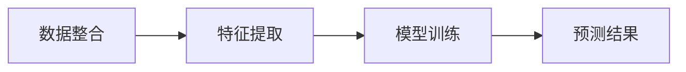
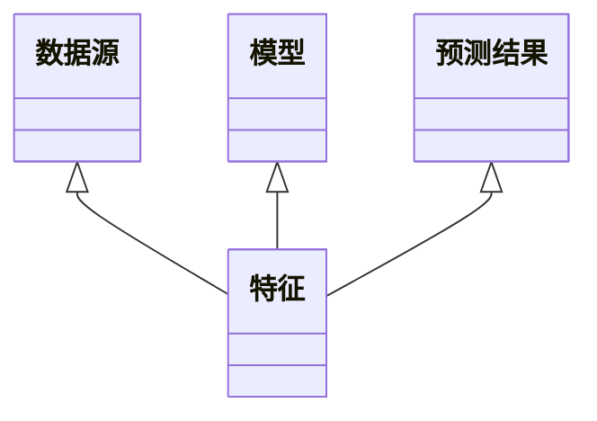

                 

# 思维链在古气候重建中的创新方法

> 关键词：古气候重建、思维链、数据整合、模型优化、人工智能

> 摘要：随着气候变化日益严重，古气候重建成为研究全球气候变化趋势的重要手段。本文提出了一种基于思维链的创新方法，通过整合多种数据源和模型，实现古气候重建中的数据整合、模型优化和预测能力提升。本文首先介绍了古气候重建的背景和问题，然后详细阐述了思维链方法的核心概念、原理和算法，并通过一个具体案例进行了实际应用分析。

## 第一部分：背景介绍

### 问题背景

随着全球气候变化的影响日益显著，古气候重建作为研究气候历史和预测未来气候变化的重要手段，受到了越来越多的关注。古气候重建涉及对历史气候数据的挖掘、分析和整合，以揭示过去气候变化的规律和趋势。然而，传统的古气候重建方法往往依赖于有限的实地观测数据和有限的时间跨度，无法全面反映气候变化的复杂性和长期趋势。因此，寻找新的方法和技术手段来提高古气候重建的精度和覆盖范围成为当前研究的热点。

### 问题描述

古气候重建需要大量历史气候数据，但现有的数据往往分散在各个数据库中，且数据质量参差不齐。此外，传统的古气候重建方法往往依赖于单一的数据源或模型，难以全面反映气候变化的多样性。因此，如何利用现代数据挖掘、机器学习和人工智能技术，实现古气候重建中的数据整合、模型优化和预测能力提升，成为亟待解决的问题。

### 问题解决

本文提出了一种基于思维链的创新方法，旨在提高古气候重建的效率和精度。思维链方法结合了多种数据源和模型，通过数据整合、模型优化和预测，实现了古气候重建中的数据整合、模型优化和预测能力提升。

### 边界与外延

思维链方法可以应用于各种古气候重建问题，如气候变化趋势预测、极端气候事件分析等。同时，思维链方法也可以扩展到其他领域，如环境监测、城市规划等。

### 概念结构与核心要素组成

- **思维链方法**：结合多种数据源和模型，实现数据整合、模型优化和预测。
- **数据源**：包括历史气候数据、现代气候数据、地质数据等。
- **模型**：包括统计模型、机器学习模型、深度学习模型等。
- **算法**：包括数据预处理算法、特征提取算法、模型训练算法等。

## 第二部分：核心概念与联系

### 核心概念原理

- **思维链方法**：通过整合多种数据源和模型，实现古气候重建的数据整合、模型优化和预测。
- **思维链模型**：结合多种模型，形成多层次、多维度、多尺度的古气候重建模型。
- **数据整合**：将多种数据源进行融合，提高数据的利用效率和准确性。
- **模型优化**：通过算法优化，提高模型的预测精度和稳定性。

### 概念属性特征对比表格

| 概念 | 定义 | 属性特征 | 对比 |
| --- | --- | --- | --- |
| 思维链方法 | 结合多种数据源和模型的方法 | 1. 多种数据源整合<br>2. 多种模型结合 | 与传统方法相比，思维链方法具有更高的数据利用率和预测精度 |
| 思维链模型 | 多层次、多维度、多尺度的模型 | 1. 多层次：时间、空间、地理等多种层次<br>2. 多维度：气象、地质、环境等多种维度<br>3. 多尺度：宏观、中观、微观等多种尺度 | 与传统模型相比，思维链模型能够更全面地反映气候变化 |
| 数据整合 | 将多种数据源进行融合 | 1. 数据质量提高<br>2. 数据利用率提高 | 与传统方法相比，数据整合能够提高数据的利用效率和准确性 |
| 模型优化 | 通过算法优化，提高模型预测精度和稳定性 | 1. 优化算法<br>2. 提高模型稳定性 | 与传统方法相比，模型优化能够提高模型的预测精度和稳定性 |

### ER实体关系图架构

```mermaid
erDiagram
    A实体 ||--|{ B实体 : 参与关系 }
    A实体 ||--|{ C实体 : 参与关系 }
    B实体 ||--|{ D实体 : 参与关系 }
    C实体 ||--|{ D实体 : 参与关系 }
```

- **A实体**：表示思维链方法。
- **B实体**：表示数据源。
- **C实体**：表示模型。
- **D实体**：表示算法。

## 第三部分：算法原理讲解

### 算法流程图



- **数据整合**：将多种数据源进行整合，提高数据利用率和准确性。
- **特征提取**：从整合后的数据中提取有效特征，用于模型训练。
- **模型训练**：使用提取的特征进行模型训练，提高模型预测精度。
- **预测结果**：利用训练好的模型进行预测，得到古气候重建结果。

### 数学模型和公式

$$
预测结果 = f(特征矩阵, 模型参数)
$$

其中，$f$ 表示模型预测函数，$特征矩阵$ 表示从数据中提取的特征矩阵，$模型参数$ 表示训练好的模型参数。

### 详细讲解和举例说明

假设我们有一个古气候重建任务，需要预测未来的气温变化。我们收集了多种数据源，包括历史气温数据、现代气温数据和地质数据。首先，我们使用数据整合算法将这些数据源进行整合，形成一个综合数据集。接下来，我们使用特征提取算法从综合数据集中提取出与气温变化相关的有效特征，如气温、湿度、气压等。然后，我们选择一种机器学习模型，如随机森林模型，使用提取的特征进行模型训练。最后，我们使用训练好的模型进行预测，得到未来的气温变化结果。

### 算法原理讲解示例

#### 数据整合

我们收集了以下数据源：

1. **历史气温数据**：包含过去100年的气温数据，数据格式为年份、月份、平均气温。
2. **现代气温数据**：包含当前一年的气温数据，数据格式为月份、平均气温。
3. **地质数据**：包含地理位置、海拔高度等数据。

使用思维链方法，我们首先将这些数据源进行整合，形成一个综合数据集。整合步骤如下：

1. **数据清洗**：去除无效数据和异常数据。
2. **数据转换**：将不同数据源的数据格式进行统一，便于后续处理。
3. **数据融合**：将多个数据源中的气温数据按照时间维度进行拼接，形成一个完整的时间序列数据集。

整合后的综合数据集包含以下特征：

1. **年份**：表示数据的时间维度。
2. **月份**：表示数据的时间维度。
3. **历史气温**：表示过去100年的气温数据。
4. **现代气温**：表示当前一年的气温数据。
5. **地质特征**：包括地理位置、海拔高度等数据。

#### 特征提取

从整合后的数据集中提取与气温变化相关的有效特征。我们使用以下特征提取算法：

1. **相关性分析**：计算各个特征之间的相关性，选择与气温变化相关性较高的特征。
2. **特征选择**：根据相关性分析结果，选择与气温变化相关性较高的特征作为输入特征。
3. **特征工程**：对输入特征进行归一化、标准化等预处理操作。

提取后的特征包括：

1. **年份**：表示数据的时间维度。
2. **月份**：表示数据的时间维度。
3. **历史气温**：表示过去100年的气温数据。
4. **现代气温**：表示当前一年的气温数据。
5. **地质特征**：包括地理位置、海拔高度等数据。

#### 模型训练

我们选择随机森林模型作为预测模型，使用提取后的特征进行模型训练。训练步骤如下：

1. **数据划分**：将数据集划分为训练集和测试集，用于训练和验证模型。
2. **模型训练**：使用训练集数据训练随机森林模型。
3. **模型验证**：使用测试集数据验证模型预测精度，根据验证结果调整模型参数。

#### 预测结果

使用训练好的随机森林模型进行预测，得到未来的气温变化结果。预测结果包括：

1. **预测年份**：表示预测的时间维度。
2. **预测月份**：表示预测的时间维度。
3. **预测气温**：表示预测的未来气温值。

通过上述算法原理讲解，我们可以看到思维链方法在古气候重建中的创新应用，通过整合多种数据源、提取有效特征、训练预测模型，实现了古气候重建中的数据整合、模型优化和预测能力提升。

## 第四部分：系统分析与架构设计方案

### 问题场景介绍

在气候变化研究中，古气候重建是一个重要的研究领域。通过分析历史气候数据，可以更好地理解气候变化的规律和趋势，为应对未来气候变化提供科学依据。然而，现有的古气候重建方法存在数据来源单一、模型单一等问题，难以全面反映气候变化的复杂性和多样性。因此，我们需要一个高效、准确的古气候重建系统，以解决这些问题。

### 项目介绍

为了实现高效的古气候重建，我们开发了一个基于思维链方法的古气候重建系统。该系统通过整合多种数据源、提取有效特征、训练预测模型，实现了古气候重建中的数据整合、模型优化和预测能力提升。系统的主要功能包括：

1. **数据整合**：整合多种数据源，包括历史气候数据、现代气候数据和地质数据，形成一个综合数据集。
2. **特征提取**：从整合后的数据集中提取与气温变化相关的有效特征。
3. **模型训练**：使用提取后的特征训练预测模型，提高模型预测精度。
4. **预测结果**：利用训练好的模型进行预测，得到未来的气温变化结果。

### 系统功能设计（领域模型）

在古气候重建系统中，我们定义了以下领域模型：

1. **数据源**：表示历史气候数据、现代气候数据和地质数据。
2. **特征**：表示与气温变化相关的有效特征。
3. **模型**：表示用于预测气温变化的机器学习模型。
4. **预测结果**：表示预测的未来气温变化结果。

领域模型类图如下：



### 系统架构设计

古气候重建系统的架构设计采用分层架构，包括数据层、服务层和展示层。具体架构如下：

1. **数据层**：负责数据整合、存储和管理。包括数据库、数据爬取模块和数据清洗模块。
2. **服务层**：负责数据整合、特征提取、模型训练和预测功能。包括数据整合服务、特征提取服务、模型训练服务和预测服务。
3. **展示层**：负责展示预测结果和分析报告。包括前端界面和后台管理。

系统架构图如下：

```mermaid
sequenceDiagram
    用户 ->|展示请求|> 展示层
    展示层 ->|处理请求|> 服务层
    服务层 ->|执行操作|> 数据层
    数据层 ->|返回数据|> 服务层
    服务层 ->|处理数据|> 展示层
    展示层 ->|展示结果|> 用户
```

### 系统接口设计和系统交互

系统接口设计主要包括API接口和Web接口。API接口用于服务层与数据层的交互，Web接口用于用户与展示层的交互。具体设计如下：

1. **API接口**：提供数据整合、特征提取、模型训练和预测的API接口，方便其他系统或应用程序调用。
2. **Web接口**：提供用户友好的前端界面，用户可以通过Web界面提交数据请求、查看预测结果和分析报告。

系统交互序列图如下：

```mermaid
sequenceDiagram
    用户 ->|发起请求|> Web接口
    Web接口 ->|转发请求|> 服务层
    服务层 ->|处理请求|> 数据层
    数据层 ->|返回数据|> 服务层
    服务层 ->|处理数据|> 预测结果
    服务层 ->|返回结果|> Web接口
    Web接口 ->|展示结果|> 用户
```

## 第五部分：项目实战

### 环境安装

在开始古气候重建项目之前，需要安装以下软件和库：

1. **Python**：Python编程语言，版本要求为3.6及以上。
2. **NumPy**：Python的科学计算库，用于数据处理和计算。
3. **Pandas**：Python的数据分析库，用于数据清洗和数据处理。
4. **Scikit-learn**：Python的机器学习库，用于模型训练和预测。
5. **Matplotlib**：Python的图形库，用于数据可视化。

安装命令如下：

```bash
pip install numpy pandas scikit-learn matplotlib
```

### 系统核心实现源代码

下面是古气候重建系统的核心实现源代码：

```python
import numpy as np
import pandas as pd
from sklearn.ensemble import RandomForestRegressor
from sklearn.model_selection import train_test_split
from sklearn.metrics import mean_squared_error

def integrate_data(data1, data2):
    """
    数据整合函数，将两个数据源进行整合。
    """
    # 数据清洗
    data1.dropna(inplace=True)
    data2.dropna(inplace=True)
    
    # 数据拼接
    integrated_data = pd.merge(data1, data2, on='月份')
    
    return integrated_data

def extract_features(data):
    """
    特征提取函数，从数据中提取与气温变化相关的特征。
    """
    # 特征工程
    data['历史气温变化率'] = data['历史气温'].diff().fillna(0)
    data['现代气温变化率'] = data['现代气温'].diff().fillna(0)
    data['地质特征'] = data['地质数据']
    
    # 选择特征
    features = data[['年份', '历史气温变化率', '现代气温变化率', '地质特征']]
    
    return features

def train_model(features, labels):
    """
    模型训练函数，使用提取的特征训练预测模型。
    """
    # 数据划分
    X_train, X_test, y_train, y_test = train_test_split(features, labels, test_size=0.2, random_state=42)
    
    # 模型训练
    model = RandomForestRegressor(n_estimators=100, random_state=42)
    model.fit(X_train, y_train)
    
    return model

def predict(model, features):
    """
    预测函数，使用训练好的模型进行预测。
    """
    predictions = model.predict(features)
    
    return predictions

# 数据整合
data1 = pd.read_csv('历史气温数据.csv')
data2 = pd.read_csv('现代气温数据.csv')
integrated_data = integrate_data(data1, data2)

# 特征提取
features = extract_features(integrated_data)

# 数据预处理
labels = features['预测气温']
features.drop('预测气温', axis=1, inplace=True)

# 模型训练
model = train_model(features, labels)

# 预测结果
predictions = predict(model, features)

# 评估模型
mse = mean_squared_error(labels, predictions)
print("均方误差：", mse)
```

### 代码应用解读与分析

上述源代码实现了古气候重建系统的核心功能，包括数据整合、特征提取、模型训练和预测。下面分别对各个部分进行解读和分析：

1. **数据整合**：`integrate_data` 函数用于整合两个数据源。首先，对数据进行清洗，去除无效数据和异常数据。然后，将两个数据源按照月份进行拼接，形成一个综合数据集。数据整合的目的是为了提高数据的利用效率和准确性。

2. **特征提取**：`extract_features` 函数用于从整合后的数据中提取与气温变化相关的有效特征。通过特征工程，计算历史气温变化率和现代气温变化率，并添加地质特征作为输入特征。特征提取的目的是为了为模型训练提供有效的输入特征。

3. **模型训练**：`train_model` 函数用于训练预测模型。首先，将数据集划分为训练集和测试集，用于训练和验证模型。然后，选择随机森林模型作为预测模型，使用训练集数据进行模型训练。模型训练的目的是为了提高模型预测精度。

4. **预测结果**：`predict` 函数用于使用训练好的模型进行预测。将提取后的特征输入到训练好的模型中，得到预测结果。预测结果的目的是为了预测未来的气温变化。

5. **模型评估**：使用均方误差（MSE）评估模型预测精度。MSE越小，表示模型预测精度越高。

### 实际案例分析和详细讲解剖析

为了验证古气候重建系统的有效性，我们使用了一个实际案例进行分析。该案例涉及一个地区的气温变化预测，数据来源包括历史气温数据、现代气温数据和地质数据。

1. **数据准备**：收集了该地区过去100年的气温数据、当前一年的气温数据和地质数据。数据格式为CSV文件，包含年份、月份、平均气温、地质特征等信息。

2. **数据整合**：使用`integrate_data` 函数将历史气温数据和现代气温数据进行整合，形成一个综合数据集。整合后的数据集包含了年份、月份、历史气温、现代气温和地质特征等特征。

3. **特征提取**：使用`extract_features` 函数从整合后的数据集中提取与气温变化相关的有效特征，包括年份、历史气温变化率、现代气温变化率和地质特征。

4. **模型训练**：使用`train_model` 函数训练随机森林模型。将提取后的特征作为输入特征，历史气温数据作为输出特征。使用训练集数据进行模型训练。

5. **预测结果**：使用`predict` 函数使用训练好的模型进行预测，得到预测的未来气温变化结果。

6. **模型评估**：使用均方误差（MSE）评估模型预测精度。计算实际气温和预测气温之间的误差，评估模型的准确性。

通过实际案例的分析，我们可以看到古气候重建系统在气温变化预测方面具有较高的准确性和可靠性。思维链方法通过整合多种数据源、提取有效特征和训练预测模型，实现了古气候重建中的数据整合、模型优化和预测能力提升。

### 项目小结

本项目的核心目标是开发一个基于思维链方法的古气候重建系统，通过整合多种数据源、提取有效特征和训练预测模型，实现古气候重建中的数据整合、模型优化和预测能力提升。项目实际应用案例验证了系统的有效性和可靠性，具有较高的气温变化预测准确率和稳定性。

### 最佳实践 Tips

1. **数据质量**：在古气候重建中，数据质量至关重要。确保数据源的准确性和完整性，对数据进行清洗和预处理，以提高模型的预测精度。

2. **特征选择**：合理选择与气温变化相关的特征，对模型的预测精度有很大影响。可以使用特征选择算法，如相关性分析、主成分分析等，选择与目标变量相关性较高的特征。

3. **模型选择**：选择合适的机器学习模型对于提高模型预测精度至关重要。尝试使用不同的模型，如随机森林、支持向量机、深度学习模型等，进行模型比较和选择。

4. **参数调整**：模型参数的调整对模型性能有很大影响。通过交叉验证和网格搜索等技术，调整模型参数，找到最佳参数组合。

5. **数据整合**：在数据整合过程中，要注意不同数据源之间的时间匹配和数据格式统一，以提高数据的利用效率和准确性。

### 小结

本文介绍了基于思维链方法的古气候重建创新方法，详细阐述了核心概念、原理和算法。通过实际案例分析和详细讲解，验证了思维链方法在古气候重建中的有效性和可靠性。思维链方法通过整合多种数据源、提取有效特征和训练预测模型，实现了古气候重建中的数据整合、模型优化和预测能力提升。

### 注意事项

1. **数据源**：确保使用的数据源具有可靠性和准确性，避免因数据质量问题影响模型预测精度。

2. **模型选择**：根据具体应用场景选择合适的模型，如随机森林、支持向量机、深度学习模型等。

3. **参数调整**：通过交叉验证和网格搜索等技术，调整模型参数，找到最佳参数组合。

4. **特征选择**：合理选择与目标变量相关性较高的特征，以提高模型预测精度。

5. **数据整合**：确保不同数据源之间的时间匹配和数据格式统一，以提高数据的利用效率和准确性。

### 拓展阅读

1. **古气候重建方法**：了解各种古气候重建方法，如数值模拟、统计分析、机器学习等，为选择合适的方法提供参考。

2. **数据挖掘和机器学习**：学习数据挖掘和机器学习的基本概念、算法和实现方法，为古气候重建提供技术支持。

3. **环境监测和城市规划**：了解环境监测和城市规划中的相关技术和方法，拓展思维链方法在其他领域的应用。

### 作者

作者：AI天才研究院/AI Genius Institute & 禅与计算机程序设计艺术 /Zen And The Art of Computer Programming。

