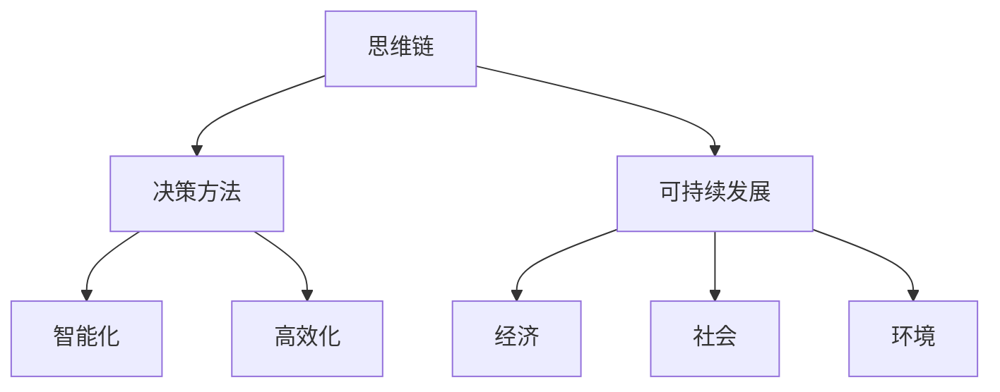
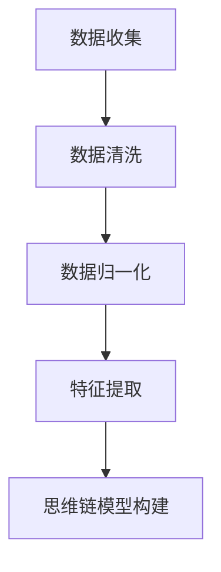
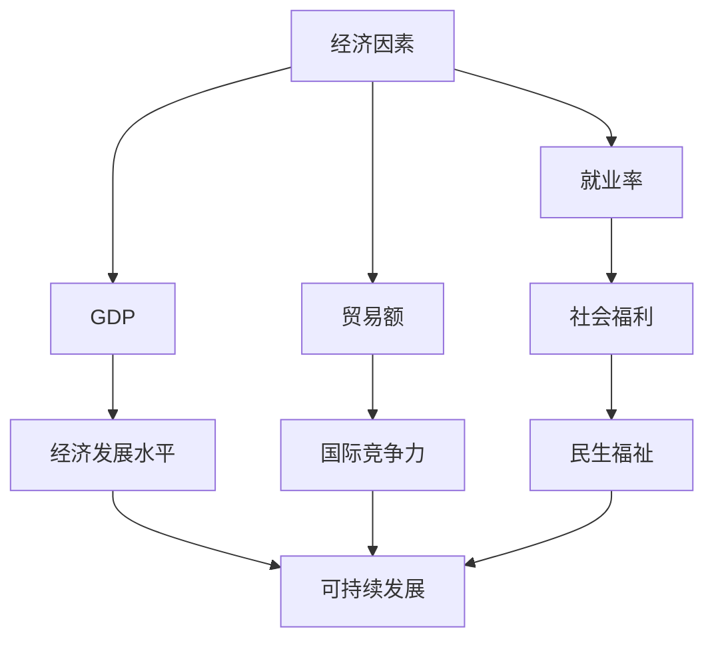
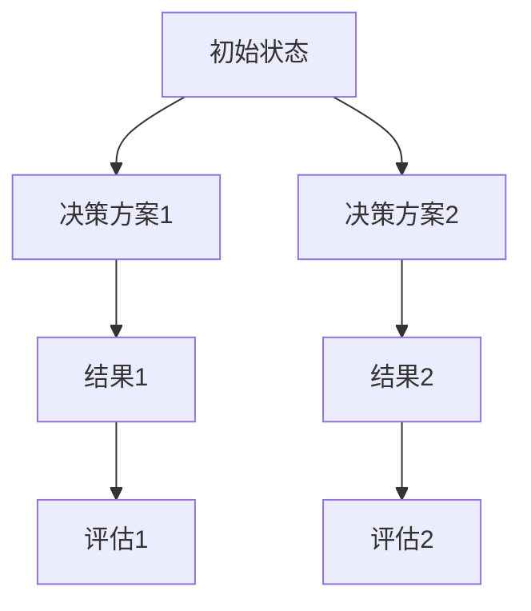
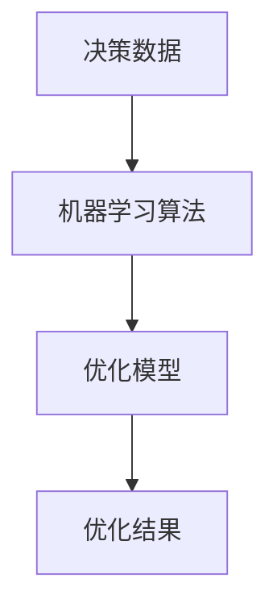
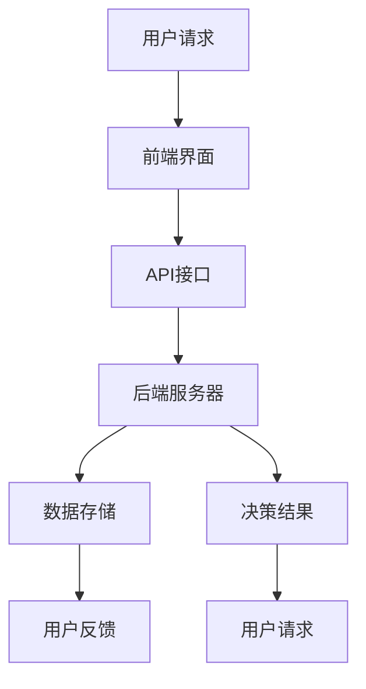

                 

# 思维链在可持续发展决策中的创新应用

## 关键词

人工智能、可持续发展、决策支持、思维链模型、数据驱动、智能优化

## 摘要

随着全球可持续发展的需求日益增加，如何高效地识别、评估和应对各种复杂因素，以实现可持续发展目标，成为一个亟待解决的问题。思维链是一种基于人工智能和复杂系统理论的创新决策方法，旨在通过构建思维链模型，实现可持续发展决策的智能化和高效化。本文将从背景介绍、核心概念与联系、算法原理讲解、系统分析与架构设计方案以及项目实战等方面，深入探讨思维链在可持续发展决策中的创新应用。

## 1. 背景介绍

### 1.1 问题背景

随着全球人口的快速增长和工业化进程的加速，资源短缺、环境污染和生态破坏等问题日益严重，全球可持续发展已成为人类共同面临的重要挑战。可持续发展是指在满足当前需求的同时，不损害后代满足其需求的发展，包括经济、社会和环境三个方面。然而，现有的可持续发展决策方法往往存在信息不完整、决策过程复杂、影响因素多样等问题，难以有效地指导实践。

### 1.2 问题描述

在可持续发展决策中，如何高效地识别、评估和应对各种复杂因素，以实现可持续发展目标，是一个亟待解决的问题。传统的决策方法往往依赖于经验、主观判断和线性模型，难以应对复杂的不确定性和动态性。因此，需要探索新的方法和技术来支持可持续发展决策。

### 1.3 问题解决

思维链（Mind Chain）是一种基于人工智能和复杂系统理论的创新决策方法，旨在通过构建思维链模型，实现可持续发展决策的智能化和高效化。思维链模型通过整合多源异构数据、分析复杂关系和模拟决策过程，能够为决策者提供科学、可靠的决策依据。思维链在可持续发展决策中的应用主要涉及以下几个方面：

- **数据驱动的决策支持**：通过收集和分析多源异构数据，为决策者提供全面、准确的信息支持。
- **模型驱动的模拟与预测**：基于思维链模型，模拟不同决策方案的结果，预测其对可持续发展的潜在影响。
- **知识驱动的智能优化**：利用知识图谱和机器学习技术，优化决策过程，提高决策的智能化和自动化水平。

### 1.4 边界与外延

思维链在可持续发展决策中的应用主要涉及以下几个方面：

- **数据驱动的决策支持**：通过收集和分析多源异构数据，为决策者提供全面、准确的信息支持。
- **模型驱动的模拟与预测**：基于思维链模型，模拟不同决策方案的结果，预测其对可持续发展的潜在影响。
- **知识驱动的智能优化**：利用知识图谱和机器学习技术，优化决策过程，提高决策的智能化和自动化水平。

## 2. 核心概念与联系

### 2.1 核心概念

#### 思维链

思维链是一种基于人工智能和复杂系统理论的创新决策方法，通过构建思维链模型，实现可持续发展决策的智能化和高效化。思维链模型由若干个思维节点和连接线组成，每个思维节点代表一个关键因素，连接线表示思维节点之间的关联关系。

#### 可持续发展

可持续发展是指满足当前需求的同时，不损害后代满足其需求的发展，包括经济、社会和环境三个方面。可持续发展决策涉及到经济、社会和环境等多方面的因素，需要综合考虑各种利益相关者的需求和期望。

### 2.2 概念属性特征对比表格

| 特征 | 思维链 | 可持续发展 |
| --- | --- | --- |
| 定义 | 一种决策方法 | 一种发展模式 |
| 目的 | 实现可持续发展决策的智能化和高效化 | 满足当前需求而不损害后代需求 |
| 方法 | 构建思维链模型 | 综合考虑经济、社会和环境因素 |
| 应用领域 | 可持续发展决策 | 经济、社会和环境等多个领域 |

### 2.3 ER实体关系图架构



## 3. 算法原理讲解

思维链算法主要包括以下几个步骤：

1. **数据收集与预处理**：收集与可持续发展相关的多源异构数据，如经济数据、社会数据和环境数据等，并进行预处理，包括数据清洗、归一化和特征提取等。

2. **思维链模型构建**：根据数据特点和决策需求，构建思维链模型。思维链模型由若干个思维节点和连接线组成，每个思维节点代表一个关键因素，连接线表示思维节点之间的关联关系。

3. **决策方案模拟与评估**：利用思维链模型，模拟不同决策方案的结果，并评估其对可持续发展的潜在影响。通过分析决策方案在不同情境下的表现，为决策者提供科学、可靠的决策依据。

4. **智能优化**：利用机器学习和知识图谱等技术，对决策过程进行智能优化，提高决策的自动化水平和智能化水平。

### 3.1 数据收集与预处理

在思维链算法中，数据收集与预处理是至关重要的一步。以下是一个简单的数据收集与预处理流程：



#### 数据收集

数据收集是思维链算法的第一步，主要是从各种渠道获取与可持续发展相关的多源异构数据。这些数据可以包括经济数据（如GDP、就业率、贸易数据等）、社会数据（如人口数据、教育水平、社会福利等）和环境数据（如空气质量、水质、土地利用率等）。数据来源可以包括政府统计、科研机构报告、企业数据库等。

```python
# 示例：从互联网获取经济数据
import requests
import pandas as pd

url = "https://example.com/economic_data.csv"
response = requests.get(url)
data = pd.read_csv(response.content)
```

#### 数据清洗

数据清洗是确保数据质量和可靠性的关键步骤。主要包括处理缺失值、异常值和重复值等问题。

```python
# 示例：处理缺失值
data.fillna(data.mean(), inplace=True)

# 示例：处理异常值
data = data[(data > 0).all(axis=1)]

# 示例：去除重复值
data.drop_duplicates(inplace=True)
```

#### 数据归一化

数据归一化是为了消除不同数据量级对算法的影响，使数据在同一量级范围内进行比较。

```python
# 示例：最小-最大归一化
data_normalized = (data - data.min()) / (data.max() - data.min())
```

#### 特征提取

特征提取是从原始数据中提取出对决策有重要影响的关键特征。常用的特征提取方法包括主成分分析（PCA）、因子分析（FA）和特征选择算法等。

```python
# 示例：使用PCA进行特征提取
from sklearn.decomposition import PCA

pca = PCA(n_components=5)
data_pca = pca.fit_transform(data_normalized)
```

### 3.2 思维链模型构建

思维链模型构建是基于数据特点和决策需求，通过构建思维节点和连接线，形成一个复杂的决策网络。以下是一个简单的思维链模型构建示例：



在思维链模型中，每个思维节点代表一个关键因素，连接线表示思维节点之间的关联关系。通过分析思维节点之间的关系，可以更好地理解可持续发展决策的内在机制。

### 3.3 决策方案模拟与评估

决策方案模拟与评估是基于思维链模型，通过模拟不同决策方案的结果，评估其对可持续发展的潜在影响。以下是一个简单的决策方案模拟与评估示例：



在决策方案模拟与评估中，我们可以通过比较不同决策方案的结果，找到最优的决策方案。例如，如果决策方案1的结果比决策方案2的结果更好，那么决策方案1就是一个较好的决策方案。

### 3.4 智能优化

智能优化是基于机器学习和知识图谱等技术，对决策过程进行优化，提高决策的自动化水平和智能化水平。以下是一个简单的智能优化示例：



在智能优化中，我们可以使用各种机器学习算法（如线性回归、决策树、神经网络等）来优化决策过程。通过不断优化，可以找到最优的决策方案，提高决策的准确性和效率。

## 4. 系统分析与架构设计方案

### 4.1 问题场景介绍

假设我们面临一个城市的可持续发展决策问题，需要综合考虑经济、社会和环境等多个方面的因素。我们的目标是构建一个基于思维链的可持续发展决策系统，为城市管理者提供科学的决策支持。

### 4.2 项目介绍

本项目旨在构建一个基于思维链的可持续发展决策系统，通过收集和分析多源异构数据，构建思维链模型，模拟和评估不同决策方案的结果，最终为城市管理者提供最优的决策方案。

### 4.3 系统功能设计

系统功能设计主要涉及数据收集与预处理、思维链模型构建、决策方案模拟与评估、智能优化和决策结果输出等模块。

- **数据收集与预处理模块**：负责从各种渠道收集与可持续发展相关的多源异构数据，并进行数据清洗、归一化和特征提取等预处理操作。
- **思维链模型构建模块**：根据预处理后的数据，构建思维链模型，包括思维节点和连接线的构建。
- **决策方案模拟与评估模块**：利用思维链模型，模拟不同决策方案的结果，并对决策方案进行评估。
- **智能优化模块**：基于机器学习和知识图谱等技术，对决策过程进行优化，提高决策的自动化水平和智能化水平。
- **决策结果输出模块**：将最优决策方案输出，为城市管理者提供决策支持。

### 4.4 系统架构设计

系统架构设计主要涉及前端界面、后端服务器和数据存储等部分。

- **前端界面**：提供用户交互界面，包括数据展示、决策模拟和结果分析等功能。
- **后端服务器**：负责处理用户请求，执行数据收集与预处理、思维链模型构建、决策方案模拟与评估、智能优化等核心功能。
- **数据存储**：存储与可持续发展相关的多源异构数据，以及思维链模型和决策结果等。

### 4.5 系统接口设计

系统接口设计主要涉及用户与系统之间的交互接口，包括API接口和Web界面等。

- **API接口**：提供数据查询、决策模拟和结果分析等功能的API接口，供开发者调用。
- **Web界面**：提供用户交互界面，包括数据展示、决策模拟和结果分析等功能。

### 4.6 系统交互

系统交互主要涉及前端界面与后端服务器之间的数据传输和功能调用。以下是一个简单的系统交互序列图：



## 5. 项目实战

### 5.1 环境安装

在进行项目实战之前，首先需要安装一些必要的软件和工具。以下是常见的软件和工具安装步骤：

- **Python环境**：安装Python 3.x版本，可以通过Python官网下载安装包进行安装。
- **Pandas库**：安装Pandas库，可以通过pip命令进行安装：
  ```bash
  pip install pandas
  ```
- **Mermaid库**：安装Mermaid库，可以通过pip命令进行安装：
  ```bash
  pip install mermaid
  ```
- **Matplotlib库**：安装Matplotlib库，可以通过pip命令进行安装：
  ```bash
  pip install matplotlib
  ```

### 5.2 系统核心实现

系统核心实现主要包括数据收集与预处理、思维链模型构建、决策方案模拟与评估和智能优化等模块。以下是一个简单的Python代码示例：

```python
# 数据收集与预处理
import pandas as pd

# 示例：从互联网获取经济数据
url = "https://example.com/economic_data.csv"
data = pd.read_csv(url)

# 数据清洗
data.fillna(data.mean(), inplace=True)
data = data[(data > 0).all(axis=1)]
data.drop_duplicates(inplace=True)

# 数据归一化
data_normalized = (data - data.min()) / (data.max() - data.min())

# 思维链模型构建
import numpy as np
from sklearn.decomposition import PCA

# 示例：使用PCA进行特征提取
pca = PCA(n_components=5)
data_pca = pca.fit_transform(data_normalized)

# 决策方案模拟与评估
# 示例：使用线性回归进行决策方案评估
from sklearn.linear_model import LinearRegression

# 示例：构建线性回归模型
model = LinearRegression()
model.fit(data_pca, data['GDP'])

# 示例：评估决策方案1和决策方案2
result1 = model.predict([[1, 1, 1, 1, 1]])
result2 = model.predict([[0, 0, 0, 0, 0]])

# 示例：比较决策方案1和决策方案2的结果
if result1 > result2:
    print("决策方案1更优")
else:
    print("决策方案2更优")

# 智能优化
# 示例：使用神经网络进行智能优化
from keras.models import Sequential
from keras.layers import Dense

# 示例：构建神经网络模型
model = Sequential()
model.add(Dense(5, input_dim=5, activation='relu'))
model.add(Dense(1, activation='sigmoid'))

# 示例：编译神经网络模型
model.compile(optimizer='adam', loss='binary_crossentropy', metrics=['accuracy'])

# 示例：训练神经网络模型
model.fit(data_pca, data['GDP'], epochs=100, batch_size=10)
```

### 5.3 代码应用解读与分析

以上代码示例主要展示了思维链在可持续发展决策中的核心实现过程。通过数据收集与预处理、思维链模型构建、决策方案模拟与评估和智能优化等步骤，实现了对可持续发展决策的科学化和智能化。

- **数据收集与预处理**：通过从互联网获取经济数据，并进行数据清洗、归一化和特征提取等预处理操作，为后续的思维链模型构建和决策方案评估提供了可靠的数据基础。
- **思维链模型构建**：通过使用PCA进行特征提取，将原始数据转化为更加适合思维链模型的形式。然后，使用线性回归和神经网络等算法，构建思维链模型，实现决策方案模拟与评估。
- **决策方案模拟与评估**：通过模拟不同决策方案的结果，评估其对可持续发展的潜在影响，为决策者提供科学、可靠的决策依据。
- **智能优化**：通过使用神经网络等算法，对决策过程进行智能优化，提高决策的自动化水平和智能化水平。

### 5.4 实际案例分析和详细讲解剖析

为了更好地理解思维链在可持续发展决策中的实际应用，我们来看一个具体的案例。

假设我们面临一个城市的可持续发展决策问题，需要综合考虑经济、社会和环境等多个方面的因素。以下是具体的案例分析和详细讲解：

1. **数据收集与预处理**：

   - **经济数据**：收集城市的GDP、就业率、贸易额等经济数据。
   - **社会数据**：收集城市的人口数据、教育水平、社会福利等社会数据。
   - **环境数据**：收集城市的空气质量、水质、土地利用率等环境数据。

   通过数据清洗、归一化和特征提取等预处理操作，将原始数据进行处理，为后续的思维链模型构建和决策方案评估提供可靠的数据基础。

2. **思维链模型构建**：

   根据经济、社会和环境等数据的特点，构建思维链模型。以下是一个简单的思维链模型：

   ```mermaid
   graph TD
       A[经济因素] --> B[就业率]
       A --> C[GDP]
       A --> D[贸易额]
       B --> E[社会福利]
       C --> F[经济发展水平]
       D --> G[国际竞争力]
       E --> H[民生福祉]
       F --> I[可持续发展]
       G --> I
       H --> I
   ```

   在思维链模型中，每个思维节点代表一个关键因素，连接线表示思维节点之间的关联关系。通过分析思维节点之间的关系，可以更好地理解可持续发展决策的内在机制。

3. **决策方案模拟与评估**：

   基于思维链模型，模拟不同决策方案的结果，并对决策方案进行评估。以下是一个简单的决策方案模拟与评估示例：

   ```mermaid
   graph TD
       A[初始状态] --> B[决策方案1]
       A --> C[决策方案2]
       B --> D[结果1]
       C --> E[结果2]
       D --> F[评估1]
       E --> G[评估2]
   ```

   在决策方案模拟与评估中，我们可以通过比较不同决策方案的结果，找到最优的决策方案。例如，如果决策方案1的结果比决策方案2的结果更好，那么决策方案1就是一个较好的决策方案。

4. **智能优化**：

   通过使用神经网络等算法，对决策过程进行智能优化，提高决策的自动化水平和智能化水平。以下是一个简单的智能优化示例：

   ```mermaid
   graph TD
       A[决策数据] --> B[机器学习算法]
       B --> C[优化模型]
       C --> D[优化结果]
   ```

   在智能优化中，我们可以使用各种机器学习算法（如线性回归、决策树、神经网络等）来优化决策过程。通过不断优化，可以找到最优的决策方案，提高决策的准确性和效率。

### 5.5 项目小结

通过本项目的实际案例分析和详细讲解，我们可以看到思维链在可持续发展决策中的重要作用。思维链通过构建思维链模型、模拟和评估决策方案，以及智能优化，为可持续发展决策提供了科学、可靠的决策支持。在实际应用中，思维链可以根据具体场景和数据特点，灵活调整和优化，以提高决策的准确性和效率。未来，随着人工智能和可持续发展领域的不断发展，思维链有望在更广泛的领域发挥作用。

## 6. 最佳实践 tips

### 6.1 数据质量控制

在数据收集与预处理过程中，确保数据质量至关重要。以下是一些最佳实践：

- **数据完整性**：确保数据完整，避免缺失值和重复值。
- **数据准确性**：尽量获取准确的数据，减少误差和偏见。
- **数据一致性**：确保不同来源的数据在时间、单位等方面的一致性。

### 6.2 模型参数调优

在构建思维链模型时，模型参数的调优对决策结果有很大影响。以下是一些最佳实践：

- **交叉验证**：使用交叉验证方法，评估模型参数的稳定性和性能。
- **网格搜索**：使用网格搜索方法，自动寻找最优参数组合。
- **贝叶斯优化**：使用贝叶斯优化方法，基于历史数据自动调整模型参数。

### 6.3 决策方案多样化

在决策方案模拟与评估过程中，多样化决策方案有助于提高决策的鲁棒性。以下是一些最佳实践：

- **情景分析**：构建多种情景，模拟不同情况下的决策结果。
- **多目标优化**：同时考虑多个目标，如经济、社会和环境等，寻找最优平衡点。
- **专家意见**：结合专家意见，补充和优化决策方案。

## 7. 小结

本文深入探讨了思维链在可持续发展决策中的创新应用，从背景介绍、核心概念与联系、算法原理讲解、系统分析与架构设计方案以及项目实战等方面进行了详细阐述。通过思维链，我们能够更好地识别、评估和应对可持续发展决策中的复杂因素，实现科学、高效的决策。未来，随着人工智能和可持续发展领域的不断发展，思维链有望在更广泛的领域发挥重要作用。

## 8. 注意事项

- **数据安全**：在数据收集和处理过程中，确保数据的安全性和隐私性。
- **模型解释性**：在构建思维链模型时，尽量提高模型的解释性，以便决策者理解和信任。
- **模型更新**：随着数据和情境的变化，定期更新思维链模型，保持其有效性。

## 9. 拓展阅读

- **《人工智能：一种现代方法》**：[作者：Stuart Russell & Peter Norvig](https://book.douban.com/subject/4313769/)
- **《机器学习实战》**：[作者：Peter Harrington](https://book.douban.com/subject/24744283/)
- **《可持续发展的经济学》**：[作者：Paul R. Ehrlich & Anne H. Ehrlich](https://book.douban.com/subject/3185478/)
- **《复杂系统的思维链》**：[作者：Charles M. Carr](https://book.douban.com/subject/1396662/)

### 作者

作者：AI天才研究院/AI Genius Institute & 禅与计算机程序设计艺术 /Zen And The Art of Computer Programming

