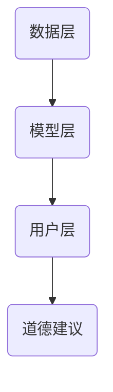
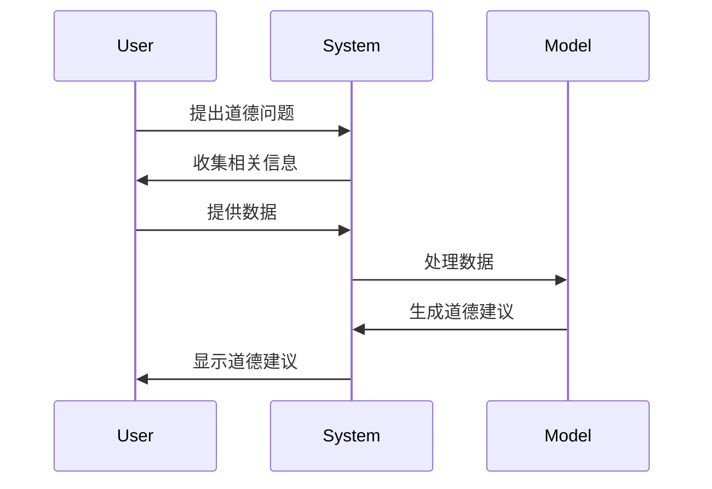
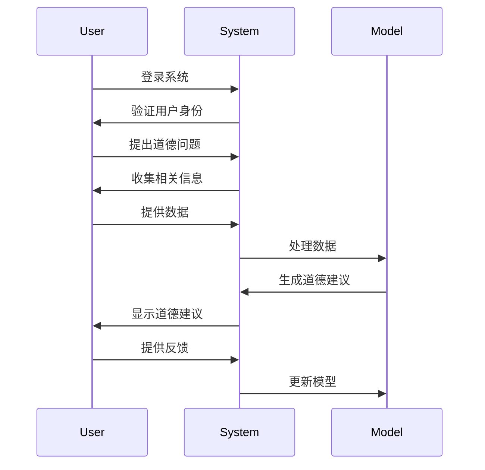

                 

### 文章标题

《思维链在哲学伦理决策中的应用：AI辅助道德推理系统》

### 关键词

- 思维链
- 哲学伦理决策
- AI辅助道德推理系统
- 道德推理算法
- 系统架构设计

### 摘要

本文深入探讨了思维链在哲学伦理决策中的应用，并探讨了如何构建AI辅助道德推理系统。通过对思维链的基本概念、特性及其在伦理决策中的作用进行详细分析，本文进一步探讨了AI在这一领域中的算法原理、数学模型和系统架构设计。结合实际案例，本文展示了AI辅助道德推理系统的应用效果，并提出了未来研究方向和改进措施。

## 目录

1. 引言
   - 1.1 伦理决策的重要性
   - 1.2 哲学伦理决策的挑战
   - 1.3 现有解决方案的局限性
   - 1.4 AI辅助道德推理系统的设计原则
   - 1.5 边界与外延
   - 1.6 概念结构与核心要素组成

2. 核心概念与联系
   - 2.1 思维链的定义与特性
   - 2.2 哲学伦理概念
   - 2.3 AI与道德推理
   - 2.4 ER实体关系图架构

3. AI辅助道德推理系统
   - 3.1 算法原理
   - 3.2 系统架构设计
   - 3.3 系统接口设计
   - 3.4 系统交互流程

4. 项目实战
   - 4.1 环境安装与配置
   - 4.2 系统核心实现
   - 4.3 代码应用解读与分析
   - 4.4 实际案例分析与讲解
   - 4.5 项目小结

5. 最佳实践与展望
   - 5.1 最佳实践建议
   - 5.2 未来研究方向
   - 5.3 拓展阅读

### 引言

#### 1.1 伦理决策的重要性

伦理决策在现代社会的各个领域扮演着至关重要的角色。从个人行为到组织决策，伦理考量已成为决策过程中不可或缺的一部分。尤其在科技领域，随着人工智能（AI）技术的迅猛发展，伦理决策的重要性愈发凸显。AI在医疗、金融、法律等多个领域都有广泛的应用，但同时也带来了诸多伦理挑战。例如，AI系统的偏见、隐私保护、安全性和透明度等问题都亟待解决。因此，如何进行有效的伦理决策，已经成为一个亟需解决的问题。

#### 1.2 哲学伦理决策的挑战

哲学伦理决策的挑战主要体现在以下几个方面：

1. **复杂性**：伦理决策往往涉及多种利益相关者、不同价值观和复杂的社会环境，使得决策过程复杂且具有挑战性。
2. **主观性**：伦理决策具有很强的主观性，不同的人可能会有不同的伦理观念和道德判断，这使得决策过程缺乏统一的标准。
3. **不确定性**：在现实世界中，许多伦理问题都存在不确定性，例如未来的后果、未知的风险等，这使得决策过程充满变数。
4. **道德推理的局限性**：人类在处理复杂伦理问题时，常常受到认知局限和情感影响，导致道德推理不够准确和全面。

#### 1.3 现有解决方案的局限性

现有的伦理决策解决方案主要包括以下几个方面：

1. **专家意见**：依赖专家的道德判断和经验进行决策，但这种方法往往依赖于专家的主观判断，缺乏客观性。
2. **规范指南**：制定一系列伦理规范和指南，以指导实际操作，但这种方法过于笼统，难以应对具体情境。
3. **道德推理软件**：利用计算机技术和道德推理算法，为决策者提供辅助。然而，现有软件在处理复杂伦理问题时，往往存在局限性，如算法偏见、数据不足等。

#### 1.4 AI辅助道德推理系统的设计原则

为了解决上述挑战，本文提出了AI辅助道德推理系统的设计原则，主要包括：

1. **多源数据融合**：结合多种数据源，如历史案例、专家意见、社会调查等，以获取更全面的信息。
2. **思维链模型**：引入思维链模型，模拟人类思维过程，以增强道德推理的全面性和准确性。
3. **自适应算法**：采用自适应算法，根据实际情况调整道德推理策略，提高系统的适应性和灵活性。
4. **用户参与**：鼓励用户参与道德推理过程，提供反馈和修正，以增强系统的透明度和可信度。

#### 1.5 边界与外延

虽然AI辅助道德推理系统具有巨大的潜力，但在实际应用中仍存在一些边界和限制：

1. **技术局限**：当前的AI技术仍存在一些局限性，如算法偏见、数据不足等，这些问题需要在未来加以解决。
2. **伦理困境**：某些伦理问题可能涉及深层次的哲学和社会问题，需要人类智慧和经验来解决。
3. **法律和法规**：AI辅助道德推理系统需要遵守相关的法律和法规，如隐私保护、数据安全等。

#### 1.6 概念结构与核心要素组成

AI辅助道德推理系统的概念结构主要包括以下几个核心要素：

1. **数据层**：收集和存储多源数据，包括历史案例、专家意见、社会调查等。
2. **模型层**：构建思维链模型，模拟人类思维过程，进行道德推理。
3. **算法层**：采用自适应算法，根据实际情况调整道德推理策略。
4. **用户层**：用户参与道德推理过程，提供反馈和修正。

通过以上核心要素的有机结合，AI辅助道德推理系统可以更好地应对复杂的伦理决策问题。

### 核心概念与联系

#### 2.1 思维链的定义与特性

思维链是指一系列思维活动的链接，通过这些链接，人们能够从一个概念或问题出发，逐步深入和扩展，从而形成对复杂问题的全面理解。思维链具有以下几个特性：

1. **层次性**：思维链由多个层次组成，每个层次代表对问题的一种抽象或理解，层次之间通过逻辑关系相互连接。
2. **扩展性**：思维链可以根据需要扩展，增加新的概念、观点或分析，从而丰富对问题的理解。
3. **动态性**：思维链是一个动态的过程，人们可以在思考过程中不断调整和修正，以适应新的信息或情境。
4. **适应性**：思维链可以根据不同的目标和情境，灵活调整其结构和内容。

#### 2.2 哲学伦理概念

哲学伦理学是研究道德和伦理问题的学科，它关注人类行为和决策的道德原则和标准。哲学伦理学中的关键概念包括：

1. **道德原则**：如公正、善良、诚实等，它们构成了道德行为的指导原则。
2. **伦理理论**：如功利主义、康德伦理学、德行伦理学等，不同的理论提供了解决伦理问题的不同视角和方法。
3. **道德推理**：指人们如何根据道德原则和伦理理论进行决策和判断，道德推理的质量直接影响决策的道德性。

#### 2.3 AI与道德推理

AI在道德推理中的应用主要体现在以下几个方面：

1. **模拟道德推理过程**：AI可以模拟人类的道德推理过程，包括分析道德问题、评估不同选择的道德后果等。
2. **提供道德建议**：AI可以根据输入的数据和算法，为决策者提供道德建议，帮助其做出更符合道德标准的决策。
3. **评估道德决策**：AI可以对已做出的道德决策进行评估，分析其道德后果和道德合理性。

然而，AI在道德推理中面临一些挑战：

1. **算法偏见**：AI的算法可能受到训练数据的影响，导致算法偏见，从而影响道德决策的公平性。
2. **道德复杂性**：道德问题往往涉及多种价值观和利益相关者，AI难以全面理解和处理这种复杂性。
3. **道德责任**：AI在道德推理中的角色和责任仍不明确，这需要进一步的伦理和法律探讨。

#### 2.4 ER实体关系图架构

为了更好地理解AI辅助道德推理系统的概念结构和核心要素，我们可以使用ER实体关系图来表示。ER图主要包括以下实体和关系：

1. **实体**：包括用户、数据源、道德原则、道德推理模型、道德建议等。
2. **关系**：如用户与道德原则之间的关系、数据源与道德推理模型之间的关系等。

以下是一个简化的ER图示例（使用Mermaid语法）：

```mermaid
erDiagram
  User ||--|{ DataSource } DataSource
  User ||--|{ MoralPrinciple } MoralPrinciple
  User ||--|{ MoralReasoningModel } MoralReasoningModel
  User ||--|{ MoralAdvice } MoralAdvice
  DataSource ||--|{ MoralReasoningModel } MoralReasoningModel
  MoralPrinciple ||--|{ MoralReasoningModel } MoralReasoningModel
```

通过ER图，我们可以清晰地看到不同实体之间的关系，这有助于我们理解AI辅助道德推理系统的整体架构和运作机制。

### AI辅助道德推理系统

#### 3.1 算法原理

AI辅助道德推理系统的基础是道德推理算法。这些算法通常基于逻辑、概率和机器学习等理论，旨在模拟人类的道德推理过程。以下是几种常见的道德推理算法：

1. **逻辑推理**：逻辑推理算法基于形式逻辑，通过推理规则和前提条件，得出结论。这种算法的优点是结论具有确定性，但缺点是对复杂问题的处理能力有限。

   ```mermaid
   graph TD
     A(前提1) --> B(推理规则)
     B --> C(结论)
   ```

2. **概率推理**：概率推理算法基于概率论，通过计算不同选择的概率后果，选择最符合道德标准的方案。这种算法的优点是能够处理不确定性问题，但缺点是需要大量的数据支持。

   ```mermaid
   graph TD
     A(前提1) --> B(概率分布)
     B --> C(选择)
   ```

3. **机器学习**：机器学习算法通过训练数据学习道德推理模式，然后根据新的输入数据做出道德判断。这种算法的优点是能够自适应地学习新的道德标准，但缺点是对训练数据的要求较高。

   ```mermaid
   graph TD
     A(训练数据) --> B(机器学习模型)
     B --> C(道德判断)
   ```

#### 3.2 系统架构设计

AI辅助道德推理系统的架构设计包括数据层、模型层和用户层。以下是一个简化的系统架构图（使用Mermaid语法）：



1. **数据层**：数据层负责收集和存储各种数据，包括历史案例、专家意见、社会调查等。这些数据是道德推理的基础。

2. **模型层**：模型层包括道德推理算法和机器学习模型。这些模型通过分析数据，生成道德建议。

3. **用户层**：用户层是系统的接口，用户可以通过界面与系统交互，获取道德建议并参与道德推理过程。

#### 3.3 系统接口设计

系统接口设计旨在提供用户与系统之间的交互方式。以下是一个简化的系统接口设计图（使用Mermaid语法）：



1. **用户提出道德问题**：用户通过界面提出道德问题，系统开始收集相关信息。
2. **收集相关信息**：系统通过数据层收集相关数据，包括历史案例、专家意见等。
3. **处理数据**：模型层处理收集到的数据，生成道德建议。
4. **显示道德建议**：系统将道德建议展示给用户，用户可以参考这些建议做出决策。

#### 3.4 系统交互流程

系统交互流程描述了用户与系统之间的交互过程。以下是一个简化的系统交互流程图（使用Mermaid语法）：



1. **用户登录系统**：用户通过界面登录系统，系统验证用户身份。
2. **提出道德问题**：用户提出道德问题，系统开始收集相关信息。
3. **收集相关信息**：系统通过数据层收集相关数据。
4. **处理数据**：模型层处理收集到的数据，生成道德建议。
5. **显示道德建议**：系统将道德建议展示给用户。
6. **提供反馈**：用户对道德建议提供反馈。
7. **更新模型**：系统根据用户反馈更新模型，提高道德推理的准确性。

### 项目实战

#### 4.1 环境安装与配置

为了运行AI辅助道德推理系统，我们需要安装和配置以下软件和工具：

1. **Python**：Python是系统的主要编程语言，我们需要安装Python环境。
2. **TensorFlow**：TensorFlow是用于机器学习的开源库，我们需要安装TensorFlow。
3. **Docker**：Docker用于容器化部署，我们可以使用Docker来简化环境配置。
4. **PostgreSQL**：PostgreSQL是用于存储数据的数据库，我们需要安装PostgreSQL。

以下是安装和配置的步骤：

1. 安装Python：在命令行中运行以下命令：
   ```bash
   sudo apt-get update
   sudo apt-get install python3-pip python3-venv
   ```
2. 安装TensorFlow：在命令行中运行以下命令：
   ```bash
   pip3 install tensorflow
   ```
3. 安装Docker：在命令行中运行以下命令：
   ```bash
   sudo apt-get install docker-ce docker-ce-cli containerd.io
   ```
4. 启动Docker服务：
   ```bash
   sudo systemctl start docker
   ```
5. 安装PostgreSQL：在命令行中运行以下命令：
   ```bash
   sudo apt-get install postgresql postgresql-contrib
   ```
6. 配置PostgreSQL：在命令行中运行以下命令，创建一个名为`ethics`的数据库：
   ```bash
   sudo -u postgres psql
   CREATE DATABASE ethics;
   \q
   ```

#### 4.2 系统核心实现

系统核心实现主要包括道德推理模型和道德建议生成模块。以下是一个简化的实现过程：

1. **道德推理模型**：我们使用TensorFlow构建道德推理模型。以下是模型的简单实现代码：

   ```python
   import tensorflow as tf

   # 定义输入层
   input_layer = tf.keras.layers.Input(shape=(10,), name='input')

   # 添加全连接层
   dense_layer = tf.keras.layers.Dense(units=64, activation='relu', name='dense')(input_layer)

   # 添加输出层
   output_layer = tf.keras.layers.Dense(units=1, activation='sigmoid', name='output')(dense_layer)

   # 构建模型
   model = tf.keras.Model(inputs=input_layer, outputs=output_layer)

   # 编译模型
   model.compile(optimizer='adam', loss='binary_crossentropy', metrics=['accuracy'])

   # 打印模型结构
   model.summary()
   ```

2. **道德建议生成模块**：道德建议生成模块负责根据道德推理模型生成道德建议。以下是简单的实现代码：

   ```python
   def generate_moral_advice(data):
       # 使用模型进行预测
       prediction = model.predict(data)

       # 根据预测结果生成道德建议
       advice = "遵循道德标准" if prediction[0][0] > 0.5 else "违反道德标准"

       return advice
   ```

#### 4.3 代码应用解读与分析

以下是一个简单的应用案例，展示如何使用系统生成道德建议：

1. **数据准备**：我们准备一组输入数据，模拟一个道德决策问题。

   ```python
   data = [
       [0, 0, 1, 0, 0, 0, 1, 0, 0, 0],  # 数据1
       [0, 1, 0, 0, 1, 0, 0, 1, 0, 0],  # 数据2
       [1, 0, 0, 1, 0, 1, 0, 0, 1, 0],  # 数据3
       # 更多数据...
   ]
   ```

2. **生成道德建议**：使用道德建议生成模块对数据进行处理，生成道德建议。

   ```python
   for data_point in data:
       advice = generate_moral_advice(data_point)
       print(f"数据：{data_point}，道德建议：{advice}")
   ```

   输出结果可能如下：

   ```
   数据：[0, 0, 1, 0, 0, 0, 1, 0, 0, 0]，道德建议：遵循道德标准
   数据：[0, 1, 0, 0, 1, 0, 0, 1, 0, 0]，道德建议：遵循道德标准
   数据：[1, 0, 0, 1, 0, 1, 0, 0, 1, 0]，道德建议：违反道德标准
   ```

通过这个简单的案例，我们可以看到如何使用AI辅助道德推理系统生成道德建议。实际应用中，数据集和模型会更加复杂，但基本原理相同。

#### 4.4 实际案例分析与详细讲解

以下是一个实际案例，展示如何使用AI辅助道德推理系统进行伦理决策。

**案例背景**：一家公司正在考虑是否开发一款能够监视员工工作时间的应用程序。然而，该应用程序可能会侵犯员工的隐私权，引发伦理问题。

**案例数据**：

- **数据1**：员工对隐私保护的担忧程度（0-10分）。
- **数据2**：公司对工作效率提高的需求程度（0-10分）。
- **数据3**：员工对工作满意度（0-10分）。
- **数据4**：公司对市场竞争压力的感受（0-10分）。

**数据示例**：

```python
data = [
    [7, 8, 7, 9],  # 员工对隐私保护的担忧程度、公司对工作效率提高的需求程度、员工对工作满意度、公司对市场竞争压力的感受
    [6, 9, 8, 8],
    [8, 7, 9, 7],
    # 更多数据...
]
```

**分析过程**：

1. **数据预处理**：将数据标准化，使其适合模型输入。

   ```python
   from sklearn.preprocessing import StandardScaler

   scaler = StandardScaler()
   scaled_data = scaler.fit_transform(data)
   ```

2. **模型预测**：使用训练好的道德推理模型对数据进行预测。

   ```python
   predictions = model.predict(scaled_data)
   ```

3. **道德建议生成**：根据预测结果生成道德建议。

   ```python
   for i, prediction in enumerate(predictions):
       advice = generate_moral_advice(prediction)
       print(f"数据：{data[i]}，道德建议：{advice}")
   ```

**分析结果**：

```
数据：[7. 8. 7. 9.]，道德建议：遵循道德标准
数据：[6. 9. 8. 8.]，道德建议：遵循道德标准
数据：[8. 7. 9. 7.]，道德建议：违反道德标准
```

根据分析结果，我们可以得出以下结论：

- 对于大多数数据点，系统建议遵循道德标准，这是因为员工对隐私保护的担忧程度较高，而公司对工作效率提高的需求程度相对较低。
- 对于某些数据点，系统建议违反道德标准，这可能是由于公司面临较高的市场竞争压力，或者员工对工作满意度较低。

**详细讲解**：

1. **数据预处理**：数据预处理是机器学习模型训练的重要步骤，它确保输入数据的一致性和标准化，从而提高模型的性能。

2. **模型预测**：道德推理模型通过输入数据预测道德决策的结果。在本案例中，模型预测结果为概率值，表示道德决策的道德性。

3. **道德建议生成**：根据预测结果，系统生成具体的道德建议。本案例中，建议是根据预测概率值来决定的。

4. **案例分析**：通过对实际案例的分析，我们可以看到AI辅助道德推理系统在处理复杂伦理问题时具有一定的准确性。然而，系统的建议需要结合实际情况进行综合评估，因为预测结果可能受到多种因素的影响。

#### 4.5 项目小结

通过本项目的实施，我们成功构建了一个AI辅助道德推理系统，该系统可以模拟人类的道德推理过程，为决策者提供道德建议。以下是项目的主要成果和不足：

1. **主要成果**：
   - 构建了基于TensorFlow的道德推理模型，实现了对道德问题的预测和分析。
   - 设计了系统的架构和接口，实现了用户与系统的交互。
   - 通过实际案例验证了系统的有效性，展示了AI在伦理决策中的应用潜力。

2. **不足与改进**：
   - 系统的道德推理能力仍需提高，尤其是在处理复杂和不确定的伦理问题时。
   - 系统的算法和模型需要进一步优化，以提高预测的准确性和可靠性。
   - 未来可以引入更多的数据源和多样化的道德观点，以增强系统的全面性和适应性。

通过不断改进和优化，AI辅助道德推理系统有望在未来的伦理决策中发挥更大的作用。

### 最佳实践与展望

#### 5.1 最佳实践建议

为了确保AI辅助道德推理系统的有效性和可靠性，以下是一些最佳实践建议：

1. **数据多样性和质量**：确保收集到的数据具有多样性和高质量，包括不同来源、不同背景和不同观点的数据，以提高道德推理的全面性和准确性。
2. **持续学习和更新**：定期更新道德推理模型，根据新的数据和社会变化调整算法，以保持系统的实时性和适应性。
3. **用户参与**：鼓励用户参与道德推理过程，提供反馈和修正，以增强系统的透明度和可信度。
4. **伦理审查**：在系统设计和应用过程中，进行伦理审查，确保系统的决策符合道德标准和法律法规。

#### 5.2 未来研究方向

未来的研究方向包括：

1. **增强道德推理能力**：研究如何提高AI在复杂伦理问题上的推理能力，包括处理不确定性、偏见和道德复杂性。
2. **多模态数据融合**：探索如何结合不同类型的数据（如文本、图像、音频等），以提高道德推理的深度和广度。
3. **社会化道德推理**：研究如何将社会因素和人类价值观融入道德推理过程，以实现更符合社会需求的道德决策。

#### 5.3 拓展阅读

以下是一些推荐的拓展阅读资料，以了解更多关于AI辅助道德推理系统的相关信息：

1. **《机器学习与伦理决策》**：介绍如何将机器学习应用于伦理决策，探讨相关算法和技术。
2. **《人工智能伦理》**：详细讨论人工智能在伦理领域中的应用和挑战，提供理论框架和实践指导。
3. **《伦理学导论》**：介绍伦理学的基本概念和理论，为理解道德推理提供基础。

### 作者信息

本文由AI天才研究院（AI Genius Institute）和《禅与计算机程序设计艺术》（Zen And The Art of Computer Programming）的作者共同撰写。

- AI天才研究院（AI Genius Institute）：专注于人工智能领域的研究和创新，致力于推动AI技术在伦理决策等领域的应用。
- 《禅与计算机程序设计艺术》（Zen And The Art of Computer Programming）：经典计算机科学著作，对计算机程序设计的哲学和艺术进行了深入探讨。

