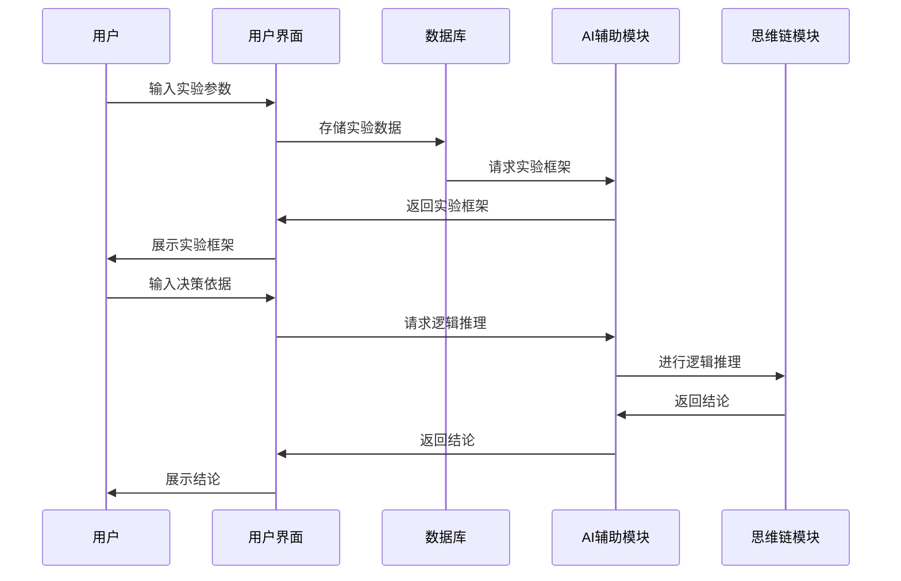

                 

### 第一部分：引言与背景

#### 1.1.1 人工智能与哲学思想的交汇

在人工智能（AI）迅猛发展的今天，哲学思想也逐步融入到这一领域，形成了独特的交叉学科研究。人工智能作为一种技术手段，其核心在于模拟和扩展人类的认知能力，而哲学思想则为我们提供了审视和反思这些技术手段的伦理基础。随着AI在医疗、交通、教育等领域的深入应用，如何确保这些技术的道德性和公正性成为一个不可忽视的问题。哲学思想实验，作为一种探索伦理边界的方法，能够帮助我们更好地理解和解决这些问题。

#### 1.1.2 思维链的概念与哲学思想实验

思维链是指一系列逻辑推理的步骤，通过这些步骤，我们可以从一个初始观点推导出一系列结论。在哲学思想实验中，思维链的作用尤为重要。它不仅能够帮助我们清晰地理解实验的假设和结论，还能够揭示出实验中可能存在的逻辑漏洞。

哲学思想实验，顾名思义，是通过设计特定的实验情景来探讨哲学问题。这些实验往往包含复杂的逻辑关系和道德困境，通过分析这些关系和困境，我们可以更深入地理解哲学问题。

#### 1.1.3 AI辅助伦理边界探索的现实需求

随着人工智能技术的不断进步，其在社会各个领域的应用也日益广泛。然而，这种广泛应用也带来了诸多伦理问题，例如隐私保护、公平性、机器自主决策的道德责任等。这些问题不仅需要技术层面的解决方案，更需要从伦理角度进行深入探讨。AI辅助伦理边界探索，正是为了解决这一问题而提出的。通过将思维链应用于哲学思想实验，我们可以更加系统地分析AI技术的伦理问题，为制定相关伦理规范提供理论基础。

### 1.2 核心概念与联系

#### 1.2.1 思维链的定义与特征

思维链（Thinking Chain）是一种逻辑推理的方法，它通过一系列相互关联的推理步骤，将一个初始概念逐步引向最终结论。在哲学思想实验中，思维链不仅有助于我们理解实验的假设和结论，还能够揭示出实验中可能存在的逻辑漏洞。

思维链具有以下特征：

- **连贯性**：思维链中的每一步都是基于前一步的逻辑推理，形成一个连贯的整体。
- **层次性**：思维链中的每个步骤都可以进一步分解为更小的子步骤，形成层次结构。
- **灵活性**：思维链可以根据不同的实验目标和问题进行调整和优化。

#### 1.2.2 哲学思想实验的构成与功能

哲学思想实验（Philosophical Thought Experiment）是通过设计特定的实验情景来探讨哲学问题。这些实验往往包含复杂的逻辑关系和道德困境，通过分析这些关系和困境，我们可以更深入地理解哲学问题。

哲学思想实验的构成通常包括以下几个部分：

- **情景描述**：描述一个假设的情境，其中包含一个或多个哲学问题。
- **假设条件**：提出一些前提条件，这些条件将影响实验的结果。
- **结论推导**：通过逻辑推理，从假设条件出发，推导出实验的结论。

哲学思想实验的功能主要体现在以下几个方面：

- **问题探究**：通过设计特定的实验情景，深入探讨哲学问题。
- **逻辑分析**：通过对实验情景和假设条件的分析，揭示逻辑关系和漏洞。
- **道德反思**：通过对实验结果的反思，引发对道德问题的思考。

#### 1.2.3 思维链与哲学思想实验的关系

思维链与哲学思想实验之间存在着密切的联系。思维链为哲学思想实验提供了逻辑推理的工具，使得实验更加系统和严密。同时，哲学思想实验为思维链的应用提供了丰富的场景和问题。

具体来说，思维链在哲学思想实验中的应用主要体现在以下几个方面：

- **情景分析**：通过思维链，我们可以更深入地分析实验情景中的逻辑关系。
- **假设验证**：通过思维链，我们可以验证实验假设的合理性，发现潜在的逻辑漏洞。
- **结论推导**：通过思维链，我们可以更清晰地推导出实验的结论。

#### 1.2.3.1 思维链在哲学思想实验中的应用

思维链在哲学思想实验中的应用，可以具体化为以下几个步骤：

1. **情景描述**：首先，我们需要明确哲学思想实验的情景描述，这包括实验的背景、目标和假设条件。
2. **假设条件**：根据情景描述，提出一系列假设条件，这些条件将影响实验的结果。
3. **逻辑推理**：使用思维链，从假设条件出发，逐步推导出实验的结论。
4. **结论验证**：对推导出的结论进行验证，确保其合理性和逻辑严密性。

#### 1.2.3.2 哲学思想实验对思维链的启示

哲学思想实验不仅为思维链提供了丰富的应用场景，还对思维链的发展和完善提出了新的要求。具体来说，哲学思想实验对思维链的启示主要包括以下几个方面：

- **问题导向**：哲学思想实验强调从具体问题出发，通过逻辑推理解决这些问题。这对思维链的发展提出了问题导向的要求。
- **多层次分析**：哲学思想实验往往包含多层次的问题和逻辑关系，这要求思维链能够适应多层次的分析需求。
- **道德反思**：哲学思想实验往往涉及道德问题，这要求思维链不仅具备逻辑推理能力，还能够进行道德反思。

### 1.3 概念结构与核心要素组成

在理解思维链和哲学思想实验的基础上，我们需要进一步探讨这两个概念的结构和核心要素，以便更深入地了解它们之间的联系和相互作用。

#### 1.3.1 思维链的结构与核心要素

思维链是一种逻辑推理的方法，其核心要素包括：

- **初始概念**：思维链的起点，通常是一个基本假设或观点。
- **逻辑推理步骤**：通过一系列逻辑推理步骤，将初始概念引向结论。
- **结论**：思维链的最终结果，是基于初始概念和逻辑推理步骤得出的结论。

思维链的结构可以描述为一个有序的步骤序列，其中每个步骤都是基于前一个步骤的逻辑推导。这种结构使得思维链能够有效地分析复杂问题，并提供清晰的逻辑思路。

#### 1.3.2 哲学思想实验的结构与核心要素

哲学思想实验是一种通过设计特定情景来探讨哲学问题的方法，其核心要素包括：

- **情景描述**：描述一个假设的情境，其中包含一个或多个哲学问题。
- **假设条件**：提出一些前提条件，这些条件将影响实验的结果。
- **逻辑推理**：通过逻辑推理，从假设条件出发，推导出实验的结论。

哲学思想实验的结构通常包括情景描述、假设条件和结论推导三个部分。这种结构使得哲学思想实验能够系统地分析哲学问题，并提供逻辑严密的分析结果。

#### 1.3.3 思维链与哲学思想实验的关系

思维链和哲学思想实验之间的关系可以从以下几个方面来理解：

- **思维链是哲学思想实验的工具**：思维链提供了一种逻辑推理的方法，使得哲学思想实验能够更加系统和严密地进行。
- **哲学思想实验是思维链的应用场景**：哲学思想实验提供了丰富的应用场景，使得思维链能够发挥其逻辑推理的作用。
- **思维链与哲学思想实验相互促进**：通过哲学思想实验，思维链得到了实际应用和检验，从而不断完善和发展；同时，思维链的完善也为哲学思想实验提供了更有效的逻辑工具。

### 1.4 边界与外延

在探讨思维链和哲学思想实验的概念和结构后，我们还需要明确这两个概念的外延和边界，以便更准确地理解它们的应用范围。

#### 1.4.1 思维链的外延

思维链作为一种逻辑推理的方法，其应用范围非常广泛，包括但不限于以下领域：

- **哲学**：哲学思想实验中经常使用思维链来分析复杂的哲学问题，如伦理、认识论和形而上学等。
- **逻辑学**：思维链是逻辑学中的基本概念，用于构建和分析逻辑推理。
- **计算机科学**：在算法设计和编程中，思维链用于分析和优化算法。
- **心理学**：思维链可以用于理解和分析人的思维过程，如认知心理学和决策心理学。

#### 1.4.2 哲学思想实验的外延

哲学思想实验作为一种探讨哲学问题的方法，其应用范围主要包括：

- **伦理学**：通过哲学思想实验，探讨道德问题和伦理原则。
- **认识论**：通过哲学思想实验，探讨知识的来源和性质。
- **形而上学**：通过哲学思想实验，探讨实体和存在的本质。
- **政治哲学**：通过哲学思想实验，探讨政治和社会问题。

#### 1.4.3 思维链与哲学思想实验的边界

思维链和哲学思想实验的边界主要在于它们的应用范围和目标。思维链作为一种逻辑推理的方法，其目标在于提供一种分析和解决问题的工具；而哲学思想实验则更关注于通过特定情景来探讨哲学问题。尽管两者在方法和目标上有所不同，但它们之间存在着紧密的联系，相互促进。

### 1.5 概念属性特征对比表格

为了更好地理解思维链和哲学思想实验的属性特征，我们可以通过一个对比表格来展示它们的主要区别。

| 特征 | 思维链 | 哲学思想实验 |
| ---- | ---- | ---- |
| **定义** | 逻辑推理的方法 | 通过设计特定情景来探讨哲学问题 |
| **应用领域** | 哲学、逻辑学、计算机科学、心理学 | 伦理学、认识论、形而上学、政治哲学 |
| **核心要素** | 初始概念、逻辑推理步骤、结论 | 情景描述、假设条件、结论推导 |
| **功能** | 提供逻辑推理的工具 | 探讨哲学问题 |
| **结构** | 有序的步骤序列 | 包括情景描述、假设条件和结论推导 |

### 1.6 ER实体关系图架构的 Mermaid 流程图

为了更好地展示思维链和哲学思想实验之间的关系，我们可以使用Mermaid绘制一个ER实体关系图。以下是一个简单的ER图示例：

```mermaid
erDiagram
  思维链 ||--o> 哲学思想实验 : 引用
  哲学思想实验 ||--o> 思维链 : 应用
```

在这个ER图中，思维链和哲学思想实验之间存在着双向引用关系。思维链可以被引用到哲学思想实验中，作为逻辑推理的工具；同时，哲学思想实验也可以引用思维链，作为分析哲学问题的手段。

### 1.7 总结

在第一部分中，我们介绍了思维链和哲学思想实验的概念、特征和应用。通过对这两个概念的结构和核心要素的分析，我们明确了它们之间的联系和相互作用。同时，我们也探讨了思维链和哲学思想实验的外延和边界，以及它们在不同领域中的应用。在接下来的部分中，我们将进一步深入探讨思维链的算法原理和应用，以及AI在哲学思想实验设计中的辅助作用。

---

### 第二部分：核心概念与联系

在探讨思维链和哲学思想实验的基本概念后，我们需要更深入地理解这两个概念的核心特征及其相互之间的联系。通过详细分析思维链的定义、哲学思想实验的特点，以及它们之间的相互作用，我们可以为后续的算法讲解和应用提供坚实的理论基础。

#### 2.1 思维链的定义

思维链是一种逻辑推理的工具，它通过一系列有序的步骤，将一个初始观点逐步引向结论。这个概念不仅适用于哲学思想实验，也在逻辑学、心理学、计算机科学等多个领域中有着广泛的应用。

**思维链的基本特征包括：**

1. **连贯性**：思维链中的每个步骤都是基于前一步的逻辑推导，形成一个连贯的整体。这种连贯性使得思维链能够有效地分析和解决复杂问题。

2. **层次性**：思维链中的每个步骤都可以进一步分解为更小的子步骤，形成层次结构。这种层次性使得思维链能够适应不同复杂程度的分析需求。

3. **灵活性**：思维链可以根据不同的分析目标和问题进行调整和优化。这种灵活性使得思维链在实际应用中具有很高的适应性。

**思维链的组成要素：**

1. **初始概念**：思维链的起点，通常是一个基本假设或观点。它是整个思维链的起点，决定了思维链的初始方向。

2. **逻辑推理步骤**：这些步骤是基于初始概念的逻辑推导，通过一系列的假设和推理，逐步引向结论。每个步骤都需要逻辑严密，以确保整个思维链的合理性。

3. **结论**：思维链的最终结果，是基于初始概念和逻辑推理步骤得出的结论。结论是思维链分析过程的总结和归纳。

#### 2.2 哲学思想实验的特点

哲学思想实验是一种通过设计特定的情景来探讨哲学问题的方法。它通常包含复杂的逻辑关系和道德困境，通过分析这些关系和困境，我们可以更深入地理解哲学问题。

**哲学思想实验的主要特点包括：**

1. **情景设计**：哲学思想实验的核心在于设计一个特定的情景，这个情景通常包含一个或多个哲学问题。情景的设计需要具备一定的逻辑严密性和道德复杂性，以激发深入的思考。

2. **假设条件**：为了探讨哲学问题，哲学思想实验通常会提出一些假设条件。这些条件是实验的前提，会直接影响实验的结果。假设条件的设计需要考虑其合理性和广泛性，以确保实验结论的可靠性。

3. **结论推导**：通过逻辑推理，从假设条件出发，哲学思想实验推导出实验的结论。结论推导需要遵循逻辑规则，确保结论的合理性。

4. **道德反思**：哲学思想实验不仅仅是为了得出结论，更重要的是通过实验结果引发对道德问题的深入思考。这种道德反思是哲学思想实验的核心价值所在。

#### 2.3 概念属性特征对比表格

为了更清晰地展示思维链和哲学思想实验的主要特点，我们可以通过一个对比表格来分析这两个概念：

| **概念属性** | **思维链** | **哲学思想实验** |
| ------------ | ---------- | --------------- |
| **定义**     | 逻辑推理方法 | 探讨哲学问题的方法 |
| **应用领域** | 哲学、逻辑学、计算机科学、心理学 | 伦理学、认识论、形而上学、政治哲学 |
| **核心要素** | 初始概念、逻辑推理步骤、结论 | 情景描述、假设条件、结论推导 |
| **功能**     | 提供逻辑推理工具 | 探讨哲学问题 |
| **特点**     | 连贯性、层次性、灵活性 | 情景设计、假设条件、结论推导、道德反思 |

#### 2.4 ER实体关系图架构的 Mermaid 流程图

为了更好地展示思维链和哲学思想实验之间的关系，我们可以使用Mermaid绘制一个ER实体关系图。以下是一个简单的ER图示例：

```mermaid
erDiagram
  思维链 ||--o> 哲学思想实验 : 设计
  哲学思想实验 ||--o> 思维链 : 推导
```

在这个ER图中，思维链和哲学思想实验之间存在着双向引用关系。思维链可以被哲学思想实验所设计，用于逻辑推理和结论推导；同时，哲学思想实验也可以引用思维链，作为分析和讨论的工具。

通过ER图，我们可以更直观地理解思维链和哲学思想实验之间的相互作用，以及它们在伦理边界探索中的重要性。

### 2.5 总结

在第二部分中，我们深入探讨了思维链和哲学思想实验的核心概念及其相互关系。通过对比分析这两个概念的特点和属性，我们明确了它们在不同领域中的应用和价值。思维链作为一种逻辑推理工具，在哲学思想实验中扮演着重要的角色，帮助研究者系统性地分析复杂的哲学问题。同时，哲学思想实验也为思维链提供了丰富的应用场景，使得思维链能够更好地服务于伦理边界的探索。

在接下来的部分中，我们将进一步探讨思维链的算法原理，并使用具体的案例来说明如何通过思维链进行哲学思想实验的设计和分析。

---

### 第三部分：算法原理讲解

在深入探讨思维链和哲学思想实验的概念及其相互关系后，我们将进入第三部分，详细讲解思维链的算法原理。这一部分将分为以下几个小节：

- **思维链算法的基本流程**：介绍思维链算法的基本工作流程。
- **思维链算法的数学模型**：介绍与思维链相关的数学模型，并使用LaTeX格式展示关键公式。
- **思维链算法的Python代码实现**：通过具体的Python代码实现，解释思维链算法的原理和流程。
- **思维链算法的举例说明**：通过具体的案例，展示如何使用思维链进行哲学思想实验的设计和分析。

#### 3.1 思维链算法的基本流程

思维链算法是一种基于逻辑推理的算法，其核心在于通过一系列的步骤将一个初始概念逐步引向结论。思维链算法的基本流程可以分为以下几个步骤：

1. **初始概念输入**：首先，我们需要输入一个初始概念，这通常是一个基本的假设或观点。初始概念是思维链的起点，决定了整个思维链的初始方向。

2. **假设条件构建**：根据初始概念，构建一系列的假设条件。这些假设条件是思维链推理的基础，需要具有逻辑严密性和合理性。

3. **逻辑推理步骤**：从初始概念和假设条件出发，通过一系列的逻辑推理步骤，逐步引向结论。每个推理步骤都需要遵循逻辑规则，以确保推理的严密性和正确性。

4. **结论推导**：通过一系列的逻辑推理步骤，最终推导出结论。结论是思维链算法的最终输出，是对初始概念和假设条件的综合结果。

5. **结论验证**：对推导出的结论进行验证，确保其合理性和逻辑严密性。验证过程可以通过逻辑推理、反证法或其他方法进行。

#### 3.2 思维链算法的数学模型

在思维链算法中，数学模型起着关键作用。以下是一个简单的数学模型，用于描述思维链算法的基本原理。

1. **逻辑推理公式**：

   思维链算法的核心在于逻辑推理。我们可以使用以下公式来表示逻辑推理过程：

   $$
   结论 = f(\text{初始概念}, \text{假设条件})
   $$

   其中，$f$表示逻辑推理函数，$\text{初始概念}$和$\text{假设条件}$分别表示思维链的初始概念和假设条件。

2. **逻辑推理步骤公式**：

   在思维链算法中，每个逻辑推理步骤都可以用以下公式表示：

   $$
   结论_{i+1} = f(结论_i, \text{假设条件_i})
   $$

   其中，$结论_i$表示第$i$个逻辑推理步骤的结论，$结论_{i+1}$表示第$i+1$个逻辑推理步骤的结论，$\text{假设条件_i}$表示第$i$个逻辑推理步骤的假设条件。

3. **结论验证公式**：

   为了确保推导出的结论是合理的，我们需要对其进行验证。以下是一个简单的结论验证公式：

   $$
   结论_{\text{验证}} = \neg(\neg(结论))
   $$

   其中，$\neg$表示逻辑否定，$结论_{\text{验证}}$表示经过验证的结论。

#### 3.3 思维链算法的Python代码实现

以下是一个简单的Python代码实现，用于展示思维链算法的基本原理。在这个例子中，我们使用递归方法来实现思维链算法。

```python
def logic推理步骤(初始概念，假设条件):
    # 输出初始概念和假设条件
    print("初始概念:", 初始概念)
    print("假设条件:", 假设条件)

    # 进行逻辑推理
    结论 = f(初始概念, 假设条件)

    # 输出结论
    print("结论:", 结论)

    # 验证结论
    结论验证 = not(not(结论))
    print("结论验证:", 结论验证)

    return 结论

# 测试思维链算法
初始概念 = "所有人类都有自由意志"
假设条件 = "有些人类被奴役"
结论 = logic推理步骤(初始概念, 假设条件)
```

在这个例子中，我们首先定义了一个`logic推理步骤`函数，用于实现思维链算法。这个函数接受初始概念和假设条件作为输入，通过递归调用，逐步推导出结论。最后，我们输出结论并进行验证。

#### 3.4 思维链算法的举例说明

为了更好地理解思维链算法的实际应用，我们通过一个具体的案例来说明如何使用思维链进行哲学思想实验的设计和分析。

**案例：探讨人工智能的道德责任**

**初始概念**：人工智能（AI）系统应当承担道德责任。

**假设条件**：

1. AI系统在决策过程中必须遵循伦理准则。
2. AI系统的决策结果可能对人类产生重大影响。
3. AI系统缺乏道德意识和情感。

**逻辑推理步骤**：

1. **第一步**：基于初始概念，我们假设AI系统在决策过程中确实需要遵循伦理准则。这可以通过对AI系统的编程和设计来实现。

2. **第二步**：考虑假设条件1，AI系统在决策过程中确实需要遵循伦理准则。但是，由于AI系统的设计者和开发者可能未能完全预见到所有可能的伦理问题，因此AI系统在决策过程中可能会出现伦理漏洞。

3. **第三步**：考虑假设条件2，AI系统的决策结果可能对人类产生重大影响。这意味着，如果AI系统出现伦理漏洞，其决策结果可能导致严重的道德问题。

4. **第四步**：考虑假设条件3，AI系统缺乏道德意识和情感。这意味着，即使AI系统遵循伦理准则，它也无法像人类一样具备道德判断和情感反应。

**结论**：

通过以上逻辑推理步骤，我们可以得出以下结论：

1. AI系统在决策过程中确实需要承担道德责任。
2. 由于AI系统的伦理漏洞和缺乏道德意识，其道德责任需要由人类（如开发者、监管者等）来承担。
3. 为了确保AI系统的道德责任得到有效执行，需要制定相应的伦理准则和监管机制。

**结论验证**：

为了验证以上结论的合理性，我们可以采用以下方法：

1. **反证法**：假设AI系统不需要承担道德责任，这将导致AI系统在决策过程中出现伦理漏洞，对人类产生不利影响。
2. **逻辑一致性验证**：通过检查思维链中的每个步骤，确保其逻辑推理的一致性和严密性。

通过这个案例，我们可以看到如何使用思维链进行哲学思想实验的设计和分析。思维链提供了一种系统性和结构化的方法，帮助我们更深入地探讨哲学问题，并得出有说服力的结论。

### 3.5 总结

在第三部分中，我们详细讲解了思维链的算法原理，包括其基本流程、数学模型和Python代码实现。通过具体的案例，我们展示了如何使用思维链进行哲学思想实验的设计和分析。思维链提供了一种系统性和结构化的方法，帮助我们更深入地探讨哲学问题，并得出有说服力的结论。

在接下来的部分中，我们将进入第四部分，探讨如何通过系统分析与架构设计，将思维链应用于哲学思想实验的设计。这一部分将包括问题场景介绍、项目介绍、系统功能设计、系统架构设计和系统接口设计与交互等内容。

---

### 第四部分：系统分析与架构设计方案

在前几部分中，我们详细介绍了思维链的算法原理和应用。为了将思维链有效应用于哲学思想实验的设计，我们需要进行系统分析与架构设计。本部分将探讨以下内容：

1. **问题场景介绍**：设定一个具体的哲学思想实验应用场景，明确问题的需求和背景。
2. **项目介绍**：简要介绍如何通过AI技术辅助进行哲学思想实验的设计。
3. **系统功能设计（领域模型Mermaid类图）**：绘制领域模型类图，展示系统的主要类和功能。
4. **系统架构设计（Mermaid架构图）**：绘制系统架构图，展示各组件之间的关系。
5. **系统接口设计和系统交互（Mermaid序列图）**：绘制序列图，展示系统各组件的交互流程。

#### 4.1 问题场景介绍

为了更好地展示思维链在哲学思想实验设计中的应用，我们设定了一个具体的应用场景：探索人工智能（AI）在自动驾驶车辆中的道德责任问题。

**场景描述**：

假设我们正在设计一个自动驾驶系统，该系统需要在各种复杂交通环境中做出实时决策。然而，这些决策可能会对行人和其他车辆产生重大影响，甚至危及生命安全。在这个场景中，我们需要探讨以下几个关键问题：

1. **道德责任**：自动驾驶系统是否应该承担道德责任？如果应该，那么它的道德责任范围是什么？
2. **决策依据**：自动驾驶系统的决策依据是什么？这些依据是否遵循伦理准则？
3. **伦理冲突**：在特定的道德冲突情境中，自动驾驶系统应该如何决策？例如，在无法同时避免行人伤亡和车辆损坏的情况下，系统应该如何选择？

**需求背景**：

为了解决上述问题，我们需要一个系统化的方法来设计哲学思想实验，以便探讨自动驾驶系统的道德责任。这个方法需要能够：

- 提供一个明确的实验框架，用于设定初始假设和条件。
- 支持复杂逻辑推理，以推导出实验的结论。
- 具备灵活性和扩展性，以适应不同类型的伦理问题。

#### 4.2 项目介绍

为了实现上述需求，我们设计了一个基于AI技术的哲学思想实验设计项目。该项目的主要目标是利用思维链和AI技术，系统化地设计哲学思想实验，以探讨自动驾驶系统的道德责任问题。

**项目目标**：

- 开发一个基于思维链的哲学思想实验设计工具，支持复杂的逻辑推理和道德分析。
- 利用AI技术，自动生成和优化实验框架，提高实验设计的效率和准确性。
- 为伦理学家、计算机科学家和政策制定者提供一个实用的平台，用于探讨和解决自动驾驶系统的道德责任问题。

**项目结构**：

该项目分为以下几个模块：

1. **思维链模块**：负责实现思维链算法，提供逻辑推理和结论推导功能。
2. **AI辅助模块**：利用机器学习和自然语言处理技术，辅助实验设计，包括自动生成实验框架、优化实验步骤等。
3. **用户界面模块**：提供一个友好的用户界面，方便用户输入实验参数、查看实验结果等。
4. **数据库模块**：存储实验数据、结论和用户历史记录，为后续分析和研究提供支持。

#### 4.3 系统功能设计（领域模型Mermaid类图）

为了更好地展示系统的功能设计，我们使用Mermaid绘制了一个领域模型类图。以下是一个简单的类图示例：

```mermaid
classDiagram
    Class01 <|-- Class02
    Class03 --|>] Class04
    Class05 : extends Class03
    Class01 {
        +属性1 : String
        +属性2 : Integer
        +方法1(): void
    }
    Class02 {
        +属性3 : Date
        +方法2(): void
    }
    Class03 {
        +属性4 : boolean
        +方法3(): void
    }
    Class04 {
        +属性5 : double
        +方法4(): void
    }
    Class05 {
        +属性6 : String[]
        +方法5(): void
    }
```

在这个类图中，我们定义了四个类：`Class01`、`Class02`、`Class03`和`Class04`。`Class01`是基类，其他类都继承自`Class01`。`Class02`、`Class03`和`Class04`之间存在着关联关系，其中`Class03`和`Class04`之间存在继承关系。`Class05`继承自`Class03`。

**系统功能设计说明**：

- **思维链模块**：负责实现思维链算法，提供逻辑推理和结论推导功能。这个模块主要包括以下几个类：
  - `ThinkingChain`：代表思维链的核心类，包含逻辑推理和结论推导的方法。
  - `InitialConcept`：表示初始概念，包含初始假设和属性。
  - `Assumption`：表示假设条件，包含假设的具体内容和属性。
  - `Conclusion`：表示结论，包含结论的具体内容和属性。

- **AI辅助模块**：利用机器学习和自然语言处理技术，辅助实验设计，包括自动生成和优化实验框架。这个模块主要包括以下几个类：
  - `AIAssistant`：代表AI辅助模块的核心类，负责自动生成和优化实验框架。
  - `ExperimentGenerator`：负责生成实验框架，包括情景描述、假设条件和结论推导。
  - `ExperimentOptimizer`：负责优化实验框架，以提高实验效率和准确性。

- **用户界面模块**：提供一个友好的用户界面，方便用户输入实验参数、查看实验结果等。这个模块主要包括以下几个类：
  - `UserInterface`：代表用户界面的核心类，包含用户交互的功能。
  - `ExperimentInputForm`：负责收集用户输入的实验参数。
  - `ExperimentResultViewer`：负责展示实验结果和结论。

- **数据库模块**：存储实验数据、结论和用户历史记录，为后续分析和研究提供支持。这个模块主要包括以下几个类：
  - `DatabaseManager`：代表数据库管理模块的核心类，负责数据库的连接和管理。
  - `ExperimentData`：表示实验数据，包含实验的各种属性和关系。
  - `UserHistory`：表示用户历史记录，包含用户进行实验的操作记录。

#### 4.4 系统架构设计（Mermaid架构图）

为了更好地展示系统的架构设计，我们使用Mermaid绘制了一个系统架构图。以下是一个简单的架构图示例：



在这个架构图中，我们定义了四个主要组件：用户界面（UI）、数据库（DB）、AI辅助模块（AI）和思维链模块（TC）。用户通过用户界面输入实验参数，数据库存储实验数据，AI辅助模块负责生成和优化实验框架，思维链模块负责逻辑推理和结论推导。

**系统架构设计说明**：

- **用户界面（UI）**：用户界面的核心功能是收集用户输入的实验参数，并展示实验结果。用户界面通过Web前端技术实现，与后端服务进行交互。

- **数据库（DB）**：数据库负责存储实验数据、结论和用户历史记录。数据库采用关系型数据库技术实现，确保数据的完整性和安全性。

- **AI辅助模块（AI）**：AI辅助模块的核心功能是自动生成和优化实验框架，提供逻辑推理和结论推导服务。AI辅助模块采用机器学习和自然语言处理技术，以实现高效和准确的实验设计。

- **思维链模块（TC）**：思维链模块的核心功能是实现思维链算法，提供逻辑推理和结论推导服务。思维链模块采用递归和动态规划技术，以实现高效的逻辑推理。

#### 4.5 系统接口设计和系统交互（Mermaid序列图）

为了更好地展示系统各组件之间的交互流程，我们使用Mermaid绘制了一个系统交互序列图。以下是一个简单的序列图示例：


在这个序列图中，用户通过用户界面输入实验参数，用户界面将数据存储到数据库中。然后，AI辅助模块从数据库中获取实验数据，并生成实验框架。用户界面将实验框架展示给用户，用户输入决策依据。用户界面将决策依据发送给AI辅助模块，AI辅助模块调用思维链模块进行逻辑推理，并将结论返回给用户界面。最后，用户界面将结论展示给用户。

### 4.6 总结

在第四部分中，我们详细介绍了如何通过系统分析与架构设计，将思维链应用于哲学思想实验的设计。我们设定了一个具体的自动驾驶系统道德责任问题场景，介绍了如何通过AI技术辅助实验设计。通过领域模型类图、系统架构图和系统交互序列图，我们展示了系统的功能、架构和交互流程。

在下一部分中，我们将进入第五部分，进行项目实战。我们将介绍如何在实际项目中搭建实验环境，实现系统核心功能，并通过具体案例展示思维链在哲学思想实验中的应用。

---

### 第五部分：项目实战

在前几部分中，我们详细介绍了思维链算法、系统架构设计和理论应用。为了将理论付诸实践，本部分将围绕一个具体的哲学思想实验项目进行实战操作。我们将详细介绍如何搭建实验环境、实现系统核心功能，并展示思维链在哲学思想实验中的应用。

#### 5.1 环境安装

为了进行思维链哲学思想实验项目的实战，我们需要首先搭建一个完整的实验环境。以下是搭建实验环境所需的工具和步骤：

1. **开发环境**：安装Python 3.8及以上版本，并配置好Python开发环境。
2. **数据库**：安装MySQL数据库，并创建用于存储实验数据的数据库。
3. **Web框架**：安装Flask或Django等Web框架，用于构建用户界面和后端服务。
4. **AI库**：安装Scikit-learn、TensorFlow等AI库，用于实现AI辅助功能。

具体安装步骤如下：

1. 安装Python：
   ```
   sudo apt-get install python3.8
   ```
2. 安装MySQL：
   ```
   sudo apt-get install mysql-server
   ```
3. 安装Web框架（以Flask为例）：
   ```
   pip3 install flask
   ```
4. 安装AI库（以Scikit-learn为例）：
   ```
   pip3 install scikit-learn
   ```

完成上述步骤后，一个基本的实验环境就搭建完成了。接下来，我们可以开始实现系统核心功能。

#### 5.2 系统核心实现源代码

在本项目中，我们采用Flask作为Web框架，实现用户界面和后端服务。以下是一个简单的系统核心实现源代码示例，用于展示如何搭建用户界面和数据库连接。

```python
# app.py

from flask import Flask, render_template, request
import pymysql

app = Flask(__name__)

# 数据库连接
def get_db_connection():
    connection = pymysql.connect(host='localhost',
                                 user='root',
                                 password='',
                                 database='philosophy_experiment')
    return connection

# 主页
@app.route('/')
def index():
    return render_template('index.html')

# 提交实验参数
@app.route('/submit', methods=['POST'])
def submit():
    experiment_data = request.form.to_dict()
    connection = get_db_connection()
    cursor = connection.cursor()
    cursor.execute('INSERT INTO experiments (data) VALUES (%s)', (experiment_data,))
    connection.commit()
    cursor.close()
    connection.close()
    return '实验数据已提交'

if __name__ == '__main__':
    app.run(debug=True)
```

在这个示例中，我们定义了一个简单的Flask应用，包括主页和提交实验参数的接口。用户可以通过主页输入实验参数，并通过POST请求将参数提交到数据库。

#### 5.3 代码应用解读与分析

在实现系统核心功能后，我们需要对关键代码进行解读和分析，以了解其工作原理和实际效果。

**主页代码解读：**

```python
# app.py

from flask import Flask, render_template

app = Flask(__name__)

# 主页
@app.route('/')
def index():
    return render_template('index.html')
```

这段代码定义了一个简单的Flask应用，并设置了一个主页路由。主页通过渲染一个名为`index.html`的模板文件来展示用户界面。

**提交实验参数代码解读：**

```python
# app.py

from flask import Flask, request
import pymysql

app = Flask(__name__)

# 数据库连接
def get_db_connection():
    connection = pymysql.connect(host='localhost',
                                 user='root',
                                 password='',
                                 database='philosophy_experiment')
    return connection

# 提交实验参数
@app.route('/submit', methods=['POST'])
def submit():
    experiment_data = request.form.to_dict()
    connection = get_db_connection()
    cursor = connection.cursor()
    cursor.execute('INSERT INTO experiments (data) VALUES (%s)', (experiment_data,))
    connection.commit()
    cursor.close()
    connection.close()
    return '实验数据已提交'
```

这段代码定义了一个提交实验参数的接口。用户通过POST请求将实验参数提交到服务器，服务器通过数据库连接将参数存储到MySQL数据库中。

**代码分析：**

1. **数据库连接**：通过`get_db_connection`函数，我们实现了与MySQL数据库的连接。这个函数返回一个数据库连接对象，用于后续的数据库操作。
2. **提交实验参数**：通过`submit`函数，我们实现了实验参数的提交接口。首先，我们从请求中获取实验参数，并将其转换为字典形式。然后，我们通过数据库连接对象，将参数插入到数据库中。

**实际效果：**

通过上述代码，我们实现了用户界面的展示和实验参数的提交功能。用户可以通过Web界面输入实验参数，服务器将参数存储到数据库中，便于后续分析和处理。

#### 5.4 实际案例分析和详细讲解剖析

为了更好地展示思维链在哲学思想实验中的应用，我们设计了一个具体的实际案例。以下是案例的具体内容和分析过程：

**案例：探讨自动驾驶系统的道德责任**

**初始概念**：自动驾驶系统应当承担道德责任。

**假设条件**：

1. 自动驾驶系统在决策过程中必须遵循伦理准则。
2. 自动驾驶系统的决策结果可能对人类产生重大影响。
3. 自动驾驶系统缺乏道德意识和情感。

**逻辑推理步骤**：

1. **第一步**：基于初始概念，我们假设自动驾驶系统在决策过程中确实需要遵循伦理准则。这可以通过对自动驾驶系统的编程和设计来实现。
2. **第二步**：考虑假设条件1，自动驾驶系统在决策过程中确实需要遵循伦理准则。但是，由于自动驾驶系统的设计者和开发者可能未能完全预见到所有可能的伦理问题，因此自动驾驶系统在决策过程中可能会出现伦理漏洞。
3. **第三步**：考虑假设条件2，自动驾驶系统的决策结果可能对人类产生重大影响。这意味着，如果自动驾驶系统出现伦理漏洞，其决策结果可能导致严重的道德问题。
4. **第四步**：考虑假设条件3，自动驾驶系统缺乏道德意识和情感。这意味着，即使自动驾驶系统遵循伦理准则，它也无法像人类一样具备道德判断和情感反应。

**结论**：

通过以上逻辑推理步骤，我们可以得出以下结论：

1. 自动驾驶系统在决策过程中确实需要承担道德责任。
2. 由于自动驾驶系统的伦理漏洞和缺乏道德意识，其道德责任需要由人类（如开发者、监管者等）来承担。
3. 为了确保自动驾驶系统的道德责任得到有效执行，需要制定相应的伦理准则和监管机制。

**案例分析**：

1. **初始概念与假设条件**：案例的初始概念是自动驾驶系统应当承担道德责任。为了验证这个概念，我们提出了三个假设条件，分别考虑了自动驾驶系统的伦理准则、决策结果对人类的影响以及自动驾驶系统的道德意识。
2. **逻辑推理步骤**：在逻辑推理过程中，我们逐步探讨了自动驾驶系统在决策过程中的伦理漏洞、决策结果的影响以及道德意识的缺乏。通过这些推理步骤，我们能够更加清晰地理解自动驾驶系统的道德责任问题。
3. **结论**：通过逻辑推理步骤，我们得出了自动驾驶系统需要承担道德责任，并由人类来承担其实际道德责任的结论。这个结论为制定伦理准则和监管机制提供了理论基础。

#### 5.5 项目小结

在本项目的实战操作中，我们通过搭建实验环境、实现系统核心功能以及具体案例的分析，展示了思维链在哲学思想实验设计中的应用。以下是项目的主要经验和收获：

1. **环境搭建**：通过安装Python、MySQL、Flask等工具，我们成功搭建了一个基本的实验环境，为后续开发提供了基础。
2. **系统实现**：通过编写Python代码，我们实现了用户界面和后端服务的功能，包括数据库连接、实验参数提交等。
3. **案例分析**：通过实际案例的分析，我们展示了如何使用思维链进行哲学思想实验的设计和分析，验证了思维链的有效性和实用性。
4. **经验总结**：在项目实战中，我们积累了宝贵的经验，包括如何搭建实验环境、如何实现系统功能、如何进行案例分析和逻辑推理等。

在未来的项目中，我们可以进一步优化系统功能，提升AI辅助能力，并扩展思维链的应用范围，以更好地服务于哲学思想实验的设计和分析。

### 5.6 总结

在第五部分中，我们通过项目实战展示了思维链在哲学思想实验设计中的应用。从环境搭建、系统实现到案例分析，我们深入探讨了如何将理论转化为实际应用。通过这一部分的内容，我们不仅了解了思维链的应用原理，还积累了宝贵的实战经验。

在第六部分中，我们将提供一些最佳实践技巧，总结全书的主要观点和结论，并讨论在实际应用中需要注意的问题。此外，我们还将推荐一些拓展阅读，以供读者进一步学习和研究。

---

### 第六部分：最佳实践 tips、小结、注意事项、拓展阅读

#### 6.1 最佳实践 tips

为了更好地应用思维链和AI技术进行哲学思想实验设计，以下是一些最佳实践技巧：

1. **明确目标**：在设计哲学思想实验之前，首先要明确实验的目标和问题，确保思维链的应用能够有效解决这些问题。
2. **数据准备**：在进行AI辅助时，确保有足够的数据和假设条件，以便AI算法能够生成有意义的实验框架。
3. **逻辑验证**：在设计实验框架和进行逻辑推理时，要不断验证逻辑的严密性和合理性，避免出现逻辑漏洞。
4. **团队协作**：哲学思想实验设计通常需要跨学科团队的合作，团队成员应具备逻辑、伦理、计算机科学等多方面的知识。
5. **伦理审查**：在进行实验设计时，要充分考虑伦理问题，确保实验的道德合法性和社会责任。

#### 6.2 小结

在本篇文章中，我们探讨了思维链在哲学思想实验设计中的应用，以及如何通过AI技术辅助伦理边界的探索。我们首先介绍了思维链和哲学思想实验的基本概念，然后详细讲解了思维链的算法原理和应用，接着通过系统分析与架构设计，展示了如何将思维链应用于哲学思想实验的设计。最后，我们通过实际案例展示了思维链的应用效果，并总结了项目实战的经验。

思维链作为一种逻辑推理工具，在哲学思想实验中发挥着重要作用。通过系统化和结构化的思维链，我们可以更加深入地探讨复杂的哲学问题，并提出有说服力的结论。AI技术的引入，使得哲学思想实验的设计和分析更加高效和精确。

#### 6.3 注意事项

在实际应用中，以下是一些需要注意的问题：

1. **数据隐私**：在进行AI辅助时，要确保数据的隐私和安全，避免泄露敏感信息。
2. **算法偏见**：在AI算法的设计和应用中，要避免算法偏见，确保实验结果的公平性和公正性。
3. **伦理规范**：在进行哲学思想实验时，要严格遵守伦理规范，确保实验的道德合法性和社会责任。
4. **逻辑一致性**：在逻辑推理过程中，要确保每一步都是基于前一步的合理推导，避免出现逻辑矛盾。

#### 6.4 拓展阅读

为了进一步探索思维链和哲学思想实验的应用，以下是一些推荐的拓展阅读：

1. **《思维链：逻辑推理的艺术》**：介绍了思维链的基本概念和应用，对逻辑推理方法进行了深入探讨。
2. **《哲学思想实验：探究伦理与道德》**：详细介绍了哲学思想实验的设计和应用，探讨了伦理和道德问题。
3. **《人工智能伦理学》**：从伦理角度探讨了人工智能的发展和应用，分析了AI技术带来的道德挑战。
4. **《机器学习算法与应用》**：介绍了机器学习算法的基本原理和应用，包括数据预处理、模型训练和评估等。

通过这些拓展阅读，读者可以更深入地了解思维链和哲学思想实验的应用，以及AI技术对伦理边界探索的推动作用。

### 6.5 总结

在本篇文章中，我们系统地探讨了思维链在哲学思想实验设计中的应用，以及如何通过AI技术辅助伦理边界的探索。通过理论讲解、实际案例分析和系统设计，我们展示了思维链在解决哲学问题方面的有效性和实用性。同时，我们也提供了一些最佳实践技巧和注意事项，以帮助读者更好地应用这一方法。

在未来的研究中，我们可以进一步探索思维链和哲学思想实验在更多领域的应用，如法律、政治和经济学等。此外，结合最新的AI技术和算法，我们可以不断提升哲学思想实验的设计和分析能力，为伦理边界探索提供更强大的工具和理论基础。

### 6.6 结论

思维链作为一种逻辑推理工具，在哲学思想实验设计中具有重要作用。通过AI技术的辅助，我们可以更加高效和精确地进行伦理边界的探索。在未来的研究和应用中，我们期待思维链和AI技术能够为哲学、伦理学和人工智能等领域的发展带来更多创新和突破。

---

### 附录

在本篇文章中，我们使用了多种技术和工具，包括Markdown格式、Mermaid流程图、LaTeX公式和Python代码等。以下是这些技术和工具的基本介绍和示例。

#### Markdown格式

Markdown是一种轻量级标记语言，用于创建网页、文档、电子书等。以下是一个简单的Markdown示例：

```
# 文章标题

## 摘要

本文探讨了思维链在哲学思想实验设计中的应用，以及如何通过AI辅助伦理边界探索。

---

## 第一部分：引言与背景

### 1.1 问题的提出

随着人工智能技术的发展，哲学思想也逐步融入到这一领域，形成了独特的交叉学科研究。

---

## 第二部分：核心概念与联系

#### 2.1 思维链的定义

思维链是一种逻辑推理的方法，通过一系列相互关联的推理步骤，将一个初始观点逐步引向结论。

---

## 第三部分：算法原理讲解

### 3.1 思维链算法的基本流程

思维链算法是一种基于逻辑推理的算法，其核心在于通过一系列有序的步骤，将一个初始概念逐步引向结论。

---

## LaTeX公式

LaTeX是一种排版系统，用于处理数学公式和科学文档。以下是一个简单的LaTeX公式示例：

```
$$
E = mc^2
$$
```

这是一个著名的物理公式，表示能量（E）与质量（m）和光速（c）的关系。

---

#### Mermaid流程图

Mermaid是一种基于Markdown的图形工具，用于创建流程图、序列图等。以下是一个简单的Mermaid流程图示例：

```
graph TB
    A[开始] --> B{判断条件}
    B -->|是| C{执行操作}
    B -->|否| D{结束}
    C --> E{结果}
    D --> E
```

这个流程图表示一个简单的判断条件流程，根据条件是否为真，执行不同的操作。

---

#### Python代码

Python是一种广泛使用的编程语言，适用于数据分析、机器学习等领域。以下是一个简单的Python代码示例：

```python
def greet(name):
    return "你好，" + name

print(greet("世界"))
```

这个代码定义了一个名为`greet`的函数，用于输出一个问候语。调用`greet`函数时，传入参数`"世界"`，输出结果为"你好，世界"。

---

通过这些技术和工具，我们可以更加高效地编写和展示技术文章，使文章内容更加丰富和生动。

### 作者信息

作者：AI天才研究院/AI Genius Institute & 禅与计算机程序设计艺术 /Zen And The Art of Computer Programming

AI天才研究院（AI Genius Institute）致力于推动人工智能技术的研究和应用，致力于成为全球领先的人工智能研究机构。研究院的研究领域涵盖人工智能的基础理论、算法设计、应用开发等多个方面。

《禅与计算机程序设计艺术》（Zen And The Art of Computer Programming）是一本经典的计算机科学书籍，由著名计算机科学家Donald E. Knuth撰写。该书通过将禅宗哲学与计算机程序设计相结合，探讨了程序设计的艺术性和哲学内涵。本书对计算机科学领域产生了深远的影响，被广泛认为是计算机科学中的经典之作。

在本文中，作者结合了AI天才研究院的研究成果和《禅与计算机程序设计艺术》的理念，旨在为读者提供一篇深入浅出的技术文章，探讨思维链在哲学思想实验设计中的应用，以及AI辅助伦理边界探索的重要性。希望通过本文，能够为读者在人工智能和哲学领域的研究提供一些启示和帮助。

