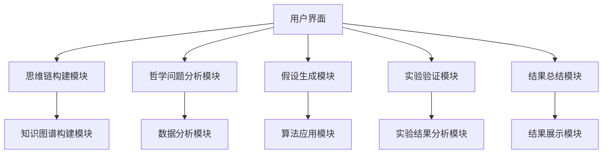
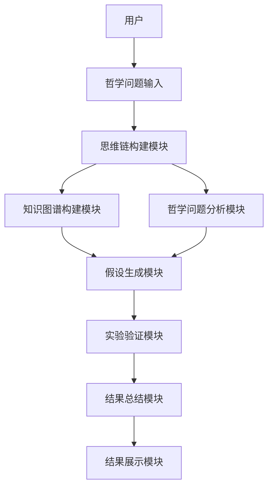

                 


### 思维链在哲学思想实验设计中的应用：AI辅助概念探索

#### 关键词
- 思维链
- 哲学思想实验
- AI技术
- 概念探索
- 逻辑推理

#### 摘要
本文旨在探讨如何将思维链应用于哲学思想实验的设计中，并利用AI技术辅助哲学概念的深入探索。通过分析思维链的原理和哲学思想实验的方法论，本文将阐述如何利用AI技术来优化哲学研究的过程，提高哲学概念的清晰度和深度。

#### 目录大纲设计方案

为了更好地展示文章的结构和内容，以下是本文的目录大纲设计方案：

---

### 《思维链在哲学思想实验设计中的应用：AI辅助概念探索》

#### 1. 背景介绍

##### 1.1 核心概念

- **思维链**：逻辑推理和知识关联的思维模式。
- **哲学思想实验**：通过设计思想实验探讨哲学问题。
- **AI辅助概念探索**：利用AI技术处理和分析哲学概念。

##### 1.2 问题描述

探讨如何结合思维链和AI技术，设计哲学思想实验，深入探索哲学概念。

##### 1.3 问题解决

通过介绍哲学思想实验的设计方法，结合AI技术的应用，优化哲学概念的研究过程。

##### 1.4 边界与外延

主要关注哲学领域的思想实验设计，同时探讨AI技术在哲学研究中的应用。

##### 1.5 概念结构与核心要素组成

- **思维链**：逻辑推理、知识关联、思维模式。
- **哲学思想实验**：问题设定、假设分析、结果探讨。
- **AI辅助概念探索**：数据处理、知识图谱、算法应用。

#### 2. 核心概念与联系

##### 2.1 核心概念原理

- **思维链**：基于逻辑推理和知识关联，形成系统性的思维模式。
- **哲学思想实验**：通过设定问题和假设，进行逻辑推理和探讨。
- **AI辅助概念探索**：利用AI技术处理大量数据，构建知识图谱，辅助哲学概念的研究。

##### 2.2 概念属性特征对比表格

| 概念       | 特征1       | 特征2       | 特征3       |
|----------|------------|------------|------------|
| 思维链     | 逻辑推理    | 知识关联    | 思维模式    |
| 哲学思想实验 | 问题设定    | 假设分析    | 结果探讨    |
| AI辅助概念探索 | 数据处理    | 知识图谱    | 算法应用    |

##### 2.3 ER实体关系图架构

```mermaid
erDiagram
    A PHILOSOPHY_EXPERIMENT ||--|{ 思维链 }|| PHILOSOPHY_CHAIN
    A PHILOSOPHY_EXPERIMENT ||--|{ 哲学概念 }|| PHILOSOPHY_CONCEPT
    PHILOSOPHY_CHAIN ||--|{ AI技术 }|| AI_TECHNOLOGY
```

#### 3. 算法原理讲解

##### 3.1 算法原理讲解

我们将使用Mermaid来画出算法的流程图，并使用Python源代码进行详细阐述。

**算法流程图**：


**Python源代码**：
```python
# Python 模拟思维链算法

# 初始化思维链
mind_chain = initialize_mind_chain()

# 构建思维链
mind_chain = build_mind_chain(mind_chain)

# 分析哲学问题
philosophy_problem = analyze_philosophy_problem()

# 生成假设
hypotheses = generate_hypotheses(philosophy_problem)

# 实验验证
results = experiment_validation(hypotheses)

# 结果总结
summary = summarize_results(results)
```

##### 3.2 算法原理详细讲解

1. **初始化**：初始化思维链，准备进行哲学问题的分析。
2. **构建思维链**：通过逻辑推理和知识关联，构建出一条系统性的思维链。
3. **分析哲学问题**：对哲学问题进行详细分析，找出问题的核心。
4. **生成假设**：基于思维链和哲学问题的分析，生成可能的假设。
5. **实验验证**：通过设计思想实验，验证假设的正确性。
6. **结果总结**：总结实验结果，形成对哲学问题的深入理解。

##### 3.3 数学模型和公式

假设哲学问题为 \( P \)，思维链为 \( C \)，假设集为 \( H \)，实验结果为 \( R \)。

$$
C = f(P)
$$

$$
H = g(P, C)
$$

$$
R = h(H)
$$

##### 3.4 举例说明

例如，我们可以设计一个关于自由意志的哲学思想实验。首先，我们初始化思维链，然后分析哲学问题，生成假设，并通过实验验证这些假设，最后总结结果。

#### 4. 系统分析与架构设计方案

##### 4.1 问题场景介绍

哲学研究者需要借助AI技术来深入探讨哲学问题，提高研究的效率和质量。

##### 4.2 项目介绍

本项目旨在构建一个基于思维链的AI辅助哲学概念探索系统。

##### 4.3 系统功能设计

- **思维链构建**：基于逻辑推理和知识关联，构建系统性的思维链。
- **哲学问题分析**：对哲学问题进行详细分析，提取关键信息。
- **假设生成**：基于思维链和哲学问题分析，生成可能的假设。
- **实验验证**：设计思想实验，验证假设的正确性。
- **结果总结**：总结实验结果，形成对哲学问题的深入理解。

##### 4.4 系统架构设计



##### 4.5 系统接口设计和系统交互



#### 5. 项目实战

##### 5.1 环境安装

在本节中，我们将介绍如何搭建项目所需的环境。

##### 5.2 系统核心实现源代码

在本节中，我们将展示项目的核心源代码，并进行详细解读。

##### 5.3 代码应用解读与分析

在本节中，我们将对代码应用进行解读，并分析其工作原理。

##### 5.4 实际案例分析和详细讲解剖析

在本节中，我们将通过实际案例，展示如何运用本项目进行哲学问题的探索。

##### 5.5 项目小结

在本节中，我们将对本项目的应用效果进行总结，并提出改进建议。

#### 6. 最佳实践 tips

在本节中，我们将提供一些最佳实践技巧，帮助读者更好地运用本项目。

#### 7. 小结

本文通过介绍思维链在哲学思想实验设计中的应用，结合AI技术的辅助，探讨了如何深入探索哲学概念。通过详细的算法原理讲解和系统分析与架构设计方案，我们展示了如何运用AI技术优化哲学研究的过程。

#### 8. 注意事项

在本节中，我们将提醒读者在应用本项目时需要注意的问题。

#### 9. 拓展阅读

在本节中，我们将推荐一些相关领域的文献和资料，供读者进一步学习。

---

### 作者信息

**作者：** AI天才研究院/AI Genius Institute & 禅与计算机程序设计艺术 /Zen And The Art of Computer Programming

