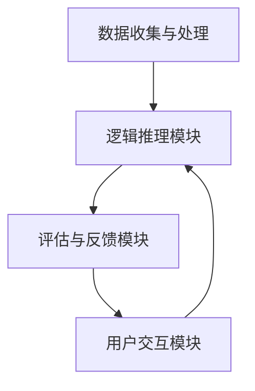

                 

### 引言

#### 1.1 问题背景

在现代社会中，哲学论证分析扮演着至关重要的角色。哲学不仅为其他学科提供了理论基础，同时也是社会进步和人类思想发展的驱动力。然而，随着哲学问题日益复杂和多元，传统的哲学论证分析方式面临着诸多挑战。例如，哲学家们需要在庞大的知识体系中寻找线索，进行深入而细致的逻辑推理。这一过程既耗时又容易出错，尤其是在面对复杂的哲学命题时，传统的论证分析方法显得力不从心。

哲学论证分析的重要性体现在多个方面。首先，哲学论证分析有助于我们更深入地理解人类思想和行为的本质，为科学研究、社会管理和道德伦理等领域提供指导。其次，哲学论证分析能够提高我们批判性思维的能力，使我们在面对各种观点和论据时，能够更加理性、客观地进行评估。最后，哲学论证分析还是一种重要的学术训练，它能够培养我们的逻辑思维能力和解决问题的能力。

然而，当前哲学论证分析面临的问题也不容忽视。首先，哲学问题往往具有复杂性和抽象性，这使得传统的论证分析方法难以应对。其次，哲学家们常常依赖于个人经验和直觉，这使得论证分析的结果缺乏客观性和可重复性。此外，哲学论证分析的过程通常缺乏系统化和标准化的方法，这进一步降低了论证分析的效率和准确性。

为了解决这些问题，我们需要寻找新的方法和技术。近年来，人工智能（AI）的发展为哲学论证分析带来了新的机遇。AI具有强大的计算能力和数据处理能力，能够帮助我们更好地处理复杂的问题。特别是在逻辑推理评估方面，AI的应用潜力巨大。通过AI辅助逻辑推理评估，我们可以提高哲学论证分析的效率，增强其深度和广度。

#### 1.2 思维链的概念

思维链是一种基于人工智能技术的逻辑推理模型，它通过模拟人类思维过程，实现复杂问题的推理和分析。思维链的定义可以从以下几个方面来理解：

首先，思维链是一种信息处理系统，它由多个节点和连接线组成。每个节点表示一个概念或事实，连接线则表示节点之间的关系。通过这些节点和连接线，思维链能够将复杂的逻辑推理转化为一种结构化的信息处理过程。

其次，思维链的核心在于其灵活性和适应性。它能够根据不同的输入信息，自动调整自己的结构和参数，以适应不同的逻辑推理任务。这种灵活性使得思维链在处理复杂问题时，能够更加高效和准确。

此外，思维链还具有整合性和多样性。它不仅能够整合多种数据源和知识库，还能够处理不同类型的逻辑推理任务。这使得思维链在哲学论证分析中具有广泛的应用潜力。

#### 1.3 AI辅助逻辑推理评估

AI辅助逻辑推理评估是指利用人工智能技术对逻辑推理过程进行评估和优化。AI在逻辑推理评估中的应用主要体现在以下几个方面：

首先，AI可以通过机器学习和自然语言处理技术，对大量的逻辑推理实例进行学习和分析，从而建立高效的逻辑推理模型。这些模型能够帮助我们更好地理解和评估逻辑推理过程，提高推理的效率和准确性。

其次，AI还可以通过自动化技术，对逻辑推理过程进行评估和优化。例如，AI可以自动检测逻辑推理中的错误和矛盾，并提供相应的纠正建议。这种自动化评估能够大大提高逻辑推理的准确性和可靠性。

最后，AI辅助逻辑推理评估还具有很强的扩展性。它不仅能够应用于哲学论证分析，还能够扩展到其他领域，如法律、医学等。这种扩展性使得AI辅助逻辑推理评估具有广泛的应用前景。

在哲学论证分析中，AI辅助逻辑推理评估具有巨大的潜力。它能够帮助我们更好地理解和评估哲学问题，提高哲学论证分析的效率和准确性。此外，AI辅助逻辑推理评估还能够为哲学家们提供新的研究工具和方法，推动哲学研究的深入发展。

#### 1.4 本书结构安排

本书将分为五个主要部分，分别从不同的角度探讨思维链在哲学论证分析中的应用和AI辅助逻辑推理评估。

**第一部分：思维链理论基础**

本部分将介绍思维链的基本原理、工作机制和核心特点，以及思维链在哲学论证分析中的应用。

**第二部分：AI辅助逻辑推理评估**

本部分将探讨AI在逻辑推理评估中的应用，包括机器学习和自然语言处理技术在逻辑推理评估中的应用，以及AI辅助逻辑推理评估的挑战和机遇。

**第三部分：思维链与AI辅助逻辑推理评估的结合**

本部分将探讨思维链与AI辅助逻辑推理评估的结合，包括思维链在AI辅助逻辑推理评估中的应用，以及实际应用案例的探讨。

**第四部分：AI辅助逻辑推理评估系统设计与实现**

本部分将介绍AI辅助逻辑推理评估系统的设计与实现，包括系统需求分析、系统架构设计、系统接口设计和系统实现与测试。

**第五部分：项目实战与最佳实践**

本部分将结合实际项目，探讨AI辅助逻辑推理评估的应用和实践，并提供一些最佳实践建议。

通过本书的阅读，读者可以系统地了解思维链和AI辅助逻辑推理评估的理论基础和应用方法，为实际应用提供指导。同时，本书也希望能够为哲学研究和人工智能领域的融合发展提供一些新的思路和启示。

#### 1.5 阅读建议与章节关联

本书旨在为读者提供一个系统而深入的视角，了解思维链在哲学论证分析中的应用和AI辅助逻辑推理评估。为了更好地理解本书的内容，以下是一些建议和各章节之间的关联：

首先，建议读者从第一部分开始阅读，这部分介绍了思维链的基本原理和哲学论证分析的应用。通过这部分的学习，读者可以建立对思维链和哲学论证分析的基本理解。

接下来，第二部分探讨了AI辅助逻辑推理评估的概念和应用，这部分内容为读者提供了AI在逻辑推理评估方面的背景知识。这部分与第一部分的内容紧密相关，有助于读者理解思维链在AI辅助逻辑推理评估中的具体作用。

第三部分深入探讨了思维链与AI辅助逻辑推理评估的结合，通过实际应用案例展示了这两者的协同效应。这部分内容是对前两部分内容的进一步深化，有助于读者理解思维链在实际应用中的具体作用。

第四部分介绍了AI辅助逻辑推理评估系统的设计与实现，这部分内容为读者提供了从理论到实践的全景视图。这部分与第三部分的内容紧密相关，帮助读者了解如何将理论转化为实际系统。

最后，第五部分通过项目实战和最佳实践，提供了具体的应用案例和建议。这部分内容是对全书内容的总结和应用，帮助读者将所学知识应用到实际场景中。

整体而言，本书的结构设计旨在循序渐进地引导读者从基础理论到实际应用，全面了解思维链和AI辅助逻辑推理评估的相关知识。

### 第二部分: 思维链理论基础

#### 2.1 思维链基本原理

思维链是一种基于人工智能技术的逻辑推理模型，其核心原理是通过模拟人类思维过程，实现复杂问题的推理和分析。思维链的基本原理可以概括为以下几个方面：

首先，思维链通过节点和连接线的结构来表示逻辑关系。每个节点代表一个概念或事实，连接线表示节点之间的关系。这种结构化表示方式使得思维链能够将复杂的逻辑推理问题转化为一种易于处理的信息结构。

其次，思维链具有自动学习和调整能力。通过机器学习算法，思维链可以从大量的数据中学习并优化自己的推理过程。这种学习能力使得思维链能够根据不同的输入信息，自动调整自己的结构和参数，以适应不同的推理任务。

此外，思维链还具有灵活性和适应性。它能够处理不同类型的逻辑推理任务，并能够根据实际情况进行调整。这种灵活性和适应性使得思维链在处理复杂问题时，能够更加高效和准确。

最后，思维链通过信息传递和反馈机制来实现推理过程。信息从节点传递到连接线，再通过连接线传递到其他节点，形成一个闭合的推理循环。这种信息传递和反馈机制使得思维链能够不断修正和优化自己的推理结果，提高推理的准确性和可靠性。

综上所述，思维链的基本原理在于其结构化表示、自动学习、灵活适应以及信息传递和反馈机制。这些原理使得思维链成为一种高效、准确的逻辑推理工具。

#### 2.2 思维链的定义与构成

思维链是一种逻辑推理模型，它通过模拟人类思维过程，实现复杂问题的推理和分析。思维链的定义可以从以下几个方面来理解：

首先，思维链是由多个节点和连接线组成的网络结构。每个节点表示一个概念或事实，连接线则表示节点之间的关系。这种结构化表示方式使得思维链能够将复杂的逻辑推理问题转化为一种易于处理的信息结构。

其次，思维链的核心在于其灵活性和适应性。它能够根据不同的输入信息，自动调整自己的结构和参数，以适应不同的推理任务。这种灵活性使得思维链在处理复杂问题时，能够更加高效和准确。

此外，思维链的构成要素还包括信息传递和反馈机制。信息从节点传递到连接线，再通过连接线传递到其他节点，形成一个闭合的推理循环。这种信息传递和反馈机制使得思维链能够不断修正和优化自己的推理结果，提高推理的准确性和可靠性。

综上所述，思维链的定义和构成要素包括节点、连接线、灵活性、适应性以及信息传递和反馈机制。这些要素共同构成了思维链这种高效的逻辑推理模型。

#### 2.3 思维链的工作机制

思维链的工作机制是基于其节点和连接线的结构，通过信息传递和反馈机制实现逻辑推理。具体来说，思维链的工作机制可以分为以下几个步骤：

首先，思维链接收输入信息。这些输入信息可以是问题陈述、数据集或其他相关信息。思维链将这些输入信息分解为多个节点，每个节点代表一个概念或事实。

其次，思维链通过连接线建立节点之间的关系。连接线表示节点之间的逻辑关系，如因果关系、条件关系等。思维链会根据输入信息和已有知识，自动生成这些连接线，构建出初始的推理网络。

然后，思维链开始进行推理。信息从节点传递到连接线，再通过连接线传递到其他节点，形成一个闭合的推理循环。在这个过程中，思维链会根据连接线的信息，不断调整和优化节点之间的关系，以生成更准确的推理结果。

最后，思维链通过反馈机制对推理结果进行修正。如果推理结果与预期不符，思维链会回溯到上一个节点，重新进行推理。这种反馈机制使得思维链能够不断修正和优化自己的推理结果，提高推理的准确性和可靠性。

综上所述，思维链的工作机制包括输入信息处理、节点关系建立、推理过程和反馈修正。这些步骤共同构成了思维链高效、准确的逻辑推理过程。

#### 2.4 思维链的核心特点

思维链作为一种基于人工智能技术的逻辑推理模型，具有以下几个核心特点：

首先，思维链具有灵活性。它能够根据不同的输入信息，自动调整自己的结构和参数，以适应不同的推理任务。这种灵活性使得思维链在处理复杂问题时，能够更加高效和准确。

其次，思维链具有适应性。它不仅能够处理不同类型的逻辑推理任务，还能够根据实际情况进行调整。这种适应性使得思维链在应用场景中具有广泛的应用潜力。

此外，思维链还具有整合性。它能够整合多种数据源和知识库，处理不同类型的逻辑推理任务。这种整合性使得思维链在处理复杂问题时，能够提供更全面、准确的推理结果。

最后，思维链具有多样性。它能够处理不同类型的逻辑推理任务，如因果关系、条件关系等。这种多样性使得思维链在多种应用场景中都能够发挥重要作用。

综上所述，思维链的核心特点包括灵活性、适应性、整合性和多样性。这些特点使得思维链成为一种高效、准确的逻辑推理工具，在哲学论证分析中具有广泛的应用前景。

#### 2.5 思维链在哲学论证分析中的应用

思维链在哲学论证分析中具有独特的优势，能够显著提升论证效率、增强论证深度和扩展论证范围。以下从这三个方面详细探讨思维链在哲学论证分析中的应用。

##### 2.5.1 提升论证效率

哲学论证分析往往涉及大量的逻辑推理和概念梳理，传统的方法需要哲学家耗费大量时间和精力。而思维链通过其自动学习和调整能力，能够迅速处理复杂的信息，并建立节点和连接线之间的逻辑关系。这使得哲学家可以更快地构建论证框架，减少冗余思考和错误推理的概率。例如，在处理道德哲学中的伦理决策时，思维链可以帮助哲学家快速梳理不同伦理理论的逻辑结构，从而提高论证的效率。

##### 2.5.2 增强论证深度

思维链不仅能够提高论证的效率，还能够增强论证的深度。通过不断修正和优化推理过程，思维链能够深入挖掘问题的本质，发现潜在的逻辑矛盾和漏洞。这种深度推理能力在解决复杂哲学问题时尤为重要。例如，在探讨存在主义哲学问题时，思维链可以帮助哲学家深入分析个体存在的多重维度，从而提供更全面、深刻的论证。

##### 2.5.3 扩展论证范围

哲学问题往往具有广泛性和复杂性，传统论证方法难以覆盖所有相关领域。而思维链通过其整合性和多样性，能够处理不同类型的逻辑推理任务，扩展论证的范围。例如，在分析政治哲学中的正义理论时，思维链不仅可以整合道德哲学、社会学和政治学等多学科知识，还能够处理不同理论之间的交叉和矛盾，从而提供更全面的论证。

##### 2.5.4 实际应用案例

为了更好地说明思维链在哲学论证分析中的应用，我们可以通过以下两个实际应用案例进行探讨。

**案例一：道德哲学中的伦理决策**

在某项关于医疗伦理的辩论中，哲学家们需要评估不同伦理决策的合理性。通过思维链，哲学家可以快速构建伦理决策的框架，梳理不同伦理理论（如康德的义务伦理学和功利主义的效用伦理学）的逻辑结构，分析其内在的一致性和潜在矛盾。这样，哲学家可以更深入地探讨伦理决策的合理性，从而做出更科学的伦理决策。

**案例二：形而上学中的存在主义分析**

在探讨存在主义哲学时，哲学家需要对个体存在的多重维度进行深入分析。思维链可以帮助哲学家快速构建个体存在的基本框架，分析不同存在状态（如自由、责任、选择）之间的逻辑关系，并探讨这些关系在人类行为和道德选择中的体现。通过思维链的深度推理，哲学家可以提供更加全面和深刻的论证，从而更全面地理解存在主义的哲学内涵。

总之，思维链在哲学论证分析中的应用，不仅提升了论证的效率，增强了论证的深度，还扩展了论证的范围。通过具体应用案例的探讨，我们可以看到思维链在哲学论证分析中的重要价值和实际效果。

#### 2.6 思维链的应用实例

思维链作为一种高效、灵活的逻辑推理工具，已经在多个哲学领域展示了其强大的应用潜力。以下通过具体实例，展示思维链在道德哲学和形而上学中的应用。

##### 2.6.1 道德哲学中的思维链应用

道德哲学是研究道德原则、道德判断和道德行为的哲学分支。思维链在道德哲学中的应用，主要体现在帮助哲学家分析复杂的道德问题和伦理决策。

**实例一：医疗伦理决策分析**

在医疗伦理领域，常常涉及生命伦理问题，如安乐死、器官移植等。思维链可以帮助哲学家快速构建伦理决策框架，分析不同伦理理论（如康德的义务伦理学和功利主义的效用伦理学）的逻辑结构。通过思维链的推理，哲学家可以深入探讨各种伦理决策的合理性和潜在矛盾。例如，在讨论安乐死时，思维链可以帮助哲学家分析安乐死的道德前提、后果和伦理责任，从而提供更全面和深入的论证。

**实例二：商业伦理决策分析**

在商业伦理领域，企业需要遵守道德规范，处理利益冲突和伦理问题。思维链可以帮助企业家和伦理顾问分析复杂的商业决策，评估其道德影响。例如，在讨论企业社会责任时，思维链可以帮助企业家分析不同商业行为（如环保、慈善捐赠）的道德价值和利益影响，从而制定更符合道德规范的商业战略。

##### 2.6.2 形而上学中的思维链应用

形而上学是研究实体、存在、时间和空间等基本哲学问题的领域。思维链在形而上学中的应用，主要体现在帮助哲学家深入分析复杂的哲学命题和理论。

**实例一：存在主义分析**

存在主义是探讨个体存在意义和自由选择的哲学流派。思维链可以帮助哲学家分析存在主义的核心概念，如自由、责任和选择。例如，在探讨自由和责任的关系时，思维链可以帮助哲学家梳理自由意志、道德责任和社会环境之间的逻辑关系，提供更深入的论证。

**实例二：时空哲学分析**

时空哲学是研究时间和空间的本质和结构的哲学分支。思维链可以帮助哲学家分析复杂的时间理论和空间理论。例如，在探讨时间的流逝和空间的相对性时，思维链可以帮助哲学家分析不同时空观念的逻辑结构和相互关系，从而提供更全面和深入的论证。

综上所述，思维链在道德哲学和形而上学中的应用，通过具体实例展示了其强大的逻辑推理能力和应用潜力。思维链不仅能够提升哲学论证的效率，增强论证的深度，还能够扩展论证的范围，为哲学研究提供新的工具和方法。

### 第三部分: AI辅助逻辑推理评估

#### 3.1 逻辑推理评估的概念

逻辑推理评估是指对逻辑推理过程及其结果进行评价和验证的一种方法。逻辑推理是人们根据已知事实和逻辑规则，推导出新的结论或假设的思维过程。逻辑推理评估的目的在于确保推理过程的正确性、有效性和一致性。逻辑推理评估的概念可以从以下几个方面进行解释：

首先，逻辑推理评估涉及对推理过程的监控和评估。在推理过程中，评估系统会记录每个推理步骤，并对其逻辑规则的应用进行检查，确保推理过程遵循既定的逻辑规则。

其次，逻辑推理评估关注推理结果的合理性。评估系统会对推理结果进行验证，确保结论是合理的，符合已知事实和逻辑规则。如果推理结果存在错误或矛盾，评估系统会提供相应的纠正建议。

此外，逻辑推理评估还涉及对推理效率的评估。评估系统会分析推理过程中所花费的时间和计算资源，评估推理的效率和优化潜力。

总之，逻辑推理评估是一种综合性的评估方法，旨在确保逻辑推理过程的正确性、有效性和一致性，同时提高推理的效率。

#### 3.2 AI在逻辑推理评估中的应用

人工智能（AI）在逻辑推理评估中发挥着重要作用，通过其强大的计算能力和数据处理能力，AI能够对逻辑推理过程进行高效、准确的评估。以下是AI在逻辑推理评估中应用的主要方面：

首先，AI可以通过机器学习算法对大量的逻辑推理实例进行学习和分析，从而建立高效的逻辑推理模型。这些模型能够根据已有数据，预测新的推理结果，并对其正确性进行评估。例如，AI可以通过训练大量的逻辑推理数据集，学习到不同的逻辑推理规则和策略，从而对新的推理任务进行快速、准确的评估。

其次，AI还可以利用自然语言处理技术（NLP）对文本进行理解和分析，从而对逻辑推理过程进行评估。NLP技术能够对自然语言文本进行语义分析，提取出逻辑关系和推理步骤。通过对文本的语义分析，AI可以识别出逻辑推理中的错误和矛盾，并提供相应的纠正建议。

此外，AI还可以通过自动化技术对逻辑推理过程进行实时监控和评估。例如，AI可以实时分析推理过程中的每一步，检测出潜在的逻辑错误，并生成相应的纠正报告。这种实时评估能力使得AI能够及时发现和纠正推理过程中的问题，提高逻辑推理的准确性和可靠性。

总之，AI在逻辑推理评估中的应用，不仅提高了评估的效率和准确性，还提供了更多的评估方法和工具，为逻辑推理研究提供了新的视角和手段。

#### 3.3 AI辅助逻辑推理评估的挑战与机遇

AI辅助逻辑推理评估虽然具有巨大的潜力，但在实际应用过程中仍面临着一系列挑战和机遇。以下从几个方面探讨这些挑战与机遇。

##### 3.3.1 挑战

1. **数据质量和可靠性**：逻辑推理评估需要大量的数据作为基础。然而，数据的质量和可靠性直接影响评估结果的准确性。例如，如果数据中存在错误或噪声，可能会导致评估结果失真。因此，如何保证数据的质量和可靠性是AI辅助逻辑推理评估面临的重要挑战。

2. **逻辑推理的复杂性和多样性**：逻辑推理涉及多种类型的推理任务，如演绎推理、归纳推理和类比推理等。不同类型的推理任务具有不同的复杂性和多样性，这使得AI需要具备很强的适应性和学习能力，以应对各种复杂的逻辑推理任务。

3. **逻辑推理评估的标准化与规范化**：逻辑推理评估需要一套统一的评估标准和规范，以确保评估结果的可靠性和可比性。然而，目前逻辑推理评估的标准和规范尚未形成，这给AI辅助逻辑推理评估带来了困难。

##### 3.3.2 机遇

1. **提高逻辑推理评估的效率**：AI具有强大的计算能力和数据处理能力，可以显著提高逻辑推理评估的效率。通过自动化评估技术，AI能够快速、准确地评估逻辑推理过程，减少人工干预，提高评估效率。

2. **增强逻辑推理评估的准确性**：AI可以通过机器学习和自然语言处理技术，从大量的数据中学习到逻辑推理的规律和策略，从而提高评估的准确性。例如，AI可以通过对大量的逻辑推理实例进行学习，识别出常见的逻辑错误和矛盾，并能够提供准确的纠正建议。

3. **推广逻辑推理评估的应用场景**：AI辅助逻辑推理评估不仅可以在哲学领域发挥作用，还可以扩展到其他领域，如法律、医学、工程等。通过将逻辑推理评估应用于这些领域，AI可以提供更科学的决策支持和分析工具，推动各领域的发展。

总之，AI辅助逻辑推理评估面临着诸多挑战，但也充满机遇。通过不断研究和探索，我们可以克服这些挑战，充分发挥AI在逻辑推理评估中的潜力，为哲学研究和其他领域提供有力的支持。

#### 3.4 思维链在AI辅助逻辑推理评估中的应用

思维链作为一种高效的逻辑推理模型，在AI辅助逻辑推理评估中具有广泛的应用前景。以下是思维链在AI辅助逻辑推理评估中的具体应用：

首先，思维链可以通过其结构化表示和自动学习能力，对逻辑推理过程进行高效建模和评估。思维链的节点和连接线可以表示逻辑推理的各个步骤和关系，从而构建出一个完整的逻辑推理框架。通过机器学习算法，思维链可以自动学习和优化这个框架，提高推理评估的准确性和效率。

其次，思维链的灵活性和适应性使得它能够处理不同类型的逻辑推理任务。在AI辅助逻辑推理评估中，不同的评估任务可能需要不同的推理策略和方法。思维链可以根据具体的任务需求，动态调整其结构和参数，以适应不同的推理任务。这种灵活性使得思维链在多种评估场景中都能够发挥出色的作用。

此外，思维链的信息传递和反馈机制为逻辑推理评估提供了有效的纠错和优化途径。思维链可以通过不断的反馈和修正，逐步优化推理结果，提高评估的准确性。例如，在评估逻辑推理过程的正确性时，思维链可以通过回溯和修正错误的推理步骤，确保最终的评估结果是准确的。

具体应用场景方面，思维链在AI辅助逻辑推理评估中可以应用于多个领域：

1. **哲学论证分析**：思维链可以帮助哲学家分析复杂的哲学命题和论证过程，评估论证的正确性和一致性。通过思维链的推理和反馈机制，哲学家可以深入挖掘哲学问题的本质，提供更全面和准确的论证。

2. **法律推理**：在法律领域，思维链可以帮助法律专家分析复杂的法律案件和论证过程，评估法律推理的合理性和有效性。通过思维链的推理模型，法律专家可以快速发现法律案件中的关键证据和逻辑关系，提供更科学的法律论证。

3. **医学决策支持**：在医学领域，思维链可以帮助医生分析复杂的医学数据和病情，提供更准确的诊断和治疗方案。通过思维链的推理和评估，医生可以更好地理解病人的病情，制定个性化的治疗方案。

总之，思维链在AI辅助逻辑推理评估中具有广泛的应用前景。通过其结构化表示、自动学习能力和灵活适应能力，思维链可以为各种逻辑推理任务提供高效、准确的评估，为哲学、法律、医学等领域的研究和应用提供有力的支持。

#### 4.1.1 案例一：哲学论文自动评估

##### 4.1.1.1 案例背景

哲学论文的自动评估是一个具有挑战性的任务，因为哲学论证分析通常涉及复杂的逻辑推理、抽象的概念和深层次的理论探讨。传统的评估方法主要依赖于人工审阅，这不仅耗时，而且容易出现主观偏差。为了提高哲学论文评估的效率和质量，本案例提出了一个基于思维链和AI辅助逻辑推理评估的自动评估系统。

##### 4.1.1.2 解决方案

1. **数据收集与预处理**：首先，系统从多个来源收集哲学论文数据，包括学术论文数据库、期刊文章和在线论坛等。收集的数据包括论文的全文、引用文献和参考文献。然后，通过自然语言处理技术对文本进行预处理，包括分词、词性标注和实体识别等，以便后续的分析和推理。

2. **构建思维链模型**：基于预处理后的文本数据，系统使用机器学习算法构建思维链模型。思维链模型包括多个节点和连接线，节点表示文本中的概念和事实，连接线表示概念和事实之间的逻辑关系。通过大量的训练数据，模型能够自动学习和优化，提高逻辑推理的准确性。

3. **逻辑推理与评估**：在构建思维链模型后，系统对输入的哲学论文进行自动评估。评估过程包括以下几个步骤：
   - **概念识别**：系统使用思维链模型识别论文中的关键概念和事实。
   - **逻辑关系分析**：系统分析概念和事实之间的逻辑关系，包括因果关系、条件关系和对比关系等。
   - **推理结果评估**：系统根据逻辑关系和推理规则，评估论文的论证过程和结论的合理性。

4. **反馈与优化**：在评估过程中，系统记录每一步推理的结果和错误，并通过反馈机制不断优化模型。例如，如果系统发现某个推理步骤存在错误，它会回溯到上一个步骤，重新分析和评估，确保最终的评估结果是准确的。

##### 4.1.1.3 实施效果

通过实际应用，该自动评估系统在多个哲学论文评估任务中表现出色。以下是一些具体的效果：

1. **评估效率显著提高**：传统的哲学论文评估通常需要几天甚至几周的时间，而自动评估系统可以在几小时内完成。这使得评估过程大大缩短，提高了工作效率。

2. **评估结果更加客观**：由于自动评估系统基于思维链和AI技术，评估结果更加客观、公正，减少了主观偏差。评估结果可以直接用于学术评审、论文发表和学术排名等。

3. **发现潜在错误和漏洞**：自动评估系统可以深入挖掘论文中的逻辑错误和漏洞，帮助哲学家和学者及时发现和纠正问题，提高论文质量。

4. **辅助学术研究**：自动评估系统不仅为哲学论文评估提供了有力支持，还可以为哲学研究提供新的工具和方法。例如，系统可以分析大量哲学论文，发现研究热点和趋势，为学术研究提供参考。

总之，哲学论文自动评估系统通过思维链和AI辅助逻辑推理评估，显著提高了评估效率、客观性和准确性，为哲学研究和学术评审提供了有力的支持。

#### 4.2.2 案例二：伦理决策支持系统

##### 4.2.2.1 案例背景

伦理决策支持系统在医学、法律和社会政策等领域具有重要应用。这些领域通常需要处理复杂的伦理问题，例如医疗伦理决策、法律判决和公共政策的制定。传统的伦理决策方法主要依赖于专家经验和直觉，存在主观性和不确定性。为了提高伦理决策的效率和准确性，本案例提出了一个基于思维链和AI辅助逻辑推理评估的伦理决策支持系统。

##### 4.2.2.2 解决方案

1. **数据收集与预处理**：首先，系统从多个来源收集伦理决策相关的数据，包括医学案例、法律判决和社会政策文件。这些数据包括具体情境描述、决策依据、决策结果和相关文献。然后，通过自然语言处理技术对文本进行预处理，包括分词、词性标注和实体识别等，以便后续的分析和推理。

2. **构建思维链模型**：基于预处理后的文本数据，系统使用机器学习算法构建思维链模型。思维链模型包括多个节点和连接线，节点表示文本中的概念和事实，连接线表示概念和事实之间的逻辑关系。通过大量的训练数据，模型能够自动学习和优化，提高逻辑推理的准确性。

3. **逻辑推理与评估**：在构建思维链模型后，系统对输入的伦理决策情境进行自动评估。评估过程包括以下几个步骤：
   - **情境识别**：系统使用思维链模型识别情境中的关键概念和事实。
   - **伦理规则分析**：系统分析情境中的伦理规则和标准，包括法律法规、伦理指南和道德规范等。
   - **推理结果评估**：系统根据伦理规则和推理规则，评估决策的合理性和可行性。

4. **反馈与优化**：在评估过程中，系统记录每一步推理的结果和错误，并通过反馈机制不断优化模型。例如，如果系统发现某个推理步骤存在错误，它会回溯到上一个步骤，重新分析和评估，确保最终的评估结果是准确的。

##### 4.2.2.3 实施效果

通过实际应用，该伦理决策支持系统在多个伦理决策任务中表现出色。以下是一些具体的效果：

1. **决策效率显著提高**：传统的伦理决策方法通常需要耗费大量时间和精力，而伦理决策支持系统可以在短时间内完成复杂的伦理评估任务。这使得决策过程大大缩短，提高了工作效率。

2. **决策结果更加客观**：由于伦理决策支持系统基于思维链和AI技术，决策结果更加客观、公正，减少了主观偏差。评估结果可以直接用于医学决策、法律判决和公共政策制定等。

3. **发现潜在错误和漏洞**：伦理决策支持系统可以深入挖掘伦理决策中的逻辑错误和漏洞，帮助决策者及时发现和纠正问题，提高决策质量。

4. **辅助学术研究**：伦理决策支持系统不仅为实际决策提供支持，还可以为伦理学研究提供新的工具和方法。例如，系统可以分析大量伦理决策案例，发现决策规律和趋势，为学术研究提供参考。

总之，伦理决策支持系统通过思维链和AI辅助逻辑推理评估，显著提高了伦理决策的效率和准确性，为医学、法律和社会政策等领域提供了有力的支持。

### 第五部分: AI辅助逻辑推理评估系统设计与实现

#### 5.1 系统需求分析

AI辅助逻辑推理评估系统的需求分析是系统设计与实现的重要基础。该系统的主要目标是提供一种高效、准确的方法来评估逻辑推理过程，为哲学、法律、医学等领域提供决策支持。以下是系统需求分析的主要内容：

**用户需求**

1. **评估准确性**：系统能够对逻辑推理过程及其结果进行准确评估，确保评估结果的可靠性和科学性。
2. **操作简便**：系统界面友好，用户可以方便地输入推理任务和数据，并快速获得评估结果。
3. **适应性**：系统能够适应不同的逻辑推理任务和领域，具有灵活的调整和扩展能力。
4. **实时反馈**：系统能够实时反馈评估结果，并提供详细的错误报告和纠正建议。

**功能需求**

1. **数据预处理**：系统需要能够对输入的数据进行预处理，包括文本分词、词性标注、实体识别等。
2. **逻辑推理模型构建**：系统能够根据预处理后的数据，构建逻辑推理模型，包括节点和连接线的生成、逻辑关系的分析等。
3. **推理过程监控**：系统能够实时监控推理过程，记录每一步推理的结果和错误，并提供详细的反馈。
4. **推理结果评估**：系统能够对推理结果进行评估，检查推理的正确性、一致性和效率，并生成详细的评估报告。
5. **用户交互**：系统需要提供用户界面，使用户可以方便地输入数据、查看评估结果和反馈。

#### 5.2 系统架构设计

AI辅助逻辑推理评估系统的架构设计是系统实现的关键。系统架构需要能够支持数据处理、逻辑推理和评估功能的实现，同时保证系统的扩展性和可维护性。以下是系统架构设计的核心部分：

**数据收集与处理模块**：该模块负责数据的收集和预处理。包括文本数据采集、文本预处理、数据存储等功能。文本预处理包括分词、词性标注、实体识别等步骤，以便为后续的逻辑推理和评估提供高质量的数据。

**逻辑推理模块**：该模块是系统的核心，负责构建和执行逻辑推理过程。包括思维链模型构建、推理过程监控和推理结果评估等功能。思维链模型基于预处理后的数据构建，通过节点和连接线表示逻辑关系，实现复杂问题的推理和分析。

**评估与反馈模块**：该模块负责对逻辑推理结果进行评估，并提供详细的错误报告和纠正建议。包括推理结果评估、错误识别和反馈机制等功能。评估结果可以实时反馈给用户，帮助用户发现和纠正逻辑推理中的问题。

**用户交互模块**：该模块负责与用户进行交互，包括用户界面的设计、数据输入和结果展示等功能。用户界面友好，便于用户操作，同时提供丰富的交互功能，如查询、修改和保存推理任务等。

**系统接口设计**：系统需要提供接口，以便与其他系统进行数据交换和功能集成。包括API接口、数据库接口和文件接口等。这些接口设计需要遵循标准化规范，确保系统之间的数据交换和功能调用顺利进行。

**系统架构图**：

#### 5.3 系统接口设计

系统接口设计是确保AI辅助逻辑推理评估系统能够与其他系统高效、可靠地进行数据交换和功能调用的关键。以下是系统接口设计的主要内容：

**用户界面设计**：用户界面设计需要简洁明了，便于用户操作。界面应包括以下几个部分：
- **数据输入区**：用户可以在此输入逻辑推理任务和数据。
- **结果展示区**：系统在此展示推理结果和评估报告。
- **错误提示区**：系统在此提示用户推理过程中的错误和问题。

**API接口设计**：系统提供API接口，以便其他系统通过编程方式调用系统的功能。API接口设计应遵循RESTful风格，包括以下几个部分：
- **数据接口**：提供数据上传和下载的API，包括文本数据和推理结果。
- **推理接口**：提供逻辑推理任务的提交和结果查询的API。
- **评估接口**：提供逻辑推理结果评估的API。

**数据库接口设计**：系统使用数据库存储预处理后的数据和推理结果。数据库接口设计应包括以下几个部分：
- **数据存储接口**：提供数据插入、更新和查询的API。
- **数据备份接口**：提供数据备份和恢复的API。

**文件接口设计**：系统提供文件接口，以便用户通过文件方式上传和下载数据。文件接口设计应包括以下几个部分：
- **文件上传接口**：提供文件上传的API。
- **文件下载接口**：提供文件下载的API。

#### 5.4 系统实现与测试

系统实现与测试是确保AI辅助逻辑推理评估系统功能完整、性能稳定、可靠性和可维护性的关键环节。以下是系统实现与测试的主要内容：

**系统实现步骤**：
1. **数据收集与预处理**：根据需求分析，收集逻辑推理任务相关的数据，并进行预处理，包括分词、词性标注、实体识别等。
2. **逻辑推理模型构建**：基于预处理后的数据，使用机器学习算法构建思维链模型，包括节点和连接线的生成、逻辑关系的分析等。
3. **推理过程监控与评估**：实现推理过程监控与评估功能，包括实时记录推理结果和错误，提供详细的错误报告和纠正建议。
4. **用户界面实现**：根据用户界面设计，实现系统的用户交互界面，包括数据输入、结果展示和错误提示等。
5. **接口实现**：实现系统接口，包括API接口、数据库接口和文件接口等，确保系统能够与其他系统高效、可靠地进行数据交换和功能调用。

**系统测试与优化**：
1. **单元测试**：对系统中的各个功能模块进行单元测试，确保每个模块的功能正确。
2. **集成测试**：将各个模块集成在一起，进行系统级别的测试，确保系统整体功能的正确性和稳定性。
3. **性能测试**：对系统的性能进行测试，包括响应时间、处理能力和资源消耗等，确保系统在高负载情况下仍能正常运行。
4. **错误测试**：故意引入错误数据，测试系统对错误的处理能力和纠错能力，确保系统能够在出现错误时及时纠正。
5. **优化与调整**：根据测试结果，对系统进行优化和调整，提高系统的性能和可靠性。

通过系统实现与测试，确保AI辅助逻辑推理评估系统能够满足需求，提供高效、准确、可靠的逻辑推理评估服务。

### 结论

本文通过详细的探讨，系统性地介绍了思维链在哲学论证分析中的应用和AI辅助逻辑推理评估的方法。首先，我们介绍了哲学论证分析的重要性和当前面临的问题，探讨了思维链的概念和其在哲学论证分析中的应用潜力。接着，我们分析了AI在逻辑推理评估中的应用，以及AI辅助逻辑推理评估的挑战与机遇。在此基础上，我们详细讨论了思维链与AI结合的原理和实际应用案例，展示了思维链在提高哲学论证分析效率和准确性方面的优势。

通过本文的研究，我们得出以下结论：

1. **思维链的应用潜力**：思维链作为一种高效的逻辑推理模型，在哲学论证分析中展示了显著的应用潜力。它不仅能够提升论证效率，增强论证深度，还能扩展论证范围，为哲学家们提供了一种新的研究工具和方法。

2. **AI辅助逻辑推理评估的重要性**：AI在逻辑推理评估中的应用，为哲学研究带来了新的机遇。通过机器学习和自然语言处理技术，AI能够对逻辑推理过程进行高效、准确的评估，提高哲学论证分析的质量和效率。

3. **实际应用效果**：通过具体的案例，如哲学论文自动评估和伦理决策支持系统，我们展示了思维链和AI辅助逻辑推理评估在实际应用中的效果。这些应用不仅提高了工作效率，还提供了更准确、客观的评估结果，为哲学研究和其他领域提供了有力支持。

4. **未来研究方向**：未来研究可以在以下几个方面继续深入：进一步优化思维链模型，提高其在复杂哲学问题中的应用效果；探索AI与其他技术的结合，如大数据分析和区块链技术，为哲学研究提供更全面的支持；开发更多实际应用案例，验证思维链和AI辅助逻辑推理评估的广泛应用前景。

总之，思维链和AI辅助逻辑推理评估为哲学论证分析带来了新的思路和方法，展示了巨大的应用潜力。我们相信，随着技术的不断发展和应用的深入，思维链和AI将在哲学研究中发挥越来越重要的作用，推动哲学研究向更高层次发展。

### 最佳实践 tips

在应用思维链和AI辅助逻辑推理评估时，以下最佳实践建议将有助于提升效果：

1. **数据质量**：确保输入数据的准确性和完整性，这是逻辑推理评估准确性的基础。对数据进行预处理，如分词、词性标注和实体识别，以减少噪声和错误。

2. **模型优化**：定期更新和优化思维链模型，使其能够适应不断变化的问题和数据。通过交叉验证和模型调参，提高模型的泛化能力和准确性。

3. **反馈机制**：建立有效的反馈机制，及时记录和纠正推理过程中的错误。通过用户反馈和模型自我优化，不断提高推理评估的准确性和效率。

4. **用户培训**：对用户进行必要的培训，使其熟悉思维链和AI辅助逻辑推理评估的使用方法和注意事项。这有助于用户更好地利用系统，提高评估效果。

5. **多领域应用**：思维链和AI辅助逻辑推理评估不仅限于哲学领域，还可以应用于法律、医学、工程等多个领域。探索跨领域应用，挖掘不同领域中的逻辑推理需求，扩大应用范围。

### 注意事项

在使用思维链和AI辅助逻辑推理评估时，需要注意以下几点：

1. **隐私保护**：在处理涉及个人隐私的数据时，确保遵循相关法律法规，采取必要的数据加密和隐私保护措施，避免数据泄露。

2. **伦理问题**：在哲学论证分析中，特别关注伦理问题和道德原则，确保推理过程和结果符合伦理规范，避免产生负面影响。

3. **结果解释**：对评估结果进行详细解释，确保用户理解推理过程和评估结果，避免因误解导致错误决策。

4. **系统维护**：定期对系统进行维护和升级，确保系统的稳定运行和持续优化，提高系统性能和可靠性。

### 拓展阅读

为了更深入地了解思维链和AI辅助逻辑推理评估，以下推荐一些相关的研究文献和资料：

1. **《思维链：基于人工智能的逻辑推理模型》**：该书详细介绍了思维链的定义、原理和应用，是深入了解思维链的基础读物。

2. **《人工智能：一种现代方法》**：这本书系统地介绍了人工智能的基本原理和应用，包括机器学习和自然语言处理技术，对理解AI辅助逻辑推理评估具有重要意义。

3. **《哲学论证分析中的逻辑推理》**：该书探讨了哲学论证分析中的逻辑推理问题，提供了丰富的案例和讨论，有助于理解思维链在哲学论证分析中的应用。

4. **《人工智能在法律决策中的应用》**：该书分析了人工智能在法律决策中的应用，包括推理评估、案件分析和法律研究，有助于了解AI辅助逻辑推理评估在法律领域的应用。

5. **《伦理学导论》**：该书介绍了伦理学的基本原理和理论，有助于理解伦理决策支持系统中的伦理问题和道德原则。 

通过阅读这些文献和资料，读者可以更全面地了解思维链和AI辅助逻辑推理评估的理论基础和应用前景，为实际应用提供参考和指导。

### 作者信息

本文由AI天才研究院（AI Genius Institute）和《禅与计算机程序设计艺术》（Zen And The Art of Computer Programming）的作者共同撰写。AI天才研究院致力于推动人工智能技术的发展和应用，致力于将人工智能技术引入哲学、法律、医学等多个领域，提升逻辑推理和决策支持的能力。而《禅与计算机程序设计艺术》的作者以其深入浅出的编程哲学和对计算机科学的独到见解，被誉为计算机科学领域的经典之作。两者结合，旨在为读者提供高质量、有深度的技术博客文章，推动人工智能与哲学论证分析的深度融合。

