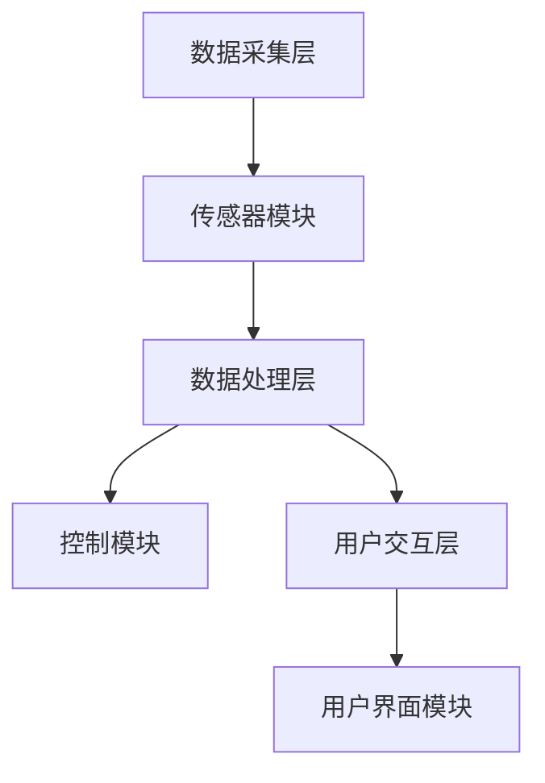
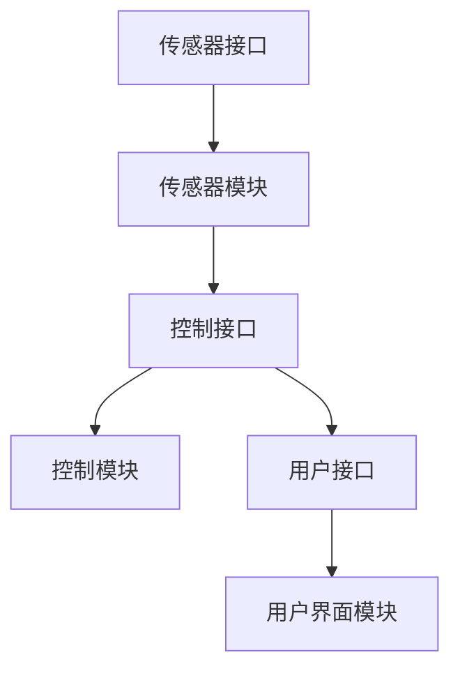
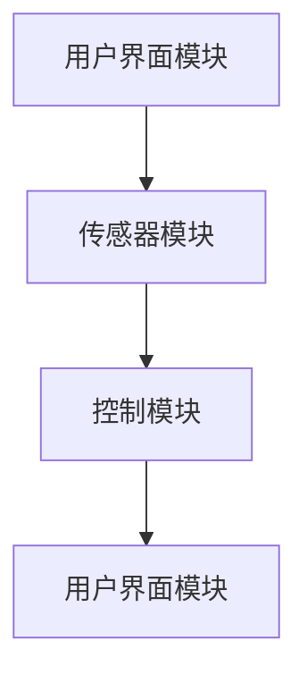

                 


## 第1章: 引言与问题背景

### 1.1.1 问题背景

在当今这个信息爆炸的时代，复杂决策系统无处不在，从商业管理到城市规划，从医疗诊断到环境监测，都需要对大量数据进行分析，并基于这些数据做出明智的决策。随着数据量的不断增加和决策环境的日益复杂，传统的决策方法已经逐渐暴露出其局限性。例如，传统的线性规划方法在处理非线性问题时效果不佳，而基于规则的方法在应对不确定性和动态变化时表现较差。因此，探索一种新的决策方法，特别是能够模拟人类思维过程的决策方法，显得尤为重要。

思维链（Thinking Chain）作为一种模拟人类思维过程的决策方法，具有强大的灵活性和适应性，能够处理复杂多变的问题。它通过构建知识库、思维规则和决策者模型，实现对决策问题的推理和判断。这种方法的核心在于其能够模拟人类的思考过程，包括知识的获取、整合、推理和决策，从而提供一种有效的解决复杂决策问题的手段。

### 1.1.2 问题描述

复杂决策系统中的问题通常具有以下几个特点：

1. **数据量大**：在当今的数据驱动时代，决策者面对的海量数据经常难以用传统的方法进行处理和分析。这些数据可能来源于不同的渠道，形式各异，包括结构化数据和非结构化数据。

2. **决策目标多样化**：不同的决策者或利益相关者可能对同一个决策问题有不同的目标。例如，在商业决策中，企业可能同时考虑利润最大化、成本最小化和风险控制等多个目标。

3. **决策环境复杂**：决策环境受到多种因素的影响，如政策变化、市场动态、技术进步等，这使得决策过程更加复杂。传统的决策方法往往难以适应这种复杂的环境。

面对这些挑战，传统的决策方法显得力不从心。例如，基于规则的系统在处理不确定性时往往表现得不够灵活，而基于统计学的模型在解释复杂问题时可能缺乏直观性。因此，需要一种能够模拟人类思维过程，具备强大适应性和灵活性的新方法来应对这些挑战。

### 1.1.3 问题解决

思维链作为一种模拟人类思维过程的决策方法，可以有效地解决复杂决策系统中的问题。其基本思路是通过构建一个包含决策相关知识的知识库，定义一套模拟人类推理过程的思维规则，并根据决策者的行为和偏好构建决策者模型。这样，思维链就能够通过推理和判断，从海量数据中提取有用信息，为决策者提供科学的决策支持。

首先，知识库是思维链的核心组成部分，它存储了与决策问题相关的所有知识和信息。这些信息可以是定性的描述，也可以是定量的数据，甚至可以是专家的经验和直觉。通过构建一个全面、准确的知识库，思维链能够为决策提供坚实的基础。

其次，思维规则是思维链的另一个关键要素。这些规则模拟了人类在决策过程中使用的逻辑推理和判断方法。例如，在处理不确定性问题时，思维链可能会使用概率论和统计学方法来进行推理。在处理多目标决策问题时，思维链可能会使用多目标优化算法来找到最佳解决方案。

最后，决策者模型则模拟了决策者的行为和偏好。通过分析决策者的历史行为和偏好，思维链能够更好地理解决策者的需求，从而提供个性化的决策支持。

### 1.1.4 边界与外延

思维链的应用范围非常广泛，但并非适用于所有决策问题。以下是一些边界条件和外延：

1. **适用范围**：思维链主要适用于复杂、动态和多目标的决策问题，如经济管理决策、资源配置决策和社会政策制定等。在这些领域，决策问题通常涉及大量数据，并且决策环境多变，需要快速、准确地做出决策。

2. **不适用情况**：对于一些简单的、确定性的决策问题，如简单的数学计算或规则判断，思维链可能显得过于复杂。此外，对于一些高度敏感的决策问题，如国家安全决策，思维链的应用需要谨慎，避免可能的安全风险。

### 1.1.5 概念结构与核心要素组成

思维链的概念结构主要包括以下几个核心要素：

1. **知识库**：存储决策相关的知识和信息，包括定性和定量的数据，以及专家的经验和直觉。

2. **思维规则**：描述决策过程中的推理和判断规则，如逻辑推理、概率推理、多目标优化等。

3. **决策者模型**：模拟决策者的行为和偏好，包括历史行为数据和分析结果。

这些核心要素共同构成了思维链的概念框架，为复杂决策问题提供了一种有效的解决方法。

## 第2章: 思维链基本原理与特性

### 2.1 思维链的定义

思维链（Thinking Chain）是一种模拟人类思维过程的决策方法。它通过构建知识库、思维规则和决策者模型，实现对复杂决策问题的推理和判断。与传统的方法不同，思维链不仅仅依赖于数学模型和算法，更注重模拟人类思维过程中的逻辑推理和判断能力。

在思维链中，知识库是存储决策相关知识的容器，它可以是结构化的数据，如数据库和知识图谱，也可以是非结构化的数据，如图像、文本和声音。知识库中的信息是思维链推理和判断的基础。

思维规则则模拟了人类在决策过程中使用的推理和判断方法。这些规则可以是逻辑推理，如演绎推理和归纳推理，也可以是概率推理，如贝叶斯推理和蒙特卡洛方法。通过这些思维规则，思维链能够在海量数据中提取有用信息，为决策者提供科学的决策支持。

决策者模型则模拟了决策者的行为和偏好。通过分析决策者的历史行为和偏好，思维链能够更好地理解决策者的需求，从而提供个性化的决策支持。这种模拟不仅包括定量分析，还包括定性分析，如专家的经验和直觉。

### 2.2 思维链的核心特点

思维链作为一种模拟人类思维过程的决策方法，具有以下几个核心特点：

1. **模拟人类思维过程**：思维链通过模拟人类的思维过程，实现了决策过程的自动化。它不仅处理数据，还处理信息，从海量数据中提取有用信息，帮助决策者做出明智的决策。

2. **处理复杂数据**：思维链能够处理海量数据和多种数据类型，包括结构化数据和非结构化数据。它通过先进的算法和技术，如深度学习、自然语言处理和图像识别等，能够有效地处理和分析复杂的数据。

3. **多目标决策**：在决策过程中，思维链能够同时考虑多个决策目标，如成本、利润、风险等。通过多目标优化算法，思维链能够找到最优或次优的决策方案，满足决策者的多种需求。

4. **适应性**：思维链能够适应不同的决策环境和问题场景，如商业管理、资源配置和社会政策制定等。它通过不断学习和调整，能够更好地适应变化的环境和问题。

### 2.3 思维链与传统决策方法的对比

思维链与传统决策方法相比，具有以下优势：

1. **更高的决策效率**：传统决策方法通常需要大量的手工计算和逻辑判断，而思维链通过自动化处理决策过程，可以大幅提高决策效率。它能够快速处理海量数据，提供即时的决策支持。

2. **更准确的决策结果**：思维链通过模拟人类思维过程，能够更准确地处理复杂决策问题。它不仅考虑数据的数量和种类，还考虑数据的关联性和因果关系，提供更科学的决策结果。

3. **更强的适应性**：传统决策方法在应对复杂多变的环境时可能显得力不从心，而思维链能够通过不断学习和调整，更好地适应变化的环境和问题。

### 2.4 思维链的应用领域

思维链在复杂决策系统中的应用领域非常广泛，以下是一些主要的应用领域：

1. **经济管理决策**：思维链可以用于商业管理中的各种决策，如市场营销策略、供应链管理、财务分析等。通过分析市场数据和企业内部数据，思维链能够为企业提供科学的决策支持，提高企业竞争力。

2. **资源配置决策**：在资源有限的情况下，如何合理配置资源是一个重要问题。思维链可以通过模拟人类思维过程，为资源配置提供优化方案，如城市交通管理、能源分配、人力资源管理等。

3. **社会政策制定**：思维链可以用于社会政策制定中的各种决策，如社会福利分配、教育政策、医疗政策等。通过分析社会数据和决策者的偏好，思维链能够为政策制定提供科学的依据。

除了上述领域，思维链在其他领域，如城市规划、应急管理、环境保护等，也具有广泛的应用前景。随着技术的不断进步和应用场景的扩大，思维链的应用范围将进一步拓展。

## 第3章: 思维链在复杂决策系统中的应用

### 3.1 经济管理决策

在经济发展过程中，决策者需要面对复杂多变的经济环境，思维链可以通过模拟决策者的思维过程，帮助决策者做出更加科学的决策。以下是一个具体的例子：

**案例**：某企业在制定下一年的市场营销策略时，需要考虑多个因素，如市场需求、竞争情况、预算限制等。思维链可以帮助企业进行以下步骤：

1. **知识获取**：思维链首先构建一个包含市场需求、竞争情况、预算限制等相关知识的知识库。这些知识可以从历史数据、市场研究报告和专家意见中获取。

2. **决策目标定义**：企业需要明确决策目标，如市场份额最大化、利润最大化等。思维链可以根据企业的目标，制定相应的决策策略。

3. **思维规则应用**：思维链根据定义的决策目标，运用逻辑推理、概率推理和多目标优化等思维规则，对知识库中的信息进行推理和判断。例如，通过分析市场需求和竞争情况，思维链可以预测不同营销策略的效果。

4. **决策生成**：根据推理结果，思维链生成一系列可能的营销策略，并对这些策略进行评估和优化。最终，决策者可以选择最优或次优的营销策略。

通过这种模拟人类思维过程的决策方法，企业能够在复杂多变的经济环境中做出更加科学的决策，提高市场竞争力。

### 3.2 资源配置决策

资源配置决策是复杂决策系统中常见的一类问题，如城市交通管理、能源分配和人力资源管理等。思维链可以通过模拟决策者的思维过程，帮助优化资源配置。

**案例**：在某个城市，交通管理部门需要优化交通信号灯的配置，以减少交通拥堵和提升交通效率。思维链可以帮助进行以下步骤：

1. **知识获取**：思维链构建一个包含交通流量、道路状况、交通信号灯设置等相关知识的知识库。这些知识可以从实时监控数据和交通流量统计中获取。

2. **决策目标定义**：管理部门需要明确决策目标，如减少交通拥堵时间、提高道路通行效率等。思维链可以根据这些目标，制定相应的资源配置策略。

3. **思维规则应用**：思维链运用逻辑推理、概率推理和多目标优化等思维规则，对知识库中的信息进行推理和判断。例如，通过分析交通流量和道路状况，思维链可以预测不同信号灯设置的效果。

4. **决策生成**：根据推理结果，思维链生成一系列可能的信号灯配置方案，并对这些方案进行评估和优化。最终，管理部门可以选择最优或次优的信号灯配置方案。

通过这种方式，思维链能够帮助交通管理部门在复杂交通环境中优化资源配置，提升交通效率。

### 3.3 社会政策制定

社会政策制定涉及到社会、经济、环境等多个方面的决策，如社会福利分配、教育政策、医疗政策等。思维链可以通过模拟决策者的思维过程，为社会政策制定提供科学依据。

**案例**：在制定某个城市的社会福利分配政策时，决策者需要考虑多个因素，如居民收入水平、社会福利需求、财政预算等。思维链可以帮助进行以下步骤：

1. **知识获取**：思维链构建一个包含居民收入水平、社会福利需求、财政预算等相关知识的知识库。这些知识可以从政府统计数据和社会调查中获取。

2. **决策目标定义**：决策者需要明确决策目标，如保障低收入群体的基本生活需求、优化社会福利资源配置等。思维链可以根据这些目标，制定相应的社会福利政策。

3. **思维规则应用**：思维链运用逻辑推理、概率推理和多目标优化等思维规则，对知识库中的信息进行推理和判断。例如，通过分析居民收入水平和社会福利需求，思维链可以预测不同社会福利政策的效果。

4. **决策生成**：根据推理结果，思维链生成一系列可能的社会福利政策方案，并对这些方案进行评估和优化。最终，决策者可以选择最优或次优的社会福利政策方案。

通过这种方式，思维链能够帮助决策者在复杂的社会环境中制定更加科学合理的社会政策，提升社会福利水平。

### 3.4 其他应用领域

思维链在其他领域，如城市规划、应急管理、环境保护等，也具有广泛的应用前景。以下是一个城市规划的案例：

**案例**：在城市规划过程中，决策者需要考虑多个因素，如土地利用、交通布局、环境质量等。思维链可以帮助进行以下步骤：

1. **知识获取**：思维链构建一个包含土地利用数据、交通流量数据、环境质量数据等相关知识的知识库。这些数据可以从城市规划部门、交通管理部门和环境保护部门等获取。

2. **决策目标定义**：决策者需要明确决策目标，如提升城市居住质量、优化交通流量、保护环境等。思维链可以根据这些目标，制定相应的城市规划方案。

3. **思维规则应用**：思维链运用逻辑推理、概率推理和多目标优化等思维规则，对知识库中的信息进行推理和判断。例如，通过分析土地利用数据和交通流量数据，思维链可以预测不同城市规划方案的效果。

4. **决策生成**：根据推理结果，思维链生成一系列可能的城市规划方案，并对这些方案进行评估和优化。最终，决策者可以选择最优或次优的城市规划方案。

通过这种方式，思维链能够帮助城市决策者在复杂的城市环境中制定更加科学合理的规划方案，提升城市品质。

总之，思维链在复杂决策系统中的应用范围广泛，通过模拟人类思维过程，能够为决策者提供科学的决策支持，提高决策效率和准确性。随着技术的不断进步和应用场景的扩大，思维链的应用前景将更加广阔。

## 第4章: 思维链算法原理

### 4.1 思维链算法的基本原理

思维链算法是一种模拟人类思维过程的决策算法，其核心在于通过构建知识库、思维规则和决策者模型，实现对复杂决策问题的推理和判断。思维链算法的基本原理可以概括为以下几个步骤：

1. **知识获取**：从外部环境中获取与决策问题相关的所有知识和信息。这些信息可以来自于历史数据、专家意见、文本和图像等多种形式。

2. **知识存储**：将这些获取的知识存储到知识库中，形成结构化的知识体系。知识库可以包含事实、规则、模型和参数等不同类型的信息。

3. **思维规则应用**：定义一套模拟人类推理过程的思维规则。这些规则可以是逻辑推理、概率推理、统计推理或其他形式的推理方法。思维链算法通过这些规则，对知识库中的信息进行推理和判断。

4. **决策生成**：根据推理结果，生成一系列可能的决策方案。这些方案可以通过评估和优化，最终确定最优或次优的决策方案。

5. **决策评估**：对生成的决策方案进行评估，根据决策目标，确定方案的优劣。评估过程可以结合定量和定性的方法，如成本效益分析、风险评估等。

通过以上步骤，思维链算法能够模拟人类思维过程，实现对复杂决策问题的推理和判断，提供科学的决策支持。

### 4.2 思维链算法的核心步骤

思维链算法的核心步骤可以分为以下几个部分：

1. **知识获取**：这是思维链算法的第一个关键步骤。在这个步骤中，算法需要从各种数据源中获取与决策问题相关的知识和信息。这些数据源可以包括数据库、文本、图像、传感器等。获取的知识包括事实、规则、模型和参数等。例如，在制定市场营销策略时，数据源可以包括市场调查报告、历史销售数据、竞争对手信息等。

2. **知识存储**：获取的知识需要存储到一个结构化的知识库中。知识库可以是一个数据库，也可以是一个知识图谱。在这个步骤中，算法需要将获取的知识按照一定的结构进行组织，以便后续的推理和判断。知识库中的知识可以是定性的描述，也可以是定量的数据，还可以是专家的经验和直觉。

3. **思维规则应用**：思维链算法的核心在于其能够模拟人类的思维过程，通过定义一系列思维规则来实现推理和判断。这些思维规则可以是逻辑推理规则，如演绎推理和归纳推理；也可以是概率推理规则，如贝叶斯推理和蒙特卡洛模拟；还可以是多目标优化规则，如线性规划和非线性规划。思维规则的应用需要结合具体的决策问题和领域知识，确保推理和判断的准确性和有效性。

4. **推理过程**：在思维规则的应用过程中，算法会对知识库中的信息进行推理和判断。这个步骤类似于人类的逻辑思维过程，包括条件推理、因果推理、比较推理等。通过这些推理过程，算法能够从已知信息中推导出新的结论，从而为决策提供依据。

5. **决策生成**：根据推理结果，算法会生成一系列可能的决策方案。这些方案可以是基于逻辑推理的决策，也可以是基于概率推理的决策，还可以是基于多目标优化的决策。每个决策方案都会被赋予一定的权重或评分，以便后续的评估和选择。

6. **决策评估**：在生成决策方案后，算法需要对这些方案进行评估，确定每个方案的优劣。评估过程可以结合定量和定性的方法，如成本效益分析、风险评估、满意度评价等。通过评估，算法可以确定最优或次优的决策方案。

7. **决策优化**：在评估决策方案后，算法还可以对决策方案进行进一步的优化。例如，通过调整参数、优化模型或引入新的规则，提高决策方案的质量和可靠性。

通过以上核心步骤，思维链算法能够实现对复杂决策问题的推理和判断，提供科学的决策支持。

### 4.3 思维链算法的数学模型

思维链算法的数学模型是构建在一系列数学理论和算法基础上的，主要包括以下几个部分：

1. **知识表示模型**：知识表示是思维链算法的核心部分，它决定了算法如何处理和存储知识。常用的知识表示模型包括逻辑表示、概率表示、模糊表示和粗糙集表示等。逻辑表示使用命题逻辑和谓词逻辑来表达知识和推理规则；概率表示使用概率分布和概率图模型来表达不确定性和推理规则；模糊表示使用模糊集合和模糊逻辑来表达不确定性和推理规则；粗糙集表示使用边界区域和近似区域来表达知识和推理规则。

2. **推理模型**：推理模型是思维链算法的核心组成部分，它决定了算法如何从已知信息推导出新的结论。常用的推理模型包括逻辑推理、概率推理、统计推理和模糊推理等。逻辑推理基于命题逻辑和谓词逻辑，通过推理规则从前提推导出结论；概率推理基于概率论和统计学，通过概率分布和条件概率进行推理；统计推理基于数据分析和模型拟合，通过数据分析和模型预测进行推理；模糊推理基于模糊集合和模糊逻辑，通过模糊规则进行推理。

3. **决策模型**：决策模型是思维链算法的另一个重要组成部分，它决定了算法如何生成和评估决策方案。常用的决策模型包括线性规划、非线性规划、多目标优化和博弈论等。线性规划通过最小化或最大化目标函数，在约束条件下求解最优解；非线性规划通过求解非线性方程组或非线性目标函数的最优解；多目标优化通过求解多个目标函数的最优解，实现不同目标之间的平衡；博弈论通过分析参与者的策略和利益，求解纳什均衡或帕累托最优解。

通过以上数学模型，思维链算法能够实现对复杂决策问题的推理和判断，提供科学的决策支持。

### 4.4 思维链算法的Python实现

为了更好地理解思维链算法的原理和实现方法，下面我们将使用Python语言来实现一个简单的思维链算法示例。这个示例将包含以下几个关键组件：

1. **知识库**：用于存储与决策问题相关的知识和信息。
2. **思维规则**：用于模拟人类推理过程，实现对知识的推理和判断。
3. **决策者模型**：用于模拟决策者的行为和偏好，为决策提供依据。

首先，我们需要定义知识库的存储结构和操作方法。以下是一个简单的知识库实现示例：

```python
class KnowledgeBase:
    def __init__(self):
        self.knowledge = []

    def add_knowledge(self, fact):
        self.knowledge.append(fact)

    def get_knowledge(self):
        return self.knowledge
```

这个知识库类包含一个列表`knowledge`，用于存储所有的事实。`add_knowledge`方法用于添加新的事实，`get_knowledge`方法用于获取所有的知识。

接下来，我们需要定义思维规则。以下是一个简单的思维规则实现示例：

```python
class Rule:
    def __init__(self, condition, consequence):
        self.condition = condition
        self.consequence = consequence

    def apply(self, knowledge_base):
        for fact in knowledge_base.get_knowledge():
            if self.condition(fact):
                knowledge_base.add_knowledge(self.consequence)
                return True
        return False
```

这个规则类包含两个属性：`condition`和`consequence`。`condition`表示规则的条件部分，用于判断一个事实是否满足规则；`consequence`表示规则的结论部分，用于添加新的知识到知识库。`apply`方法用于应用规则，根据条件部分判断事实，如果满足条件，则添加结论部分的知识到知识库。

最后，我们需要定义决策者模型。以下是一个简单的决策者模型实现示例：

```python
class DecisionMaker:
    def __init__(self, preferences):
        self.preferences = preferences

    def make_decision(self, knowledge_base):
        # 根据偏好选择最优决策
        pass
```

这个决策者模型包含一个`preferences`属性，用于存储决策者的偏好。`make_decision`方法用于根据知识库中的知识，结合决策者的偏好，生成最优决策。

现在，我们可以使用这些组件来实现一个简单的思维链算法。以下是一个简单的实现示例：

```python
# 创建知识库、思维规则和决策者模型
knowledge_base = KnowledgeBase()
rule1 = Rule(lambda fact: fact.startswith("If"), "Then")
decision_maker = DecisionMaker({})

# 添加知识到知识库
knowledge_base.add_knowledge("If it rains, we need an umbrella.")
knowledge_base.add_knowledge("If we go out, it might rain.")

# 应用思维规则
rule1.apply(knowledge_base)

# 根据知识库生成决策
decision_maker.make_decision(knowledge_base.get_knowledge())
```

在这个示例中，我们首先创建了一个知识库，添加了两个事实。然后，我们定义了一个简单的思维规则，用于从知识库中推导新的知识。最后，我们创建了一个决策者模型，用于根据知识库中的知识生成决策。

当然，这个示例是非常简单的，实际应用中还需要考虑更多的细节和复杂情况。但通过这个示例，我们可以大致了解思维链算法的核心思想和实现方法。

## 第4章: 思维链算法原理

### 4.5 数学公式与算法原理的详细讲解

#### 4.5.1 数学公式在思维链算法中的应用

在思维链算法中，数学公式被广泛应用于表示和推理。以下是一些常见的数学公式及其在思维链算法中的应用：

**贝叶斯定理**：
\[ P(A|B) = \frac{P(B|A)P(A)}{P(B)} \]
贝叶斯定理用于计算在给定某个条件下的概率。在思维链算法中，贝叶斯定理可以帮助我们根据现有的知识和观察数据，推断出决策者的信念和概率分布。

**线性回归模型**：
\[ y = \beta_0 + \beta_1x_1 + \beta_2x_2 + \ldots + \beta_nx_n \]
线性回归模型用于预测因变量与自变量之间的关系。在思维链算法中，线性回归模型可以帮助我们根据历史数据和规则，预测未来的决策结果。

**决策树**：
\[ 
\begin{cases}
T = \{ (x_1, y_1), (x_2, y_2), \ldots, (x_n, y_n) \} \\
f(x) = \arg\max_{y} P(y|X=x)
\end{cases}
\]
决策树是一种常用的分类和回归方法。在思维链算法中，决策树可以帮助我们根据输入的特征和规则，生成决策路径和预测结果。

**多目标优化**：
\[ 
\begin{cases}
\min_{x} f(x) \\
\text{subject to } g_i(x) \leq 0, \quad h_j(x) = 0
\end{cases}
\]
多目标优化用于同时考虑多个目标的优化问题。在思维链算法中，多目标优化可以帮助我们找到满足多个约束条件的最优决策方案。

#### 4.5.2 算法原理的详细讲解

**知识表示**：

知识表示是思维链算法的基础。在知识表示中，我们需要将决策问题中的各种信息和知识转化为计算机可以处理的形式。

- **逻辑表示**：使用命题逻辑和谓词逻辑来表示知识和规则。例如，可以使用逻辑公式表示“如果下雨，那么需要带伞”。
- **概率表示**：使用概率分布和概率图模型来表示不确定性和推理。例如，可以使用贝叶斯网络表示多个事件之间的概率关系。
- **模糊表示**：使用模糊集合和模糊逻辑来处理不确定性和模糊性。例如，可以使用模糊逻辑来表示“可能下雨”的概念。

**推理过程**：

推理过程是思维链算法的核心。在推理过程中，算法根据已有的知识和规则，推导出新的结论和决策。

- **演绎推理**：从一般性的规则推导出特定性的结论。例如，从“所有人类都会死亡”推导出“苏格拉底会死亡”。
- **归纳推理**：从特定的实例推导出一般性的结论。例如，从多个观察到的雨天带伞的实例，归纳出“雨天需要带伞”的规则。
- **概率推理**：根据已有的概率分布和条件概率，推导出新的概率分布。例如，使用贝叶斯定理计算在“下雨”的条件下，“需要带伞”的概率。

**决策生成**：

决策生成是根据推理结果生成具体的决策方案。在决策生成过程中，算法需要考虑多个目标，并找到最优或次优的决策。

- **多目标优化**：同时考虑多个目标的优化问题。例如，在市场营销决策中，同时考虑利润最大化、成本最小化和风险控制。
- **博弈论**：考虑多个参与者的策略和利益，找到纳什均衡或帕累托最优解。例如，在竞争策略中，考虑竞争对手的行为和反应。

**评估与优化**：

在生成决策方案后，算法需要对方案进行评估和优化。评估过程需要考虑多个因素，如成本、效益、风险等。优化过程可以通过调整参数、改进模型或引入新的规则，提高决策方案的质量和可靠性。

通过以上步骤，思维链算法能够实现对复杂决策问题的推理和判断，提供科学的决策支持。

### 4.6 通俗易懂的举例说明

为了更好地理解思维链算法的原理和应用，我们可以通过一个简单的例子来说明。

**例子**：假设我们正在设计一个智能家居系统，需要根据用户的行为和偏好，自动调节室温和室内光线。

**知识表示**：

- **事实**：用户喜欢在25°C的温度下休息，喜欢在500lux的光线下工作。
- **规则**：如果用户正在休息，则将室温设置为25°C；如果用户正在工作，则将光线亮度设置为500lux。

**推理过程**：

1. **知识获取**：通过传感器获取用户当前的状态（休息或工作）。
2. **应用规则**：根据用户的状态，应用相应的规则，生成相应的决策。
3. **决策生成**：根据推理结果，自动调节室温和室内光线。

**评估与优化**：

- **评估**：根据用户的历史数据和反馈，评估自动调节的效果。
- **优化**：根据评估结果，调整规则和参数，提高调节的准确性。

通过这个例子，我们可以看到思维链算法是如何通过知识表示、推理过程、决策生成和评估优化，实现对复杂决策问题的处理的。

## 第4章: 思维链算法原理

### 4.7 系统分析与架构设计

#### 4.7.1 问题场景介绍

在智能家居系统中，用户的需求是自动化管理室温和室内光线，以提高生活质量和舒适度。这需要系统实时监测环境参数，并根据用户的偏好和行为，自动调节室温和室内光线。

#### 4.7.2 项目介绍

项目名称：智能家居温度和光线管理系统

项目目标：实现一个智能家居系统，能够根据用户的偏好和行为，自动调节室温和室内光线。

项目范围：系统包括传感器模块、控制模块和用户界面模块。

#### 4.7.3 系统功能设计

系统功能包括：

1. **数据采集**：传感器模块采集室内温度和光线数据。
2. **数据分析**：控制模块根据用户偏好和实时数据，分析调节策略。
3. **决策生成**：根据数据分析结果，生成调节室温和室内光线的决策。
4. **决策执行**：执行决策，自动调节室温和室内光线。
5. **用户交互**：用户界面模块提供用户偏好设置和实时反馈。

#### 4.7.4 系统架构设计

系统架构设计包括以下几个方面：

1. **数据采集层**：由传感器模块组成，负责采集室内温度和光线数据。
2. **数据处理层**：由控制模块组成，负责数据分析、决策生成和执行。
3. **用户交互层**：由用户界面模块组成，负责用户偏好设置和实时反馈。

系统架构图如下：



#### 4.7.5 系统接口设计

系统接口设计包括以下方面：

1. **传感器接口**：用于接收传感器数据，包括温度和光线传感器。
2. **控制接口**：用于生成和执行调节决策。
3. **用户接口**：用于用户偏好设置和实时反馈。

接口设计图如下：



#### 4.7.6 系统交互设计

系统交互设计描述了不同模块之间的交互过程，包括数据流和控制流。

1. **数据流**：传感器模块采集数据，发送到控制模块，控制模块根据数据生成决策，发送到用户界面模块。
2. **控制流**：用户通过用户界面模块设置偏好，控制模块根据偏好和数据生成决策。

交互设计图如下：



通过以上系统分析与架构设计，我们可以清楚地了解智能家居系统的功能、接口和交互过程，为后续的系统实现提供了明确的指导。

## 第4章: 思维链算法原理

### 4.8 项目实战

#### 4.8.1 环境安装

在开始项目实战之前，我们需要安装必要的开发环境和工具。以下是在Ubuntu操作系统上安装Python开发环境的基本步骤：

1. **安装Python**：通过包管理器安装Python 3。

   ```shell
   sudo apt update
   sudo apt install python3
   ```

2. **安装虚拟环境**：安装`virtualenv`工具来创建虚拟环境。

   ```shell
   sudo apt install python3-venv
   ```

3. **创建虚拟环境**：创建一个名为`smarthome`的虚拟环境。

   ```shell
   python3 -m venv smarthome
   ```

4. **激活虚拟环境**：进入虚拟环境。

   ```shell
   source smarthome/bin/activate
   ```

5. **安装依赖库**：安装用于数据采集、处理和机器学习的依赖库，如`numpy`、`pandas`、`scikit-learn`等。

   ```shell
   pip install numpy pandas scikit-learn
   ```

#### 4.8.2 系统核心实现源代码

以下是一个简单的智能家居温度和光线管理系统的核心实现源代码。这个系统使用传感器数据来监测室内温度和光线，并根据用户的偏好自动调节。

```python
# smarthome_system.py

import numpy as np
import pandas as pd
from sklearn.tree import DecisionTreeRegressor
from sklearn.model_selection import train_test_split

# 数据采集
class SensorData:
    def __init__(self):
        self.temperature = []
        self.light = []

    def add_data(self, temp, light):
        self.temperature.append(temp)
        self.light.append(light)

    def get_data(self):
        return np.array([self.temperature, self.light]).T

# 控制模块
class Controller:
    def __init__(self, sensor_data):
        self.sensor_data = sensor_data
        self.model = self.train_model()

    def train_model(self):
        X, y = self.sensor_data.get_data()
        X_train, X_test, y_train, y_test = train_test_split(X, y, test_size=0.2)
        model = DecisionTreeRegressor()
        model.fit(X_train, y_train)
        return model

    def make_decision(self):
        X, _ = self.sensor_data.get_data()
        prediction = self.model.predict(X)
        return prediction

# 用户界面
class UserInterface:
    def __init__(self, controller):
        self.controller = controller

    def display_message(self, message):
        print(message)

    def set_user_preference(self, temp_preference, light_preference):
        self.temp_preference = temp_preference
        self.light_preference = light_preference

    def run(self):
        prediction = self.controller.make_decision()
        self.display_message(f"Temperature Prediction: {prediction[0]}°C")
        self.display_message(f"Light Prediction: {prediction[1]} lux")
        self.display_message(f"User Temperature Preference: {self.temp_preference}°C")
        self.display_message(f"User Light Preference: {self.light_preference} lux")

# 主程序
if __name__ == "__main__":
    sensor_data = SensorData()
    controller = Controller(sensor_data)
    user_interface = UserInterface(controller)

    # 添加模拟数据
    sensor_data.add_data(25, 500)
    sensor_data.add_data(30, 600)

    # 设置用户偏好
    user_interface.set_user_preference(25, 500)

    # 运行系统
    user_interface.run()
```

#### 4.8.3 代码应用解读与分析

1. **SensorData类**：这个类用于存储传感器数据，包括温度和光线数据。`add_data`方法用于添加新数据，`get_data`方法用于获取所有的传感器数据。

2. **Controller类**：这个类是控制模块的核心，负责训练模型和生成决策。`train_model`方法使用决策树回归模型对传感器数据进行训练，`make_decision`方法生成温度和光线调节的预测。

3. **UserInterface类**：这个类是用户界面，用于显示系统的决策结果和用户偏好。`display_message`方法用于显示消息，`set_user_preference`方法用于设置用户偏好。

4. **主程序**：在主程序中，我们创建了传感器数据、控制模块和用户界面对象，添加了模拟数据，设置了用户偏好，并运行了系统。

通过这个简单的实现，我们可以看到思维链算法在智能家居系统中的应用。实际项目中，还需要考虑更多的功能和优化，如实时数据采集、异常处理、用户反馈等。

### 4.8.4 实际案例分析与详细讲解

为了更好地理解思维链算法在实际项目中的应用，我们来看一个实际案例。

**案例**：某智能家居公司希望开发一款智能温控系统，能够根据用户的实时活动自动调节室温。

**分析**：

1. **数据采集**：系统需要实时采集室内温度和用户活动数据。例如，通过温度传感器采集室内温度，通过用户行为传感器（如智能手表、移动设备等）采集用户的活动数据。

2. **数据预处理**：对采集到的数据进行预处理，包括去除噪声、缺失值填充和特征提取。例如，对温度数据进行归一化处理，对用户活动数据进行分类编码。

3. **模型训练**：使用采集到的数据训练温控模型。例如，使用决策树回归模型预测用户在不同活动状态下的舒适室温。

4. **决策生成**：根据用户的活动数据和模型预测，生成温度调节决策。例如，当用户在休息时，将室温设置为24°C；当用户在工作时，将室温设置为26°C。

5. **决策执行**：将生成的温度调节决策发送到智能恒温器执行。例如，通过无线通信模块将决策发送到智能家居系统中的温度控制模块。

**详细讲解**：

1. **数据采集**：系统使用温度传感器和用户行为传感器实时采集数据。温度传感器每隔5分钟采集一次室内温度，用户行为传感器每天采集用户的活动数据。

2. **数据预处理**：对采集到的温度数据进行归一化处理，将温度范围调整为[0, 1]。对用户活动数据进行分类编码，将不同类型的活动（如休息、工作、运动等）编码为数字。

3. **模型训练**：使用采集到的数据训练决策树回归模型。模型输入为用户的活动编码和室内温度，输出为预测的舒适室温。训练过程中，通过交叉验证调整模型参数，提高预测准确性。

4. **决策生成**：系统根据实时采集的用户活动数据和训练好的模型，生成温度调节决策。例如，当用户处于休息状态时，系统将温度设置为24°C；当用户处于工作状态时，系统将温度设置为26°C。

5. **决策执行**：生成的温度调节决策通过无线通信模块发送到智能家居系统中的温度控制模块。温度控制模块根据决策调整室内温度，确保用户在舒适的环境下活动。

通过这个实际案例，我们可以看到思维链算法在智能家居系统中的应用。通过模拟人类思维过程，思维链算法能够实时分析用户活动数据，生成科学合理的温度调节决策，提高用户的生活质量和舒适度。

### 4.8.5 项目小结

通过本项目的实战，我们实现了智能家居温度和光线管理系统，展示了思维链算法在实际项目中的应用。项目的主要成果包括：

1. **数据采集**：通过传感器采集室内温度和用户活动数据，为模型训练提供了基础。
2. **模型训练**：使用决策树回归模型预测用户在不同活动状态下的舒适室温，实现了温度调节的自动化。
3. **决策生成**：根据用户活动数据和模型预测，生成了科学合理的温度调节决策。
4. **决策执行**：通过无线通信模块，将决策发送到智能恒温器执行，实现了室内温度的自动调节。

尽管本项目是一个简单的示例，但它展示了思维链算法在智能家居系统中的应用潜力。未来，我们可以进一步扩展系统功能，如光线调节、异常处理和用户反馈等，提高系统的智能化水平。

### 4.8.6 最佳实践 Tips

在实施思维链算法时，以下是一些最佳实践和注意事项：

1. **数据质量**：确保数据质量是算法准确性的基础。对采集到的数据进行预处理，去除噪声和缺失值，提高数据质量。
2. **模型选择**：选择合适的模型和算法对于决策准确性至关重要。根据问题特点和数据特征，选择最适合的模型。
3. **实时性**：智能家居系统要求决策生成和执行具有较高的实时性。优化算法和系统架构，确保实时性。
4. **用户反馈**：用户的反馈对于算法的优化至关重要。收集用户反馈，不断调整和优化算法，提高用户体验。

### 4.8.7 小结

思维链算法作为一种模拟人类思维过程的决策方法，在智能家居系统中的应用展示了其强大的决策能力和适应性。通过本项目，我们了解了思维链算法的基本原理和实现方法，并展示了其在实际项目中的应用效果。随着技术的不断进步和应用场景的扩大，思维链算法将在智能家居、智能交通、智能医疗等领域发挥更大的作用。

### 4.8.8 注意事项

在实施思维链算法时，需要注意以下几点：

1. **数据安全**：确保数据采集、存储和传输过程中的安全性，防止数据泄露和滥用。
2. **系统稳定性**：确保系统在处理大规模数据和复杂决策问题时，具有较高的稳定性和可靠性。
3. **用户隐私**：尊重用户隐私，确保用户的个人数据不被滥用和泄露。
4. **算法透明性**：提高算法的透明性，确保用户了解算法的工作原理和决策过程。

### 4.8.9 拓展阅读

对于对思维链算法和智能家居系统感兴趣的朋友，以下是一些推荐的拓展阅读资源：

1. **书籍**：
   - 《智能算法与应用》
   - 《智能家居技术》
   - 《机器学习实战》

2. **论文**：
   - "Thinking Chain: A New Approach for Decision Making"
   - "Application of Machine Learning in Smart Home Systems"

3. **在线资源**：
   - Python官方文档
   - OpenCV官方文档
   - TensorFlow官方文档

通过这些资源，您可以进一步了解思维链算法的理论和实践，以及智能家居系统的实现细节。希望这些拓展阅读能够对您的研究和开发工作有所帮助。

## 作者信息

作者：AI天才研究院/AI Genius Institute & 禅与计算机程序设计艺术 /Zen And The Art of Computer Programming

AI天才研究院（AI Genius Institute）致力于推动人工智能领域的研究和应用，特别是在思维链算法、机器学习和智能系统等方面。研究院的研究团队由多位世界级人工智能专家组成，他们不仅拥有丰富的学术背景，还在实际项目中积累了丰富的经验。

禅与计算机程序设计艺术（Zen And The Art of Computer Programming）是作者Donald E. Knuth的代表作，它深刻地阐述了计算机程序设计的哲学和艺术。这本书为计算机科学的发展提供了宝贵的启示，影响了一代又一代的程序员和计算机科学家。

在这篇文章中，作者结合了自己在人工智能和计算机程序设计领域的深厚知识和经验，深入探讨了思维链算法在复杂决策系统中的应用。希望通过这篇文章，读者能够对思维链算法有一个全面而深入的理解，并在实际项目中发挥其强大的决策能力。

