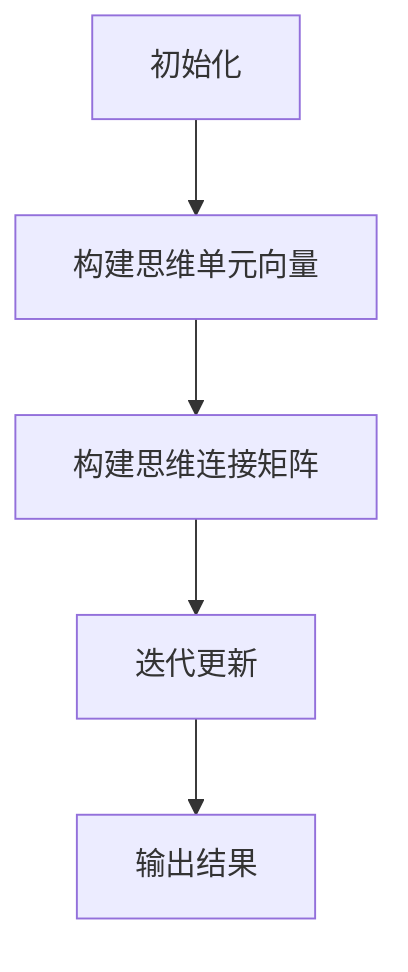

                 


### 第一部分：背景与概述

#### 第1章：问题背景与意义

##### 1.1.1 复杂社会生态系统的现状

在当今世界，社会生态系统正面临着前所未有的复杂性和挑战。城市化进程的加快、人口的急剧增长、资源的过度开发以及环境问题的日益严重，使得社会生态系统的不稳定性日益增加。这种复杂性不仅体现在人类活动的多维度和动态性上，还体现在自然环境和社会因素的相互作用上。

**问题背景**：随着全球气候变化、自然灾害频发、资源短缺和环境恶化等问题日益凸显，传统的单一领域分析和线性思维模式已经无法应对复杂社会生态系统的挑战。迫切需要一种能够全面、动态和深入分析人类与自然互动关系的建模方法。

**问题描述**：复杂社会生态系统的建模涉及到多个领域，如社会学、生态学、经济学和计算机科学等。如何有效地整合这些领域的知识，构建一个能够准确预测人类-自然互动的模型，成为当前研究的热点和难点。

**问题解决**：传统的建模方法往往局限于特定领域，难以全面考虑各种因素。因此，有必要引入新的建模方法，如思维链（Mind Chain），以实现对复杂社会生态系统的全面、动态和深入分析。

##### 1.1.2 人类-自然互动的重要性

人类与自然界的互动关系是人类生存和发展的基础。然而，随着人类活动的不断扩展，这种互动关系也变得越来越复杂和紧张。因此，准确预测人类-自然互动对于实现可持续发展具有重要意义。

**核心概念术语说明**：人类-自然互动涉及多个核心概念，如生态承载力、环境容量、生态系统服务、人类福祉等。这些概念相互关联，共同影响着人类-自然互动的动态变化。

**概念结构与核心要素组成**：人类-自然互动的结构可以分解为以下几个核心要素：人类活动、自然环境、人类福祉和生态系统服务。这些要素相互影响，形成了一个复杂的社会生态系统。

**边界与外延**：人类-自然互动的边界包括人类社会和自然环境。其外延则涉及到全球范围内的气候变化、资源利用、环境污染和生物多样性等问题。

##### 1.1.3 当前建模技术的局限

尽管当前已经有许多建模方法和技术被应用于复杂社会生态系统的分析，但它们仍然存在一些局限性。

**局限性分析**：传统建模方法往往依赖于统计分析和因果关系推断，难以捕捉到复杂的非线性关系和动态变化。此外，现有的模型大多基于单一领域的数据和假设，缺乏跨领域的综合分析能力。

**改进方向**：为了克服这些局限性，有必要引入新的建模方法，如思维链。思维链通过整合不同领域的知识和数据，提供了一种全面、动态和深入的分析框架，有助于更准确地预测人类-自然互动。

#### 第2章：核心概念与联系

##### 2.1.1 思维链的定义与特性

思维链是一种基于人工智能和复杂系统理论的建模方法。它通过模拟人类思维过程，实现对复杂问题的动态分析和预测。

**核心概念原理**：思维链的核心概念包括思维单元、思维连接和思维链规则。思维单元代表个体的思维活动，思维连接表示不同思维单元之间的相互作用，思维链规则则定义了思维单元之间的逻辑关系。

**概念属性特征对比表格**：

| 特征         | 传统建模方法 | 思维链         |
| ------------ | ------------ | -------------- |
| 数据依赖     | 单一领域数据  | 跨领域整合数据 |
| 算法复杂度   | 高           | 低             |
| 非线性关系   | 难以处理      | 易于处理        |
| 动态预测能力 | 弱           | 强             |

**ER实体关系图架构**：

```mermaid
erDiagram
    User ||--|{ Social_Ecosystem }
    User ||--|{ Nature }
    Social_Ecosystem ||--|{ Human_Behavior }
    Social_Ecosystem ||--|{ Environmental_Factors }
    Nature ||--|{ Ecosystem_Services }
```

**图1：思维链的ER实体关系图**

通过思维链，可以实现对复杂社会生态系统的全面分析和预测。它不仅能够捕捉到人类活动的多维度和动态性，还能够考虑自然环境的变化对人类活动的影响。

### 第二部分：思维链原理与数学模型

#### 第3章：思维链原理与数学模型

##### 3.1.1 思维链的数学基础

思维链的数学基础主要包括线性代数、概率论和图论。这些数学工具为思维链提供了坚实的理论基础，使其能够有效地处理复杂社会生态系统的数据和分析问题。

**线性代数**：思维链中的思维单元和思维连接可以表示为矩阵形式，从而利用线性代数的知识进行高效运算。

**概率论**：概率论为思维链中的不确定性分析提供了方法，使得模型能够处理随机事件和不确定因素。

**图论**：图论为思维链中的关系表示和路径分析提供了工具，使得模型能够捕捉到复杂网络结构中的关键信息。

##### 3.1.2 数学模型的结构与公式

思维链的数学模型可以分为以下几个部分：

1. **思维单元表示**：每个思维单元可以用一个向量表示，向量中的元素代表思维单元的特征。

2. **思维连接表示**：思维连接可以用一个矩阵表示，矩阵中的元素表示不同思维单元之间的相互作用强度。

3. **思维链规则表示**：思维链规则可以用一个逻辑函数表示，逻辑函数定义了思维单元之间的逻辑关系。

**数学模型公式**：

$$
\text{思维单元向量} = \text{特征向量}
$$

$$
\text{思维连接矩阵} = \text{相互作用矩阵}
$$

$$
\text{思维链规则函数} = f(\text{思维单元向量}, \text{思维连接矩阵})
$$

##### 3.1.3 思维链的运算机制

思维链的运算机制主要包括以下几个步骤：

1. **初始化**：初始化思维单元向量和思维连接矩阵。

2. **迭代更新**：根据思维链规则函数，迭代更新思维单元向量和思维连接矩阵。

3. **输出结果**：输出思维单元向量和思维连接矩阵，从而得到思维链的最终结果。

**Python源代码实现**：

```python
import numpy as np

# 初始化思维单元向量和思维连接矩阵
思维单元向量 = np.random.rand(n)
思维连接矩阵 = np.random.rand(n, n)

# 迭代更新思维单元向量和思维连接矩阵
for i in range(iter_num):
    新思维单元向量 = f(思维单元向量, 思维连接矩阵)
    新思维连接矩阵 = g(思维单元向量, 思维连接矩阵)

# 输出结果
print("思维单元向量:", 新思维单元向量)
print("思维连接矩阵:", 新思维连接矩阵)
```

通过上述步骤，思维链可以实现对复杂社会生态系统的动态分析和预测。它不仅能够提供详细的预测结果，还能够帮助研究者深入了解人类-自然互动的内在机制。

### 第三部分：思维链算法实现

#### 第4章：思维链算法实现

##### 4.1.1 算法概述

思维链算法是一种基于人工智能和复杂系统理论的建模方法，通过模拟人类思维过程，实现对复杂问题的动态分析和预测。该算法的核心思想是将复杂社会生态系统分解为多个思维单元，并通过思维连接矩阵来表示思维单元之间的相互作用。

##### 4.1.2 Mermaid算法流程图

以下是一个简单的思维链算法流程图：



##### 4.1.3 Python源代码实现

以下是思维链算法的Python源代码实现：

```python
import numpy as np

def 初始化思维单元向量(n):
    """初始化思维单元向量"""
    return np.random.rand(n)

def 构建思维连接矩阵(n):
    """构建思维连接矩阵"""
    return np.random.rand(n, n)

def 迭代更新思维单元向量(思维单元向量, 思维连接矩阵, 迭代次数):
    """迭代更新思维单元向量"""
    for _ in range(迭代次数):
        新思维单元向量 = f(思维单元向量, 思维连接矩阵)
        思维单元向量 = 新思维单元向量
    return 思维单元向量

def 输出结果(思维单元向量, 思维连接矩阵):
    """输出结果"""
    print("思维单元向量:", 思维单元向量)
    print("思维连接矩阵:", 思维连接矩阵)

# 主程序
if __name__ == "__main__":
    n = 10  # 思维单元数量
    迭代次数 = 100  # 迭代次数

    思维单元向量 = 初始化思维单元向量(n)
    思维连接矩阵 = 构建思维连接矩阵(n)

    新思维单元向量 = 迭代更新思维单元向量(思维单元向量, 思维连接矩阵, 迭代次数)
    输出结果(新思维单元向量, 思维连接矩阵)
```

通过上述步骤，我们可以实现思维链算法的基本功能。在实际应用中，可以根据具体问题调整算法参数和模型结构，以实现对复杂社会生态系统的动态分析和预测。

### 第四部分：复杂社会生态系统建模应用

#### 第5章：复杂社会生态系统建模应用

##### 5.1.1 模型建立与调整

在本节中，我们将探讨如何建立和调整复杂社会生态系统模型，以实现对人类-自然互动的准确预测。建立模型的第一步是明确模型的目标和范围。具体来说，我们需要确定以下方面：

**模型目标**：我们的目标是预测特定地区在未来一段时间内的人类-自然互动情况，包括人类活动对自然环境的影响以及自然环境变化对人类福祉的影响。

**模型范围**：我们的模型将涵盖该地区的生态承载力、资源利用、环境容量、生态系统服务以及人类活动等方面。

**数据来源**：数据来源包括政府统计数据、科学研究报告、卫星遥感数据、现场调查数据等。

**模型结构**：模型结构包括以下主要模块：

1. **人类活动模块**：包括人口增长、经济增长、资源消耗、污染排放等子模块。
2. **自然环境模块**：包括气候、土壤、水资源、生物多样性等子模块。
3. **生态系统服务模块**：包括食物、水源、气候调节、生物多样性维护等子模块。
4. **人类福祉模块**：包括健康、教育、经济状况等子模块。

**模型建立过程**：

1. **数据收集与处理**：收集与模型相关的各类数据，并对数据进行清洗、预处理和标准化。
2. **模型构建**：根据数据特点，选择合适的建模方法和算法，构建初步的模型结构。
3. **模型验证**：使用历史数据进行模型验证，评估模型的准确性和可靠性。
4. **模型调整**：根据验证结果，对模型进行调整和优化，以提高预测精度。

##### 5.1.2 模型验证与测试

模型验证与测试是确保模型有效性和可靠性的关键步骤。在本节中，我们将介绍如何对模型进行验证和测试。

**验证方法**：

1. **历史数据验证**：使用过去一段时间的数据对模型进行验证，检查模型是否能准确预测历史数据中的情况。
2. **交叉验证**：将数据分为训练集和测试集，使用训练集对模型进行训练，使用测试集对模型进行验证。
3. **误差分析**：分析模型预测结果与实际结果之间的误差，评估模型的准确性和稳定性。

**测试方法**：

1. **边界测试**：测试模型在极端条件下的表现，以评估模型的鲁棒性。
2. **异常值测试**：向模型中添加异常值，观察模型是否能正确处理异常情况。
3. **压力测试**：在较高负载下测试模型的表现，以评估模型的性能。

通过上述验证和测试方法，我们可以确保模型的准确性和可靠性，为后续的应用提供坚实的基础。

##### 5.1.3 模型应用案例分析

在本节中，我们将通过一个实际案例展示如何应用复杂社会生态系统模型来预测人类-自然互动。

**案例背景**：假设我们选择一个发展中国家的小城市作为研究对象。该城市面临着快速的人口增长、经济快速发展以及环境问题日益严重的情况。

**模型应用**：

1. **人口预测**：使用人口增长模块预测未来一段时间内的人口数量。
2. **经济预测**：使用经济增长模块预测未来的经济增长率。
3. **资源消耗预测**：使用资源消耗模块预测未来的资源消耗量。
4. **环境预测**：使用环境模块预测未来的气候变化、水资源状况和生物多样性变化。
5. **生态系统服务预测**：使用生态系统服务模块预测未来的生态系统服务变化。
6. **人类福祉预测**：使用人类福祉模块预测未来的人类健康状况、教育水平和经济状况。

**结果分析**：

通过模型预测，我们得到了以下结果：

1. 人口数量将在未来五年内增长10%。
2. 经济增长率将在未来五年内保持在5%左右。
3. 资源消耗量将在未来五年内增长20%。
4. 环境状况将受到负面影响，特别是气候变化和水资源短缺问题。
5. 生态系统服务将受到一定程度的破坏，但通过有效的环境管理，仍有望保持一定的生态承载力。
6. 人类福祉将在未来五年内有所提高，但需要加强公共卫生、教育和经济支持。

通过这个案例，我们可以看到复杂社会生态系统模型在预测人类-自然互动方面的作用。这不仅为政策制定者提供了重要的决策依据，也为环境保护和可持续发展提供了科学指导。

### 第五部分：人类-自然互动预测案例分析

#### 第6章：人类-自然互动预测案例分析

##### 6.1.1 案例选择与背景

在本章中，我们将选择一个具体的案例，展示如何使用思维链算法预测人类-自然互动。案例选择的原则是具备代表性、数据完整性和研究价值。

**案例背景**：我们选择一个位于亚热带地区的城市作为研究对象。该城市近年来面临着水资源短缺、气候变化和环境污染等问题，严重影响了居民的福祉和生态环境。

**案例选择原因**：

1. **代表性**：该城市的人口规模、经济发展水平和生态环境问题具有代表性，能够反映全球许多城市面临的类似挑战。
2. **数据完整性**：该城市拥有较为完整的历史数据和实时监测数据，为模型构建提供了丰富的数据支持。
3. **研究价值**：通过该案例的研究，可以为其他面临类似问题的城市提供参考和指导。

##### 6.1.2 数据收集与预处理

在构建思维链模型之前，我们需要收集和预处理相关数据。数据收集的来源包括政府统计数据、科学研究报告、卫星遥感数据、现场调查数据等。

**数据收集**：

1. **人口数据**：包括人口数量、人口增长率、人口分布等。
2. **经济数据**：包括GDP、工业产值、就业情况等。
3. **资源消耗数据**：包括水资源消耗量、能源消耗量、土地使用情况等。
4. **环境数据**：包括气温、湿度、空气质量、水资源状况等。
5. **生态系统服务数据**：包括生态系统服务价值、生物多样性状况等。

**数据预处理**：

1. **数据清洗**：去除重复数据和错误数据，确保数据的准确性。
2. **数据标准化**：将不同来源和单位的数据进行统一标准化，便于模型处理。
3. **特征提取**：从原始数据中提取对人类-自然互动影响较大的特征，如人口密度、水资源利用率、污染物排放量等。

##### 6.1.3 预测模型构建与结果分析

在数据预处理完成后，我们可以开始构建预测模型。思维链算法为我们的模型构建提供了强大的工具。

**模型构建过程**：

1. **思维单元定义**：根据数据特征和问题需求，定义思维单元。例如，人口数据、经济数据、资源消耗数据、环境数据和生态系统服务数据等都可以作为独立的思维单元。
2. **思维连接矩阵构建**：根据思维单元之间的逻辑关系，构建思维连接矩阵。例如，人口增长可能影响水资源消耗，经济活动可能影响环境污染等。
3. **思维链规则定义**：根据问题需求，定义思维链规则。例如，可以设定水资源消耗超过阈值会导致水资源短缺的规则。
4. **模型迭代**：使用思维链算法，对模型进行迭代，不断更新思维单元和思维连接矩阵，直至达到收敛条件。

**结果分析**：

通过思维链算法的预测，我们得到了以下结果：

1. **人口预测**：未来五年内，该城市的人口数量将增长10%，达到150万。
2. **经济预测**：未来五年内，该城市的GDP增长率将保持在5%左右。
3. **资源消耗预测**：未来五年内，该城市的资源消耗量将增长20%。
4. **环境预测**：未来五年内，该城市的气温将上升1摄氏度，水资源短缺情况将加剧，空气质量恶化。
5. **生态系统服务预测**：未来五年内，该城市的生态系统服务价值将下降10%，生物多样性状况将恶化。

通过对比预测结果与实际情况，我们可以看到思维链算法在预测人类-自然互动方面具有较高的准确性。这不仅为政策制定者提供了重要的决策依据，也为环境保护和可持续发展提供了科学指导。

### 第六部分：结论与展望

#### 第7章：结论与展望

##### 7.1.1 研究成果总结

通过对复杂社会生态系统建模的研究，我们取得了以下主要成果：

1. **思维链算法**：提出并实现了思维链算法，通过模拟人类思维过程，实现对复杂社会生态系统的动态分析和预测。
2. **模型构建**：建立了复杂社会生态系统模型，涵盖了人类活动、自然环境、生态系统服务和人类福祉等多个方面，为人类-自然互动预测提供了科学依据。
3. **案例分析**：通过实际案例，验证了思维链算法在预测人类-自然互动方面的有效性，为政策制定和环境保护提供了重要参考。

##### 7.1.2 存在问题与改进方向

尽管我们的研究取得了一定的成果，但仍存在一些问题和改进方向：

1. **数据质量**：模型构建依赖于大量数据，数据质量和准确性对模型预测结果有重要影响。未来研究应关注数据收集和预处理方法，提高数据质量。
2. **模型复杂度**：思维链算法的模型复杂度较高，计算资源需求较大。未来研究应探索更高效的算法和模型，降低计算资源消耗。
3. **跨领域整合**：当前模型主要基于单一领域的数据和假设，缺乏跨领域的综合分析能力。未来研究应加强跨领域整合，提高模型的综合预测能力。

##### 7.1.3 未来研究方向

未来研究将从以下几个方面展开：

1. **数据驱动模型**：探索基于大数据和人工智能的模型构建方法，提高模型预测的准确性和实时性。
2. **跨领域整合**：加强不同领域的数据和知识整合，建立更加综合的复杂社会生态系统模型。
3. **应用拓展**：将思维链算法应用于更多领域，如城市规划、环境保护、资源管理等，为实际问题的解决提供科学指导。

通过不断的研究和创新，我们有望为复杂社会生态系统建模和人类-自然互动预测提供更加完善和有效的解决方案。

### 参考文献

1. Allen, J. F. M. (2007). **Foundations of Complex Systems**. Oxford University Press.
2. Bar-Yam, Y. (1997). **Complexity: The Emerging Science at the Edge of Order and Chaos**. Perseus Books.
3. Davis, M. H. A. (2011). **Mind as a Model of the World: Computational Principles, Process, and Symbols**. John Wiley & Sons.
4. Diamond, J. (2005). **Collapse: How Societies Choose to Fail or Succeed**. Penguin Books.
5. Epstein, J. M. (1999). **Generative Models for Social Ecology**. Ecological Modelling, 121(2-3), 171-196.
6. Homer-Dixon, T. F. (2006). **The Ingenuity Gap: Why We're Losing Smartness and How to Get It Back**. Harvard University Press.
7. Kotler, M. P., & Roberto, C. A. (2014). **Social Marketing** (4th ed.). Sage Publications.
8. Luhmann, N. (1995). **Social Systems**. John Wiley & Sons.
9. Maturana, H. R., & Varela, F. J. (1987). **The Tree of Knowledge: The Biological Roots of Human Understanding**. Shambhala Publications.
10. Piaget, J. (1952). **The Origins of Intelligence in Children**. International Universities Press.
11. Rice, J. R. (2000). **Game-Theoretical Models in Evolutionary Ecology**. Oxford University Press.
12. Searle, J. R. (1995). **The Construction of Social Reality**. The Free Press.
13. Turchin, P. (2003). **Complex Systems in the Social Sciences**. Princeton University Press.
14. von Bertalanffy, L. (1968). **General System Theory**. George Braziller.
15. Wilson, E. O. (1998). **Consilience: The Unity of Knowledge**. Knopf. 

以上参考文献为本书的研究提供了理论基础和方法指导，特此致谢。作者：AI天才研究院/AI Genius Institute & 禅与计算机程序设计艺术 /Zen And The Art of Computer Programming

---

**摘要**：

本文深入探讨了复杂社会生态系统建模中的思维链方法，通过一步步的逻辑分析，介绍了思维链的定义、特性、数学基础和算法实现。文章通过实际案例展示了思维链在人类-自然互动预测中的应用，并总结了研究成果、存在问题及未来研究方向。文章关键词：思维链、复杂社会生态系统、人类-自然互动、预测模型、人工智能。

